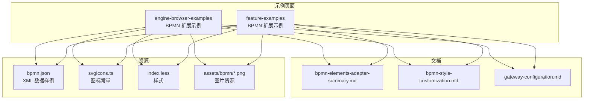
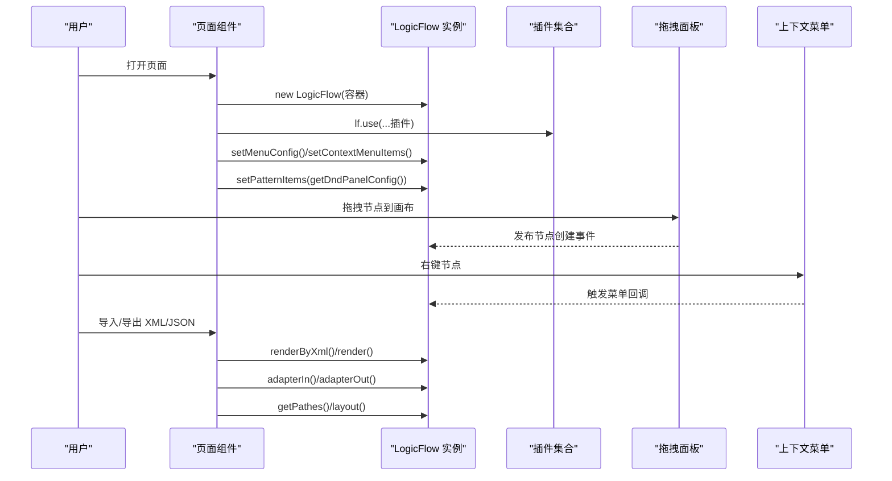
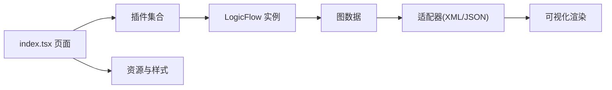
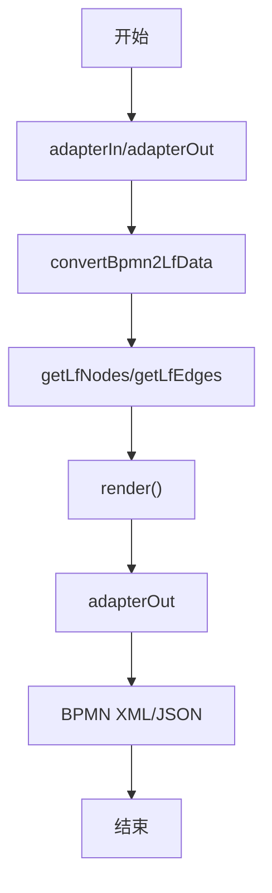

# BPMN 元素映射与可视化

<cite>
**本文引用的文件**
- [examples/engine-browser-examples/src/pages/extension/bpmn/index.tsx](file://examples/engine-browser-examples/src/pages/extension/bpmn/index.tsx)
- [examples/engine-browser-examples/src/pages/extension/bpmn/bpmn.json](file://examples/engine-browser-examples/src/pages/extension/bpmn/bpmn.json)
- [examples/engine-browser-examples/src/pages/extension/bpmn/index.less](file://examples/engine-browser-examples/src/pages/extension/bpmn/index.less)
- [examples/engine-browser-examples/src/pages/extension/bpmn/svgIcons.ts](file://examples/engine-browser-examples/src/pages/extension/bpmn/svgIcons.ts)
- [examples/feature-examples/src/pages/extensions/bpmn/index.tsx](file://examples/feature-examples/src/pages/extensions/bpmn/index.tsx)
- [examples/feature-examples/src/pages/extensions/bpmn/bpmn.json](file://examples/feature-examples/src/pages/extensions/bpmn/bpmn.json)
- [examples/feature-examples/src/pages/extensions/bpmn/index.less](file://examples/feature-examples/src/pages/extensions/bpmn/index.less)
- [examples/feature-examples/src/pages/extensions/bpmn/svgIcons.ts](file://examples/feature-examples/src/pages/extensions/bpmn/svgIcons.ts)
- [flow-docs/bpmn-elements-adapter-summary.md](file://flow-docs/bpmn-elements-adapter-summary.md)
- [flow-docs/bpmn-style-customization.md](file://flow-docs/bpmn-style-customization.md)
- [flow-docs/gateway-configuration.md](file://flow-docs/gateway-configuration.md)
</cite>

## 目录
1. [简介](#简介)
2. [项目结构](#项目结构)
3. [核心组件](#核心组件)
4. [架构总览](#架构总览)
5. [详细组件分析](#详细组件分析)
6. [依赖分析](#依赖分析)
7. [性能考量](#性能考量)
8. [故障排查指南](#故障排查指南)
9. [结论](#结论)
10. [附录](#附录)

## 简介
本文件面向 LogicFlow BPMN 扩展的“元素映射与可视化”主题，系统梳理项目中已支持的 BPMN 元素类型、可视化呈现与交互行为、尺寸与样式配置、自定义节点实现方法、元素关系映射与约束规则，并提供扩展自定义元素与节点视图的实践指南。文档同时给出基于仓库现有示例的可视化流程图与交互序列图，帮助读者快速落地。

## 项目结构
本项目在 examples 下提供了两套 BPMN 示例页面，分别展示了基础与增强插件能力；flow-docs 提供了元素适配、样式定制与网关配置的权威说明文档。BPMN 资源图片与图标常量位于 examples 与 src/assets 中，便于在页面中直接引用。

图表来源
- [examples/engine-browser-examples/src/pages/extension/bpmn/index.tsx](file://examples/engine-browser-examples/src/pages/extension/bpmn/index.tsx#L1-L355)
- [examples/feature-examples/src/pages/extensions/bpmn/index.tsx](file://examples/feature-examples/src/pages/extensions/bpmn/index.tsx#L1-L367)
- [flow-docs/bpmn-elements-adapter-summary.md](file://flow-docs/bpmn-elements-adapter-summary.md#L1-L460)
- [flow-docs/bpmn-style-customization.md](file://flow-docs/bpmn-style-customization.md#L1-L668)
- [flow-docs/gateway-configuration.md](file://flow-docs/gateway-configuration.md#L1-L800)

章节来源
- [examples/engine-browser-examples/src/pages/extension/bpmn/index.tsx](file://examples/engine-browser-examples/src/pages/extension/bpmn/index.tsx#L1-L355)
- [examples/feature-examples/src/pages/extensions/bpmn/index.tsx](file://examples/feature-examples/src/pages/extensions/bpmn/index.tsx#L1-L367)

## 核心组件
- 插件与配置
  - BpmnElement、BpmnXmlAdapter、AutoLayout、DndPanel、Menu、ContextMenu、Group、Control、MiniMap、FlowPath、SelectionSelect、Snapshot 等插件按需启用。
  - 通过 setMenuConfig、setContextMenuItems、setContextMenuByType 等接口配置右键菜单与上下文行为。
- 拖拽面板与模式项
  - setPatternItems 与 openSelectionSelect/closeSelectionSelect 实现“选区”拖拽与框选交互。
- 数据导入导出
  - renderByXml/render 与 adapterIn/adapterOut（feature-examples）实现 XML/JSON 互转与渲染。
- 路径与布局
  - getPathes/getRawPathes、layout、setStartNodeType 等 API 支持路径计算与自动布局。

章节来源
- [examples/engine-browser-examples/src/pages/extension/bpmn/index.tsx](file://examples/engine-browser-examples/src/pages/extension/bpmn/index.tsx#L29-L60)
- [examples/engine-browser-examples/src/pages/extension/bpmn/index.tsx](file://examples/engine-browser-examples/src/pages/extension/bpmn/index.tsx#L144-L355)
- [examples/feature-examples/src/pages/extensions/bpmn/index.tsx](file://examples/feature-examples/src/pages/extensions/bpmn/index.tsx#L30-L60)
- [examples/feature-examples/src/pages/extensions/bpmn/index.tsx](file://examples/feature-examples/src/pages/extensions/bpmn/index.tsx#L145-L367)

## 架构总览
下图展示页面初始化、插件装配、拖拽面板、菜单与交互、数据导入导出以及路径/布局等关键流程。

图表来源
- [examples/engine-browser-examples/src/pages/extension/bpmn/index.tsx](file://examples/engine-browser-examples/src/pages/extension/bpmn/index.tsx#L156-L232)
- [examples/engine-browser-examples/src/pages/extension/bpmn/index.tsx](file://examples/engine-browser-examples/src/pages/extension/bpmn/index.tsx#L177-L181)
- [examples/feature-examples/src/pages/extensions/bpmn/index.tsx](file://examples/feature-examples/src/pages/extensions/bpmn/index.tsx#L158-L231)
- [examples/feature-examples/src/pages/extensions/bpmn/index.tsx](file://examples/feature-examples/src/pages/extensions/bpmn/index.tsx#L239-L250)

## 详细组件分析

### 支持的 BPMN 元素清单与可视化
- 事件类型
  - 开始事件：bpmn:startEvent
  - 结束事件：bpmn:endEvent
  - 中间捕获事件：bpmn:intermediateCatchEvent
  - 中间抛出事件：bpmn:intermediateThrowEvent
  - 边界事件：bpmn:boundaryEvent
- 任务类型
  - 用户任务：bpmn:userTask
  - 服务任务：bpmn:serviceTask
  - 子流程：bpmn:subProcess
- 活动类型
  - 顺序流：bpmn:sequenceFlow
- 网关类型
  - 排他网关：bpmn:exclusiveGateway
  - 并行网关：bpmn:parallelGateway
  - 包容网关：bpmn:inclusiveGateway

可视化呈现与交互要点
- 事件节点：圆形，支持内外双环等自定义渲染（见样式定制文档示例）。
- 任务节点：矩形，支持图标渲染与高亮（见样式定制文档示例）。
- 网关节点：菱形，内置排他/并行/包容图标，支持自定义图标与渲染。
- 顺序流：折线边，支持条件表达式与文本标注。

章节来源
- [flow-docs/bpmn-elements-adapter-summary.md](file://flow-docs/bpmn-elements-adapter-summary.md#L26-L47)
- [flow-docs/bpmn-style-customization.md](file://flow-docs/bpmn-style-customization.md#L230-L320)
- [flow-docs/gateway-configuration.md](file://flow-docs/gateway-configuration.md#L17-L46)

### 元素尺寸配置与样式定义
- 尺寸配置（来自适配器总结）
  - 开始事件：宽高 40
  - 结束事件：宽高 40
  - 边界事件：宽高 100×80
  - 中间事件：宽高 100×80
  - 网关：排他/并行/包容均为 100×80
  - 任务：用户/服务/子流程均为 100×80
- 主题与样式
  - 全局主题：rect/circle/polygon/polyline/edgeText 等属性统一配置。
  - 节点样式覆盖：在 Model 中重写 getNodeStyle()。
  - 自定义渲染：在 View 中重写 getShape()，使用 h() 组合 SVG 元素。
  - 图标自定义：通过工厂函数 icon 参数或 h() 组合复杂图标。

章节来源
- [flow-docs/bpmn-elements-adapter-summary.md](file://flow-docs/bpmn-elements-adapter-summary.md#L50-L63)
- [flow-docs/bpmn-style-customization.md](file://flow-docs/bpmn-style-customization.md#L14-L93)
- [flow-docs/bpmn-style-customization.md](file://flow-docs/bpmn-style-customization.md#L133-L228)
- [flow-docs/bpmn-style-customization.md](file://flow-docs/bpmn-style-customization.md#L230-L358)
- [flow-docs/bpmn-style-customization.md](file://flow-docs/bpmn-style-customization.md#L384-L455)

### 自定义节点与节点视图实现
- 工厂函数
  - 网关工厂：GatewayNodeFactory(type, icon, props)，支持字符串 SVG 或 h() 对象。
  - 任务工厂：TaskNodeFactory(type, icon, props)。
- 自定义示例
  - 高亮网关：自定义 Model 设置高亮样式，自定义 View 组合 SVG。
  - 带状态任务：根据状态动态切换样式与添加动画层。
- 图标常量
  - svgIcons.ts 提供 startEventIcon、endEventIcon、userTaskIcon、serviceTaskIcon、exclusiveGatewayIcon、groupIcon、selectionIcon、deleteMenuIcon 等。

章节来源
- [flow-docs/bpmn-style-customization.md](file://flow-docs/bpmn-style-customization.md#L456-L600)
- [flow-docs/bpmn-style-customization.md](file://flow-docs/bpmn-style-customization.md#L438-L455)
- [examples/engine-browser-examples/src/pages/extension/bpmn/svgIcons.ts](file://examples/engine-browser-examples/src/pages/extension/bpmn/svgIcons.ts#L1-L24)
- [examples/feature-examples/src/pages/extensions/bpmn/svgIcons.ts](file://examples/feature-examples/src/pages/extensions/bpmn/svgIcons.ts#L1-L24)

### 元素关系映射与约束规则
- XML/JSON 数据结构
  - definitions/process/element 列表与 incoming/outgoing 引用关系。
  - BPMNDiagram/BPMNPlane 中包含 BPMNEdge/BPMNShape，描述坐标与路径点。
- 适配器行为
  - 导入：convertBpmn2LfData → convertXmlToNormal → getLfNodes/getLfEdges。
  - 导出：convertNormalToXml → convertLf2ProcessData/convertLf2DiagramData。
  - 特殊处理：边界事件 attachedToRef、子流程递归、自定义元素与类型映射。
- 约束规则
  - 排他网关：至少一条出口条件为真；并行网关分叉/汇聚需成对；包容网关需设置默认路径以防无条件满足。

章节来源
- [examples/engine-browser-examples/src/pages/extension/bpmn/bpmn.json](file://examples/engine-browser-examples/src/pages/extension/bpmn/bpmn.json#L1-L256)
- [examples/feature-examples/src/pages/extensions/bpmn/bpmn.json](file://examples/feature-examples/src/pages/extensions/bpmn/bpmn.json#L1-L256)
- [flow-docs/bpmn-elements-adapter-summary.md](file://flow-docs/bpmn-elements-adapter-summary.md#L396-L444)
- [flow-docs/gateway-configuration.md](file://flow-docs/gateway-configuration.md#L711-L731)

### 交互实现指南
- 选择与拖拽
  - openSelectionSelect/closeSelectionSelect 实现框选；setPatternItems 提供拖拽模式项。
- 右键菜单
  - setMenuConfig/setContextMenuItems/setContextMenuByType 配置通用与按类型菜单项。
- 数据导入导出
  - engine-browser-examples：renderByXml/render；feature-examples：adapterIn/adapterOut。
- 路径与布局
  - setStartNodeType + getPathes 获取路径；layout 进行自动布局；getRawPathes 获取原始路径。

章节来源
- [examples/engine-browser-examples/src/pages/extension/bpmn/index.tsx](file://examples/engine-browser-examples/src/pages/extension/bpmn/index.tsx#L130-L142)
- [examples/engine-browser-examples/src/pages/extension/bpmn/index.tsx](file://examples/engine-browser-examples/src/pages/extension/bpmn/index.tsx#L163-L178)
- [examples/engine-browser-examples/src/pages/extension/bpmn/index.tsx](file://examples/engine-browser-examples/src/pages/extension/bpmn/index.tsx#L252-L268)
- [examples/feature-examples/src/pages/extensions/bpmn/index.tsx](file://examples/feature-examples/src/pages/extensions/bpmn/index.tsx#L131-L143)
- [examples/feature-examples/src/pages/extensions/bpmn/index.tsx](file://examples/feature-examples/src/pages/extensions/bpmn/index.tsx#L165-L177)
- [examples/feature-examples/src/pages/extensions/bpmn/index.tsx](file://examples/feature-examples/src/pages/extensions/bpmn/index.tsx#L252-L267)

### 网关配置与使用
- 三种网关图标与用途
  - 排他网关：X 形，条件分支，单路径。
  - 并行网关：+ 形，分叉/汇聚，所有路径并行。
  - 包容网关：O 形，条件分支，多路径并行。
- 工厂函数与注册
  - GatewayNodeFactory 创建视图与模型；registerGatewayNodes 注册内置网关。
- 自定义网关
  - 使用字符串 SVG 或 h() 组合复杂图标；可继承模型扩展属性与样式。

章节来源
- [flow-docs/gateway-configuration.md](file://flow-docs/gateway-configuration.md#L17-L46)
- [flow-docs/gateway-configuration.md](file://flow-docs/gateway-configuration.md#L269-L406)
- [flow-docs/gateway-configuration.md](file://flow-docs/gateway-configuration.md#L410-L495)

## 依赖分析
- 页面依赖插件与资源
  - 插件：BpmnElement、BpmnXmlAdapter、AutoLayout、DndPanel、Menu、ContextMenu、Group、Control、MiniMap、FlowPath、SelectionSelect、Snapshot。
  - 资源：index.less、svgIcons.ts、bpmn.json、图片资源。
- 交互链路
  - 拖拽面板 → LogicFlow 事件 → 插件处理 → 上下文菜单回调 → 数据导入导出 → 路径/布局。

图表来源
- [examples/engine-browser-examples/src/pages/extension/bpmn/index.tsx](file://examples/engine-browser-examples/src/pages/extension/bpmn/index.tsx#L36-L49)
- [examples/feature-examples/src/pages/extensions/bpmn/index.tsx](file://examples/feature-examples/src/pages/extensions/bpmn/index.tsx#L37-L49)
- [examples/engine-browser-examples/src/pages/extension/bpmn/index.less](file://examples/engine-browser-examples/src/pages/extension/bpmn/index.less#L1-L50)
- [examples/feature-examples/src/pages/extensions/bpmn/index.less](file://examples/feature-examples/src/pages/extensions/bpmn/index.less#L1-L49)

章节来源
- [examples/engine-browser-examples/src/pages/extension/bpmn/index.tsx](file://examples/engine-browser-examples/src/pages/extension/bpmn/index.tsx#L29-L60)
- [examples/feature-examples/src/pages/extensions/bpmn/index.tsx](file://examples/feature-examples/src/pages/extensions/bpmn/index.tsx#L30-L60)

## 性能考量
- 样式与渲染
  - 避免在 getShape() 中进行复杂计算；合理使用主题与样式覆盖减少重复计算。
- 数据规模
  - 大图建议分步渲染与懒加载；批量操作时合并更新以减少重绘。
- 交互优化
  - 合理使用 snapline/grid 与键盘快捷键；控制菜单与迷你地图的显示时机。

## 故障排查指南
- 导入/导出异常
  - 确认 XML/JSON 结构是否符合 definitions/process/edge/shape 约定；检查条件表达式与定时器定义。
- 网关路径问题
  - 排他网关需保证至少一条出口条件为真；并行网关分叉/汇聚需成对；包容网关需设置默认路径。
- 样式未生效
  - 检查主题覆盖顺序（节点级别 > 全局主题 > 默认样式）；确认属性名与 SVG 属性一致。

章节来源
- [flow-docs/bpmn-elements-adapter-summary.md](file://flow-docs/bpmn-elements-adapter-summary.md#L396-L444)
- [flow-docs/gateway-configuration.md](file://flow-docs/gateway-configuration.md#L723-L731)
- [flow-docs/bpmn-style-customization.md](file://flow-docs/bpmn-style-customization.md#L648-L660)

## 结论
本项目在 LogicFlow 基础上，通过 BpmnElement 与 BpmnXmlAdapter 插件，提供了较为完整的 BPMN 元素支持与可视化能力。结合样式定制与网关配置文档，开发者可快速实现从元素映射、尺寸与样式到自定义节点与交互的全流程开发。建议在实际项目中遵循适配器的数据转换流程与网关约束规则，确保导入导出与运行时行为的一致性。

## 附录

### 元素清单与可视化对照表
- 事件
  - 开始事件：圆形，支持内外双环渲染
  - 结束事件：圆形，支持内外双环渲染
  - 中间捕获/抛出/边界：矩形/菱形等，支持图标与高亮
- 任务
  - 用户任务：矩形，支持图标渲染
  - 服务任务：矩形，支持图标渲染
  - 子流程：矩形，支持图标渲染
- 活动
  - 顺序流：折线边，支持条件表达式
- 网关
  - 排他网关：X 形图标
  - 并行网关：+ 形图标
  - 包容网关：O 形图标

章节来源
- [flow-docs/bpmn-elements-adapter-summary.md](file://flow-docs/bpmn-elements-adapter-summary.md#L26-L47)
- [flow-docs/bpmn-style-customization.md](file://flow-docs/bpmn-style-customization.md#L230-L358)
- [flow-docs/gateway-configuration.md](file://flow-docs/gateway-configuration.md#L17-L46)

### 数据转换流程（导入/导出）

图表来源
- [flow-docs/bpmn-elements-adapter-summary.md](file://flow-docs/bpmn-elements-adapter-summary.md#L396-L422)