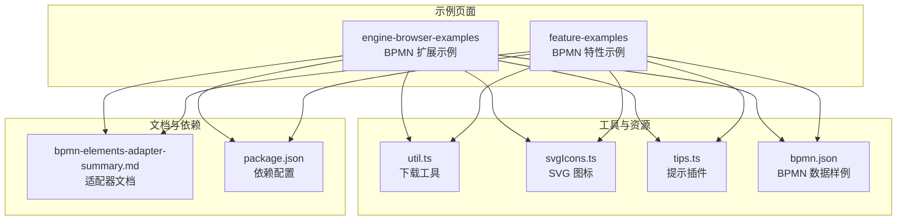
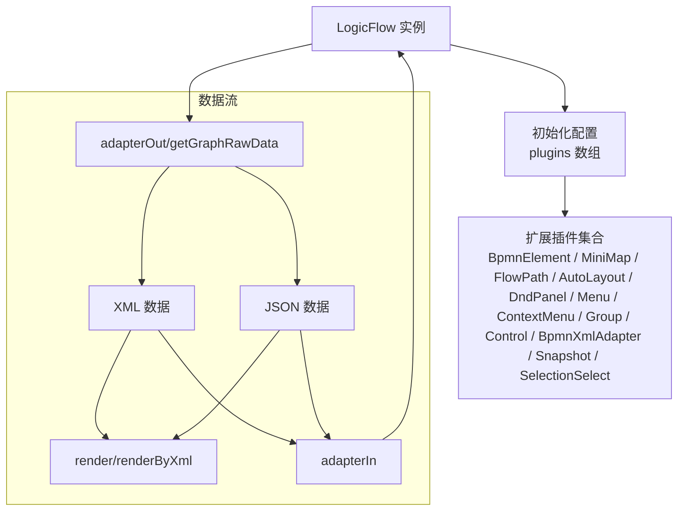
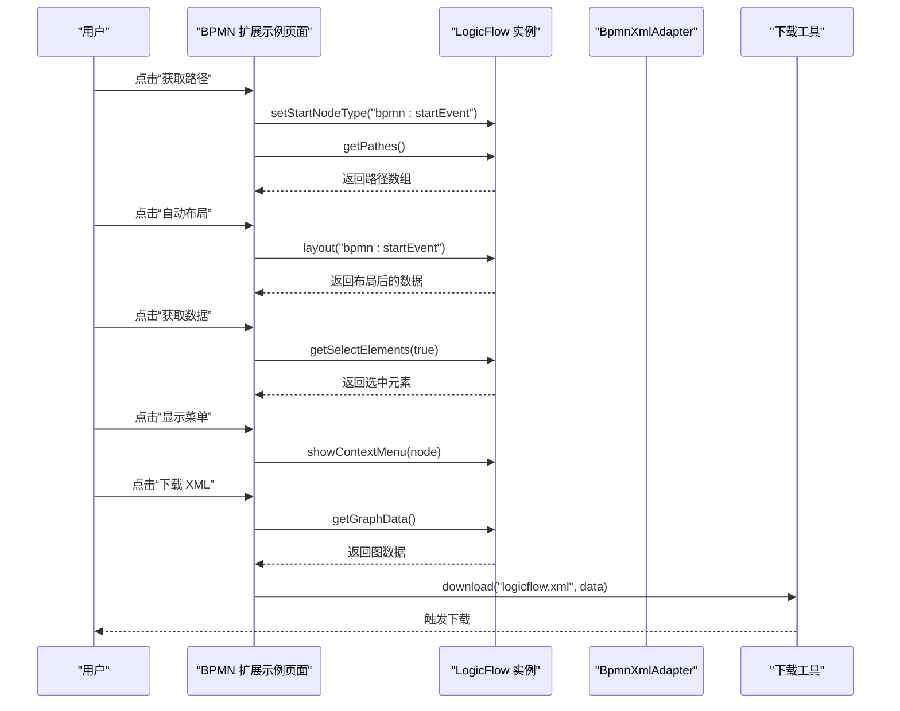
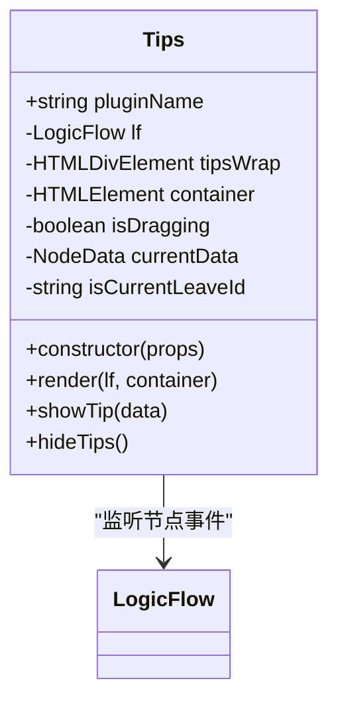
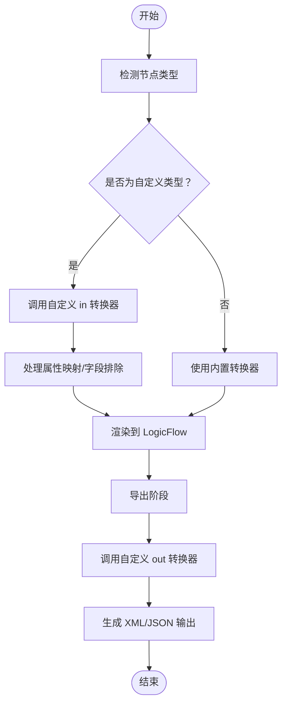
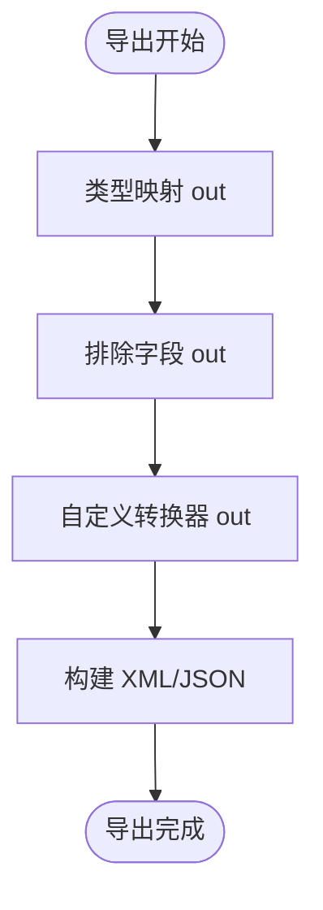
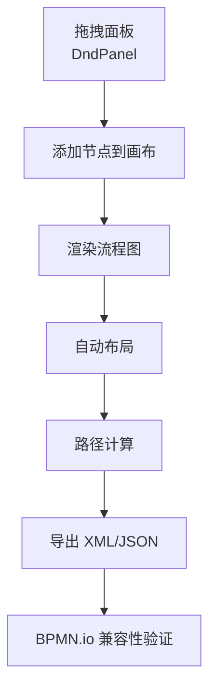
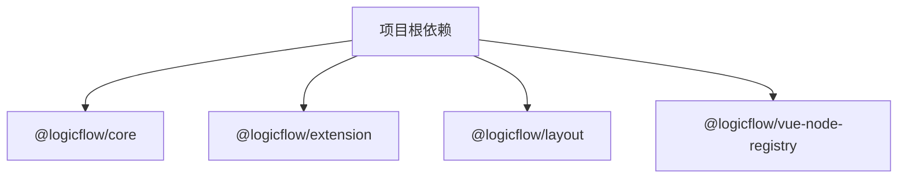

# BPMN 插件开发指南

<cite>
**本文档引用的文件**
- [index.tsx](file://examples/engine-browser-examples/src/pages/extension/bpmn/index.tsx)
- [index.tsx](file://examples/feature-examples/src/pages/extensions/bpmn/index.tsx)
- [util.ts](file://examples/engine-browser-examples/src/pages/extension/bpmn/util.ts)
- [util.ts](file://examples/feature-examples/src/pages/extensions/bpmn/util.ts)
- [svgIcons.ts](file://examples/engine-browser-examples/src/pages/extension/bpmn/svgIcons.ts)
- [svgIcons.ts](file://examples/feature-examples/src/pages/extensions/bpmn/svgIcons.ts)
- [tips.ts](file://examples/engine-browser-examples/src/pages/extension/bpmn/tips.ts)
- [tips.ts](file://examples/feature-examples/src/pages/extensions/bpmn/tips.ts)
- [bpmn.json](file://examples/engine-browser-examples/src/pages/extension/bpmn/bpmn.json)
- [bpmn.json](file://examples/feature-examples/src/pages/extensions/bpmn/bpmn.json)
- [bpmn-elements-adapter-summary.md](file://flow-docs/bpmn-elements-adapter-summary.md)
- [package.json](file://package.json)
</cite>

## 目录
1. [简介](#简介)
2. [项目结构](#项目结构)
3. [核心组件](#核心组件)
4. [架构概览](#架构概览)
5. [详细组件分析](#详细组件分析)
6. [依赖分析](#依赖分析)
7. [性能考虑](#性能考虑)
8. [故障排除指南](#故障排除指南)
9. [结论](#结论)
10. [附录](#附录)

## 简介
本指南面向希望在 LogicFlow 基础上扩展 BPMN 功能并开发自定义插件的开发者。文档基于仓库中的示例工程，系统讲解插件架构设计、开发模式、插件注册与配置传递、生命周期管理，以及完整的开发流程（从需求分析到实现测试）。同时，深入解析自定义转换器（输入转换器 in 与输出转换器 out）的实现方法，类型映射与排除字段配置的使用场景，并提供调试与测试的最佳实践及实际案例。

## 项目结构
该项目采用多示例工程组织方式，包含浏览器端示例与特性示例两套演示页面，均展示了如何在 LogicFlow 中集成 BPMN 元素与扩展插件能力。核心目录与文件如下：

- 示例页面
  - 浏览器端示例：examples/engine-browser-examples/src/pages/extension/bpmn/
  - 特性示例：examples/feature-examples/src/pages/extensions/bpmn/
- 工具与资源
  - 下载工具：util.ts
  - SVG 图标：svgIcons.ts
  - 提示插件：tips.ts
  - BPMN 数据样例：bpmn.json
- 文档资料
  - BPMN 元素适配器总结：flow-docs/bpmn-elements-adapter-summary.md
- 依赖配置
  - 根目录 package.json

**图表来源**
- [index.tsx](file://examples/engine-browser-examples/src/pages/extension/bpmn/index.tsx#L1-L355)
- [index.tsx](file://examples/feature-examples/src/pages/extensions/bpmn/index.tsx#L1-L367)
- [util.ts](file://examples/engine-browser-examples/src/pages/extension/bpmn/util.ts#L1-L15)
- [svgIcons.ts](file://examples/engine-browser-examples/src/pages/extension/bpmn/svgIcons.ts#L1-L24)
- [tips.ts](file://examples/engine-browser-examples/src/pages/extension/bpmn/tips.ts#L1-L91)
- [bpmn.json](file://examples/engine-browser-examples/src/pages/extension/bpmn/bpmn.json#L1-L256)
- [bpmn-elements-adapter-summary.md](file://flow-docs/bpmn-elements-adapter-summary.md#L1-L460)
- [package.json](file://package.json#L1-L45)

**章节来源**
- [index.tsx](file://examples/engine-browser-examples/src/pages/extension/bpmn/index.tsx#L1-L355)
- [index.tsx](file://examples/feature-examples/src/pages/extensions/bpmn/index.tsx#L1-L367)
- [package.json](file://package.json#L1-L45)

## 核心组件
本节聚焦于示例页面中的核心组件与职责划分，帮助开发者快速理解插件的装配与运行机制。

- LogicFlow 实例化与配置
  - 在示例中，LogicFlow 通过 Partial<Options> 进行初始化，启用网格、键盘快捷键、吸附线等交互能力，并注册一系列扩展插件（如 BpmnElement、MiniMap、FlowPath、AutoLayout、DndPanel、Menu、ContextMenu、Group、Control、BpmnXmlAdapter、Snapshot、SelectionSelect）。
  - 参考路径：[index.tsx](file://examples/engine-browser-examples/src/pages/extension/bpmn/index.tsx#L29-L59)、[index.tsx](file://examples/feature-examples/src/pages/extensions/bpmn/index.tsx#L30-L60)

- 插件注册与菜单配置
  - 通过 setMenuConfig 设置节点菜单与画布菜单；setContextMenuItems 为通用删除菜单项；setContextMenuByType 为特定类型（如 bpmn:userTask）设置上下文菜单。
  - 参考路径：[index.tsx](file://examples/engine-browser-examples/src/pages/extension/bpmn/index.tsx#L163-L175)、[index.tsx](file://examples/feature-examples/src/pages/extensions/bpmn/index.tsx#L165-L177)

- 拖拽面板（DnD Panel）配置
  - 通过 setPatternItems 注入默认图标配置（开始事件、用户任务、系统任务、排他网关、结束事件、分组），并支持“选区”模式的回调。
  - 参考路径：[index.tsx](file://examples/engine-browser-examples/src/pages/extension/bpmn/index.tsx#L92-L142)、[index.tsx](file://examples/feature-examples/src/pages/extensions/bpmn/index.tsx#L93-L143)

- 控制器与迷你地图集成
  - 通过 lf.extension 获取 control 与 miniMap 实例，动态向控制栏添加“导航”按钮，并在鼠标悬停/点击时显示迷你地图。
  - 参考路径：[index.tsx](file://examples/engine-browser-examples/src/pages/extension/bpmn/index.tsx#L181-L204)、[index.tsx](file://examples/feature-examples/src/pages/extensions/bpmn/index.tsx#L183-L206)

- 数据导入导出与路径计算
  - 支持从 XML/JSON 渲染图数据；提供获取路径、自动布局、选择元素、截图快照等功能；通过 download 工具导出 XML 文件。
  - 参考路径：[index.tsx](file://examples/engine-browser-examples/src/pages/extension/bpmn/index.tsx#L148-L268)、[index.tsx](file://examples/feature-examples/src/pages/extensions/bpmn/index.tsx#L149-L261)、[util.ts](file://examples/engine-browser-examples/src/pages/extension/bpmn/util.ts#L1-L15)

**章节来源**
- [index.tsx](file://examples/engine-browser-examples/src/pages/extension/bpmn/index.tsx#L29-L268)
- [index.tsx](file://examples/feature-examples/src/pages/extensions/bpmn/index.tsx#L30-L261)
- [util.ts](file://examples/engine-browser-examples/src/pages/extension/bpmn/util.ts#L1-L15)

## 架构概览
下图展示了 LogicFlow 与各扩展插件之间的交互关系，以及数据在导入导出过程中的流转。

**图表来源**
- [index.tsx](file://examples/engine-browser-examples/src/pages/extension/bpmn/index.tsx#L36-L49)
- [index.tsx](file://examples/feature-examples/src/pages/extensions/bpmn/index.tsx#L37-L49)
- [bpmn-elements-adapter-summary.md](file://flow-docs/bpmn-elements-adapter-summary.md#L396-L422)

**章节来源**
- [index.tsx](file://examples/engine-browser-examples/src/pages/extension/bpmn/index.tsx#L36-L49)
- [index.tsx](file://examples/feature-examples/src/pages/extensions/bpmn/index.tsx#L37-L49)
- [bpmn-elements-adapter-summary.md](file://flow-docs/bpmn-elements-adapter-summary.md#L396-L422)

## 详细组件分析

### 组件 A 分析：BPMN 扩展示例页面
该组件负责创建 LogicFlow 实例、注册插件、配置菜单与拖拽面板，并提供数据导入导出与路径计算等操作。

**图表来源**
- [index.tsx](file://examples/engine-browser-examples/src/pages/extension/bpmn/index.tsx#L252-L239)
- [util.ts](file://examples/engine-browser-examples/src/pages/extension/bpmn/util.ts#L1-L15)

**章节来源**
- [index.tsx](file://examples/engine-browser-examples/src/pages/extension/bpmn/index.tsx#L252-L239)
- [util.ts](file://examples/engine-browser-examples/src/pages/extension/bpmn/util.ts#L1-L15)

### 组件 B 分析：自定义提示插件（Tips）
该插件通过事件监听实现节点悬停提示与删除功能，演示了如何在 LogicFlow 中开发自定义插件。

**图表来源**
- [tips.ts](file://examples/engine-browser-examples/src/pages/extension/bpmn/tips.ts#L11-L91)
- [tips.ts](file://examples/feature-examples/src/pages/extensions/bpmn/tips.ts#L11-L86)

**章节来源**
- [tips.ts](file://examples/engine-browser-examples/src/pages/extension/bpmn/tips.ts#L11-L91)
- [tips.ts](file://examples/feature-examples/src/pages/extensions/bpmn/tips.ts#L11-L86)

### 组件 C 分析：自定义转换器（输入/输出）
根据适配器文档，LogicFlow 支持通过自定义转换器 in 与 out 对特定节点类型的导入导出进行定制。以下流程图展示了转换器在导入导出过程中的作用。

**图表来源**
- [bpmn-elements-adapter-summary.md](file://flow-docs/bpmn-elements-adapter-summary.md#L84-L123)
- [bpmn-elements-adapter-summary.md](file://flow-docs/bpmn-elements-adapter-summary.md#L206-L292)

**章节来源**
- [bpmn-elements-adapter-summary.md](file://flow-docs/bpmn-elements-adapter-summary.md#L84-L123)
- [bpmn-elements-adapter-summary.md](file://flow-docs/bpmn-elements-adapter-summary.md#L206-L292)

### 组件 D 分析：类型映射与排除字段
类型映射允许将自定义节点类型映射到标准 BPMN 类型，排除字段则控制导出时的字段保留策略。以下流程图展示了它们在导出阶段的应用。

**图表来源**
- [bpmn-elements-adapter-summary.md](file://flow-docs/bpmn-elements-adapter-summary.md#L326-L340)
- [bpmn-elements-adapter-summary.md](file://flow-docs/bpmn-elements-adapter-summary.md#L306-L324)

**章节来源**
- [bpmn-elements-adapter-summary.md](file://flow-docs/bpmn-elements-adapter-summary.md#L326-L340)
- [bpmn-elements-adapter-summary.md](file://flow-docs/bpmn-elements-adapter-summary.md#L306-L324)

### 概念性概览
以下概念图展示了 BPMN 元素在 LogicFlow 中的典型工作流：从拖拽节点到渲染、布局、路径计算与导出。

[此图为概念性流程，不直接映射到具体源码文件，故无图表来源]

## 依赖分析
项目依赖主要集中在 @logicflow/core 与 @logicflow/extension，分别提供核心引擎与扩展插件能力。根目录 package.json 明确了这些依赖版本。

**图表来源**
- [package.json](file://package.json#L14-L27)

**章节来源**
- [package.json](file://package.json#L14-L27)

## 性能考虑
- 合理使用吸附线与网格：示例中启用了 snapline 与 grid，有助于提升绘制效率与用户体验，但应避免过度密集导致渲染开销增加。
- 控制事件监听数量：Tips 插件监听多个节点事件，建议在不需要时及时移除监听，避免内存泄漏。
- 批量操作：在大量节点导入导出时，尽量合并操作，减少多次渲染与转换带来的性能损耗。
- 资源加载优化：图标与资源通过 require 或内联 Base64 方式引入，注意控制资源体积，必要时采用懒加载策略。

[本节为通用性能建议，不直接分析具体文件，故无章节来源]

## 故障排除指南
- 插件类型识别问题
  - 现象：扩展插件注册后类型仍为 Extension。
  - 处理：示例中通过类型断言（如 (control as Control)）临时解决，建议在后续版本中完善类型声明或使用泛型约束。
  - 参考路径：[index.tsx](file://examples/engine-browser-examples/src/pages/extension/bpmn/index.tsx#L181-L182)

- 事件回调类型不匹配
  - 现象：事件回调参数类型定义不统一。
  - 处理：示例中使用了类型断言（// eslint-disable-next-line），建议在业务层统一事件参数结构，或升级至支持更严格的类型定义版本。
  - 参考路径：[tips.ts](file://examples/engine-browser-examples/src/pages/extension/bpmn/tips.ts#L32-L58)

- 导入导出兼容性
  - 现象：XML/JSON 与 LogicFlow 数据结构差异导致渲染异常。
  - 处理：使用 BpmnXmlAdapter 或自定义转换器 in/out 进行适配；确保类型映射与排除字段配置正确。
  - 参考路径：[bpmn-elements-adapter-summary.md](file://flow-docs/bpmn-elements-adapter-summary.md#L396-L422)

**章节来源**
- [index.tsx](file://examples/engine-browser-examples/src/pages/extension/bpmn/index.tsx#L181-L182)
- [tips.ts](file://examples/engine-browser-examples/src/pages/extension/bpmn/tips.ts#L32-L58)
- [bpmn-elements-adapter-summary.md](file://flow-docs/bpmn-elements-adapter-summary.md#L396-L422)

## 结论
通过本指南，开发者可以基于 LogicFlow 快速扩展 BPMN 功能并开发自定义插件。示例工程展示了插件注册、配置传递、生命周期管理与数据导入导出的完整流程；适配器文档明确了自定义转换器、类型映射与排除字段的实现要点。结合最佳实践与故障排除建议，开发者能够高效地完成从需求分析到实现测试的全流程开发。

[本节为总结性内容，不直接分析具体文件，故无章节来源]

## 附录
- 实际案例参考
  - 浏览器端示例页面：[index.tsx](file://examples/engine-browser-examples/src/pages/extension/bpmn/index.tsx#L144-L355)
  - 特性示例页面：[index.tsx](file://examples/feature-examples/src/pages/extensions/bpmn/index.tsx#L145-L367)
- 工具与资源
  - 下载工具：[util.ts](file://examples/engine-browser-examples/src/pages/extension/bpmn/util.ts#L1-L15)
  - SVG 图标：[svgIcons.ts](file://examples/engine-browser-examples/src/pages/extension/bpmn/svgIcons.ts#L1-L24)
  - 提示插件：[tips.ts](file://examples/engine-browser-examples/src/pages/extension/bpmn/tips.ts#L1-L91)
  - BPMN 数据样例：[bpmn.json](file://examples/engine-browser-examples/src/pages/extension/bpmn/bpmn.json#L1-L256)
- 适配器与转换器
  - 适配器文档：[bpmn-elements-adapter-summary.md](file://flow-docs/bpmn-elements-adapter-summary.md#L1-L460)

[本节为索引性内容，不直接分析具体文件，故无章节来源]