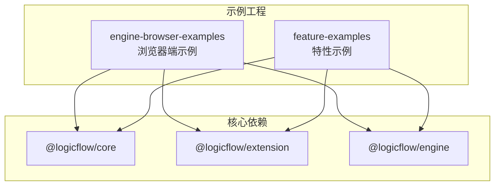
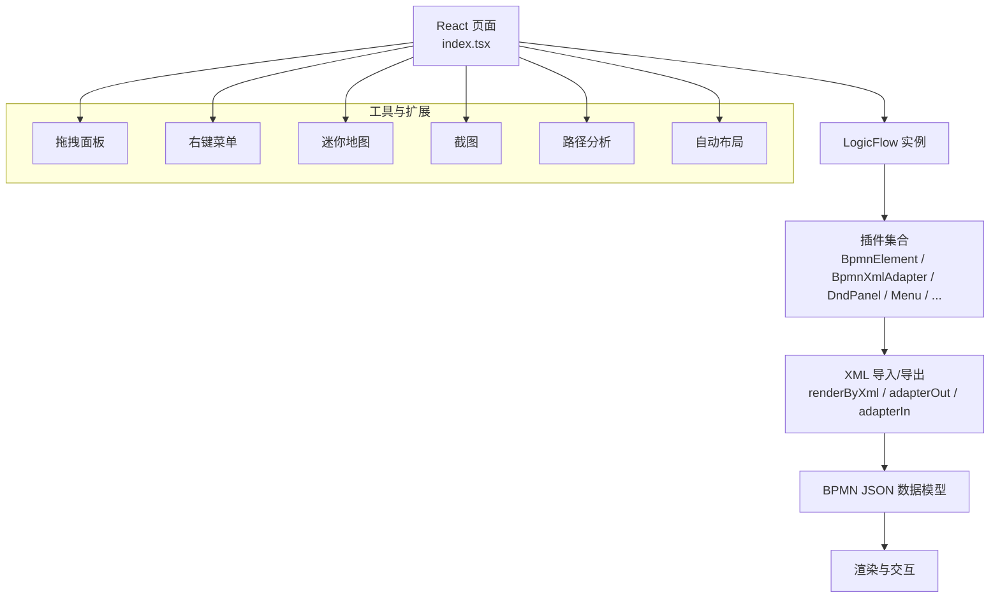
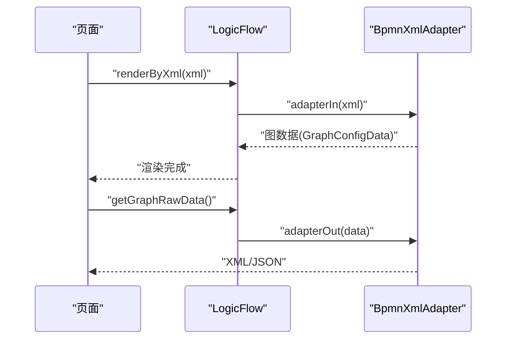
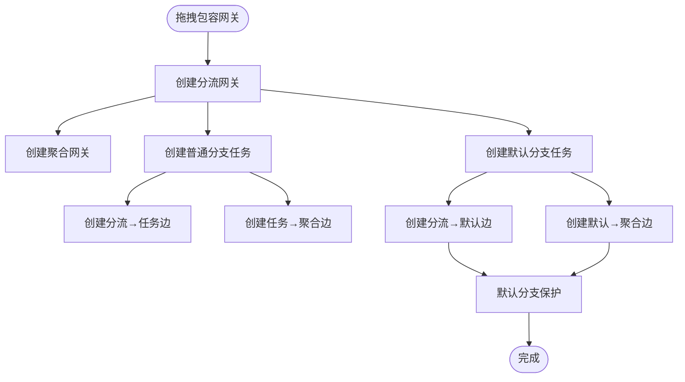
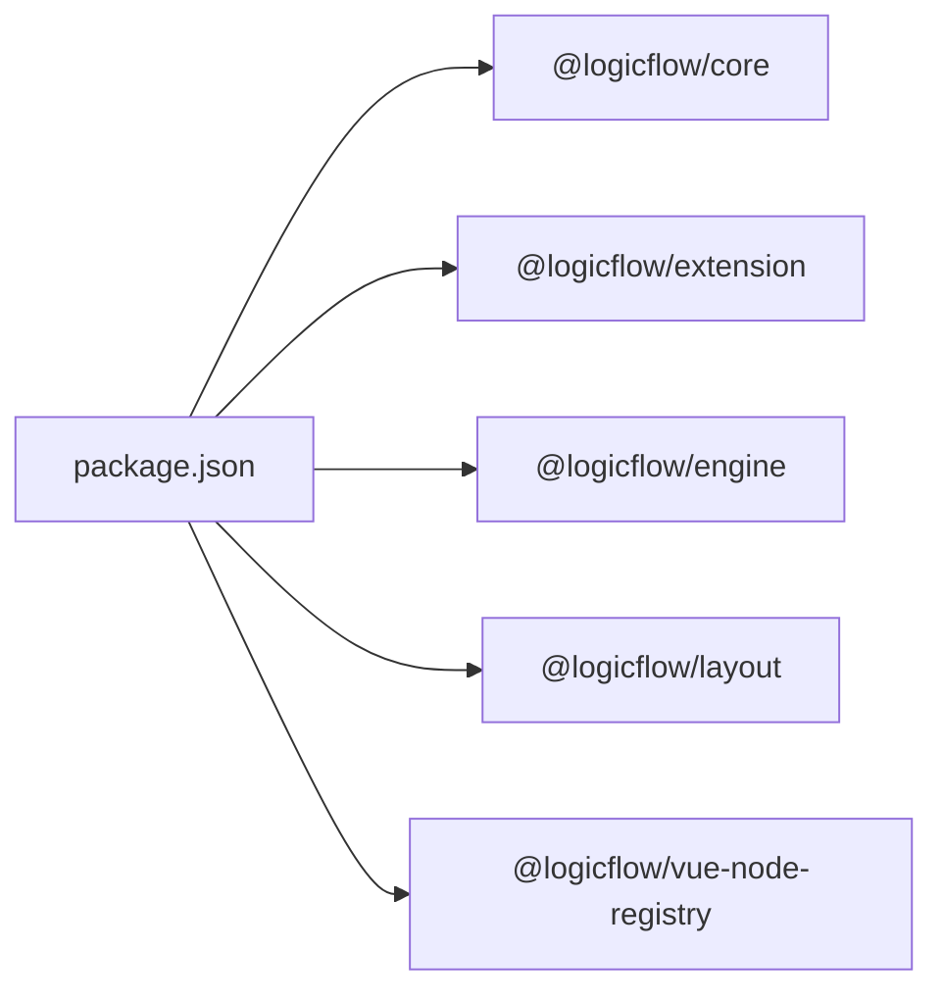

# BPMN 标准支持

<cite>
**本文引用的文件**
- [examples/engine-browser-examples/src/pages/extension/bpmn/index.tsx](file://examples/engine-browser-examples/src/pages/extension/bpmn/index.tsx)
- [examples/feature-examples/src/pages/extensions/bpmn/index.tsx](file://examples/feature-examples/src/pages/extensions/bpmn/index.tsx)
- [examples/engine-browser-examples/src/pages/extension/bpmn/bpmn.json](file://examples/engine-browser-examples/src/pages/extension/bpmn/bpmn.json)
- [examples/feature-examples/src/pages/extensions/bpmn/bpmn.json](file://examples/feature-examples/src/pages/extensions/bpmn/bpmn.json)
- [examples/engine-browser-examples/src/pages/extension/bpmn/util.ts](file://examples/engine-browser-examples/src/pages/extension/bpmn/util.ts)
- [examples/feature-examples/src/pages/extensions/bpmn/util.ts](file://examples/feature-examples/src/pages/extensions/bpmn/util.ts)
- [examples/engine-browser-examples/src/pages/extension/bpmn/svgIcons.ts](file://examples/engine-browser-examples/src/pages/extension/bpmn/svgIcons.ts)
- [examples/feature-examples/src/pages/extensions/bpmn/svgIcons.ts](file://examples/feature-examples/src/pages/extensions/bpmn/svgIcons.ts)
- [flow-docs/bpmn-elements-adapter-summary.md](file://flow-docs/bpmn-elements-adapter-summary.md)
- [flow-docs/bpmn-style-customization.md](file://flow-docs/bpmn-style-customization.md)
- [flow-docs/gateway-configuration.md](file://flow-docs/gateway-configuration.md)
- [flow-docs/inclusive-gateway-pair-example.md](file://flow-docs/inclusive-gateway-pair-example.md)
- [examples/engine-browser-examples/package.json](file://examples/engine-browser-examples/package.json)
- [examples/feature-examples/package.json](file://examples/feature-examples/package.json)
- [package.json](file://package.json)
</cite>

## 目录
1. [简介](#简介)
2. [项目结构](#项目结构)
3. [核心组件](#核心组件)
4. [架构总览](#架构总览)
5. [详细组件分析](#详细组件分析)
6. [依赖分析](#依赖分析)
7. [性能考量](#性能考量)
8. [故障排查指南](#故障排查指南)
9. [结论](#结论)
10. [附录](#附录)

## 简介
本文件面向业务流程设计者与开发者，系统化阐述本仓库中对 BPMN 2.0 标准的支持与实现，涵盖：
- BPMN 元素适配与映射关系
- 可视化呈现与交互行为
- XML 导入导出机制与数据转换流程
- 插件化开发与扩展点
- 样式定制与视觉规范
- 元素清单与使用示例
- 与主流工作流引擎的互操作性建议

## 项目结构
本仓库采用多示例工程组织方式，围绕 LogicFlow 与 @logicflow/extension 的 BPMN 插件展开，包含浏览器端示例与特性示例两套工程，分别演示基础与增强能力。

图表来源
- [examples/engine-browser-examples/package.json](file://examples/engine-browser-examples/package.json#L12-L24)
- [examples/feature-examples/package.json](file://examples/feature-examples/package.json#L12-L21)
- [package.json](file://package.json#L14-L26)

章节来源
- [examples/engine-browser-examples/package.json](file://examples/engine-browser-examples/package.json#L1-L39)
- [examples/feature-examples/package.json](file://examples/feature-examples/package.json#L1-L29)
- [package.json](file://package.json#L1-L45)

## 核心组件
- BPMN 插件与适配器
  - BpmnElement：提供 BPMN 元素的渲染与交互能力
  - BpmnXmlAdapter：提供 XML 与 LogicFlow 图数据双向转换
  - BPMNAdapter（增强版）：支持更多元素类型、子流程、边界/中间事件、自定义转换器、类型映射等
- 可视化与交互
  - DndPanel：拖拽面板，提供 BPMN 节点素材
  - Menu/ContextMenu：节点/图右键菜单
  - Group/SelectionSelect/MiniMap/Snapshot/FlowPath/AutoLayout：辅助工具
- 示例页面
  - engine-browser-examples：演示基础适配与 XML IO
  - feature-examples：演示增强适配与 JSON/XML 双向转换

章节来源
- [examples/engine-browser-examples/src/pages/extension/bpmn/index.tsx](file://examples/engine-browser-examples/src/pages/extension/bpmn/index.tsx#L29-L49)
- [examples/feature-examples/src/pages/extensions/bpmn/index.tsx](file://examples/feature-examples/src/pages/extensions/bpmn/index.tsx#L30-L50)
- [flow-docs/bpmn-elements-adapter-summary.md](file://flow-docs/bpmn-elements-adapter-summary.md#L1-L25)

## 架构总览
下图展示浏览器端示例中关键模块的协作关系与数据流向。

图表来源
- [examples/engine-browser-examples/src/pages/extension/bpmn/index.tsx](file://examples/engine-browser-examples/src/pages/extension/bpmn/index.tsx#L144-L355)
- [examples/feature-examples/src/pages/extensions/bpmn/index.tsx](file://examples/feature-examples/src/pages/extensions/bpmn/index.tsx#L145-L367)

章节来源
- [examples/engine-browser-examples/src/pages/extension/bpmn/index.tsx](file://examples/engine-browser-examples/src/pages/extension/bpmn/index.tsx#L1-L355)
- [examples/feature-examples/src/pages/extensions/bpmn/index.tsx](file://examples/feature-examples/src/pages/extensions/bpmn/index.tsx#L1-L367)

## 详细组件分析

### 1) BPMN 元素适配与映射
- 基础适配器与增强适配器对比
  - 增强适配器支持子流程、边界事件、中间事件、自定义转换器、可配置排除字段、类型映射等
- 支持的元素类型（节选）
  - 事件：开始/结束/中间捕获/中间抛出/边界事件
  - 任务：用户任务、服务任务、子流程
  - 网关：排他/并行/包容
  - 边：顺序流
- 转换器与映射
  - 顺序流条件表达式、定时器事件定义、条件表达式等内置转换器
  - 支持导出/导入时的类型映射，便于与自定义节点对接

章节来源
- [flow-docs/bpmn-elements-adapter-summary.md](file://flow-docs/bpmn-elements-adapter-summary.md#L26-L82)
- [flow-docs/bpmn-elements-adapter-summary.md](file://flow-docs/bpmn-elements-adapter-summary.md#L206-L292)
- [flow-docs/bpmn-elements-adapter-summary.md](file://flow-docs/bpmn-elements-adapter-summary.md#L326-L340)

### 2) 可视化呈现与交互行为
- 全局主题与节点样式
  - 通过 setTheme 设置统一主题；节点级样式可通过 model.getNodeStyle 覆盖
  - 支持 SVG h() 渲染自定义形状与图标
- 网关与任务的渲染
  - 网关使用工厂函数创建，支持自定义图标（SVG path 或 h 元素）
  - 任务节点可自定义图标与动态样式（如根据属性高亮）
- 交互与工具
  - 右键菜单、拖拽面板、选择框选、迷你地图、截图、路径分析、自动布局

章节来源
- [flow-docs/bpmn-style-customization.md](file://flow-docs/bpmn-style-customization.md#L14-L93)
- [flow-docs/bpmn-style-customization.md](file://flow-docs/bpmn-style-customization.md#L230-L358)
- [examples/engine-browser-examples/src/pages/extension/bpmn/index.tsx](file://examples/engine-browser-examples/src/pages/extension/bpmn/index.tsx#L145-L355)

### 3) XML 导入导出与数据转换
- 导入
  - 通过 renderByXml 或 adapterIn 将 XML/JSON 转为 LogicFlow 图数据
- 导出
  - 通过 adapterOut 将 LogicFlow 图数据转为 XML/JSON
- 数据转换流程
  - 导出：图数据 → 转换为 BPMN JSON → 生成 XML
  - 导入：BPMN JSON/XML → 转换为 LogicFlow 图数据 → 渲染
  - 节点/边/图形数据的坐标、文本、属性处理均有明确规则

图表来源
- [examples/engine-browser-examples/src/pages/extension/bpmn/index.tsx](file://examples/engine-browser-examples/src/pages/extension/bpmn/index.tsx#L148-L156)
- [examples/feature-examples/src/pages/extensions/bpmn/index.tsx](file://examples/feature-examples/src/pages/extensions/bpmn/index.tsx#L282-L288)

章节来源
- [examples/engine-browser-examples/src/pages/extension/bpmn/index.tsx](file://examples/engine-browser-examples/src/pages/extension/bpmn/index.tsx#L148-L156)
- [examples/feature-examples/src/pages/extensions/bpmn/index.tsx](file://examples/feature-examples/src/pages/extensions/bpmn/index.tsx#L282-L288)
- [flow-docs/bpmn-elements-adapter-summary.md](file://flow-docs/bpmn-elements-adapter-summary.md#L396-L428)

### 4) 网关配置与扩展
- 排他/并行/包容网关的使用与 XML 输出
- 网关工厂函数支持自定义图标与属性
- 包容网关成对配置示例：自动创建分流/聚合网关、默认分支保护、联动删除与编辑限制

图表来源
- [flow-docs/inclusive-gateway-pair-example.md](file://flow-docs/inclusive-gateway-pair-example.md#L11-L207)

章节来源
- [flow-docs/gateway-configuration.md](file://flow-docs/gateway-configuration.md#L1-L120)
- [flow-docs/gateway-configuration.md](file://flow-docs/gateway-configuration.md#L269-L406)
- [flow-docs/inclusive-gateway-pair-example.md](file://flow-docs/inclusive-gateway-pair-example.md#L1-L207)

### 5) 插件开发与扩展点
- 注册插件
  - 在 LogicFlow 实例上 use 对应插件（如 BpmnElement、BpmnXmlAdapter、AutoLayout、DndPanel 等）
- 自定义节点
  - 通过工厂函数或继承模型/视图类扩展节点类型
  - 重写 getNodeStyle/getShape 实现样式与渲染定制
- 自定义转换器与映射
  - 在增强适配器中配置 excludeFields、transformer、mapping，实现复杂元素的导入导出

章节来源
- [examples/engine-browser-examples/src/pages/extension/bpmn/index.tsx](file://examples/engine-browser-examples/src/pages/extension/bpmn/index.tsx#L36-L49)
- [examples/feature-examples/src/pages/extensions/bpmn/index.tsx](file://examples/feature-examples/src/pages/extensions/bpmn/index.tsx#L37-L50)
- [flow-docs/bpmn-elements-adapter-summary.md](file://flow-docs/bpmn-elements-adapter-summary.md#L84-L123)

### 6) 样式定制与视觉规范
- 全局主题：rect/circle/polygon/polyline/edgeText 等主题属性
- 节点级样式：重写 getNodeStyle；动态样式：依据属性返回不同样式
- 自定义渲染：重写 getShape，使用 h() 组合 SVG 元素
- 图标自定义：通过工厂函数 icon 参数或 h() 元素

章节来源
- [flow-docs/bpmn-style-customization.md](file://flow-docs/bpmn-style-customization.md#L14-L93)
- [flow-docs/bpmn-style-customization.md](file://flow-docs/bpmn-style-customization.md#L133-L228)
- [flow-docs/bpmn-style-customization.md](file://flow-docs/bpmn-style-customization.md#L230-L358)
- [flow-docs/bpmn-style-customization.md](file://flow-docs/bpmn-style-customization.md#L384-L455)

### 7) 元素清单与使用示例
- 元素清单（节选）
  - 事件：bpmn:startEvent、bpmn:endEvent、bpmn:intermediateCatchEvent、bpmn:intermediateThrowEvent、bpmn:boundaryEvent
  - 任务：bpmn:userTask、bpmn:serviceTask、bpmn:subProcess
  - 网关：bpmn:exclusiveGateway、bpmn:parallelGateway、bpmn:inclusiveGateway
  - 边：bpmn:sequenceFlow
- 使用示例
  - 示例页面提供基础节点与 XML IO 的完整流程
  - 增强适配器示例展示 JSON/XML 双向转换与路径分析

章节来源
- [flow-docs/bpmn-elements-adapter-summary.md](file://flow-docs/bpmn-elements-adapter-summary.md#L26-L82)
- [examples/engine-browser-examples/src/pages/extension/bpmn/index.tsx](file://examples/engine-browser-examples/src/pages/extension/bpmn/index.tsx#L92-L129)
- [examples/feature-examples/src/pages/extensions/bpmn/index.tsx](file://examples/feature-examples/src/pages/extensions/bpmn/index.tsx#L93-L129)

### 8) 与其他工作流引擎的集成
- 互操作性
  - 通过标准 BPMN XML 与 adapterOut(adapterIn) 实现跨引擎数据交换
  - 与 bpmn-js demo.bpmn.io 等平台互通
- 建议
  - 导出时使用增强适配器的类型映射与转换器，确保复杂元素（定时器、条件表达式）正确转换
  - 导入时注意坐标基准差异（BPMN 左上角 vs LogicFlow 中心点），由适配器内部处理

章节来源
- [examples/engine-browser-examples/src/pages/extension/bpmn/index.tsx](file://examples/engine-browser-examples/src/pages/extension/bpmn/index.tsx#L289-L294)
- [flow-docs/bpmn-elements-adapter-summary.md](file://flow-docs/bpmn-elements-adapter-summary.md#L396-L428)

## 依赖分析
- 依赖关系
  - engine-browser-examples 与 feature-examples 均依赖 @logicflow/core、@logicflow/extension、@logicflow/engine
  - 顶层 package.json 提供 Vue 生态相关依赖，示例工程聚焦 React/UMI
- 版本与脚本
  - 示例工程使用 Vite/Umi 等构建工具，提供开发/预览/打包脚本

图表来源
- [package.json](file://package.json#L14-L26)

章节来源
- [examples/engine-browser-examples/package.json](file://examples/engine-browser-examples/package.json#L12-L24)
- [examples/feature-examples/package.json](file://examples/feature-examples/package.json#L12-L21)
- [package.json](file://package.json#L1-L45)

## 性能考量
- 渲染与交互
  - 合理使用 setTheme 与节点级样式，避免在 getShape 中进行昂贵计算
  - 大规模流程建议启用自动布局与路径分析时进行节流
- 数据转换
  - 复杂转换器与映射可能带来开销，建议按需配置 excludeFields 与 mapping
- I/O
  - XML 导出前可缓存中间 JSON，减少重复转换

## 故障排查指南
- XML 导入失败
  - 检查 XML 是否符合 BPMN 2.0 命名空间与结构
  - 使用增强适配器的类型映射与转换器处理自定义元素
- 图标不显示
  - 确认图标资源路径与加载方式（Base64 或 require）
- 样式异常
  - 检查主题覆盖与节点级样式优先级
  - 确认 SVG 属性命名（如 strokeWidth）

章节来源
- [examples/engine-browser-examples/src/pages/extension/bpmn/svgIcons.ts](file://examples/engine-browser-examples/src/pages/extension/bpmn/svgIcons.ts#L1-L24)
- [examples/feature-examples/src/pages/extensions/bpmn/svgIcons.ts](file://examples/feature-examples/src/pages/extensions/bpmn/svgIcons.ts#L1-L24)
- [flow-docs/bpmn-style-customization.md](file://flow-docs/bpmn-style-customization.md#L648-L660)

## 结论
本项目基于 LogicFlow 与 @logicflow/extension，提供了对 BPMN 2.0 的专业支持：从元素映射、可视化渲染、交互工具到 XML 导入导出与增强适配器，形成完整的开发与使用闭环。通过样式定制与扩展点，可满足企业级流程设计与集成需求；借助标准 XML 与转换器，具备良好的互操作性。

## 附录
- 示例文件
  - XML 示例：[bpmn.json（engine-browser-examples）](file://examples/engine-browser-examples/src/pages/extension/bpmn/bpmn.json#L1-L256)、[bpmn.json（feature-examples）](file://examples/feature-examples/src/pages/extensions/bpmn/bpmn.json#L1-L256)
  - 下载工具：[util.ts（engine-browser-examples）](file://examples/engine-browser-examples/src/pages/extension/bpmn/util.ts#L1-L15)、[util.ts（feature-examples）](file://examples/feature-examples/src/pages/extensions/bpmn/util.ts#L1-L15)
- 相关文档
  - [BPMN 元素适配总结](file://flow-docs/bpmn-elements-adapter-summary.md#L1-L460)
  - [BPMN 样式自定义指南](file://flow-docs/bpmn-style-customization.md#L1-L668)
  - [网关配置详解](file://flow-docs/gateway-configuration.md#L1-L800)
  - [包容网关成对配置示例](file://flow-docs/inclusive-gateway-pair-example.md#L1-L800)