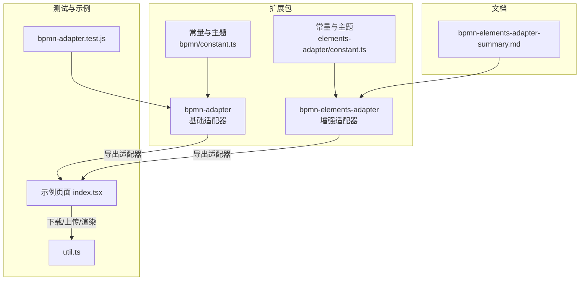
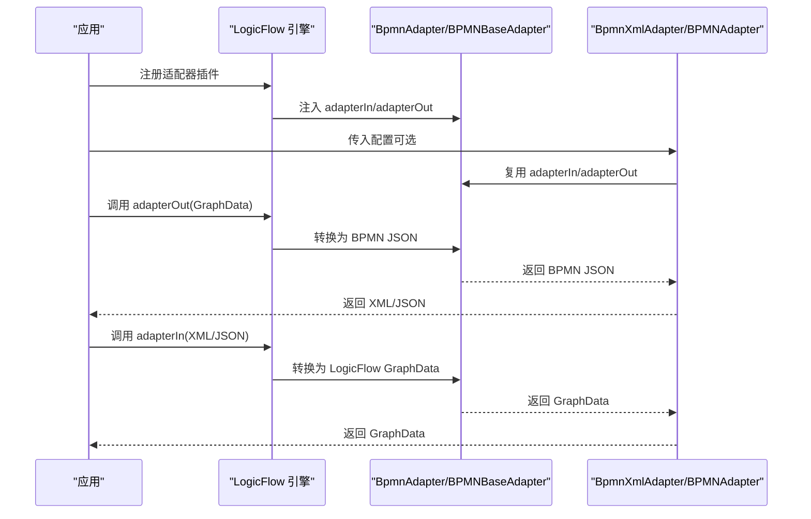
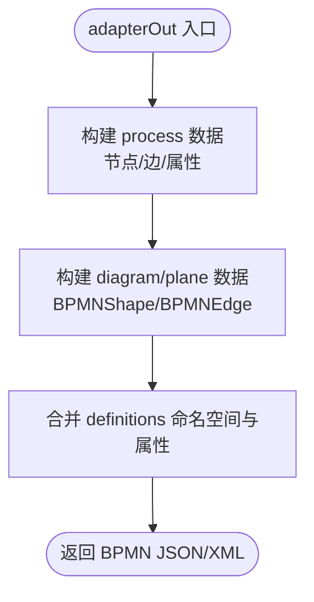
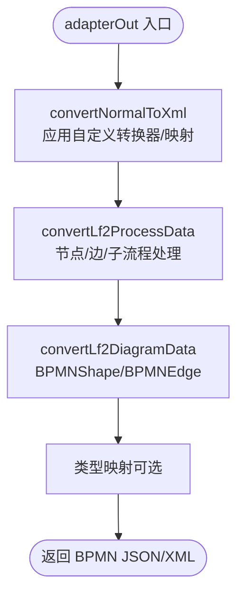
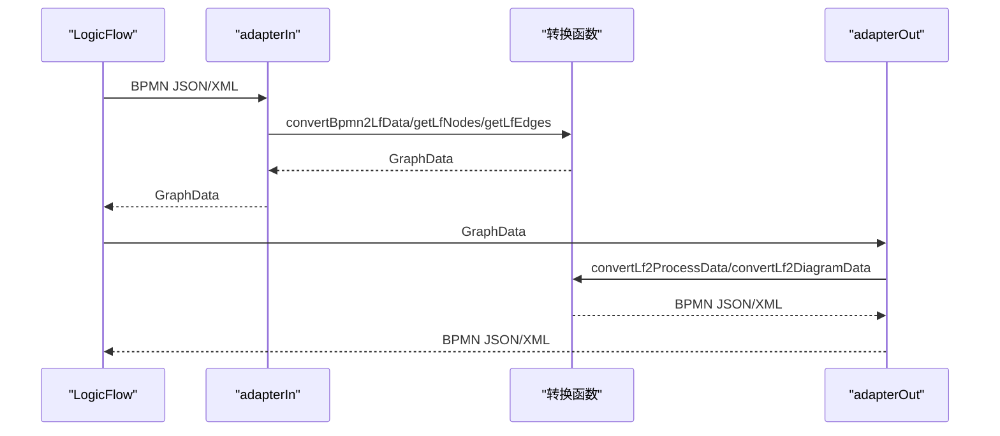
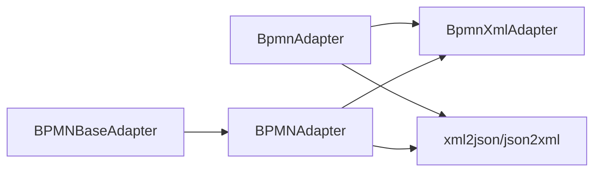

# BPMN 标准适配器

<cite>
**本文引用的文件**
- [packages/extension/src/bpmn-adapter/index.ts](file://packages/extension/src/bpmn-adapter/index.ts)
- [packages/extension/src/bpmn-elements-adapter/index.ts](file://packages/extension/src/bpmn-elements-adapter/index.ts)
- [packages/extension/src/bpmn-elements-adapter/constant.ts](file://packages/extension/src/bpmn-elements-adapter/constant.ts)
- [packages/extension/src/bpmn/constant.ts](file://packages/extension/src/bpmn/constant.ts)
- [packages/extension/__test__/bpmn-adapter.test.js](file://packages/extension/__test__/bpmn-adapter.test.js)
- [flow-docs/bpmn-elements-adapter-summary.md](file://flow-docs/bpmn-elements-adapter-summary.md)
- [examples/engine-browser-examples/src/pages/extension/bpmn/index.tsx](file://examples/engine-browser-examples/src/pages/extension/bpmn/index.tsx)
- [examples/engine-browser-examples/src/pages/extension/bpmn/util.ts](file://examples/engine-browser-examples/src/pages/extension/bpmn/util.ts)
</cite>

## 目录
1. [简介](#简介)
2. [项目结构](#项目结构)
3. [核心组件](#核心组件)
4. [架构总览](#架构总览)
5. [详细组件分析](#详细组件分析)
6. [依赖分析](#依赖分析)
7. [性能考虑](#性能考虑)
8. [故障排查指南](#故障排查指南)
9. [结论](#结论)
10. [附录](#附录)

## 简介
本文件系统性阐述 LogicFlow 的 BPMN 标准适配器，重点对比基础适配器（bpmn-adapter）与增强适配器（bpmn-elements-adapter）的功能差异与适用场景，详解适配器的核心配置项（尺寸、类型、自定义配置）、注册与初始化流程、内部工作机制（数据转换与节点映射）、与 LogicFlow 引擎的集成方式与最佳实践，并提供可直接落地的使用示例与排障建议。

## 项目结构
围绕 BPMN 适配器的关键目录与文件如下：
- 基础适配器：packages/extension/src/bpmn-adapter
- 增强适配器：packages/extension/src/bpmn-elements-adapter
- 常量与主题：packages/extension/src/bpmn-elements-adapter/constant.ts、packages/extension/src/bpmn/constant.ts
- 测试：packages/extension/__test__/bpmn-adapter.test.js
- 文档：flow-docs/bpmn-elements-adapter-summary.md
- 示例：examples/engine-browser-examples/src/pages/extension/bpmn

图表来源
- [packages/extension/src/bpmn-adapter/index.ts](file://packages/extension/src/bpmn-adapter/index.ts#L645-L744)
- [packages/extension/src/bpmn-elements-adapter/index.ts](file://packages/extension/src/bpmn-elements-adapter/index.ts#L969-L1135)
- [packages/extension/src/bpmn-elements-adapter/constant.ts](file://packages/extension/src/bpmn-elements-adapter/constant.ts#L1-L77)
- [packages/extension/src/bpmn/constant.ts](file://packages/extension/src/bpmn/constant.ts#L1-L57)
- [packages/extension/__test__/bpmn-adapter.test.js](file://packages/extension/__test__/bpmn-adapter.test.js#L1-L228)
- [examples/engine-browser-examples/src/pages/extension/bpmn/index.tsx](file://examples/engine-browser-examples/src/pages/extension/bpmn/index.tsx#L1-L355)
- [examples/engine-browser-examples/src/pages/extension/bpmn/util.ts](file://examples/engine-browser-examples/src/pages/extension/bpmn/util.ts#L1-L15)
- [flow-docs/bpmn-elements-adapter-summary.md](file://flow-docs/bpmn-elements-adapter-summary.md#L1-L460)

章节来源
- [packages/extension/src/bpmn-adapter/index.ts](file://packages/extension/src/bpmn-adapter/index.ts#L1-L836)
- [packages/extension/src/bpmn-elements-adapter/index.ts](file://packages/extension/src/bpmn-elements-adapter/index.ts#L1-L1135)
- [flow-docs/bpmn-elements-adapter-summary.md](file://flow-docs/bpmn-elements-adapter-summary.md#L1-L460)

## 核心组件
- 基础适配器（BpmnAdapter）
  - 职责：在 LogicFlow 图数据与 BPMN JSON/ XML 之间双向转换；注入 adapterIn/adapterOut 钩子；维护 process/definitions 基础属性与命名空间；提供 setCustomShape 自定义尺寸能力。
  - 关键点：坐标基准转换（中心点↔左上角）、XML 属性前缀约定（-id/-name）、incoming/outgoing 顺序一致性、文本反转义。
- XML 适配器（BpmnXmlAdapter）
  - 职责：在 XML 输入/输出场景中，对 name 属性进行预处理转义，提升 DOM 解析容错。
- 增强适配器（BPMNAdapter）
  - 职责：在基础适配器之上，提供子流程、边界事件、中间事件等更全 BPMN 元素支持；支持自定义转换器、排除字段、类型映射；提供 XML/JSON 双向转换。
  - 关键点：convertNormalToXml/convertXmlToNormal、子流程节点提升、边界事件 attachedToRef 关联、内置转换器（条件表达式、定时器事件）。
- 基类（BPMNBaseAdapter）
  - 职责：统一 process/definitions 属性、命名空间、adapterOut/adapterIn 的通用实现；提供 setCustomShape 与尺寸映射。

章节来源
- [packages/extension/src/bpmn-adapter/index.ts](file://packages/extension/src/bpmn-adapter/index.ts#L645-L744)
- [packages/extension/src/bpmn-adapter/index.ts](file://packages/extension/src/bpmn-adapter/index.ts#L800-L836)
- [packages/extension/src/bpmn-elements-adapter/index.ts](file://packages/extension/src/bpmn-elements-adapter/index.ts#L969-L1135)
- [packages/extension/src/bpmn-elements-adapter/index.ts](file://packages/extension/src/bpmn-elements-adapter/index.ts#L1-L814)

## 架构总览
适配器与 LogicFlow 的交互通过 adapterIn/adapterOut 钩子完成，二者均支持 JSON 与 XML 两种输入输出格式。增强适配器在基础适配器之上扩展了更丰富的 BPMN 元素与转换能力。

图表来源
- [packages/extension/src/bpmn-adapter/index.ts](file://packages/extension/src/bpmn-adapter/index.ts#L678-L744)
- [packages/extension/src/bpmn-elements-adapter/index.ts](file://packages/extension/src/bpmn-elements-adapter/index.ts#L1112-L1130)

章节来源
- [packages/extension/src/bpmn-adapter/index.ts](file://packages/extension/src/bpmn-adapter/index.ts#L645-L744)
- [packages/extension/src/bpmn-elements-adapter/index.ts](file://packages/extension/src/bpmn-elements-adapter/index.ts#L969-L1135)

## 详细组件分析

### 基础适配器（bpmn-adapter）
- 功能要点
  - adapterOut：将 LogicFlow GraphData 转换为 BPMN JSON，再由 json2xml 输出 XML。
  - adapterIn：将 BPMN JSON（或 XML）转换为 LogicFlow GraphData。
  - 坐标基准转换：BPMN 以左上角为基准，LogicFlow 以中心点为基准，转换时进行位移。
  - 文本处理：导出时进行 XML 转义，导入时进行反转义。
  - 属性约定：XML 属性在 JSON 中以前缀“-”表示；同名子节点可能出现多次，解析后以数组表示。
- 核心接口与类型
  - NodeConfig/EdgeConfig：中间结构，包含 id/type/坐标/text/properties 等。
  - adapterOut(data, retainedFields?)：导出，retainedFields 控制哪些字段以属性形式保留。
  - adapterIn(bpmnData)：导入。
- 使用方式
  - 基础使用：lf.use(BpmnAdapter)。
  - XML 使用：lf.use(BpmnXmlAdapter)。

图表来源
- [packages/extension/src/bpmn-adapter/index.ts](file://packages/extension/src/bpmn-adapter/index.ts#L715-L733)
- [packages/extension/src/bpmn-adapter/index.ts](file://packages/extension/src/bpmn-adapter/index.ts#L319-L379)

章节来源
- [packages/extension/src/bpmn-adapter/index.ts](file://packages/extension/src/bpmn-adapter/index.ts#L1-L836)

### 增强适配器（bpmn-elements-adapter）
- 功能要点
  - 支持更多元素类型：边界事件、中间事件、子流程、包容/并行网关等。
  - 子流程处理：将子流程内节点提升到 process 层，重组数据结构。
  - 边界事件：处理 attachedToRef，与依附任务建立关联。
  - 自定义配置：ExtraPropsType（retainedAttrsFields/excludeFields/transformer/mapping）。
  - 内置转换器：顺序流条件表达式、定时器事件定义等。
- 核心接口与类型
  - ExtraPropsType：保留属性字段、排除字段、自定义转换器、类型映射。
  - TransformerType/MappingType：节点/边的导入导出转换与类型映射。
  - convertNormalToXml/convertXmlToNormal：将普通 JSON 转换为 XML 风格 JSON，以及反向转换。
- 使用方式
  - 基础使用：lf.use(BPMNAdapter)。
  - 带配置使用：传入 ExtraPropsType，支持保留字段、排除字段、自定义转换器、类型映射。

图表来源
- [packages/extension/src/bpmn-elements-adapter/index.ts](file://packages/extension/src/bpmn-elements-adapter/index.ts#L1017-L1059)
- [packages/extension/src/bpmn-elements-adapter/index.ts](file://packages/extension/src/bpmn-elements-adapter/index.ts#L390-L545)

章节来源
- [packages/extension/src/bpmn-elements-adapter/index.ts](file://packages/extension/src/bpmn-elements-adapter/index.ts#L1-L1135)
- [flow-docs/bpmn-elements-adapter-summary.md](file://flow-docs/bpmn-elements-adapter-summary.md#L48-L123)

### 类型与尺寸配置
- 基础适配器尺寸（bpmn/constant.ts）
  - StartEventConfig/EndEventConfig/ExclusiveGatewayConfig/ServiceTaskConfig/UserTaskConfig
- 增强适配器尺寸（bpmn-elements-adapter/constant.ts）
  - StartEventConfig/EndEventConfig/BoundaryEventConfig/IntermediateEventConfig/ParallelGatewayConfig/InclusiveGatewayConfig/ExclusiveGatewayConfig/ServiceTaskConfig/UserTaskConfig/SubProcessConfig
- 使用建议
  - 通过 setCustomShape 注册自定义尺寸，覆盖默认映射。

章节来源
- [packages/extension/src/bpmn/constant.ts](file://packages/extension/src/bpmn/constant.ts#L1-L57)
- [packages/extension/src/bpmn-elements-adapter/constant.ts](file://packages/extension/src/bpmn-elements-adapter/constant.ts#L1-L77)

### 注册与初始化
- 基础适配器
  - 构造函数中注入 adapterIn/adapterOut，并设置 process/definitions 默认属性。
- XML 适配器
  - 在基础适配器基础上，覆盖 adapterIn/adapterOut，增加对 name 属性的预处理转义。
- 增强适配器
  - 继承 BPMNBaseAdapter，构造函数中注入 adapterXmlIn/adapterXmlOut，并保存外部配置 props。
- 示例页面
  - 在示例页面中通过 lf.use 注册 BpmnXmlAdapter，并设置 DndPanel、菜单、迷你地图等扩展。

章节来源
- [packages/extension/src/bpmn-adapter/index.ts](file://packages/extension/src/bpmn-adapter/index.ts#L678-L744)
- [packages/extension/src/bpmn-adapter/index.ts](file://packages/extension/src/bpmn-adapter/index.ts#L800-L836)
- [packages/extension/src/bpmn-elements-adapter/index.ts](file://packages/extension/src/bpmn-elements-adapter/index.ts#L1112-L1130)
- [examples/engine-browser-examples/src/pages/extension/bpmn/index.tsx](file://examples/engine-browser-examples/src/pages/extension/bpmn/index.tsx#L36-L49)

### 内部工作机制
- 数据转换流程（基础适配器）
  - adapterOut：convertLf2ProcessData → convertLf2DiagramData → 合并 definitions。
  - adapterIn：convertBpmn2LfData → getLfNodes/getLfEdges → 组装 GraphData。
- 数据转换流程（增强适配器）
  - adapterOut：convertNormalToXml → convertLf2ProcessData（含子流程/边界事件）→ convertLf2DiagramData → 类型映射（可选）。
  - adapterIn：convertBpmn2LfData（含子流程提升/边界事件处理）→ convertXmlToNormal → getLfNodes/getLfEdges。
- 节点映射规则
  - 坐标基准转换：BPMN 左上角 ↔ LogicFlow 中心点。
  - 文本映射：-name → text.value；BPMNLabel 的 Bounds 优先于节点 Bounds。
  - 属性映射：defaultAttrs 之外的键进入 properties；XML 实体反转义。
- XML 容错
  - BpmnXmlAdapter 对 name 属性进行非法字符转义，避免 DOM 解析失败。

图表来源
- [packages/extension/src/bpmn-adapter/index.ts](file://packages/extension/src/bpmn-adapter/index.ts#L382-L423)
- [packages/extension/src/bpmn-elements-adapter/index.ts](file://packages/extension/src/bpmn-elements-adapter/index.ts#L618-L814)

章节来源
- [packages/extension/src/bpmn-adapter/index.ts](file://packages/extension/src/bpmn-adapter/index.ts#L227-L423)
- [packages/extension/src/bpmn-elements-adapter/index.ts](file://packages/extension/src/bpmn-elements-adapter/index.ts#L382-L814)

### TypeScript 接口与配置示例
- 核心接口（增强适配器）
  - NodeConfig/EdgeConfig：节点/边中间结构。
  - ExtraPropsType：保留属性字段、排除字段、自定义转换器、类型映射。
  - TransformerType/MappingType：转换与映射规则。
- 配置示例（来自文档）
  - 基础使用、带配置使用、导出/导入示例、内置转换器与高级功能示例。

章节来源
- [packages/extension/src/bpmn-elements-adapter/index.ts](file://packages/extension/src/bpmn-elements-adapter/index.ts#L22-L89)
- [flow-docs/bpmn-elements-adapter-summary.md](file://flow-docs/bpmn-elements-adapter-summary.md#L87-L123)
- [flow-docs/bpmn-elements-adapter-summary.md](file://flow-docs/bpmn-elements-adapter-summary.md#L125-L204)
- [flow-docs/bpmn-elements-adapter-summary.md](file://flow-docs/bpmn-elements-adapter-summary.md#L206-L292)

### 与 LogicFlow 核心引擎的集成与最佳实践
- 集成方式
  - 通过 lf.use 注册适配器插件；基础适配器注入 adapterIn/adapterOut；XML 适配器覆盖为 XML 输入输出。
- 最佳实践
  - 导出时使用 retainedFields 控制属性保留；导入时利用 excludeFields 过滤冗余字段。
  - 使用 mapping 将自定义类型映射到标准 BPMN 类型，便于与其他工具链互通。
  - 子流程与边界事件场景下，确保子节点提升与 attachedToRef 关联正确。
  - 在示例页面中结合 DndPanel、MiniMap、AutoLayout 等扩展，提升用户体验。

章节来源
- [examples/engine-browser-examples/src/pages/extension/bpmn/index.tsx](file://examples/engine-browser-examples/src/pages/extension/bpmn/index.tsx#L36-L49)
- [flow-docs/bpmn-elements-adapter-summary.md](file://flow-docs/bpmn-elements-adapter-summary.md#L294-L340)

## 依赖分析
- 组件耦合
  - 增强适配器继承基础适配器（或基类），共享 process/definitions 属性与命名空间。
  - XML 适配器复用基础适配器的转换逻辑，仅在输入输出层面做格式适配。
- 外部依赖
  - xml2json/json2xml：负责 XML 与 JSON 的互转。
  - lodash-es：深拷贝与对象遍历辅助。
- 潜在风险
  - 属性前缀与数组/对象的区分：需确保 retainedFields 正确传递，避免误判为子节点。
  - 子流程与边界事件：需注意子节点提升与 attachedToRef 的一致性。

图表来源
- [packages/extension/src/bpmn-adapter/index.ts](file://packages/extension/src/bpmn-adapter/index.ts#L645-L836)
- [packages/extension/src/bpmn-elements-adapter/index.ts](file://packages/extension/src/bpmn-elements-adapter/index.ts#L969-L1135)

章节来源
- [packages/extension/src/bpmn-adapter/index.ts](file://packages/extension/src/bpmn-adapter/index.ts#L1-L836)
- [packages/extension/src/bpmn-elements-adapter/index.ts](file://packages/extension/src/bpmn-elements-adapter/index.ts#L1-L1135)

## 性能考虑
- 转换复杂度
  - convertLf2ProcessData/convertBpmn2LfData 对节点/边进行线性扫描与映射，时间复杂度 O(N+E)。
  - convertNormalToXml/convertXmlToNormal 递归遍历对象树，时间复杂度 O(N)。
- 优化建议
  - 合理使用 retainedFields 与 excludeFields，减少不必要的属性序列化/反序列化。
  - 子流程层级较深时，尽量避免频繁的子节点提升与删除操作。
  - 在大规模图中，优先使用 XML 导出以降低 JSON 序列化开销。

## 故障排查指南
- 常见问题
  - 导入后文本乱码：检查 XML 实体是否正确反转义。
  - 坐标错位：确认坐标基准转换逻辑（中心点↔左上角）是否一致。
  - 子流程/边界事件丢失：检查 convertBpmn2LfData 中的子流程提升与 attachedToRef 处理。
  - XML 解析失败：使用 BpmnXmlAdapter 的 name 属性预处理转义。
- 测试验证
  - 使用单元测试验证 JSON↔XML 转换与属性保留行为。

章节来源
- [packages/extension/__test__/bpmn-adapter.test.js](file://packages/extension/__test__/bpmn-adapter.test.js#L8-L227)
- [packages/extension/src/bpmn-adapter/index.ts](file://packages/extension/src/bpmn-adapter/index.ts#L810-L830)

## 结论
- 基础适配器适用于简单 BPMN 元素与 JSON/XML 场景，具备稳定的双向转换能力。
- 增强适配器面向完整 BPMN 2.0 支持，提供子流程、边界事件、中间事件、自定义转换器与类型映射等高级能力，适合复杂流程建模与跨工具链协作。
- 在实际项目中，建议根据业务复杂度选择适配器版本，并结合 ExtraPropsType 进行精细化配置，以获得最佳的转换质量与性能表现。

## 附录
- 实际使用示例（来自示例页面）
  - 注册 BpmnXmlAdapter，设置 DndPanel、菜单、迷你地图等扩展。
  - 提供下载/上传逻辑，将 LogicFlow 图数据与 XML 互转。
- 配置清单（来自文档）
  - 尺寸配置、类型定义、自定义配置（ExtraPropsType）、使用方法与内置转换器示例。

章节来源
- [examples/engine-browser-examples/src/pages/extension/bpmn/index.tsx](file://examples/engine-browser-examples/src/pages/extension/bpmn/index.tsx#L144-L355)
- [examples/engine-browser-examples/src/pages/extension/bpmn/util.ts](file://examples/engine-browser-examples/src/pages/extension/bpmn/util.ts#L1-L15)
- [flow-docs/bpmn-elements-adapter-summary.md](file://flow-docs/bpmn-elements-adapter-summary.md#L48-L123)
- [flow-docs/bpmn-elements-adapter-summary.md](file://flow-docs/bpmn-elements-adapter-summary.md#L125-L204)
- [flow-docs/bpmn-elements-adapter-summary.md](file://flow-docs/bpmn-elements-adapter-summary.md#L206-L292)