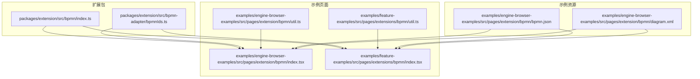
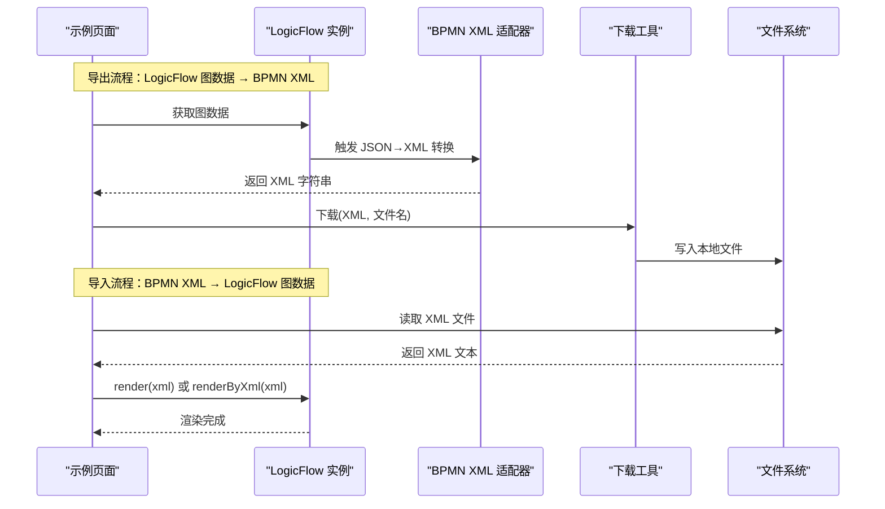
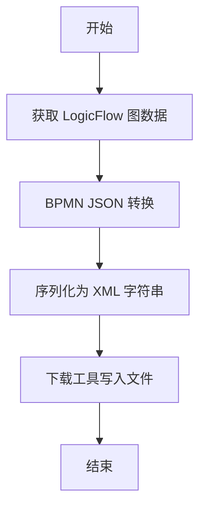
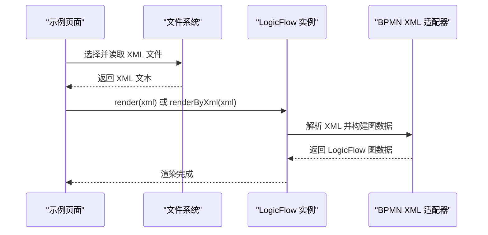
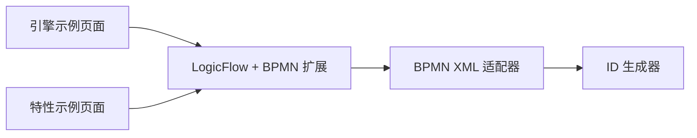

# XML 数据交换与转换

<cite>
**本文引用的文件**
- [packages/extension/src/bpmn/index.ts](file://packages/extension/src/bpmn/index.ts)
- [packages/extension/src/bpmn-adapter/bpmnIds.ts](file://packages/extension/src/bpmn-adapter/bpmnIds.ts)
- [examples/engine-browser-examples/src/pages/extension/bpmn/index.tsx](file://examples/engine-browser-examples/src/pages/extension/bpmn/index.tsx)
- [examples/feature-examples/src/pages/extensions/bpmn/index.tsx](file://examples/feature-examples/src/pages/extensions/bpmn/index.tsx)
- [examples/engine-browser-examples/src/pages/extension/bpmn/util.ts](file://examples/engine-browser-examples/src/pages/extension/bpmn/util.ts)
- [examples/feature-examples/src/pages/extensions/bpmn/util.ts](file://examples/feature-examples/src/pages/extensions/bpmn/util.ts)
- [examples/engine-browser-examples/src/pages/extension/bpmn/bpmn.json](file://examples/engine-browser-examples/src/pages/extension/bpmn/bpmn.json)
- [examples/engine-browser-examples/src/pages/extension/bpmn/diagram.xml](file://examples/engine-browser-examples/src/pages/extension/bpmn/diagram.xml)
</cite>

## 目录
1. [引言](#引言)
2. [项目结构](#项目结构)
3. [核心组件](#核心组件)
4. [架构总览](#架构总览)
5. [详细组件分析](#详细组件分析)
6. [依赖关系分析](#依赖关系分析)
7. [性能考量](#性能考量)
8. [故障排查指南](#故障排查指南)
9. [结论](#结论)
10. [附录](#附录)

## 引言
本指南围绕 LogicFlow 扩展中的 BPMN XML 数据交换与转换展开，目标是帮助读者理解从 BPMN XML 到 LogicFlow 图数据的导入流程，以及从 LogicFlow 图数据到 BPMN XML 的导出流程；并给出坐标系转换、文本实体反转义、属性映射等关键机制的说明。同时，提供顺序流条件、定时器事件、条件表达式等常见转换器的实现思路与自定义转换器的开发与配置方法。

## 项目结构
本仓库包含多个示例工程与扩展包，其中与 BPMN XML 交换直接相关的关键位置如下：
- 扩展包：BPMN 元素注册与适配器支持
- 示例页面：BPMN XML 导入/导出、JSON↔XML 转换演示
- 示例资源：BPMN JSON 与 XML 源文件

图表来源
- [packages/extension/src/bpmn/index.ts](file://packages/extension/src/bpmn/index.ts#L1-L61)
- [packages/extension/src/bpmn-adapter/bpmnIds.ts](file://packages/extension/src/bpmn-adapter/bpmnIds.ts#L1-L32)
- [examples/engine-browser-examples/src/pages/extension/bpmn/index.tsx](file://examples/engine-browser-examples/src/pages/extension/bpmn/index.tsx#L1-L355)
- [examples/feature-examples/src/pages/extensions/bpmn/index.tsx](file://examples/feature-examples/src/pages/extensions/bpmn/index.tsx#L1-L367)
- [examples/engine-browser-examples/src/pages/extension/bpmn/util.ts](file://examples/engine-browser-examples/src/pages/extension/bpmn/util.ts#L1-L15)
- [examples/feature-examples/src/pages/extensions/bpmn/util.ts](file://examples/feature-examples/src/pages/extensions/bpmn/util.ts#L1-L15)
- [examples/engine-browser-examples/src/pages/extension/bpmn/bpmn.json](file://examples/engine-browser-examples/src/pages/extension/bpmn/bpmn.json#L1-L256)
- [examples/engine-browser-examples/src/pages/extension/bpmn/diagram.xml](file://examples/engine-browser-examples/src/pages/extension/bpmn/diagram.xml#L1-L93)

章节来源
- [packages/extension/src/bpmn/index.ts](file://packages/extension/src/bpmn/index.ts#L1-L61)
- [packages/extension/src/bpmn-adapter/bpmnIds.ts](file://packages/extension/src/bpmn-adapter/bpmnIds.ts#L1-L32)
- [examples/engine-browser-examples/src/pages/extension/bpmn/index.tsx](file://examples/engine-browser-examples/src/pages/extension/bpmn/index.tsx#L1-L355)
- [examples/feature-examples/src/pages/extensions/bpmn/index.tsx](file://examples/feature-examples/src/pages/extensions/bpmn/index.tsx#L1-L367)
- [examples/engine-browser-examples/src/pages/extension/bpmn/util.ts](file://examples/engine-browser-examples/src/pages/extension/bpmn/util.ts#L1-L15)
- [examples/feature-examples/src/pages/extensions/bpmn/util.ts](file://examples/feature-examples/src/pages/extensions/bpmn/util.ts#L1-L15)
- [examples/engine-browser-examples/src/pages/extension/bpmn/bpmn.json](file://examples/engine-browser-examples/src/pages/extension/bpmn/bpmn.json#L1-L256)
- [examples/engine-browser-examples/src/pages/extension/bpmn/diagram.xml](file://examples/engine-browser-examples/src/pages/extension/bpmn/diagram.xml#L1-L93)

## 核心组件
- BPMN 元素注册与默认边类型
  - 在扩展安装时注册起止事件、排他网关、用户任务、服务任务等节点，并在未自定义边的情况下设置默认边类型为“bpmn:sequenceFlow”。
- BPMN XML 适配器与 ID 生成
  - 通过适配器支持 XML 渲染与转换；ID 生成器用于确保唯一标识符。
- 示例页面交互
  - 提供下载 LogicFlow JSON/XML、上传 XML、获取路径、自动布局、菜单等能力；部分示例直接使用 render(xml) 或 renderByXml(xml) 进行 XML 渲染。
- JSON↔XML 转换工具
  - 示例页面暴露了 lfJson2Xml 与 lfXml2Json，用于在 LogicFlow 内部进行 JSON 与 XML 的双向转换。

章节来源
- [packages/extension/src/bpmn/index.ts](file://packages/extension/src/bpmn/index.ts#L28-L44)
- [packages/extension/src/bpmn-adapter/bpmnIds.ts](file://packages/extension/src/bpmn-adapter/bpmnIds.ts#L1-L32)
- [examples/engine-browser-examples/src/pages/extension/bpmn/index.tsx](file://examples/engine-browser-examples/src/pages/extension/bpmn/index.tsx#L148-L154)
- [examples/feature-examples/src/pages/extensions/bpmn/index.tsx](file://examples/feature-examples/src/pages/extensions/bpmn/index.tsx#L149-L156)
- [examples/feature-examples/src/pages/extensions/bpmn/index.tsx](file://examples/feature-examples/src/pages/extensions/bpmn/index.tsx#L282-L288)

## 架构总览
下图展示了从 LogicFlow 图数据到 BPMN XML 的导出流程与从 BPMN XML 到 LogicFlow 图数据的导入流程的关键步骤与组件交互。

图表来源
- [examples/engine-browser-examples/src/pages/extension/bpmn/index.tsx](file://examples/engine-browser-examples/src/pages/extension/bpmn/index.tsx#L233-L252)
- [examples/feature-examples/src/pages/extensions/bpmn/index.tsx](file://examples/feature-examples/src/pages/extensions/bpmn/index.tsx#L233-L250)
- [examples/engine-browser-examples/src/pages/extension/bpmn/util.ts](file://examples/engine-browser-examples/src/pages/extension/bpmn/util.ts#L1-L15)
- [examples/feature-examples/src/pages/extensions/bpmn/util.ts](file://examples/feature-examples/src/pages/extensions/bpmn/util.ts#L1-L15)

## 详细组件分析

### 导出流程：LogicFlow 图数据 → BPMN JSON → XML
- 步骤概览
  - 获取 LogicFlow 图数据（节点与边）
  - 将图数据转换为 BPMN JSON（由适配器负责）
  - 将 BPMN JSON 序列化为 XML 字符串
  - 使用下载工具保存为文件
- 关键实现要点
  - 示例页面通过 getGraphData()/getGraphRawData() 获取数据，再调用下载工具写入文件。
  - 适配器负责将内部图数据映射为 BPMN JSON 结构，并最终输出 XML。
- 流程图

图表来源
- [examples/engine-browser-examples/src/pages/extension/bpmn/index.tsx](file://examples/engine-browser-examples/src/pages/extension/bpmn/index.tsx#L233-L239)
- [examples/feature-examples/src/pages/extensions/bpmn/index.tsx](file://examples/feature-examples/src/pages/extensions/bpmn/index.tsx#L233-L238)

章节来源
- [examples/engine-browser-examples/src/pages/extension/bpmn/index.tsx](file://examples/engine-browser-examples/src/pages/extension/bpmn/index.tsx#L233-L239)
- [examples/feature-examples/src/pages/extensions/bpmn/index.tsx](file://examples/feature-examples/src/pages/extensions/bpmn/index.tsx#L233-L238)

### 导入流程：BPMN XML → LogicFlow 图数据
- 步骤概览
  - 读取本地 XML 文件内容
  - 调用 render(xml)/renderByXml(xml) 进行渲染
  - 适配器解析 XML 并构建 LogicFlow 节点与边
- 关键实现要点
  - 示例页面通过 FileReader 读取文件文本，然后调用渲染接口。
  - 适配器负责将 XML 中的节点、边、坐标、连线等信息映射到 LogicFlow 数据结构。
- 时序图

图表来源
- [examples/engine-browser-examples/src/pages/extension/bpmn/index.tsx](file://examples/engine-browser-examples/src/pages/extension/bpmn/index.tsx#L241-L249)
- [examples/feature-examples/src/pages/extensions/bpmn/index.tsx](file://examples/feature-examples/src/pages/extensions/bpmn/index.tsx#L239-L247)

章节来源
- [examples/engine-browser-examples/src/pages/extension/bpmn/index.tsx](file://examples/engine-browser-examples/src/pages/extension/bpmn/index.tsx#L241-L249)
- [examples/feature-examples/src/pages/extensions/bpmn/index.tsx](file://examples/feature-examples/src/pages/extensions/bpmn/index.tsx#L239-L247)

### 转换器实现示例与开发指南
- 顺序流条件转换器
  - 目标：将 BPMN 条件表达式映射为 LogicFlow 边上的条件属性。
  - 实现思路：在适配器中解析 sequenceFlow 的条件表达式节点，将其值映射到边的 properties 或额外字段，以便渲染与编辑。
  - 配置方式：在适配器的边解析阶段注入自定义逻辑，或通过扩展插件注册自定义边模型。
- 定时器事件转换器
  - 目标：将 Timer Event 节点转换为 LogicFlow 的任务节点或特殊节点，并保留定时器配置。
  - 实现思路：解析 timerEventDefinition，提取时间表达式或周期性配置，映射到节点 properties。
  - 配置方式：注册自定义节点模型与视图，配合适配器解析阶段注入。
- 条件表达式转换器
  - 目标：将 BPMN 中的条件表达式（如UEL）转换为 LogicFlow 可识别的表达式格式。
  - 实现思路：在节点解析阶段提取表达式字符串，进行必要的转义与格式化，写入节点属性。
  - 配置方式：在适配器的节点解析回调中添加表达式处理逻辑。
- 自定义转换器开发与配置
  - 开发步骤
    - 定义转换器接口与解析函数
    - 在适配器初始化时注册转换器
    - 在节点/边解析阶段调用转换器
  - 配置方式
    - 通过扩展插件的 install 钩子注入自定义解析器
    - 在适配器选项中传入自定义映射表或处理器

章节来源
- [packages/extension/src/bpmn/index.ts](file://packages/extension/src/bpmn/index.ts#L28-L44)
- [packages/extension/src/bpmn-adapter/bpmnIds.ts](file://packages/extension/src/bpmn-adapter/bpmnIds.ts#L1-L32)

### 坐标转换机制（BPMN 左上角到 LogicFlow 中心点）
- 说明
  - BPMN 坐标通常以左上角为原点，而 LogicFlow 默认以中心点为原点。适配器在解析 BPMNShape/BPMNEdge 时需进行坐标系转换，保证节点与连线在 LogicFlow 中的视觉位置一致。
- 实施建议
  - 在解析 BPMNShape 的 Bounds 时，按 LogicFlow 的坐标系计算偏移量
  - 在解析 BPMNEdge 的 waypoint 时，逐点进行坐标转换并生成折线路径
- 注意事项
  - 确保网格大小与缩放比例一致，避免渲染错位
  - 对于旋转与倾斜，需结合样式属性进行补偿

章节来源
- [examples/engine-browser-examples/src/pages/extension/bpmn/bpmn.json](file://examples/engine-browser-examples/src/pages/extension/bpmn/bpmn.json#L184-L250)
- [examples/engine-browser-examples/src/pages/extension/bpmn/diagram.xml](file://examples/engine-browser-examples/src/pages/extension/bpmn/diagram.xml#L42-L91)

### 文本处理（XML 实体反转义）
- 说明
  - XML 中的文本可能包含实体字符（如 &amp;、&lt;、&gt;），在导入时应进行反转义，确保 LogicFlow 节点文本显示正确。
- 实施建议
  - 在适配器解析阶段对节点文本与标签文本执行统一的实体反转义
  - 对于富文本或 HTML 片段，需谨慎处理标签与属性
- 注意事项
  - 避免对非文本字段（如 ID、ref）进行反转义
  - 保持与 BPMN 规范一致的转义规则

章节来源
- [examples/engine-browser-examples/src/pages/extension/bpmn/bpmn.json](file://examples/engine-browser-examples/src/pages/extension/bpmn/bpmn.json#L1-L256)
- [examples/engine-browser-examples/src/pages/extension/bpmn/diagram.xml](file://examples/engine-browser-examples/src/pages/extension/bpmn/diagram.xml#L1-L93)

### 属性映射规则
- 节点映射
  - 起止事件：映射到 LogicFlow 的起/止事件节点类型
  - 排他网关：映射到排他网关节点类型
  - 用户任务/服务任务：映射到对应的任务节点类型
  - 分组：映射到 LogicFlow 的分组节点
- 边映射
  - 顺序流：映射到默认边类型或自定义边类型
  - 条件表达式：映射到边的属性或额外字段
- 坐标与样式
  - BPMNShape 的 Bounds 映射到节点的位置与尺寸
  - BPMNEdge 的 waypoint 映射到边的路径点序列
- 文本与标签
  - 节点标签与边标签进行实体反转义
  - 多语言标签根据命名空间映射到对应字段

章节来源
- [examples/engine-browser-examples/src/pages/extension/bpmn/bpmn.json](file://examples/engine-browser-examples/src/pages/extension/bpmn/bpmn.json#L12-L82)
- [examples/engine-browser-examples/src/pages/extension/bpmn/diagram.xml](file://examples/engine-browser-examples/src/pages/extension/bpmn/diagram.xml#L8-L41)

## 依赖关系分析
- 组件耦合
  - 示例页面依赖 LogicFlow 与扩展包提供的适配器与元素注册
  - 适配器依赖 ID 生成器以确保唯一标识
- 外部依赖
  - LogicFlow 核心与扩展模块
  - 浏览器端文件读写与下载 API
- 潜在循环依赖
  - 当前结构清晰，无明显循环依赖迹象

图表来源
- [examples/engine-browser-examples/src/pages/extension/bpmn/index.tsx](file://examples/engine-browser-examples/src/pages/extension/bpmn/index.tsx#L1-L15)
- [examples/feature-examples/src/pages/extensions/bpmn/index.tsx](file://examples/feature-examples/src/pages/extensions/bpmn/index.tsx#L1-L18)
- [packages/extension/src/bpmn/index.ts](file://packages/extension/src/bpmn/index.ts#L1-L61)
- [packages/extension/src/bpmn-adapter/bpmnIds.ts](file://packages/extension/src/bpmn-adapter/bpmnIds.ts#L1-L32)

章节来源
- [examples/engine-browser-examples/src/pages/extension/bpmn/index.tsx](file://examples/engine-browser-examples/src/pages/extension/bpmn/index.tsx#L1-L15)
- [examples/feature-examples/src/pages/extensions/bpmn/index.tsx](file://examples/feature-examples/src/pages/extensions/bpmn/index.tsx#L1-L18)
- [packages/extension/src/bpmn/index.ts](file://packages/extension/src/bpmn/index.ts#L1-L61)
- [packages/extension/src/bpmn-adapter/bpmnIds.ts](file://packages/extension/src/bpmn-adapter/bpmnIds.ts#L1-L32)

## 性能考量
- 大规模流程图
  - 优先使用批量渲染与懒加载策略，减少一次性渲染开销
  - 对 XML 解析采用流式或分块处理，避免内存峰值
- 坐标与路径计算
  - 在解析 waypoint 时尽量复用计算结果，避免重复转换
- 文本处理
  - 对实体反转义采用缓存策略，避免重复解析

## 故障排查指南
- 导出后无法在 BPMN 官方工具中打开
  - 检查 XML 命名空间与根节点是否符合规范
  - 确认 ID 唯一性与引用完整性
- 导入后节点位置错位
  - 核对坐标系转换参数与网格大小
  - 检查 BPMNShape 与 BPMNEdge 的坐标是否正确映射
- 文本显示异常
  - 确认实体反转义是否生效
  - 检查多语言标签的命名空间映射
- 下载文件为空
  - 确认 getGraphData()/getGraphRawData() 是否返回有效数据
  - 检查下载工具的编码与文件名设置

章节来源
- [examples/engine-browser-examples/src/pages/extension/bpmn/util.ts](file://examples/engine-browser-examples/src/pages/extension/bpmn/util.ts#L1-L15)
- [examples/feature-examples/src/pages/extensions/bpmn/util.ts](file://examples/feature-examples/src/pages/extensions/bpmn/util.ts#L1-L15)

## 结论
本文梳理了 LogicFlow 中 BPMN XML 的导入与导出流程，明确了坐标转换、文本处理与属性映射的关键机制，并给出了顺序流条件、定时器事件、条件表达式等转换器的实现思路与自定义转换器的开发与配置方法。通过适配器与扩展包的协作，可以稳定地在 LogicFlow 与 BPMN 工具之间进行数据交换。

## 附录
- 示例资源
  - BPMN JSON 示例与 BPMN XML 示例可用于验证转换逻辑与渲染效果
- 常用工具
  - 下载工具封装了浏览器端文件下载能力，便于导出 XML

章节来源
- [examples/engine-browser-examples/src/pages/extension/bpmn/bpmn.json](file://examples/engine-browser-examples/src/pages/extension/bpmn/bpmn.json#L1-L256)
- [examples/engine-browser-examples/src/pages/extension/bpmn/diagram.xml](file://examples/engine-browser-examples/src/pages/extension/bpmn/diagram.xml#L1-L93)
- [examples/engine-browser-examples/src/pages/extension/bpmn/util.ts](file://examples/engine-browser-examples/src/pages/extension/bpmn/util.ts#L1-L15)
- [examples/feature-examples/src/pages/extensions/bpmn/util.ts](file://examples/feature-examples/src/pages/extensions/bpmn/util.ts#L1-L15)