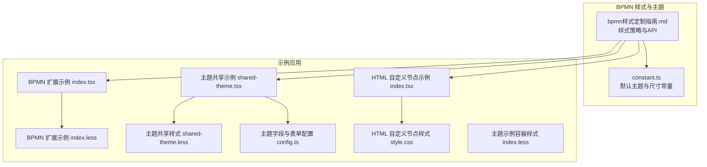
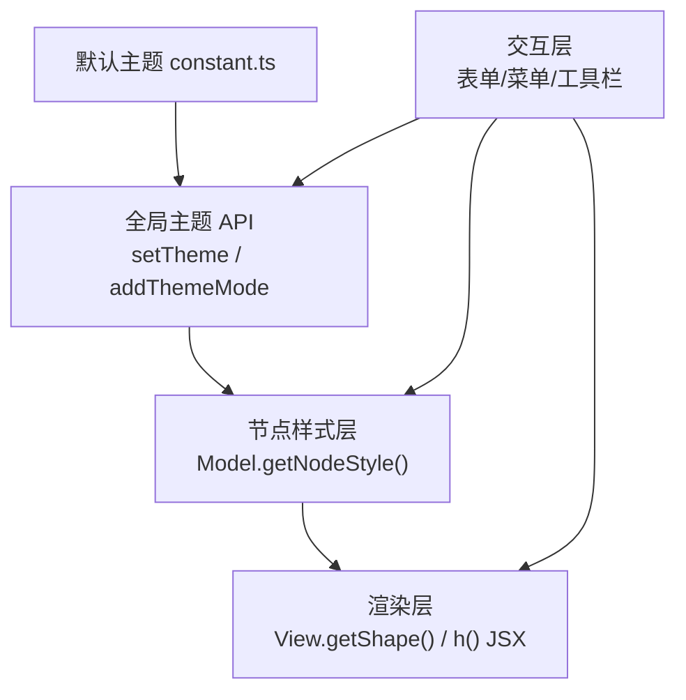
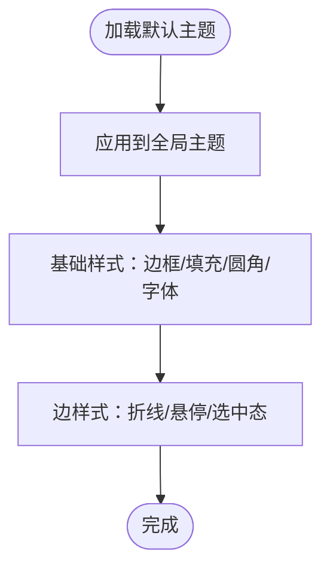
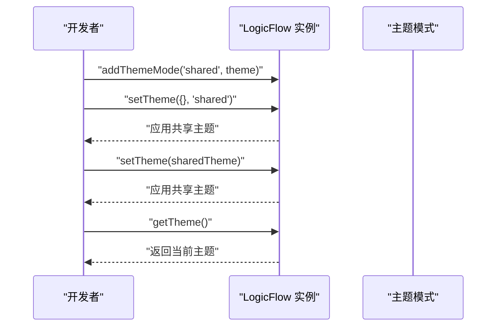
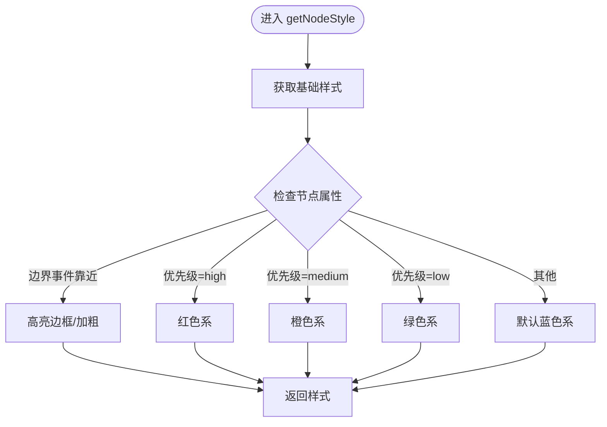
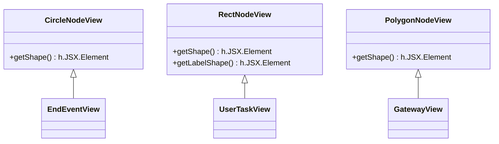
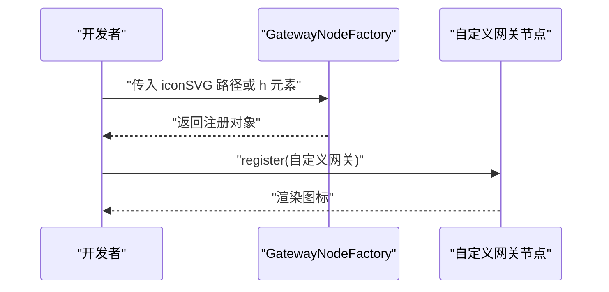
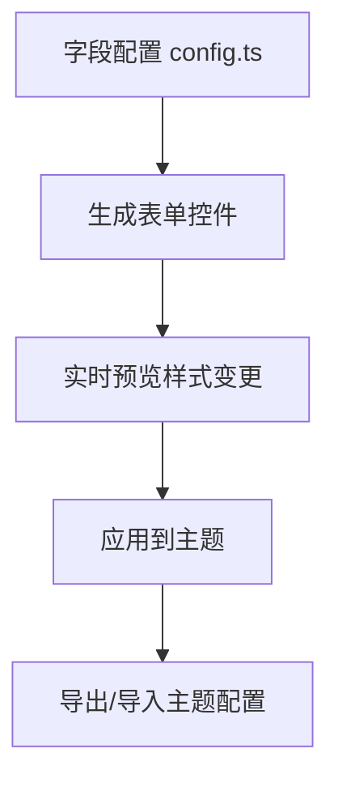
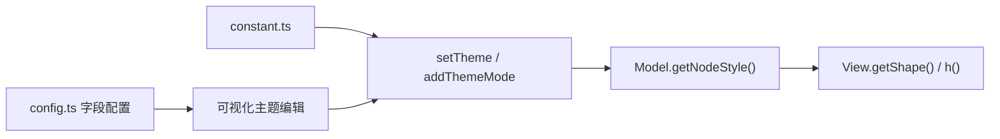

# 样式定制与主题配置

<cite>
**本文引用的文件**
- [bpmn样式定制指南.md](file://flow-docs/bpmn-style-customization.md)
- [常量与默认主题配置 constant.ts](file://packages/extension/src/bpmn/constant.ts)
- [BPMN 扩展示例 index.tsx](file://examples/feature-examples/src/pages/extensions/bpmn/index.tsx)
- [BPMN 扩展示例 index.less](file://examples/feature-examples/src/pages/extensions/bpmn/index.less)
- [主题共享示例 shared-theme.tsx](file://examples/feature-examples/src/pages/theme/shared-theme.tsx)
- [主题共享样式 shared-theme.less](file://examples/feature-examples/src/pages/theme/shared-theme.less)
- [主题字段与表单配置 config.ts](file://examples/feature-examples/src/pages/theme/config.ts)
- [HTML 自定义节点示例 index.tsx](file://examples/feature-examples/src/pages/nodes/custom/html/index.tsx)
- [HTML 自定义节点样式 style.css](file://examples/feature-examples/src/pages/nodes/custom/html/style.css)
- [主题示例容器样式 index.less](file://examples/feature-examples/src/pages/theme/index.less)
</cite>

## 目录
1. [简介](#简介)
2. [项目结构](#项目结构)
3. [核心组件](#核心组件)
4. [架构总览](#架构总览)
5. [详细组件分析](#详细组件分析)
6. [依赖关系分析](#依赖关系分析)
7. [性能考量](#性能考量)
8. [故障排查指南](#故障排查指南)
9. [结论](#结论)
10. [附录](#附录)

## 简介
本指南面向在 LogicFlow 中进行 BPMN 样式定制与主题配置的开发者，系统讲解如何通过全局主题、节点样式覆盖、自定义渲染、图标与动画等手段，实现从品牌色彩到无障碍与响应式的完整视觉体系。文档结合仓库中的实际示例与源码片段路径，帮助你快速落地企业级 BPMN 设计界面。

## 项目结构
围绕样式与主题的关键目录与文件：
- BPMN 默认主题与常量：packages/extension/src/bpmn/constant.ts
- BPMN 扩展示例：examples/feature-examples/src/pages/extensions/bpmn/*
- 主题共享与切换示例：examples/feature-examples/src/pages/theme/*
- HTML 自定义节点示例：examples/feature-examples/src/pages/nodes/custom/html/*

**图表来源**
- [常量与默认主题配置 constant.ts](file://packages/extension/src/bpmn/constant.ts#L1-L57)
- [BPMN 扩展示例 index.tsx](file://examples/feature-examples/src/pages/extensions/bpmn/index.tsx#L1-L367)
- [BPMN 扩展示例 index.less](file://examples/feature-examples/src/pages/extensions/bpmn/index.less#L1-L49)
- [主题共享示例 shared-theme.tsx](file://examples/feature-examples/src/pages/theme/shared-theme.tsx#L1-L304)
- [主题共享样式 shared-theme.less](file://examples/feature-examples/src/pages/theme/shared-theme.less#L1-L42)
- [主题字段与表单配置 config.ts](file://examples/feature-examples/src/pages/theme/config.ts#L1-L645)
- [HTML 自定义节点示例 index.tsx](file://examples/feature-examples/src/pages/nodes/custom/html/index.tsx#L1-L49)
- [HTML 自定义节点样式 style.css](file://examples/feature-examples/src/pages/nodes/custom/html/style.css#L1-L44)
- [主题示例容器样式 index.less](file://examples/feature-examples/src/pages/theme/index.less#L1-L6)

**章节来源**
- [BPMN 扩展示例 index.tsx](file://examples/feature-examples/src/pages/extensions/bpmn/index.tsx#L1-L367)
- [BPMN 扩展示例 index.less](file://examples/feature-examples/src/pages/extensions/bpmn/index.less#L1-L49)
- [主题共享示例 shared-theme.tsx](file://examples/feature-examples/src/pages/theme/shared-theme.tsx#L1-L304)
- [主题共享样式 shared-theme.less](file://examples/feature-examples/src/pages/theme/shared-theme.less#L1-L42)
- [HTML 自定义节点示例 index.tsx](file://examples/feature-examples/src/pages/nodes/custom/html/index.tsx#L1-L49)
- [HTML 自定义节点样式 style.css](file://examples/feature-examples/src/pages/nodes/custom/html/style.css#L1-L44)
- [主题示例容器样式 index.less](file://examples/feature-examples/src/pages/theme/index.less#L1-L6)

## 核心组件
- 默认主题与尺寸常量：提供 BPMN 元素的基础尺寸与默认主题配置，作为全局样式的基线。
- 全局主题 API：通过 setTheme 与 addThemeMode 实现主题切换与共享。
- 节点样式覆盖：在 Model 层重写 getNodeStyle 或在 View 层重写 getShape 实现局部样式定制。
- 图标与渲染：通过工厂函数 icon 参数与 h() JSX 渲染实现图标与复杂图形。
- 表单化主题配置：基于字段配置生成可视化表单，动态调整主题参数。

**章节来源**
- [bpmn样式定制指南.md](file://flow-docs/bpmn-style-customization.md#L1-L668)
- [常量与默认主题配置 constant.ts](file://packages/extension/src/bpmn/constant.ts#L1-L57)
- [主题共享示例 shared-theme.tsx](file://examples/feature-examples/src/pages/theme/shared-theme.tsx#L1-L304)
- [主题字段与表单配置 config.ts](file://examples/feature-examples/src/pages/theme/config.ts#L1-L645)

## 架构总览
整体架构由“默认主题”“全局主题 API”“节点样式层”“渲染层”“交互层”组成，形成从全局到局部、从静态到动态的多层样式体系。

**图表来源**
- [常量与默认主题配置 constant.ts](file://packages/extension/src/bpmn/constant.ts#L28-L56)
- [主题共享示例 shared-theme.tsx](file://examples/feature-examples/src/pages/theme/shared-theme.tsx#L159-L184)
- [bpmn样式定制指南.md](file://flow-docs/bpmn-style-customization.md#L133-L383)

## 详细组件分析

### 1) 默认主题与尺寸常量
- 默认主题包含 rect/circle/polygon/polyline/edgeText 等关键样式键，提供统一的默认外观。
- 尺寸常量用于事件与任务等元素的默认宽高，保证一致性与可扩展性。

**图表来源**
- [常量与默认主题配置 constant.ts](file://packages/extension/src/bpmn/constant.ts#L28-L56)

**章节来源**
- [常量与默认主题配置 constant.ts](file://packages/extension/src/bpmn/constant.ts#L1-L57)

### 2) 全局主题 API 与主题切换
- 通过 setTheme 可直接覆盖全局样式；addThemeMode 支持注册共享主题模式，便于跨实例复用。
- 示例中展示了“共享主题”的注册、切换、导出与导入流程。

**图表来源**
- [主题共享示例 shared-theme.tsx](file://examples/feature-examples/src/pages/theme/shared-theme.tsx#L159-L184)
- [主题共享示例 shared-theme.tsx](file://examples/feature-examples/src/pages/theme/shared-theme.tsx#L187-L208)
- [主题共享示例 shared-theme.tsx](file://examples/feature-examples/src/pages/theme/shared-theme.tsx#L211-L273)

**章节来源**
- [主题共享示例 shared-theme.tsx](file://examples/feature-examples/src/pages/theme/shared-theme.tsx#L1-L304)
- [主题字段与表单配置 config.ts](file://examples/feature-examples/src/pages/theme/config.ts#L174-L410)

### 3) 节点样式覆盖（Model 层）
- 在 Model 中重写 getNodeStyle 可实现节点级样式覆盖，支持根据属性动态切换颜色与边框宽度。
- 示例中展示了“任务节点高亮”“按优先级着色”“按状态变色”等场景。

**图表来源**
- [bpmn样式定制指南.md](file://flow-docs/bpmn-style-customization.md#L203-L228)
- [bpmn样式定制指南.md](file://flow-docs/bpmn-style-customization.md#L169-L199)

**章节来源**
- [bpmn样式定制指南.md](file://flow-docs/bpmn-style-customization.md#L133-L228)

### 4) 自定义渲染（View 层）
- 通过重写 getShape 并使用 h() JSX，可实现复杂图形与图标组合，如“结束事件内外两圈”“用户任务图标”“网关图标”等。
- h() 函数语法简洁，支持标签、属性与子元素数组。

**图表来源**
- [bpmn样式定制指南.md](file://flow-docs/bpmn-style-customization.md#L238-L266)
- [bpmn样式定制指南.md](file://flow-docs/bpmn-style-customization.md#L270-L318)
- [bpmn样式定制指南.md](file://flow-docs/bpmn-style-customization.md#L323-L358)
- [bpmn样式定制指南.md](file://flow-docs/bpmn-style-customization.md#L360-L382)

**章节来源**
- [bpmn样式定制指南.md](file://flow-docs/bpmn-style-customization.md#L230-L383)

### 5) 图标自定义与 SVG 渲染
- 工厂函数支持传入 icon（字符串 SVG 路径或 h() 元素），实现网关与任务图标自定义。
- 示例中展示了“排他/并行/包容网关图标”“复杂图标（h() 组合）”。

**图表来源**
- [bpmn样式定制指南.md](file://flow-docs/bpmn-style-customization.md#L390-L454)

**章节来源**
- [bpmn样式定制指南.md](file://flow-docs/bpmn-style-customization.md#L384-L454)

### 6) 表单化主题配置与动态调整
- 通过字段配置生成表单，支持颜色、数值、选择、文本等类型，覆盖节点、边、文本、画布等类别。
- 示例中提供了“基础节点/边”“画布背景/网格”“节点/边/文本/其他元素”等分类与字段映射。

**图表来源**
- [主题字段与表单配置 config.ts](file://examples/feature-examples/src/pages/theme/config.ts#L174-L410)
- [主题共享示例 shared-theme.tsx](file://examples/feature-examples/src/pages/theme/shared-theme.tsx#L187-L273)

**章节来源**
- [主题字段与表单配置 config.ts](file://examples/feature-examples/src/pages/theme/config.ts#L1-L645)
- [主题共享示例 shared-theme.tsx](file://examples/feature-examples/src/pages/theme/shared-theme.tsx#L1-L304)

### 7) HTML 自定义节点样式
- 通过注册自定义 HTML 节点并在样式文件中定义 CSS，实现更丰富的 UI 与交互。
- 示例中展示了 UML 风格的容器、按钮、头部与底部区域的样式组织。

**章节来源**
- [HTML 自定义节点示例 index.tsx](file://examples/feature-examples/src/pages/nodes/custom/html/index.tsx#L1-L49)
- [HTML 自定义节点样式 style.css](file://examples/feature-examples/src/pages/nodes/custom/html/style.css#L1-L44)

### 8) BPMN 扩展示例与布局
- 扩展示例页面集成了多种插件（BpmnElement、MiniMap、DndPanel、Menu 等），并通过 LESS 控制面板与工具栏样式。
- 页面通过 setPatternItems 设置拖拽面板节点，setContextMenuByType 配置上下文菜单。

**章节来源**
- [BPMN 扩展示例 index.tsx](file://examples/feature-examples/src/pages/extensions/bpmn/index.tsx#L1-L367)
- [BPMN 扩展示例 index.less](file://examples/feature-examples/src/pages/extensions/bpmn/index.less#L1-L49)

## 依赖关系分析
- 默认主题依赖 LogicFlow Theme 接口，提供基础样式键。
- 全局主题 API 依赖于实例 setTheme 与静态 addThemeMode。
- 节点样式覆盖与自定义渲染依赖于 Model/View 的继承与 h() JSX 渲染。
- 表单化主题配置依赖字段类型与分类映射，驱动可视化编辑。

**图表来源**
- [常量与默认主题配置 constant.ts](file://packages/extension/src/bpmn/constant.ts#L28-L56)
- [主题字段与表单配置 config.ts](file://examples/feature-examples/src/pages/theme/config.ts#L174-L410)
- [bpmn样式定制指南.md](file://flow-docs/bpmn-style-customization.md#L601-L668)

**章节来源**
- [常量与默认主题配置 constant.ts](file://packages/extension/src/bpmn/constant.ts#L1-L57)
- [bpmn样式定制指南.md](file://flow-docs/bpmn-style-customization.md#L601-L668)
- [主题字段与表单配置 config.ts](file://examples/feature-examples/src/pages/theme/config.ts#L1-L645)

## 性能考量
- 避免在 getShape 中进行复杂计算，该方法会被频繁调用。
- 合理使用 CSS 动画与滤镜（如阴影、模糊），注意在低端设备上的性能影响。
- 通过 setProperties 触发重渲染时，尽量批量更新属性，减少不必要的刷新。

**章节来源**
- [bpmn样式定制指南.md](file://flow-docs/bpmn-style-customization.md#L648-L660)

## 故障排查指南
- 样式未生效：检查样式优先级（节点级别 > 全局主题 > 默认样式），确认是否正确调用 setTheme 或重写 getNodeStyle。
- SVG 属性错误：确保使用正确的 SVG 属性名（如 strokeWidth），避免使用 CSS 风格的连字符命名。
- 主题切换异常：确认 addThemeMode 是否在 setTheme 前注册，且主题键一致。
- 动画不生效：确认 CSS 动画类名与 h() JSX 中的 className 一致，并检查浏览器兼容性。

**章节来源**
- [bpmn样式定制指南.md](file://flow-docs/bpmn-style-customization.md#L648-L668)

## 结论
通过默认主题、全局主题 API、节点样式覆盖、自定义渲染与表单化配置，LogicFlow 为 BPMN 样式定制提供了从基础到高级的全栈能力。结合品牌色彩、无障碍与响应式设计，可构建既美观又易用的企业级流程设计器。

## 附录
- 样式 API 快速参考
  - 全局主题：setTheme(theme)，addThemeMode(mode, theme)
  - 节点样式：model.getNodeStyle()，model.setStyles(styles)
  - 获取样式：lf.getNodeStyleById(id)
- 常用样式键
  - 节点：fill、stroke、strokeWidth、radius、rx、ry
  - 边：stroke、strokeWidth、strokeDasharray、startArrowType、endArrowType
  - 文本：color、fontSize、fontFamily、fontWeight、textWidth、overflowMode
  - 画布：background、grid、filter

**章节来源**
- [bpmn样式定制指南.md](file://flow-docs/bpmn-style-customization.md#L601-L668)
- [主题字段与表单配置 config.ts](file://examples/feature-examples/src/pages/theme/config.ts#L413-L642)