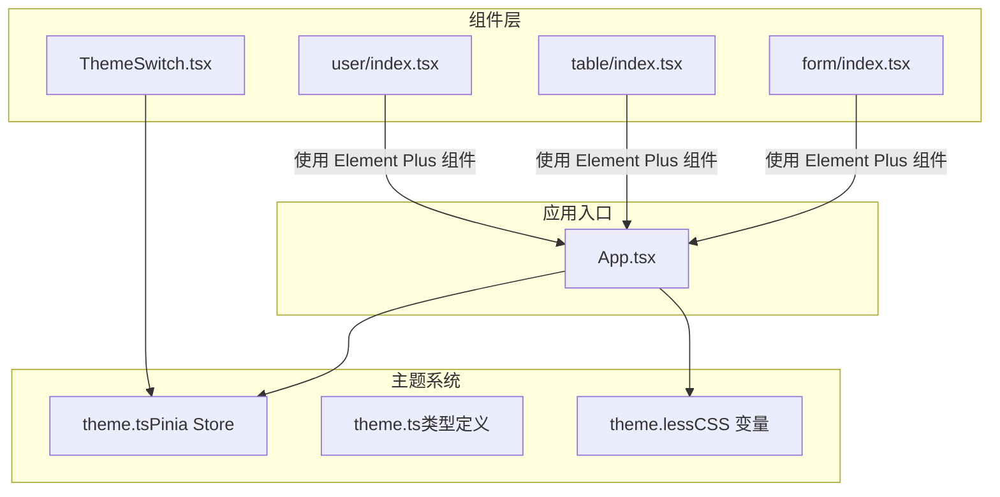
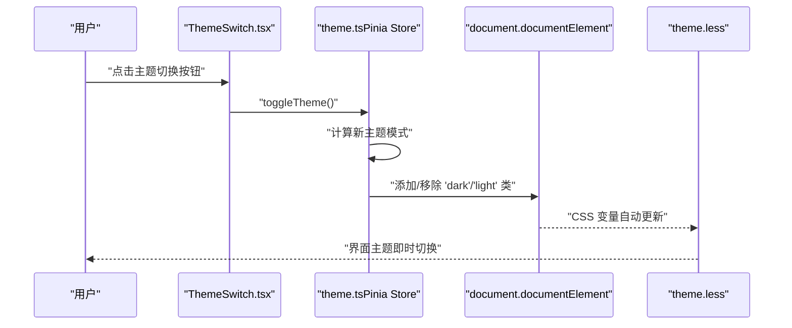
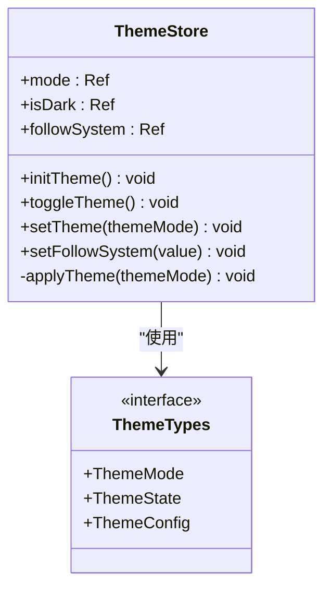
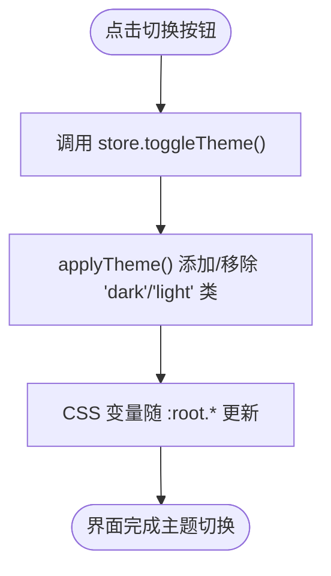
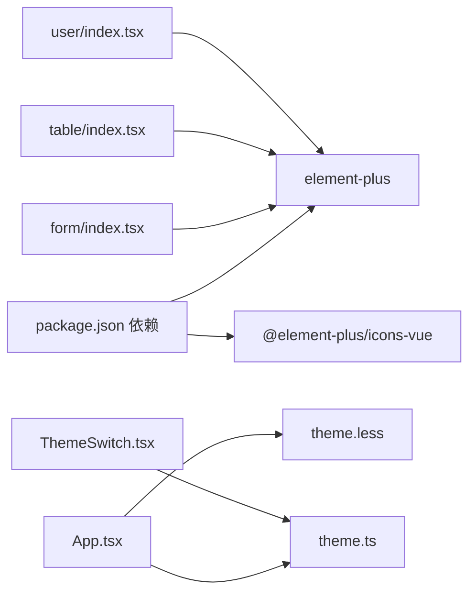

# Element Plus 集成

<cite>
**本文引用的文件**
- [package.json](file://package.json)
- [theme.less](file://src/styles/theme.less)
- [theme.ts](file://src/stores/theme.ts)
- [ThemeSwitch.tsx](file://src/components/theme/ThemeSwitch.tsx)
- [ThemeSwitch.less](file://src/components/theme/ThemeSwitch.less)
- [global.less](file://src/styles/global.less)
- [App.tsx](file://src/App.tsx)
- [theme.ts（类型定义）](file://src/types/theme.ts)
- [form/index.tsx](file://src/views/components/form/index.tsx)
- [table/index.tsx](file://src/views/components/table/index.tsx)
- [user/index.tsx](file://src/views/system/user/index.tsx)
- [palette.js（Material-UI）](file://examples/material-ui-demo/src/themes/palette.js)
- [typography.js（Material-UI）](file://examples/material-ui-demo/src/themes/typography.js)
</cite>

## 目录
1. [简介](#简介)
2. [项目结构](#项目结构)
3. [核心组件](#核心组件)
4. [架构总览](#架构总览)
5. [详细组件分析](#详细组件分析)
6. [依赖关系分析](#依赖关系分析)
7. [性能考量](#性能考量)
8. [故障排查指南](#故障排查指南)
9. [结论](#结论)
10. [附录](#附录)

## 简介
本文件系统性梳理该项目中 Element Plus UI 组件库的集成方式与最佳实践，重点覆盖以下方面：
- 全局样式组织：CSS 变量、Less 变量与主题色体系
- 主题切换机制：基于根元素类名与 CSS 变量的动态切换
- 组件样式覆盖：如何在不破坏 Element Plus 默认样式的前提下进行定制
- 响应式设计：结合主题变量与组件属性实现一致的跨设备体验
- 使用示例与最佳实践：在表单、表格等典型场景中的推荐写法
- 自定义主题开发指南：从变量到组件样式的完整工作流
- 与 Material-UI 的差异与迁移建议：对比两者的主题体系与切换机制

## 项目结构
该项目采用 Vue 3 + Rsbuild 构建，Element Plus 作为主要 UI 组件库。主题系统通过 Less 变量与 CSS 变量双层抽象实现，配合 Pinia Store 实现主题状态管理与持久化。

图表来源
- [App.tsx](file://src/App.tsx#L1-L20)
- [theme.ts](file://src/stores/theme.ts#L1-L111)
- [theme.less](file://src/styles/theme.less#L1-L176)
- [form/index.tsx](file://src/views/components/form/index.tsx#L1-L73)
- [table/index.tsx](file://src/views/components/table/index.tsx#L1-L43)
- [user/index.tsx](file://src/views/system/user/index.tsx#L1-L40)
- [ThemeSwitch.tsx](file://src/components/theme/ThemeSwitch.tsx#L1-L93)

章节来源
- [package.json](file://package.json#L1-L45)
- [App.tsx](file://src/App.tsx#L1-L20)
- [theme.less](file://src/styles/theme.less#L1-L176)
- [theme.ts](file://src/stores/theme.ts#L1-L111)
- [ThemeSwitch.tsx](file://src/components/theme/ThemeSwitch.tsx#L1-L93)

## 核心组件
- 主题状态管理（Pinia Store）
  - 职责：维护当前主题模式、是否跟随系统、持久化与变更监听
  - 关键能力：初始化主题、切换主题、设置跟随系统、应用到 DOM 类名
- 主题切换组件（ThemeSwitch）
  - 职责：提供可视化主题切换按钮，支持 Tooltip 提示与多尺寸
  - 交互：点击触发 Store 切换，内部读取 isDark 状态驱动渲染
- 全局样式（theme.less）
  - 职责：定义深浅两套主题的 CSS 变量，覆盖背景、文本、边框、阴影、卡片、表格、输入框、标签页等
  - 特点：以 :root.dark/:root.light 控制主题切换；同时保留 Less 变量用于编译期计算
- 页面级组件（Form/Table/User）
  - 职责：演示 Element Plus 组件在实际业务中的使用方式
  - 共性：统一使用 el-card、el-form、el-table 等容器与布局组件

章节来源
- [theme.ts](file://src/stores/theme.ts#L34-L111)
- [ThemeSwitch.tsx](file://src/components/theme/ThemeSwitch.tsx#L1-L93)
- [theme.less](file://src/styles/theme.less#L1-L176)
- [form/index.tsx](file://src/views/components/form/index.tsx#L1-L73)
- [table/index.tsx](file://src/views/components/table/index.tsx#L1-L43)
- [user/index.tsx](file://src/views/system/user/index.tsx#L1-L40)

## 架构总览
主题切换的端到端流程如下：

图表来源
- [ThemeSwitch.tsx](file://src/components/theme/ThemeSwitch.tsx#L27-L29)
- [theme.ts](file://src/stores/theme.ts#L59-L79)
- [theme.less](file://src/styles/theme.less#L21-L97)

## 详细组件分析

### 主题状态管理（Pinia Store）
- 设计要点
  - 使用 ref 管理 mode/followSystem/isDark，watch 监听变化并应用到 DOM
  - 支持系统主题监听，当 followSystem 为真时自动同步系统偏好
  - 本地存储键名为固定常量，确保跨会话一致性
- 数据模型
  - ThemeMode：'dark' | 'light'
  - ThemeState：包含 mode 与 followSystem
  - ThemeConfig：扩展字段（如 primaryColor），可作为后续主题定制的承载

图表来源
- [theme.ts](file://src/stores/theme.ts#L34-L111)
- [theme.ts（类型定义）](file://src/types/theme.ts#L1-L90)

章节来源
- [theme.ts](file://src/stores/theme.ts#L1-L111)
- [theme.ts（类型定义）](file://src/types/theme.ts#L1-L90)

### 主题切换组件（ThemeSwitch）
- 设计要点
  - 使用 Element Plus 的 ElTooltip 提供提示信息
  - 内置太阳/月亮图标，根据 isDark 状态切换
  - 支持 small/default/large 三种尺寸，样式通过独立 less 文件控制
- 交互流程
  - 点击触发 store.toggleTheme()
  - 组件内部通过 storeToRefs 订阅 isDark，实现响应式渲染

图表来源
- [ThemeSwitch.tsx](file://src/components/theme/ThemeSwitch.tsx#L27-L29)
- [theme.ts](file://src/stores/theme.ts#L44-L57)

章节来源
- [ThemeSwitch.tsx](file://src/components/theme/ThemeSwitch.tsx#L1-L93)
- [ThemeSwitch.less](file://src/components/theme/ThemeSwitch.less#L1-L147)

### 全局样式（theme.less）
- 设计要点
  - 定义深色主题为默认主题，浅色主题作为补充
  - 使用 :root.dark 与 :root.light 选择器，分别映射到不同 CSS 变量集合
  - 同时保留 Less 变量用于编译期颜色梯度计算，最终输出到 CSS 变量
- 覆盖范围
  - 背景、文字、边框、填充、阴影
  - 侧边栏、头部、卡片、表格、输入框、标签页等组件层级
- 使用建议
  - 优先通过 CSS 变量驱动样式，避免直接硬编码颜色值
  - 新增组件样式时，尽量复用现有变量，保持视觉一致性

章节来源
- [theme.less](file://src/styles/theme.less#L1-L176)

### 页面级组件（Form/Table/User）
- FormPage
  - 使用 el-card 包裹 el-form，展示基础表单项与提交/重置逻辑
  - 展示 el-input、el-select、el-option、el-form-item、el-button 的组合用法
- TablePage
  - 使用 el-card 包裹 el-table，展示静态数据表格与操作列
  - 展示 el-table-column 的常规用法与按钮图标
- UserPage
  - 展示卡片头部右侧按钮与表格的基本布局

章节来源
- [form/index.tsx](file://src/views/components/form/index.tsx#L1-L73)
- [table/index.tsx](file://src/views/components/table/index.tsx#L1-L43)
- [user/index.tsx](file://src/views/system/user/index.tsx#L1-L40)

## 依赖关系分析
- 依赖声明
  - element-plus 与 @element-plus/icons-vue 已在依赖中声明
- 构建插件
  - 使用 @rsbuild/plugin-vue、@rsbuild/plugin-vue-jsx、@rsbuild/plugin-less
- 主题相关文件
  - theme.less 由 App.tsx 引入，确保在应用启动时加载
  - theme.ts 通过 useThemeStore 初始化主题并监听系统偏好

图表来源
- [package.json](file://package.json#L14-L26)
- [App.tsx](file://src/App.tsx#L1-L20)
- [theme.less](file://src/styles/theme.less#L1-L4)
- [theme.ts](file://src/stores/theme.ts#L1-L111)
- [ThemeSwitch.tsx](file://src/components/theme/ThemeSwitch.tsx#L1-L93)
- [form/index.tsx](file://src/views/components/form/index.tsx#L1-L73)
- [table/index.tsx](file://src/views/components/table/index.tsx#L1-L43)
- [user/index.tsx](file://src/views/system/user/index.tsx#L1-L40)

章节来源
- [package.json](file://package.json#L1-L45)
- [App.tsx](file://src/App.tsx#L1-L20)

## 性能考量
- 主题切换成本低：仅切换根元素类名，CSS 变量即时生效，无需重绘整个页面
- 组件按需引入：Element Plus 支持按需导入，建议在构建配置中启用以减少包体积
- 样式组织清晰：将主题变量集中管理，避免重复定义导致的样式冲突与计算开销
- 图标优化：使用 @element-plus/icons-vue，按需引入图标组件，降低首屏体积

## 故障排查指南
- 主题未生效
  - 检查 App.tsx 是否正确引入 theme.less 并调用 initTheme()
  - 确认 document.documentElement 上存在 'dark' 或 'light' 类
- 切换后样式异常
  - 检查 theme.less 中 :root.dark 与 :root.light 的变量映射是否完整
  - 确认组件未硬编码颜色值，优先使用 CSS 变量
- 系统主题不同步
  - 确认 followSystem 已开启，并检查浏览器媒体查询事件是否正常触发
- 图标不显示
  - 确认 @element-plus/icons-vue 已安装并在组件中正确引入

章节来源
- [App.tsx](file://src/App.tsx#L10-L13)
- [theme.ts](file://src/stores/theme.ts#L82-L94)
- [theme.less](file://src/styles/theme.less#L21-L97)

## 结论
本项目通过“Less 变量 + CSS 变量”的双层主题体系，结合 Pinia Store 实现了稳定、可维护的主题切换机制。Element Plus 组件在页面中被广泛使用，配合统一的样式变量与卡片布局，形成了清晰、一致的视觉语言。建议在后续迭代中持续完善变量覆盖策略与组件样式隔离，确保主题系统的可扩展性与可维护性。

## 附录

### 使用示例与最佳实践
- 表单场景
  - 使用 el-card 包裹 el-form，合理拆分 el-form-item
  - 对必填项与校验信息进行明确标注
- 表格场景
  - 使用 el-table-column 明确列定义，操作列使用小尺寸按钮
  - 对复杂操作使用 Tooltip 提升可用性
- 按钮与图标
  - 操作按钮优先使用 ElTooltip 提供上下文提示
  - 图标使用 @element-plus/icons-vue，按需引入

章节来源
- [form/index.tsx](file://src/views/components/form/index.tsx#L27-L68)
- [table/index.tsx](file://src/views/components/table/index.tsx#L14-L39)
- [ThemeSwitch.tsx](file://src/components/theme/ThemeSwitch.tsx#L78-L87)

### 自定义主题开发指南
- 变量定义
  - 在 theme.less 中新增或调整 CSS 变量，确保深浅两套主题均覆盖
  - 如需编译期颜色梯度，可在 Less 层定义变量，最终映射到 CSS 变量
- 组件样式隔离
  - 优先使用 CSS 变量驱动样式，避免在组件内硬编码颜色
  - 对第三方组件的覆盖，建议通过作用域类名或 CSS Modules 限定影响范围
- 动态样式注入
  - 通过根元素类名切换实现主题切换，避免直接修改内联样式
- 响应式设计
  - 在组件属性层面使用 size、type 等语义化参数，结合 CSS 变量实现一致的响应式表现

章节来源
- [theme.less](file://src/styles/theme.less#L1-L176)
- [ThemeSwitch.less](file://src/components/theme/ThemeSwitch.less#L1-L147)

### 与 Material-UI 的差异与迁移建议
- 主题体系差异
  - Element Plus：以 CSS 变量与根元素类名为核心，Less 变量用于编译期计算
  - Material-UI：以 palette 与 typography 为核心的主题对象，通过 ThemeProvider 注入
- 切换机制差异
  - Element Plus：通过切换 :root.dark/:root.light 实现主题切换
  - Material-UI：通过主题对象的 mode 字段与 palette 配置实现
- 迁移建议
  - 若从 Material-UI 迁移至 Element Plus，建议：
    - 将 palette.js 中的颜色映射到 theme.less 的 CSS 变量
    - 将 typography.js 中的排版规则映射到组件的 size、type 等属性
    - 保持切换逻辑一致：通过根元素类名或 Provider 方式实现主题切换
    - 对现有组件进行样式覆盖，确保视觉一致性

章节来源
- [palette.js（Material-UI）](file://examples/material-ui-demo/src/themes/palette.js#L1-L74)
- [typography.js（Material-UI）](file://examples/material-ui-demo/src/themes/typography.js#L1-L134)
- [theme.less](file://src/styles/theme.less#L1-L176)