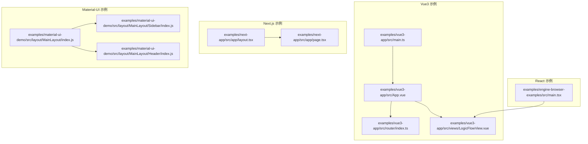
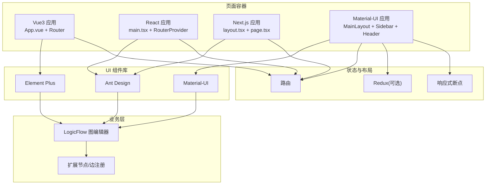
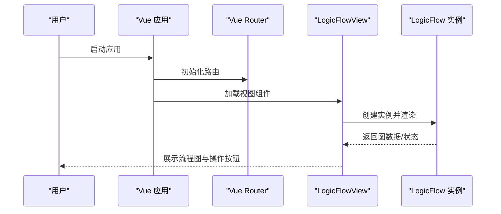
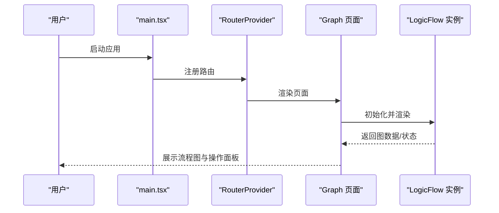
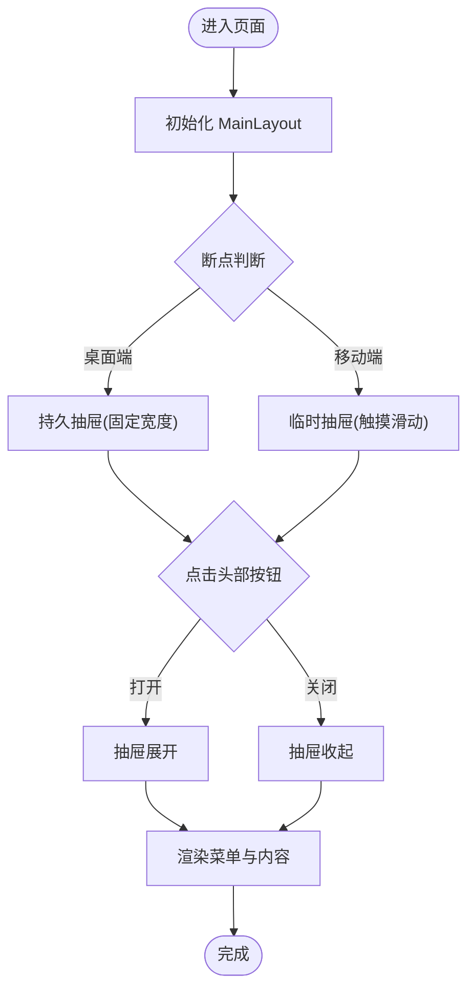
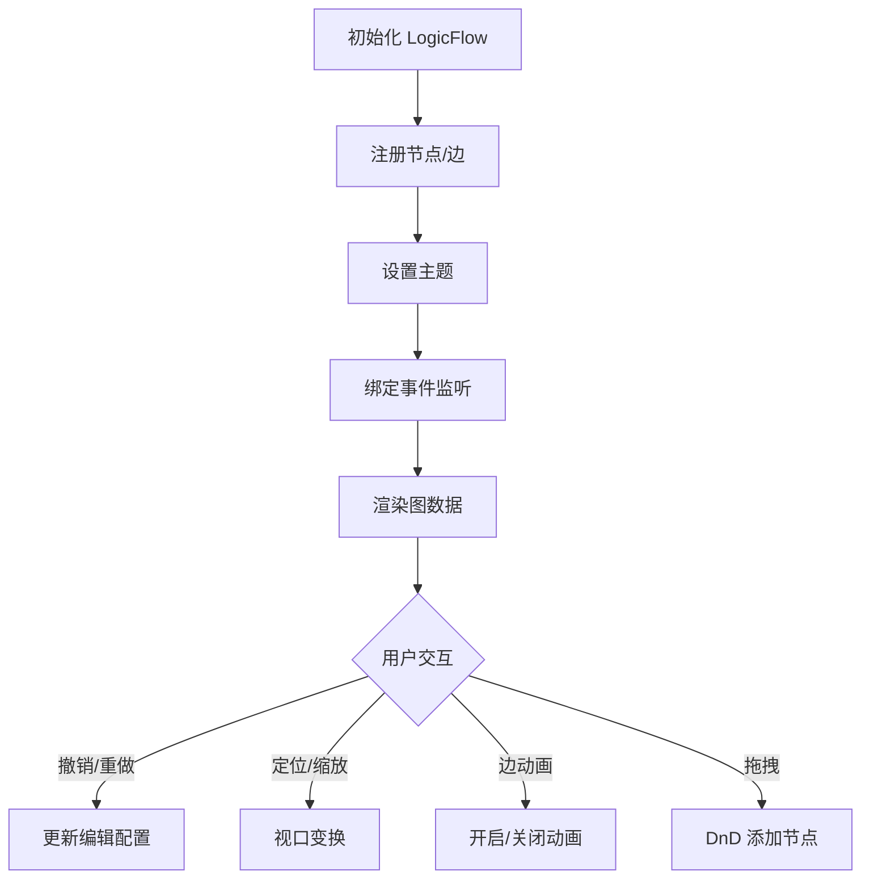
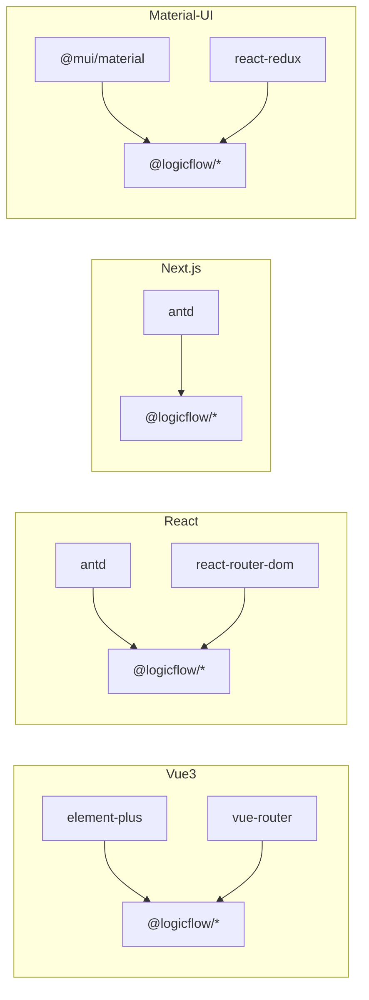

# UI 框架集成

<cite>
**本文引用的文件**
- [examples/vue3-app/src/main.ts](file://examples/vue3-app/src/main.ts)
- [examples/vue3-app/src/App.vue](file://examples/vue3-app/src/App.vue)
- [examples/vue3-app/src/router/index.ts](file://examples/vue3-app/src/router/index.ts)
- [examples/vue3-app/src/views/LogicFlowView.vue](file://examples/vue3-app/src/views/LogicFlowView.vue)
- [examples/vue3-app/src/components/LFElements/nodes/index.ts](file://examples/vue3-app/src/components/LFElements/nodes/index.ts)
- [examples/vue3-app/src/components/LFElements/edges/index.ts](file://examples/vue3-app/src/components/LFElements/edges/index.ts)
- [examples/vue3-app/src/components/chart/graph.ts](file://examples/vue3-app/src/components/chart/graph.ts)
- [examples/vue3-app/package.json](file://examples/vue3-app/package.json)
- [examples/engine-browser-examples/src/main.tsx](file://examples/engine-browser-examples/src/main.tsx)
- [examples/engine-browser-examples/package.json](file://examples/engine-browser-examples/package.json)
- [examples/material-ui-demo/src/layout/MainLayout/index.js](file://examples/material-ui-demo/src/layout/MainLayout/index.js)
- [examples/material-ui-demo/src/layout/MainLayout/Sidebar/index.js](file://examples/material-ui-demo/src/layout/MainLayout/Sidebar/index.js)
- [examples/material-ui-demo/src/layout/MainLayout/Header/index.js](file://examples/material-ui-demo/src/layout/MainLayout/Header/index.js)
- [examples/material-ui-demo/package.json](file://examples/material-ui-demo/package.json)
- [examples/next-app/src/app/layout.tsx](file://examples/next-app/src/app/layout.tsx)
- [examples/next-app/src/app/page.tsx](file://examples/next-app/src/app/page.tsx)
- [examples/next-app/package.json](file://examples/next-app/package.json)
</cite>

## 目录
1. [简介](#简介)
2. [项目结构](#项目结构)
3. [核心组件](#核心组件)
4. [架构总览](#架构总览)
5. [组件详解](#组件详解)
6. [依赖关系分析](#依赖关系分析)
7. [性能考量](#性能考量)
8. [故障排查指南](#故障排查指南)
9. [结论](#结论)
10. [附录](#附录)

## 简介
本文件面向前端开发者，系统化梳理本仓库中的 UI 框架集成实践，重点覆盖：
- Vue3 + Element Plus 的集成与应用（路由、菜单、侧边栏、主题切换等）
- 多框架支持策略：Vue3、React、Next.js、Material-UI 的集成差异与共同点
- 响应式布局与断点策略
- 组件开发规范与最佳实践
- 自定义组件开发与样式定制方法
- 以 LogicFlow 流程图为载体的状态管理与交互模式

## 项目结构
该仓库采用多示例工程组织方式，分别演示不同 UI 框架与组件库的集成方案：
- Vue3 应用：Element Plus + Vue Router + LogicFlow
- React 应用：Ant Design + React Router + LogicFlow
- Next.js 应用：Ant Design + Next App Router + LogicFlow
- Material-UI 应用：Material-UI + Redux + LogicFlow

图表来源
- [examples/vue3-app/src/main.ts](file://examples/vue3-app/src/main.ts#L1-L16)
- [examples/vue3-app/src/App.vue](file://examples/vue3-app/src/App.vue#L1-L121)
- [examples/vue3-app/src/router/index.ts](file://examples/vue3-app/src/router/index.ts#L1-L41)
- [examples/vue3-app/src/views/LogicFlowView.vue](file://examples/vue3-app/src/views/LogicFlowView.vue#L1-L537)
- [examples/engine-browser-examples/src/main.tsx](file://examples/engine-browser-examples/src/main.tsx#L1-L78)
- [examples/next-app/src/app/layout.tsx](file://examples/next-app/src/app/layout.tsx#L1-L23)
- [examples/next-app/src/app/page.tsx](file://examples/next-app/src/app/page.tsx#L1-L476)
- [examples/material-ui-demo/src/layout/MainLayout/index.js](file://examples/material-ui-demo/src/layout/MainLayout/index.js#L1-L100)
- [examples/material-ui-demo/src/layout/MainLayout/Sidebar/index.js](file://examples/material-ui-demo/src/layout/MainLayout/Sidebar/index.js#L1-L92)
- [examples/material-ui-demo/src/layout/MainLayout/Header/index.js](file://examples/material-ui-demo/src/layout/MainLayout/Header/index.js#L1-L63)

章节来源
- [examples/vue3-app/src/main.ts](file://examples/vue3-app/src/main.ts#L1-L16)
- [examples/vue3-app/src/App.vue](file://examples/vue3-app/src/App.vue#L1-L121)
- [examples/vue3-app/src/router/index.ts](file://examples/vue3-app/src/router/index.ts#L1-L41)
- [examples/engine-browser-examples/src/main.tsx](file://examples/engine-browser-examples/src/main.tsx#L1-L78)
- [examples/next-app/src/app/layout.tsx](file://examples/next-app/src/app/layout.tsx#L1-L23)
- [examples/next-app/src/app/page.tsx](file://examples/next-app/src/app/page.tsx#L1-L476)
- [examples/material-ui-demo/src/layout/MainLayout/index.js](file://examples/material-ui-demo/src/layout/MainLayout/index.js#L1-L100)

## 核心组件
- Vue3 + Element Plus 菜单与路由
  - 应用入口注册 Element Plus 与路由插件，页面通过路由驱动视图切换
  - 侧边栏菜单基于 Element Plus 菜单组件，结合图标与路由跳转
- React + Ant Design + React Router
  - 使用 React Router 进行路由配置，页面按需加载
- Next.js + Ant Design
  - App Router 结构，客户端组件中初始化 LogicFlow
- Material-UI + Redux
  - 通过 Redux 管理侧边栏展开/收起状态，响应式断点控制抽屉行为

章节来源
- [examples/vue3-app/src/main.ts](file://examples/vue3-app/src/main.ts#L1-L16)
- [examples/vue3-app/src/App.vue](file://examples/vue3-app/src/App.vue#L1-L121)
- [examples/vue3-app/src/router/index.ts](file://examples/vue3-app/src/router/index.ts#L1-L41)
- [examples/engine-browser-examples/src/main.tsx](file://examples/engine-browser-examples/src/main.tsx#L1-L78)
- [examples/next-app/src/app/page.tsx](file://examples/next-app/src/app/page.tsx#L1-L476)
- [examples/material-ui-demo/src/layout/MainLayout/index.js](file://examples/material-ui-demo/src/layout/MainLayout/index.js#L1-L100)

## 架构总览
下图展示了多框架在“页面容器 + 路由 + UI 组件库 + LogicFlow 图编辑器”的通用架构，并标注各框架的关键差异点。

图表来源
- [examples/vue3-app/src/App.vue](file://examples/vue3-app/src/App.vue#L1-L121)
- [examples/vue3-app/src/router/index.ts](file://examples/vue3-app/src/router/index.ts#L1-L41)
- [examples/engine-browser-examples/src/main.tsx](file://examples/engine-browser-examples/src/main.tsx#L1-L78)
- [examples/next-app/src/app/layout.tsx](file://examples/next-app/src/app/layout.tsx#L1-L23)
- [examples/next-app/src/app/page.tsx](file://examples/next-app/src/app/page.tsx#L1-L476)
- [examples/material-ui-demo/src/layout/MainLayout/index.js](file://examples/material-ui-demo/src/layout/MainLayout/index.js#L1-L100)
- [examples/material-ui-demo/src/layout/MainLayout/Sidebar/index.js](file://examples/material-ui-demo/src/layout/MainLayout/Sidebar/index.js#L1-L92)
- [examples/material-ui-demo/src/layout/MainLayout/Header/index.js](file://examples/material-ui-demo/src/layout/MainLayout/Header/index.js#L1-L63)

## 组件详解

### Vue3 + Element Plus 集成
- 应用入口
  - 注册 Element Plus 与路由插件，挂载根组件
- 侧边栏与菜单
  - 使用 Element Plus 菜单组件，结合路由跳转实现导航
  - 菜单项与路由路径一一对应，便于统一管理
- 路由
  - 基于 Vue Router 的历史模式，定义多个视图组件
- LogicFlow 集成
  - 在视图中初始化 LogicFlow，注册自定义节点/边
  - 支持主题配置、键盘快捷键、DnD 拖拽等能力
- 响应式布局
  - 通过媒体查询控制侧边栏宽度与内容区域宽度，保证小屏适配

图表来源
- [examples/vue3-app/src/main.ts](file://examples/vue3-app/src/main.ts#L1-L16)
- [examples/vue3-app/src/router/index.ts](file://examples/vue3-app/src/router/index.ts#L1-L41)
- [examples/vue3-app/src/views/LogicFlowView.vue](file://examples/vue3-app/src/views/LogicFlowView.vue#L1-L537)

章节来源
- [examples/vue3-app/src/main.ts](file://examples/vue3-app/src/main.ts#L1-L16)
- [examples/vue3-app/src/App.vue](file://examples/vue3-app/src/App.vue#L1-L121)
- [examples/vue3-app/src/router/index.ts](file://examples/vue3-app/src/router/index.ts#L1-L41)
- [examples/vue3-app/src/views/LogicFlowView.vue](file://examples/vue3-app/src/views/LogicFlowView.vue#L1-L537)

### React + Ant Design 集成
- 路由
  - 使用 React Router 的 createBrowserRouter 定义嵌套路由
- LogicFlow
  - 在页面组件中初始化 LogicFlow，注册自定义节点/边
- 交互
  - 通过 Ant Design 的按钮与分割线组织操作面板

图表来源
- [examples/engine-browser-examples/src/main.tsx](file://examples/engine-browser-examples/src/main.tsx#L1-L78)
- [examples/next-app/src/app/page.tsx](file://examples/next-app/src/app/page.tsx#L1-L476)

章节来源
- [examples/engine-browser-examples/src/main.tsx](file://examples/engine-browser-examples/src/main.tsx#L1-L78)
- [examples/next-app/src/app/page.tsx](file://examples/next-app/src/app/page.tsx#L1-L476)

### Next.js + Ant Design 集成
- App Router
  - layout.tsx 定义全局样式与字体
  - page.tsx 作为客户端组件，负责初始化 LogicFlow
- 逻辑
  - 与 React 示例类似，但运行在 Next.js 的服务端渲染/客户端激活模型下

章节来源
- [examples/next-app/src/app/layout.tsx](file://examples/next-app/src/app/layout.tsx#L1-L23)
- [examples/next-app/src/app/page.tsx](file://examples/next-app/src/app/page.tsx#L1-L476)

### Material-UI + Redux 集成
- 主布局
  - MainLayout 负责头部、侧边栏、面包屑与主内容区
- 侧边栏与菜单
  - Sidebar 根据断点显示/隐藏，支持移动端与桌面端差异化
  - Header 提供抽屉开关按钮
- 状态管理
  - 使用 Redux 管理抽屉展开/收起状态，响应式断点控制抽屉行为

图表来源
- [examples/material-ui-demo/src/layout/MainLayout/index.js](file://examples/material-ui-demo/src/layout/MainLayout/index.js#L1-L100)
- [examples/material-ui-demo/src/layout/MainLayout/Sidebar/index.js](file://examples/material-ui-demo/src/layout/MainLayout/Sidebar/index.js#L1-L92)
- [examples/material-ui-demo/src/layout/MainLayout/Header/index.js](file://examples/material-ui-demo/src/layout/MainLayout/Header/index.js#L1-L63)

章节来源
- [examples/material-ui-demo/src/layout/MainLayout/index.js](file://examples/material-ui-demo/src/layout/MainLayout/index.js#L1-L100)
- [examples/material-ui-demo/src/layout/MainLayout/Sidebar/index.js](file://examples/material-ui-demo/src/layout/MainLayout/Sidebar/index.js#L1-L92)
- [examples/material-ui-demo/src/layout/MainLayout/Header/index.js](file://examples/material-ui-demo/src/layout/MainLayout/Header/index.js#L1-L63)

### LogicFlow 扩展与主题
- 节点/边注册
  - 通过集中导出模块统一注册多种节点与边
- 主题配置
  - 通过 setTheme 设置节点文本、边文本、箭头、基础样式等
- 交互能力
  - 键盘快捷键、撤销重做、居中/适应屏幕、边动画开关、拖拽添加节点等

图表来源
- [examples/vue3-app/src/views/LogicFlowView.vue](file://examples/vue3-app/src/views/LogicFlowView.vue#L1-L537)
- [examples/vue3-app/src/components/LFElements/nodes/index.ts](file://examples/vue3-app/src/components/LFElements/nodes/index.ts#L1-L14)
- [examples/vue3-app/src/components/LFElements/edges/index.ts](file://examples/vue3-app/src/components/LFElements/edges/index.ts#L1-L8)

章节来源
- [examples/vue3-app/src/views/LogicFlowView.vue](file://examples/vue3-app/src/views/LogicFlowView.vue#L1-L537)
- [examples/vue3-app/src/components/LFElements/nodes/index.ts](file://examples/vue3-app/src/components/LFElements/nodes/index.ts#L1-L14)
- [examples/vue3-app/src/components/LFElements/edges/index.ts](file://examples/vue3-app/src/components/LFElements/edges/index.ts#L1-L8)

## 依赖关系分析
- Vue3 应用
  - 依赖 Element Plus、Vue Router、LogicFlow 生态包
- React 应用
  - 依赖 Ant Design、React Router、LogicFlow 生态包
- Next.js 应用
  - 依赖 Ant Design、Next、LogicFlow 生态包
- Material-UI 应用
  - 依赖 Material-UI、Redux、Ant Design Icons 等

图表来源
- [examples/vue3-app/package.json](file://examples/vue3-app/package.json#L1-L52)
- [examples/engine-browser-examples/package.json](file://examples/engine-browser-examples/package.json#L1-L39)
- [examples/material-ui-demo/package.json](file://examples/material-ui-demo/package.json#L1-L76)
- [examples/next-app/package.json](file://examples/next-app/package.json#L1-L32)

章节来源
- [examples/vue3-app/package.json](file://examples/vue3-app/package.json#L1-L52)
- [examples/engine-browser-examples/package.json](file://examples/engine-browser-examples/package.json#L1-L39)
- [examples/material-ui-demo/package.json](file://examples/material-ui-demo/package.json#L1-L76)
- [examples/next-app/package.json](file://examples/next-app/package.json#L1-L32)

## 性能考量
- 按需加载与懒加载
  - Vue3 路由对视图组件采用动态导入；React/Next.js 对页面组件进行按需加载
- 组件注册与复用
  - 将节点/边集中导出，避免重复注册，减少初始化开销
- 事件与状态
  - 仅在必要时触发事件回调，避免频繁渲染
- 图编辑器优化
  - 合理设置视口尺寸、网格与背景，减少不必要的重绘
  - 使用边动画开关与撤销重做机制，降低交互成本

## 故障排查指南
- 路由不生效或页面空白
  - 检查路由配置与组件导入是否正确
  - 确认应用入口已安装路由插件
- LogicFlow 未渲染或报错
  - 确认容器元素存在且尺寸有效
  - 检查节点/边注册顺序与类型名称一致性
- 主题或样式异常
  - 确认主题配置字段与组件库版本兼容
  - 检查样式引入顺序与作用域
- 响应式布局问题
  - 检查断点阈值与媒体查询规则
  - 确保容器宽度与侧边栏宽度计算逻辑正确

## 结论
本仓库提供了多框架下的 UI 集成范式，围绕 Element Plus、Ant Design、Material-UI 与 Next.js 的组合，演示了从路由到菜单、从侧边栏到主题切换的完整链路，并以 LogicFlow 为载体展示了复杂交互与扩展能力。开发者可据此快速落地跨框架的 UI 开发与维护策略。

## 附录

### 多框架支持策略对比
- 共同点
  - 均以“页面容器 + 路由 + UI 组件库 + LogicFlow”为核心架构
  - 通过集中导出与注册机制管理节点/边
- 差异点
  - Vue3：Composition API + Element Plus + 路由守卫/懒加载
  - React：函数组件 + Ant Design + React Router
  - Next.js：App Router + 客户端组件 + SSR/CSR 模式
  - Material-UI：Redux 管理布局状态 + 断点响应式抽屉

章节来源
- [examples/vue3-app/src/App.vue](file://examples/vue3-app/src/App.vue#L1-L121)
- [examples/vue3-app/src/router/index.ts](file://examples/vue3-app/src/router/index.ts#L1-L41)
- [examples/engine-browser-examples/src/main.tsx](file://examples/engine-browser-examples/src/main.tsx#L1-L78)
- [examples/next-app/src/app/layout.tsx](file://examples/next-app/src/app/layout.tsx#L1-L23)
- [examples/next-app/src/app/page.tsx](file://examples/next-app/src/app/page.tsx#L1-L476)
- [examples/material-ui-demo/src/layout/MainLayout/index.js](file://examples/material-ui-demo/src/layout/MainLayout/index.js#L1-L100)

### 组件开发规范与最佳实践
- 组件职责单一，尽量无副作用
- 使用集中导出统一注册节点/边，避免分散注册
- 为每个视图提供最小可运行示例，便于测试与回滚
- 为交互提供明确的事件回调与状态反馈
- 为样式提供主题变量与作用域隔离

### 自定义组件开发指南与样式定制
- 自定义节点/边
  - 在对应目录下新增文件，遵循现有命名与导出规范
  - 在视图中集中导入并注册
- 样式定制
  - 优先通过主题配置与组件库提供的样式变量
  - 若需覆盖，确保作用域正确，避免全局污染
- 响应式设计
  - 使用断点策略控制布局与组件尺寸
  - 在移动端与桌面端提供差异化体验

### 响应式设计实现技术与断点策略
- Vue3 示例
  - 通过媒体查询控制侧边栏宽度与内容区域宽度
- Material-UI 示例
  - 使用断点钩子与抽屉样式属性，区分移动端临时抽屉与桌面端持久抽屉
- React/Next.js 示例
  - 通过 Ant Design 组件与容器布局实现响应式

章节来源
- [examples/vue3-app/src/App.vue](file://examples/vue3-app/src/App.vue#L94-L119)
- [examples/material-ui-demo/src/layout/MainLayout/index.js](file://examples/material-ui-demo/src/layout/MainLayout/index.js#L37-L51)
- [examples/material-ui-demo/src/layout/MainLayout/Sidebar/index.js](file://examples/material-ui-demo/src/layout/MainLayout/Sidebar/index.js#L20-L21)