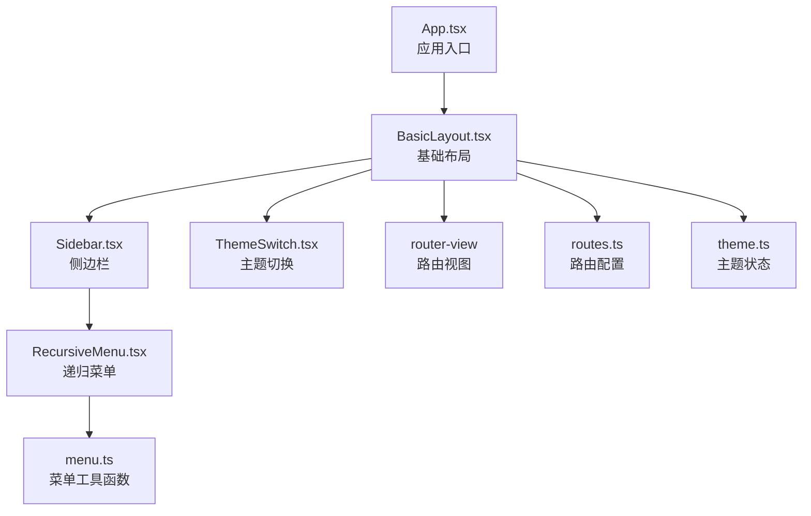
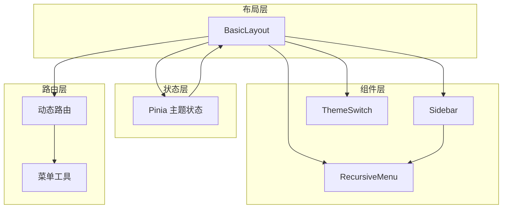
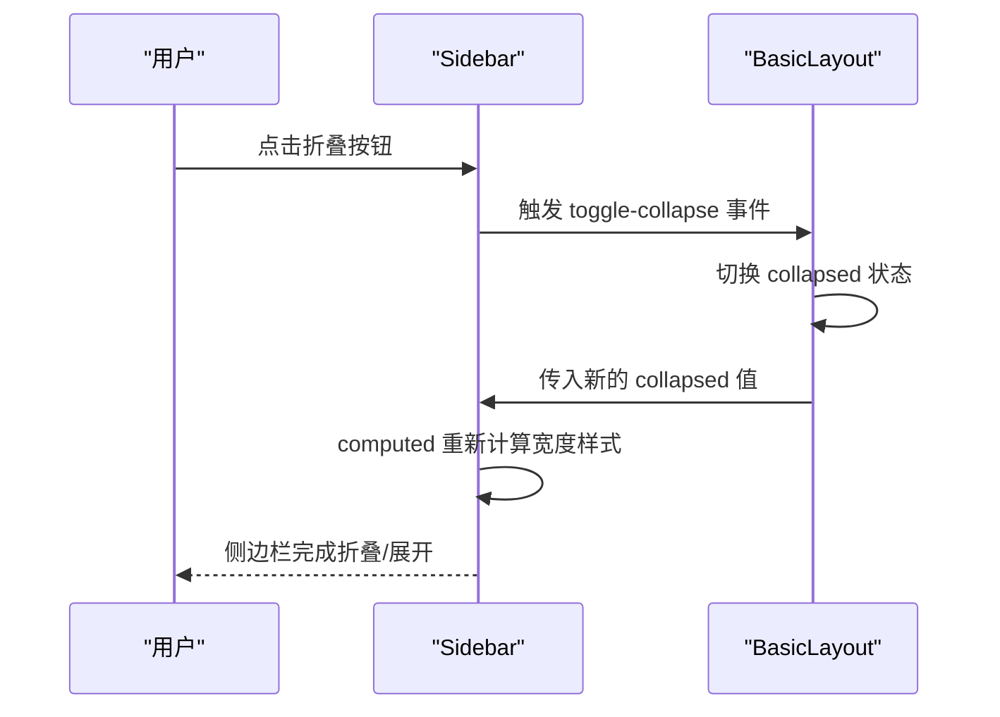
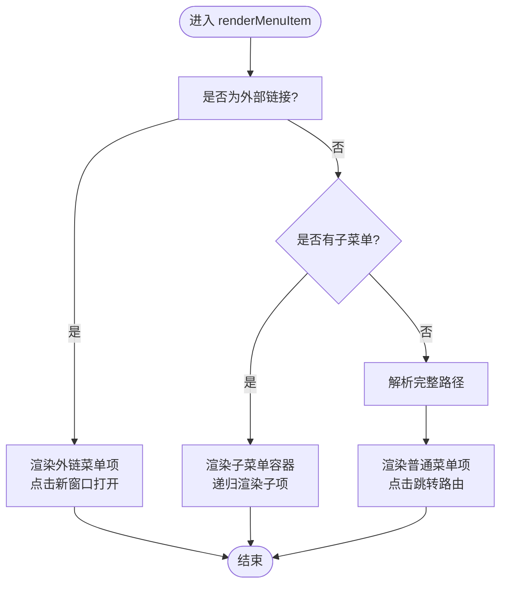
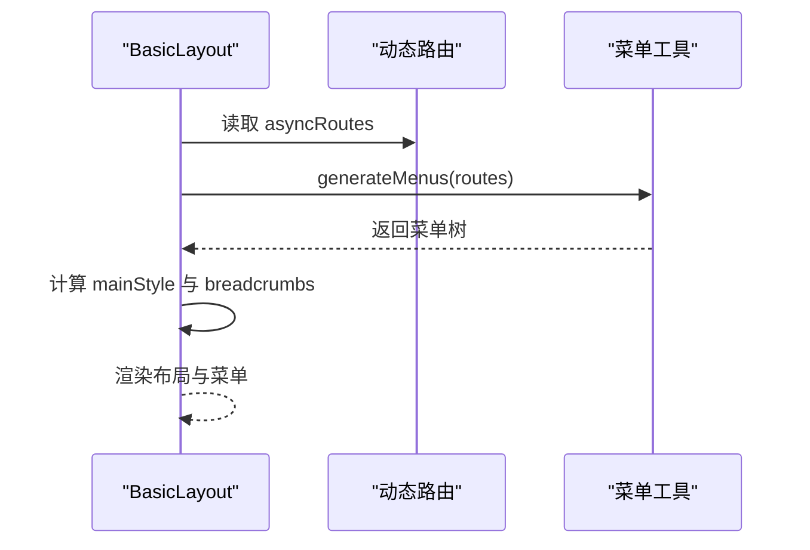
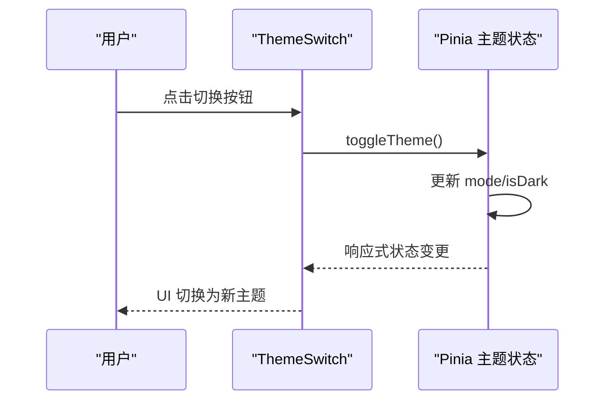
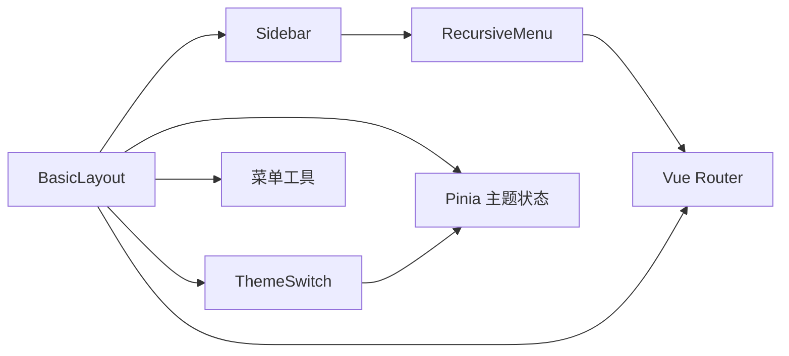

# Vue3 组件系统

<cite>
**本文引用的文件**
- [Sidebar.tsx](file://src/components/sidebar/Sidebar.tsx)
- [Sidebar.less](file://src/components/sidebar/Sidebar.less)
- [RecursiveMenu.tsx](file://src/components/menu/RecursiveMenu.tsx)
- [menu.ts](file://src/utils/menu.ts)
- [BasicLayout.tsx](file://src/layouts/BasicLayout.tsx)
- [routes.ts](file://src/router/routes.ts)
- [theme.ts](file://src/stores/theme.ts)
- [ThemeSwitch.tsx](file://src/components/theme/ThemeSwitch.tsx)
- [index.tsx](file://src/views/dashboard/index.tsx)
- [App.tsx](file://src/App.tsx)
- [menu.ts（类型定义）](file://src/types/menu.ts)
</cite>

## 目录
1. [简介](#简介)
2. [项目结构](#项目结构)
3. [核心组件](#核心组件)
4. [架构总览](#架构总览)
5. [组件详解](#组件详解)
6. [依赖关系分析](#依赖关系分析)
7. [性能考量](#性能考量)
8. [故障排查指南](#故障排查指南)
9. [结论](#结论)
10. [附录：最佳实践与规范](#附录最佳实践与规范)

## 简介
本文件面向 Vue3 开发者，系统梳理并深入解析本仓库中的组件系统，重点覆盖以下方面：
- Composition API 的使用模式：组件封装、Props 定义、事件处理与生命周期管理
- 侧边栏组件的实现原理：折叠状态管理、样式计算与图标切换逻辑
- 递归菜单组件的设计模式：嵌套菜单渲染与动态路由集成
- 组件间通信、状态共享与错误处理的实现方案
- 性能优化建议与组件开发最佳实践

## 项目结构
该工程采用“布局-组件-路由-状态-工具”的分层组织方式，核心入口通过 App 组件挂载 BasicLayout，BasicLayout 中组合 Sidebar 与主题切换组件，并基于动态路由生成菜单。

**图示来源**
- [App.tsx](file://src/App.tsx#L1-L20)
- [BasicLayout.tsx](file://src/layouts/BasicLayout.tsx#L1-L146)
- [Sidebar.tsx](file://src/components/sidebar/Sidebar.tsx#L1-L87)
- [RecursiveMenu.tsx](file://src/components/menu/RecursiveMenu.tsx#L1-L171)
- [menu.ts](file://src/utils/menu.ts#L1-L172)
- [routes.ts](file://src/router/routes.ts#L1-L215)
- [theme.ts](file://src/stores/theme.ts#L1-L111)
- [ThemeSwitch.tsx](file://src/components/theme/ThemeSwitch.tsx#L1-L93)

**章节来源**
- [App.tsx](file://src/App.tsx#L1-L20)
- [BasicLayout.tsx](file://src/layouts/BasicLayout.tsx#L1-L146)

## 核心组件
- 侧边栏组件：负责菜单渲染、折叠控制与样式适配
- 递归菜单组件：支持多级嵌套、图标渲染、外部链接与路由跳转
- 基础布局：整合侧边栏、面包屑、头部工具栏与路由视图
- 主题切换组件：基于 Pinia 状态管理的主题模式切换
- 菜单工具：从路由配置生成菜单、路径解析、权限过滤等

**章节来源**
- [Sidebar.tsx](file://src/components/sidebar/Sidebar.tsx#L1-L87)
- [RecursiveMenu.tsx](file://src/components/menu/RecursiveMenu.tsx#L1-L171)
- [BasicLayout.tsx](file://src/layouts/BasicLayout.tsx#L1-L146)
- [ThemeSwitch.tsx](file://src/components/theme/ThemeSwitch.tsx#L1-L93)
- [menu.ts](file://src/utils/menu.ts#L1-L172)

## 架构总览
整体架构围绕“布局-组件-状态-路由”四条主线协同工作：
- 布局层：BasicLayout 统一承载侧边栏、头部与主内容区
- 组件层：Sidebar/RecursiveMenu/ThemeSwitch 等可复用 UI 组件
- 状态层：Pinia 主题状态，响应式控制主题模式与 DOM 类名
- 路由层：动态路由驱动菜单生成，菜单项与路由路径一一对应

**图示来源**
- [BasicLayout.tsx](file://src/layouts/BasicLayout.tsx#L1-L146)
- [Sidebar.tsx](file://src/components/sidebar/Sidebar.tsx#L1-L87)
- [RecursiveMenu.tsx](file://src/components/menu/RecursiveMenu.tsx#L1-L171)
- [ThemeSwitch.tsx](file://src/components/theme/ThemeSwitch.tsx#L1-L93)
- [routes.ts](file://src/router/routes.ts#L1-L215)
- [menu.ts](file://src/utils/menu.ts#L1-L172)
- [theme.ts](file://src/stores/theme.ts#L1-L111)

## 组件详解

### 侧边栏组件（Sidebar）
- 组件职责
  - 接收菜单数组、折叠状态、Logo 与标题等 Props
  - 触发折叠/展开事件，供父组件监听
  - 渲染菜单区域与折叠按钮，支持 Element Plus Scrollbar
- 折叠状态管理
  - 通过 props.collapsed 控制宽度与菜单折叠
  - computed 计算内联样式，保证过渡动画与布局一致性
- 图标与样式
  - 根据折叠状态切换图标（展开/折叠），并应用 Less 样式
  - 折叠时菜单项图标居中，文本隐藏；展开时显示完整布局
- 事件处理
  - 暴露 toggle-collapse 事件，由父组件控制折叠状态

**图示来源**
- [Sidebar.tsx](file://src/components/sidebar/Sidebar.tsx#L38-L83)
- [BasicLayout.tsx](file://src/layouts/BasicLayout.tsx#L48-L51)

**章节来源**
- [Sidebar.tsx](file://src/components/sidebar/Sidebar.tsx#L1-L87)
- [Sidebar.less](file://src/components/sidebar/Sidebar.less#L1-L223)
- [BasicLayout.tsx](file://src/layouts/BasicLayout.tsx#L1-L146)

### 递归菜单组件（RecursiveMenu）
- 设计模式
  - 递归渲染：子菜单为空时渲染普通菜单项，否则渲染子菜单容器
  - 外链处理：支持外部链接与相对/绝对路径解析
  - 图标渲染：通过图标名映射 Element Plus Icons，动态生成图标组件
- Props 与行为
  - 支持默认激活项、默认展开项、颜色与宽度等定制
  - 响应折叠状态，垂直菜单模式，关闭折叠过渡
- 路由集成
  - 通过 resolvePath 将菜单项与路由路径关联
  - 选中菜单项时触发 select 事件，便于上层处理

**图示来源**
- [RecursiveMenu.tsx](file://src/components/menu/RecursiveMenu.tsx#L18-L84)
- [menu.ts](file://src/utils/menu.ts#L84-L103)

**章节来源**
- [RecursiveMenu.tsx](file://src/components/menu/RecursiveMenu.tsx#L1-L171)
- [menu.ts](file://src/utils/menu.ts#L1-L172)
- [menu.ts（类型定义）](file://src/types/menu.ts#L1-L122)

### 基础布局（BasicLayout）
- 组成
  - 侧边栏、头部（面包屑与用户下拉）、主内容区
  - 主内容区左外边距随侧边栏折叠状态动态调整
- 菜单生成
  - 基于动态路由生成菜单树，支持排序、隐藏与权限过滤
- 生命周期
  - onMounted 初始化主题

**图示来源**
- [BasicLayout.tsx](file://src/layouts/BasicLayout.tsx#L21-L71)
- [routes.ts](file://src/router/routes.ts#L26-L215)
- [menu.ts](file://src/utils/menu.ts#L7-L35)

**章节来源**
- [BasicLayout.tsx](file://src/layouts/BasicLayout.tsx#L1-L146)
- [routes.ts](file://src/router/routes.ts#L1-L215)
- [menu.ts](file://src/utils/menu.ts#L1-L172)

### 主题切换组件（ThemeSwitch）
- 状态来源
  - 通过 Pinia store 提供 isDark 等响应式状态
- 行为
  - 点击切换主题模式，更新 DOM 类名以适配深/浅色样式
  - 可选 Tooltip 提示，支持不同尺寸

**图示来源**
- [ThemeSwitch.tsx](file://src/components/theme/ThemeSwitch.tsx#L22-L29)
- [theme.ts](file://src/stores/theme.ts#L59-L70)

**章节来源**
- [ThemeSwitch.tsx](file://src/components/theme/ThemeSwitch.tsx#L1-L93)
- [theme.ts](file://src/stores/theme.ts#L1-L111)

### 菜单数据模型与工具
- 数据模型
  - MenuItem：支持 key、title、icon、path、name、disabled、hidden、external、children、meta 等字段
  - AppRouteRecordRaw：扩展路由记录，包含 meta 与 children
- 工具函数
  - generateMenus：从路由生成菜单树，支持排序与隐藏
  - resolvePath：路径解析，兼容外链、绝对与相对路径
  - filterMenusByAuth：按权限过滤菜单树
  - flattenMenus/findMenuByPath/getMenuParentPaths：辅助扁平化与查询

**章节来源**
- [menu.ts（类型定义）](file://src/types/menu.ts#L1-L122)
- [menu.ts](file://src/utils/menu.ts#L1-L172)

## 依赖关系分析
- 组件耦合
  - BasicLayout 依赖 Sidebar、ThemeSwitch、路由与菜单工具
  - Sidebar 依赖 RecursiveMenu 与 Element Plus 组件
  - RecursiveMenu 依赖路由与菜单工具
- 状态与通信
  - BasicLayout 通过 props 与事件与 Sidebar 通信
  - ThemeSwitch 通过 Pinia 与全局主题状态交互
- 外部依赖
  - Element Plus：菜单、滚动条、下拉框等 UI 组件
  - Vue Router：路由导航与当前路径
  - Pinia：主题状态持久化与响应式更新

**图示来源**
- [BasicLayout.tsx](file://src/layouts/BasicLayout.tsx#L1-L146)
- [Sidebar.tsx](file://src/components/sidebar/Sidebar.tsx#L1-L87)
- [RecursiveMenu.tsx](file://src/components/menu/RecursiveMenu.tsx#L1-L171)
- [menu.ts](file://src/utils/menu.ts#L1-L172)
- [theme.ts](file://src/stores/theme.ts#L1-L111)

**章节来源**
- [BasicLayout.tsx](file://src/layouts/BasicLayout.tsx#L1-L146)
- [Sidebar.tsx](file://src/components/sidebar/Sidebar.tsx#L1-L87)
- [RecursiveMenu.tsx](file://src/components/menu/RecursiveMenu.tsx#L1-L171)
- [menu.ts](file://src/utils/menu.ts#L1-L172)
- [theme.ts](file://src/stores/theme.ts#L1-L111)

## 性能考量
- 渲染优化
  - 递归菜单仅在菜单数据或折叠状态变化时重渲染
  - 使用 Element Plus 的 collapse 过渡关闭，避免自定义复杂动画
- 路由与菜单
  - 菜单生成在布局初始化阶段进行，避免频繁计算
  - 外链直接打开，减少不必要的路由跳转开销
- 样式与主题
  - 主题切换通过 DOM 类名切换，避免全量样式重算
  - 侧边栏宽度与菜单项样式使用 CSS 变量与过渡，保证流畅性

[本节为通用性能建议，不直接分析具体文件]

## 故障排查指南
- 菜单不显示或显示异常
  - 检查路由 meta 中的 hidden 字段与 generateMenus 的过滤逻辑
  - 确认 resolvePath 的路径拼接是否正确
- 折叠按钮无效
  - 确认父组件是否正确绑定 toggle-collapse 事件并更新 collapsed
  - 检查 Sidebar 的 showCollapse 与 collapsed Props 传递
- 主题切换无效果
  - 确认 Pinia store 的 initTheme 是否执行
  - 检查 DOM 上的 dark/light 类名是否正确切换
- 外链无法打开
  - 检查 isExternalLink 的正则匹配与 resolvePath 的返回值

**章节来源**
- [menu.ts](file://src/utils/menu.ts#L54-L58)
- [menu.ts](file://src/utils/menu.ts#L84-L103)
- [Sidebar.tsx](file://src/components/sidebar/Sidebar.tsx#L38-L42)
- [BasicLayout.tsx](file://src/layouts/BasicLayout.tsx#L48-L51)
- [theme.ts](file://src/stores/theme.ts#L82-L94)

## 结论
本组件系统以 Composition API 为核心，结合 Element Plus 与 Vue Router，实现了高内聚、低耦合的侧边栏与菜单体系。通过 Pinia 管理主题状态，配合路由驱动的菜单生成机制，既满足了功能需求，又具备良好的可维护性与扩展性。建议在实际项目中遵循本文档的规范与最佳实践，持续优化渲染性能与用户体验。

[本节为总结性内容，不直接分析具体文件]

## 附录：最佳实践与规范
- 组件封装
  - 使用 defineComponent 与 setup 组织组件逻辑，明确 Props 与 emits
  - 合理拆分展示与逻辑，保持组件单一职责
- Props 与事件
  - 明确必填与可选属性，提供合理默认值
  - 事件命名语义化，避免在子组件中直接修改父组件状态
- 生命周期
  - 在 onMounted 中进行一次性初始化（如主题初始化）
- 路由与菜单
  - 路由 meta 中统一声明菜单元信息，便于生成与权限控制
  - 使用 resolvePath 统一路径解析，避免硬编码
- 状态管理
  - 使用 Pinia 管理跨组件共享的状态（如主题）
  - 通过 storeToRefs 保持响应式追踪
- 性能优化
  - 避免在模板中进行复杂计算，尽量使用 computed
  - 对高频交互组件（如菜单）减少不必要的重渲染
- 错误处理
  - 对外链与路径进行校验，提供降级处理
  - 对菜单权限进行前端过滤，避免无效渲染

[本节为通用规范建议，不直接分析具体文件]