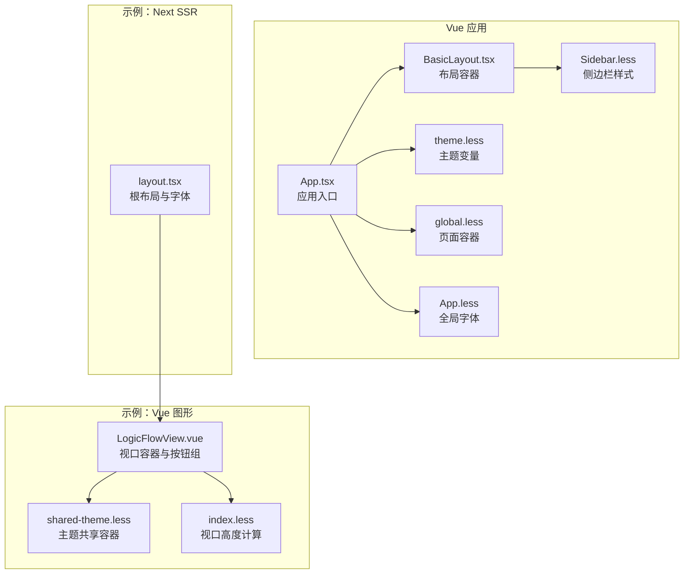
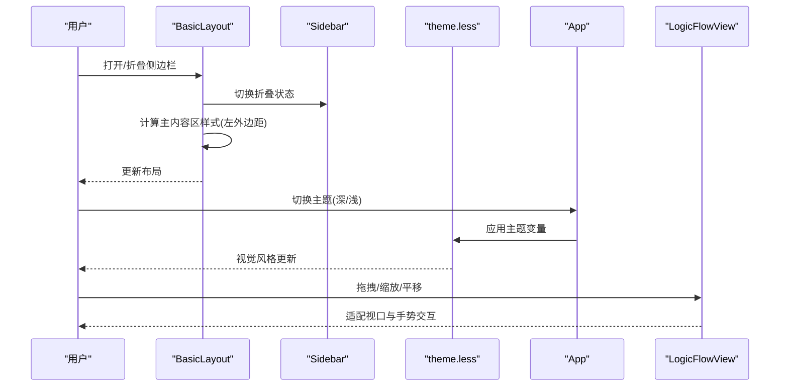
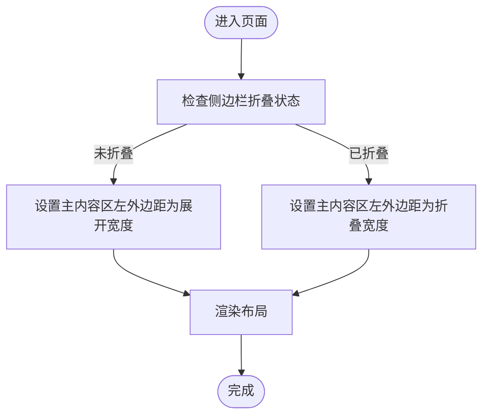
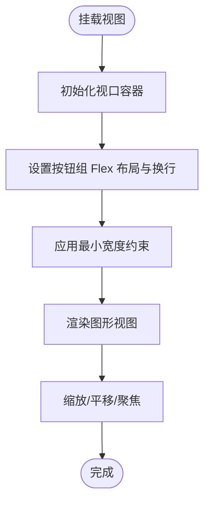
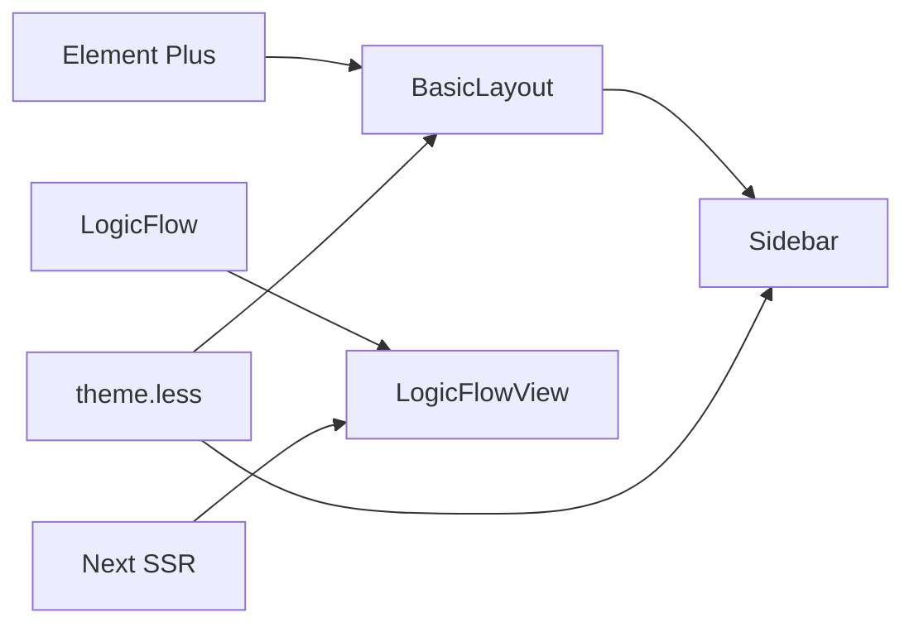

# 响应式设计

<cite>
**本文引用的文件**
- [src/layouts/BasicLayout.tsx](file://src/layouts/BasicLayout.tsx)
- [src/components/sidebar/Sidebar.less](file://src/components/sidebar/Sidebar.less)
- [src/styles/global.less](file://src/styles/global.less)
- [src/styles/theme.less](file://src/styles/theme.less)
- [src/App.tsx](file://src/App.tsx)
- [src/App.less](file://src/App.less)
- [examples/vue3-app/src/views/LogicFlowView.vue](file://examples/vue3-app/src/views/LogicFlowView.vue)
- [examples/feature-examples/src/pages/theme/shared-theme.less](file://examples/feature-examples/src/pages/theme/shared-theme.less)
- [examples/feature-examples/src/pages/theme/index.less](file://examples/feature-examples/src/pages/theme/index.less)
- [examples/next-app/src/app/layout.tsx](file://examples/next-app/src/app/layout.tsx)
- [package.json](file://package.json)
</cite>

## 目录
1. [简介](#简介)
2. [项目结构](#项目结构)
3. [核心组件](#核心组件)
4. [架构总览](#架构总览)
5. [组件与布局详解](#组件与布局详解)
6. [依赖关系分析](#依赖关系分析)
7. [性能与优化](#性能与优化)
8. [故障排查指南](#故障排查指南)
9. [结论](#结论)
10. [附录](#附录)

## 简介
本文件系统性梳理该项目在响应式设计方面的实现与最佳实践，重点覆盖以下方面：
- 断点与布局策略：基于固定侧边栏宽度与弹性主内容区的组合，结合主题变量与容器尺寸控制，形成移动端优先的布局思路。
- 网格与弹性布局：通过 Flex 布局与最小宽度约束，保证在小屏设备上按钮与卡片等元素的可读性与可用性。
- Element Plus 组件的响应式使用：利用其容器、面包屑、下拉菜单、头像等组件的内置行为，配合主题变量与样式覆盖，实现一致的跨端体验。
- 不同屏幕尺寸的适配：以侧边栏折叠为核心手段，在窄屏下释放空间；同时通过主题变量与容器高度计算，确保内容区域在不同视口下的稳定呈现。
- 媒体查询与性能优化：当前仓库未直接使用媒体查询，但通过主题变量与容器尺寸计算实现“逻辑断点”，并在必要场景下可扩展媒体查询。
- 触摸与手势：在图形编辑场景中，通过 LogicFlow 的交互能力实现缩放、平移、聚焦等手势操作，提升移动端可用性。
- 服务端渲染影响与方案：Next 示例采用 SSR，需关注首屏渲染与主题切换的水合一致性。

## 项目结构
该项目采用多框架示例并存的组织方式，其中与响应式设计直接相关的部分集中在：
- Vue 前端（含 Element Plus 与自定义主题）：布局容器、侧边栏、主题变量与全局样式。
- Vue 图形示例（LogicFlow）：视口容器与按钮组的弹性布局，适配不同屏幕尺寸。
- Next 示例（SSR）：根布局与字体加载，体现 SSR 对首屏与可访问性的影响。



**图表来源**
- [src/App.tsx](file://src/App.tsx#L1-L20)
- [src/layouts/BasicLayout.tsx](file://src/layouts/BasicLayout.tsx#L1-L146)
- [src/components/sidebar/Sidebar.less](file://src/components/sidebar/Sidebar.less#L1-L223)
- [src/styles/theme.less](file://src/styles/theme.less#L1-L176)
- [src/styles/global.less](file://src/styles/global.less#L1-L4)
- [src/App.less](file://src/App.less#L1-L6)
- [examples/vue3-app/src/views/LogicFlowView.vue](file://examples/vue3-app/src/views/LogicFlowView.vue#L1-L537)
- [examples/feature-examples/src/pages/theme/shared-theme.less](file://examples/feature-examples/src/pages/theme/shared-theme.less#L1-L42)
- [examples/feature-examples/src/pages/theme/index.less](file://examples/feature-examples/src/pages/theme/index.less#L1-L6)
- [examples/next-app/src/app/layout.tsx](file://examples/next-app/src/app/layout.tsx#L1-L23)

**章节来源**
- [src/layouts/BasicLayout.tsx](file://src/layouts/BasicLayout.tsx#L1-L146)
- [src/components/sidebar/Sidebar.less](file://src/components/sidebar/Sidebar.less#L1-L223)
- [src/styles/theme.less](file://src/styles/theme.less#L1-L176)
- [src/styles/global.less](file://src/styles/global.less#L1-L4)
- [src/App.less](file://src/App.less#L1-L6)
- [examples/vue3-app/src/views/LogicFlowView.vue](file://examples/vue3-app/src/views/LogicFlowView.vue#L1-L537)
- [examples/feature-examples/src/pages/theme/shared-theme.less](file://examples/feature-examples/src/pages/theme/shared-theme.less#L1-L42)
- [examples/feature-examples/src/pages/theme/index.less](file://examples/feature-examples/src/pages/theme/index.less#L1-L6)
- [examples/next-app/src/app/layout.tsx](file://examples/next-app/src/app/layout.tsx#L1-L23)

## 核心组件
- 布局容器（BasicLayout）
  - 使用 Element Plus 容器组件构建页面骨架，包含侧边栏、头部、主内容区。
  - 通过响应式状态控制侧边栏折叠，动态调整主内容区的左外边距，实现移动端优先的布局。
  - 集成面包屑导航与用户下拉菜单，保证在窄屏下仍能快速定位与切换。
- 侧边栏（Sidebar）
  - 固定宽度与折叠宽度的切换，配合 Element Plus 菜单组件的折叠行为，减少窄屏占用。
  - 通过主题变量控制背景、文字与边框颜色，确保深浅主题下的一致性。
- 主题系统（theme.less）
  - 定义深色与浅色两套主题变量，统一管理背景、文字、边框、阴影等视觉属性。
  - 通过 CSS 变量与 Less 变量混合使用，便于运行时切换与组件化复用。
- 页面容器（global.less）
  - 提供全屏容器的基础尺寸规范，确保页面整体占满视口。
- 全局样式（App.less）
  - 设置字体族与抗锯齿，提升跨平台显示一致性。
- 图形视图（LogicFlowView）
  - 视口容器采用相对定位与溢出隐藏，按钮组使用 Flex 布局并允许换行，保证在小屏下按钮不被截断。
  - 通过容器高度计算与最小宽度约束，确保图形编辑区在不同屏幕尺寸下的可读性与可用性。
- Next 根布局（layout.tsx）
  - 引入字体资源，为 SSR 场景提供稳定的首屏渲染与可访问性基础。

**章节来源**
- [src/layouts/BasicLayout.tsx](file://src/layouts/BasicLayout.tsx#L1-L146)
- [src/components/sidebar/Sidebar.less](file://src/components/sidebar/Sidebar.less#L1-L223)
- [src/styles/theme.less](file://src/styles/theme.less#L1-L176)
- [src/styles/global.less](file://src/styles/global.less#L1-L4)
- [src/App.less](file://src/App.less#L1-L6)
- [examples/vue3-app/src/views/LogicFlowView.vue](file://examples/vue3-app/src/views/LogicFlowView.vue#L1-L537)
- [examples/next-app/src/app/layout.tsx](file://examples/next-app/src/app/layout.tsx#L1-L23)

## 架构总览
下图展示了响应式布局在前端中的关键交互路径：布局容器根据侧边栏状态动态调整主内容区尺寸；主题变量驱动视觉风格；图形视图通过容器尺寸与 Flex 布局适配不同屏幕。



**图表来源**
- [src/layouts/BasicLayout.tsx](file://src/layouts/BasicLayout.tsx#L26-L51)
- [src/components/sidebar/Sidebar.less](file://src/components/sidebar/Sidebar.less#L17-L42)
- [src/styles/theme.less](file://src/styles/theme.less#L21-L97)
- [src/App.tsx](file://src/App.tsx#L9-L18)
- [examples/vue3-app/src/views/LogicFlowView.vue](file://examples/vue3-app/src/views/LogicFlowView.vue#L457-L536)

## 组件与布局详解

### 布局容器与侧边栏折叠
- 固定宽度与折叠宽度
  - 侧边栏展开宽度与折叠宽度在样式中明确设定，折叠后仅保留图标与少量内边距，显著减少窄屏占用。
- 主内容区自适应
  - 通过响应式状态计算主内容区的左外边距，实现“移动端优先”的布局策略：窄屏下优先显示主要内容，窄边栏作为补充入口。
- Element Plus 组件集成
  - 头部区域使用面包屑与下拉菜单，下拉菜单在窄屏下仍可通过点击触发，避免信息隐藏过深。



**图表来源**
- [src/layouts/BasicLayout.tsx](file://src/layouts/BasicLayout.tsx#L34-L37)
- [src/components/sidebar/Sidebar.less](file://src/components/sidebar/Sidebar.less#L17-L18)

**章节来源**
- [src/layouts/BasicLayout.tsx](file://src/layouts/BasicLayout.tsx#L26-L51)
- [src/components/sidebar/Sidebar.less](file://src/components/sidebar/Sidebar.less#L17-L42)

### 主题变量与跨端一致性
- 主题变量体系
  - 深色与浅色两套变量，覆盖背景、文字、边框、阴影、侧边栏、头部、卡片、表格、输入框、标签页等关键区域。
- 运行时切换
  - 应用入口初始化主题，结合 CSS 变量与 Less 变量，确保组件样式随主题变化而自动更新。
- 与 Element Plus 的协同
  - 通过覆盖 Element Plus 组件的默认样式，结合主题变量，实现统一的视觉语言。

```mermaid
classDiagram
class ThemeVariables {
"+深色变量"
"+浅色变量"
"+CSS 变量映射"
}
class Layout {
"+容器"
"+头部"
"+侧边栏"
"+主内容区"
}
class ElementPlusComponents {
"+容器/面包屑/下拉菜单"
}
ThemeVariables --> Layout : "驱动样式"
Layout --> ElementPlusComponents : "使用组件"
```

**图表来源**
- [src/styles/theme.less](file://src/styles/theme.less#L21-L97)
- [src/layouts/BasicLayout.tsx](file://src/layouts/BasicLayout.tsx#L86-L138)

**章节来源**
- [src/styles/theme.less](file://src/styles/theme.less#L1-L176)
- [src/App.tsx](file://src/App.tsx#L9-L18)
- [src/layouts/BasicLayout.tsx](file://src/layouts/BasicLayout.tsx#L86-L138)

### 图形视图的弹性布局与手势
- 视口容器
  - 采用相对定位与溢出隐藏，确保图形内容在容器内可控滚动与缩放。
- 按钮组弹性
  - 使用 Flex 布局与换行，按钮在窄屏下自动换行，避免被截断。
- 最小宽度约束
  - 容器最小宽度与卡片阴影组合，保证在小屏下仍有良好的可读性与对比度。
- 手势与交互
  - 通过 LogicFlow 的缩放、平移、聚焦等能力，提升移动端可用性；按钮组提供常用操作入口。



**图表来源**
- [examples/vue3-app/src/views/LogicFlowView.vue](file://examples/vue3-app/src/views/LogicFlowView.vue#L457-L536)
- [examples/feature-examples/src/pages/theme/shared-theme.less](file://examples/feature-examples/src/pages/theme/shared-theme.less#L14-L21)

**章节来源**
- [examples/vue3-app/src/views/LogicFlowView.vue](file://examples/vue3-app/src/views/LogicFlowView.vue#L457-L536)
- [examples/feature-examples/src/pages/theme/shared-theme.less](file://examples/feature-examples/src/pages/theme/shared-theme.less#L1-L42)
- [examples/feature-examples/src/pages/theme/index.less](file://examples/feature-examples/src/pages/theme/index.less#L1-L6)

### SSR 对响应式的影响与方案
- 字体与首屏
  - Next 根布局引入字体资源，有助于 SSR 场景下的首屏渲染稳定性与可访问性。
- 水合一致性
  - 在切换主题或动态布局时，需确保客户端与服务端的初始状态一致，避免闪烁与布局抖动。

**章节来源**
- [examples/next-app/src/app/layout.tsx](file://examples/next-app/src/app/layout.tsx#L1-L23)

## 依赖关系分析
- 组件耦合
  - 布局容器与侧边栏存在直接的尺寸联动关系；主题变量为多个组件提供样式基础。
- 外部依赖
  - Element Plus 提供容器、菜单、下拉、面包屑等组件；LogicFlow 提供图形视图的交互能力。
- 可能的循环依赖
  - 当前结构清晰，无明显循环依赖迹象。



**图表来源**
- [package.json](file://package.json#L14-L26)
- [src/layouts/BasicLayout.tsx](file://src/layouts/BasicLayout.tsx#L1-L11)
- [src/components/sidebar/Sidebar.less](file://src/components/sidebar/Sidebar.less#L1-L15)
- [src/styles/theme.less](file://src/styles/theme.less#L1-L10)
- [examples/vue3-app/src/views/LogicFlowView.vue](file://examples/vue3-app/src/views/LogicFlowView.vue#L1-L11)
- [examples/next-app/src/app/layout.tsx](file://examples/next-app/src/app/layout.tsx#L1-L5)

**章节来源**
- [package.json](file://package.json#L14-L26)

## 性能与优化
- 布局性能
  - 侧边栏折叠通过简单样式切换实现，避免复杂重排；主内容区的外边距计算为轻量级响应式处理。
- 主题切换
  - 使用 CSS 变量与主题变量组合，主题切换为 O(1) 级别，无需重新渲染组件树。
- 图形视图
  - 视口容器采用相对定位与溢出隐藏，减少不必要的滚动条闪烁；按钮组换行避免了频繁的 DOM 重排。
- SSR 注意事项
  - 在 SSR 场景下，确保主题变量与字体资源在服务端与客户端一致，避免水合差异导致的闪烁。

[本节为通用性能建议，不直接分析具体文件]

## 故障排查指南
- 侧边栏遮挡内容
  - 检查主内容区左外边距是否正确根据折叠状态计算；确认容器样式未被其他规则覆盖。
- 主题切换异常
  - 确认主题初始化调用位置；检查 CSS 变量是否正确注入至根节点。
- 图形视图显示异常
  - 检查视口容器的高度计算与最小宽度约束；确认按钮组换行与 Flex 布局未被覆盖。
- SSR 水合问题
  - 确保服务端与客户端的主题与字体资源一致；避免客户端首次渲染与服务端不一致。

**章节来源**
- [src/layouts/BasicLayout.tsx](file://src/layouts/BasicLayout.tsx#L34-L37)
- [src/styles/theme.less](file://src/styles/theme.less#L21-L97)
- [examples/vue3-app/src/views/LogicFlowView.vue](file://examples/vue3-app/src/views/LogicFlowView.vue#L457-L536)
- [examples/next-app/src/app/layout.tsx](file://examples/next-app/src/app/layout.tsx#L1-L23)

## 结论
本项目在响应式设计上采取了“移动端优先”的策略：通过固定侧边栏宽度与折叠机制、主题变量驱动的视觉一致性、以及 Flex 布局与最小宽度约束，实现了在不同屏幕尺寸下的稳定与可用。Element Plus 组件与 LogicFlow 的集成进一步增强了跨端体验。对于媒体查询与 SSR 的扩展，可在现有基础上按需引入，以获得更精细的断点控制与更稳健的首屏表现。

[本节为总结性内容，不直接分析具体文件]

## 附录
- 建议的媒体查询断点（概念性参考）
  - 移动端：最大宽度 768px
  - 平板：769px 至 1024px
  - 桌面端：大于 1024px
- 媒体查询最佳实践
  - 以功能为导向而非设备为导向；优先使用相对单位与弹性布局；在关键交互处进行针对性优化。
- 触摸与手势建议
  - 为按钮与菜单提供足够的触控目标尺寸；在图形视图中启用合适的缩放与拖拽阈值；提供视觉反馈与无障碍支持。

[本节为通用指导，不直接分析具体文件]