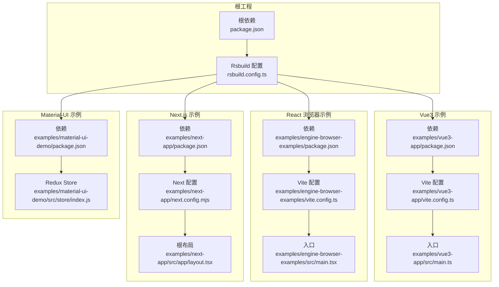
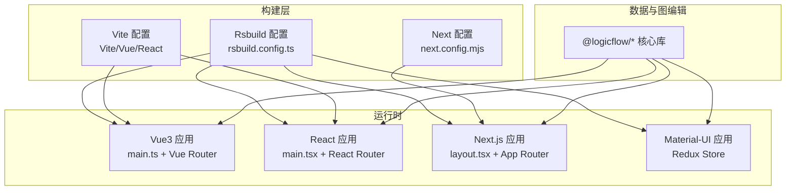
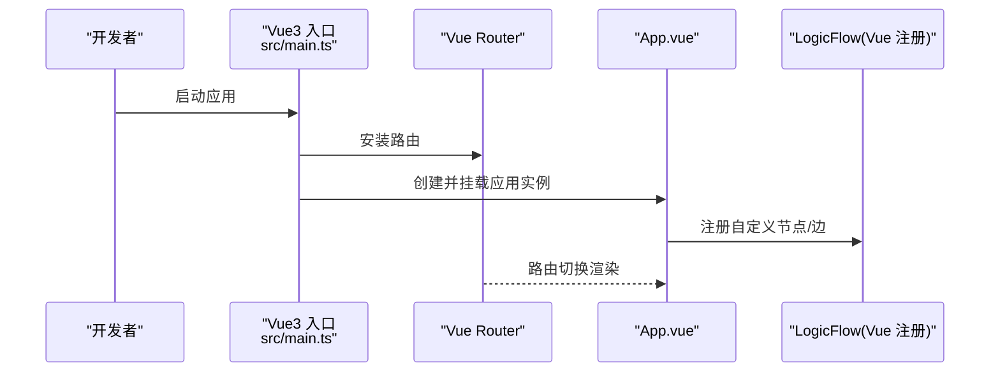
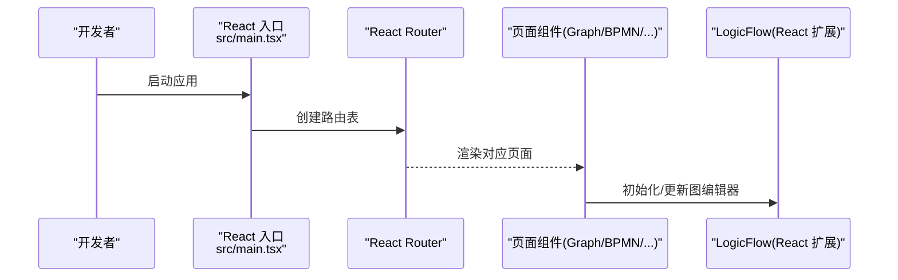
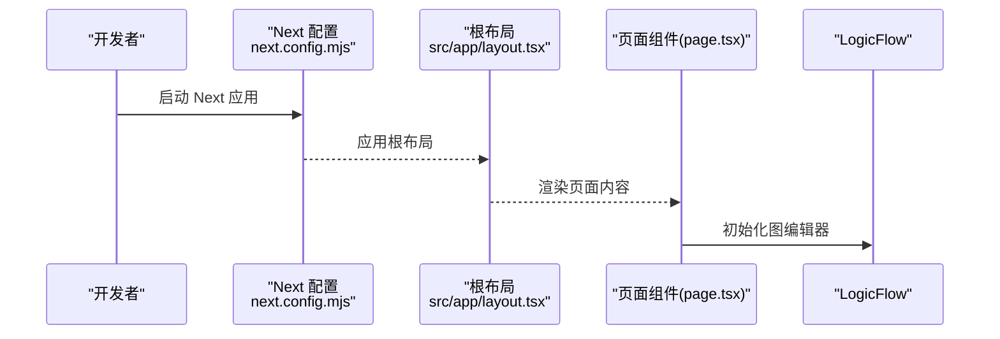
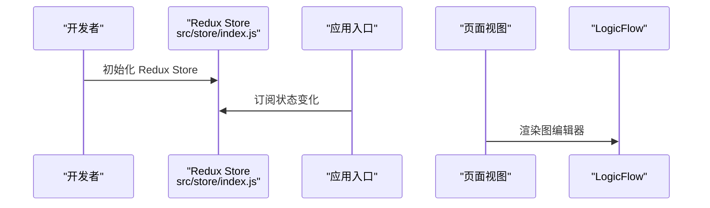
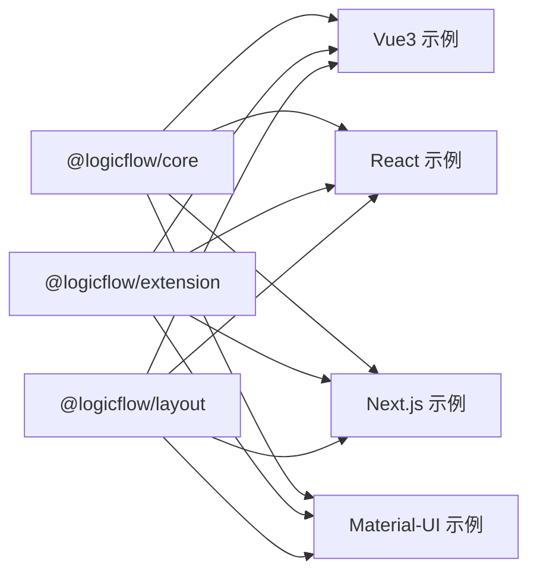

# 多框架支持

<cite>
**本文引用的文件**
- [package.json](file://package.json)
- [rsbuild.config.ts](file://rsbuild.config.ts)
- [examples/vue3-app/package.json](file://examples/vue3-app/package.json)
- [examples/vue3-app/vite.config.ts](file://examples/vue3-app/vite.config.ts)
- [examples/vue3-app/src/main.ts](file://examples/vue3-app/src/main.ts)
- [examples/engine-browser-examples/package.json](file://examples/engine-browser-examples/package.json)
- [examples/engine-browser-examples/vite.config.ts](file://examples/engine-browser-examples/vite.config.ts)
- [examples/engine-browser-examples/src/main.tsx](file://examples/engine-browser-examples/src/main.tsx)
- [examples/next-app/package.json](file://examples/next-app/package.json)
- [examples/next-app/next.config.mjs](file://examples/next-app/next.config.mjs)
- [examples/next-app/src/app/layout.tsx](file://examples/next-app/src/app/layout.tsx)
- [examples/material-ui-demo/package.json](file://examples/material-ui-demo/package.json)
- [examples/material-ui-demo/src/store/index.js](file://examples/material-ui-demo/src/store/index.js)
</cite>

## 目录
1. [简介](#简介)
2. [项目结构](#项目结构)
3. [核心组件](#核心组件)
4. [架构总览](#架构总览)
5. [详细组件分析](#详细组件分析)
6. [依赖分析](#依赖分析)
7. [性能考量](#性能考量)
8. [故障排查指南](#故障排查指南)
9. [结论](#结论)
10. [附录](#附录)

## 简介
本项目通过统一的构建与工程化能力，同时支持 Vue3、React（含 Vite 与 Next.js）、Material-UI 等多种前端技术栈。其核心目标是：
- 在同一仓库内提供多框架示例与最佳实践
- 统一构建配置与工具链（Rsbuild/Vite/Next）
- 封装 LogicFlow 图编辑引擎在不同框架中的使用方式
- 提供状态管理与主题/样式体系的跨框架一致性方案
- 为团队在多框架项目中进行选型、迁移与维护提供参考

## 项目结构
项目采用“根工程 + 多示例应用”的组织方式：
- 根工程：统一构建配置（Rsbuild）、核心依赖与公共工具
- 示例应用：
  - Vue3 应用：基于 Vite + Vue3 + Element Plus
  - React 浏览器示例：基于 Vite + React + Ant Design
  - Next.js 应用：基于 Next.js App Router
  - Material-UI 示例：基于 Redux 的 Material-UI 布局与组件

图表来源
- [rsbuild.config.ts](file://rsbuild.config.ts#L1-L30)
- [package.json](file://package.json#L1-L45)
- [examples/vue3-app/package.json](file://examples/vue3-app/package.json#L1-L52)
- [examples/vue3-app/vite.config.ts](file://examples/vue3-app/vite.config.ts#L1-L15)
- [examples/vue3-app/src/main.ts](file://examples/vue3-app/src/main.ts#L1-L16)
- [examples/engine-browser-examples/package.json](file://examples/engine-browser-examples/package.json#L1-L39)
- [examples/engine-browser-examples/vite.config.ts](file://examples/engine-browser-examples/vite.config.ts#L1-L14)
- [examples/engine-browser-examples/src/main.tsx](file://examples/engine-browser-examples/src/main.tsx#L1-L78)
- [examples/next-app/package.json](file://examples/next-app/package.json#L1-L32)
- [examples/next-app/next.config.mjs](file://examples/next-app/next.config.mjs#L1-L5)
- [examples/next-app/src/app/layout.tsx](file://examples/next-app/src/app/layout.tsx#L1-L23)
- [examples/material-ui-demo/package.json](file://examples/material-ui-demo/package.json#L1-L76)
- [examples/material-ui-demo/src/store/index.js](file://examples/material-ui-demo/src/store/index.js#L1-L10)

章节来源
- [package.json](file://package.json#L1-L45)
- [rsbuild.config.ts](file://rsbuild.config.ts#L1-L30)

## 核心组件
- 构建与工具链
  - Rsbuild：统一插件体系（Babel、Vue、Vue JSX、Less），别名与开发服务器配置
  - Vite：Vue3 与 React 示例的开发与打包
  - Next.js：App Router 模式下的页面级路由与静态资源处理
- UI 与状态
  - Vue3：Element Plus 生态，Pinia 状态管理（根工程）
  - React：Ant Design 与 React Router（浏览器示例）
  - Material-UI：Redux 状态管理（Material-UI 示例）
- 数据与图编辑
  - @logicflow/core/@logicflow/extension/@logicflow/layout：跨框架通用的图编辑能力
  - 各示例通过各自路由与页面组件承载 LogicFlow 使用场景

章节来源
- [package.json](file://package.json#L14-L27)
- [examples/vue3-app/package.json](file://examples/vue3-app/package.json#L16-L29)
- [examples/engine-browser-examples/package.json](file://examples/engine-browser-examples/package.json#L12-L24)
- [examples/material-ui-demo/package.json](file://examples/material-ui-demo/package.json#L4-L31)

## 架构总览
多框架支持的总体思路：
- 以 Rsbuild 作为统一构建基座，按需启用 Vue/Vue JSX/Babel/Less 插件
- 各示例应用独立配置，但共享核心依赖（LogicFlow 生态）
- 路由与入口分别适配框架特性（Vue Router、React Router、Next App Router）
- 状态管理与 UI 组件库按框架选择（Pinia/Redux/Element Plus/Ant Design/Material-UI）

图表来源
- [rsbuild.config.ts](file://rsbuild.config.ts#L10-L29)
- [examples/vue3-app/vite.config.ts](file://examples/vue3-app/vite.config.ts#L7-L14)
- [examples/engine-browser-examples/vite.config.ts](file://examples/engine-browser-examples/vite.config.ts#L5-L13)
- [examples/next-app/next.config.mjs](file://examples/next-app/next.config.mjs#L1-L5)
- [examples/vue3-app/src/main.ts](file://examples/vue3-app/src/main.ts#L10-L15)
- [examples/engine-browser-examples/src/main.tsx](file://examples/engine-browser-examples/src/main.tsx#L20-L77)
- [examples/next-app/src/app/layout.tsx](file://examples/next-app/src/app/layout.tsx#L12-L22)

## 详细组件分析

### Vue3 集成与封装
- 依赖与生态
  - Vue3、Vue Router、Element Plus、LogicFlow Vue 节点注册包
- 构建与入口
  - Vite 配置启用 Vue 插件与路径别名；入口挂载 Element Plus 与路由
- 组件封装
  - 通过 LogicFlow Vue 节点注册包将自定义节点/边封装为 Vue 组件，便于复用与测试
- 状态管理
  - 根工程使用 Pinia；Vue3 示例可按需接入或复用

图表来源
- [examples/vue3-app/src/main.ts](file://examples/vue3-app/src/main.ts#L1-L16)
- [examples/vue3-app/package.json](file://examples/vue3-app/package.json#L16-L29)

章节来源
- [examples/vue3-app/package.json](file://examples/vue3-app/package.json#L16-L29)
- [examples/vue3-app/vite.config.ts](file://examples/vue3-app/vite.config.ts#L7-L14)
- [examples/vue3-app/src/main.ts](file://examples/vue3-app/src/main.ts#L1-L16)

### React（Vite）集成与封装
- 依赖与生态
  - React、React Router、Ant Design、LogicFlow React 节点注册包
- 构建与入口
  - Vite 配置启用 React 插件与路径别名；入口使用 React Router 进行嵌套路由
- 组件封装
  - 自定义节点/边以 React 组件形式封装，结合 LogicFlow 扩展模块使用
- 状态管理
  - 可选 Redux 或其他状态库；当前示例未展示复杂状态逻辑

图表来源
- [examples/engine-browser-examples/src/main.tsx](file://examples/engine-browser-examples/src/main.tsx#L20-L77)
- [examples/engine-browser-examples/package.json](file://examples/engine-browser-examples/package.json#L12-L24)

章节来源
- [examples/engine-browser-examples/package.json](file://examples/engine-browser-examples/package.json#L12-L24)
- [examples/engine-browser-examples/vite.config.ts](file://examples/engine-browser-examples/vite.config.ts#L5-L13)
- [examples/engine-browser-examples/src/main.tsx](file://examples/engine-browser-examples/src/main.tsx#L1-L78)

### Next.js 集成与封装
- 依赖与生态
  - Next.js、Ant Design、LogicFlow
- 构建与入口
  - Next 配置最小化；App Router 下通过 layout.tsx 提供根布局与字体加载
- 组件封装
  - 页面组件按 App Router 结构组织，LogicFlow 场景以页面组件承载
- 状态管理
  - 当前示例未展示全局状态管理；可在页面内按需引入

图表来源
- [examples/next-app/next.config.mjs](file://examples/next-app/next.config.mjs#L1-L5)
- [examples/next-app/src/app/layout.tsx](file://examples/next-app/src/app/layout.tsx#L12-L22)
- [examples/next-app/package.json](file://examples/next-app/package.json#L11-L20)

章节来源
- [examples/next-app/package.json](file://examples/next-app/package.json#L11-L20)
- [examples/next-app/next.config.mjs](file://examples/next-app/next.config.mjs#L1-L5)
- [examples/next-app/src/app/layout.tsx](file://examples/next-app/src/app/layout.tsx#L1-L23)

### Material-UI 集成与封装
- 依赖与生态
  - Material-UI、Redux、React Router
- 构建与入口
  - 使用 react-scripts（示例脚本）；Redux Store 在应用入口集中初始化
- 组件封装
  - 页面与布局组件基于 Material-UI 组件库；LogicFlow 场景以页面组件承载
- 状态管理
  - Redux 管理定制化主题与布局状态

图表来源
- [examples/material-ui-demo/src/store/index.js](file://examples/material-ui-demo/src/store/index.js#L1-L10)
- [examples/material-ui-demo/package.json](file://examples/material-ui-demo/package.json#L4-L31)

章节来源
- [examples/material-ui-demo/package.json](file://examples/material-ui-demo/package.json#L4-L31)
- [examples/material-ui-demo/src/store/index.js](file://examples/material-ui-demo/src/store/index.js#L1-L10)

## 依赖分析
- 核心依赖（跨框架）
  - @logicflow/core、@logicflow/extension、@logicflow/layout：提供图编辑基础能力
  - @logicflow/vue-node-registry：Vue3 节点注册与封装
- 框架特定依赖
  - Vue3：vue、vue-router、element-plus、pinia
  - React：react、react-dom、react-router、antd
  - Next.js：next、react、react-dom
  - Material-UI：@mui/material、@emotion/*、redux、react-redux
- 构建工具
  - Rsbuild：统一插件与别名配置
  - Vite：Vue3 与 React 示例
  - Next：App Router

图表来源
- [package.json](file://package.json#L14-L27)
- [examples/vue3-app/package.json](file://examples/vue3-app/package.json#L16-L29)
- [examples/engine-browser-examples/package.json](file://examples/engine-browser-examples/package.json#L12-L24)
- [examples/next-app/package.json](file://examples/next-app/package.json#L11-L20)
- [examples/material-ui-demo/package.json](file://examples/material-ui-demo/package.json#L4-L31)

章节来源
- [package.json](file://package.json#L14-L27)
- [examples/vue3-app/package.json](file://examples/vue3-app/package.json#L16-L29)
- [examples/engine-browser-examples/package.json](file://examples/engine-browser-examples/package.json#L12-L24)
- [examples/next-app/package.json](file://examples/next-app/package.json#L11-L20)
- [examples/material-ui-demo/package.json](file://examples/material-ui-demo/package.json#L4-L31)

## 性能考量
- 构建与打包
  - Rsbuild 插件组合（Babel/Vue/Vue JSX/Less）减少重复配置，提升构建效率
  - Vite 与 Next 的快速冷启动与热更新，适合多框架并行开发
- 逻辑流性能
  - 合理拆分页面组件与路由，避免一次性渲染大量节点
  - 使用虚拟滚动与懒加载策略（如适用）降低 DOM 压力
- 样式与主题
  - 统一样式预处理器与主题变量，减少重复计算与重绘
- 状态管理
  - Vue3 使用 Pinia，React 使用 Redux 或 Context；避免不必要的全局订阅与重渲染

## 故障排查指南
- Vue3 开发问题
  - 若启用 Vue DevTools 导致内存占用异常，可参考 Vite 配置注释，避免全局缓冲区累积
- React 路由与渲染
  - 确认路由层级与 RouterProvider 使用正确，避免重复挂载
- Next.js 路由与布局
  - 确保根布局文件存在且返回受控的 HTML 结构
- Material-UI 状态
  - Redux Store 初始化需在应用入口完成，避免异步时机不一致

章节来源
- [examples/vue3-app/vite.config.ts](file://examples/vue3-app/vite.config.ts#L5-L6)
- [examples/engine-browser-examples/src/main.tsx](file://examples/engine-browser-examples/src/main.tsx#L20-L77)
- [examples/next-app/src/app/layout.tsx](file://examples/next-app/src/app/layout.tsx#L12-L22)
- [examples/material-ui-demo/src/store/index.js](file://examples/material-ui-demo/src/store/index.js#L1-L10)

## 结论
本项目通过统一的构建与工程化能力，成功在 Vue3、React（Vite/Next.js）、Material-UI 等多框架下复用 LogicFlow 图编辑能力，并提供了清晰的入口、路由与组件封装模式。建议在实际项目中：
- 优先统一构建工具链（Rsbuild/Vite/Next），减少配置漂移
- 明确状态管理选型（Pinia/Redux），保持跨框架一致性
- 将 LogicFlow 封装为可复用组件，降低各框架接入成本
- 建立跨框架的样式与主题规范，确保视觉一致性

## 附录
- 框架选择指南
  - Vue3：适合中后台管理类应用，Element Plus 生态完善，组件丰富
  - React：适合需要灵活扩展与生态丰富的场景，Ant Design 与 Material-UI 可选
  - Next.js：适合需要 SSR/App Router 的全栈场景
  - Material-UI：适合对 Material Design 有强约束的界面风格
- 迁移最佳实践
  - 以页面为单位逐步迁移，保持路由与状态结构不变
  - 将 LogicFlow 封装为跨框架组件，减少重复实现
  - 建立统一的构建与发布流程，避免多套配置带来的维护成本