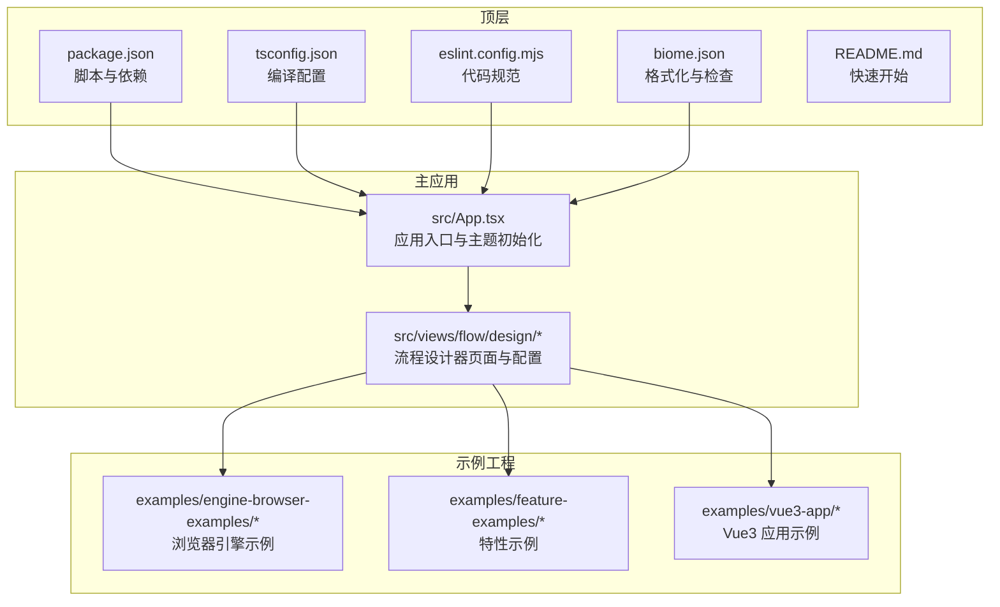
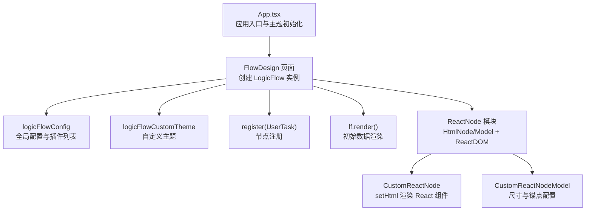
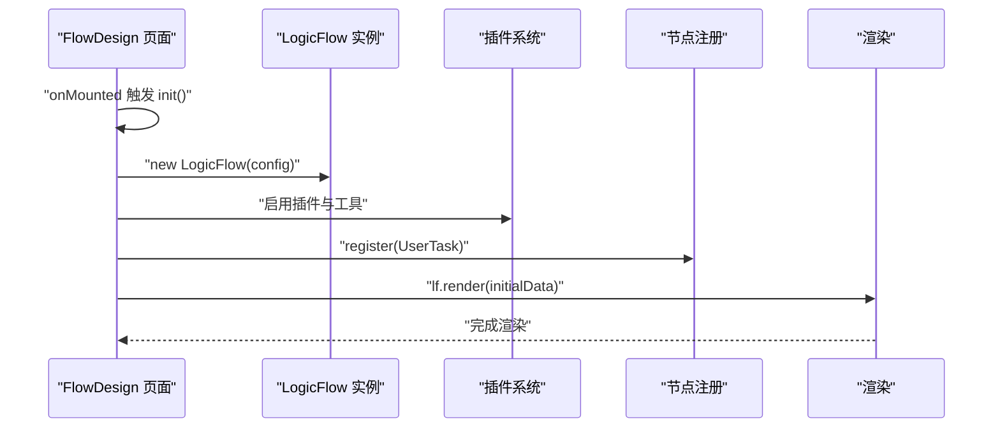
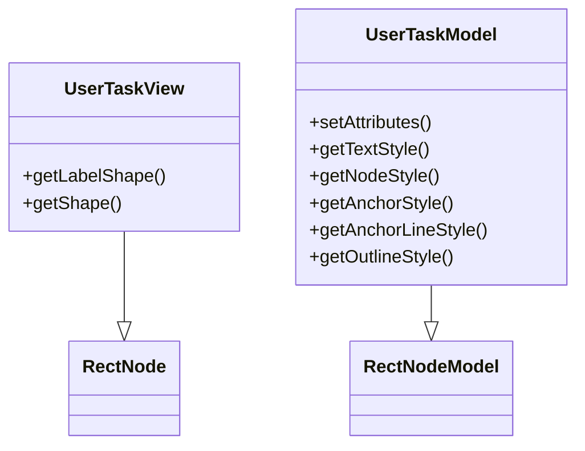
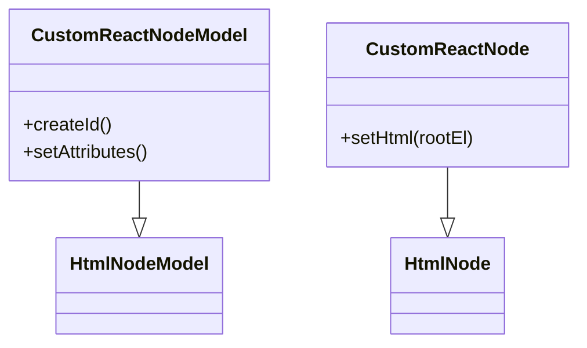
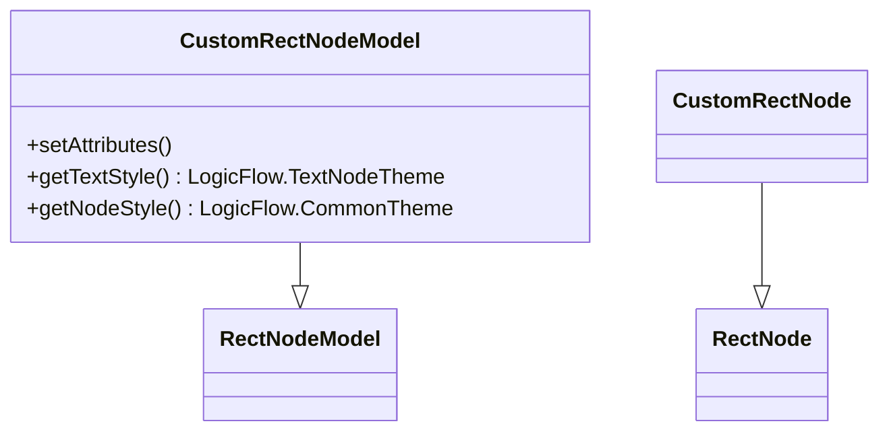
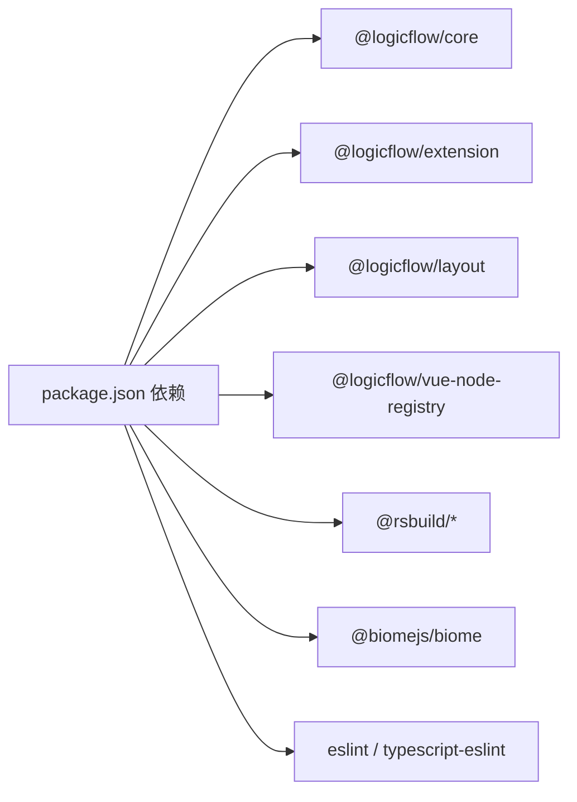

# 组件开发规范

<cite>
**本文引用的文件**
- [package.json](file://package.json)
- [tsconfig.json](file://tsconfig.json)
- [eslint.config.mjs](file://eslint.config.mjs)
- [biome.json](file://biome.json)
- [README.md](file://README.md)
- [src/App.tsx](file://src/App.tsx)
- [src/views/flow/design/config.ts](file://src/views/flow/design/config.ts)
- [src/views/flow/design/common/user-task.ts](file://src/views/flow/design/common/user-task.ts)
- [src/views/flow/design/flow-design.tsx](file://src/views/flow/design/flow-design.tsx)
- [examples/engine-browser-examples/src/pages/graph/nodes/index.ts](file://examples/engine-browser-examples/src/pages/graph/nodes/index.ts)
- [examples/engine-browser-examples/src/pages/graph/nodes/ReactNode.tsx](file://examples/engine-browser-examples/src/pages/graph/nodes/ReactNode.tsx)
- [examples/feature-examples/src/components/nodes/custom-rect/index.tsx](file://examples/feature-examples/src/components/nodes/custom-rect/index.tsx)
- [examples/feature-examples/src/components/nodes/custom-html/index.ts](file://examples/feature-examples/src/components/nodes/custom-html/index.ts)
</cite>

## 目录
1. 引言
2. 项目结构
3. 核心组件
4. 架构总览
5. 详细组件分析
6. 依赖关系分析
7. 性能考虑
8. 故障排查指南
9. 结论
10. 附录

## 引言
本规范面向在 LogicFlow 生态中进行组件开发的团队与个人，目标是建立统一的命名约定、文件组织、代码结构、生命周期管理、状态设计、性能优化策略、可复用组件设计原则、测试与调试方法、TypeScript 类型与接口设计规范，以及插件化组件（如 LogicFlow 节点注册）的开发模式。本文以仓库现有实现为依据，提炼出可落地的开发标准，并给出可视化图示帮助理解。

## 项目结构
本项目采用多示例工程与核心包分离的组织方式：顶层包含主应用与多个示例工程；核心逻辑与扩展能力通过 packages 子目录提供；示例工程覆盖 React、Vue3、Next.js 等不同运行环境，便于验证组件在不同上下文下的行为一致性。

- 顶层脚本与依赖：通过统一的构建工具链与包管理器驱动开发与发布流程。
- 主应用层：包含布局、路由、状态、样式等基础模块，作为组件集成与演示的容器。
- 示例工程层：涵盖浏览器引擎示例、特性示例、Vue3 应用等，展示不同场景下的组件实现与注册方式。
- 插件与扩展：通过 LogicFlow 扩展插件体系（菜单、迷你地图、自动布局、BPMN 元素适配等）实现功能增强。

**图表来源**
- [package.json](file://package.json#L1-L45)
- [tsconfig.json](file://tsconfig.json#L1-L33)
- [eslint.config.mjs](file://eslint.config.mjs#L1-L24)
- [biome.json](file://biome.json#L1-L35)
- [README.md](file://README.md#L1-L37)
- [src/App.tsx](file://src/App.tsx#L1-L20)
- [src/views/flow/design/config.ts](file://src/views/flow/design/config.ts#L1-L98)
- [examples/engine-browser-examples/src/pages/graph/nodes/index.ts](file://examples/engine-browser-examples/src/pages/graph/nodes/index.ts#L1-L16)
- [examples/feature-examples/src/components/nodes/custom-rect/index.tsx](file://examples/feature-examples/src/components/nodes/custom-rect/index.tsx#L1-L81)

**章节来源**
- [package.json](file://package.json#L1-L45)
- [tsconfig.json](file://tsconfig.json#L1-L33)
- [eslint.config.mjs](file://eslint.config.mjs#L1-L24)
- [biome.json](file://biome.json#L1-L35)
- [README.md](file://README.md#L1-L37)

## 核心组件
本节聚焦于与组件开发直接相关的核心模块与模式，包括：
- 流程设计器页面与配置：集中管理 LogicFlow 实例、主题、插件、节点注册与渲染。
- 可视化节点与模型：基于 LogicFlow 的 View/Model 分离模式，支持自定义形状、文本样式与锚点。
- 外部 React 节点：通过 HtmlNode/HtmNodeModel 将 React 组件挂载到 SVG ForeignObject 中。
- TypeScript 类型与接口：约束节点属性、样式与主题，确保类型安全与可维护性。

**章节来源**
- [src/views/flow/design/flow-design.tsx](file://src/views/flow/design/flow-design.tsx#L1-L146)
- [src/views/flow/design/config.ts](file://src/views/flow/design/config.ts#L1-L98)
- [src/views/flow/design/common/user-task.ts](file://src/views/flow/design/common/user-task.ts#L1-L99)
- [examples/engine-browser-examples/src/pages/graph/nodes/ReactNode.tsx](file://examples/engine-browser-examples/src/pages/graph/nodes/ReactNode.tsx#L1-L64)
- [examples/feature-examples/src/components/nodes/custom-rect/index.tsx](file://examples/feature-examples/src/components/nodes/custom-rect/index.tsx#L1-L81)

## 架构总览
下图展示了从应用入口到流程设计器、再到节点注册与渲染的整体架构。它体现了“配置—实例—插件—节点—渲染”的层次关系，以及外部 React 节点的桥接方式。

**图表来源**
- [src/App.tsx](file://src/App.tsx#L1-L20)
- [src/views/flow/design/flow-design.tsx](file://src/views/flow/design/flow-design.tsx#L1-L146)
- [src/views/flow/design/config.ts](file://src/views/flow/design/config.ts#L1-L98)
- [src/views/flow/design/common/user-task.ts](file://src/views/flow/design/common/user-task.ts#L1-L99)
- [examples/engine-browser-examples/src/pages/graph/nodes/ReactNode.tsx](file://examples/engine-browser-examples/src/pages/graph/nodes/ReactNode.tsx#L1-L64)

## 详细组件分析

### 流程设计器页面（FlowDesign）
- 职责：负责 LogicFlow 实例的创建、主题设置、插件启用、节点注册与初始数据渲染。
- 生命周期：在挂载后执行初始化，避免重复初始化与空容器引用。
- 关键点：
  - 通过容器引用与配置对象创建实例。
  - 启用必要的插件与工具（如 DndPanel、MiniMap、AutoLayout 等）。
  - 注册自定义节点（如 UserTask），并在渲染阶段注入初始数据。
  - 使用 Vue Teleport 容器承载外部 React 节点。

**图表来源**
- [src/views/flow/design/flow-design.tsx](file://src/views/flow/design/flow-design.tsx#L1-L146)
- [src/views/flow/design/config.ts](file://src/views/flow/design/config.ts#L1-L98)
- [src/views/flow/design/common/user-task.ts](file://src/views/flow/design/common/user-task.ts#L1-L99)

**章节来源**
- [src/views/flow/design/flow-design.tsx](file://src/views/flow/design/flow-design.tsx#L1-L146)

### 用户任务节点（UserTask）
- 设计模式：View/Model 分离，View 负责绘制（SVG），Model 负责数据与样式计算。
- 特性：
  - 自定义标签图标与矩形主体组合。
  - 基于属性动态切换禁用态样式。
  - 锚点与轮廓样式定制，提升交互反馈。
- 接口契约：导出 { type, view, model }，供注册使用。

**图表来源**
- [src/views/flow/design/common/user-task.ts](file://src/views/flow/design/common/user-task.ts#L1-L99)

**章节来源**
- [src/views/flow/design/common/user-task.ts](file://src/views/flow/design/common/user-task.ts#L1-L99)

### 外部 React 节点（ReactNode）
- 设计模式：基于 HtmlNode/HtmNodeModel，将 React 组件渲染到 SVG ForeignObject 中。
- 关键点：
  - Model 中设置尺寸、文本区域与锚点偏移。
  - View 中通过 ReactDOM 在 rootEl 内挂载 React 组件。
  - 导出 { type, view, model } 以便注册。

**图表来源**
- [examples/engine-browser-examples/src/pages/graph/nodes/ReactNode.tsx](file://examples/engine-browser-examples/src/pages/graph/nodes/ReactNode.tsx#L1-L64)

**章节来源**
- [examples/engine-browser-examples/src/pages/graph/nodes/ReactNode.tsx](file://examples/engine-browser-examples/src/pages/graph/nodes/ReactNode.tsx#L1-L64)

### 可复用矩形节点（CustomRect）
- 设计模式：继承内置 RectNode/RectNodeModel，通过 properties 动态配置宽高、圆角与样式。
- 类型与接口：
  - 定义 CustomProperties 接口，约束 width、height、radius、refX/refY、style、textStyle 等字段。
  - 在 Model 中读取 properties 并合并到默认样式，支持 transform 调整文字位置。
- 适用场景：需要在不同节点间共享相同渲染骨架与样式策略的场景。

**图表来源**
- [examples/feature-examples/src/components/nodes/custom-rect/index.tsx](file://examples/feature-examples/src/components/nodes/custom-rect/index.tsx#L1-L81)

**章节来源**
- [examples/feature-examples/src/components/nodes/custom-rect/index.tsx](file://examples/feature-examples/src/components/nodes/custom-rect/index.tsx#L1-L81)

### 节点聚合导出（nodes/index）
- 设计目的：统一导出多个节点模块，便于上层按需引入或批量注册。
- 最佳实践：保持导出命名清晰、职责单一，避免循环依赖。

**章节来源**
- [examples/engine-browser-examples/src/pages/graph/nodes/index.ts](file://examples/engine-browser-examples/src/pages/graph/nodes/index.ts#L1-L16)

### HTML/Icon/Image 节点聚合导出（custom-html/index）
- 设计目的：对同类节点进行分组导出，便于按功能域组织与复用。
- 最佳实践：遵循“同域同组”的命名与目录结构，减少导入路径复杂度。

**章节来源**
- [examples/feature-examples/src/components/nodes/custom-html/index.ts](file://examples/feature-examples/src/components/nodes/custom-html/index.ts#L1-L7)

## 依赖关系分析
- 运行时依赖：@logicflow/core、@logicflow/extension、@logicflow/layout、@logicflow/vue-node-registry 等，构成组件运行的基础能力。
- 开发依赖：@rsbuild/*、@biomejs/biome、eslint、typescript、typescript-eslint 等，保障构建、格式化、类型检查与代码质量。
- 脚本命令：dev、build、preview、lint、format、check 等，形成完整的开发与发布流水线。

**图表来源**
- [package.json](file://package.json#L1-L45)

**章节来源**
- [package.json](file://package.json#L1-L45)

## 性能考虑
- 节点数量与渲染开销：在大规模节点场景下，优先使用轻量级 SVG 绘制（如 RectNode），避免过度复杂的 DOM 层级。
- 外部 React 节点：仅在必要时挂载，避免频繁重建；合理设置尺寸与锚点，减少重排与重绘。
- 插件选择：按需启用插件，避免不必要的计算（如 AutoLayout、Snapshot 等）。
- 主题与样式：尽量通过主题统一配置，减少重复样式计算。
- 渲染策略：使用 partial 与局部更新，避免全量重绘。

## 故障排查指南
- 初始化失败：确认容器引用非空且页面已挂载；检查配置项与插件是否正确启用。
- 节点不显示：核对注册类型与渲染数据类型一致；检查 properties 是否正确传递。
- 样式异常：核对主题配置与节点样式合并逻辑；检查 CSS Modules 与作用域。
- 外部 React 节点无响应：确认 ReactDOM 挂载成功；检查事件绑定与 props 更新。
- 类型错误：根据 TypeScript 报错定位接口定义，补充缺失字段或修正类型。

## 结论
本规范以 LogicFlow 为核心，结合项目现有实现，总结了组件开发的命名约定、文件组织、生命周期管理、状态设计、性能优化、可复用设计、测试与调试、TypeScript 类型与接口设计，以及插件化节点注册模式。建议团队在实际开发中严格遵循上述规范，确保组件的一致性、可维护性与可扩展性。

## 附录

### 命名约定与文件组织
- 节点模块：统一导出 { type, view, model }，文件名与类型名保持一致或语义化。
- 目录结构：按功能域分组（nodes、edges、extensions 等），避免过深层级。
- 导出策略：使用 index.ts 统一导出，便于上层按需引入。

**章节来源**
- [examples/engine-browser-examples/src/pages/graph/nodes/index.ts](file://examples/engine-browser-examples/src/pages/graph/nodes/index.ts#L1-L16)
- [examples/feature-examples/src/components/nodes/custom-html/index.ts](file://examples/feature-examples/src/components/nodes/custom-html/index.ts#L1-L7)

### TypeScript 类型与接口设计规范
- 节点属性：通过接口约束 properties 字段，确保可选与必填明确。
- 样式接口：使用 LogicFlow.CommonTheme、LogicFlow.TextNodeTheme 等统一样式类型。
- 合并策略：使用深拷贝合并用户传入样式，避免污染默认样式。

**章节来源**
- [examples/feature-examples/src/components/nodes/custom-rect/index.tsx](file://examples/feature-examples/src/components/nodes/custom-rect/index.tsx#L1-L81)

### 插件化组件开发模式（LogicFlow 节点注册）
- 注册机制：通过 register(type, view, model) 或导出对象形式注册节点。
- 插件启用：在配置中声明 plugins 数组，按需启用扩展能力。
- 渲染流程：先注册节点，再 render 初始数据，最后处理交互与更新。

**章节来源**
- [src/views/flow/design/flow-design.tsx](file://src/views/flow/design/flow-design.tsx#L1-L146)
- [src/views/flow/design/config.ts](file://src/views/flow/design/config.ts#L1-L98)
- [src/views/flow/design/common/user-task.ts](file://src/views/flow/design/common/user-task.ts#L1-L99)