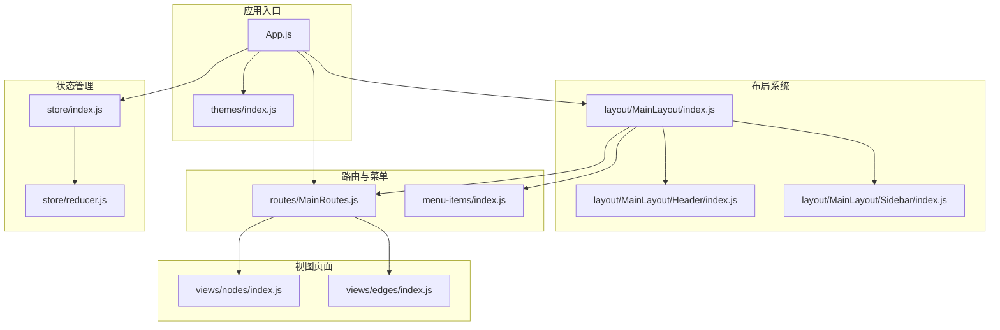
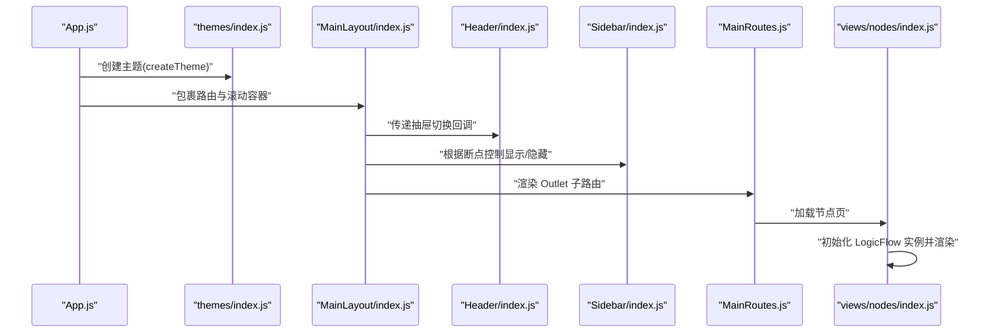
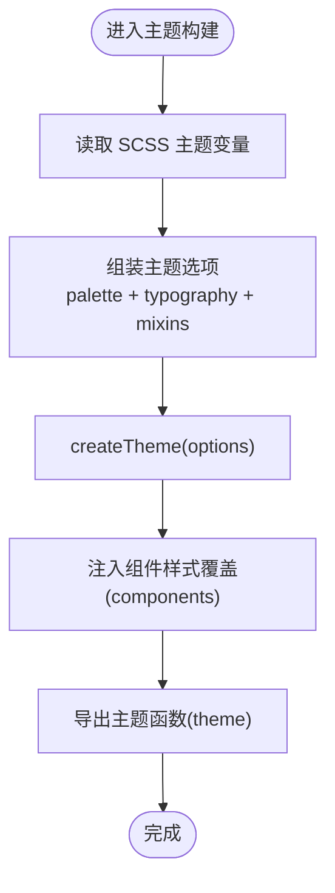
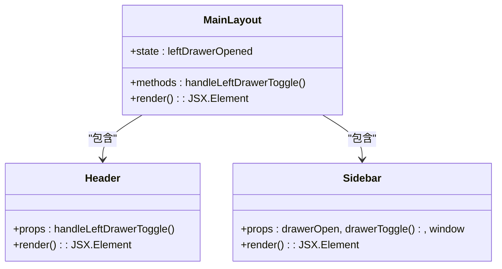
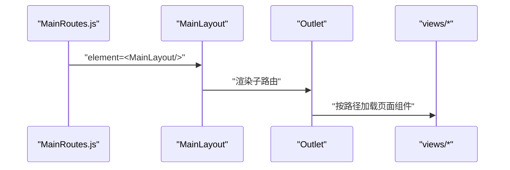
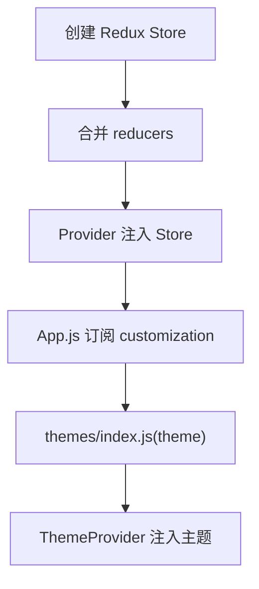
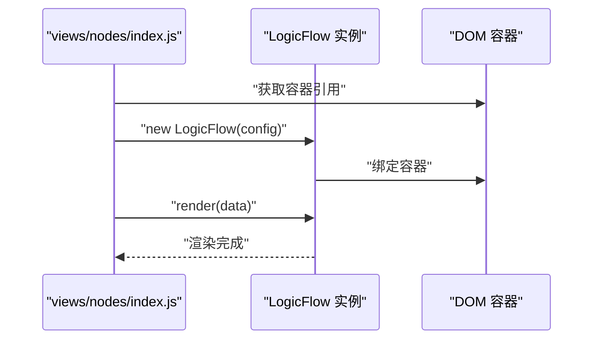
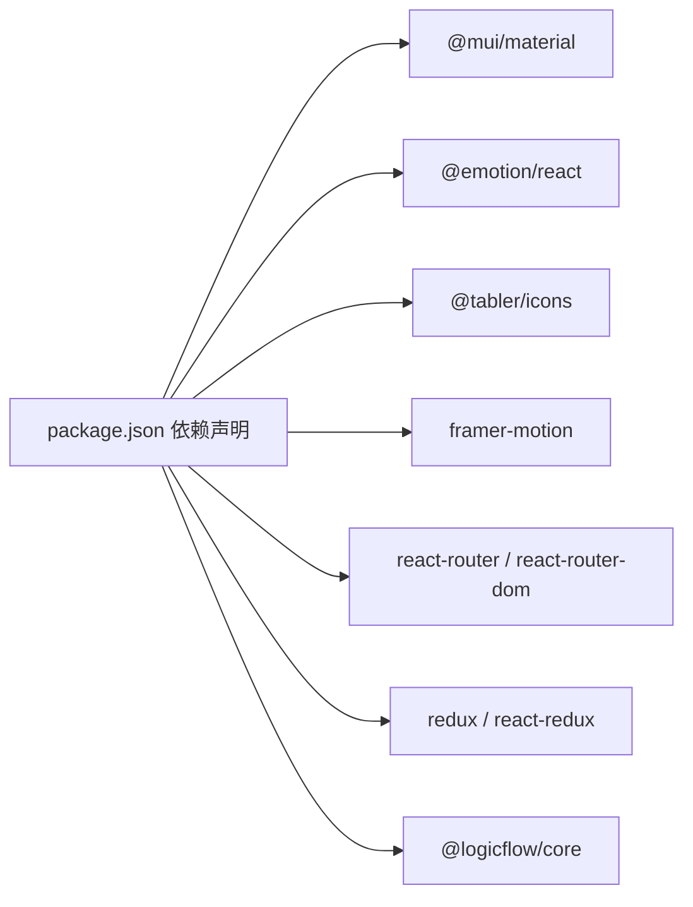

# Material-UI 示例

<cite>
**本文引用的文件**
- [examples/material-ui-demo/package.json](file://examples/material-ui-demo/package.json)
- [examples/material-ui-demo/src/App.js](file://examples/material-ui-demo/src/App.js)
- [examples/material-ui-demo/src/layout/MainLayout/index.js](file://examples/material-ui-demo/src/layout/MainLayout/index.js)
- [examples/material-ui-demo/src/layout/MainLayout/Header/index.js](file://examples/material-ui-demo/src/layout/MainLayout/Header/index.js)
- [examples/material-ui-demo/src/layout/MainLayout/Sidebar/index.js](file://examples/material-ui-demo/src/layout/MainLayout/Sidebar/index.js)
- [examples/material-ui-demo/src/themes/index.js](file://examples/material-ui-demo/src/themes/index.js)
- [examples/material-ui-demo/src/themes/palette.js](file://examples/material-ui-demo/src/themes/palette.js)
- [examples/material-ui-demo/src/themes/typography.js](file://examples/material-ui-demo/src/themes/typography.js)
- [examples/material-ui-demo/src/route/ MainRoutes.js](file://examples/material-ui-demo/src/routes/MainRoutes.js)
- [examples/material-ui-demo/src/store/index.js](file://examples/material-ui-demo/src/store/index.js)
- [examples/material-ui-demo/src/store/reducer.js](file://examples/material-ui-demo/src/store/reducer.js)
- [examples/material-ui-demo/src/views/nodes/index.js](file://examples/material-ui-demo/src/views/nodes/index.js)
- [examples/material-ui-demo/src/views/edges/index.js](file://examples/material-ui-demo/src/views/edges/index.js)
- [examples/material-ui-demo/src/menu-items/index.js](file://examples/material-ui-demo/src/menu-items/index.js)
</cite>

## 目录
1. [简介](#简介)
2. [项目结构](#项目结构)
3. [核心组件](#核心组件)
4. [架构总览](#架构总览)
5. [组件详解](#组件详解)
6. [依赖关系分析](#依赖关系分析)
7. [性能考量](#性能考量)
8. [故障排查指南](#故障排查指南)
9. [结论](#结论)
10. [附录](#附录)

## 简介
本文件面向希望在 Material-UI 生态系统中集成 LogicFlow 的开发者，提供从主题系统、布局组件（侧边栏、头部导航、面包屑）、图标库与动画、响应式布局到状态管理与路由导航的完整实现指南与设计规范。文档以仓库中的 Material-UI 示例为基础，逐层拆解其架构与实现细节，并给出可直接落地的实践建议。

## 项目结构
该示例采用基于功能域的组织方式，核心模块包括：
- 应用入口与主题：App.js、themes/
- 布局系统：layout/MainLayout 及其子组件（Header、Sidebar）
- 路由与菜单：routes/MainRoutes.js、menu-items/
- 状态管理：store/（Redux）
- 视图页面：views/（含 LogicFlow 集成示例）
- 图标与样式：@mui/icons-material、@tabler/icons、scss 主题变量

**图表来源**
- [examples/material-ui-demo/src/App.js](file://examples/material-ui-demo/src/App.js#L1-L33)
- [examples/material-ui-demo/src/themes/index.js](file://examples/material-ui-demo/src/themes/index.js#L1-L56)
- [examples/material-ui-demo/src/layout/MainLayout/index.js](file://examples/material-ui-demo/src/layout/MainLayout/index.js#L1-L100)
- [examples/material-ui-demo/src/layout/MainLayout/Header/index.js](file://examples/material-ui-demo/src/layout/MainLayout/Header/index.js#L1-L63)
- [examples/material-ui-demo/src/layout/MainLayout/Sidebar/index.js](file://examples/material-ui-demo/src/layout/MainLayout/Sidebar/index.js#L1-L92)
- [examples/material-ui-demo/src/routes/MainRoutes.js](file://examples/material-ui-demo/src/routes/MainRoutes.js#L1-L109)
- [examples/material-ui-demo/src/menu-items/index.js](file://examples/material-ui-demo/src/menu-items/index.js#L1-L13)
- [examples/material-ui-demo/src/store/index.js](file://examples/material-ui-demo/src/store/index.js#L1-L10)
- [examples/material-ui-demo/src/store/reducer.js](file://examples/material-ui-demo/src/store/reducer.js#L1-L13)
- [examples/material-ui-demo/src/views/nodes/index.js](file://examples/material-ui-demo/src/views/nodes/index.js#L1-L73)
- [examples/material-ui-demo/src/views/edges/index.js](file://examples/material-ui-demo/src/views/edges/index.js#L1-L21)

**章节来源**
- [examples/material-ui-demo/package.json](file://examples/material-ui-demo/package.json#L1-L76)
- [examples/material-ui-demo/src/App.js](file://examples/material-ui-demo/src/App.js#L1-L33)
- [examples/material-ui-demo/src/layout/MainLayout/index.js](file://examples/material-ui-demo/src/layout/MainLayout/index.js#L1-L100)

## 核心组件
- 应用根组件：通过 ThemeProvider 注入主题，CssBaseline 统一基础样式，NavigationScroll 包裹路由出口，Redux 状态驱动主题与菜单开关。
- 布局容器：MainLayout 负责 AppBar、侧边栏、主内容区与面包屑的组合；Header 提供移动端抽屉切换按钮；Sidebar 渲染菜单列表并支持滚动与响应式。
- 主题系统：themes/index.js 组合 palette 与 typography，并通过 createTheme 创建主题对象，再注入组件级样式覆盖。
- 路由与菜单：MainRoutes.js 定义页面路由树，menu-items/index.js 提供菜单数据源。
- 状态管理：store/index.js 创建 Redux Store，reducer.js 合并子 reducer（如 customization）。
- LogicFlow 集成：views/nodes/index.js 展示在 Material-UI 页面中嵌入 LogicFlow 的最小可用示例。

**章节来源**
- [examples/material-ui-demo/src/App.js](file://examples/material-ui-demo/src/App.js#L1-L33)
- [examples/material-ui-demo/src/layout/MainLayout/index.js](file://examples/material-ui-demo/src/layout/MainLayout/index.js#L56-L97)
- [examples/material-ui-demo/src/layout/MainLayout/Header/index.js](file://examples/material-ui-demo/src/layout/MainLayout/Header/index.js#L15-L62)
- [examples/material-ui-demo/src/layout/MainLayout/Sidebar/index.js](file://examples/material-ui-demo/src/layout/MainLayout/Sidebar/index.js#L18-L91)
- [examples/material-ui-demo/src/themes/index.js](file://examples/material-ui-demo/src/themes/index.js#L16-L53)
- [examples/material-ui-demo/src/routes/MainRoutes.js](file://examples/material-ui-demo/src/routes/MainRoutes.js#L25-L106)
- [examples/material-ui-demo/src/menu-items/index.js](file://examples/material-ui-demo/src/menu-items/index.js#L8-L12)
- [examples/material-ui-demo/src/store/index.js](file://examples/material-ui-demo/src/store/index.js#L6-L9)
- [examples/material-ui-demo/src/store/reducer.js](file://examples/material-ui-demo/src/store/reducer.js#L8-L10)
- [examples/material-ui-demo/src/views/nodes/index.js](file://examples/material-ui-demo/src/views/nodes/index.js#L46-L72)

## 架构总览
下图展示了应用启动到页面渲染的关键流程：应用初始化 -> 主题创建 -> 布局装配 -> 路由匹配 -> 页面渲染 -> LogicFlow 实例化。

**图表来源**
- [examples/material-ui-demo/src/App.js](file://examples/material-ui-demo/src/App.js#L17-L30)
- [examples/material-ui-demo/src/themes/index.js](file://examples/material-ui-demo/src/themes/index.js#L16-L53)
- [examples/material-ui-demo/src/layout/MainLayout/index.js](file://examples/material-ui-demo/src/layout/MainLayout/index.js#L56-L97)
- [examples/material-ui-demo/src/layout/MainLayout/Header/index.js](file://examples/material-ui-demo/src/layout/MainLayout/Header/index.js#L15-L62)
- [examples/material-ui-demo/src/layout/MainLayout/Sidebar/index.js](file://examples/material-ui-demo/src/layout/MainLayout/Sidebar/index.js#L18-L91)
- [examples/material-ui-demo/src/routes/MainRoutes.js](file://examples/material-ui-demo/src/routes/MainRoutes.js#L25-L106)
- [examples/material-ui-demo/src/views/nodes/index.js](file://examples/material-ui-demo/src/views/nodes/index.js#L46-L72)

## 组件详解

### 主题系统与调色板
- 主题入口：themes/index.js 调用 palette 与 typography 并传入自定义参数（如 navType、字体家族、圆角等），最终通过 createTheme 生成主题对象，并挂载组件级样式覆盖。
- 调色板：palette.js 将自定义颜色映射到 Material-UI 的 primary/secondary/error/warning/success/grey/dark 等键位，支持浅/中/深/高亮等多阶配色。
- 字体排版：typography.js 定义各级标题、正文、按钮、菜单等文本样式，并通过 theme.customization 动态调整字号与字重。

**图表来源**
- [examples/material-ui-demo/src/themes/index.js](file://examples/material-ui-demo/src/themes/index.js#L16-L53)
- [examples/material-ui-demo/src/themes/palette.js](file://examples/material-ui-demo/src/themes/palette.js#L6-L73)
- [examples/material-ui-demo/src/themes/typography.js](file://examples/material-ui-demo/src/themes/typography.js#L6-L133)

**章节来源**
- [examples/material-ui-demo/src/themes/index.js](file://examples/material-ui-demo/src/themes/index.js#L16-L53)
- [examples/material-ui-demo/src/themes/palette.js](file://examples/material-ui-demo/src/themes/palette.js#L6-L73)
- [examples/material-ui-demo/src/themes/typography.js](file://examples/material-ui-demo/src/themes/typography.js#L6-L133)

### 布局组件：侧边栏、头部导航、面包屑
- 头部导航 Header：提供抽屉切换按钮，使用 Tabler Icons 的菜单图标，配合主题样式实现悬停效果与过渡动画。
- 侧边栏 Sidebar：根据断点决定临时/持久抽屉，内部使用 react-perfect-scrollbar 实现滚动条，顶部 LogoSection，底部显示版本信息。
- 主布局 MainLayout：统一管理抽屉开关、面包屑分隔符、主内容区域的边距与宽度，结合媒体查询实现响应式布局。

**图表来源**
- [examples/material-ui-demo/src/layout/MainLayout/Header/index.js](file://examples/material-ui-demo/src/layout/MainLayout/Header/index.js#L15-L62)
- [examples/material-ui-demo/src/layout/MainLayout/Sidebar/index.js](file://examples/material-ui-demo/src/layout/MainLayout/Sidebar/index.js#L18-L91)
- [examples/material-ui-demo/src/layout/MainLayout/index.js](file://examples/material-ui-demo/src/layout/MainLayout/index.js#L56-L97)

**章节来源**
- [examples/material-ui-demo/src/layout/MainLayout/Header/index.js](file://examples/material-ui-demo/src/layout/MainLayout/Header/index.js#L15-L62)
- [examples/material-ui-demo/src/layout/MainLayout/Sidebar/index.js](file://examples/material-ui-demo/src/layout/MainLayout/Sidebar/index.js#L18-L91)
- [examples/material-ui-demo/src/layout/MainLayout/index.js](file://examples/material-ui-demo/src/layout/MainLayout/index.js#L56-L97)

### 路由配置与页面导航
- MainRoutes.js 定义根路径与子路由，使用 React.lazy 与 Loadable 延迟加载页面组件，减少首屏体积。
- 菜单数据 menu-items/index.js 提供导航项集合，供 Sidebar 渲染菜单列表使用。

**图表来源**
- [examples/material-ui-demo/src/routes/MainRoutes.js](file://examples/material-ui-demo/src/routes/MainRoutes.js#L25-L106)
- [examples/material-ui-demo/src/layout/MainLayout/index.js](file://examples/material-ui-demo/src/layout/MainLayout/index.js#L89-L93)
- [examples/material-ui-demo/src/menu-items/index.js](file://examples/material-ui-demo/src/menu-items/index.js#L8-L12)

**章节来源**
- [examples/material-ui-demo/src/routes/MainRoutes.js](file://examples/material-ui-demo/src/routes/MainRoutes.js#L25-L106)
- [examples/material-ui-demo/src/menu-items/index.js](file://examples/material-ui-demo/src/menu-items/index.js#L8-L12)

### 状态管理与主题联动
- store/index.js 创建 Redux Store，store/reducer.js 合并子 reducer（如 customization）。
- App.js 通过 useSelector 获取 customization，作为主题函数的输入参数，实现主题动态切换。

**图表来源**
- [examples/material-ui-demo/src/store/index.js](file://examples/material-ui-demo/src/store/index.js#L6-L9)
- [examples/material-ui-demo/src/store/reducer.js](file://examples/material-ui-demo/src/store/reducer.js#L8-L10)
- [examples/material-ui-demo/src/App.js](file://examples/material-ui-demo/src/App.js#L17-L30)
- [examples/material-ui-demo/src/themes/index.js](file://examples/material-ui-demo/src/themes/index.js#L16-L53)

**章节来源**
- [examples/material-ui-demo/src/store/index.js](file://examples/material-ui-demo/src/store/index.js#L6-L9)
- [examples/material-ui-demo/src/store/reducer.js](file://examples/material-ui-demo/src/store/reducer.js#L8-L10)
- [examples/material-ui-demo/src/App.js](file://examples/material-ui-demo/src/App.js#L17-L30)

### 在 Material-UI 中集成 LogicFlow
- 页面组件：views/nodes/index.js 展示了在 Material-UI 卡片中嵌入 LogicFlow 的最小实现：创建容器、初始化实例、渲染数据。
- 关键点：设置容器尺寸、启用网格、避免滚动/缩放干扰，确保与 Material-UI 卡片样式一致。

**图表来源**
- [examples/material-ui-demo/src/views/nodes/index.js](file://examples/material-ui-demo/src/views/nodes/index.js#L46-L72)

**章节来源**
- [examples/material-ui-demo/src/views/nodes/index.js](file://examples/material-ui-demo/src/views/nodes/index.js#L46-L72)

### 图标库与动画组件
- 图标库：@mui/icons-material 与 @tabler/icons 已在依赖中声明，可在组件中直接使用。
- 动画组件：项目依赖 framer-motion，可用于过渡动画与按钮动效（例如 Header 中的悬停动画）。

**章节来源**
- [examples/material-ui-demo/package.json](file://examples/material-ui-demo/package.json#L9-L18)
- [examples/material-ui-demo/src/layout/MainLayout/Header/index.js](file://examples/material-ui-demo/src/layout/MainLayout/Header/index.js#L33-L51)

### 响应式布局实现
- 断点与媒体查询：MainLayout 与 Sidebar 使用 useMediaQuery 判断断点，控制抽屉显示/隐藏与主内容区边距。
- 样式适配：通过 styled 组件与 theme.breakpoints.up/down 控制不同屏幕下的布局与间距。

**章节来源**
- [examples/material-ui-demo/src/layout/MainLayout/index.js](file://examples/material-ui-demo/src/layout/MainLayout/index.js#L57-L58)
- [examples/material-ui-demo/src/layout/MainLayout/Sidebar/index.js](file://examples/material-ui-demo/src/layout/MainLayout/Sidebar/index.js#L19-L20)

## 依赖关系分析
- 应用依赖：@mui/material、@emotion/react、@tabler/icons、framer-motion、react-router、redux 等。
- LogicFlow 集成：通过 @logicflow/core 引入核心能力，并引入默认样式以保证连线与节点渲染一致性。

**图表来源**
- [examples/material-ui-demo/package.json](file://examples/material-ui-demo/package.json#L4-L30)

**章节来源**
- [examples/material-ui-demo/package.json](file://examples/material-ui-demo/package.json#L4-L30)

## 性能考量
- 代码分割：MainRoutes.js 使用 React.lazy 与 Loadable 对页面进行懒加载，降低首屏资源压力。
- 主题复用：themes/index.js 将 palette 与 typography 抽象为可复用的主题工厂，避免重复计算。
- 布局优化：Sidebar 使用 react-perfect-scrollbar 仅在需要时渲染滚动条，减少不必要的 DOM 开销。
- LogicFlow 渲染：在页面卸载或容器变更时及时销毁实例，避免内存泄漏。

[本节为通用指导，不直接分析具体文件]

## 故障排查指南
- 主题未生效：检查 App.js 是否正确包裹 ThemeProvider 与 CssBaseline，确认 themes/index.js 返回的主题对象已注入 components 样式覆盖。
- 抽屉不显示：确认 useMediaQuery 断点逻辑与 Sidebar 的 variant 切换条件，检查 drawerOpen 状态是否受 Redux 管理。
- 路由空白：确认 MainRoutes.js 的 children 结构与 Outlet 渲染位置，检查 Loadable 懒加载是否抛错。
- LogicFlow 不渲染：检查容器引用是否正确，config 与 data 是否传入，以及是否引入默认样式。

**章节来源**
- [examples/material-ui-demo/src/App.js](file://examples/material-ui-demo/src/App.js#L17-L30)
- [examples/material-ui-demo/src/layout/MainLayout/Sidebar/index.js](file://examples/material-ui-demo/src/layout/MainLayout/Sidebar/index.js#L59-L81)
- [examples/material-ui-demo/src/routes/MainRoutes.js](file://examples/material-ui-demo/src/routes/MainRoutes.js#L25-L106)
- [examples/material-ui-demo/src/views/nodes/index.js](file://examples/material-ui-demo/src/views/nodes/index.js#L46-L72)

## 结论
本示例以清晰的模块划分与完善的主题、布局、路由与状态管理机制，为在 Material-UI 中集成 LogicFlow 提供了可复用的工程化范式。通过主题工厂化、断点驱动的布局与懒加载的路由策略，既保证了开发体验，也兼顾了运行时性能。开发者可在此基础上扩展业务页面与交互细节，快速搭建专业级流程可视化应用。

[本节为总结性内容，不直接分析具体文件]

## 附录
- 项目依赖概览与脚手架：参考 package.json 中的依赖与脚本配置。
- 页面占位示例：views/edges/index.js 展示了与 nodes 页面类似的卡片化结构，便于快速复制与扩展。

**章节来源**
- [examples/material-ui-demo/package.json](file://examples/material-ui-demo/package.json#L32-L37)
- [examples/material-ui-demo/src/views/edges/index.js](file://examples/material-ui-demo/src/views/edges/index.js#L9-L20)