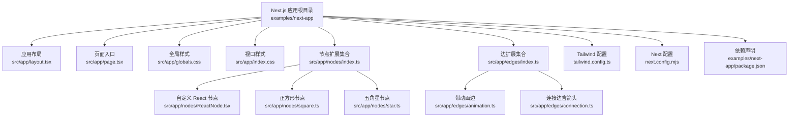
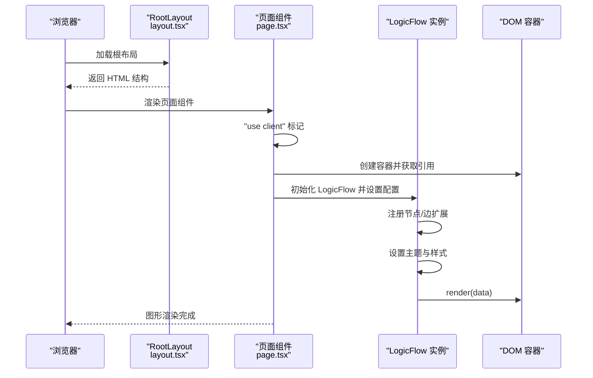
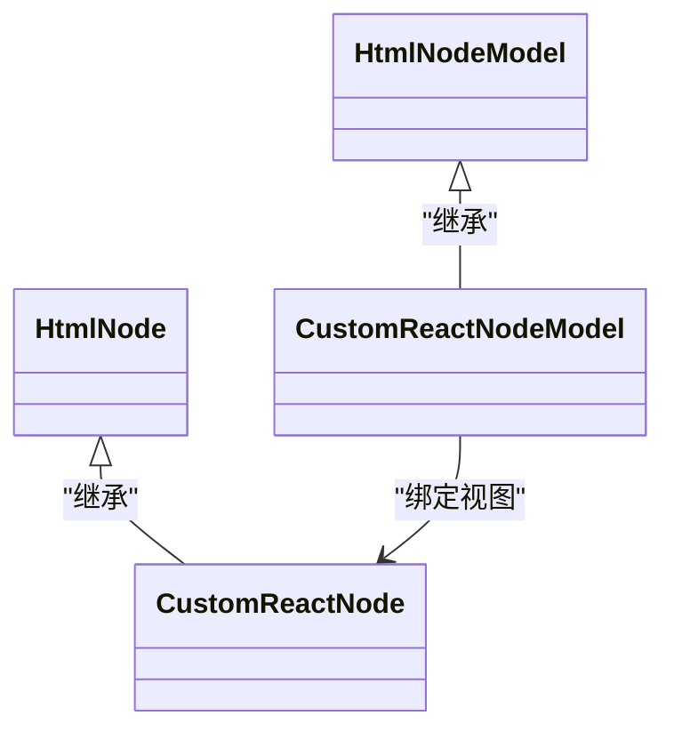
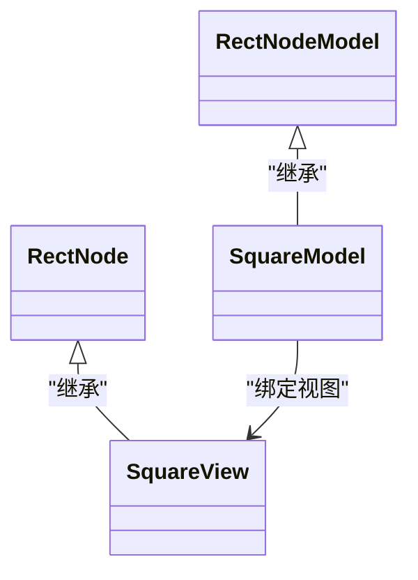
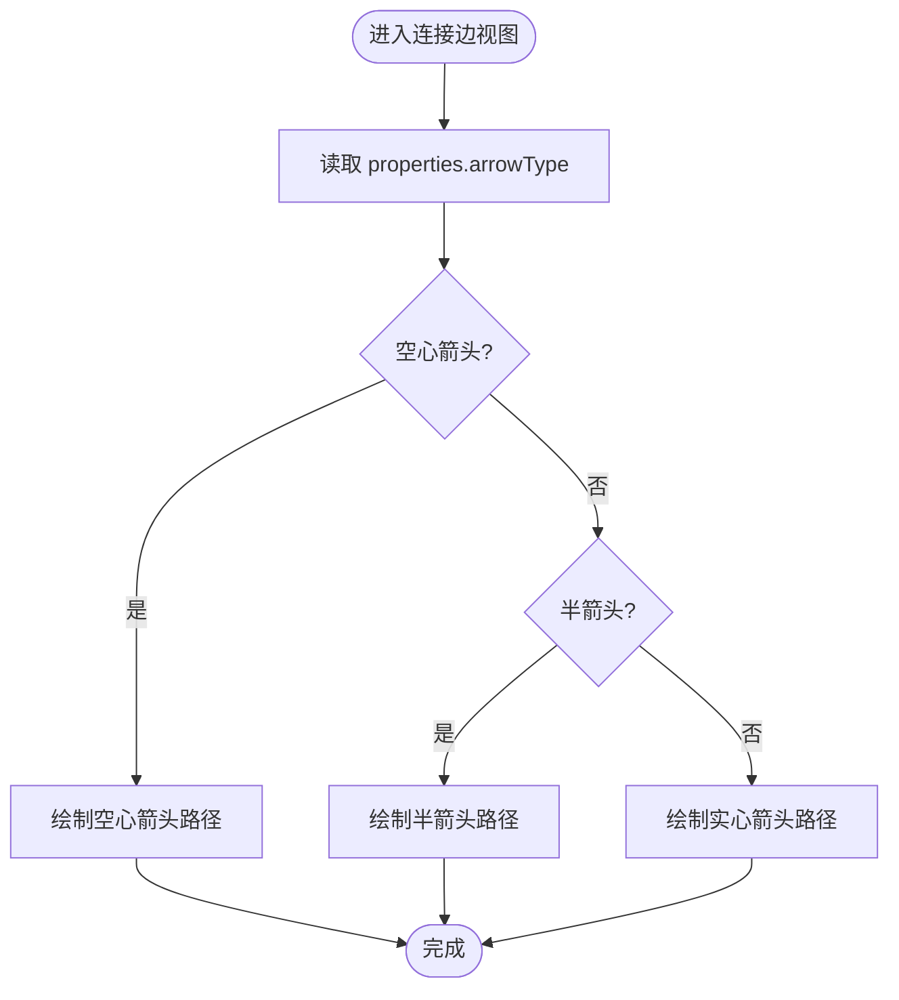
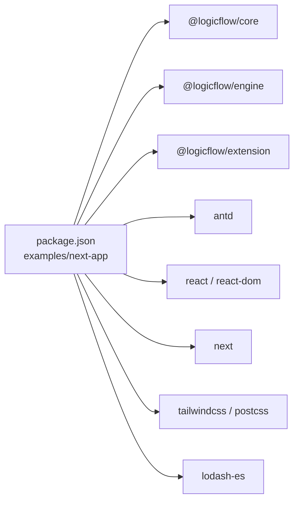

# Next.js 集成示例

<cite>
**本文引用的文件**
- [examples/next-app/package.json](file://examples/next-app/package.json)
- [examples/next-app/next.config.mjs](file://examples/next-app/next.config.mjs)
- [examples/next-app/tailwind.config.ts](file://examples/next-app/tailwind.config.ts)
- [examples/next-app/src/app/layout.tsx](file://examples/next-app/src/app/layout.tsx)
- [examples/next-app/src/app/page.tsx](file://examples/next-app/src/app/page.tsx)
- [examples/next-app/src/app/globals.css](file://examples/next-app/src/app/globals.css)
- [examples/next-app/src/app/index.css](file://examples/next-app/src/app/index.css)
- [examples/next-app/src/app/nodes/index.ts](file://examples/next-app/src/app/nodes/index.ts)
- [examples/next-app/src/app/nodes/ReactNode.tsx](file://examples/next-app/src/app/nodes/ReactNode.tsx)
- [examples/next-app/src/app/nodes/square.ts](file://examples/next-app/src/app/nodes/square.ts)
- [examples/next-app/src/app/nodes/star.ts](file://examples/next-app/src/app/nodes/star.ts)
- [examples/next-app/src/app/edges/index.ts](file://examples/next-app/src/app/edges/index.ts)
- [examples/next-app/src/app/edges/animation.ts](file://examples/next-app/src/app/edges/animation.ts)
- [examples/next-app/src/app/edges/connection.ts](file://examples/next-app/src/app/edges/connection.ts)
- [package.json](file://package.json)
</cite>

## 目录
1. [简介](#简介)
2. [项目结构](#项目结构)
3. [核心组件](#核心组件)
4. [架构总览](#架构总览)
5. [详细组件分析](#详细组件分析)
6. [依赖关系分析](#依赖关系分析)
7. [性能考虑](#性能考虑)
8. [故障排查指南](#故障排查指南)
9. [结论](#结论)
10. [附录](#附录)

## 简介
本文件面向在 Next.js 环境中集成 LogicFlow 流程图能力的开发者，系统性说明以下内容：
- Next.js 应用的架构与文件组织（App Router 模式）
- LogicFlow 在客户端水合中的集成策略（SSR 支持与客户端初始化）
- 静态生成与动态路由的配置思路
- 节点与边的扩展注册、主题与样式管理
- Tailwind CSS 集成与样式覆盖
- 性能优化与构建部署建议
- 常见问题与最佳实践

## 项目结构
该示例位于 examples/next-app 目录，采用 Next.js App Router 的目录约定，页面入口为 src/app/page.tsx，全局布局在 src/app/layout.tsx，样式通过 Tailwind CSS 管理。

图表来源
- [examples/next-app/src/app/layout.tsx](file://examples/next-app/src/app/layout.tsx#L1-L23)
- [examples/next-app/src/app/page.tsx](file://examples/next-app/src/app/page.tsx#L1-L476)
- [examples/next-app/src/app/globals.css](file://examples/next-app/src/app/globals.css#L1-L34)
- [examples/next-app/src/app/index.css](file://examples/next-app/src/app/index.css#L1-L69)
- [examples/next-app/src/app/nodes/index.ts](file://examples/next-app/src/app/nodes/index.ts#L1-L16)
- [examples/next-app/src/app/nodes/ReactNode.tsx](file://examples/next-app/src/app/nodes/ReactNode.tsx#L1-L64)
- [examples/next-app/src/app/nodes/square.ts](file://examples/next-app/src/app/nodes/square.ts#L1-L77)
- [examples/next-app/src/app/nodes/star.ts](file://examples/next-app/src/app/nodes/star.ts#L1-L22)
- [examples/next-app/src/app/edges/index.ts](file://examples/next-app/src/app/edges/index.ts#L1-L8)
- [examples/next-app/src/app/edges/animation.ts](file://examples/next-app/src/app/edges/animation.ts#L1-L20)
- [examples/next-app/src/app/edges/connection.ts](file://examples/next-app/src/app/edges/connection.ts#L1-L85)
- [examples/next-app/tailwind.config.ts](file://examples/next-app/tailwind.config.ts#L1-L21)
- [examples/next-app/next.config.mjs](file://examples/next-app/next.config.mjs#L1-L5)
- [examples/next-app/package.json](file://examples/next-app/package.json#L1-L32)

章节来源
- [examples/next-app/src/app/layout.tsx](file://examples/next-app/src/app/layout.tsx#L1-L23)
- [examples/next-app/src/app/page.tsx](file://examples/next-app/src/app/page.tsx#L1-L476)
- [examples/next-app/src/app/globals.css](file://examples/next-app/src/app/globals.css#L1-L34)
- [examples/next-app/src/app/index.css](file://examples/next-app/src/app/index.css#L1-L69)
- [examples/next-app/src/app/nodes/index.ts](file://examples/next-app/src/app/nodes/index.ts#L1-L16)
- [examples/next-app/src/app/edges/index.ts](file://examples/next-app/src/app/edges/index.ts#L1-L8)
- [examples/next-app/tailwind.config.ts](file://examples/next-app/tailwind.config.ts#L1-L21)
- [examples/next-app/next.config.mjs](file://examples/next-app/next.config.mjs#L1-L5)
- [examples/next-app/package.json](file://examples/next-app/package.json#L1-L32)

## 核心组件
- 页面容器与水合：页面组件通过“use client”标记在客户端执行，使用 useRef 持有 LogicFlow 实例，挂载容器后进行初始化与渲染。
- 扩展注册：通过 nodes/index.ts 与 edges/index.ts 统一导出，集中注册到 LogicFlow。
- 主题与样式：在页面中设置主题与全局样式，同时通过 index.css 控制视口尺寸与交互元素定位。
- UI 控件：使用 Ant Design 的 Button、Card、Divider、Flex 等组件提供操作按钮与布局。

章节来源
- [examples/next-app/src/app/page.tsx](file://examples/next-app/src/app/page.tsx#L1-L476)
- [examples/next-app/src/app/nodes/index.ts](file://examples/next-app/src/app/nodes/index.ts#L1-L16)
- [examples/next-app/src/app/edges/index.ts](file://examples/next-app/src/app/edges/index.ts#L1-L8)
- [examples/next-app/src/app/index.css](file://examples/next-app/src/app/index.css#L1-L69)

## 架构总览
下面以序列图展示从页面加载到 LogicFlow 初始化的关键流程：

图表来源
- [examples/next-app/src/app/layout.tsx](file://examples/next-app/src/app/layout.tsx#L12-L22)
- [examples/next-app/src/app/page.tsx](file://examples/next-app/src/app/page.tsx#L132-L208)
- [examples/next-app/src/app/nodes/index.ts](file://examples/next-app/src/app/nodes/index.ts#L1-L16)
- [examples/next-app/src/app/edges/index.ts](file://examples/next-app/src/app/edges/index.ts#L1-L8)

## 详细组件分析

### 页面与水合策略
- “use client”确保组件在客户端执行，避免 SSR 期间访问浏览器 API。
- 通过 useRef 持有 LogicFlow 实例与容器引用，仅在首次挂载时初始化，避免重复创建实例。
- render(data) 后，所有交互（撤销/重做、缩放、居中、动画等）均在客户端生效。

章节来源
- [examples/next-app/src/app/page.tsx](file://examples/next-app/src/app/page.tsx#L1-L476)

### 节点扩展：自定义 React 节点
- 使用 HtmlNode/HtmlNodeModel 将 React 组件嵌入到 LogicFlow 的 SVG 外部对象中，实现富交互节点。
- 通过 anchorsOffset 定义锚点，控制连线方向与规则。
- 通过 setAttributes 设置节点尺寸、文本区域与锚点偏移。

图表来源
- [examples/next-app/src/app/nodes/ReactNode.tsx](file://examples/next-app/src/app/nodes/ReactNode.tsx#L6-L37)
- [examples/next-app/src/app/nodes/ReactNode.tsx](file://examples/next-app/src/app/nodes/ReactNode.tsx#L39-L57)

章节来源
- [examples/next-app/src/app/nodes/ReactNode.tsx](file://examples/next-app/src/app/nodes/ReactNode.tsx#L1-L64)

### 节点扩展：正方形节点与规则校验
- 通过 RectNode/RectNodeModel 扩展正方形节点，设置宽高与锚点。
- 使用 sourceRules 对连线目标类型进行约束（例如：只允许连接到圆形节点）。

图表来源
- [examples/next-app/src/app/nodes/square.ts](file://examples/next-app/src/app/nodes/square.ts#L4-L22)
- [examples/next-app/src/app/nodes/square.ts](file://examples/next-app/src/app/nodes/square.ts#L24-L70)

章节来源
- [examples/next-app/src/app/nodes/square.ts](file://examples/next-app/src/app/nodes/square.ts#L1-L77)

### 节点扩展：五角星节点
- 基于 PolygonNode/PolygonNodeModel，自定义多边形顶点坐标与填充色。

章节来源
- [examples/next-app/src/app/nodes/star.ts](file://examples/next-app/src/app/nodes/star.ts#L1-L22)

### 边扩展：带动画的贝塞尔边
- 通过 BezierEdge/BezierEdgeModel 覆盖 getEdgeAnimationStyle，自定义动画颜色与时长。

章节来源
- [examples/next-app/src/app/edges/animation.ts](file://examples/next-app/src/app/edges/animation.ts#L1-L20)

### 边扩展：连接边（含可变箭头）
- 通过 PolylineEdge/PolylineEdgeModel 自定义调整点形状与文本背景。
- 在连接边视图中根据 properties.arrowType 动态绘制不同箭头样式。

图表来源
- [examples/next-app/src/app/edges/connection.ts](file://examples/next-app/src/app/edges/connection.ts#L4-L58)

章节来源
- [examples/next-app/src/app/edges/connection.ts](file://examples/next-app/src/app/edges/connection.ts#L1-L85)

### 主题与样式管理
- 页面中通过 setTheme 设置节点/边/文本的主题参数，如颜色、圆角、箭头尺寸等。
- index.css 控制视口高度、文本输入字体大小、按钮层叠层级等。
- globals.css 引入 Tailwind 指令，支持暗色模式与渐变背景。

章节来源
- [examples/next-app/src/app/page.tsx](file://examples/next-app/src/app/page.tsx#L47-L73)
- [examples/next-app/src/app/index.css](file://examples/next-app/src/app/index.css#L1-L69)
- [examples/next-app/src/app/globals.css](file://examples/next-app/src/app/globals.css#L1-L34)

### Tailwind CSS 集成
- tailwind.config.ts 配置 content 路径，确保扫描 src/app/**/*.{js,ts,jsx,tsx,mdx} 以生成所需样式。
- 在页面与节点组件中直接使用 Tailwind 类名，实现响应式与主题化 UI。

章节来源
- [examples/next-app/tailwind.config.ts](file://examples/next-app/tailwind.config.ts#L1-L21)

### Next.js 配置与脚本
- next.config.mjs 当前为空配置，适合默认行为；可在其中添加图像优化、实验特性等。
- package.json 中提供 dev/build/start/lint 脚本，便于本地开发与生产构建。

章节来源
- [examples/next-app/next.config.mjs](file://examples/next-app/next.config.mjs#L1-L5)
- [examples/next-app/package.json](file://examples/next-app/package.json#L1-L32)

## 依赖关系分析
- 逻辑流核心：@logicflow/core、@logicflow/engine、@logicflow/extension
- UI 组件：antd（Button、Card、Divider、Flex、ColorPicker、Tooltip 等）
- 样式与工具：tailwindcss、postcss、lodash-es
- 运行时：react、react-dom、next

图表来源
- [examples/next-app/package.json](file://examples/next-app/package.json#L11-L19)

章节来源
- [examples/next-app/package.json](file://examples/next-app/package.json#L1-L32)

## 性能考虑
- 仅在客户端初始化 LogicFlow，避免 SSR 期间的 DOM 访问。
- 合理使用 partial、grid、background 等配置减少不必要的重绘。
- 使用动画边时注意动画时长与数量，避免大量边同时播放导致卡顿。
- 通过主题统一样式，减少重复计算与样式切换。
- Tailwind 按需引入类名，避免生成冗余样式。

## 故障排查指南
- 无法渲染或报错找不到容器：确认页面中 ref 容器已挂载且未在 SSR 期间调用初始化。
- 节点/边不显示：检查 nodes/index.ts 与 edges/index.ts 是否正确导出并注册。
- 箭头样式异常：检查连接边的 properties.arrowType 与视图中 getEndArrow 的分支逻辑。
- 动画无效：确认动画边的 getEdgeAnimationStyle 已被覆盖，且动画时长合理。
- 样式冲突：检查 index.css 与 globals.css 的优先级，避免 Tailwind 与自定义样式的覆盖问题。

## 结论
本示例展示了在 Next.js App Router 下集成 LogicFlow 的完整路径：页面级客户端水合、节点与边的模块化扩展、主题与样式管理、以及 Tailwind 的无缝集成。通过合理的初始化时机与配置项，可在 Next.js 中稳定运行复杂的流程图功能，并具备良好的可维护性与扩展性。

## 附录
- 静态生成与动态路由：当前示例为客户端渲染页面，若需静态生成，可将页面改为服务端渲染并在客户端水合；动态路由可通过 src/app/[id]/page.tsx 组织。
- 构建与部署：使用 next build 生成静态产物，next start 启动生产服务器；可结合 Vercel/Next Cloud 等平台一键部署。
- 扩展清单：可在 nodes/edges 目录继续新增自定义节点与边，遵循现有导出与注册模式。