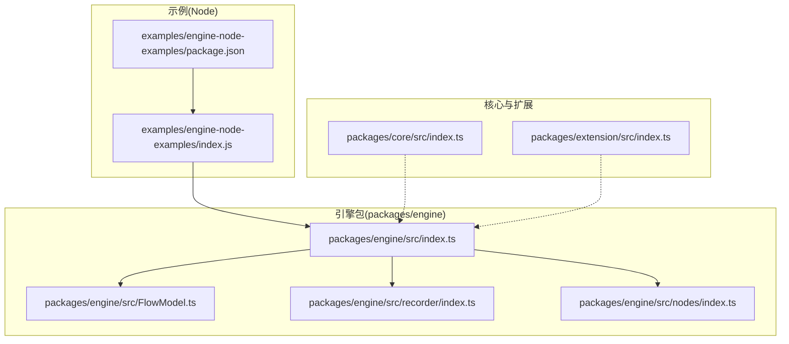
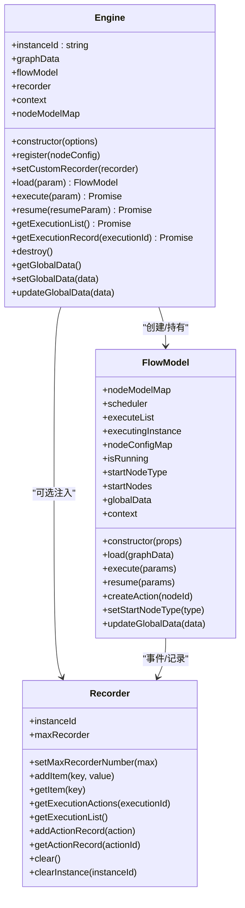
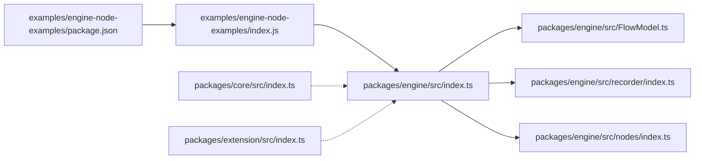

# Node.js 示例

<cite>
**本文引用的文件**
- [examples/engine-node-examples/index.js](file://examples/engine-node-examples/index.js)
- [examples/engine-node-examples/package.json](file://examples/engine-node-examples/package.json)
- [packages/engine/src/index.ts](file://packages/engine/src/index.ts)
- [packages/engine/src/FlowModel.ts](file://packages/engine/src/FlowModel.ts)
- [packages/engine/src/recorder/index.ts](file://packages/engine/src/recorder/index.ts)
- [packages/engine/src/nodes/index.ts](file://packages/engine/src/nodes/index.ts)
- [packages/core/src/index.ts](file://packages/core/src/index.ts)
- [packages/extension/src/index.ts](file://packages/extension/src/index.ts)
- [package.json](file://package.json)
- [README.md](file://README.md)
</cite>

## 目录
1. [简介](#简介)
2. [项目结构](#项目结构)
3. [核心组件](#核心组件)
4. [架构总览](#架构总览)
5. [组件详解](#组件详解)
6. [依赖关系分析](#依赖关系分析)
7. [性能与内存管理](#性能与内存管理)
8. [故障排查指南](#故障排查指南)
9. [结论](#结论)
10. [附录](#附录)

## 简介
本文件面向在 Node.js 环境中使用 LogicFlow 的开发者，系统性说明如何在服务端渲染与无头浏览器环境下运行 LogicFlow 引擎，完成流程图的加载、执行、记录与查询，并提供命令行批量处理思路与最佳实践。文档同时对比前端与后端差异，给出部署建议与常见问题排查方法。

## 项目结构
本仓库采用多包工作区组织方式，Node.js 示例位于 examples/engine-node-examples，核心引擎与扩展位于 packages 目录。Node 示例通过本地 workspace:* 依赖指向 packages/engine，实现最小可运行示例。

**图表来源**
- [examples/engine-node-examples/index.js](file://examples/engine-node-examples/index.js#L1-L54)
- [examples/engine-node-examples/package.json](file://examples/engine-node-examples/package.json#L1-L22)
- [packages/engine/src/index.ts](file://packages/engine/src/index.ts#L1-L301)
- [packages/engine/src/FlowModel.ts](file://packages/engine/src/FlowModel.ts#L1-L328)
- [packages/engine/src/recorder/index.ts](file://packages/engine/src/recorder/index.ts#L1-L138)
- [packages/engine/src/nodes/index.ts](file://packages/engine/src/nodes/index.ts#L1-L4)
- [packages/core/src/index.ts](file://packages/core/src/index.ts#L1-L27)
- [packages/extension/src/index.ts](file://packages/extension/src/index.ts#L1-L48)

**章节来源**
- [README.md](file://README.md#L1-L37)
- [package.json](file://package.json#L1-L45)
- [examples/engine-node-examples/package.json](file://examples/engine-node-examples/package.json#L1-L22)

## 核心组件
- 引擎 Engine：负责加载流程图、注册节点、执行/恢复执行、查询执行记录、销毁资源等。
- 流程模型 FlowModel：解析图数据为节点配置，维护开始节点、全局数据与上下文，协调调度器执行。
- 记录器 Recorder：在 Node 环境默认使用内存存储执行记录，支持设置自定义持久化存储。
- 节点注册：默认注册 StartNode、TaskNode，可通过 register 注册自定义节点模型。

**章节来源**
- [packages/engine/src/index.ts](file://packages/engine/src/index.ts#L7-L176)
- [packages/engine/src/FlowModel.ts](file://packages/engine/src/FlowModel.ts#L14-L328)
- [packages/engine/src/recorder/index.ts](file://packages/engine/src/recorder/index.ts#L8-L122)
- [packages/engine/src/nodes/index.ts](file://packages/engine/src/nodes/index.ts#L1-L4)

## 架构总览
Node.js 示例通过 Engine 加载 graphData，FlowModel 解析为节点图结构，Recorder 记录执行轨迹，Engine 对外提供执行与查询接口。核心类关系如下：

**图表来源**
- [packages/engine/src/index.ts](file://packages/engine/src/index.ts#L7-L176)
- [packages/engine/src/FlowModel.ts](file://packages/engine/src/FlowModel.ts#L14-L328)
- [packages/engine/src/recorder/index.ts](file://packages/engine/src/recorder/index.ts#L8-L122)

## 组件详解

### 引擎 Engine（Node 端）
- 初始化：支持 debug 模式启用 Recorder；默认注册 StartNode、TaskNode。
- 加载：load 接收 graphData、startNodeType、globalData，构建 FlowModel 并返回。
- 执行：execute 返回 Promise，支持多次调用，内部通过 FlowModel 协调调度。
- 恢复：resume 支持从指定 actionId 恢复执行。
- 记录：getExecutionList、getExecutionRecord 查询执行历史。
- 资源：destroy 清理 Recorder 实例。

最佳实践要点
- Node 环境建议自定义 Recorder 为持久化存储，避免进程重启丢失记录。
- 多次执行串行，避免并发写入冲突；如需并行，应使用独立 Engine 实例。

**章节来源**
- [packages/engine/src/index.ts](file://packages/engine/src/index.ts#L16-L176)
- [examples/engine-node-examples/index.js](file://examples/engine-node-examples/index.js#L3-L53)

### 流程模型 FlowModel（图解析与执行编排）
- 图解析：将 nodes/edges 转换为 nodeConfigMap，建立 incoming/outgoing 关系，收集 startNodes。
- 执行队列：executeList 串行排队，executingInstance 记录当前执行实例。
- 调度：通过 Scheduler 触发节点执行，完成/中断/错误事件统一回调。
- 全局数据：globalData 与 context 透传至节点执行上下文。

**章节来源**
- [packages/engine/src/FlowModel.ts](file://packages/engine/src/FlowModel.ts#L137-L328)

### 记录器 Recorder（执行记录与持久化）
- 内存存储：默认基于 storage（Node 环境下为内存）保存执行动作与执行列表。
- 生命周期：限制单实例最大执行数与总实例数，自动清理最旧执行。
- 接口：addActionRecord、getActionRecord、getExecutionActions、getExecutionList、clear/clearInstance。

Node 环境建议
- 使用 setCustomRecorder 注入持久化实现（如数据库或文件系统），并在业务层定期清理过期记录。

**章节来源**
- [packages/engine/src/recorder/index.ts](file://packages/engine/src/recorder/index.ts#L8-L122)

### 节点注册与默认节点
- 默认注册 StartNode、TaskNode，可通过 register 注册自定义节点模型。
- 节点模型通过 FlowModel.createAction 创建实例，传入 globalData 与 context。

**章节来源**
- [packages/engine/src/index.ts](file://packages/engine/src/index.ts#L40-L42)
- [packages/engine/src/nodes/index.ts](file://packages/engine/src/nodes/index.ts#L1-L4)
- [packages/engine/src/FlowModel.ts](file://packages/engine/src/FlowModel.ts#L258-L271)

### 前端 vs Node 差异
- 前端：LogicFlow 核心导出包含 Preact/MobX 观察者等前端依赖，适合在浏览器中渲染与交互。
- Node：仅使用 @logicflow/engine，不依赖 DOM/BOM，适合服务端渲染与无头环境。

**章节来源**
- [packages/core/src/index.ts](file://packages/core/src/index.ts#L1-L27)
- [README.md](file://README.md#L1-L37)

## 依赖关系分析
Node 示例依赖 @logicflow/engine，引擎内部依赖 FlowModel、Recorder、节点模型与调度器；核心与扩展模块为前端应用提供图形渲染与交互能力。

**图表来源**
- [examples/engine-node-examples/package.json](file://examples/engine-node-examples/package.json#L16-L18)
- [examples/engine-node-examples/index.js](file://examples/engine-node-examples/index.js#L1-L1)
- [packages/engine/src/index.ts](file://packages/engine/src/index.ts#L1-L6)
- [packages/core/src/index.ts](file://packages/core/src/index.ts#L1-L27)
- [packages/extension/src/index.ts](file://packages/extension/src/index.ts#L1-L48)

**章节来源**
- [package.json](file://package.json#L16-L18)
- [examples/engine-node-examples/package.json](file://examples/engine-node-examples/package.json#L16-L18)

## 性能与内存管理
- 执行模式
  - 同一 FlowModel 内部节点执行并行，跨 FlowModel 执行串行，避免数据竞争。
  - 多次执行串行排队，减少并发写入风险。
- 记录清理
  - Recorder 限制单实例最大执行数与总实例数，自动清理最旧执行，防止内存泄漏。
  - Node 环境建议自定义持久化存储并定期清理。
- 上下文与全局数据
  - 通过 context 注入外部能力（如网络请求），通过 globalData 共享数据。
- 资源释放
  - 使用 destroy 清理 Recorder，避免残留引用。

**章节来源**
- [packages/engine/src/FlowModel.ts](file://packages/engine/src/FlowModel.ts#L243-L249)
- [packages/engine/src/recorder/index.ts](file://packages/engine/src/recorder/index.ts#L20-L71)
- [packages/engine/src/index.ts](file://packages/engine/src/index.ts#L157-L159)

## 故障排查指南
- 未识别的节点类型
  - 现象：控制台警告“未识别的节点类型”。
  - 处理：确保已通过 register 注册对应节点模型。
- 执行回调未触发
  - 现象：execute 返回的 Promise 不 resolve/reject。
  - 处理：检查 FlowModel.executeList 与 onExecuteFinished 回调链路，确认 onError 回调是否被调用。
- 记录为空
  - 现象：getExecutionRecord 返回 null。
  - 处理：确认 Recorder 是否正确初始化，执行前已 addActionRecord，或使用自定义 Recorder。
- Node 环境存储不可用
  - 现象：storage 抛错或无法持久化。
  - 处理：实现 setCustomRecorder，将记录写入数据库或文件系统，并在异常时回退清理。

**章节来源**
- [packages/engine/src/FlowModel.ts](file://packages/engine/src/FlowModel.ts#L152-L155)
- [packages/engine/src/recorder/index.ts](file://packages/engine/src/recorder/index.ts#L32-L40)
- [packages/engine/src/index.ts](file://packages/engine/src/index.ts#L56-L58)

## 结论
在 Node.js 中使用 LogicFlow 引擎，可以实现流程图的加载、执行、记录与查询，适用于服务端渲染与无头环境。通过自定义 Recorder 实现持久化、合理管理执行队列与资源释放，可满足生产级需求。与前端相比，Node 端更轻量、无 DOM 依赖，适合批处理与后台任务。

## 附录

### Node 示例运行步骤
- 安装依赖与启动
  - 在根目录安装依赖后，进入示例目录运行 Node 示例脚本。
- 示例脚本要点
  - 加载 graphData，调用 engine.execute 获取结果，再通过 engine.getExecutionRecord 查询执行明细。

**章节来源**
- [README.md](file://README.md#L5-L29)
- [examples/engine-node-examples/package.json](file://examples/engine-node-examples/package.json#L7-L10)
- [examples/engine-node-examples/index.js](file://examples/engine-node-examples/index.js#L3-L53)

### 服务端流程图生成与数据转换（实现指引）
- 流程图生成
  - 准备 graphData（nodes/edges），调用 engine.load。
  - 调用 engine.execute，等待 Promise 完成。
- 数据转换
  - 使用 FlowModel.updateGlobalData 动态更新全局数据。
  - 通过 context 注入外部能力（如网络请求、日志等）。
- 文件导出
  - 将执行结果与记录序列化为 JSON，写入文件或上传到对象存储。
- 批量处理
  - 为每批输入创建独立 Engine 实例，避免共享状态；或对同一 Engine 串行执行，分批提交任务队列。

**章节来源**
- [packages/engine/src/index.ts](file://packages/engine/src/index.ts#L63-L80)
- [packages/engine/src/FlowModel.ts](file://packages/engine/src/FlowModel.ts#L277-L284)
- [packages/engine/src/index.ts](file://packages/engine/src/index.ts#L136-L155)

### 与前端应用的区别与优势
- 区别
  - 前端：LogicFlow 核心导出包含 Preact/MobX，适合浏览器渲染与交互。
  - Node：仅依赖 @logicflow/engine，无 DOM/BOM 依赖。
- 优势
  - 服务端渲染：在无头环境中生成图片/SVG，便于集成到报表或导出流程。
  - 批处理：可串行/并行执行多条流程，结合持久化记录实现可观测性。
  - 低耦合：通过 context 注入能力，便于替换为测试桩或真实实现。

**章节来源**
- [packages/core/src/index.ts](file://packages/core/src/index.ts#L1-L27)
- [packages/extension/src/index.ts](file://packages/extension/src/index.ts#L1-L48)