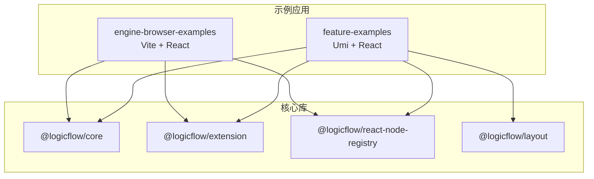
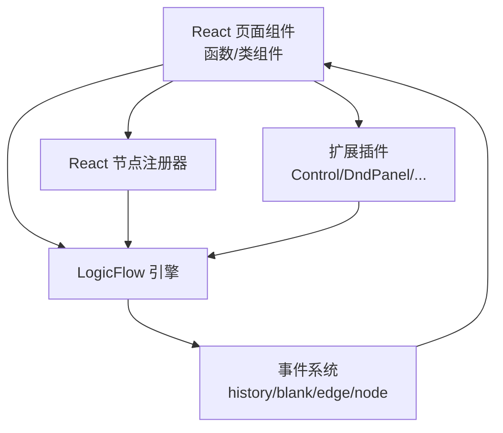
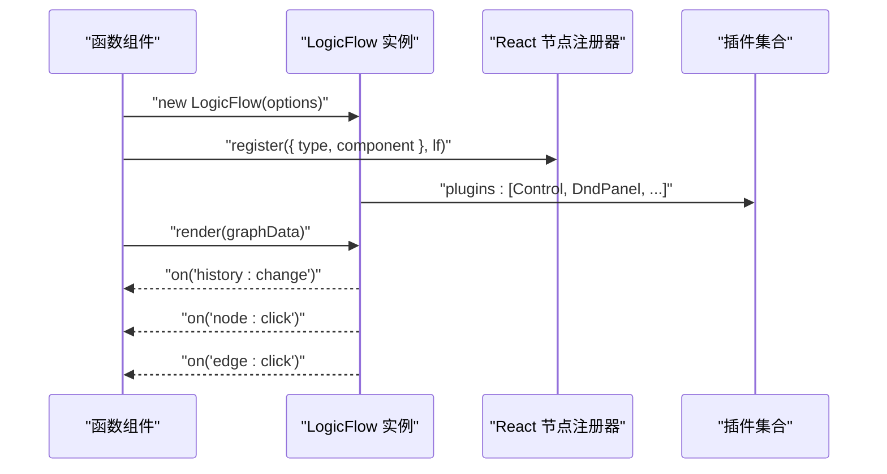
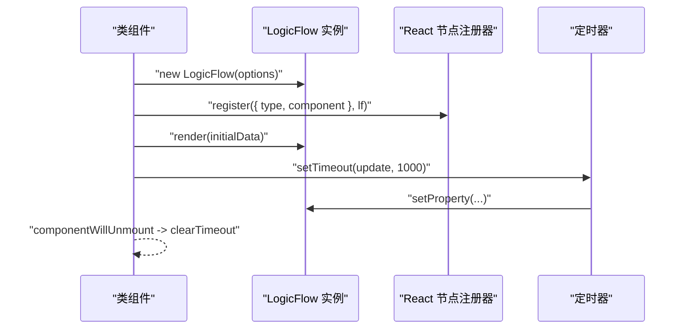
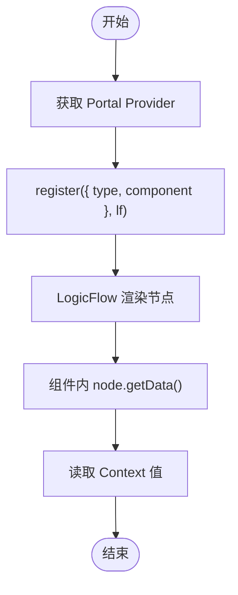
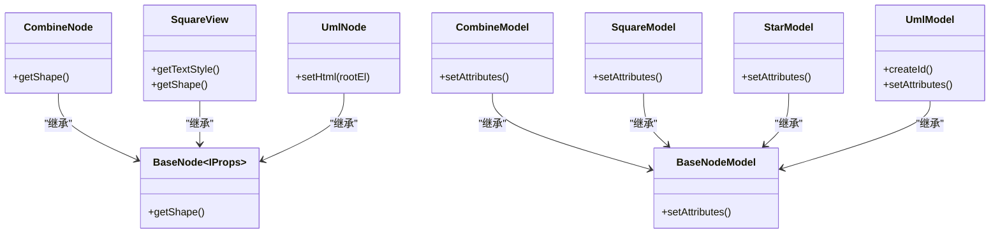
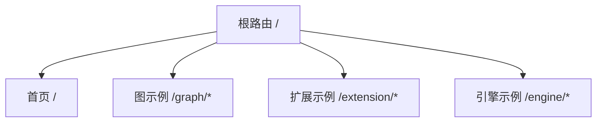
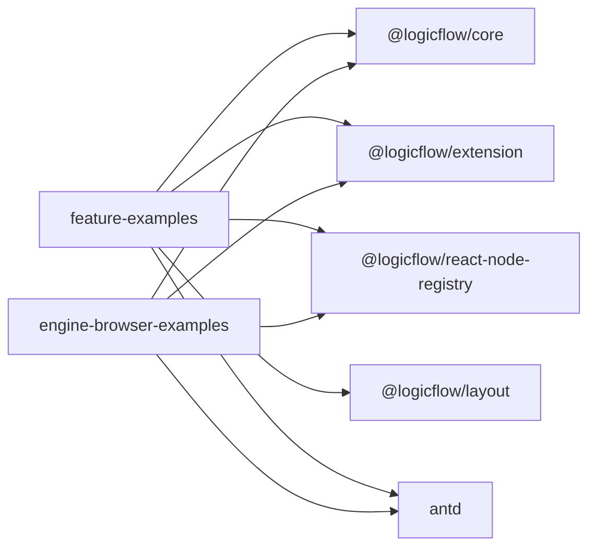

# React 集成示例

<cite>
**本文引用的文件**
- [examples/feature-examples/src/pages/react/index.tsx](file://examples/feature-examples/src/pages/react/index.tsx)
- [examples/feature-examples/src/pages/react/Portal.tsx](file://examples/feature-examples/src/pages/react/Portal.tsx)
- [examples/feature-examples/src/pages/graph/index.tsx](file://examples/feature-examples/src/pages/graph/index.tsx)
- [examples/feature-examples/src/pages/nodes/native/index.tsx](file://examples/feature-examples/src/pages/nodes/native/index.tsx)
- [examples/feature-examples/src/pages/graph/nodes/combine.ts](file://examples/feature-examples/src/pages/graph/nodes/combine.ts)
- [examples/feature-examples/src/pages/graph/nodes/square.ts](file://examples/feature-examples/src/pages/graph/nodes/square.ts)
- [examples/feature-examples/src/pages/graph/nodes/star.ts](file://examples/feature-examples/src/pages/graph/nodes/star.ts)
- [examples/feature-examples/src/pages/graph/nodes/uml.ts](file://examples/feature-examples/src/pages/graph/nodes/uml.ts)
- [examples/feature-examples/package.json](file://examples/feature-examples/package.json)
- [examples/engine-browser-examples/src/main.tsx](file://examples/engine-browser-examples/src/main.tsx)
- [examples/engine-browser-examples/package.json](file://examples/engine-browser-examples/package.json)
- [package.json](file://package.json)
</cite>

## 目录
1. [简介](#简介)
2. [项目结构](#项目结构)
3. [核心组件](#核心组件)
4. [架构总览](#架构总览)
5. [组件详解](#组件详解)
6. [依赖关系分析](#依赖关系分析)
7. [性能与虚拟 DOM 优化](#性能与虚拟-dom-优化)
8. [故障排查指南](#故障排查指南)
9. [结论](#结论)
10. [附录](#附录)

## 简介
本文件面向在 React 项目中集成 LogicFlow 的开发者，系统性讲解如何在函数组件与类组件中使用 LogicFlow，如何注册与渲染自定义 React 节点，如何结合插件（如迷你地图、菜单、选择框等）实现丰富的流程图能力，并给出浏览器端引擎的配置要点、TypeScript 支持、事件处理与性能优化建议。文档同时提供可直接定位到源码路径的参考，便于快速复用与调试。

## 项目结构
该仓库包含多个示例应用与核心包，其中与 React 集成最相关的是 examples 目录下的两个示例工程：
- feature-examples：基于 Umi 的 React 示例，涵盖函数组件、类组件、React 节点注册、插件使用、事件监听等。
- engine-browser-examples：基于 Vite 的 React 示例，演示路由组织、页面级集成与浏览器端引擎使用。

图表来源
- [examples/feature-examples/package.json](file://examples/feature-examples/package.json#L12-L22)
- [examples/engine-browser-examples/package.json](file://examples/engine-browser-examples/package.json#L12-L23)
- [package.json](file://package.json#L14-L26)

章节来源
- [examples/feature-examples/package.json](file://examples/feature-examples/package.json#L1-L29)
- [examples/engine-browser-examples/package.json](file://examples/engine-browser-examples/package.json#L1-L39)
- [package.json](file://package.json#L1-L45)

## 核心组件
- LogicFlow 引擎实例化与渲染：在函数组件与类组件中分别创建 LogicFlow 实例，挂载容器，渲染初始图数据。
- React 节点注册：通过 @logicflow/react-node-registry 将 React 组件注册为 LogicFlow 节点类型，实现“在 LogicFlow 中渲染 React 组件”。
- 插件体系：在初始化时启用 Control、DndPanel、DynamicGroup、SelectionSelect、Menu、MiniMap 等扩展插件。
- 事件系统：通过 on(...) 订阅历史、空白处拖拽、节点/边点击等事件，实现交互反馈与数据联动。
- 自定义节点：以组合节点、正方形节点、星形节点、HTML 节点为例，展示如何扩展节点视图与模型。

章节来源
- [examples/feature-examples/src/pages/graph/index.tsx](file://examples/feature-examples/src/pages/graph/index.tsx#L566-L732)
- [examples/feature-examples/src/pages/react/index.tsx](file://examples/feature-examples/src/pages/react/index.tsx#L23-L153)
- [examples/feature-examples/src/pages/react/Portal.tsx](file://examples/feature-examples/src/pages/react/Portal.tsx#L29-L159)
- [examples/feature-examples/src/pages/graph/nodes/combine.ts](file://examples/feature-examples/src/pages/graph/nodes/combine.ts#L1-L48)
- [examples/feature-examples/src/pages/graph/nodes/square.ts](file://examples/feature-examples/src/pages/graph/nodes/square.ts#L1-L76)
- [examples/feature-examples/src/pages/graph/nodes/star.ts](file://examples/feature-examples/src/pages/graph/nodes/star.ts#L1-L22)
- [examples/feature-examples/src/pages/graph/nodes/uml.ts](file://examples/feature-examples/src/pages/graph/nodes/uml.ts#L1-L63)

## 架构总览
React 层负责页面与交互，LogicFlow 负责图渲染与编辑；React 节点通过注册机制桥接到 LogicFlow 的节点系统；插件扩展图的功能边界；事件系统连接业务逻辑。

图表来源
- [examples/feature-examples/src/pages/graph/index.tsx](file://examples/feature-examples/src/pages/graph/index.tsx#L566-L732)
- [examples/feature-examples/src/pages/react/index.tsx](file://examples/feature-examples/src/pages/react/index.tsx#L23-L153)
- [examples/feature-examples/src/pages/react/Portal.tsx](file://examples/feature-examples/src/pages/react/Portal.tsx#L29-L159)

## 组件详解

### 函数组件中的 LogicFlow 集成
- 初始化与渲染
  - 在 useEffect 中创建 LogicFlow 实例，设置容器、网格、主题、背景、插件等参数。
  - 通过 register 将自定义 React 节点注册到引擎。
  - 调用 render 渲染初始图数据。
- 事件与交互
  - 订阅 history:change、blank:drop、edge:click、node:click 等事件，输出日志或联动业务。
  - 通过 getSelectElements 获取选中元素，执行批量操作（如删除、变更类型、调整属性）。
- 插件使用
  - 启用 Control、DndPanel、DynamicGroup、SelectionSelect、Menu、MiniMap 等插件。
  - 可通过 extension.miniMap.show 控制迷你地图显示。

图表来源
- [examples/feature-examples/src/pages/graph/index.tsx](file://examples/feature-examples/src/pages/graph/index.tsx#L566-L732)
- [examples/feature-examples/src/pages/graph/index.tsx](file://examples/feature-examples/src/pages/graph/index.tsx#L598-L615)

章节来源
- [examples/feature-examples/src/pages/graph/index.tsx](file://examples/feature-examples/src/pages/graph/index.tsx#L566-L800)

### 类组件中的 LogicFlow 集成
- 生命周期管理
  - 在 componentDidMount 中创建 LogicFlow 实例并渲染。
  - 在 componentWillUnmount 中清理定时器等副作用。
- React 节点注册与更新
  - 通过 register 注册自定义 React 节点。
  - 使用 node.setProperty 或 setProperties 动态更新节点属性，配合定时器实现动画式更新。
- 插件使用
  - 在构造配置中启用 MiniMap 插件，并在后续通过 extension.miniMap.show 显示。

图表来源
- [examples/feature-examples/src/pages/react/index.tsx](file://examples/feature-examples/src/pages/react/index.tsx#L23-L153)

章节来源
- [examples/feature-examples/src/pages/react/index.tsx](file://examples/feature-examples/src/pages/react/index.tsx#L23-L153)

### React 节点注册与上下文传递
- 注册 React 节点
  - 使用 register({ type, component }, lf) 将 React 组件注册为节点类型。
  - 组件接收 node 参数，可通过 node.getData() 获取节点数据与 properties。
- 上下文与 Portal
  - 通过 Portal.getProvider() 获取 Provider，将 React 节点渲染到 LogicFlow 的节点容器中。
  - 使用 React Context 在节点内部读取主题等全局状态。

图表来源
- [examples/feature-examples/src/pages/react/Portal.tsx](file://examples/feature-examples/src/pages/react/Portal.tsx#L13-L27)
- [examples/feature-examples/src/pages/react/Portal.tsx](file://examples/feature-examples/src/pages/react/Portal.tsx#L59-L65)

章节来源
- [examples/feature-examples/src/pages/react/Portal.tsx](file://examples/feature-examples/src/pages/react/Portal.tsx#L1-L159)

### 自定义节点示例
- 组合节点（combine）
  - 自定义节点视图与模型，设置锚点偏移、尺寸与样式。
- 正方形节点（square）
  - 扩展矩形节点模型，限制边规则（下一个节点必须为圆形），并自定义文本样式与图标。
- 星形节点（star）
  - 基于多边形节点模型，定义顶点坐标与填充。
- UML 节点（uml）
  - 基于 HTML 节点模型，通过 setHtml 注入自定义 HTML 结构。

图表来源
- [examples/feature-examples/src/pages/graph/nodes/combine.ts](file://examples/feature-examples/src/pages/graph/nodes/combine.ts#L8-L41)
- [examples/feature-examples/src/pages/graph/nodes/square.ts](file://examples/feature-examples/src/pages/graph/nodes/square.ts#L3-L69)
- [examples/feature-examples/src/pages/graph/nodes/star.ts](file://examples/feature-examples/src/pages/graph/nodes/star.ts#L3-L14)
- [examples/feature-examples/src/pages/graph/nodes/uml.ts](file://examples/feature-examples/src/pages/graph/nodes/uml.ts#L3-L56)

章节来源
- [examples/feature-examples/src/pages/graph/nodes/combine.ts](file://examples/feature-examples/src/pages/graph/nodes/combine.ts#L1-L48)
- [examples/feature-examples/src/pages/graph/nodes/square.ts](file://examples/feature-examples/src/pages/graph/nodes/square.ts#L1-L76)
- [examples/feature-examples/src/pages/graph/nodes/star.ts](file://examples/feature-examples/src/pages/graph/nodes/star.ts#L1-L22)
- [examples/feature-examples/src/pages/graph/nodes/uml.ts](file://examples/feature-examples/src/pages/graph/nodes/uml.ts#L1-L63)

### 浏览器端路由与页面组织
- 使用 createBrowserRouter 组织页面路由，将不同示例页面（如 graph、extension、engine）按路径映射到对应组件。
- 主入口通过 RouterProvider 渲染路由树，支持嵌套路由与错误页。

图表来源
- [examples/engine-browser-examples/src/main.tsx](file://examples/engine-browser-examples/src/main.tsx#L20-L71)

章节来源
- [examples/engine-browser-examples/src/main.tsx](file://examples/engine-browser-examples/src/main.tsx#L1-L78)

## 依赖关系分析
- 依赖声明
  - @logicflow/core：核心引擎。
  - @logicflow/extension：扩展插件集合。
  - @logicflow/react-node-registry：React 节点注册与渲染。
  - @logicflow/layout：布局算法（可选）。
  - antd：UI 组件库。
  - react/react-dom/react-router-dom：React 生态。
- 版本与工作区
  - 工作区（workspace:*）用于本地开发与联调，确保示例与核心库版本一致。

图表来源
- [examples/feature-examples/package.json](file://examples/feature-examples/package.json#L12-L22)
- [examples/engine-browser-examples/package.json](file://examples/engine-browser-examples/package.json#L12-L23)
- [package.json](file://package.json#L14-L26)

章节来源
- [examples/feature-examples/package.json](file://examples/feature-examples/package.json#L1-L29)
- [examples/engine-browser-examples/package.json](file://examples/engine-browser-examples/package.json#L1-L39)
- [package.json](file://package.json#L1-L45)

## 性能与虚拟 DOM 优化
- 仅在必要时更新节点属性
  - 使用 setProperty 或 setProperties 更新节点属性，避免全量重绘。
- 合理使用插件
  - 按需启用插件，减少不必要的计算与渲染开销。
- 事件节流与去抖
  - 对高频事件（如拖拽、缩放）进行节流/去抖处理，降低回调频率。
- 图数据分片与增量更新
  - 大规模图建议采用增量渲染与局部刷新策略，避免整图重绘。
- React 节点最小化重渲染
  - 在自定义 React 节点中，确保 props 稳定且只在必要时更新，减少子树重渲染。
- 容器尺寸与 resize
  - 在容器尺寸变化时调用 resize，避免强制重排与闪烁。

章节来源
- [examples/feature-examples/src/pages/graph/index.tsx](file://examples/feature-examples/src/pages/graph/index.tsx#L777-L800)
- [examples/feature-examples/src/pages/react/index.tsx](file://examples/feature-examples/src/pages/react/index.tsx#L121-L127)

## 故障排查指南
- 无法渲染 LogicFlow
  - 确认容器元素存在且已挂载。
  - 检查 LogicFlow 实例是否重复创建或未正确销毁。
- React 节点不显示
  - 确认已调用 register 并传入正确的 type 与 component。
  - 确认 Portal Provider 已渲染到页面中。
- 插件未生效
  - 确认在初始化时将插件加入 plugins 数组。
  - 检查插件选项（如 MiniMap 的尺寸与位置）。
- 事件未触发
  - 确认事件订阅在实例创建后执行。
  - 检查事件名拼写与回调逻辑。
- 内置节点样式异常
  - 检查样式覆盖与主题配置，确认 CSS 文件已引入。

章节来源
- [examples/feature-examples/src/pages/graph/index.tsx](file://examples/feature-examples/src/pages/graph/index.tsx#L566-L732)
- [examples/feature-examples/src/pages/react/Portal.tsx](file://examples/feature-examples/src/pages/react/Portal.tsx#L13-L159)
- [examples/feature-examples/src/pages/nodes/native/index.tsx](file://examples/feature-examples/src/pages/nodes/native/index.tsx#L1-L126)

## 结论
通过上述示例，可以在 React 中高效集成 LogicFlow，实现从基础节点到复杂自定义节点的全栈流程图能力。函数组件适合声明式与 Hooks 驱动的场景，类组件适合生命周期强耦合的场景。结合插件与事件系统，可快速构建可视化编辑器与流程设计器。建议在生产环境中关注性能优化与事件节流，并保持依赖版本一致性。

## 附录

### TypeScript 支持与类型提示
- 依赖 @types/react 与 @types/react-dom，确保在 TS 环境下获得完整的类型提示。
- 自定义节点的 props 类型可参考现有节点模型与视图的类型定义。

章节来源
- [examples/feature-examples/package.json](file://examples/feature-examples/package.json#L24-L26)
- [examples/engine-browser-examples/package.json](file://examples/engine-browser-examples/package.json#L25-L36)

### 浏览器端引擎配置要点
- 常用配置项
  - container：挂载容器。
  - grid：网格大小。
  - background：背景颜色/图片。
  - themeMode：主题风格。
  - partial：局部渲染模式。
  - keyboard.shortcuts：快捷键绑定。
  - plugins：启用的插件数组。
- 插件选项
  - Control、DndPanel、DynamicGroup、SelectionSelect、Menu、MiniMap 等插件均有独立配置项，可在初始化时传入。

章节来源
- [examples/feature-examples/src/pages/graph/index.tsx](file://examples/feature-examples/src/pages/graph/index.tsx#L50-L88)
- [examples/feature-examples/src/pages/graph/index.tsx](file://examples/feature-examples/src/pages/graph/index.tsx#L682-L710)

### 事件处理与常用操作
- 历史记录：history:change
- 空白处：blank:drop
- 节点/边点击：node:click、edge:click
- 快捷键：backspace 删除选中元素
- 动态更新：setNodeType、setProperties、clearSelectElements、deleteNode/Edge

章节来源
- [examples/feature-examples/src/pages/graph/index.tsx](file://examples/feature-examples/src/pages/graph/index.tsx#L598-L660)

### React 生态集成模式
- React Router
  - 使用 createBrowserRouter 组织页面路由，将 LogicFlow 示例拆分为独立页面。
- Redux/Pinia（可选）
  - 可将图数据与用户状态集中管理，通过事件回调同步到状态库，再由组件订阅状态更新视图。

章节来源
- [examples/engine-browser-examples/src/main.tsx](file://examples/engine-browser-examples/src/main.tsx#L20-L71)