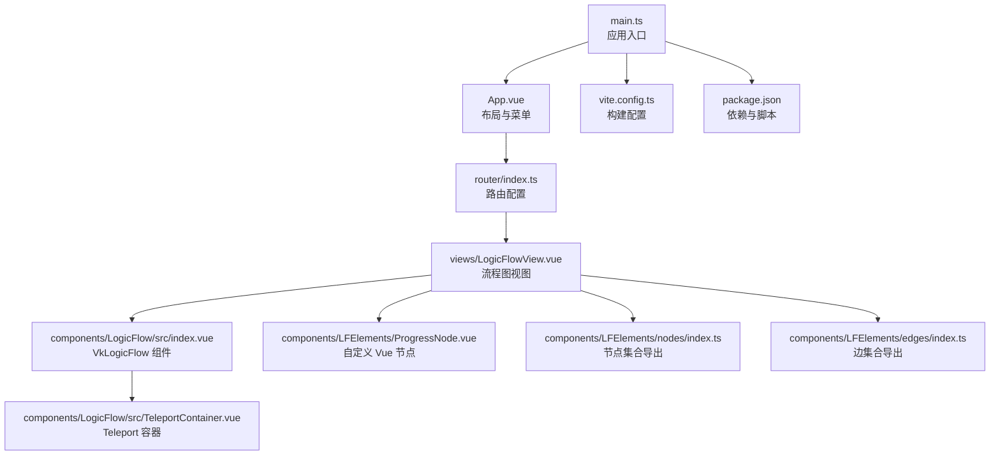
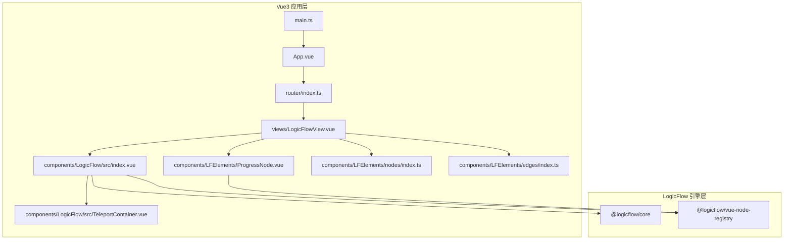
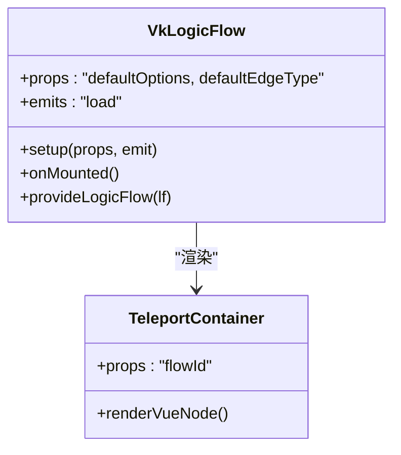
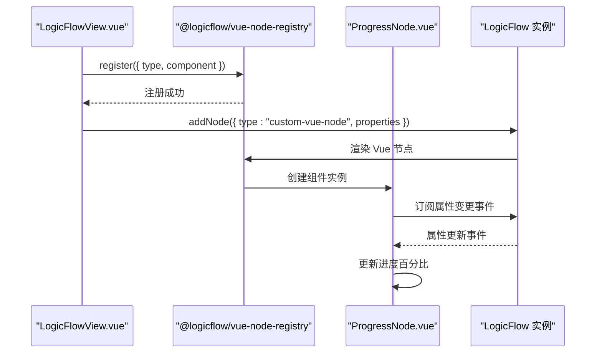
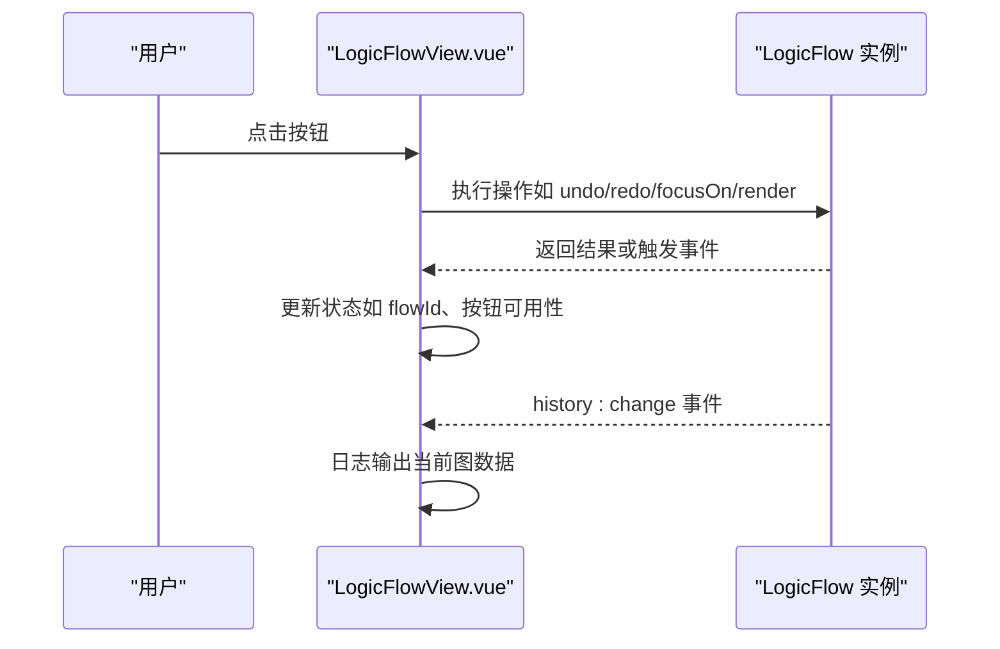
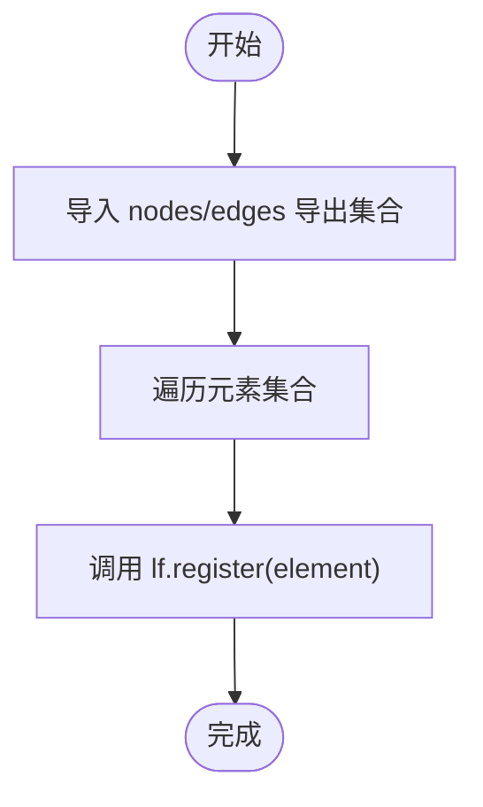
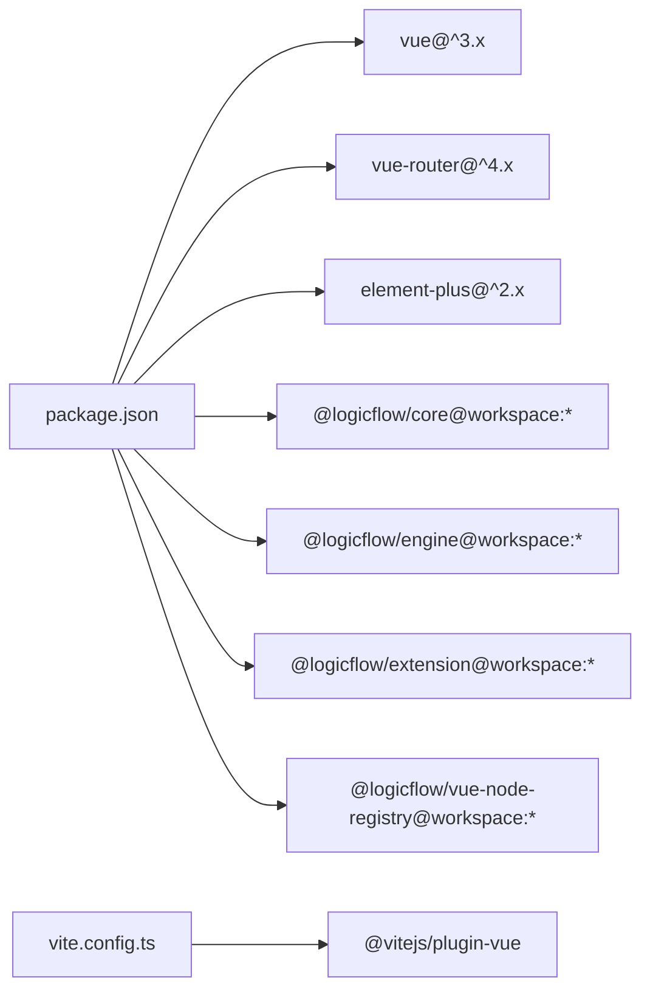

# Vue3 集成示例

<cite>
**本文引用的文件**
- [examples/vue3-app/src/main.ts](file://examples/vue3-app/src/main.ts)
- [examples/vue3-app/src/App.vue](file://examples/vue3-app/src/App.vue)
- [examples/vue3-app/package.json](file://examples/vue3-app/package.json)
- [examples/vue3-app/vite.config.ts](file://examples/vue3-app/vite.config.ts)
- [examples/vue3-app/src/router/index.ts](file://examples/vue3-app/src/router/index.ts)
- [examples/vue3-app/src/views/LogicFlowView.vue](file://examples/vue3-app/src/views/LogicFlowView.vue)
- [examples/vue3-app/src/components/LogicFlow/src/index.vue](file://examples/vue3-app/src/components/LogicFlow/src/index.vue)
- [examples/vue3-app/src/components/LogicFlow/src/TeleportContainer.vue](file://examples/vue3-app/src/components/LogicFlow/src/TeleportContainer.vue)
- [examples/vue3-app/src/components/LogicFlow/src/use.ts](file://examples/vue3-app/src/components/LogicFlow/src/use.ts)
- [examples/vue3-app/src/components/LogicFlow/src/types.ts](file://examples/vue3-app/src/components/LogicFlow/src/types.ts)
- [examples/vue3-app/src/components/LogicFlow/index.ts](file://examples/vue3-app/src/components/LogicFlow/index.ts)
- [examples/vue3-app/src/components/LFElements/ProgressNode.vue](file://examples/vue3-app/src/components/LFElements/ProgressNode.vue)
- [examples/vue3-app/src/components/LFElements/nodes/index.ts](file://examples/vue3-app/src/components/LFElements/nodes/index.ts)
- [examples/vue3-app/src/components/LFElements/edges/index.ts](file://examples/vue3-app/src/components/LFElements/edges/index.ts)
- [examples/vue3-app/src/utils/performance.ts](file://examples/vue3-app/src/utils/performance.ts)
</cite>

## 目录
1. [简介](#简介)
2. [项目结构](#项目结构)
3. [核心组件](#核心组件)
4. [架构总览](#架构总览)
5. [详细组件分析](#详细组件分析)
6. [依赖关系分析](#依赖关系分析)
7. [性能考虑](#性能考虑)
8. [故障排查指南](#故障排查指南)
9. [结论](#结论)
10. [附录](#附录)

## 简介
本文件面向希望在 Vue3 项目中集成 LogicFlow 流程图引擎的开发者，提供从零开始的完整教程与深入的技术解析。内容涵盖：
- Vue3 应用架构（组件结构、路由配置、插件与主题）
- LogicFlow 在 Vue3 中的集成方式（组件封装、生命周期管理、事件处理）
- Composition API 使用模式与最佳实践
- 主题定制、插件配置、组件注册与 Teleport 容器
- 性能优化与内存管理策略
- 实战示例路径与可直接参考的源码位置

## 项目结构
该仓库包含多个示例工程，其中与 Vue3 集成 LogicFlow 最相关的是 examples/vue3-app。其核心入口、路由、视图与组件分布如下：
- 入口与插件：main.ts 引入 Element Plus、路由与应用挂载
- 布局与导航：App.vue 提供菜单与 RouterView
- 路由：router/index.ts 定义页面路由，按需加载各视图
- 视图：LogicFlowView.vue 展示 LogicFlow 图编辑器与交互
- 组件库：components/LogicFlow 封装 LogicFlow 为可复用组件；components/LFElements 提供自定义节点与边
- 工具：utils/performance.ts 提供性能观测工具

图表来源
- [examples/vue3-app/src/main.ts](file://examples/vue3-app/src/main.ts#L1-L16)
- [examples/vue3-app/src/App.vue](file://examples/vue3-app/src/App.vue#L1-L121)
- [examples/vue3-app/src/router/index.ts](file://examples/vue3-app/src/router/index.ts#L1-L41)
- [examples/vue3-app/src/views/LogicFlowView.vue](file://examples/vue3-app/src/views/LogicFlowView.vue#L1-L537)
- [examples/vue3-app/src/components/LogicFlow/src/index.vue](file://examples/vue3-app/src/components/LogicFlow/src/index.vue#L1-L68)
- [examples/vue3-app/src/components/LogicFlow/src/TeleportContainer.vue](file://examples/vue3-app/src/components/LogicFlow/src/TeleportContainer.vue)
- [examples/vue3-app/src/components/LFElements/ProgressNode.vue](file://examples/vue3-app/src/components/LFElements/ProgressNode.vue#L1-L41)
- [examples/vue3-app/src/components/LFElements/nodes/index.ts](file://examples/vue3-app/src/components/LFElements/nodes/index.ts#L1-L14)
- [examples/vue3-app/src/components/LFElements/edges/index.ts](file://examples/vue3-app/src/components/LFElements/edges/index.ts#L1-L8)
- [examples/vue3-app/vite.config.ts](file://examples/vue3-app/vite.config.ts#L1-L15)
- [examples/vue3-app/package.json](file://examples/vue3-app/package.json#L1-L52)

章节来源
- [examples/vue3-app/src/main.ts](file://examples/vue3-app/src/main.ts#L1-L16)
- [examples/vue3-app/src/App.vue](file://examples/vue3-app/src/App.vue#L1-L121)
- [examples/vue3-app/src/router/index.ts](file://examples/vue3-app/src/router/index.ts#L1-L41)
- [examples/vue3-app/package.json](file://examples/vue3-app/package.json#L1-L52)
- [examples/vue3-app/vite.config.ts](file://examples/vue3-app/vite.config.ts#L1-L15)

## 核心组件
- 应用入口与插件
  - main.ts：创建应用实例、安装 Element Plus 与路由、挂载根组件
  - 参考路径：[examples/vue3-app/src/main.ts](file://examples/vue3-app/src/main.ts#L1-L16)
- 布局与导航
  - App.vue：侧边菜单、图标、RouterView 区域
  - 参考路径：[examples/vue3-app/src/App.vue](file://examples/vue3-app/src/App.vue#L1-L121)
- 路由配置
  - router/index.ts：定义首页与 LogicFlow 页面的懒加载路由
  - 参考路径：[examples/vue3-app/src/router/index.ts](file://examples/vue3-app/src/router/index.ts#L1-L41)
- LogicFlow 视图
  - LogicFlowView.vue：初始化 LogicFlow、注册节点/边、主题设置、事件监听、按钮操作方法
  - 参考路径：[examples/vue3-app/src/views/LogicFlowView.vue](file://examples/vue3-app/src/views/LogicFlowView.vue#L1-L537)
- 封装组件 VkLogicFlow
  - components/LogicFlow/src/index.vue：将 LogicFlow 封装为可复用组件，提供 Teleport 容器与上下文注入
  - 参考路径：[examples/vue3-app/src/components/LogicFlow/src/index.vue](file://examples/vue3-app/src/components/LogicFlow/src/index.vue#L1-L68)
- Teleport 容器
  - components/LogicFlow/src/TeleportContainer.vue：用于渲染 Vue 节点的 Teleport 容器
  - 参考路径：[examples/vue3-app/src/components/LogicFlow/src/TeleportContainer.vue](file://examples/vue3-app/src/components/LogicFlow/src/TeleportContainer.vue)
- 自定义节点 ProgressNode
  - components/LFElements/ProgressNode.vue：基于 Element Plus 的进度条节点，响应属性变化
  - 参考路径：[examples/vue3-app/src/components/LFElements/ProgressNode.vue](file://examples/vue3-app/src/components/LFElements/ProgressNode.vue#L1-L41)
- 节点/边集合导出
  - components/LFElements/nodes/index.ts、edges/index.ts：统一导出自定义节点与边配置
  - 参考路径：[examples/vue3-app/src/components/LFElements/nodes/index.ts](file://examples/vue3-app/src/components/LFElements/nodes/index.ts#L1-L14)
  - 参考路径：[examples/vue3-app/src/components/LFElements/edges/index.ts](file://examples/vue3-app/src/components/LFElements/edges/index.ts#L1-L8)
- 组件注册入口
  - components/LogicFlow/index.ts：导出组件、插件安装函数与组合式 API 工具
  - 参考路径：[examples/vue3-app/src/components/LogicFlow/index.ts](file://examples/vue3-app/src/components/LogicFlow/index.ts#L1-L12)

章节来源
- [examples/vue3-app/src/main.ts](file://examples/vue3-app/src/main.ts#L1-L16)
- [examples/vue3-app/src/App.vue](file://examples/vue3-app/src/App.vue#L1-L121)
- [examples/vue3-app/src/router/index.ts](file://examples/vue3-app/src/router/index.ts#L1-L41)
- [examples/vue3-app/src/views/LogicFlowView.vue](file://examples/vue3-app/src/views/LogicFlowView.vue#L1-L537)
- [examples/vue3-app/src/components/LogicFlow/src/index.vue](file://examples/vue3-app/src/components/LogicFlow/src/index.vue#L1-L68)
- [examples/vue3-app/src/components/LogicFlow/src/TeleportContainer.vue](file://examples/vue3-app/src/components/LogicFlow/src/TeleportContainer.vue)
- [examples/vue3-app/src/components/LFElements/ProgressNode.vue](file://examples/vue3-app/src/components/LFElements/ProgressNode.vue#L1-L41)
- [examples/vue3-app/src/components/LFElements/nodes/index.ts](file://examples/vue3-app/src/components/LFElements/nodes/index.ts#L1-L14)
- [examples/vue3-app/src/components/LFElements/edges/index.ts](file://examples/vue3-app/src/components/LFElements/edges/index.ts#L1-L8)
- [examples/vue3-app/src/components/LogicFlow/index.ts](file://examples/vue3-app/src/components/LogicFlow/index.ts#L1-L12)

## 架构总览
下图展示了 Vue3 应用与 LogicFlow 的集成架构：应用通过 main.ts 初始化，App.vue 提供导航与内容区域，LogicFlowView.vue 作为主视图承载 LogicFlow 实例；VkLogicFlow 组件负责创建容器、提供上下文并渲染 Teleport 容器；ProgressNode 等自定义节点通过 @logicflow/vue-node-registry 注册并在画布中渲染。

图表来源
- [examples/vue3-app/src/main.ts](file://examples/vue3-app/src/main.ts#L1-L16)
- [examples/vue3-app/src/App.vue](file://examples/vue3-app/src/App.vue#L1-L121)
- [examples/vue3-app/src/router/index.ts](file://examples/vue3-app/src/router/index.ts#L1-L41)
- [examples/vue3-app/src/views/LogicFlowView.vue](file://examples/vue3-app/src/views/LogicFlowView.vue#L1-L537)
- [examples/vue3-app/src/components/LogicFlow/src/index.vue](file://examples/vue3-app/src/components/LogicFlow/src/index.vue#L1-L68)
- [examples/vue3-app/src/components/LogicFlow/src/TeleportContainer.vue](file://examples/vue3-app/src/components/LogicFlow/src/TeleportContainer.vue)
- [examples/vue3-app/src/components/LFElements/ProgressNode.vue](file://examples/vue3-app/src/components/LFElements/ProgressNode.vue#L1-L41)
- [examples/vue3-app/src/components/LFElements/nodes/index.ts](file://examples/vue3-app/src/components/LFElements/nodes/index.ts#L1-L14)
- [examples/vue3-app/src/components/LFElements/edges/index.ts](file://examples/vue3-app/src/components/LFElements/edges/index.ts#L1-L8)

## 详细组件分析

### 组件封装：VkLogicFlow
VkLogicFlow 将 LogicFlow 封装为可复用组件，职责包括：
- 创建容器并初始化 LogicFlow 实例
- 通过 provide/inject 提供 LogicFlow 实例给子节点
- 渲染 Teleport 容器以支持 Vue 节点
- 对外暴露 load 事件与默认配置透传

图表来源
- [examples/vue3-app/src/components/LogicFlow/src/index.vue](file://examples/vue3-app/src/components/LogicFlow/src/index.vue#L1-L68)
- [examples/vue3-app/src/components/LogicFlow/src/TeleportContainer.vue](file://examples/vue3-app/src/components/LogicFlow/src/TeleportContainer.vue)

章节来源
- [examples/vue3-app/src/components/LogicFlow/src/index.vue](file://examples/vue3-app/src/components/LogicFlow/src/index.vue#L1-L68)
- [examples/vue3-app/src/components/LogicFlow/src/TeleportContainer.vue](file://examples/vue3-app/src/components/LogicFlow/src/TeleportContainer.vue)

### 自定义节点：ProgressNode
ProgressNode 是一个基于 Element Plus 的进度条节点，通过 @logicflow/vue-node-registry 注册后可在 LogicFlow 画布中渲染。它监听节点属性变化事件，动态更新进度值。

图表来源
- [examples/vue3-app/src/views/LogicFlowView.vue](file://examples/vue3-app/src/views/LogicFlowView.vue#L1-L537)
- [examples/vue3-app/src/components/LFElements/ProgressNode.vue](file://examples/vue3-app/src/components/LFElements/ProgressNode.vue#L1-L41)

章节来源
- [examples/vue3-app/src/views/LogicFlowView.vue](file://examples/vue3-app/src/views/LogicFlowView.vue#L1-L537)
- [examples/vue3-app/src/components/LFElements/ProgressNode.vue](file://examples/vue3-app/src/components/LFElements/ProgressNode.vue#L1-L41)

### 事件处理与交互流程
LogicFlowView.vue 展示了典型的事件绑定与交互流程：初始化 LogicFlow、注册元素、设置主题、监听历史变更、执行节点/边操作、触发拖拽添加节点等。

图表来源
- [examples/vue3-app/src/views/LogicFlowView.vue](file://examples/vue3-app/src/views/LogicFlowView.vue#L1-L537)

章节来源
- [examples/vue3-app/src/views/LogicFlowView.vue](file://examples/vue3-app/src/views/LogicFlowView.vue#L1-L537)

### 节点与边的注册与导出
- 节点与边通过 nodes/index.ts 与 edges/index.ts 统一导出，便于集中注册
- LogicFlowView.vue 中调用 registerElements 方法批量注册

图表来源
- [examples/vue3-app/src/views/LogicFlowView.vue](file://examples/vue3-app/src/views/LogicFlowView.vue#L1-L537)
- [examples/vue3-app/src/components/LFElements/nodes/index.ts](file://examples/vue3-app/src/components/LFElements/nodes/index.ts#L1-L14)
- [examples/vue3-app/src/components/LFElements/edges/index.ts](file://examples/vue3-app/src/components/LFElements/edges/index.ts#L1-L8)

章节来源
- [examples/vue3-app/src/views/LogicFlowView.vue](file://examples/vue3-app/src/views/LogicFlowView.vue#L1-L537)
- [examples/vue3-app/src/components/LFElements/nodes/index.ts](file://examples/vue3-app/src/components/LFElements/nodes/index.ts#L1-L14)
- [examples/vue3-app/src/components/LFElements/edges/index.ts](file://examples/vue3-app/src/components/LFElements/edges/index.ts#L1-L8)

### 组合式 API 使用模式与最佳实践
- 生命周期：在 onMounted 中初始化 LogicFlow，确保 DOM 可用
- 响应式：使用 ref 保存实例与容器，computed/watchEffect 处理配置变更
- 事件：通过 lf.on 监听图事件，避免在模板中直接绑定复杂逻辑
- 注入：通过 provide/inject 在组件树间共享 LogicFlow 实例
- 参考路径：
  - [examples/vue3-app/src/views/LogicFlowView.vue](file://examples/vue3-app/src/views/LogicFlowView.vue#L1-L537)
  - [examples/vue3-app/src/components/LogicFlow/src/index.vue](file://examples/vue3-app/src/components/LogicFlow/src/index.vue#L1-L68)
  - [examples/vue3-app/src/components/LogicFlow/src/use.ts](file://examples/vue3-app/src/components/LogicFlow/src/use.ts)

章节来源
- [examples/vue3-app/src/views/LogicFlowView.vue](file://examples/vue3-app/src/views/LogicFlowView.vue#L1-L537)
- [examples/vue3-app/src/components/LogicFlow/src/index.vue](file://examples/vue3-app/src/components/LogicFlow/src/index.vue#L1-L68)

## 依赖关系分析
- 依赖管理：package.json 中声明 Vue3、LogicFlow 生态包、Element Plus、路由等
- 构建配置：vite.config.ts 使用 @vitejs/plugin-vue，注释提示了 devtools 的潜在内存问题
- 路由懒加载：router/index.ts 对 LogicFlowView 等页面采用动态导入，减少首屏体积

图表来源
- [examples/vue3-app/package.json](file://examples/vue3-app/package.json#L1-L52)
- [examples/vue3-app/vite.config.ts](file://examples/vue3-app/vite.config.ts#L1-L15)

章节来源
- [examples/vue3-app/package.json](file://examples/vue3-app/package.json#L1-L52)
- [examples/vue3-app/vite.config.ts](file://examples/vue3-app/vite.config.ts#L1-L15)
- [examples/vue3-app/src/router/index.ts](file://examples/vue3-app/src/router/index.ts#L1-L41)

## 性能考虑
- DOM 数量监控：utils/performance.ts 提供 DOM 节点总数统计与长任务观察，便于定位性能瓶颈
- 长任务检测：通过 PerformanceObserver 与 requestIdleCallback 捕获耗时任务
- 构建与调试：vite.config.ts 注释提醒 devtools 可能导致内存增长，建议在性能测试时关闭
- 建议实践：
  - 合理拆分路由视图，按需加载
  - 控制节点数量与复杂度，必要时启用虚拟化或分页
  - 避免在事件回调中进行重型计算，使用节流/防抖
  - 使用 Teleport 减少不必要的 DOM 嵌套

章节来源
- [examples/vue3-app/src/utils/performance.ts](file://examples/vue3-app/src/utils/performance.ts#L1-L28)
- [examples/vue3-app/vite.config.ts](file://examples/vue3-app/vite.config.ts#L1-L15)

## 故障排查指南
- 内存泄漏与 Devtools：vite.config.ts 注释指出 devtools 会将所有 Vue 节点记录在全局变量上，可能导致内存溢出。建议在性能测试阶段禁用或移除该插件。
- Teleport 容器未渲染：确认 VkLogicFlow 组件已提供 ready 状态并在模板中条件渲染 TeleportContainer。
- 自定义节点不显示：检查是否正确调用 register 注册 Vue 节点，以及节点类型与 properties 是否匹配。
- 事件未触发：确认事件监听在 LogicFlow 实例初始化后注册，并且事件名拼写正确。
- 路由懒加载失败：检查 router/index.ts 中的动态导入路径与文件是否存在。

章节来源
- [examples/vue3-app/vite.config.ts](file://examples/vue3-app/vite.config.ts#L1-L15)
- [examples/vue3-app/src/components/LogicFlow/src/index.vue](file://examples/vue3-app/src/components/LogicFlow/src/index.vue#L1-L68)
- [examples/vue3-app/src/views/LogicFlowView.vue](file://examples/vue3-app/src/views/LogicFlowView.vue#L1-L537)
- [examples/vue3-app/src/router/index.ts](file://examples/vue3-app/src/router/index.ts#L1-L41)

## 结论
通过本项目示例，可以系统地掌握在 Vue3 中集成 LogicFlow 的完整流程：从应用初始化、路由与布局，到 LogicFlow 组件封装、自定义节点与边注册、主题与事件处理，再到性能优化与内存管理。推荐开发者优先参考以下文件路径快速上手并扩展业务场景。

## 附录
- 快速开始步骤（基于仓库现有文件）：
  1) 安装依赖：使用包管理器安装项目依赖
     - 参考路径：[examples/vue3-app/package.json](file://examples/vue3-app/package.json#L1-L52)
  2) 启动开发服务器：运行 dev 脚本
     - 参考路径：[examples/vue3-app/package.json](file://examples/vue3-app/package.json#L6-L14)
  3) 访问应用：打开浏览器访问首页与 LogicFlow 页面
     - 参考路径：[examples/vue3-app/src/router/index.ts](file://examples/vue3-app/src/router/index.ts#L1-L41)
  4) 查看集成示例：LogicFlowView.vue 展示了完整的初始化、注册、事件与操作
     - 参考路径：[examples/vue3-app/src/views/LogicFlowView.vue](file://examples/vue3-app/src/views/LogicFlowView.vue#L1-L537)
  5) 自定义节点：ProgressNode.vue 与 nodes/edges 导出文件演示了扩展方式
     - 参考路径：[examples/vue3-app/src/components/LFElements/ProgressNode.vue](file://examples/vue3-app/src/components/LFElements/ProgressNode.vue#L1-L41)
     - 参考路径：[examples/vue3-app/src/components/LFElements/nodes/index.ts](file://examples/vue3-app/src/components/LFElements/nodes/index.ts#L1-L14)
     - 参考路径：[examples/vue3-app/src/components/LFElements/edges/index.ts](file://examples/vue3-app/src/components/LFElements/edges/index.ts#L1-L8)
  6) 组件封装：VkLogicFlow 提供可复用的 LogicFlow 容器与 Teleport 容器
     - 参考路径：[examples/vue3-app/src/components/LogicFlow/src/index.vue](file://examples/vue3-app/src/components/LogicFlow/src/index.vue#L1-L68)
     - 参考路径：[examples/vue3-app/src/components/LogicFlow/src/TeleportContainer.vue](file://examples/vue3-app/src/components/LogicFlow/src/TeleportContainer.vue)
  7) 性能与内存：使用 utils/performance.ts 与构建配置中的注释指导
     - 参考路径：[examples/vue3-app/src/utils/performance.ts](file://examples/vue3-app/src/utils/performance.ts#L1-L28)
     - 参考路径：[examples/vue3-app/vite.config.ts](file://examples/vue3-app/vite.config.ts#L1-L15)