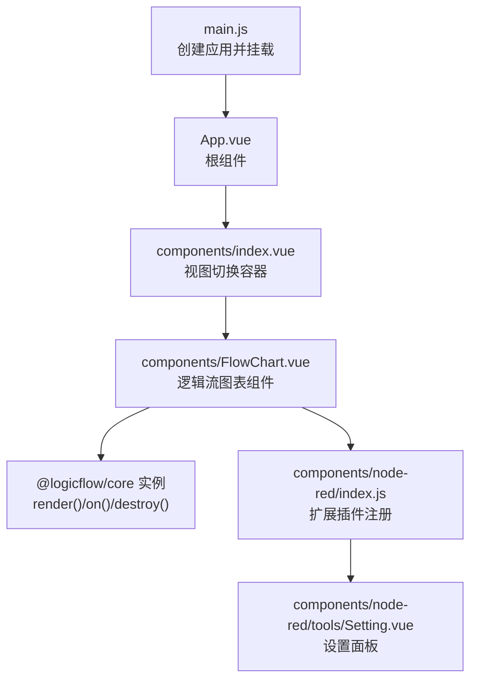
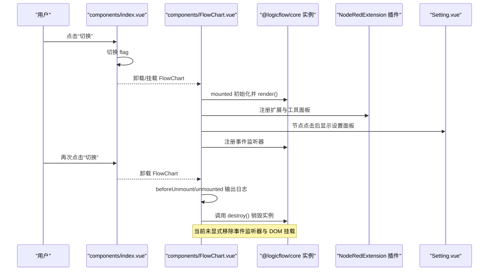
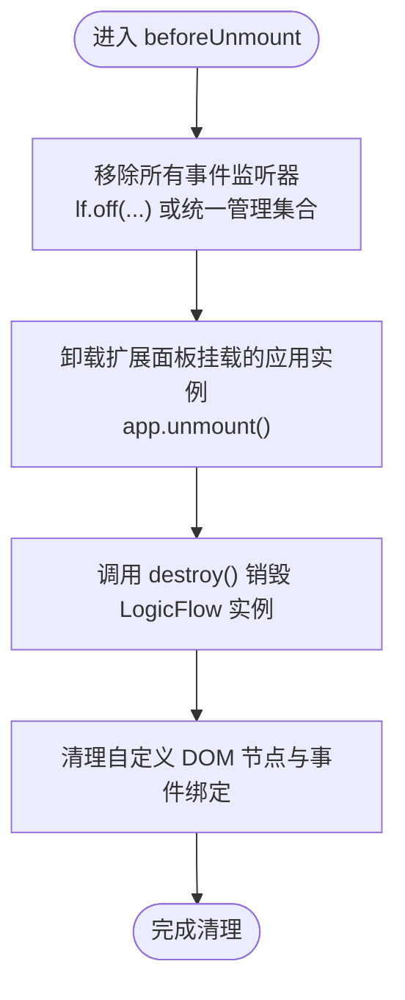
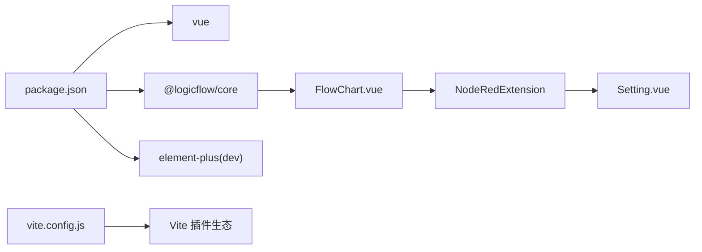

# 内存泄漏演示

<cite>
**本文引用的文件**
- [examples/vue3-memory-leak/src/App.vue](file://examples/vue3-memory-leak/src/App.vue)
- [examples/vue3-memory-leak/src/main.js](file://examples/vue3-memory-leak/src/main.js)
- [examples/vue3-memory-leak/src/components/FlowChart.vue](file://examples/vue3-memory-leak/src/components/FlowChart.vue)
- [examples/vue3-memory-leak/src/components/index.vue](file://examples/vue3-memory-leak/src/components/index.vue)
- [examples/vue3-memory-leak/src/components/node-red/index.js](file://examples/vue3-memory-leak/src/components/node-red/index.js)
- [examples/vue3-memory-leak/src/components/node-red/tools/Setting.vue](file://examples/vue3-memory-leak/src/components/node-red/tools/Setting.vue)
- [examples/vue3-memory-leak/package.json](file://examples/vue3-memory-leak/package.json)
- [examples/vue3-memory-leak/vite.config.js](file://examples/vue3-memory-leak/vite.config.js)
</cite>

## 目录
1. [引言](#引言)
2. [项目结构](#项目结构)
3. [核心组件](#核心组件)
4. [架构总览](#架构总览)
5. [详细组件分析](#详细组件分析)
6. [依赖关系分析](#依赖关系分析)
7. [性能考量](#性能考量)
8. [故障排查指南](#故障排查指南)
9. [结论](#结论)
10. [附录：常见内存泄漏场景与修复清单](#附录常见内存泄漏场景与修复清单)

## 引言
本文件围绕 Vue3 应用中的内存泄漏问题展开，结合仓库内的“内存泄漏演示”示例工程，系统讲解以下主题：
- 常见内存泄漏场景：组件未正确销毁、事件监听器未移除、定时器未清理、DOM/第三方实例未释放等
- Vue3 生命周期钩子与资源清理最佳实践
- 响应式系统对内存的影响与优化策略
- 浏览器开发者工具的内存分析技巧
- 性能监控与内存泄漏检测的落地方法
- 面向大型应用的预防与修复清单

该示例工程通过切换视图（显示/隐藏 FlowChart）演示组件卸载与销毁流程，是理解内存泄漏与生命周期管理的极佳入口。

## 项目结构
该示例工程位于 examples/vue3-memory-leak，采用 Vite + Vue3 单页应用结构：
- 入口与挂载：main.js 创建应用并挂载到 DOM
- 根组件：App.vue 渲染子视图
- 视图切换：components/index.vue 控制是否渲染 FlowChart
- 流程图组件：components/FlowChart.vue 使用 @logicflow/core 初始化并渲染逻辑流，同时注册事件监听
- 扩展插件：components/node-red/index.js 注册节点类型与工具面板
- 设置面板：components/node-red/tools/Setting.vue 作为弹层设置面板

图表来源
- [examples/vue3-memory-leak/src/main.js](file://examples/vue3-memory-leak/src/main.js#L1-L11)
- [examples/vue3-memory-leak/src/App.vue](file://examples/vue3-memory-leak/src/App.vue#L1-L10)
- [examples/vue3-memory-leak/src/components/index.vue](file://examples/vue3-memory-leak/src/components/index.vue#L1-L21)
- [examples/vue3-memory-leak/src/components/FlowChart.vue](file://examples/vue3-memory-leak/src/components/FlowChart.vue#L1-L225)
- [examples/vue3-memory-leak/src/components/node-red/index.js](file://examples/vue3-memory-leak/src/components/node-red/index.js#L1-L35)
- [examples/vue3-memory-leak/src/components/node-red/tools/Setting.vue](file://examples/vue3-memory-leak/src/components/node-red/tools/Setting.vue#L1-L82)

章节来源
- [examples/vue3-memory-leak/src/main.js](file://examples/vue3-memory-leak/src/main.js#L1-L11)
- [examples/vue3-memory-leak/src/App.vue](file://examples/vue3-memory-leak/src/App.vue#L1-L10)
- [examples/vue3-memory-leak/src/components/index.vue](file://examples/vue3-memory-leak/src/components/index.vue#L1-L21)
- [examples/vue3-memory-leak/src/components/FlowChart.vue](file://examples/vue3-memory-leak/src/components/FlowChart.vue#L1-L225)
- [examples/vue3-memory-leak/src/components/node-red/index.js](file://examples/vue3-memory-leak/src/components/node-red/index.js#L1-L35)
- [examples/vue3-memory-leak/src/components/node-red/tools/Setting.vue](file://examples/vue3-memory-leak/src/components/node-red/tools/Setting.vue#L1-L82)

## 核心组件
- 应用入口与挂载
  - 使用 createApp 创建应用，挂载到 #app 容器
  - 章节来源
    - [examples/vue3-memory-leak/src/main.js](file://examples/vue3-memory-leak/src/main.js#L1-L11)

- 根组件
  - 渲染 FlowChart 子视图
  - 章节来源
    - [examples/vue3-memory-leak/src/App.vue](file://examples/vue3-memory-leak/src/App.vue#L1-L10)

- 视图切换容器
  - 通过 flag 控制是否渲染空容器或 FlowChart 组件
  - 点击按钮切换 flag，触发组件的挂载/卸载
  - 章节来源
    - [examples/vue3-memory-leak/src/components/index.vue](file://examples/vue3-memory-leak/src/components/index.vue#L1-L21)

- 流程图组件（内存泄漏演示重点）
  - mounted 中初始化 LogicFlow 实例并渲染数据
  - 注册多个事件监听器（如 node-red:start、vue-node:click、node:click、blank:click）
  - beforeUnmount/unmounted 中输出日志，并调用 destroy() 销毁实例
  - 注意：当前实现仅销毁 LogicFlow 实例，未显式移除事件监听器与 DOM 挂载
  - 章节来源
    - [examples/vue3-memory-leak/src/components/FlowChart.vue](file://examples/vue3-memory-leak/src/components/FlowChart.vue#L1-L225)

- 扩展插件与设置面板
  - NodeRedExtension 注册多种节点类型与默认边类型，并在 overlay 上挂载 Palette 工具面板
  - Setting.vue 作为设置面板组件，随节点选中而显示
  - 章节来源
    - [examples/vue3-memory-leak/src/components/node-red/index.js](file://examples/vue3-memory-leak/src/components/node-red/index.js#L1-L35)
    - [examples/vue3-memory-leak/src/components/node-red/tools/Setting.vue](file://examples/vue3-memory-leak/src/components/node-red/tools/Setting.vue#L1-L82)

## 架构总览
下图展示了从用户交互到组件生命周期与第三方实例的交互路径，以及潜在的内存泄漏风险点。

图表来源
- [examples/vue3-memory-leak/src/components/index.vue](file://examples/vue3-memory-leak/src/components/index.vue#L1-L21)
- [examples/vue3-memory-leak/src/components/FlowChart.vue](file://examples/vue3-memory-leak/src/components/FlowChart.vue#L1-L225)
- [examples/vue3-memory-leak/src/components/node-red/index.js](file://examples/vue3-memory-leak/src/components/node-red/index.js#L1-L35)
- [examples/vue3-memory-leak/src/components/node-red/tools/Setting.vue](file://examples/vue3-memory-leak/src/components/node-red/tools/Setting.vue#L1-L82)

## 详细组件分析

### FlowChart 组件：生命周期与资源清理
- 初始化与渲染
  - mounted 中创建 LogicFlow 实例并 render，注册网格、键盘、插件等配置
  - 注册多类事件监听器，用于流程启动、节点点击、空白点击等
  - 章节来源
    - [examples/vue3-memory-leak/src/components/FlowChart.vue](file://examples/vue3-memory-leak/src/components/FlowChart.vue#L18-L172)

- 生命周期钩子
  - beforeUnmount/unmounted 输出日志，便于观察卸载时机
  - 在 unmounted 中调用 destroy() 销毁实例，释放内部状态与事件队列
  - 章节来源
    - [examples/vue3-memory-leak/src/components/FlowChart.vue](file://examples/vue3-memory-leak/src/components/FlowChart.vue#L166-L172)

- 事件监听器与 DOM 挂载
  - 通过 lf.on 注册的监听器需在组件卸载时显式移除，否则会形成闭包引用导致内存泄漏
  - NodeRedExtension 在 overlay 上 mount 了一个 Vue 应用，卸载 FlowChart 时也应考虑移除此挂载节点
  - 章节来源
    - [examples/vue3-memory-leak/src/components/FlowChart.vue](file://examples/vue3-memory-leak/src/components/FlowChart.vue#L147-L161)
    - [examples/vue3-memory-leak/src/components/node-red/index.js](file://examples/vue3-memory-leak/src/components/node-red/index.js#L22-L31)

- 修复建议（基于现有实现）
  - 在 beforeUnmount 中移除所有通过 lf.on 注册的监听器
  - 在 beforeUnmount 中卸载 NodeRedExtension 挂载的 Vue 应用实例
  - 在 beforeUnmount 中清理自定义 DOM 节点与事件绑定
  - 章节来源
    - [examples/vue3-memory-leak/src/components/FlowChart.vue](file://examples/vue3-memory-leak/src/components/FlowChart.vue#L166-L172)
    - [examples/vue3-memory-leak/src/components/node-red/index.js](file://examples/vue3-memory-leak/src/components/node-red/index.js#L22-L31)

图表来源
- [examples/vue3-memory-leak/src/components/FlowChart.vue](file://examples/vue3-memory-leak/src/components/FlowChart.vue#L166-L172)
- [examples/vue3-memory-leak/src/components/node-red/index.js](file://examples/vue3-memory-leak/src/components/node-red/index.js#L22-L31)

### 视图切换容器：组件挂载/卸载的触发点
- 通过 flag 控制是否渲染 FlowChart，从而触发其 mounted/beforeUnmount/unmounted 生命周期
- 适合用于验证组件卸载时的资源清理是否生效
- 章节来源
  - [examples/vue3-memory-leak/src/components/index.vue](file://examples/vue3-memory-leak/src/components/index.vue#L1-L21)

### 扩展插件与设置面板：额外的内存风险点
- NodeRedExtension 在 overlay 上创建并挂载了一个 Vue 应用，若未在组件卸载时卸载该应用，会导致残留实例与 DOM
- Setting.vue 作为弹层组件，若未在合适时机销毁，也会造成内存泄漏
- 章节来源
  - [examples/vue3-memory-leak/src/components/node-red/index.js](file://examples/vue3-memory-leak/src/components/node-red/index.js#L1-L35)
  - [examples/vue3-memory-leak/src/components/node-red/tools/Setting.vue](file://examples/vue3-memory-leak/src/components/node-red/tools/Setting.vue#L1-L82)

## 依赖关系分析
- 依赖项
  - @logicflow/core：逻辑流核心库，负责渲染与交互
  - element-plus：UI 组件库（示例工程中未启用）
  - vue：框架基础
- 开发依赖
  - vite、@vitejs/plugin-vue、unplugin-auto-import、unplugin-vue-components
- 章节来源
  - [examples/vue3-memory-leak/package.json](file://examples/vue3-memory-leak/package.json#L1-L24)
  - [examples/vue3-memory-leak/vite.config.js](file://examples/vue3-memory-leak/vite.config.js#L1-L26)

图表来源
- [examples/vue3-memory-leak/package.json](file://examples/vue3-memory-leak/package.json#L1-L24)
- [examples/vue3-memory-leak/vite.config.js](file://examples/vue3-memory-leak/vite.config.js#L1-L26)
- [examples/vue3-memory-leak/src/components/FlowChart.vue](file://examples/vue3-memory-leak/src/components/FlowChart.vue#L1-L225)
- [examples/vue3-memory-leak/src/components/node-red/index.js](file://examples/vue3-memory-leak/src/components/node-red/index.js#L1-L35)
- [examples/vue3-memory-leak/src/components/node-red/tools/Setting.vue](file://examples/vue3-memory-leak/src/components/node-red/tools/Setting.vue#L1-L82)

## 性能考量
- 响应式系统与内存
  - Vue3 的响应式系统通过 Proxy/Reactive 管理状态，合理拆分响应式对象、避免深层嵌套与循环引用可降低内存占用
  - 在 FlowChart 中，count/currentNode 等响应式变量体量较小，影响有限；但事件监听器与 DOM 引用链可能成为主要内存压力源
- 事件监听器与定时器
  - 事件监听器需成对移除；定时器需在 beforeUnmount 中清理
- 第三方实例与 DOM
  - LogicFlow 实例与扩展面板挂载的 Vue 应用均需在组件卸载时彻底销毁
- 章节来源
  - [examples/vue3-memory-leak/src/components/FlowChart.vue](file://examples/vue3-memory-leak/src/components/FlowChart.vue#L10-L17)
  - [examples/vue3-memory-leak/src/components/FlowChart.vue](file://examples/vue3-memory-leak/src/components/FlowChart.vue#L147-L172)
  - [examples/vue3-memory-leak/src/components/node-red/index.js](file://examples/vue3-memory-leak/src/components/node-red/index.js#L22-L31)

## 故障排查指南
- 使用浏览器开发者工具进行内存分析
  - 堆快照对比：在执行关键操作前后分别拍快照，比较对象数量与大小变化
  - 监听器与闭包：关注未被回收的监听器与闭包引用
  - DOM 泄漏：检查是否存在未移除的事件绑定与自定义节点
- 关键步骤
  - 在 beforeUnmount 中集中移除事件监听器与定时器
  - 在 beforeUnmount 中卸载扩展面板挂载的应用实例
  - 在 beforeUnmount 中清理自定义 DOM 节点与事件绑定
  - 验证 destroy() 是否被调用且无异常
- 章节来源
  - [examples/vue3-memory-leak/src/components/FlowChart.vue](file://examples/vue3-memory-leak/src/components/FlowChart.vue#L166-L172)
  - [examples/vue3-memory-leak/src/components/node-red/index.js](file://examples/vue3-memory-leak/src/components/node-red/index.js#L22-L31)

## 结论
- FlowChart 组件已具备销毁 LogicFlow 实例的基础，但在事件监听器与扩展面板挂载实例的清理上存在遗漏，容易导致内存泄漏
- 通过 beforeUnmount 集中清理、统一管理监听器与 DOM，可显著降低内存泄漏风险
- 将内存泄漏检测纳入 CI/CD 的回归测试，配合堆快照与监听器检查，可有效保障大型应用的稳定性

## 附录：常见内存泄漏场景与修复清单
- 组件未正确销毁
  - 现象：切换视图后内存不降反升
  - 修复：在 beforeUnmount 中移除所有事件监听器、清理定时器、销毁第三方实例、卸载扩展面板挂载的应用实例
  - 章节来源
    - [examples/vue3-memory-leak/src/components/FlowChart.vue](file://examples/vue3-memory-leak/src/components/FlowChart.vue#L166-L172)
    - [examples/vue3-memory-leak/src/components/node-red/index.js](file://examples/vue3-memory-leak/src/components/node-red/index.js#L22-L31)

- 事件监听器未移除
  - 现象：多次切换视图后，事件回调仍被触发
  - 修复：记录监听器引用，在 beforeUnmount 中统一移除
  - 章节来源
    - [examples/vue3-memory-leak/src/components/FlowChart.vue](file://examples/vue3-memory-leak/src/components/FlowChart.vue#L147-L161)

- 定时器未清理
  - 现象：组件卸载后仍继续执行定时任务
  - 修复：在 beforeUnmount 中清理所有定时器
  - 章节来源
    - [examples/vue3-memory-leak/src/components/FlowChart.vue](file://examples/vue3-memory-leak/src/components/FlowChart.vue#L166-L172)

- DOM/第三方实例未释放
  - 现象：DOM 节点与第三方实例残留
  - 修复：在 beforeUnmount 中移除自定义 DOM 节点与事件绑定；确保 destroy() 被调用
  - 章节来源
    - [examples/vue3-memory-leak/src/components/FlowChart.vue](file://examples/vue3-memory-leak/src/components/FlowChart.vue#L166-L172)

- 响应式系统对内存的影响与优化
  - 合理拆分响应式对象，避免深层嵌套与循环引用
  - 对大对象使用浅响应或按需响应化
  - 章节来源
    - [examples/vue3-memory-leak/src/components/FlowChart.vue](file://examples/vue3-memory-leak/src/components/FlowChart.vue#L10-L17)

- 性能监控与内存泄漏检测最佳实践
  - 堆快照对比、监听器检查、DOM 泄漏排查
  - 将内存检测纳入自动化测试流程
  - 章节来源
    - [examples/vue3-memory-leak/src/components/FlowChart.vue](file://examples/vue3-memory-leak/src/components/FlowChart.vue#L166-L172)