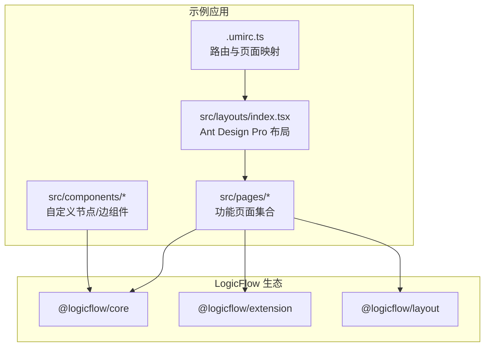
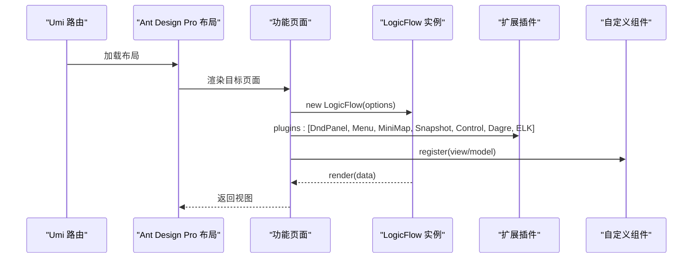
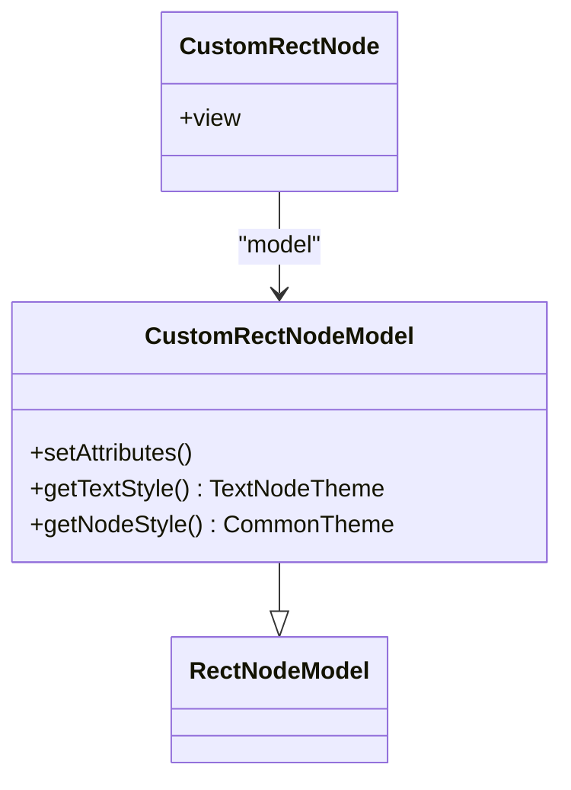
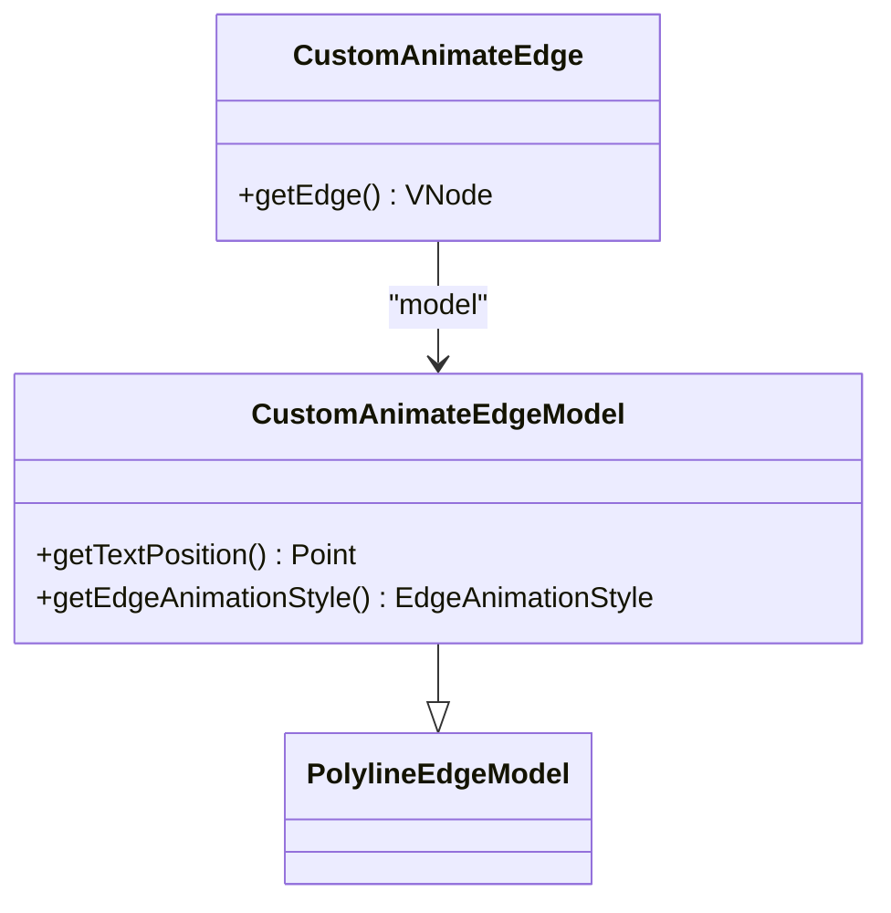
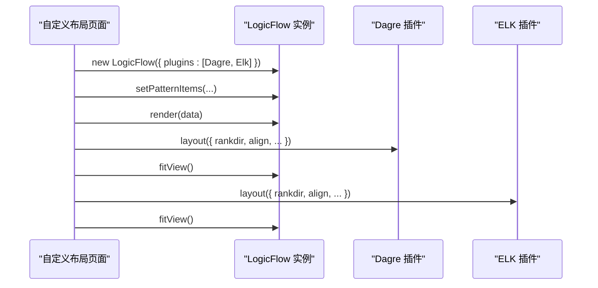
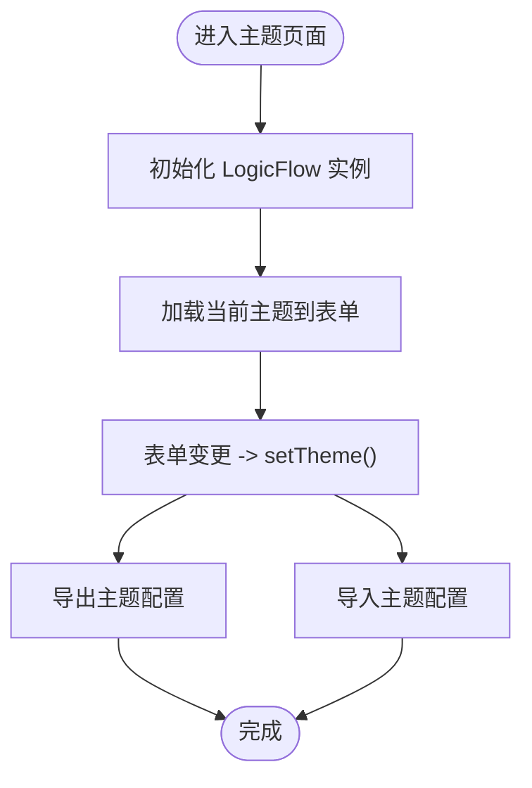
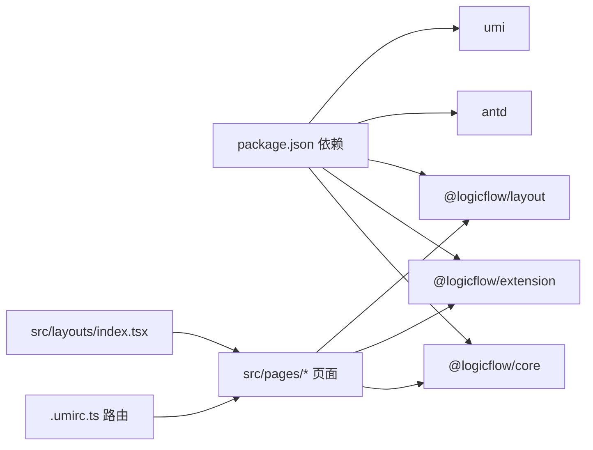

# 功能演示示例

<cite>
**本文引用的文件**
- [examples/feature-examples/package.json](file://examples/feature-examples/package.json)
- [examples/feature-examples/.umirc.ts](file://examples/feature-examples/.umirc.ts)
- [examples/feature-examples/src/layouts/index.tsx](file://examples/feature-examples/src/layouts/index.tsx)
- [examples/feature-examples/src/pages/extensions/dnd-panel/index.tsx](file://examples/feature-examples/src/pages/extensions/dnd-panel/index.tsx)
- [examples/feature-examples/src/pages/extensions/menu/index.tsx](file://examples/feature-examples/src/pages/extensions/menu/index.tsx)
- [examples/feature-examples/src/pages/extensions/mini-map/index.tsx](file://examples/feature-examples/src/pages/extensions/mini-map/index.tsx)
- [examples/feature-examples/src/pages/theme/index.tsx](file://examples/feature-examples/src/pages/theme/index.tsx)
- [examples/feature-examples/src/pages/theme/config.ts](file://examples/feature-examples/src/pages/theme/config.ts)
- [examples/feature-examples/src/pages/theme/shared-theme.tsx](file://examples/feature-examples/src/pages/theme/shared-theme.tsx)
- [examples/feature-examples/src/pages/layout/custom/index.tsx](file://examples/feature-examples/src/pages/layout/custom/index.tsx)
- [examples/feature-examples/src/pages/nodes/custom/rect/index.tsx](file://examples/feature-examples/src/pages/nodes/custom/rect/index.tsx)
- [examples/feature-examples/src/components/nodes/custom-rect/index.tsx](file://examples/feature-examples/src/components/nodes/custom-rect/index.tsx)
- [examples/feature-examples/src/pages/edges/custom/animate-polyline/index.tsx](file://examples/feature-examples/src/pages/edges/custom/animate-polyline/index.tsx)
- [examples/feature-examples/src/components/edges/custom-animate-polyline/index.tsx](file://examples/feature-examples/src/components/edges/custom-animate-polyline/index.tsx)
- [examples/feature-examples/src/pages/performance/snapshot-elements/index.tsx](file://examples/feature-examples/src/pages/performance/snapshot-elements/index.tsx)
</cite>

## 目录
1. [简介](#简介)
2. [项目结构](#项目结构)
3. [核心组件](#核心组件)
4. [架构总览](#架构总览)
5. [详细组件分析](#详细组件分析)
6. [依赖关系分析](#依赖关系分析)
7. [性能考量](#性能考量)
8. [故障排查指南](#故障排查指南)
9. [结论](#结论)
10. [附录](#附录)

## 简介
本文件面向开发者，系统化梳理 LogicFlow 在该示例工程中的功能演示与最佳实践，涵盖以下主题：
- 节点类型扩展与自定义：内置矩形、圆形、菱形等节点的使用与扩展，以及自定义矩形节点的实现细节。
- 边类型扩展与动画效果：折线、圆角折线、动画折线等边类型的自定义与渲染。
- 布局算法应用与自定义：Dagre、ELK 等布局插件的接入与参数调优。
- 高级功能：拖拽面板（DndPanel）、右键菜单（Menu）、缩略图（MiniMap）、快照导出（Snapshot）等。
- 主题定制与样式覆盖：动态主题切换、网格与背景配置、共享主题模式。
- Ant Design Pro 与 Umi 集成：路由、布局、导航与页面组织。
- 性能优化与内存管理：元素数量增长下的快照导出性能测试与策略建议。

## 项目结构
该示例工程基于 Umi 4 构建，Ant Design Pro 作为布局框架，集中展示了 LogicFlow 的各类扩展能力与主题系统。核心目录与职责如下：
- examples/feature-examples：示例应用主体
  - src/pages/*：按功能模块划分的页面，如 nodes、edges、extensions、layout、theme、performance 等
  - src/components/*：可复用的自定义节点与边组件
  - src/layouts/index.tsx：基于 Ant Design Pro 的布局容器
  - .umirc.ts：Umi 路由与页面映射配置
  - package.json：依赖声明，包含 @logicflow/* 生态与 antd、umi

图表来源
- [.umirc.ts](file://examples/feature-examples/.umirc.ts#L1-L263)
- [src/layouts/index.tsx](file://examples/feature-examples/src/layouts/index.tsx#L1-L32)

章节来源
- [examples/feature-examples/.umirc.ts](file://examples/feature-examples/.umirc.ts#L1-L263)
- [examples/feature-examples/src/layouts/index.tsx](file://examples/feature-examples/src/layouts/index.tsx#L1-L32)

## 核心组件
- LogicFlow 实例与插件：在各页面中通过 new LogicFlow(...) 初始化，结合 plugins 选项启用扩展插件（如 DndPanel、Menu、MiniMap、Snapshot、Control、Dagre、ELK）。
- 自定义节点与边：通过注册自定义 view/model 组合扩展节点/边渲染与交互；例如自定义矩形节点与动画折线边。
- 主题系统：支持动态主题切换、网格与背景配置、共享主题模式与导入导出。
- 布局系统：集成 Dagre/ELK 布局插件，提供布局方向、对齐方式等参数控制。
- 高级功能：拖拽面板、右键菜单、缩略图、快照导出等。

章节来源
- [examples/feature-examples/src/pages/nodes/custom/rect/index.tsx](file://examples/feature-examples/src/pages/nodes/custom/rect/index.tsx#L1-L327)
- [examples/feature-examples/src/components/nodes/custom-rect/index.tsx](file://examples/feature-examples/src/components/nodes/custom-rect/index.tsx#L1-L81)
- [examples/feature-examples/src/pages/edges/custom/animate-polyline/index.tsx](file://examples/feature-examples/src/pages/edges/custom/animate-polyline/index.tsx#L1-L178)
- [examples/feature-examples/src/components/edges/custom-animate-polyline/index.tsx](file://examples/feature-examples/src/components/edges/custom-animate-polyline/index.tsx#L1-L174)
- [examples/feature-examples/src/pages/theme/index.tsx](file://examples/feature-examples/src/pages/theme/index.tsx#L1-L848)
- [examples/feature-examples/src/pages/layout/custom/index.tsx](file://examples/feature-examples/src/pages/layout/custom/index.tsx#L1-L598)
- [examples/feature-examples/src/pages/extensions/dnd-panel/index.tsx](file://examples/feature-examples/src/pages/extensions/dnd-panel/index.tsx#L1-L108)
- [examples/feature-examples/src/pages/extensions/menu/index.tsx](file://examples/feature-examples/src/pages/extensions/menu/index.tsx#L1-L253)
- [examples/feature-examples/src/pages/extensions/mini-map/index.tsx](file://examples/feature-examples/src/pages/extensions/mini-map/index.tsx#L1-L201)
- [examples/feature-examples/src/pages/performance/snapshot-elements/index.tsx](file://examples/feature-examples/src/pages/performance/snapshot-elements/index.tsx#L1-L445)

## 架构总览
下图展示页面如何初始化 LogicFlow、注册自定义组件、启用扩展插件，并与 Ant Design Pro 布局集成：

图表来源
- [src/layouts/index.tsx](file://examples/feature-examples/src/layouts/index.tsx#L1-L32)
- [src/pages/extensions/dnd-panel/index.tsx](file://examples/feature-examples/src/pages/extensions/dnd-panel/index.tsx#L1-L108)
- [src/pages/extensions/menu/index.tsx](file://examples/feature-examples/src/pages/extensions/menu/index.tsx#L1-L253)
- [src/pages/extensions/mini-map/index.tsx](file://examples/feature-examples/src/pages/extensions/mini-map/index.tsx#L1-L201)
- [src/pages/theme/index.tsx](file://examples/feature-examples/src/pages/theme/index.tsx#L1-L848)
- [src/pages/layout/custom/index.tsx](file://examples/feature-examples/src/pages/layout/custom/index.tsx#L1-L598)

## 详细组件分析

### 节点类型扩展与自定义（矩形）
- 自定义矩形节点通过注册 view/model 组合实现，支持动态设置宽高、圆角、文本定位与节点样式。
- 页面中批量创建多种样式的矩形节点，验证不同属性组合的效果。

图表来源
- [src/components/nodes/custom-rect/index.tsx](file://examples/feature-examples/src/components/nodes/custom-rect/index.tsx#L1-L81)

章节来源
- [examples/feature-examples/src/pages/nodes/custom/rect/index.tsx](file://examples/feature-examples/src/pages/nodes/custom/rect/index.tsx#L1-L327)
- [examples/feature-examples/src/components/nodes/custom-rect/index.tsx](file://examples/feature-examples/src/components/nodes/custom-rect/index.tsx#L1-L81)

### 边类型扩展与动画效果（动画折线）
- 自定义动画折线边通过重写 getEdge 渲染 SVG，注入渐变、滤镜与动画属性。
- 支持自定义边文本位置（起点/终点/中心），并提供动画样式配置。

图表来源
- [src/components/edges/custom-animate-polyline/index.tsx](file://examples/feature-examples/src/components/edges/custom-animate-polyline/index.tsx#L1-L174)

章节来源
- [examples/feature-examples/src/pages/edges/custom/animate-polyline/index.tsx](file://examples/feature-examples/src/pages/edges/custom/animate-polyline/index.tsx#L1-L178)
- [examples/feature-examples/src/components/edges/custom-animate-polyline/index.tsx](file://examples/feature-examples/src/components/edges/custom-animate-polyline/index.tsx#L1-L174)

### 布局算法应用与自定义（Dagre/ELK）
- 页面初始化时启用 Dagre 与 ELK 插件，提供布局方向与对齐方式等参数。
- 通过事件监听与按钮交互触发布局计算，并自动适配视图。

图表来源
- [src/pages/layout/custom/index.tsx](file://examples/feature-examples/src/pages/layout/custom/index.tsx#L1-L598)

章节来源
- [examples/feature-examples/src/pages/layout/custom/index.tsx](file://examples/feature-examples/src/pages/layout/custom/index.tsx#L1-L598)

### 高级功能：拖拽面板（DndPanel）
- 通过 DndPanel 插件与 setPatternItems 配置节点模板，实现从面板拖拽创建节点。
- 支持自定义节点图标与标签，统一样式风格。

章节来源
- [examples/feature-examples/src/pages/extensions/dnd-panel/index.tsx](file://examples/feature-examples/src/pages/extensions/dnd-panel/index.tsx#L1-L108)

### 高级功能：右键菜单（Menu）
- 通过 addMenuConfig 注册节点/边/图菜单，支持动态启用/禁用菜单项与切换静默模式。
- 提供回调函数访问节点/边数据，便于执行业务操作。

章节来源
- [examples/feature-examples/src/pages/extensions/menu/index.tsx](file://examples/feature-examples/src/pages/extensions/menu/index.tsx#L1-L253)

### 高级功能：缩略图（MiniMap）
- 通过 MiniMap 插件与 Control 插件配合，提供小地图显示/隐藏、连线显示开关、位置更新与重置主画布等能力。
- 支持事件监听 miniMap:close，实现联动控制。

章节来源
- [examples/feature-examples/src/pages/extensions/mini-map/index.tsx](file://examples/feature-examples/src/pages/extensions/mini-map/index.tsx#L1-L201)

### 主题定制与样式覆盖
- 动态主题：通过表单控件实时调整主题配置，支持背景、网格、节点/边样式等。
- 共享主题：全局注册共享主题，多个实例可同时应用。
- 导入/导出：支持将当前主题导出为 JSON 并导入新主题。

图表来源
- [src/pages/theme/index.tsx](file://examples/feature-examples/src/pages/theme/index.tsx#L1-L848)
- [src/pages/theme/shared-theme.tsx](file://examples/feature-examples/src/pages/theme/shared-theme.tsx#L1-L304)
- [src/pages/theme/config.ts](file://examples/feature-examples/src/pages/theme/config.ts#L1-L645)

章节来源
- [examples/feature-examples/src/pages/theme/index.tsx](file://examples/feature-examples/src/pages/theme/index.tsx#L1-L848)
- [examples/feature-examples/src/pages/theme/shared-theme.tsx](file://examples/feature-examples/src/pages/theme/shared-theme.tsx#L1-L304)
- [examples/feature-examples/src/pages/theme/config.ts](file://examples/feature-examples/src/pages/theme/config.ts#L1-L645)

### 快照导出与性能测试（Snapshot）
- 提供快照导出能力，支持文件名、类型、尺寸、背景、padding、质量与局部渲染等参数。
- 内置元素数量性能测试，验证在大规模节点/边场景下的导出表现。

章节来源
- [examples/feature-examples/src/pages/performance/snapshot-elements/index.tsx](file://examples/feature-examples/src/pages/performance/snapshot-elements/index.tsx#L1-L445)

## 依赖关系分析
- 依赖声明集中在 package.json，包含 @logicflow/* 生态与 antd、umi。
- Umi 路由通过 .umirc.ts 映射到各功能页面，Ant Design Pro 布局通过 src/layouts/index.tsx 统一承载。

图表来源
- [examples/feature-examples/package.json](file://examples/feature-examples/package.json#L1-L29)
- [examples/feature-examples/.umirc.ts](file://examples/feature-examples/.umirc.ts#L1-L263)
- [examples/feature-examples/src/layouts/index.tsx](file://examples/feature-examples/src/layouts/index.tsx#L1-L32)

章节来源
- [examples/feature-examples/package.json](file://examples/feature-examples/package.json#L1-L29)
- [examples/feature-examples/.umirc.ts](file://examples/feature-examples/.umirc.ts#L1-L263)

## 性能考量
- 元素规模测试：通过增加节点/边数量，观察快照导出耗时与内存占用，评估在生产环境中的上限与阈值。
- 局部渲染：通过 partial 参数仅导出可视区域，降低内存压力与导出时间。
- 事件节流：在高频交互场景（拖拽、缩放、滚动）中，合理设置 isSilentMode 与编辑配置，减少不必要的重绘。
- 资源释放：在组件卸载时确保 LogicFlow 实例销毁与事件解绑，避免内存泄漏。

[本节为通用指导，无需特定文件引用]

## 故障排查指南
- 插件未生效：确认 plugins 选项中已正确引入对应插件，并检查 pluginsOptions 配置。
- 自定义节点不显示：检查 register 是否在 render 之前调用，且 type 名称一致。
- 主题切换异常：确认 setTheme 调用时机与主题模式是否已通过 addThemeMode 注册。
- 快照导出失败：核对 ToImageOptions 参数（类型、尺寸、质量、背景等），并确保容器可见与尺寸有效。

章节来源
- [examples/feature-examples/src/pages/theme/index.tsx](file://examples/feature-examples/src/pages/theme/index.tsx#L1-L848)
- [examples/feature-examples/src/pages/performance/snapshot-elements/index.tsx](file://examples/feature-examples/src/pages/performance/snapshot-elements/index.tsx#L1-L445)

## 结论
本示例工程完整展示了 LogicFlow 在真实业务场景中的扩展能力与最佳实践，包括节点/边自定义、主题系统、布局算法、高级插件与性能优化。通过 Ant Design Pro 与 Umi 的集成，形成清晰的页面组织与导航体系，便于二次开发与功能扩展。

[本节为总结性内容，无需特定文件引用]

## 附录
- Ant Design Pro 与 Umi 集成要点
  - 路由配置：在 .umirc.ts 中定义页面路径与组件映射。
  - 布局容器：在 src/layouts/index.tsx 中使用 ProLayout，实现统一导航与面包屑。
  - 页面组织：按功能拆分页面，每个页面独立初始化 LogicFlow 实例与插件。

章节来源
- [examples/feature-examples/.umirc.ts](file://examples/feature-examples/.umirc.ts#L1-L263)
- [examples/feature-examples/src/layouts/index.tsx](file://examples/feature-examples/src/layouts/index.tsx#L1-L32)