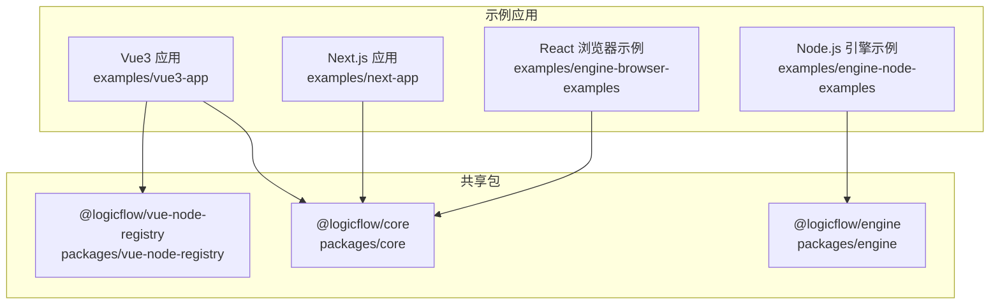
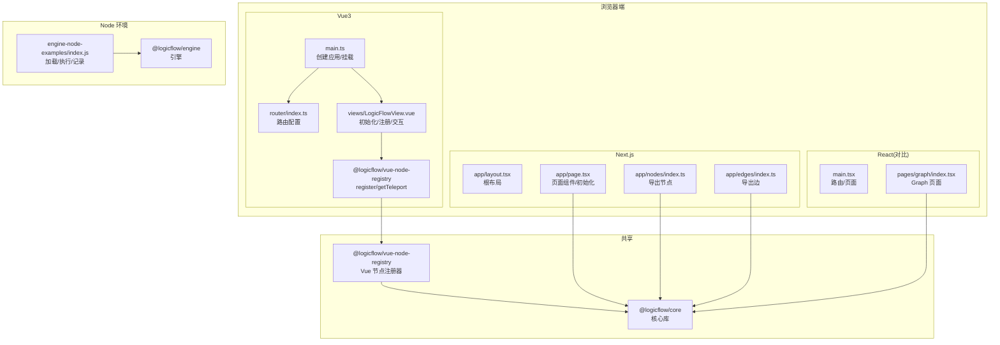
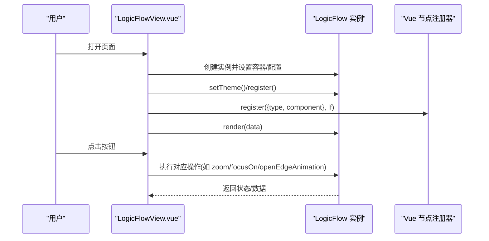
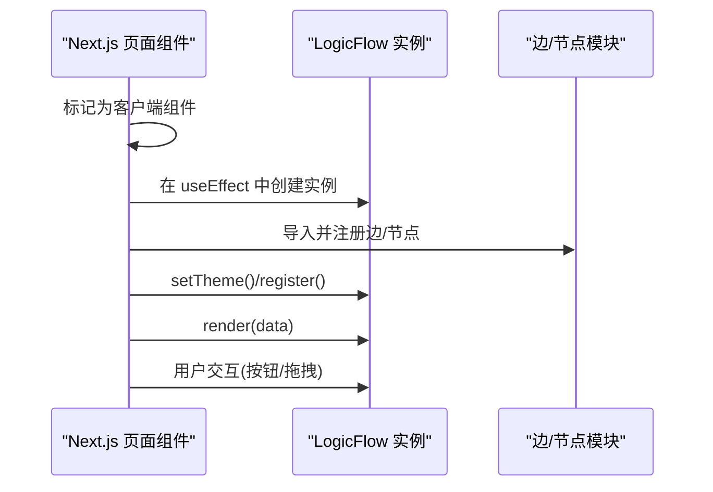
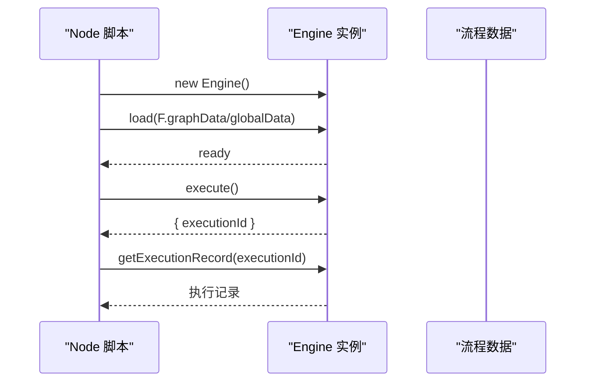
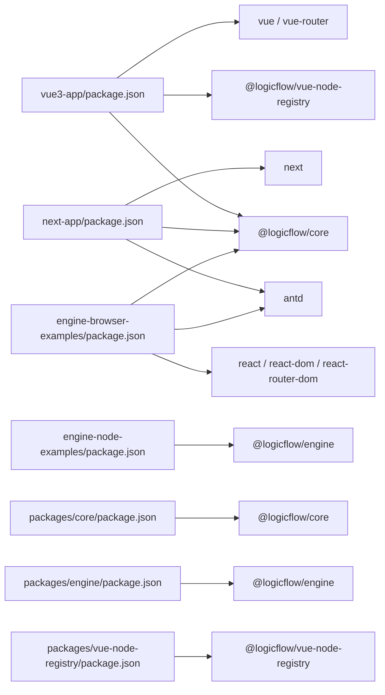

# 多框架集成示例

<cite>
**本文引用的文件**
- [examples/vue3-app/package.json](file://examples/vue3-app/package.json)
- [examples/vue3-app/vite.config.ts](file://examples/vue3-app/vite.config.ts)
- [examples/vue3-app/src/main.ts](file://examples/vue3-app/src/main.ts)
- [examples/vue3-app/src/router/index.ts](file://examples/vue3-app/src/router/index.ts)
- [examples/vue3-app/src/views/LogicFlowView.vue](file://examples/vue3-app/src/views/LogicFlowView.vue)
- [examples/vue3-app/src/components/LFElements/ProgressNode.vue](file://examples/vue3-app/src/components/LFElements/ProgressNode.vue)
- [examples/vue3-app/src/components/LFElements/nodes/index.ts](file://examples/vue3-app/src/components/LFElements/nodes/index.ts)
- [examples/vue3-app/src/components/LFElements/edges/index.ts](file://examples/vue3-app/src/components/LFElements/edges/index.ts)
- [examples/next-app/package.json](file://examples/next-app/package.json)
- [examples/next-app/src/app/layout.tsx](file://examples/next-app/src/app/layout.tsx)
- [examples/next-app/src/app/page.tsx](file://examples/next-app/src/app/page.tsx)
- [examples/next-app/src/app/nodes/index.ts](file://examples/next-app/src/app/nodes/index.ts)
- [examples/next-app/src/app/edges/index.ts](file://examples/next-app/src/app/edges/index.ts)
- [examples/engine-browser-examples/package.json](file://examples/engine-browser-examples/package.json)
- [examples/engine-browser-examples/src/main.tsx](file://examples/engine-browser-examples/src/main.tsx)
- [examples/engine-browser-examples/src/pages/graph/index.tsx](file://examples/engine-browser-examples/src/pages/graph/index.tsx)
- [examples/engine-node-examples/package.json](file://examples/engine-node-examples/package.json)
- [examples/engine-node-examples/index.js](file://examples/engine-node-examples/index.js)
- [packages/core/package.json](file://packages/core/package.json)
- [packages/engine/package.json](file://packages/engine/package.json)
- [packages/vue-node-registry/package.json](file://packages/vue-node-registry/package.json)
</cite>

## 目录
1. [引言](#引言)
2. [项目结构](#项目结构)
3. [核心组件](#核心组件)
4. [架构总览](#架构总览)
5. [详细组件分析](#详细组件分析)
6. [依赖分析](#依赖分析)
7. [性能考虑](#性能考虑)
8. [故障排查指南](#故障排查指南)
9. [结论](#结论)
10. [附录：配置与运行步骤](#附录配置与运行步骤)

## 引言
本项目提供 LogicFlow 在多框架环境中的集成示例，覆盖以下场景：
- Vue3 应用：通过 Composition API 与 LogicFlow 核心交互，结合 Vue 节点注册器渲染自定义 Vue 组件节点。
- Next.js 应用：基于 App Router 的客户端组件模式，直接在页面组件中初始化 LogicFlow 并进行节点/边扩展。
- React 浏览器应用：作为对比示例，展示在 React 生态中如何组织页面路由与 LogicFlow 集成。
- Node.js 环境：使用 LogicFlow 引擎执行流程数据，验证条件表达式与执行记录。

文档将从架构设计、实现细节、SSR 支持策略、组件封装、引擎使用方法、功能演示与配置运行等方面进行系统化说明，并给出迁移注意事项与最佳实践。

## 项目结构
该仓库采用 Monorepo 结构，根目录包含多个示例应用与共享包：
- examples：各框架示例应用
  - vue3-app：Vue3 + Element Plus + LogicFlow
  - next-app：Next.js App Router + Ant Design + LogicFlow
  - engine-browser-examples：React 示例（用于对比）
  - engine-node-examples：Node.js 引擎示例
- packages：LogicFlow 相关共享包
  - core：核心库
  - engine：流程引擎（支持浏览器与 Node 环境）
  - vue-node-registry：Vue 节点注册器
- 其他示例与文档：feature-examples、material-ui-demo 等

图表来源
- [examples/vue3-app/package.json](file://examples/vue3-app/package.json#L16-L29)
- [examples/next-app/package.json](file://examples/next-app/package.json#L11-L20)
- [examples/engine-browser-examples/package.json](file://examples/engine-browser-examples/package.json#L12-L24)
- [examples/engine-node-examples/package.json](file://examples/engine-node-examples/package.json#L16-L18)
- [packages/core/package.json](file://packages/core/package.json#L1-L57)
- [packages/engine/package.json](file://packages/engine/package.json#L1-L50)
- [packages/vue-node-registry/package.json](file://packages/vue-node-registry/package.json#L1-L56)

章节来源
- [examples/vue3-app/package.json](file://examples/vue3-app/package.json#L1-L52)
- [examples/next-app/package.json](file://examples/next-app/package.json#L1-L32)
- [examples/engine-browser-examples/package.json](file://examples/engine-browser-examples/package.json#L1-L39)
- [examples/engine-node-examples/package.json](file://examples/engine-node-examples/package.json#L1-L22)
- [packages/core/package.json](file://packages/core/package.json#L1-L57)
- [packages/engine/package.json](file://packages/engine/package.json#L1-L50)
- [packages/vue-node-registry/package.json](file://packages/vue-node-registry/package.json#L1-L56)

## 核心组件
- LogicFlow 核心库：提供图形模型、主题、工具栏、键盘快捷键、历史栈等能力。
- Vue 节点注册器：将 Vue 组件注册为 LogicFlow 节点，支持 Teleport 容器渲染。
- 引擎（@logicflow/engine）：在浏览器或 Node 环境执行流程数据，支持条件表达式与执行记录查询。
- 示例应用：
  - Vue3 应用：在页面组件中初始化 LogicFlow，注册自定义节点与边，演示常用操作。
  - Next.js 应用：在 App Router 页面组件中初始化 LogicFlow，演示主题、样式与交互。
  - React 浏览器应用：通过路由组织页面，演示引擎相关示例页。
  - Node.js 应用：加载流程数据并执行，输出结果与执行记录。

章节来源
- [packages/core/package.json](file://packages/core/package.json#L1-L57)
- [packages/engine/package.json](file://packages/engine/package.json#L1-L50)
- [packages/vue-node-registry/package.json](file://packages/vue-node-registry/package.json#L1-L56)
- [examples/vue3-app/src/views/LogicFlowView.vue](file://examples/vue3-app/src/views/LogicFlowView.vue#L1-L537)
- [examples/next-app/src/app/page.tsx](file://examples/next-app/src/app/page.tsx#L1-L476)

## 架构总览
下图展示了三个前端框架与 LogicFlow 的集成关系，以及引擎在 Node 环境的独立使用方式。

图表来源
- [examples/vue3-app/src/main.ts](file://examples/vue3-app/src/main.ts#L1-L16)
- [examples/vue3-app/src/router/index.ts](file://examples/vue3-app/src/router/index.ts#L1-L41)
- [examples/vue3-app/src/views/LogicFlowView.vue](file://examples/vue3-app/src/views/LogicFlowView.vue#L1-L537)
- [examples/next-app/src/app/layout.tsx](file://examples/next-app/src/app/layout.tsx#L1-L23)
- [examples/next-app/src/app/page.tsx](file://examples/next-app/src/app/page.tsx#L1-L476)
- [examples/next-app/src/app/nodes/index.ts](file://examples/next-app/src/app/nodes/index.ts#L1-L16)
- [examples/next-app/src/app/edges/index.ts](file://examples/next-app/src/app/edges/index.ts#L1-L8)
- [examples/engine-browser-examples/src/main.tsx](file://examples/engine-browser-examples/src/main.tsx#L1-L78)
- [examples/engine-browser-examples/src/pages/graph/index.tsx](file://examples/engine-browser-examples/src/pages/graph/index.tsx#L1-L200)
- [examples/engine-node-examples/index.js](file://examples/engine-node-examples/index.js#L1-L54)
- [packages/core/package.json](file://packages/core/package.json#L1-L57)
- [packages/vue-node-registry/package.json](file://packages/vue-node-registry/package.json#L1-L56)
- [packages/engine/package.json](file://packages/engine/package.json#L1-L50)

## 详细组件分析

### Vue3 应用集成
- 应用入口与插件
  - 在入口文件中引入全局样式与插件，创建并挂载应用实例。
  - 路由采用 History 模式，按需加载视图组件。
- LogicFlow 初始化与主题
  - 在页面组件中初始化 LogicFlow，设置样式、网格、背景、键盘等选项。
  - 使用主题配置统一节点/边样式。
- 自定义节点与边
  - 导出节点与边模块，在页面中统一注册。
  - 通过注册器将 Vue 组件注册为 LogicFlow 节点，并通过 Teleport 容器渲染。
- 交互与操作
  - 提供按钮触发定位、撤销/重做、切换节点类型、修改边 ID、缩放、居中、适配视口、开启/关闭边动画等操作。
  - 通过 DnD 面板拖拽节点到画布。
- 性能与生命周期
  - 在挂载后初始化画布，避免在服务端渲染阶段访问 DOM。
  - 使用 Teleport 容器承载 Vue 节点渲染，减少对主画布的耦合。

图表来源
- [examples/vue3-app/src/views/LogicFlowView.vue](file://examples/vue3-app/src/views/LogicFlowView.vue#L119-L254)
- [examples/vue3-app/src/views/LogicFlowView.vue](file://examples/vue3-app/src/views/LogicFlowView.vue#L191-L198)
- [examples/vue3-app/src/views/LogicFlowView.vue](file://examples/vue3-app/src/views/LogicFlowView.vue#L357-L374)

章节来源
- [examples/vue3-app/src/main.ts](file://examples/vue3-app/src/main.ts#L1-L16)
- [examples/vue3-app/src/router/index.ts](file://examples/vue3-app/src/router/index.ts#L1-L41)
- [examples/vue3-app/src/views/LogicFlowView.vue](file://examples/vue3-app/src/views/LogicFlowView.vue#L1-L537)
- [examples/vue3-app/src/components/LFElements/ProgressNode.vue](file://examples/vue3-app/src/components/LFElements/ProgressNode.vue#L1-L200)
- [examples/vue3-app/src/components/LFElements/nodes/index.ts](file://examples/vue3-app/src/components/LFElements/nodes/index.ts#L1-L200)
- [examples/vue3-app/src/components/LFElements/edges/index.ts](file://examples/vue3-app/src/components/LFElements/edges/index.ts#L1-L200)

### Next.js 应用集成与 SSR 支持
- App Router 页面组件
  - 页面组件标记为客户端组件，避免在服务端渲染阶段初始化 LogicFlow。
  - 在 useEffect 中创建实例，确保仅在浏览器执行。
- 主题与样式
  - 通过主题配置统一节点/边样式，支持文本溢出、箭头尺寸等。
- 节点与边导出
  - 将节点与边模块集中导出，便于页面统一注册。
- 交互与操作
  - 提供丰富的按钮操作，包括定位、撤销/重做、切换节点类型、修改边 ID、缩放、居中、适配视口、开启/关闭边动画等。
  - 通过 DnD 面板拖拽节点到画布。

图表来源
- [examples/next-app/src/app/page.tsx](file://examples/next-app/src/app/page.tsx#L1-L476)
- [examples/next-app/src/app/nodes/index.ts](file://examples/next-app/src/app/nodes/index.ts#L1-L16)
- [examples/next-app/src/app/edges/index.ts](file://examples/next-app/src/app/edges/index.ts#L1-L8)

章节来源
- [examples/next-app/src/app/layout.tsx](file://examples/next-app/src/app/layout.tsx#L1-L23)
- [examples/next-app/src/app/page.tsx](file://examples/next-app/src/app/page.tsx#L1-L476)
- [examples/next-app/src/app/nodes/index.ts](file://examples/next-app/src/app/nodes/index.ts#L1-L16)
- [examples/next-app/src/app/edges/index.ts](file://examples/next-app/src/app/edges/index.ts#L1-L8)

### React 应用集成（对比参考）
- 路由组织
  - 使用浏览器路由组织页面，包含首页、图形示例、扩展示例与引擎示例页。
- 图形页面
  - 在页面中初始化 LogicFlow，注册节点与边，演示常用操作。
- 引擎示例
  - 提供引擎入门与录制示例页，便于理解引擎在 React 生态中的使用方式。

章节来源
- [examples/engine-browser-examples/src/main.tsx](file://examples/engine-browser-examples/src/main.tsx#L1-L78)
- [examples/engine-browser-examples/src/pages/graph/index.tsx](file://examples/engine-browser-examples/src/pages/graph/index.tsx#L1-L200)

### Node.js 环境下的引擎使用
- 引擎加载与执行
  - 加载流程数据（包含节点、边与全局数据），执行后返回执行结果与执行 ID。
  - 通过执行 ID 查询执行记录，便于调试与审计。
- 运行方式
  - 以脚本形式启动，适合在服务端或 CI 环境中执行流程验证。

图表来源
- [examples/engine-node-examples/index.js](file://examples/engine-node-examples/index.js#L1-L54)
- [packages/engine/package.json](file://packages/engine/package.json#L1-L50)

章节来源
- [examples/engine-node-examples/package.json](file://examples/engine-node-examples/package.json#L1-L22)
- [examples/engine-node-examples/index.js](file://examples/engine-node-examples/index.js#L1-L54)
- [packages/engine/package.json](file://packages/engine/package.json#L1-L50)

## 依赖分析
- Vue3 应用
  - 依赖 @logicflow/core、@logicflow/vue-node-registry、Element Plus、Vue 与 Vue Router。
  - 通过注册器将 Vue 组件注册为 LogicFlow 节点，使用 Teleport 容器承载渲染。
- Next.js 应用
  - 依赖 @logicflow/core、Ant Design、React 与 Next.js。
  - 页面组件标记为客户端组件，避免 SSR 初始化问题。
- React 浏览器应用（对比）
  - 依赖 @logicflow/core、Ant Design、React 与 react-router-dom。
- Node.js 引擎示例
  - 依赖 @logicflow/engine，用于在 Node 环境执行流程。
- 共享包
  - @logicflow/core：核心能力与模型。
  - @logicflow/engine：跨环境引擎（浏览器/Node）。
  - @logicflow/vue-node-registry：Vue 节点注册器，支持 Vue 2/3。

图表来源
- [examples/vue3-app/package.json](file://examples/vue3-app/package.json#L16-L29)
- [examples/next-app/package.json](file://examples/next-app/package.json#L11-L20)
- [examples/engine-browser-examples/package.json](file://examples/engine-browser-examples/package.json#L12-L24)
- [examples/engine-node-examples/package.json](file://examples/engine-node-examples/package.json#L16-L18)
- [packages/core/package.json](file://packages/core/package.json#L1-L57)
- [packages/engine/package.json](file://packages/engine/package.json#L1-L50)
- [packages/vue-node-registry/package.json](file://packages/vue-node-registry/package.json#L1-L56)

章节来源
- [examples/vue3-app/package.json](file://examples/vue3-app/package.json#L1-L52)
- [examples/next-app/package.json](file://examples/next-app/package.json#L1-L32)
- [examples/engine-browser-examples/package.json](file://examples/engine-browser-examples/package.json#L1-L39)
- [examples/engine-node-examples/package.json](file://examples/engine-node-examples/package.json#L1-L22)
- [packages/core/package.json](file://packages/core/package.json#L1-L57)
- [packages/engine/package.json](file://packages/engine/package.json#L1-L50)
- [packages/vue-node-registry/package.json](file://packages/vue-node-registry/package.json#L1-L56)

## 性能考虑
- Vue3 应用
  - 使用 Teleport 容器承载 Vue 节点渲染，降低主画布复杂度。
  - 在 mounted 生命周期初始化画布，避免 SSR 阶段访问 DOM。
  - 合理使用主题与样式配置，减少重复计算。
- Next.js 应用
  - 页面组件标记为客户端组件，避免在服务端渲染阶段初始化 LogicFlow。
  - 通过 useEffect 控制实例创建时机，确保仅在浏览器执行。
- React 应用（对比）
  - 通过路由懒加载减少初始包体积。
- Node.js 引擎
  - 在执行前校验流程数据结构，避免不必要的执行开销。
  - 使用执行记录查询接口进行调试与审计，减少重复执行。

## 故障排查指南
- Vue3 应用
  - 若出现 Teleport 相关内存问题，检查是否启用了开发工具插件导致全局缓冲区增长。
  - 确保在 mounted 后再初始化 LogicFlow，避免服务端渲染阶段访问 DOM。
- Next.js 应用
  - 确保页面组件标记为客户端组件，避免在服务端渲染阶段初始化画布。
  - 如样式异常，检查主题配置与全局样式导入顺序。
- React 应用（对比）
  - 确保路由正确加载页面组件，避免路径错误导致初始化失败。
- Node.js 引擎
  - 确保流程数据结构符合要求，边上的条件表达式语法正确。
  - 使用执行记录查询接口定位执行问题。

章节来源
- [examples/vue3-app/vite.config.ts](file://examples/vue3-app/vite.config.ts#L1-L15)
- [examples/vue3-app/src/views/LogicFlowView.vue](file://examples/vue3-app/src/views/LogicFlowView.vue#L119-L120)
- [examples/next-app/src/app/page.tsx](file://examples/next-app/src/app/page.tsx#L1-L476)
- [examples/engine-node-examples/index.js](file://examples/engine-node-examples/index.js#L1-L54)

## 结论
本项目提供了 LogicFlow 在 Vue3、Next.js 与 Node.js 环境中的完整集成示例。通过统一的核心库与注册器，开发者可以在不同框架中快速构建可视化流程图与执行流程。建议在生产环境中：
- Vue3：使用 Teleport 容器承载 Vue 节点，避免 SSR 阶段初始化。
- Next.js：页面组件标记为客户端组件，确保浏览器环境初始化。
- Node.js：严格校验流程数据结构，利用执行记录进行调试与审计。

## 附录：配置与运行步骤
- Vue3 应用
  - 安装依赖：使用包管理器安装根目录与示例应用依赖。
  - 开发运行：在示例应用目录执行开发命令。
  - 构建与预览：执行构建与预览命令。
- Next.js 应用
  - 安装依赖：在示例应用目录安装依赖。
  - 开发运行：执行开发命令启动本地服务。
  - 构建与启动：执行构建与启动命令。
- React 浏览器应用（对比）
  - 安装依赖：在示例应用目录安装依赖。
  - 开发运行：执行开发命令启动本地服务。
- Node.js 引擎示例
  - 安装依赖：在示例应用目录安装依赖。
  - 运行脚本：执行脚本以加载流程数据并执行，查看控制台输出。

章节来源
- [examples/vue3-app/package.json](file://examples/vue3-app/package.json#L6-L15)
- [examples/next-app/package.json](file://examples/next-app/package.json#L5-L10)
- [examples/engine-browser-examples/package.json](file://examples/engine-browser-examples/package.json#L6-L11)
- [examples/engine-node-examples/package.json](file://examples/engine-node-examples/package.json#L7-L10)