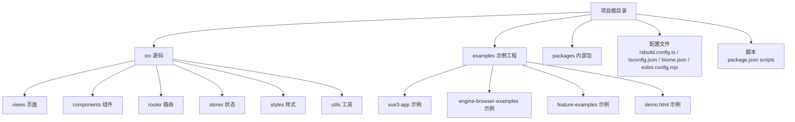
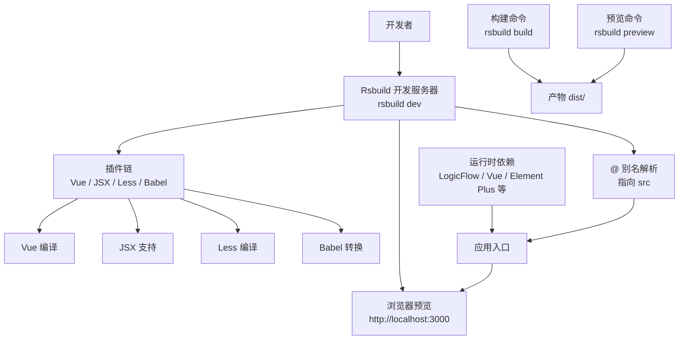
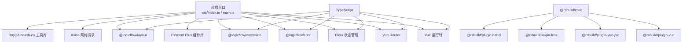

# 快速开始

<cite>
**本文引用的文件**
- [package.json](file://package.json)
- [rsbuild.config.ts](file://rsbuild.config.ts)
- [README.md](file://README.md)
- [tsconfig.json](file://tsconfig.json)
- [biome.json](file://biome.json)
- [eslint.config.mjs](file://eslint.config.mjs)
- [pnpm-lock.yaml](file://pnpm-lock.yaml)
- [examples/vue3-app/src/main.ts](file://examples/vue3-app/src/main.ts)
- [examples/vue3-app/index.html](file://examples/vue3-app/index.html)
- [examples/demo.html](file://examples/demo.html)
</cite>

## 目录
1. [简介](#简介)
2. [项目结构](#项目结构)
3. [核心组件](#核心组件)
4. [架构总览](#架构总览)
5. [详细组件分析](#详细组件分析)
6. [依赖关系分析](#依赖关系分析)
7. [性能注意事项](#性能注意事项)
8. [故障排查指南](#故障排查指南)
9. [结论](#结论)
10. [附录](#附录)

## 简介
本指南面向新加入的开发者，帮助你在约 15 分钟内完成 Rsbuild + Vue3 + LogicFlow 项目的环境准备、依赖安装、开发服务器启动与基础验证。文档覆盖以下要点：
- 环境准备：Node.js 版本要求、包管理器选择（推荐 pnpm）
- 依赖安装：开发依赖与运行时依赖
- 开发服务器：启动、热重载与调试
- 生产构建与本地预览
- 常见安装问题排查
- 最小可行配置示例
- IDE 配置建议与开发工具推荐

## 项目结构
该仓库是一个基于 Rsbuild 的 Vue3 应用，集成了 LogicFlow 图编辑能力，并提供了多个示例工程用于参考与演示。根目录包含应用主工程与多个示例子项目，便于对照学习。

图表来源
- [rsbuild.config.ts](file://rsbuild.config.ts#L1-L30)
- [package.json](file://package.json#L1-L45)
- [tsconfig.json](file://tsconfig.json#L1-L33)

章节来源
- [rsbuild.config.ts](file://rsbuild.config.ts#L1-L30)
- [package.json](file://package.json#L1-L45)
- [tsconfig.json](file://tsconfig.json#L1-L33)

## 核心组件
- Rsbuild 构建与开发服务器：通过 Rsbuild 提供的 dev/build/preview 脚本进行开发与构建。
- Vue3 + TypeScript：使用 Vue3 与 TypeScript 进行页面与组件开发，路径别名 @ 指向 src。
- LogicFlow 图编辑：集成 @logicflow/core、@logicflow/extension、@logicflow/layout 等依赖，支持节点、边、布局等扩展能力。
- 样式与插件：启用 Less、Vue、JSX、Babel 插件以满足样式与语法需求。
- 代码质量：Biome 格式化与检查、ESLint 规则配置。

章节来源
- [package.json](file://package.json#L6-L12)
- [rsbuild.config.ts](file://rsbuild.config.ts#L10-L29)
- [tsconfig.json](file://tsconfig.json#L22-L24)
- [biome.json](file://biome.json#L1-L35)
- [eslint.config.mjs](file://eslint.config.mjs#L1-L24)

## 架构总览
下图展示了从开发到生产的整体流程，以及关键配置与依赖的关系。

图表来源
- [rsbuild.config.ts](file://rsbuild.config.ts#L10-L29)
- [package.json](file://package.json#L14-L27)

章节来源
- [rsbuild.config.ts](file://rsbuild.config.ts#L10-L29)
- [package.json](file://package.json#L14-L27)

## 详细组件分析

### 环境准备与 Node.js 版本
- 推荐使用 Node.js LTS（如 18.x 或 20.x），确保与 TypeScript、Rsbuild 及相关工具兼容。
- 使用 pnpm 作为包管理器，具备更快的安装速度与更严格的依赖隔离特性。

章节来源
- [pnpm-lock.yaml](file://pnpm-lock.yaml#L1-L200)

### 依赖安装流程
- 安装命令：使用 pnpm 安装所有依赖（含开发与运行时）。
- 运行时依赖（部分）：@logicflow/core、@logicflow/extension、@logicflow/layout、vue、vue-router、pinia、element-plus、axios、dayjs、lodash-es 等。
- 开发依赖（部分）：@rsbuild/core、@rsbuild/plugin-vue、@rsbuild/plugin-vue-jsx、@rsbuild/plugin-less、@rsbuild/plugin-babel、typescript、eslint、@vue/eslint-config-typescript、@biomejs/biome 等。

章节来源
- [package.json](file://package.json#L14-L43)
- [pnpm-lock.yaml](file://pnpm-lock.yaml#L10-L90)

### 开发服务器启动与热重载
- 启动命令：执行 rsbuild dev，自动打开浏览器访问 http://localhost:3000。
- 热重载：Rsbuild 默认启用 HMR，修改源码后浏览器自动刷新。
- 调试建议：在 IDE 中设置断点，结合浏览器开发者工具定位问题；可开启 ESLint 与 Biome 的实时检查辅助开发。

章节来源
- [README.md](file://README.md#L13-L17)
- [rsbuild.config.ts](file://rsbuild.config.ts#L19-L23)

### 生产构建与本地预览
- 构建命令：rsbuild build 生成生产产物至默认输出目录。
- 本地预览：rsbuild preview 在本地启动静态服务预览构建结果。

章节来源
- [README.md](file://README.md#L19-L29)
- [package.json](file://package.json#L7-L12)

### 最小可行配置示例
- Rsbuild 配置要点：启用 Vue、JSX、Less、Babel 插件；配置 @ 别名指向 src；关闭自动打开浏览器（避免多开）。
- TypeScript 路径别名：在 tsconfig.json 中配置 baseUrl 与 paths，确保 @/* 正确解析。
- 代码质量：启用 Biome 格式化与 ESLint 规则，保证团队一致性。

章节来源
- [rsbuild.config.ts](file://rsbuild.config.ts#L10-L29)
- [tsconfig.json](file://tsconfig.json#L21-L24)
- [biome.json](file://biome.json#L1-L35)
- [eslint.config.mjs](file://eslint.config.mjs#L14-L23)

### 示例工程参考
- Vue3 示例入口与挂载：示例应用通过 main.ts 引入 Element Plus、路由与应用根组件，并挂载到 DOM。
- 示例 HTML：示例页面通过 index.html 提供基本结构，配合示例应用或 UMD 资源演示。

章节来源
- [examples/vue3-app/src/main.ts](file://examples/vue3-app/src/main.ts#L1-L16)
- [examples/vue3-app/index.html](file://examples/vue3-app/index.html#L1-L14)
- [examples/demo.html](file://examples/demo.html#L1-L77)

## 依赖关系分析
下图展示项目中主要依赖与插件之间的关系，帮助理解构建链路与功能模块划分。

图表来源
- [package.json](file://package.json#L14-L27)
- [package.json](file://package.json#L28-L43)
- [rsbuild.config.ts](file://rsbuild.config.ts#L10-L18)

章节来源
- [package.json](file://package.json#L14-L43)
- [rsbuild.config.ts](file://rsbuild.config.ts#L10-L18)

## 性能注意事项
- 合理拆分构建插件，仅启用必要插件，减少编译时间。
- 使用路径别名与模块解析优化，避免深层相对路径导致的解析开销。
- 生产构建前进行代码检查与格式化，降低运行时错误概率。
- 对大体量示例工程可按需引入依赖，避免打包体积膨胀。

## 故障排查指南
- pnpm 安装失败或依赖不一致
  - 确认网络与镜像源可用；清理缓存后重试安装。
  - 若存在版本冲突，优先以 pnpm-lock.yaml 为准锁定版本。
- Node.js 版本不兼容
  - 升级到 LTS 版本（18.x/20.x），确保与 TypeScript、Rsbuild 兼容。
- 端口占用导致无法启动
  - 修改 Rsbuild 配置中的端口或释放被占用端口。
- 路径别名无效
  - 检查 tsconfig.json 的 baseUrl 与 paths 设置，确保 @/* 指向正确目录。
- ESLint/Biome 报错
  - 执行格式化与修复命令，或在 IDE 中启用保存时自动格式化。
- 浏览器无法加载资源
  - 确认入口 HTML 与入口 TS 是否正确挂载；检查插件是否正确启用。

章节来源
- [pnpm-lock.yaml](file://pnpm-lock.yaml#L1-L200)
- [tsconfig.json](file://tsconfig.json#L21-L24)
- [biome.json](file://biome.json#L1-L35)
- [eslint.config.mjs](file://eslint.config.mjs#L14-L23)
- [rsbuild.config.ts](file://rsbuild.config.ts#L19-L23)

## 结论
按照本指南完成环境准备与依赖安装后，你可以在 15 分钟内启动开发服务器并看到效果。建议在开发过程中持续使用 ESLint 与 Biome 保持代码质量，并根据业务需要逐步接入 LogicFlow 的节点、边与布局扩展能力。

## 附录

### 快速操作清单
- 环境准备：安装 Node.js LTS 与 pnpm
- 安装依赖：pnpm install
- 启动开发：pnpm run dev（默认访问 http://localhost:3000）
- 构建生产：pnpm run build
- 本地预览：pnpm run preview

章节来源
- [README.md](file://README.md#L5-L29)
- [package.json](file://package.json#L6-L12)

### IDE 配置建议
- VSCode 插件推荐：ESLint、Biome、TypeScript Importer、Path Intellisense
- 设置保存时自动格式化与导入整理
- 在工作区根目录启用 ESLint 与 Biome 规则

章节来源
- [biome.json](file://biome.json#L1-L35)
- [eslint.config.mjs](file://eslint.config.mjs#L1-L24)