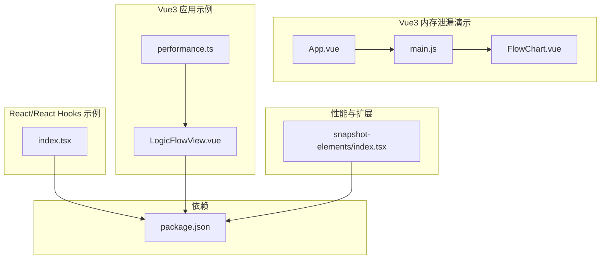
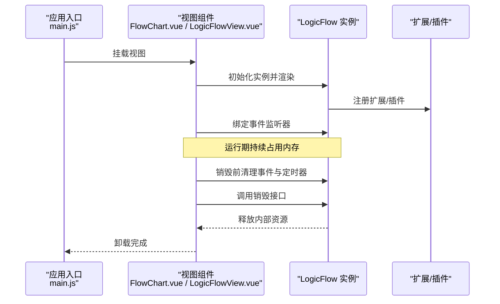
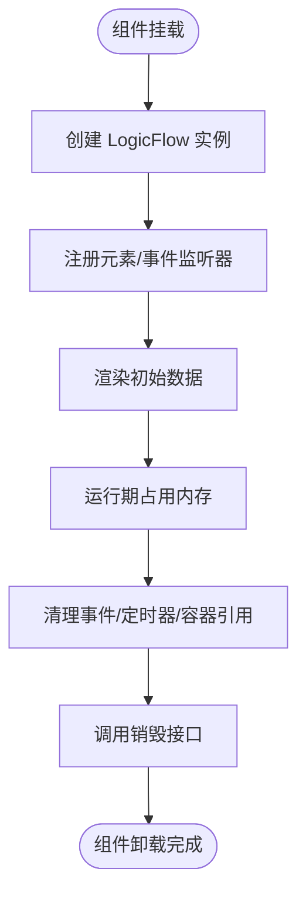
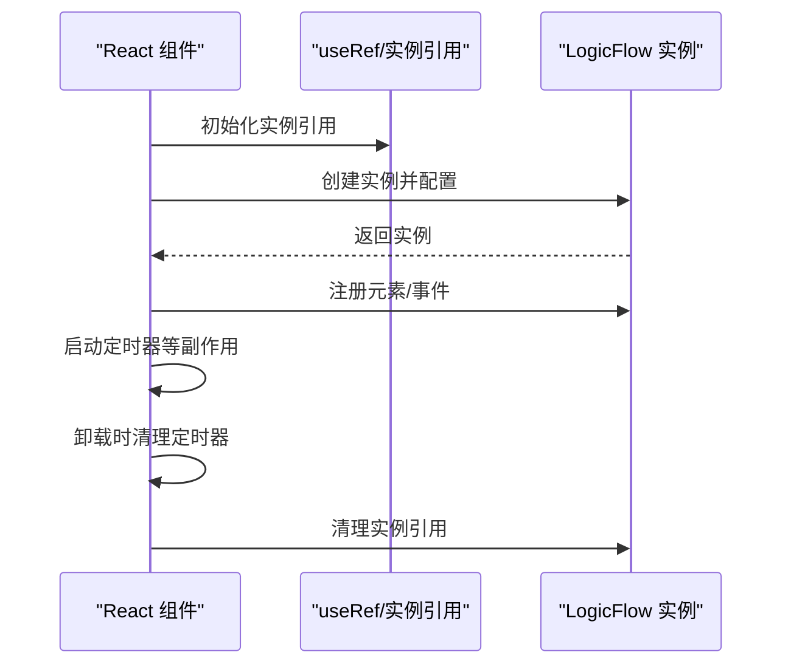
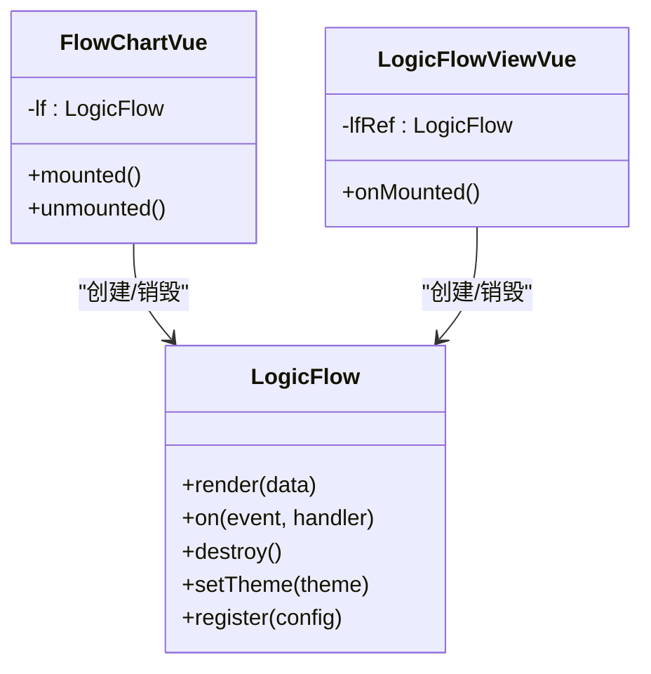
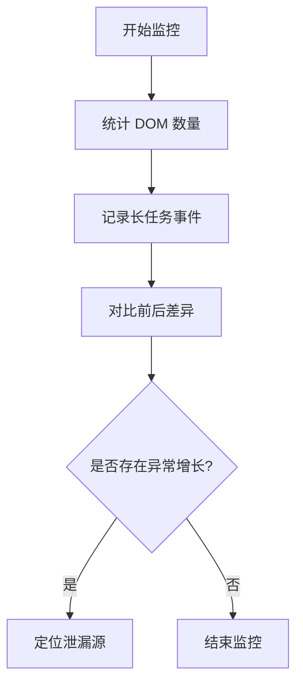
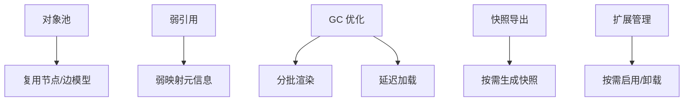
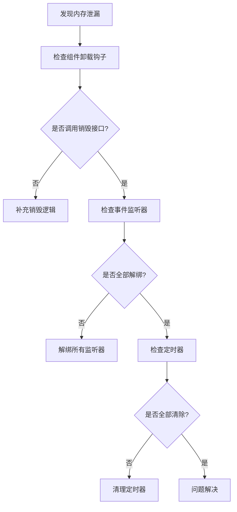
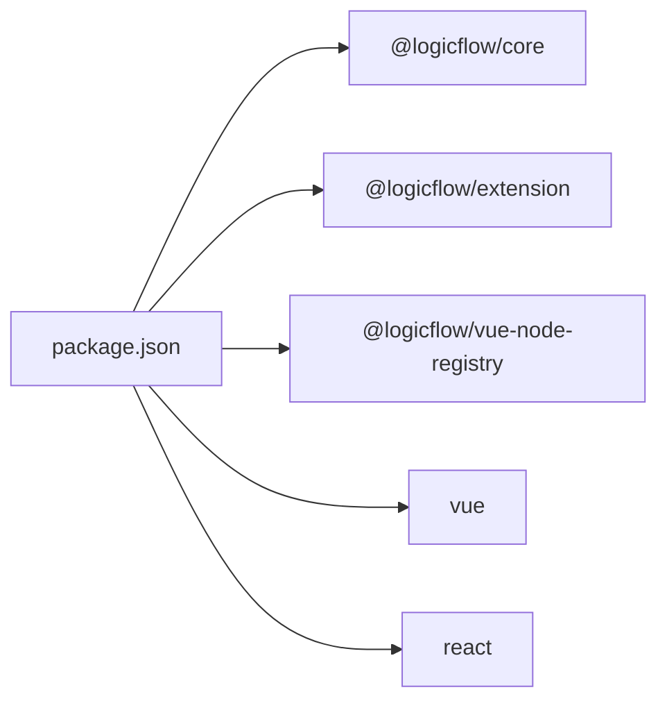

# 内存管理最佳实践

<cite>
**本文引用的文件**
- [examples/vue3-memory-leak/src/App.vue](file://examples/vue3-memory-leak/src/App.vue)
- [examples/vue3-memory-leak/src/main.js](file://examples/vue3-memory-leak/src/main.js)
- [examples/vue3-memory-leak/src/components/FlowChart.vue](file://examples/vue3-memory-leak/src/components/FlowChart.vue)
- [examples/engine-browser-examples/src/pages/graph/index.tsx](file://examples/engine-browser-examples/src/pages/graph/index.tsx)
- [examples/feature-examples/src/pages/react/index.tsx](file://examples/feature-examples/src/pages/react/index.tsx)
- [examples/feature-examples/src/pages/performance/snapshot-elements/index.tsx](file://examples/feature-examples/src/pages/performance/snapshot-elements/index.tsx)
- [examples/vue3-app/src/views/LogicFlowView.vue](file://examples/vue3-app/src/views/LogicFlowView.vue)
- [examples/vue3-app/src/utils/performance.ts](file://examples/vue3-app/src/utils/performance.ts)
- [package.json](file://package.json)
</cite>

## 目录
1. [引言](#引言)
2. [项目结构](#项目结构)
3. [核心组件](#核心组件)
4. [架构总览](#架构总览)
5. [详细组件分析](#详细组件分析)
6. [依赖关系分析](#依赖关系分析)
7. [性能考量](#性能考量)
8. [故障排查指南](#故障排查指南)
9. [结论](#结论)
10. [附录](#附录)

## 引言
本指南聚焦于在流程图应用中如何进行内存管理，涵盖以下关键主题：
- 常见内存泄漏场景与预防措施
- Vue3 组件生命周期与内存管理的关系（组件销毁、事件监听器清理、定时器管理）
- LogicFlow 实例的正确创建与销毁模式
- 内存使用监控与检测工具的使用方法
- 大数据量场景下的内存优化策略（对象池、弱引用、垃圾回收优化）
- 内存泄漏检测的实际案例与调试技巧
- 内存友好的编码规范与代码审查要点

## 项目结构
该仓库包含多个示例工程，其中与内存管理密切相关的模块如下：
- Vue3 内存泄漏演示：展示了 LogicFlow 在 Vue3 中的典型用法与销毁时机
- React/React Hooks 示例：展示了 LogicFlow 在 React 中的实例化与清理
- Vue3 应用示例：展示了 LogicFlow 在 Vue3 中的注册、事件绑定与销毁
- 性能监控工具：提供了 DOM 数量统计与长任务观察工具
- 包管理与依赖：集中管理 LogicFlow 及其扩展

**图表来源**
- [examples/vue3-memory-leak/src/App.vue](file://examples/vue3-memory-leak/src/App.vue#L1-L10)
- [examples/vue3-memory-leak/src/main.js](file://examples/vue3-memory-leak/src/main.js#L1-L11)
- [examples/vue3-memory-leak/src/components/FlowChart.vue](file://examples/vue3-memory-leak/src/components/FlowChart.vue#L1-L225)
- [examples/engine-browser-examples/src/pages/graph/index.tsx](file://examples/engine-browser-examples/src/pages/graph/index.tsx#L1-L567)
- [examples/feature-examples/src/pages/react/index.tsx](file://examples/feature-examples/src/pages/react/index.tsx#L1-L153)
- [examples/vue3-app/src/views/LogicFlowView.vue](file://examples/vue3-app/src/views/LogicFlowView.vue#L1-L537)
- [examples/vue3-app/src/utils/performance.ts](file://examples/vue3-app/src/utils/performance.ts#L1-L28)
- [examples/feature-examples/src/pages/performance/snapshot-elements/index.tsx](file://examples/feature-examples/src/pages/performance/snapshot-elements/index.tsx#L1-L445)
- [package.json](file://package.json#L1-L45)

**章节来源**
- [examples/vue3-memory-leak/src/App.vue](file://examples/vue3-memory-leak/src/App.vue#L1-L10)
- [examples/vue3-memory-leak/src/main.js](file://examples/vue3-memory-leak/src/main.js#L1-L11)
- [examples/vue3-memory-leak/src/components/FlowChart.vue](file://examples/vue3-memory-leak/src/components/FlowChart.vue#L1-L225)
- [examples/engine-browser-examples/src/pages/graph/index.tsx](file://examples/engine-browser-examples/src/pages/graph/index.tsx#L1-L567)
- [examples/feature-examples/src/pages/react/index.tsx](file://examples/feature-examples/src/pages/react/index.tsx#L1-L153)
- [examples/vue3-app/src/views/LogicFlowView.vue](file://examples/vue3-app/src/views/LogicFlowView.vue#L1-L537)
- [examples/vue3-app/src/utils/performance.ts](file://examples/vue3-app/src/utils/performance.ts#L1-L28)
- [examples/feature-examples/src/pages/performance/snapshot-elements/index.tsx](file://examples/feature-examples/src/pages/performance/snapshot-elements/index.tsx#L1-L445)
- [package.json](file://package.json#L1-L45)

## 核心组件
- Vue3 内存泄漏演示组件：展示 LogicFlow 在 Vue3 单文件组件中的初始化与销毁
- React/React Hooks 示例：展示 LogicFlow 在 React 函数组件中的初始化与清理
- Vue3 应用视图：展示 LogicFlow 在 Vue3 中的注册、事件绑定与销毁
- 性能监控工具：提供 DOM 数量统计与长任务观察能力
- 依赖声明：统一管理 LogicFlow 及其扩展版本

**章节来源**
- [examples/vue3-memory-leak/src/components/FlowChart.vue](file://examples/vue3-memory-leak/src/components/FlowChart.vue#L1-L225)
- [examples/engine-browser-examples/src/pages/graph/index.tsx](file://examples/engine-browser-examples/src/pages/graph/index.tsx#L1-L567)
- [examples/feature-examples/src/pages/react/index.tsx](file://examples/feature-examples/src/pages/react/index.tsx#L1-L153)
- [examples/vue3-app/src/views/LogicFlowView.vue](file://examples/vue3-app/src/views/LogicFlowView.vue#L1-L537)
- [examples/vue3-app/src/utils/performance.ts](file://examples/vue3-app/src/utils/performance.ts#L1-L28)
- [package.json](file://package.json#L14-L26)

## 架构总览
本节从内存管理角度梳理组件与 LogicFlow 实例之间的交互关系，以及生命周期对内存的影响。

**图表来源**
- [examples/vue3-memory-leak/src/main.js](file://examples/vue3-memory-leak/src/main.js#L1-L11)
- [examples/vue3-memory-leak/src/components/FlowChart.vue](file://examples/vue3-memory-leak/src/components/FlowChart.vue#L18-L172)
- [examples/vue3-app/src/views/LogicFlowView.vue](file://examples/vue3-app/src/views/LogicFlowView.vue#L119-L254)
- [examples/engine-browser-examples/src/pages/graph/index.tsx](file://examples/engine-browser-examples/src/pages/graph/index.tsx#L157-L232)
- [examples/feature-examples/src/pages/react/index.tsx](file://examples/feature-examples/src/pages/react/index.tsx#L28-L135)

## 详细组件分析

### Vue3 组件生命周期与内存管理
- 组件挂载阶段：创建 LogicFlow 实例、注册元素与事件监听器、渲染初始数据
- 组件卸载阶段：必须清理所有事件监听器、定时器、DOM 引用，最后调用销毁接口
- 常见风险点：
  - 未解绑事件监听器导致回调持有组件实例引用
  - 未清除定时器导致循环回调持有实例
  - 未释放容器引用导致 DOM 无法被 GC 回收

**图表来源**
- [examples/vue3-memory-leak/src/components/FlowChart.vue](file://examples/vue3-memory-leak/src/components/FlowChart.vue#L18-L172)
- [examples/vue3-app/src/views/LogicFlowView.vue](file://examples/vue3-app/src/views/LogicFlowView.vue#L119-L254)

**章节来源**
- [examples/vue3-memory-leak/src/components/FlowChart.vue](file://examples/vue3-memory-leak/src/components/FlowChart.vue#L18-L172)
- [examples/vue3-app/src/views/LogicFlowView.vue](file://examples/vue3-app/src/views/LogicFlowView.vue#L119-L254)

### React/React Hooks 实例的正确创建与销毁
- 使用 useRef 存储实例，避免重复创建
- 在 useEffect 中初始化 LogicFlow 并注册元素与事件
- 在 componentWillUnmount 中清理定时器与实例引用
- 注意：React 类组件与函数组件的清理时机不同，需按生命周期正确处理

**图表来源**
- [examples/engine-browser-examples/src/pages/graph/index.tsx](file://examples/engine-browser-examples/src/pages/graph/index.tsx#L157-L232)
- [examples/feature-examples/src/pages/react/index.tsx](file://examples/feature-examples/src/pages/react/index.tsx#L28-L135)

**章节来源**
- [examples/engine-browser-examples/src/pages/graph/index.tsx](file://examples/engine-browser-examples/src/pages/graph/index.tsx#L157-L232)
- [examples/feature-examples/src/pages/react/index.tsx](file://examples/feature-examples/src/pages/react/index.tsx#L28-L135)

### LogicFlow 实例的正确创建与销毁模式
- 创建时机：在容器可用且配置就绪后创建实例
- 注册元素与事件：在实例创建后立即注册，避免后续访问不到
- 数据渲染：首次渲染后可进行后续操作
- 销毁时机：组件卸载前清理事件、定时器、容器引用，最后调用销毁接口
- 扩展插件：注意插件的生命周期与资源释放

**图表来源**
- [examples/vue3-memory-leak/src/components/FlowChart.vue](file://examples/vue3-memory-leak/src/components/FlowChart.vue#L18-L172)
- [examples/vue3-app/src/views/LogicFlowView.vue](file://examples/vue3-app/src/views/LogicFlowView.vue#L119-L254)

**章节来源**
- [examples/vue3-memory-leak/src/components/FlowChart.vue](file://examples/vue3-memory-leak/src/components/FlowChart.vue#L18-L172)
- [examples/vue3-app/src/views/LogicFlowView.vue](file://examples/vue3-app/src/views/LogicFlowView.vue#L119-L254)

### 内存使用监控与检测工具
- DOM 数量统计：通过遍历 document.querySelectorAll('*') 获取当前 DOM 节点总数，用于对比前后差异
- 长任务观察：使用 PerformanceObserver 监听 longtask，结合 requestIdleCallback 分析主线程阻塞情况

**图表来源**
- [examples/vue3-app/src/utils/performance.ts](file://examples/vue3-app/src/utils/performance.ts#L1-L28)

**章节来源**
- [examples/vue3-app/src/utils/performance.ts](file://examples/vue3-app/src/utils/performance.ts#L1-L28)

### 大数据量场景下的内存优化策略
- 对象池：复用节点/边模型，减少频繁创建与销毁
- 弱引用：对大对象采用 WeakMap/WeakSet 存储元信息，避免阻止 GC
- 垃圾回收优化：分批渲染、延迟加载、虚拟滚动（如适用）
- 快照导出：在需要时才生成快照，避免常驻内存
- 插件与扩展：谨慎启用大型扩展，按需加载与卸载

**图表来源**
- [examples/feature-examples/src/pages/performance/snapshot-elements/index.tsx](file://examples/feature-examples/src/pages/performance/snapshot-elements/index.tsx#L103-L160)

**章节来源**
- [examples/feature-examples/src/pages/performance/snapshot-elements/index.tsx](file://examples/feature-examples/src/pages/performance/snapshot-elements/index.tsx#L103-L160)

### 内存泄漏检测的实际案例与调试技巧
- 案例一：Vue3 组件未清理事件监听器与定时器
  - 现象：切换路由或卸载组件后内存不降反升
  - 排查：检查组件卸载钩子是否调用销毁接口；确认事件监听器是否解绑
- 案例二：React 组件未清理定时器
  - 现象：组件卸载后仍持续触发回调
  - 排查：在 componentWillUnmount 中清除定时器
- 案例三：LogicFlow 实例未销毁
  - 现象：多次创建实例导致内存累积
  - 排查：确保每次创建前清理旧实例，销毁后清空引用

**图表来源**
- [examples/vue3-memory-leak/src/components/FlowChart.vue](file://examples/vue3-memory-leak/src/components/FlowChart.vue#L166-L172)
- [examples/feature-examples/src/pages/react/index.tsx](file://examples/feature-examples/src/pages/react/index.tsx#L130-L135)

**章节来源**
- [examples/vue3-memory-leak/src/components/FlowChart.vue](file://examples/vue3-memory-leak/src/components/FlowChart.vue#L166-L172)
- [examples/feature-examples/src/pages/react/index.tsx](file://examples/feature-examples/src/pages/react/index.tsx#L130-L135)

## 依赖关系分析
- LogicFlow 核心与扩展：统一通过 package.json 管理版本，确保兼容性
- Vue3 与 React 示例：分别演示了在不同框架中的内存管理最佳实践

**图表来源**
- [package.json](file://package.json#L14-L26)

**章节来源**
- [package.json](file://package.json#L14-L26)

## 性能考量
- 避免在组件内频繁创建与销毁 LogicFlow 实例
- 合理使用事件监听器与定时器，确保在组件卸载时清理
- 在大数据量场景下，优先考虑分批渲染与按需加载
- 使用性能监控工具定期评估内存与主线程占用

## 故障排查指南
- 使用 DOM 数量统计与长任务观察工具进行基线测量
- 对比操作前后的内存变化，定位异常增长
- 检查组件生命周期钩子是否完整执行销毁流程
- 对比不同框架（Vue3/React）的销毁模式差异，避免遗漏

**章节来源**
- [examples/vue3-app/src/utils/performance.ts](file://examples/vue3-app/src/utils/performance.ts#L1-L28)
- [examples/vue3-memory-leak/src/components/FlowChart.vue](file://examples/vue3-memory-leak/src/components/FlowChart.vue#L166-L172)
- [examples/feature-examples/src/pages/react/index.tsx](file://examples/feature-examples/src/pages/react/index.tsx#L130-L135)

## 结论
- 正确的生命周期管理是防止内存泄漏的关键
- LogicFlow 实例的创建与销毁必须成对出现，并清理所有外部引用
- 在大数据量场景下，应采用对象池、弱引用与分批渲染等策略
- 建立完善的监控与检测机制，持续跟踪内存与性能指标

## 附录
- 编码规范与代码审查要点
  - 必须在组件卸载钩子中调用销毁接口
  - 必须解绑所有事件监听器
  - 必须清除所有定时器
  - 必须避免在组件内重复创建实例
  - 必须对大对象使用弱引用存储元信息
  - 必须在大数据量场景下采用分批渲染与按需加载