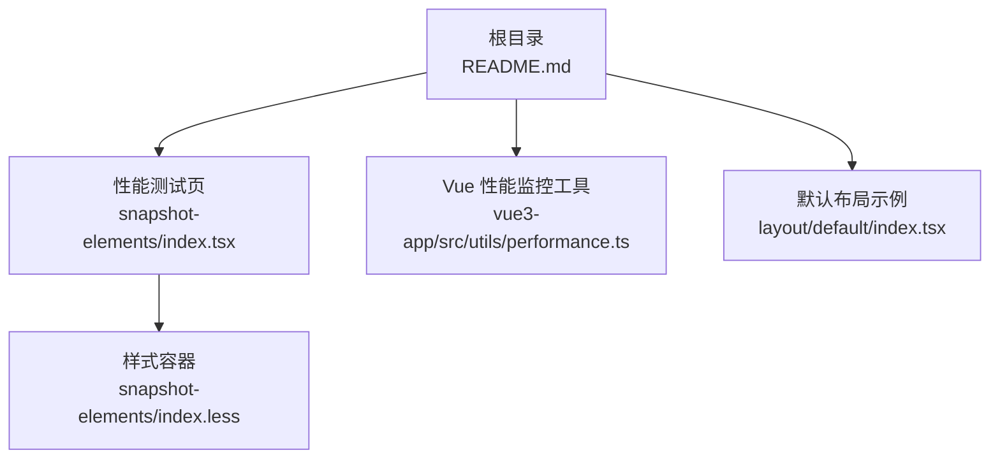
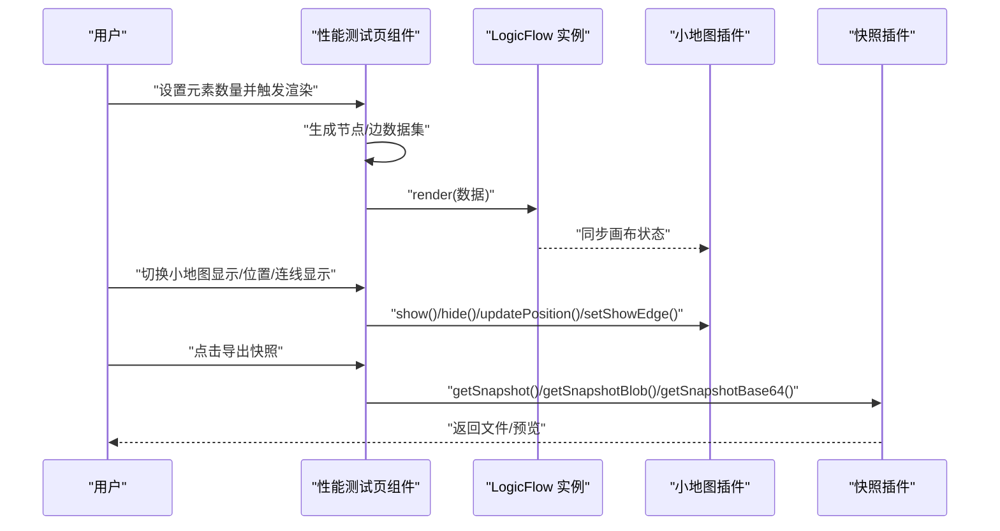
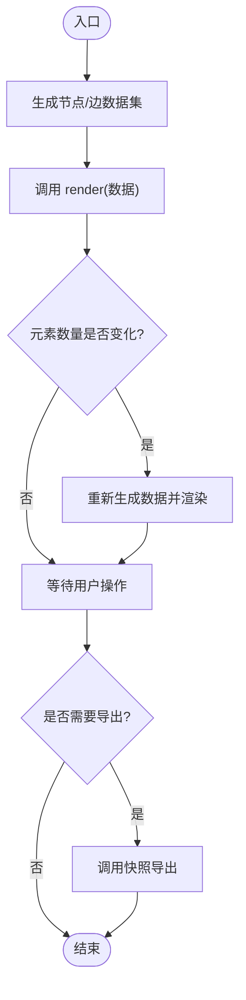
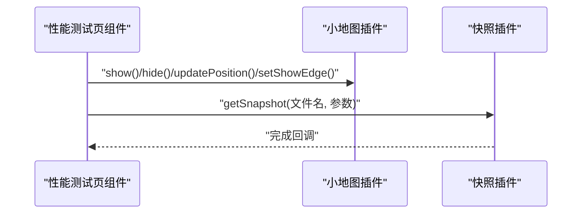
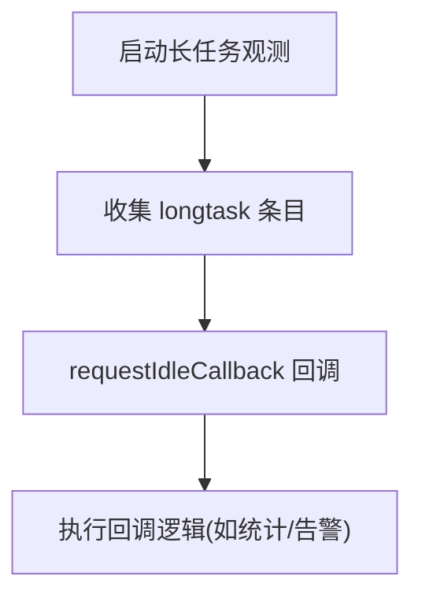
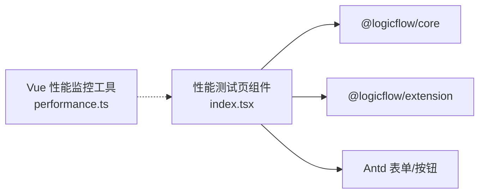

# 大数据量优化

<cite>
**本文引用的文件**
- [README.md](file://README.md)
- [examples/feature-examples/src/pages/performance/snapshot-elements/index.tsx](file://examples/feature-examples/src/pages/performance/snapshot-elements/index.tsx)
- [examples/feature-examples/src/pages/performance/snapshot-elements/index.less](file://examples/feature-examples/src/pages/performance/snapshot-elements/index.less)
- [examples/vue3-app/src/utils/performance.ts](file://examples/vue3-app/src/utils/performance.ts)
- [examples/feature-examples/src/pages/layout/default/index.tsx](file://examples/feature-examples/src/pages/layout/default/index.tsx)
</cite>

## 目录
1. [简介](#简介)
2. [项目结构](#项目结构)
3. [核心组件](#核心组件)
4. [架构总览](#架构总览)
5. [详细组件分析](#详细组件分析)
6. [依赖分析](#依赖分析)
7. [性能考量](#性能考量)
8. [故障排查指南](#故障排查指南)
9. [结论](#结论)
10. [附录](#附录)

## 简介
本指南聚焦于在超大规模流程图（数千节点与连接）场景下的性能优化实践，围绕分页加载、按需渲染、数据分片、索引与查询加速、滚动容器与虚拟化、布局算法优化、数据结构选型以及实证对比等维度，结合仓库中的示例与工具，给出可落地的优化策略与参考路径。

## 项目结构
该仓库采用多示例工程组织，其中与性能直接相关的关键模块包括：
- 性能测试页：用于构造大规模节点/边集合，验证渲染与导出性能
- Vue 性能监控工具：提供 DOM 数量统计与长任务观察能力
- 默认布局示例：展示复杂流程图的布局与交互基础能力

图表来源
- [examples/feature-examples/src/pages/performance/snapshot-elements/index.tsx](file://examples/feature-examples/src/pages/performance/snapshot-elements/index.tsx#L1-L445)
- [examples/feature-examples/src/pages/performance/snapshot-elements/index.less](file://examples/feature-examples/src/pages/performance/snapshot-elements/index.less#L1-L6)
- [examples/vue3-app/src/utils/performance.ts](file://examples/vue3-app/src/utils/performance.ts#L1-L28)
- [examples/feature-examples/src/pages/layout/default/index.tsx](file://examples/feature-examples/src/pages/layout/default/index.tsx#L1-L800)

章节来源
- [README.md](file://README.md#L1-L37)

## 核心组件
- 大规模节点/边生成器：通过参数化批量创建节点与连线，支持动态调整元素数量以评估渲染性能
- 小地图与快照扩展：提供局部渲染与导出能力，便于在大数据量场景下控制渲染范围与输出体积
- DOM 统计与长任务观测：用于量化渲染开销与主线程阻塞风险
- 布局与交互基座：提供布局方向、对齐方式等配置，支撑后续在大数据量下的布局优化

章节来源
- [examples/feature-examples/src/pages/performance/snapshot-elements/index.tsx](file://examples/feature-examples/src/pages/performance/snapshot-elements/index.tsx#L103-L160)
- [examples/feature-examples/src/pages/performance/snapshot-elements/index.tsx](file://examples/feature-examples/src/pages/performance/snapshot-elements/index.tsx#L47-L53)
- [examples/feature-examples/src/pages/performance/snapshot-elements/index.tsx](file://examples/feature-examples/src/pages/performance/snapshot-elements/index.tsx#L210-L232)
- [examples/vue3-app/src/utils/performance.ts](file://examples/vue3-app/src/utils/performance.ts#L1-L28)
- [examples/feature-examples/src/pages/layout/default/index.tsx](file://examples/feature-examples/src/pages/layout/default/index.tsx#L12-L27)

## 架构总览
以下序列图展示了“大数据量渲染与导出”的典型调用链路，涵盖节点/边生成、渲染、小地图联动与快照导出：

图表来源
- [examples/feature-examples/src/pages/performance/snapshot-elements/index.tsx](file://examples/feature-examples/src/pages/performance/snapshot-elements/index.tsx#L73-L98)
- [examples/feature-examples/src/pages/performance/snapshot-elements/index.tsx](file://examples/feature-examples/src/pages/performance/snapshot-elements/index.tsx#L153-L160)
- [examples/feature-examples/src/pages/performance/snapshot-elements/index.tsx](file://examples/feature-examples/src/pages/performance/snapshot-elements/index.tsx#L162-L194)
- [examples/feature-examples/src/pages/performance/snapshot-elements/index.tsx](file://examples/feature-examples/src/pages/performance/snapshot-elements/index.tsx#L210-L232)

## 详细组件分析

### 组件一：大规模节点/边生成与渲染
- 功能要点
  - 通过回调函数批量生成节点与连线，支持按元素数量动态扩容
  - 渲染时传入完整数据集，并在数量变化后重新渲染
  - 使用局部渲染参数控制导出范围，降低大图导出成本
- 性能影响
  - 节点/边数量与渲染开销呈近似线性关系，建议结合分页/懒加载策略
  - 大批量一次性渲染可能引发主线程阻塞，应配合空闲调度与分帧渲染

图表来源
- [examples/feature-examples/src/pages/performance/snapshot-elements/index.tsx](file://examples/feature-examples/src/pages/performance/snapshot-elements/index.tsx#L103-L160)
- [examples/feature-examples/src/pages/performance/snapshot-elements/index.tsx](file://examples/feature-examples/src/pages/performance/snapshot-elements/index.tsx#L210-L232)

章节来源
- [examples/feature-examples/src/pages/performance/snapshot-elements/index.tsx](file://examples/feature-examples/src/pages/performance/snapshot-elements/index.tsx#L103-L160)
- [examples/feature-examples/src/pages/performance/snapshot-elements/index.tsx](file://examples/feature-examples/src/pages/performance/snapshot-elements/index.tsx#L210-L232)

### 组件二：小地图与快照扩展
- 功能要点
  - 小地图插件支持显示/隐藏、位置更新、连线显示开关与重置
  - 快照插件支持多种格式、背景色、尺寸、内边距与质量参数，支持局部渲染
- 性能影响
  - 局部渲染可显著降低导出与预览的计算与内存占用
  - 小地图联动有助于在大画布中快速定位，减少全量渲染频率

图表来源
- [examples/feature-examples/src/pages/performance/snapshot-elements/index.tsx](file://examples/feature-examples/src/pages/performance/snapshot-elements/index.tsx#L162-L194)
- [examples/feature-examples/src/pages/performance/snapshot-elements/index.tsx](file://examples/feature-examples/src/pages/performance/snapshot-elements/index.tsx#L210-L232)

章节来源
- [examples/feature-examples/src/pages/performance/snapshot-elements/index.tsx](file://examples/feature-examples/src/pages/performance/snapshot-elements/index.tsx#L47-L53)
- [examples/feature-examples/src/pages/performance/snapshot-elements/index.tsx](file://examples/feature-examples/src/pages/performance/snapshot-elements/index.tsx#L162-L194)
- [examples/feature-examples/src/pages/performance/snapshot-elements/index.tsx](file://examples/feature-examples/src/pages/performance/snapshot-elements/index.tsx#L210-L232)

### 组件三：DOM 数量统计与长任务观测
- 功能要点
  - 提供页面 DOM 节点总数统计，辅助评估渲染体量
  - 观测长任务，识别主线程阻塞，指导分帧与空闲调度
- 性能影响
  - 高 DOM 数量会放大样式计算与合成成本，应避免一次性创建过多节点
  - 长任务观测可作为性能回归与优化效果的量化指标

图表来源
- [examples/vue3-app/src/utils/performance.ts](file://examples/vue3-app/src/utils/performance.ts#L17-L27)

章节来源
- [examples/vue3-app/src/utils/performance.ts](file://examples/vue3-app/src/utils/performance.ts#L1-L28)

### 组件四：布局与交互基座
- 功能要点
  - 提供布局方向与对齐方式配置，支撑复杂流程图的布局策略
  - 作为后续在大数据量场景下进行布局优化的基础
- 性能影响
  - 合理的布局方向与对齐策略可减少连线交叉与重叠，间接降低渲染压力

章节来源
- [examples/feature-examples/src/pages/layout/default/index.tsx](file://examples/feature-examples/src/pages/layout/default/index.tsx#L12-L27)

## 依赖分析
- 组件耦合
  - 性能测试页组件与 LogicFlow 实例强耦合，负责数据生成与渲染调度
  - 小地图与快照扩展作为插件与实例交互，形成松耦合扩展点
  - Vue 性能监控工具独立存在，可被任意页面引用，降低侵入性
- 外部依赖
  - @logicflow/core 与 @logicflow/extension 提供核心渲染与扩展能力
  - Ant Design 组件库用于表单与按钮等 UI 控件

图表来源
- [examples/feature-examples/src/pages/performance/snapshot-elements/index.tsx](file://examples/feature-examples/src/pages/performance/snapshot-elements/index.tsx#L1-L27)
- [examples/vue3-app/src/utils/performance.ts](file://examples/vue3-app/src/utils/performance.ts#L1-L28)

章节来源
- [examples/feature-examples/src/pages/performance/snapshot-elements/index.tsx](file://examples/feature-examples/src/pages/performance/snapshot-elements/index.tsx#L1-L27)
- [examples/vue3-app/src/utils/performance.ts](file://examples/vue3-app/src/utils/performance.ts#L1-L28)

## 性能考量
- 分页加载与按需渲染
  - 将超大规模数据拆分为多个“页”，仅在可视区域或即将进入可视区域时渲染
  - 结合 IntersectionObserver 或滚动容器监听，实现“临近渲染”
- 数据分片
  - 对节点/边进行分片管理，按需加载与释放，避免一次性构建完整索引
  - 使用弱引用或延迟初始化减少初始内存峰值
- 索引与查询加速
  - 为节点/边建立多维索引（如坐标网格、类型分组、邻接关系）
  - 查询时优先使用索引，避免全量扫描；对热点数据做缓存
- 滚动容器与虚拟化
  - 使用固定尺寸的滚动容器，限制渲染边界
  - 虚拟列表：仅渲染可见区域节点/边，随滚动动态复用 DOM
- 布局算法优化
  - 在大数据量场景下优先选择 O(n log n) 或线性近似复杂度的布局
  - 分层布局（如层级方向可控）可减少跨层连线，降低渲染与合成成本
- 数据结构选型
  - 使用稀疏矩阵/邻接表表示图结构，避免稠密矩阵的空间浪费
  - 采用不可变数据结构与结构共享，降低变更传播成本
- 实证与对比
  - 以本仓库的“元素数量”参数为变量，记录渲染耗时、帧率、DOM 数量与长任务占比
  - 对比开启/关闭局部渲染、虚拟化、分片加载等策略的性能差异

## 故障排查指南
- 渲染卡顿与掉帧
  - 使用长任务观测识别阻塞点，结合空闲调度与分帧渲染
  - 减少一次性创建的 DOM 数量，启用虚拟化与分页
- 导出失败或体积过大
  - 使用局部渲染参数缩小导出范围
  - 调整导出格式与质量参数，平衡清晰度与体积
- 小地图不显示或位置异常
  - 检查小地图插件初始化与位置更新调用顺序
  - 确认主画布已渲染后再进行联动更新

章节来源
- [examples/vue3-app/src/utils/performance.ts](file://examples/vue3-app/src/utils/performance.ts#L17-L27)
- [examples/feature-examples/src/pages/performance/snapshot-elements/index.tsx](file://examples/feature-examples/src/pages/performance/snapshot-elements/index.tsx#L162-L194)
- [examples/feature-examples/src/pages/performance/snapshot-elements/index.tsx](file://examples/feature-examples/src/pages/performance/snapshot-elements/index.tsx#L210-L232)

## 结论
在超大规模流程图场景下，性能优化应以“分页/虚拟化 + 按需渲染 + 索引加速 + 布局优化 + 数据结构选型”为核心策略。结合本仓库提供的示例与工具，可系统地评估与对比不同优化手段的效果，形成可复用的工程化方案。

## 附录
- 参考路径
  - 大规模渲染与导出：[性能测试页组件](file://examples/feature-examples/src/pages/performance/snapshot-elements/index.tsx#L103-L160)
  - 小地图与快照联动：[小地图与快照调用](file://examples/feature-examples/src/pages/performance/snapshot-elements/index.tsx#L162-L194), [导出参数](file://examples/feature-examples/src/pages/performance/snapshot-elements/index.tsx#L210-L232)
  - DOM 数量与长任务观测：[性能工具](file://examples/vue3-app/src/utils/performance.ts#L1-L28)
  - 布局与交互基座：[布局配置](file://examples/feature-examples/src/pages/layout/default/index.tsx#L12-L27)