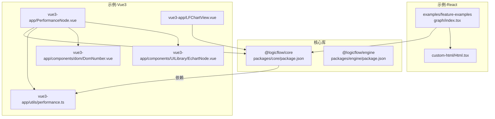
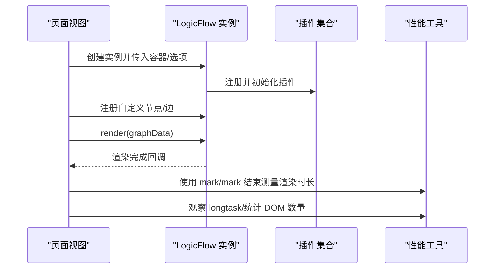
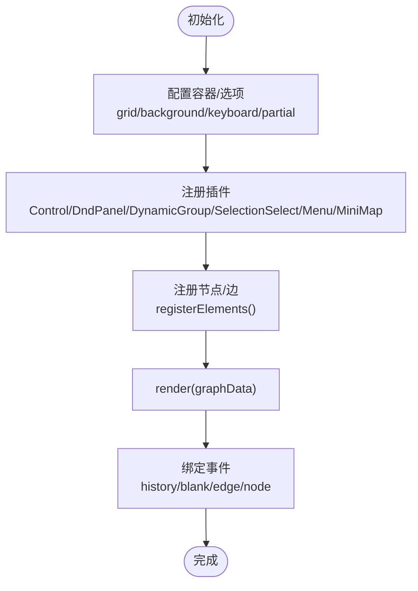
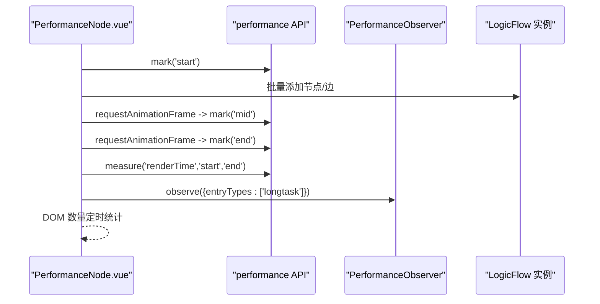
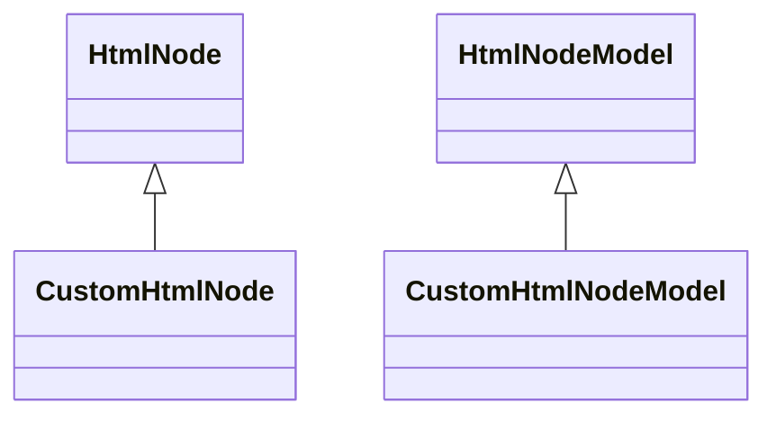
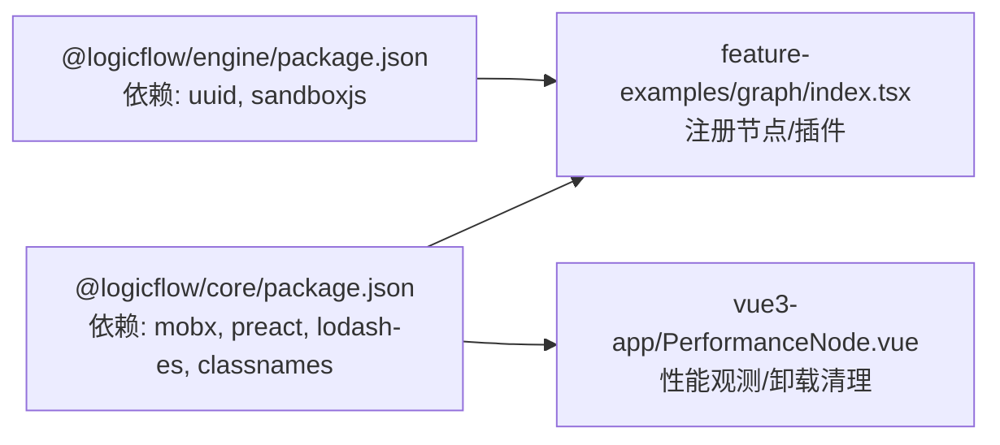

# 性能优化

<cite>
**本文引用的文件**
- [packages/core/package.json](file://packages/core/package.json)
- [packages/engine/package.json](file://packages/engine/package.json)
- [examples/feature-examples/src/pages/graph/index.tsx](file://examples/feature-examples/src/pages/graph/index.tsx)
- [examples/feature-examples/src/components/nodes/custom-html/Html.tsx](file://examples/feature-examples/src/components/nodes/custom-html/Html.tsx)
- [examples/vue3-app/src/views/PerformanceNode.vue](file://examples/vue3-app/src/views/PerformanceNode.vue)
- [examples/vue3-app/src/utils/performance.ts](file://examples/vue3-app/src/utils/performance.ts)
- [examples/vue3-app/src/views/LFChartView.vue](file://examples/vue3-app/src/views/LFChartView.vue)
- [examples/vue3-app/src/components/dom/DomNumber.vue](file://examples/vue3-app/src/components/dom/DomNumber.vue)
- [examples/vue3-app/src/components/UILibrary/EchartNode.vue](file://examples/vue3-app/src/components/UILibrary/EchartNode.vue)
</cite>

## 目录
1. [简介](#简介)
2. [项目结构](#项目结构)
3. [核心组件](#核心组件)
4. [架构总览](#架构总览)
5. [详细组件分析](#详细组件分析)
6. [依赖关系分析](#依赖关系分析)
7. [性能考量与优化建议](#性能考量与优化建议)
8. [故障排查指南](#故障排查指南)
9. [结论](#结论)
10. [附录](#附录)

## 简介
本指南聚焦于大型流程图在前端的性能优化，结合仓库中的实际实现，系统阐述渲染性能优化策略（虚拟化、懒加载、增量更新）、内存管理最佳实践（内存泄漏预防与检测）、图形渲染瓶颈与优化方法、性能监控与分析工具使用、大数据量场景优化案例、跨浏览器兼容性表现、缓存与资源加载优化，并给出面向性能工程师的专业参考，确保在不同硬件配置下流畅运行。

## 项目结构
该项目采用多包结构，核心逻辑位于 packages/*，示例工程位于 examples/*，其中：
- packages/core：LogicFlow 核心库，提供流程图渲染、交互、主题、扩展等能力
- packages/engine：流程引擎相关能力
- examples/feature-examples：React 示例，涵盖节点/边注册、插件集成、主题与交互
- examples/vue3-app：Vue3 示例，包含性能测试视图、长任务观察、小地图、卸载清理等

**图表来源**
- [packages/core/package.json](file://packages/core/package.json#L42-L51)
- [packages/engine/package.json](file://packages/engine/package.json#L42-L48)
- [examples/feature-examples/src/pages/graph/index.tsx](file://examples/feature-examples/src/pages/graph/index.tsx#L1-L800)
- [examples/feature-examples/src/components/nodes/custom-html/Html.tsx](file://examples/feature-examples/src/components/nodes/custom-html/Html.tsx#L1-L62)
- [examples/vue3-app/src/views/PerformanceNode.vue](file://examples/vue3-app/src/views/PerformanceNode.vue#L1-L270)
- [examples/vue3-app/src/utils/performance.ts](file://examples/vue3-app/src/utils/performance.ts#L1-L28)
- [examples/vue3-app/src/views/LFChartView.vue](file://examples/vue3-app/src/views/LFChartView.vue#L1-L259)
- [examples/vue3-app/src/components/dom/DomNumber.vue](file://examples/vue3-app/src/components/dom/DomNumber.vue#L1-L22)
- [examples/vue3-app/src/components/UILibrary/EchartNode.vue](file://examples/vue3-app/src/components/UILibrary/EchartNode.vue#L1-L22)

**章节来源**
- [packages/core/package.json](file://packages/core/package.json#L1-L57)
- [packages/engine/package.json](file://packages/engine/package.json#L1-L50)
- [examples/feature-examples/src/pages/graph/index.tsx](file://examples/feature-examples/src/pages/graph/index.tsx#L1-L800)
- [examples/vue3-app/src/views/PerformanceNode.vue](file://examples/vue3-app/src/views/PerformanceNode.vue#L1-L270)

## 核心组件
- 渲染与交互核心：LogicFlow 实例负责容器挂载、主题设置、插件注册、数据渲染与交互事件绑定
- 节点与边注册：通过 register 或 registerElements 将自定义节点/边注册到实例，支持 React/Vue 组件节点
- 插件体系：控制面板、拖拽面板、动态分组、选择、菜单、小地图等插件按需启用
- 性能观测：长任务观察、DOM 数量统计、渲染时长测量（mark/measure）

**章节来源**
- [examples/feature-examples/src/pages/graph/index.tsx](file://examples/feature-examples/src/pages/graph/index.tsx#L566-L732)
- [examples/vue3-app/src/views/PerformanceNode.vue](file://examples/vue3-app/src/views/PerformanceNode.vue#L189-L261)
- [examples/vue3-app/src/utils/performance.ts](file://examples/vue3-app/src/utils/performance.ts#L1-L28)

## 架构总览
下图展示了从页面到渲染的核心调用链路，以及性能观测点：

**图表来源**
- [examples/feature-examples/src/pages/graph/index.tsx](file://examples/feature-examples/src/pages/graph/index.tsx#L617-L732)
- [examples/vue3-app/src/views/PerformanceNode.vue](file://examples/vue3-app/src/views/PerformanceNode.vue#L103-L151)
- [examples/vue3-app/src/utils/performance.ts](file://examples/vue3-app/src/utils/performance.ts#L17-L27)

## 详细组件分析

### React 示例：图形渲染与插件集成
- 容器与选项：通过容器引用与配置对象初始化 LogicFlow，开启网格、背景、键盘快捷键、部分渲染等
- 插件注册：控制、拖拽面板、动态分组、选择、菜单、小地图等插件统一注册
- 节点/边注册：集中调用 registerElements，批量注册自定义节点与边
- 事件监听：历史变更、空白处释放、节点/边点击等事件便于调试与扩展
- 主题与样式：可设置主题模式、边样式、文本溢出策略等

**图表来源**
- [examples/feature-examples/src/pages/graph/index.tsx](file://examples/feature-examples/src/pages/graph/index.tsx#L566-L732)

**章节来源**
- [examples/feature-examples/src/pages/graph/index.tsx](file://examples/feature-examples/src/pages/graph/index.tsx#L50-L88)
- [examples/feature-examples/src/pages/graph/index.tsx](file://examples/feature-examples/src/pages/graph/index.tsx#L575-L597)
- [examples/feature-examples/src/pages/graph/index.tsx](file://examples/feature-examples/src/pages/graph/index.tsx#L598-L615)
- [examples/feature-examples/src/pages/graph/index.tsx](file://examples/feature-examples/src/pages/graph/index.tsx#L617-L732)

### Vue3 示例：性能测试与长任务观察
- DOM 数量统计：实时统计页面内元素总数，辅助评估节点/边渲染对 DOM 的影响
- 渲染时长测量：使用 performance.mark/mark/end 与 measure 记录渲染耗时
- 长任务观察：通过 PerformanceObserver 监听 longtask，识别主线程阻塞
- 节点类型：包含普通 DOM 节点、ECharts 图表节点，用于对比不同节点类型的开销
- 卸载清理：在组件卸载时销毁实例，避免内存泄漏

**图表来源**
- [examples/vue3-app/src/views/PerformanceNode.vue](file://examples/vue3-app/src/views/PerformanceNode.vue#L103-L151)
- [examples/vue3-app/src/utils/performance.ts](file://examples/vue3-app/src/utils/performance.ts#L17-L27)

**章节来源**
- [examples/vue3-app/src/views/PerformanceNode.vue](file://examples/vue3-app/src/views/PerformanceNode.vue#L1-L270)
- [examples/vue3-app/src/utils/performance.ts](file://examples/vue3-app/src/utils/performance.ts#L1-L28)
- [examples/vue3-app/src/views/LFChartView.vue](file://examples/vue3-app/src/views/LFChartView.vue#L239-L245)

### HTML 节点实现：原生 DOM 嵌入
- 自定义 HTML 节点通过 HtmlNode/HtmlNodeModel 设置 setHtml，直接向 foreignObject 写入 DOM
- 适合需要原生交互或第三方组件的场景，但会增加 DOM 数量与重排风险
- 建议限制尺寸、减少频繁更新、避免在 setHtml 中执行重计算

**图表来源**
- [examples/feature-examples/src/components/nodes/custom-html/Html.tsx](file://examples/feature-examples/src/components/nodes/custom-html/Html.tsx#L14-L61)

**章节来源**
- [examples/feature-examples/src/components/nodes/custom-html/Html.tsx](file://examples/feature-examples/src/components/nodes/custom-html/Html.tsx#L1-L62)

## 依赖关系分析
- @logicflow/core 作为渲染核心，依赖 mobx/preact/lodash-es/classnames 等，注意其版本与打包产物
- @logicflow/engine 提供浏览器端平台替换与脚本执行能力，关注沙箱与安全边界
- 示例层通过 react-node-registry 或 vue-node-registry 注册自定义节点，降低耦合度

**图表来源**
- [packages/core/package.json](file://packages/core/package.json#L42-L51)
- [packages/engine/package.json](file://packages/engine/package.json#L42-L48)
- [examples/feature-examples/src/pages/graph/index.tsx](file://examples/feature-examples/src/pages/graph/index.tsx#L575-L597)
- [examples/vue3-app/src/views/PerformanceNode.vue](file://examples/vue3-app/src/views/PerformanceNode.vue#L189-L261)

**章节来源**
- [packages/core/package.json](file://packages/core/package.json#L1-L57)
- [packages/engine/package.json](file://packages/engine/package.json#L1-L50)
- [examples/feature-examples/src/pages/graph/index.tsx](file://examples/feature-examples/src/pages/graph/index.tsx#L1-L800)
- [examples/vue3-app/src/views/PerformanceNode.vue](file://examples/vue3-app/src/views/PerformanceNode.vue#L1-L270)

## 性能考量与优化建议

### 虚拟化与懒加载
- 大型流程图建议启用部分渲染（partial）与可视区域裁剪，仅渲染可见节点/边
- 对于超大图，可采用分页/分块加载策略，按需渲染相邻子图
- 节点内容懒加载：HTML/Vue/React 节点在进入视口时再挂载，退出视口时卸载

### 增量更新
- 使用 setProperties/setNodeType 等局部更新接口，避免全量 render
- 合理拆分节点组件，减少不必要的重渲染；对复杂节点采用浅比较与 memo 化

### 内存管理与泄漏预防
- 卸载清理：在组件卸载或路由切换时调用实例销毁，确保清除事件、定时器与 DOM 引用
- DOM 数量监控：定期统计页面元素数，异常增长时检查节点是否重复创建或未正确销毁
- 长任务观察：识别主线程阻塞，必要时将重计算移至 Web Worker 或推迟到空闲时段

### 图形渲染瓶颈与优化
- 减少复杂边：大量圆角/偏移/动画边会显著增加绘制成本，优先使用简单折线
- 控制节点尺寸与层级：避免过大的 foreignObject/嵌套 DOM，减少重排与重绘
- 插件按需启用：仅启用必要的插件，减少额外状态与渲染开销

### 性能监控与分析工具
- 使用 performance.mark/measure 测量渲染阶段耗时
- 使用 PerformanceObserver 监控 longtask，定位主线程卡顿
- 使用浏览器开发者工具的 Performance/Rendering 面板进行帧率与布局分析

### 大数据量场景优化案例
- 批量添加节点：使用 requestAnimationFrame 分片插入，避免单帧过多 DOM 操作
- 统计 DOM 数量：在添加后立即统计，验证渲染对 DOM 的影响
- 清空与复用：提供一键清空功能，复用实例而非频繁重建

### 跨浏览器兼容性
- 不同浏览器的合成器与布局引擎差异会影响渲染性能，建议在主流浏览器中进行基准测试
- 注意 CSS 动画与 transform 的硬件加速差异，优先使用 transform/opacity

### 缓存与资源加载优化
- 节点图标/图片采用 CDN 与缓存策略，减少网络抖动带来的首屏延迟
- 按需引入样式与插件，避免一次性加载过多资源

**章节来源**
- [examples/vue3-app/src/views/PerformanceNode.vue](file://examples/vue3-app/src/views/PerformanceNode.vue#L103-L151)
- [examples/vue3-app/src/utils/performance.ts](file://examples/vue3-app/src/utils/performance.ts#L17-L27)
- [examples/vue3-app/src/views/LFChartView.vue](file://examples/vue3-app/src/views/LFChartView.vue#L239-L245)

## 故障排查指南
- 渲染缓慢
  - 使用 mark/measure 定位渲染阶段耗时，检查是否存在大量复杂边或节点
  - 关闭非必要插件，启用 partial 渲染
- 主线程卡顿
  - 观察 longtask，将重计算/数据处理移至空闲时段或 Web Worker
- 内存泄漏
  - 确认组件卸载时调用销毁；统计 DOM 数量，异常增长时回溯节点创建路径
- 小地图/迷你视图不显示
  - 检查插件注册顺序与 show/hide 调用时机

**章节来源**
- [examples/vue3-app/src/views/PerformanceNode.vue](file://examples/vue3-app/src/views/PerformanceNode.vue#L171-L177)
- [examples/vue3-app/src/views/LFChartView.vue](file://examples/vue3-app/src/views/LFChartView.vue#L231-L238)
- [examples/vue3-app/src/utils/performance.ts](file://examples/vue3-app/src/utils/performance.ts#L17-L27)

## 结论
通过合理的渲染策略（部分渲染、增量更新、懒加载）、严格的内存管理（卸载清理、DOM 监控、长任务观察）、有针对性的图形优化（简化边/节点、插件按需启用），以及完善的性能监控与分析工具，可在不同硬件与浏览器环境下获得稳定流畅的流程图体验。建议在开发与上线前进行基准测试与回归验证，持续迭代优化。

## 附录
- 关键实现位置索引
  - React 示例：[graph/index.tsx](file://examples/feature-examples/src/pages/graph/index.tsx#L566-L732)
  - Vue3 性能视图：[PerformanceNode.vue](file://examples/vue3-app/src/views/PerformanceNode.vue#L1-L270)
  - 长任务观察：[performance.ts](file://examples/vue3-app/src/utils/performance.ts#L1-L28)
  - 小地图与卸载：[LFChartView.vue](file://examples/vue3-app/src/views/LFChartView.vue#L231-L245)
  - HTML 节点：[Html.tsx](file://examples/feature-examples/src/components/nodes/custom-html/Html.tsx#L1-L62)
  - 核心依赖：[@logicflow/core/package.json](file://packages/core/package.json#L42-L51)、[@logicflow/engine/package.json](file://packages/engine/package.json#L42-L48)