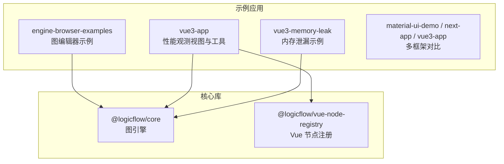
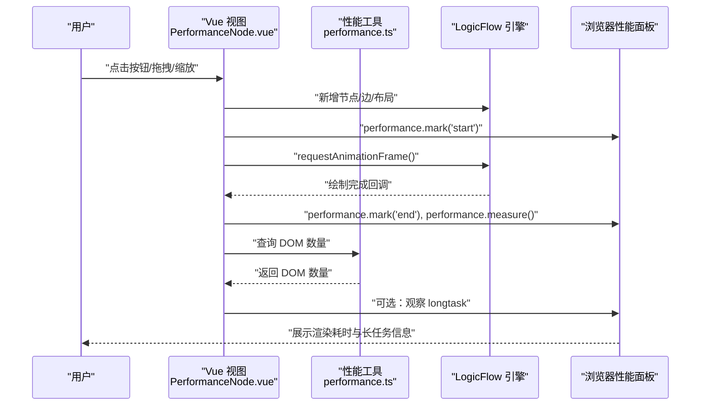
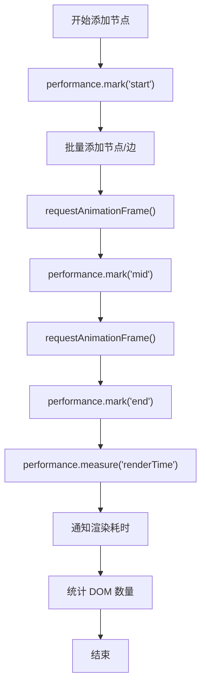
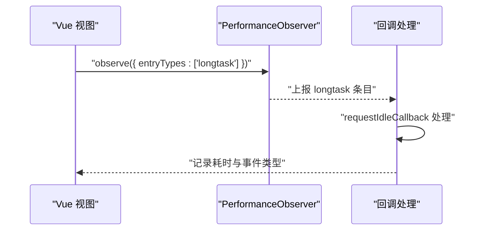
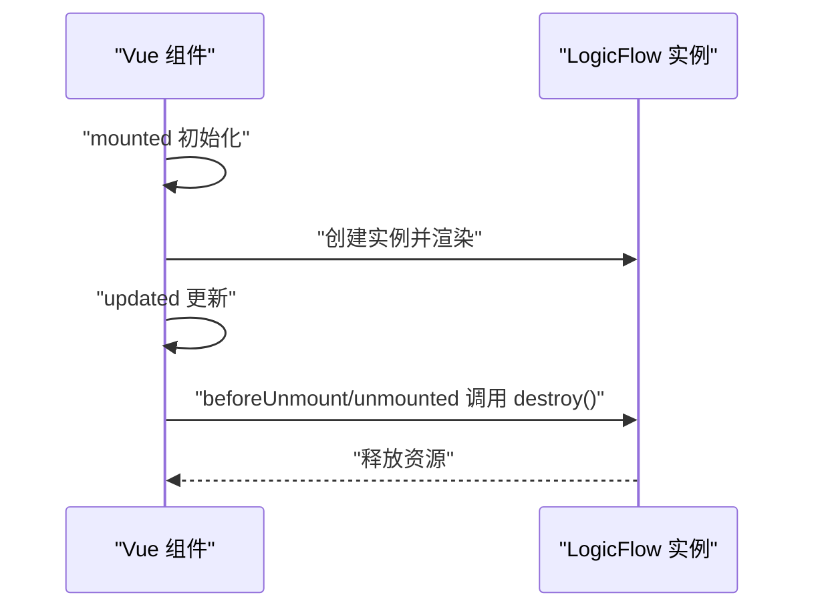
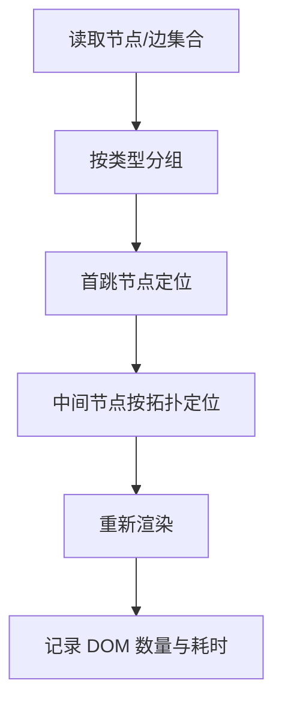
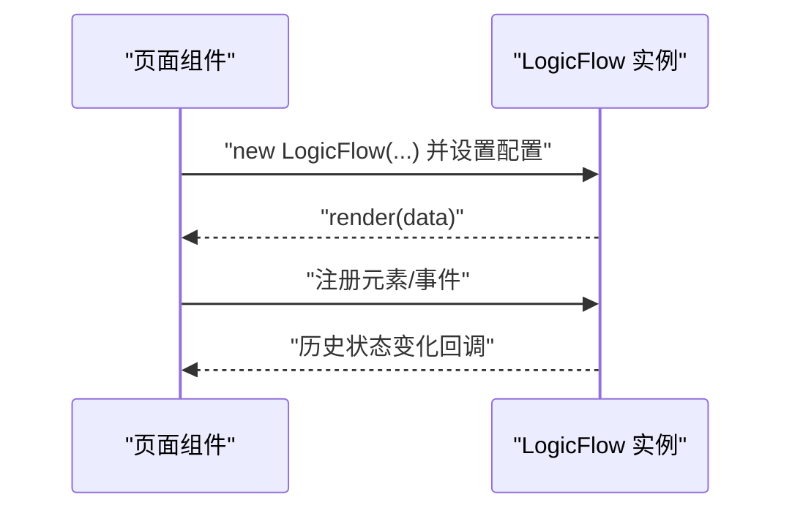
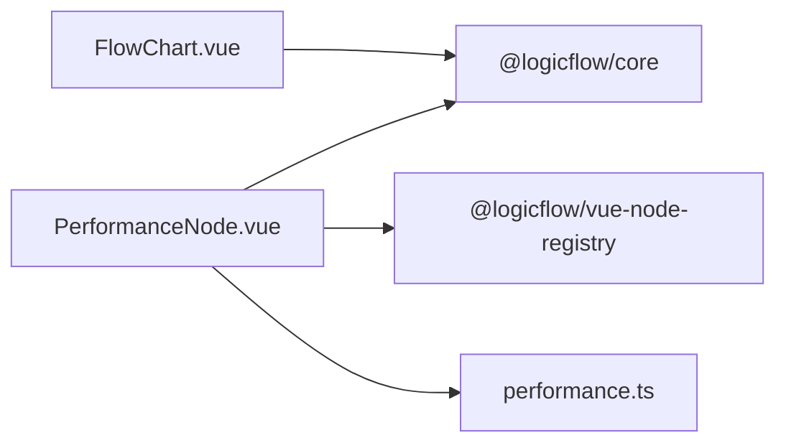

# 性能监控与分析

<cite>
**本文引用的文件**
- [examples/engine-browser-examples/src/pages/graph/index.tsx](file://examples/engine-browser-examples/src/pages/graph/index.tsx)
- [examples/vue3-app/src/views/PerformanceNode.vue](file://examples/vue3-app/src/views/PerformanceNode.vue)
- [examples/vue3-app/src/utils/performance.ts](file://examples/vue3-app/src/utils/performance.ts)
- [examples/vue3-memory-leak/src/components/FlowChart.vue](file://examples/vue3-memory-leak/src/components/FlowChart.vue)
- [examples/vue3-app/src/components/chart/graph.ts](file://examples/vue3-app/src/components/chart/graph.ts)
- [examples/vue3-app/README.md](file://examples/vue3-app/README.md)
- [examples/vue3-memory-leak/README.md](file://examples/vue3-memory-leak/README.md)
</cite>

## 目录
1. [简介](#简介)
2. [项目结构](#项目结构)
3. [核心组件](#核心组件)
4. [架构总览](#架构总览)
5. [详细组件分析](#详细组件分析)
6. [依赖关系分析](#依赖关系分析)
7. [性能考量](#性能考量)
8. [故障排查指南](#故障排查指南)
9. [结论](#结论)
10. [附录](#附录)

## 简介
本指南围绕本仓库中的前端示例应用，系统性地介绍性能监控与分析的方法论与实践路径，涵盖以下主题：
- 关键性能指标：Web Vitals（如 LCP、FID、CLS）、FPS、内存使用率等的测量思路与落地方式
- 浏览器开发者工具的使用技巧：Timeline、Performance、Memory 面板的观测要点
- 自定义埋点：渲染时间、交互延迟、DOM 数量与内存变化的追踪方案
- 基准测试：如何设计与执行可重复的性能测试
- 不同硬件配置下的性能差异评估
- 性能回归检测与持续集成中的监控策略
- 报告模板与最佳实践

本指南以仓库内的示例工程为依据，结合实际代码位置进行说明，帮助性能工程师快速建立从采集、分析到回归治理的闭环。

## 项目结构
本仓库包含多个示例应用，其中与性能监控直接相关的关键目录如下：
- examples/engine-browser-examples：包含 LogicFlow 图编辑器的浏览器示例，适合观察交互与渲染性能
- examples/vue3-app：包含性能观测视图与工具函数，适合演示 DOM 数量、渲染时间与长任务监控
- examples/vue3-memory-leak：包含 LogicFlow 的内存泄漏示例，适合演示内存增长与清理策略
- examples/material-ui-demo、examples/next-app、examples/vue3-app 等：提供多框架示例，便于横向对比

**图表来源**
- [examples/engine-browser-examples/src/pages/graph/index.tsx](file://examples/engine-browser-examples/src/pages/graph/index.tsx#L1-L567)
- [examples/vue3-app/src/views/PerformanceNode.vue](file://examples/vue3-app/src/views/PerformanceNode.vue#L1-L270)
- [examples/vue3-memory-leak/src/components/FlowChart.vue](file://examples/vue3-memory-leak/src/components/FlowChart.vue#L1-L225)

**章节来源**
- [examples/engine-browser-examples/src/pages/graph/index.tsx](file://examples/engine-browser-examples/src/pages/graph/index.tsx#L1-L567)
- [examples/vue3-app/src/views/PerformanceNode.vue](file://examples/vue3-app/src/views/PerformanceNode.vue#L1-L270)
- [examples/vue3-memory-leak/src/components/FlowChart.vue](file://examples/vue3-memory-leak/src/components/FlowChart.vue#L1-L225)

## 核心组件
- 图编辑器渲染与交互：engine-browser-examples 展示了 LogicFlow 的初始化、主题设置、元素注册与交互事件绑定，是评估渲染与交互性能的重要入口
- 性能观测视图：vue3-app 的 PerformanceNode.vue 使用 performance.mark/measures 记录渲染耗时，并通过 DOM 数量统计辅助分析渲染压力
- 长任务监控：vue3-app 的 performance 工具函数提供了 longtask 观察器，用于识别主线程阻塞
- 内存泄漏示例：vue3-memory-leak 的 FlowChart.vue 展示了组件生命周期与销毁逻辑，便于验证内存释放

**章节来源**
- [examples/engine-browser-examples/src/pages/graph/index.tsx](file://examples/engine-browser-examples/src/pages/graph/index.tsx#L157-L232)
- [examples/vue3-app/src/views/PerformanceNode.vue](file://examples/vue3-app/src/views/PerformanceNode.vue#L101-L153)
- [examples/vue3-app/src/utils/performance.ts](file://examples/vue3-app/src/utils/performance.ts#L17-L27)
- [examples/vue3-memory-leak/src/components/FlowChart.vue](file://examples/vue3-memory-leak/src/components/FlowChart.vue#L169-L172)

## 架构总览
下图展示了性能观测在示例应用中的整体流程：用户交互触发渲染，浏览器记录渲染时间与长任务，同时统计 DOM 数量与内存变化，最终输出性能报告。

**图表来源**
- [examples/vue3-app/src/views/PerformanceNode.vue](file://examples/vue3-app/src/views/PerformanceNode.vue#L101-L153)
- [examples/vue3-app/src/utils/performance.ts](file://examples/vue3-app/src/utils/performance.ts#L5-L5)
- [examples/engine-browser-examples/src/pages/graph/index.tsx](file://examples/engine-browser-examples/src/pages/graph/index.tsx#L157-L232)

## 详细组件分析

### 渲染时间与交互延迟追踪（Vue 视图）
- 渲染时间：通过在批量添加节点前后打点，利用 requestAnimationFrame 进行“中点”标记，最后计算 measure 的 duration，得到渲染耗时
- 交互延迟：通过监听 wheel/click 等事件，记录事件类型，结合浏览器 Performance 面板分析输入到绘制的时间链路
- DOM 数量：周期性统计 document.querySelectorAll('*').length，作为渲染压力的代理指标

**图表来源**
- [examples/vue3-app/src/views/PerformanceNode.vue](file://examples/vue3-app/src/views/PerformanceNode.vue#L101-L153)
- [examples/vue3-app/src/utils/performance.ts](file://examples/vue3-app/src/utils/performance.ts#L5-L5)

**章节来源**
- [examples/vue3-app/src/views/PerformanceNode.vue](file://examples/vue3-app/src/views/PerformanceNode.vue#L101-L153)
- [examples/vue3-app/src/utils/performance.ts](file://examples/vue3-app/src/utils/performance.ts#L5-L5)

### 长任务监控（主线程阻塞识别）
- 使用 PerformanceObserver 监听 longtask，结合 requestIdleCallback 将处理逻辑延后到空闲时段，避免进一步阻塞主线程
- 适用于定位卡顿、滚动抖动、点击无响应等问题的根本原因

**图表来源**
- [examples/vue3-app/src/utils/performance.ts](file://examples/vue3-app/src/utils/performance.ts#L17-L27)

**章节来源**
- [examples/vue3-app/src/utils/performance.ts](file://examples/vue3-app/src/utils/performance.ts#L17-L27)

### 内存使用与泄漏检测（Vue 组件生命周期）
- 在组件卸载阶段调用 destroy()，确保 LogicFlow 实例与事件解绑，避免内存泄漏
- 结合浏览器 Memory 面板，观察堆内存曲线与对象保留情况，定位异常增长

**图表来源**
- [examples/vue3-memory-leak/src/components/FlowChart.vue](file://examples/vue3-memory-leak/src/components/FlowChart.vue#L169-L172)

**章节来源**
- [examples/vue3-memory-leak/src/components/FlowChart.vue](file://examples/vue3-memory-leak/src/components/FlowChart.vue#L169-L172)

### 图布局与渲染压力（类图布局示例）
- 通过自定义布局算法对节点进行分组与定位，减少大规模重排与重绘
- 建议在布局前后记录 DOM 数量与渲染时间，评估优化效果

**图表来源**
- [examples/vue3-app/src/components/chart/graph.ts](file://examples/vue3-app/src/components/chart/graph.ts#L24-L107)

**章节来源**
- [examples/vue3-app/src/components/chart/graph.ts](file://examples/vue3-app/src/components/chart/graph.ts#L24-L107)

### 图编辑器交互与渲染（浏览器示例）
- 初始化 LogicFlow，设置主题、网格、背景等参数，评估在不同配置下的渲染与交互表现
- 通过事件监听 history:change、节点/边选择等，观察交互延迟与状态变更成本

**图表来源**
- [examples/engine-browser-examples/src/pages/graph/index.tsx](file://examples/engine-browser-examples/src/pages/graph/index.tsx#L157-L232)

**章节来源**
- [examples/engine-browser-examples/src/pages/graph/index.tsx](file://examples/engine-browser-examples/src/pages/graph/index.tsx#L157-L232)

## 依赖关系分析
- Vue 视图层依赖 LogicFlow 与 Vue 节点注册库，负责渲染与交互
- 性能工具函数提供 DOM 数量统计与长任务观察能力
- 内存泄漏示例强调组件生命周期与实例销毁的重要性

**图表来源**
- [examples/vue3-app/src/views/PerformanceNode.vue](file://examples/vue3-app/src/views/PerformanceNode.vue#L34-L36)
- [examples/vue3-app/src/utils/performance.ts](file://examples/vue3-app/src/utils/performance.ts#L5-L5)
- [examples/vue3-memory-leak/src/components/FlowChart.vue](file://examples/vue3-memory-leak/src/components/FlowChart.vue#L3-L8)

**章节来源**
- [examples/vue3-app/src/views/PerformanceNode.vue](file://examples/vue3-app/src/views/PerformanceNode.vue#L34-L36)
- [examples/vue3-app/src/utils/performance.ts](file://examples/vue3-app/src/utils/performance.ts#L5-L5)
- [examples/vue3-memory-leak/src/components/FlowChart.vue](file://examples/vue3-memory-leak/src/components/FlowChart.vue#L3-L8)

## 性能考量
- 渲染时间
  - 使用 performance.mark/measures 记录关键帧，结合 requestAnimationFrame 精确测量
  - 对比不同主题、网格、背景等配置对渲染耗时的影响
- FPS 估算
  - 通过连续两帧的时间差估算瞬时 FPS，关注帧时间抖动
- 内存使用率
  - 结合浏览器 Memory 面板与 DOM 数量统计，识别异常增长
  - 在组件卸载时确保销毁实例与解绑事件
- 交互延迟
  - 监听 wheel/click/mousedown 等事件，结合 Performance 面板分析从输入到绘制的链路
- 长任务
  - 使用 PerformanceObserver 监听 longtask，定位主线程阻塞

[本节为通用指导，无需特定文件引用]

## 故障排查指南
- 渲染卡顿
  - 使用 Performance 面板查看长任务与主线程占用，结合 DOM 数量判断是否由过多节点/边导致
  - 通过分批渲染与虚拟化策略降低一次性渲染压力
- 交互迟滞
  - 检查事件回调中是否存在同步密集计算，必要时拆分为微任务或空闲任务
- 内存泄漏
  - 确认组件卸载时调用 destroy()，移除全局事件与定时器
  - 使用 Memory 面板观察堆快照差异，定位未释放对象
- 回归检测
  - 在 CI 中运行性能测试脚本，记录渲染时间、DOM 数量与内存峰值，设定阈值告警

**章节来源**
- [examples/vue3-memory-leak/src/components/FlowChart.vue](file://examples/vue3-memory-leak/src/components/FlowChart.vue#L169-L172)
- [examples/vue3-app/src/utils/performance.ts](file://examples/vue3-app/src/utils/performance.ts#L17-L27)

## 结论
本指南基于仓库中的示例应用，给出了从指标采集、工具使用到回归治理的完整路径。建议在实际项目中：
- 建立统一的性能埋点规范，覆盖渲染时间、交互延迟、DOM 数量与内存变化
- 在 CI 中集成性能测试，形成持续监控与回归预警机制
- 针对不同硬件配置制定基线与阈值，定期评估性能表现差异

[本节为总结，无需特定文件引用]

## 附录

### 浏览器开发者工具使用技巧
- Timeline：录制页面生命周期与交互过程，定位长任务与内存峰值
- Performance：查看帧时间、CPU 占用与调用栈，分析渲染瓶颈
- Memory：对比堆快照，识别泄漏与异常增长

**章节来源**
- [examples/vue3-app/README.md](file://examples/vue3-app/README.md#L23-L39)
- [examples/vue3-memory-leak/README.md](file://examples/vue3-memory-leak/README.md#L1-L12)

### 自定义性能埋点清单
- 渲染时间：打点开始/结束，measure duration，记录 DOM 数量
- 交互延迟：记录事件类型与时间戳，结合 Performance 面板分析
- 长任务：观察 longtask，必要时降级处理
- 内存变化：组件销毁前后记录堆快照与对象数量

**章节来源**
- [examples/vue3-app/src/views/PerformanceNode.vue](file://examples/vue3-app/src/views/PerformanceNode.vue#L101-L153)
- [examples/vue3-app/src/utils/performance.ts](file://examples/vue3-app/src/utils/performance.ts#L17-L27)