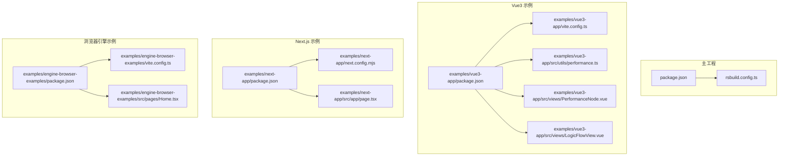
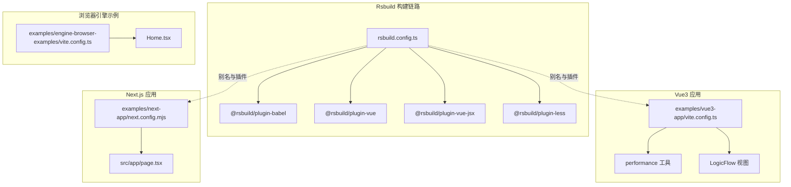
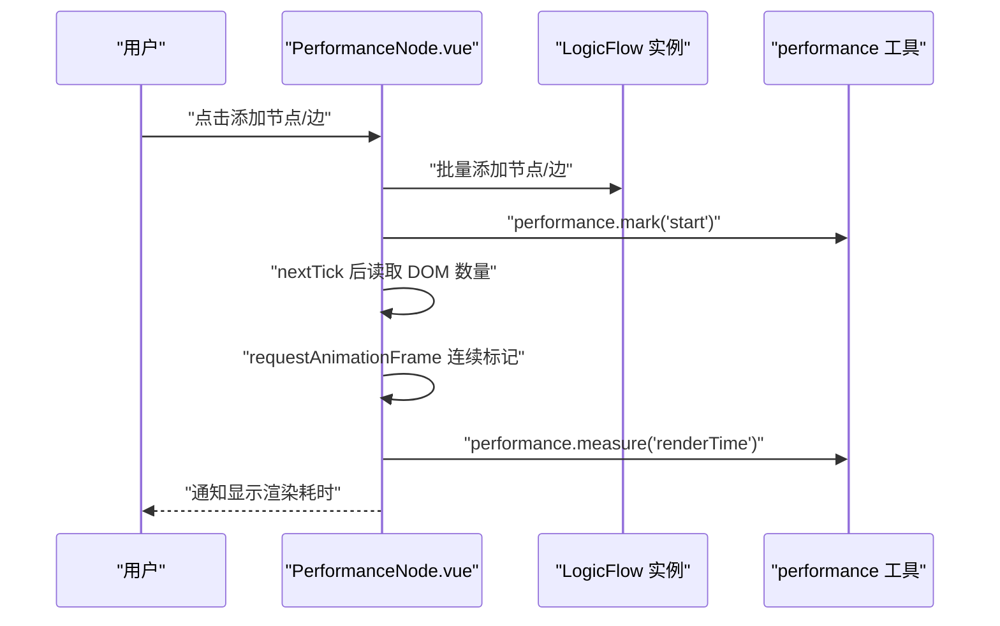
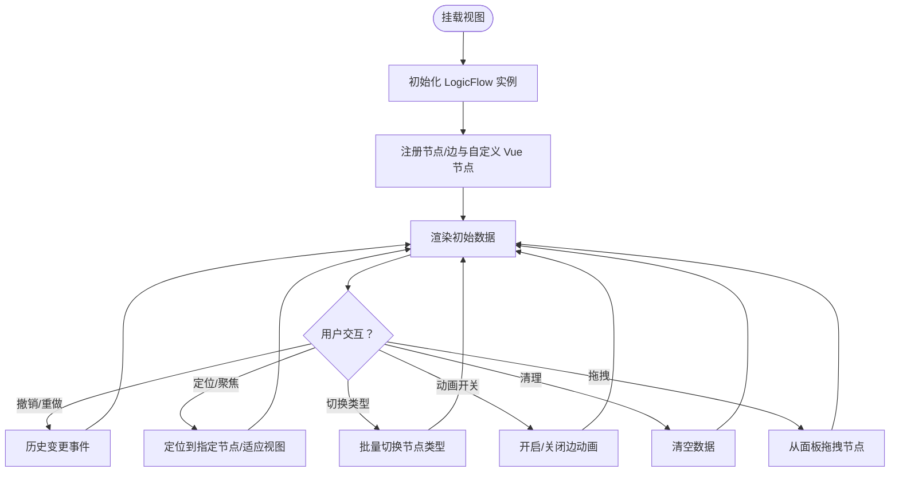
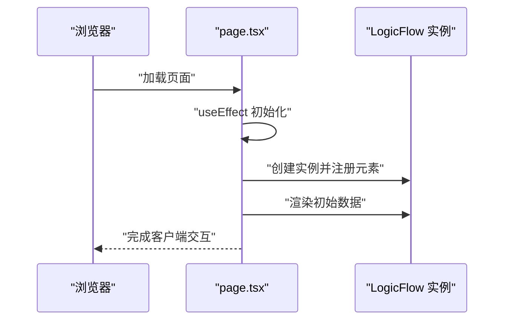
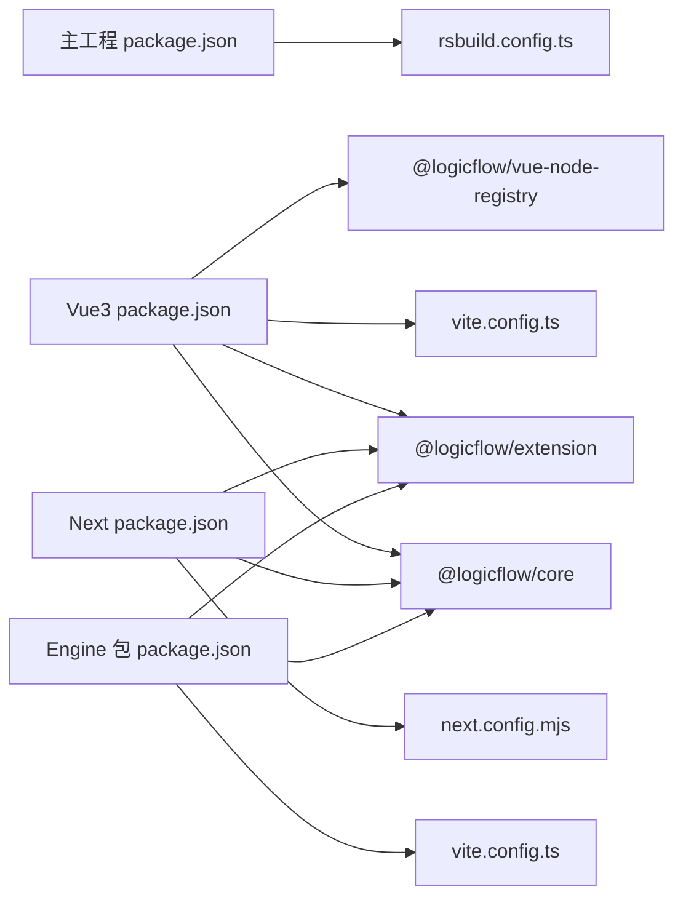

# 跨平台性能优化

<cite>
**本文引用的文件**
- [package.json](file://package.json)
- [rsbuild.config.ts](file://rsbuild.config.ts)
- [examples/vue3-app/package.json](file://examples/vue3-app/package.json)
- [examples/vue3-app/vite.config.ts](file://examples/vue3-app/vite.config.ts)
- [examples/vue3-app/src/utils/performance.ts](file://examples/vue3-app/src/utils/performance.ts)
- [examples/vue3-app/src/views/PerformanceNode.vue](file://examples/vue3-app/src/views/PerformanceNode.vue)
- [examples/vue3-app/src/views/LogicFlowView.vue](file://examples/vue3-app/src/views/LogicFlowView.vue)
- [examples/next-app/package.json](file://examples/next-app/package.json)
- [examples/next-app/next.config.mjs](file://examples/next-app/next.config.mjs)
- [examples/next-app/src/app/page.tsx](file://examples/next-app/src/app/page.tsx)
- [examples/engine-browser-examples/package.json](file://examples/engine-browser-examples/package.json)
- [examples/engine-browser-examples/vite.config.ts](file://examples/engine-browser-examples/vite.config.ts)
- [examples/engine-browser-examples/src/pages/Home.tsx](file://examples/engine-browser-examples/src/pages/Home.tsx)
</cite>

## 目录
1. [引言](#引言)
2. [项目结构](#项目结构)
3. [核心组件](#核心组件)
4. [架构总览](#架构总览)
5. [组件与功能深度分析](#组件与功能深度分析)
6. [依赖关系分析](#依赖关系分析)
7. [性能考量与优化策略](#性能考量与优化策略)
8. [故障排查指南](#故障排查指南)
9. [结论](#结论)
10. [附录](#附录)

## 引言
本指南围绕流程图应用在多前端框架（Vue3、React、Next.js）下的跨平台性能优化展开，结合仓库中的实际示例与构建配置，系统阐述以下主题：
- 不同前端框架在流程图场景下的性能特点与优化策略
- 浏览器兼容性对性能的影响（Chrome/Firefox/Safari）
- 移动端与桌面端的性能差异与适配要点
- 服务端渲染（SSR）与静态生成（SSG）对性能的影响与优化方法
- 跨平台性能测试方法与工具
- CDN、缓存与资源压缩对不同平台的影响
- 多平台部署的性能调优建议

## 项目结构
该项目采用多包/多应用并存的组织方式，包含主工程与多个示例应用，分别演示 Vue3、React/Next.js 以及浏览器引擎示例。构建层以 Rsbuild/Vite/Next 为核心，配合插件体系进行开发与生产构建。

图表来源
- [package.json](file://package.json#L1-L45)
- [rsbuild.config.ts](file://rsbuild.config.ts#L1-L30)
- [examples/vue3-app/package.json](file://examples/vue3-app/package.json#L1-L52)
- [examples/vue3-app/vite.config.ts](file://examples/vue3-app/vite.config.ts#L1-L15)
- [examples/vue3-app/src/utils/performance.ts](file://examples/vue3-app/src/utils/performance.ts#L1-L28)
- [examples/vue3-app/src/views/PerformanceNode.vue](file://examples/vue3-app/src/views/PerformanceNode.vue#L1-L270)
- [examples/vue3-app/src/views/LogicFlowView.vue](file://examples/vue3-app/src/views/LogicFlowView.vue#L1-L537)
- [examples/next-app/package.json](file://examples/next-app/package.json#L1-L32)
- [examples/next-app/next.config.mjs](file://examples/next-app/next.config.mjs#L1-L5)
- [examples/next-app/src/app/page.tsx](file://examples/next-app/src/app/page.tsx#L1-L476)
- [examples/engine-browser-examples/package.json](file://examples/engine-browser-examples/package.json#L1-L39)
- [examples/engine-browser-examples/vite.config.ts](file://examples/engine-browser-examples/vite.config.ts#L1-L14)
- [examples/engine-browser-examples/src/pages/Home.tsx](file://examples/engine-browser-examples/src/pages/Home.tsx#L1-L19)

章节来源
- [package.json](file://package.json#L1-L45)
- [rsbuild.config.ts](file://rsbuild.config.ts#L1-L30)
- [examples/vue3-app/package.json](file://examples/vue3-app/package.json#L1-L52)
- [examples/next-app/package.json](file://examples/next-app/package.json#L1-L32)
- [examples/engine-browser-examples/package.json](file://examples/engine-browser-examples/package.json#L1-L39)

## 核心组件
- 构建与打包配置
  - 主工程使用 Rsbuild 配置插件化构建，启用 Babel、Vue、Vue JSX、Less 插件，路径别名指向 src。
  - Vue3 示例使用 Vite，配置了 Vue 插件与路径别名；注释提示了 Devtools 对内存的影响。
  - Next.js 示例使用默认 Next 配置，页面组件为客户端渲染。
  - 浏览器引擎示例使用 Vite + React，配置了 React 插件与路径别名。
- 性能监控与度量
  - Vue3 示例提供 DOM 元素计数与长任务观察工具函数，用于评估渲染与交互阻塞。
  - Vue3 示例的性能视图通过标记与测量计算渲染耗时，并提供 DOM 数量实时统计。
- 流程图集成
  - Vue3/Next 示例均注册并渲染 LogicFlow 图形，包含自定义节点/边、主题与交互控制。
  - Vue3 示例还演示了 Teleport 容器与自定义 Vue 节点注册。

章节来源
- [rsbuild.config.ts](file://rsbuild.config.ts#L1-L30)
- [examples/vue3-app/vite.config.ts](file://examples/vue3-app/vite.config.ts#L1-L15)
- [examples/vue3-app/src/utils/performance.ts](file://examples/vue3-app/src/utils/performance.ts#L1-L28)
- [examples/vue3-app/src/views/PerformanceNode.vue](file://examples/vue3-app/src/views/PerformanceNode.vue#L1-L270)
- [examples/vue3-app/src/views/LogicFlowView.vue](file://examples/vue3-app/src/views/LogicFlowView.vue#L1-L537)
- [examples/next-app/next.config.mjs](file://examples/next-app/next.config.mjs#L1-L5)
- [examples/next-app/src/app/page.tsx](file://examples/next-app/src/app/page.tsx#L1-L476)
- [examples/engine-browser-examples/vite.config.ts](file://examples/engine-browser-examples/vite.config.ts#L1-L14)

## 架构总览
下图展示了三类前端框架在本项目中的运行时与构建时关系，以及与 LogicFlow 的集成位置。

图表来源
- [rsbuild.config.ts](file://rsbuild.config.ts#L1-L30)
- [examples/vue3-app/vite.config.ts](file://examples/vue3-app/vite.config.ts#L1-L15)
- [examples/vue3-app/src/utils/performance.ts](file://examples/vue3-app/src/utils/performance.ts#L1-L28)
- [examples/vue3-app/src/views/LogicFlowView.vue](file://examples/vue3-app/src/views/LogicFlowView.vue#L1-L537)
- [examples/next-app/next.config.mjs](file://examples/next-app/next.config.mjs#L1-L5)
- [examples/next-app/src/app/page.tsx](file://examples/next-app/src/app/page.tsx#L1-L476)
- [examples/engine-browser-examples/vite.config.ts](file://examples/engine-browser-examples/vite.config.ts#L1-L14)
- [examples/engine-browser-examples/src/pages/Home.tsx](file://examples/engine-browser-examples/src/pages/Home.tsx#L1-L19)

## 组件与功能深度分析

### Vue3 性能监控与渲染度量
- DOM 计数与长任务观察：提供 DOM 元素总数统计与长任务监听，便于识别主线程阻塞。
- 渲染耗时测量：通过 mark/mark/measurement 记录渲染阶段，结合通知反馈耗时。
- 实时统计：定时刷新 DOM 数量，辅助评估节点/边增删对 DOM 压力的影响。

图表来源
- [examples/vue3-app/src/views/PerformanceNode.vue](file://examples/vue3-app/src/views/PerformanceNode.vue#L100-L153)
- [examples/vue3-app/src/utils/performance.ts](file://examples/vue3-app/src/utils/performance.ts#L1-L28)

章节来源
- [examples/vue3-app/src/utils/performance.ts](file://examples/vue3-app/src/utils/performance.ts#L1-L28)
- [examples/vue3-app/src/views/PerformanceNode.vue](file://examples/vue3-app/src/views/PerformanceNode.vue#L1-L270)

### Vue3 流程图视图与交互
- 配置与主题：集中配置编辑行为、网格、背景、键盘快捷键等；主题统一节点/边样式。
- 自定义元素注册：注册多种节点/边（含动画与连接），支持拖拽面板。
- 交互能力：撤销/重做、定位、切换节点类型、修改边 ID、开启/关闭边动画、聚焦视图等。
- Teleport 容器：通过注册容器承载自定义 Vue 节点渲染。

图表来源
- [examples/vue3-app/src/views/LogicFlowView.vue](file://examples/vue3-app/src/views/LogicFlowView.vue#L95-L254)

章节来源
- [examples/vue3-app/src/views/LogicFlowView.vue](file://examples/vue3-app/src/views/LogicFlowView.vue#L1-L537)

### Next.js 流程图视图与 SSR/CSR 注意点
- 客户端注解：页面组件标注为客户端渲染，避免 SSR 期间访问浏览器 API。
- 配置与主题：与 Vue3 类似，集中配置编辑行为、网格、键盘等。
- 自定义元素注册与交互：注册节点/边，提供按钮式交互入口。
- SSR 影响：Next 默认 SSR，需确保仅在客户端执行的逻辑放在 useEffect 中，避免水合不一致。

图表来源
- [examples/next-app/src/app/page.tsx](file://examples/next-app/src/app/page.tsx#L103-L208)

章节来源
- [examples/next-app/src/app/page.tsx](file://examples/next-app/src/app/page.tsx#L1-L476)
- [examples/next-app/next.config.mjs](file://examples/next-app/next.config.mjs#L1-L5)

### 浏览器引擎示例（React + Vite）
- 构建配置：Vite + React 插件，路径别名指向 src。
- 页面组件：基础错误页示例，可作为扩展页面的基础模板。

章节来源
- [examples/engine-browser-examples/vite.config.ts](file://examples/engine-browser-examples/vite.config.ts#L1-L14)
- [examples/engine-browser-examples/src/pages/Home.tsx](file://examples/engine-browser-examples/src/pages/Home.tsx#L1-L19)

## 依赖关系分析
- 主工程与示例应用的依赖分层清晰，主工程通过 Rsbuild 统一构建，示例应用各自独立的构建配置。
- Vue3/Next 示例均引入 LogicFlow 核心与扩展包，用于图形渲染与交互。
- Vue3 示例额外引入 Vue 生态与 UI 组件库，Next 示例引入 Ant Design。

图表来源
- [package.json](file://package.json#L14-L27)
- [examples/vue3-app/package.json](file://examples/vue3-app/package.json#L16-L28)
- [examples/next-app/package.json](file://examples/next-app/package.json#L11-L19)
- [examples/engine-browser-examples/package.json](file://examples/engine-browser-examples/package.json#L12-L23)

章节来源
- [package.json](file://package.json#L1-L45)
- [examples/vue3-app/package.json](file://examples/vue3-app/package.json#L1-L52)
- [examples/next-app/package.json](file://examples/next-app/package.json#L1-L32)
- [examples/engine-browser-examples/package.json](file://examples/engine-browser-examples/package.json#L1-L39)

## 性能考量与优化策略

### 不同前端框架的性能特点与优化
- Vue3（组合式 API + 响应式系统）
  - 优势：细粒度响应、更小的运行时开销；适合复杂交互与大量节点/边的场景。
  - 优化要点：
    - 使用浅引用与惰性初始化减少不必要的响应式追踪。
    - 合理拆分组件，避免单组件过大；利用 Teleport 将重型子树移出主渲染树。
    - 在高频更新场景下，优先使用原生 DOM 操作或直接更新属性，降低虚拟 DOM 压力。
    - 使用 Devtools 时注意其全局缓冲可能带来的内存压力，必要时禁用或隔离。
- React（函数组件 + Hooks）
  - 优势：稳定的 diff 策略与并发调度；适合大规模状态管理与复杂交互。
  - 优化要点：
    - 使用 memo、useMemo、useCallback 缓存昂贵计算与子组件。
    - 合理拆分模块与懒加载，减少首屏体积。
    - 在 Next.js 中注意客户端渲染时机，避免 SSR 期间访问浏览器 API。
- Next.js（SSR/SSG）
  - 优势：首屏加载快、SEO 友好；适合内容型与后台管理类应用。
  - 优化要点：
    - 将与浏览器强相关的逻辑置于客户端组件或 useEffect 内。
    - 合理使用 App Router 的并行数据流与缓存策略，减少重复请求。
    - SSG 场景下预渲染静态页面，动态内容通过客户端拉取。

章节来源
- [examples/vue3-app/vite.config.ts](file://examples/vue3-app/vite.config.ts#L4-L8)
- [examples/next-app/src/app/page.tsx](file://examples/next-app/src/app/page.tsx#L1-L13)

### 浏览器兼容性对性能的影响
- Chrome：V8 引擎性能优异，但高分辨率与复杂 DOM 可能导致合成层压力增大；建议减少强制同步布局与重排。
- Firefox：布局与绘制策略与 WebKit 不同，注意 transform 与 filter 的合成层开销。
- Safari：移动端与桌面端差异较大，移动端更关注能耗与主线程阻塞；长任务与滚动性能尤为关键。
- 通用建议：
  - 避免在主线程执行长时间任务，使用空闲回调或 Web Workers 分担。
  - 控制 DOM 层级与节点数量，合理使用虚拟化与分页。
  - 使用 CSS 动画替代 JS 动画，优先使用 transform/opacity。

### 移动端与桌面端的性能差异与适配
- 交互模型差异：移动端以触摸为主，事件处理与节流/防抖更为重要；桌面端鼠标事件更稳定。
- 屏幕适配：移动端更关注 viewport 缩放与 DPR，避免过度缩放导致的像素密度问题。
- 能耗与发热：移动端需减少主线程占用，避免频繁重绘与回流；使用 requestIdleCallback 与低优先级任务调度。

### SSR 与 SSG 对性能的影响与优化
- SSR：首屏快但服务器负载高；建议缓存渲染结果、启用边缘缓存与 Gzip/Brotli 压缩。
- SSG：构建期生成静态资源，运行时零服务器渲染成本；适合内容稳定的应用。
- 优化建议：
  - 将动态内容延迟到客户端加载，减少首屏渲染压力。
  - 使用增量静态再生（ISR）在后台更新静态页面。

### 跨平台性能测试方法与工具
- 浏览器性能面板：记录渲染帧率、CPU 占用、内存增长与长任务。
- Lighthouse：自动化评估性能、可访问性与最佳实践。
- WebPageTest：跨地区与设备的端到端性能对比。
- 自定义指标：如 DOM 数量、渲染耗时、交互延迟等，结合仓库中的工具函数进行采集。

章节来源
- [examples/vue3-app/src/utils/performance.ts](file://examples/vue3-app/src/utils/performance.ts#L1-L28)
- [examples/vue3-app/src/views/PerformanceNode.vue](file://examples/vue3-app/src/views/PerformanceNode.vue#L100-L153)

### CDN、缓存与资源压缩
- CDN：就近分发静态资源，降低网络时延；结合边缘缓存与预热策略提升命中率。
- 缓存策略：HTTP 缓存头、Service Worker 缓存、浏览器存储；区分静态资源与动态数据。
- 资源压缩：Gzip/Brotli、图片压缩、矢量图标、按需加载与懒加载。

### 多平台部署的性能调优建议
- 构建优化：启用 Tree Shaking、代码分割与动态导入；针对不同平台选择最优 polyfill。
- 运行时优化：服务端渲染时避免在服务端访问浏览器 API；客户端渲染时延迟非关键脚本。
- 监控与回滚：建立性能基线与告警，出现问题快速回滚与修复。

## 故障排查指南
- 内存泄漏与 DOM 压力
  - 症状：页面卡顿、滚动迟滞、内存持续上涨。
  - 排查：使用性能面板与内存快照，检查长任务与 DOM 节点数量；逐步移除组件定位问题。
  - 参考：仓库中提供了 DOM 数量统计与长任务观察工具。
- Vue Devtools 内存问题
  - 症状：启用 Devtools 后出现内存溢出。
  - 处理：参考 Vue3 示例的 Vite 配置注释，必要时禁用或隔离 Devtools。
- Next.js SSR 水合不一致
  - 症状：首屏闪烁或交互异常。
  - 处理：确保仅在客户端执行的逻辑放入 useEffect 或客户端组件；避免在 SSR 期间访问浏览器 API。

章节来源
- [examples/vue3-app/src/utils/performance.ts](file://examples/vue3-app/src/utils/performance.ts#L1-L28)
- [examples/vue3-app/src/views/PerformanceNode.vue](file://examples/vue3-app/src/views/PerformanceNode.vue#L1-L270)
- [examples/vue3-app/vite.config.ts](file://examples/vue3-app/vite.config.ts#L4-L8)
- [examples/next-app/src/app/page.tsx](file://examples/next-app/src/app/page.tsx#L1-L13)

## 结论
本项目通过多框架示例与统一的构建配置，为流程图应用在跨平台环境下的性能优化提供了实践参考。优化的关键在于：
- 选择合适的框架与渲染模式（SSR/SSG/CSS 动画/虚拟化）
- 控制 DOM 与层级规模，减少主线程阻塞
- 利用缓存与 CDN 提升加载性能
- 建立完善的性能监控与测试体系

## 附录
- 关键文件索引
  - 构建配置：[rsbuild.config.ts](file://rsbuild.config.ts#L1-L30)、[examples/vue3-app/vite.config.ts](file://examples/vue3-app/vite.config.ts#L1-L15)、[examples/next-app/next.config.mjs](file://examples/next-app/next.config.mjs#L1-L5)、[examples/engine-browser-examples/vite.config.ts](file://examples/engine-browser-examples/vite.config.ts#L1-L14)
  - 性能工具：[examples/vue3-app/src/utils/performance.ts](file://examples/vue3-app/src/utils/performance.ts#L1-L28)
  - Vue3 示例：[examples/vue3-app/src/views/PerformanceNode.vue](file://examples/vue3-app/src/views/PerformanceNode.vue#L1-L270)、[examples/vue3-app/src/views/LogicFlowView.vue](file://examples/vue3-app/src/views/LogicFlowView.vue#L1-L537)
  - Next 示例：[examples/next-app/src/app/page.tsx](file://examples/next-app/src/app/page.tsx#L1-L476)
  - 浏览器引擎示例：[examples/engine-browser-examples/src/pages/Home.tsx](file://examples/engine-browser-examples/src/pages/Home.tsx#L1-L19)