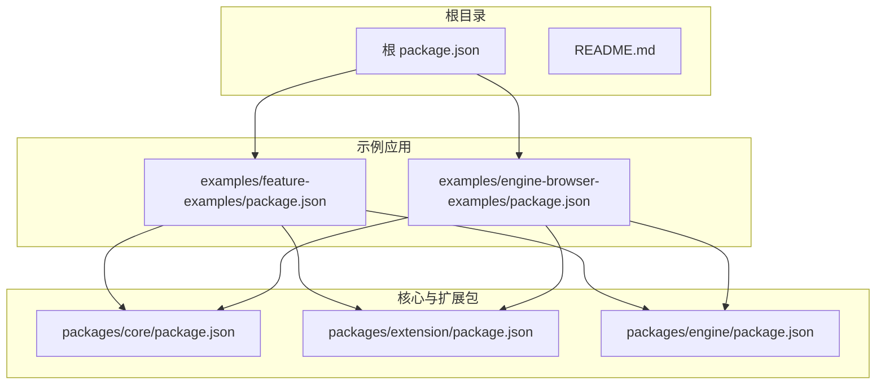
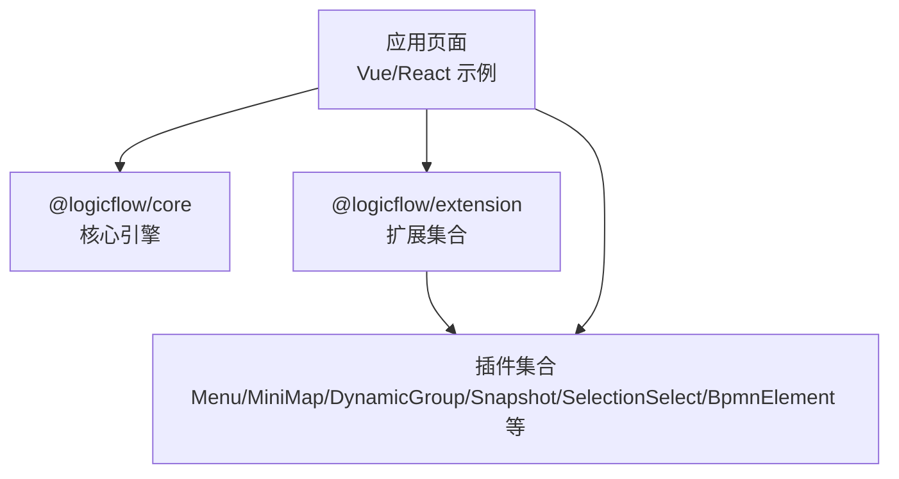
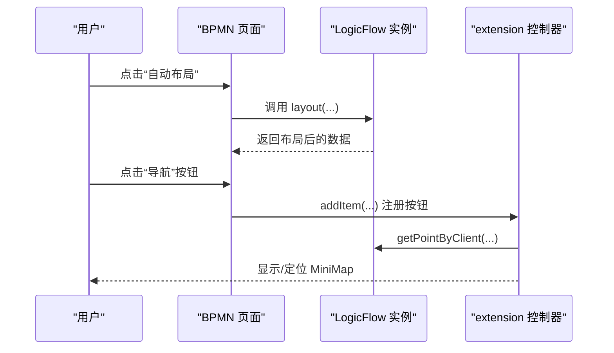
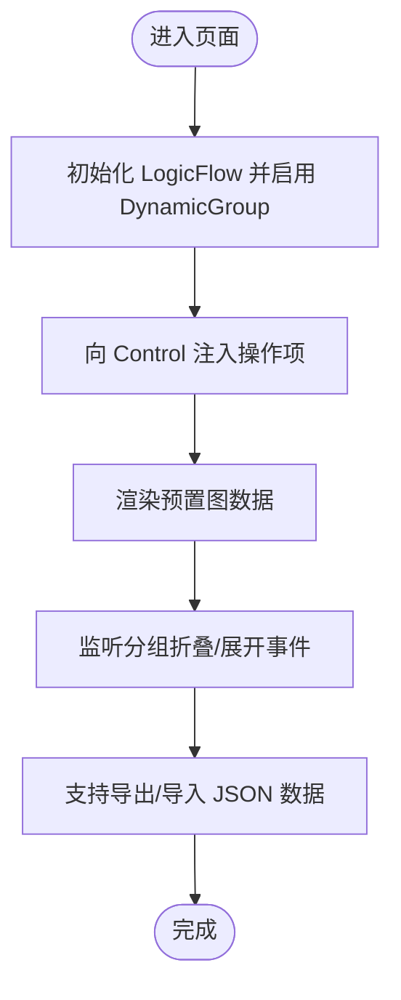
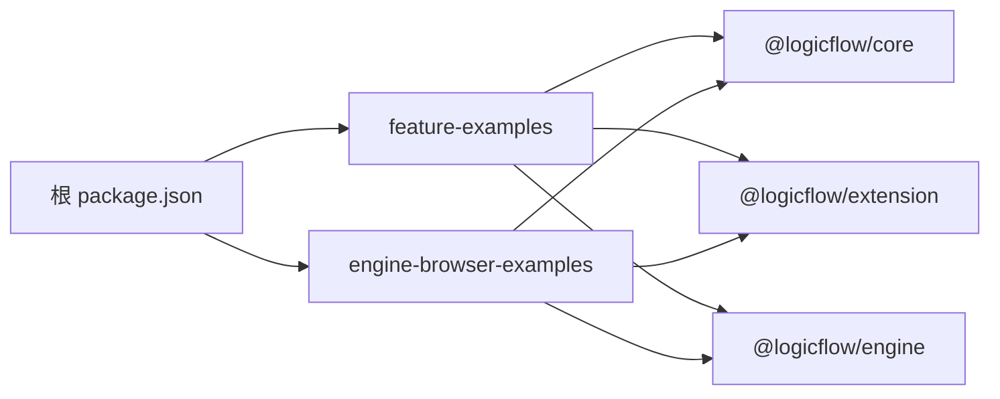

# 开发最佳实践

<cite>
**本文引用的文件**
- [README.md](file://README.md)
- [package.json](file://package.json)
- [examples/feature-examples/package.json](file://examples/feature-examples/package.json)
- [examples/engine-browser-examples/package.json](file://examples/engine-browser-examples/package.json)
- [packages/core/package.json](file://packages/core/package.json)
- [packages/extension/package.json](file://packages/extension/package.json)
- [packages/engine/package.json](file://packages/engine/package.json)
- [examples/feature-examples/src/pages/extensions/bpmn/index.tsx](file://examples/feature-examples/src/pages/extensions/bpmn/index.tsx)
- [examples/feature-examples/src/pages/extensions/dynamic-group/index.tsx](file://examples/feature-examples/src/pages/extensions/dynamic-group/index.tsx)
- [examples/feature-examples/src/pages/extensions/menu/index.tsx](file://examples/feature-examples/src/pages/extensions/menu/index.tsx)
- [examples/feature-examples/src/pages/extensions/mini-map/index.tsx](file://examples/feature-examples/src/pages/extensions/mini-map/index.tsx)
- [examples/feature-examples/src/pages/extensions/snapshot/index.tsx](file://examples/feature-examples/src/pages/extensions/snapshot/index.tsx)
- [examples/feature-examples/src/pages/extensions/rules/index.tsx](file://examples/feature-examples/src/pages/extensions/rules/index.tsx)
- [examples/feature-examples/src/pages/extensions/selection-select/index.tsx](file://examples/feature-examples/src/pages/extensions/selection-select/index.tsx)
</cite>

## 目录
1. [简介](#简介)
2. [项目结构](#项目结构)
3. [核心组件](#核心组件)
4. [架构总览](#架构总览)
5. [详细组件分析](#详细组件分析)
6. [依赖分析](#依赖分析)
7. [性能考量](#性能考量)
8. [故障排查指南](#故障排查指南)
9. [结论](#结论)
10. [附录](#附录)

## 简介
本指南面向使用 LogicFlow 扩展体系进行二次开发的工程师，围绕设计原则、架构模式、性能优化、错误处理与异常恢复、测试策略、调试技巧、文档规范、安全与权限控制、兼容性与跨浏览器支持，以及从开发到发布的全流程最佳实践，提供系统化的方法论与实操建议。示例代码来自仓库中的扩展示例页面，涵盖 BPMN、动态分组、菜单、小地图、快照、规则与框选等典型扩展能力。

## 项目结构
该仓库采用多包工作区组织方式，核心模块与扩展模块分离，示例应用分别覆盖 Vue 与 React 生态，便于在不同前端框架中验证扩展行为与性能表现。

图表来源
- [package.json](file://package.json#L1-L45)
- [examples/feature-examples/package.json](file://examples/feature-examples/package.json#L1-L29)
- [examples/engine-browser-examples/package.json](file://examples/engine-browser-examples/package.json#L1-L39)
- [packages/core/package.json](file://packages/core/package.json#L1-L57)
- [packages/extension/package.json](file://packages/extension/package.json#L1-L61)
- [packages/engine/package.json](file://packages/engine/package.json#L1-L50)

章节来源
- [README.md](file://README.md#L1-L37)
- [package.json](file://package.json#L1-L45)

## 核心组件
- 核心引擎与模型层：负责图数据建模、交互事件、编辑配置与渲染管线。
- 扩展层：提供插件化能力（菜单、小地图、动态分组、快照、框选、BPMN 元素适配等），通过 LogicFlow.use 或构造选项启用。
- 应用示例：基于 Vue 与 React 的示例页面，演示扩展的装配、配置与交互。

章节来源
- [packages/core/package.json](file://packages/core/package.json#L1-L57)
- [packages/extension/package.json](file://packages/extension/package.json#L1-L61)
- [examples/feature-examples/src/pages/extensions/bpmn/index.tsx](file://examples/feature-examples/src/pages/extensions/bpmn/index.tsx#L1-L367)
- [examples/feature-examples/src/pages/extensions/dynamic-group/index.tsx](file://examples/feature-examples/src/pages/extensions/dynamic-group/index.tsx#L1-L393)
- [examples/feature-examples/src/pages/extensions/menu/index.tsx](file://examples/feature-examples/src/pages/extensions/menu/index.tsx#L1-L253)
- [examples/feature-examples/src/pages/extensions/mini-map/index.tsx](file://examples/feature-examples/src/pages/extensions/mini-map/index.tsx#L1-L201)
- [examples/feature-examples/src/pages/extensions/snapshot/index.tsx](file://examples/feature-examples/src/pages/extensions/snapshot/index.tsx#L1-L401)
- [examples/feature-examples/src/pages/extensions/rules/index.tsx](file://examples/feature-examples/src/pages/extensions/rules/index.tsx#L1-L59)
- [examples/feature-examples/src/pages/extensions/selection-select/index.tsx](file://examples/feature-examples/src/pages/extensions/selection-select/index.tsx#L1-L271)

## 架构总览
LogicFlow 采用“核心引擎 + 扩展插件”的架构。应用侧通过构造函数传入容器与插件配置，扩展通过统一入口挂载到 LogicFlow 实例的 extension 命名空间，实现能力解耦与按需启用。

图表来源
- [examples/feature-examples/src/pages/extensions/bpmn/index.tsx](file://examples/feature-examples/src/pages/extensions/bpmn/index.tsx#L30-L60)
- [examples/feature-examples/src/pages/extensions/dynamic-group/index.tsx](file://examples/feature-examples/src/pages/extensions/dynamic-group/index.tsx#L19-L35)
- [examples/feature-examples/src/pages/extensions/menu/index.tsx](file://examples/feature-examples/src/pages/extensions/menu/index.tsx#L14-L45)
- [examples/feature-examples/src/pages/extensions/mini-map/index.tsx](file://examples/feature-examples/src/pages/extensions/mini-map/index.tsx#L11-L26)
- [examples/feature-examples/src/pages/extensions/snapshot/index.tsx](file://examples/feature-examples/src/pages/extensions/snapshot/index.tsx#L29-L61)
- [examples/feature-examples/src/pages/extensions/selection-select/index.tsx](file://examples/feature-examples/src/pages/extensions/selection-select/index.tsx#L11-L46)

## 详细组件分析

### BPMN 扩展（BpmnElement、BpmnXmlAdapter）
- 设计要点
  - 通过 plugins 数组启用 BpmnElement 与 BpmnXmlAdapter，实现 BPMN 节点与 XML 导入导出。
  - 使用 setPatternItems 注册拖拽面板节点，setMenuConfig 与 setContextMenuItems 配置菜单。
  - 通过 extension.control 动态注入自定义按钮，结合 MiniMap 展示导航。
- 性能优化
  - 使用 sessionStorage 缓存渲染数据，避免重复解析与渲染。
  - 仅在首次初始化时创建 LogicFlow 实例，复用实例减少内存占用。
- 错误处理
  - 文件读取与 XML 解析采用 try/catch 包裹，失败时输出日志并提示用户。
- 可靠性
  - 对象类型断言前进行存在性检查，避免运行时崩溃。

图表来源
- [examples/feature-examples/src/pages/extensions/bpmn/index.tsx](file://examples/feature-examples/src/pages/extensions/bpmn/index.tsx#L145-L206)

章节来源
- [examples/feature-examples/src/pages/extensions/bpmn/index.tsx](file://examples/feature-examples/src/pages/extensions/bpmn/index.tsx#L1-L367)

### 动态分组（DynamicGroup）
- 设计要点
  - 通过 plugins 启用 DynamicGroup，并在 Control 中注入移动分组与添加子节点的操作。
  - 支持分组折叠/展开事件监听，配合消息提示反馈用户操作结果。
- 性能优化
  - 使用受控渲染与事件节流，避免频繁重绘。
  - 通过 properties 字段一次性传递分组初始状态，减少多次更新。
- 错误处理
  - 导入 JSON 时进行结构校验与异常捕获，提示具体错误信息。

图表来源
- [examples/feature-examples/src/pages/extensions/dynamic-group/index.tsx](file://examples/feature-examples/src/pages/extensions/dynamic-group/index.tsx#L98-L304)

章节来源
- [examples/feature-examples/src/pages/extensions/dynamic-group/index.tsx](file://examples/feature-examples/src/pages/extensions/dynamic-group/index.tsx#L1-L393)

### 菜单（Menu）
- 设计要点
  - 通过 addMenuConfig 配置节点/边/图三级菜单，支持禁用/启用菜单项与切换静默模式。
- 性能优化
  - 菜单项回调内尽量避免复杂计算，必要时延迟执行。
- 错误处理
  - 回调中对数据进行安全访问，防止空引用。

章节来源
- [examples/feature-examples/src/pages/extensions/menu/index.tsx](file://examples/feature-examples/src/pages/extensions/menu/index.tsx#L1-L253)

### 小地图（MiniMap）
- 设计要点
  - 通过 extension.miniMap 访问实例，支持显示/隐藏、位置更新、连线显隐与重置。
- 性能优化
  - 大规模节点场景下，可选择关闭连线渲染以降低开销。
- 错误处理
  - 对可见性切换与位置更新进行条件判断，避免无效调用。

章节来源
- [examples/feature-examples/src/pages/extensions/mini-map/index.tsx](file://examples/feature-examples/src/pages/extensions/mini-map/index.tsx#L1-L201)

### 快照（Snapshot）
- 设计要点
  - 支持多种导出格式与参数（尺寸、背景色、质量、局部渲染、安全系数与边距、自定义 CSS 规则）。
  - 提供下载、预览 Blob 与 Base64 的能力。
- 性能优化
  - 导出前统一更新扩展参数，避免重复计算。
  - 对超大画布采用局部渲染与安全参数控制，提升稳定性。
- 错误处理
  - 导出与预览均进行异常捕获，提示用户并记录日志。

章节来源
- [examples/feature-examples/src/pages/extensions/snapshot/index.tsx](file://examples/feature-examples/src/pages/extensions/snapshot/index.tsx#L1-L401)

### 规则（Rules）
- 设计要点
  - 通过注册自定义节点类型与连接规则，在 connection:not-allowed 事件中提示用户。
- 性能优化
  - 规则判定逻辑保持轻量，避免阻塞主线程。
- 错误处理
  - 事件回调中对消息进行统一提示，增强用户体验。

章节来源
- [examples/feature-examples/src/pages/extensions/rules/index.tsx](file://examples/feature-examples/src/pages/extensions/rules/index.tsx#L1-L59)

### 框选（SelectionSelect）
- 设计要点
  - 支持单次框选与持续框选，可切换独占模式与全要素命中策略。
- 性能优化
  - 通过 setSelectionSense 精准控制命中策略，减少不必要的高亮与事件处理。
- 错误处理
  - 对扩展实例进行存在性检查，避免未启用插件时报错。

章节来源
- [examples/feature-examples/src/pages/extensions/selection-select/index.tsx](file://examples/feature-examples/src/pages/extensions/selection-select/index.tsx#L1-L271)

## 依赖分析
- 工作区包管理
  - 根与各示例工程通过 workspace:* 引用本地核心与扩展包，确保版本一致性与增量构建。
- 运行时依赖
  - @logicflow/core、@logicflow/extension、@logicflow/engine 为核心依赖；UI 与工具库用于示例页面。
- 开发与构建
  - Rsbuild/Vite/Umi 等构建工具链配合 TypeScript、ESLint、Biome 等质量工具，保障代码风格与产物质量。

图表来源
- [package.json](file://package.json#L1-L45)
- [examples/feature-examples/package.json](file://examples/feature-examples/package.json#L1-L29)
- [examples/engine-browser-examples/package.json](file://examples/engine-browser-examples/package.json#L1-L39)

章节来源
- [package.json](file://package.json#L1-L45)
- [examples/feature-examples/package.json](file://examples/feature-examples/package.json#L1-L29)
- [examples/engine-browser-examples/package.json](file://examples/engine-browser-examples/package.json#L1-L39)
- [packages/core/package.json](file://packages/core/package.json#L1-L57)
- [packages/extension/package.json](file://packages/extension/package.json#L1-L61)
- [packages/engine/package.json](file://packages/engine/package.json#L1-L50)

## 性能考量
- 渲染优化
  - 使用 sessionStorage 缓存渲染数据，减少重复解析与渲染。
  - 大规模节点场景下，优先采用局部渲染与禁用连线渲染策略。
  - 控制插件数量与启用时机，避免同时加载过多扩展导致首屏卡顿。
- 内存管理
  - 避免在回调中持有大量临时对象；及时释放 Blob URL 与 DOM 引用。
  - 对事件监听进行去重与卸载，防止内存泄漏。
- 计算效率
  - 将耗时计算放入 Web Worker 或异步队列，避免阻塞 UI 线程。
  - 对高频事件（如鼠标移动）进行节流/防抖处理。
- 资源加载
  - 图标与资源采用懒加载与缓存策略，减少网络请求次数。

## 故障排查指南
- 常见问题
  - 插件未启用：检查 plugins 数组与 LogicFlow.use 调用顺序。
  - 类型断言失败：在访问 extension.xxx 前进行存在性判断。
  - 导入/导出异常：对 JSON 结构与文件读取进行 try/catch，并提示具体错误。
- 日志与监控
  - 在关键路径增加日志输出，区分业务日志与调试日志。
  - 对网络请求与资源加载失败进行统一拦截与上报。
- 回滚与降级
  - 当某扩展导致性能问题时，可临时禁用该插件并回退到基础渲染。

章节来源
- [examples/feature-examples/src/pages/extensions/bpmn/index.tsx](file://examples/feature-examples/src/pages/extensions/bpmn/index.tsx#L148-L250)
- [examples/feature-examples/src/pages/extensions/dynamic-group/index.tsx](file://examples/feature-examples/src/pages/extensions/dynamic-group/index.tsx#L337-L367)
- [examples/feature-examples/src/pages/extensions/snapshot/index.tsx](file://examples/feature-examples/src/pages/extensions/snapshot/index.tsx#L150-L180)

## 结论
通过将核心引擎与扩展解耦、在示例中验证扩展能力与性能表现，开发者可以快速构建稳定、可维护且高性能的流程图应用。遵循本文的设计原则、性能优化策略、错误处理与测试方法，可在多框架环境下实现一致的扩展体验与发布质量。

## 附录

### 测试策略
- 单元测试
  - 针对扩展内部工具函数与纯函数进行测试，确保边界条件与异常分支覆盖。
- 集成测试
  - 在示例页面中模拟真实交互（拖拽、框选、菜单点击、快照导出），验证扩展间协作与事件传播。
- 端到端测试
  - 使用自动化测试工具录制用户操作流程，覆盖关键业务路径（导入 XML -> 自动布局 -> 导出 PNG）。

### 文档编写规范与示例模板
- 规范
  - 统一命名与注释风格，明确参数与返回值含义。
  - 为每个扩展提供最小可运行示例，标注依赖版本与注意事项。
- 模板
  - 扩展页面模板：包含初始化、插件启用、事件绑定、导出/导入、错误处理与清理逻辑。

### 安全与权限控制
- 权限
  - 限制写操作权限，仅在可信上下文中启用编辑与导出能力。
- 输入校验
  - 对导入数据进行结构与字段校验，拒绝异常数据。
- 输出保护
  - 导出内容避免敏感信息泄露，必要时进行脱敏处理。

### 兼容性与跨浏览器支持
- 构建目标
  - 使用构建工具生成 ES5/ESNext 多目标产物，满足不同浏览器兼容需求。
- 运行时检测
  - 对新特性进行能力检测与降级处理，保证在旧环境可用。
- UI 一致性
  - 通过样式隔离与主题变量，减少跨浏览器样式差异带来的问题。

### 从开发到发布的最佳实践
- 开发阶段
  - 使用工作区统一版本，启用 ESLint 与 Biome 格式化，保持代码一致性。
- 测试阶段
  - 覆盖核心交互与边界场景，记录失败用例以便回归。
- 发布阶段
  - 生成多格式产物（UMD/CJS/ESM），提供清晰的变更日志与迁移指南。