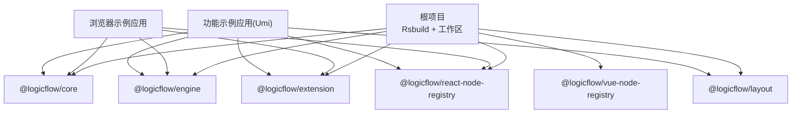
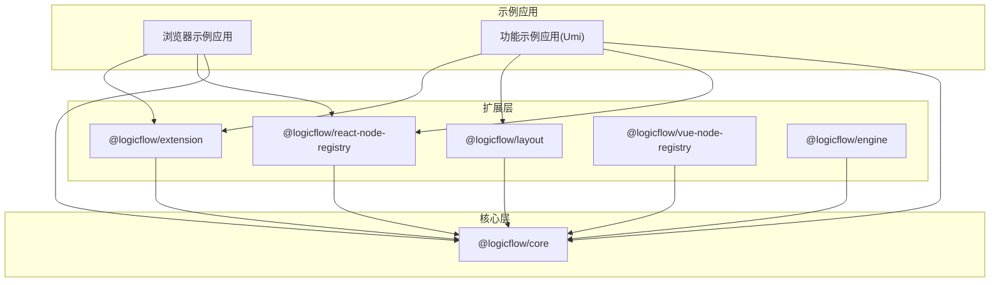
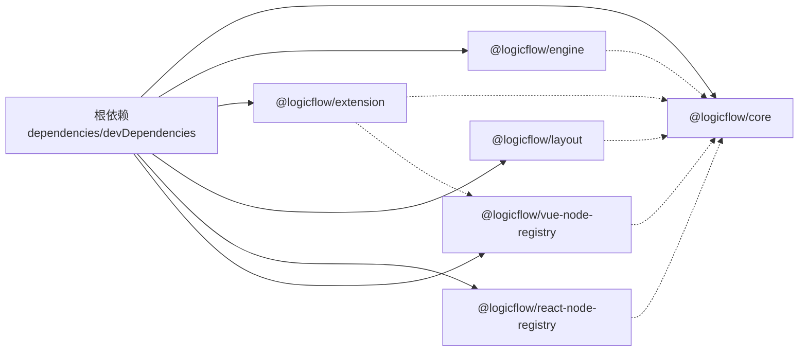

# 扩展包管理

<cite>
**本文引用的文件**
- [根 package.json](file://package.json)
- [pnpm 锁定文件](file://pnpm-lock.yaml)
- [Rsbuild 配置](file://rsbuild.config.ts)
- [核心包配置](file://packages/core/package.json)
- [引擎包配置](file://packages/engine/package.json)
- [扩展包配置](file://packages/extension/package.json)
- [布局包配置](file://packages/layout/package.json)
- [React 节点注册表包配置](file://packages/react-node-registry/package.json)
- [Vue 节点注册表包配置](file://packages/vue-node-registry/package.json)
- [浏览器示例应用包配置](file://examples/engine-browser-examples/package.json)
- [功能示例应用包配置](file://examples/feature-examples/package.json)
- [Biome 格式化与检查配置](file://biome.json)
- [ESLint 配置](file://eslint.config.mjs)
- [项目总 README](file://README.md)
</cite>

## 目录
1. [引言](#引言)
2. [项目结构](#项目结构)
3. [核心组件](#核心组件)
4. [架构总览](#架构总览)
5. [详细组件分析](#详细组件分析)
6. [依赖关系分析](#依赖关系分析)
7. [性能考量](#性能考量)
8. [故障排查指南](#故障排查指南)
9. [结论](#结论)
10. [附录](#附录)

## 引言
本文件系统化阐述该仓库中扩展包的组织结构、命名规范、依赖管理策略（含 peerDependencies 与 dependencies 的使用原则）、版本管理与发布流程、构建配置与多格式输出策略、测试与质量保证流程、文档编写规范与示例模板、分发渠道与安装使用指南、维护策略与社区贡献流程，并总结面向扩展开发者的最佳实践。目标是帮助开发者在不直接阅读源码的情况下，也能高效地理解并参与扩展包的开发与维护。

## 项目结构
该项目采用多包工作区（monorepo）结构，顶层通过脚手架工具与构建系统统一管理多个子包。核心包与扩展包按功能域拆分，示例应用演示如何在真实场景中组合使用这些扩展包。

- 顶层配置
  - 构建：使用 Rsbuild 作为构建工具链，插件涵盖 Babel、Vue、Vue JSX、Less。
  - 脚本：提供开发、预览、打包等常用命令。
  - 依赖：集中声明业务应用所需依赖，扩展包通过 workspace:* 在工作区内共享版本。

- 包目录
  - packages/core：核心逻辑包，定义基础能力与数据模型。
  - packages/engine：流程引擎相关实现。
  - packages/extension：扩展能力集合，如节点、边、交互等。
  - packages/layout：布局算法集成。
  - packages/react-node-registry：React 节点注册表。
  - packages/vue-node-registry：Vue 节点注册表。

- 示例应用
  - examples/engine-browser-examples：浏览器端示例，演示如何在浏览器环境中使用扩展包。
  - examples/feature-examples：基于 Umi 的示例工程，展示更复杂的组合使用方式。

**图表来源**
- [根 package.json](file://package.json#L1-L45)
- [核心包配置](file://packages/core/package.json#L1-L57)
- [引擎包配置](file://packages/engine/package.json#L1-L50)
- [扩展包配置](file://packages/extension/package.json#L1-L61)
- [布局包配置](file://packages/layout/package.json#L1-L50)
- [React 节点注册表包配置](file://packages/react-node-registry/package.json#L1-L48)
- [Vue 节点注册表包配置](file://packages/vue-node-registry/package.json#L1-L56)
- [浏览器示例应用包配置](file://examples/engine-browser-examples/package.json#L1-L39)
- [功能示例应用包配置](file://examples/feature-examples/package.json#L1-L29)

**章节来源**
- [根 package.json](file://package.json#L1-L45)
- [Rsbuild 配置](file://rsbuild.config.ts#L1-L30)
- [项目总 README](file://README.md#L1-L37)

## 核心组件
- 核心包（@logicflow/core）
  - 角色：提供基础数据结构、事件系统、渲染抽象等核心能力。
  - 输出：同时产出 CommonJS 与 ES Module 双格式，便于在不同运行时使用。
  - 依赖：内部依赖若干通用库，用于 DOM 操作、状态管理、键盘事件等。

- 引擎包（@logicflow/engine）
  - 角色：提供流程执行与规则引擎能力，支持沙箱环境与跨平台适配。
  - 输出：ESM/CJS 与 UMD 多格式，提供浏览器与 Node 环境的差异化入口映射。
  - 依赖：包含运行时所需的沙箱与标识符生成库。

- 扩展包（@logicflow/extension）
  - 角色：封装常用节点、连线、编辑器、选择器等扩展能力。
  - 依赖策略：对核心包与 Vue 注册表使用 peerDependencies，避免重复打包；自身依赖通过 dependencies 声明。
  - 输出：ESM/CJS 与 UMD，配合样式资源与类型声明。

- 布局包（@logicflow/layout）
  - 角色：提供多种布局算法（如 dagre、elkjs），供复杂图结构自动排版。
  - 依赖策略：仅对核心包使用 peerDependencies，确保与核心版本一致。

- React 节点注册表（@logicflow/react-node-registry）
  - 角色：为 React 生态提供节点组件注册与渲染能力。
  - 依赖策略：对核心包与 React 生态使用 peerDependencies，确保版本匹配。

- Vue 节点注册表（@logicflow/vue-node-registry）
  - 角色：为 Vue 生态提供节点组件注册与渲染能力。
  - 依赖策略：对核心包与 Vue 生态使用 peerDependencies，其中 composition-api 标记为可选。

**章节来源**
- [核心包配置](file://packages/core/package.json#L1-L57)
- [引擎包配置](file://packages/engine/package.json#L1-L50)
- [扩展包配置](file://packages/extension/package.json#L1-L61)
- [布局包配置](file://packages/layout/package.json#L1-L50)
- [React 节点注册表包配置](file://packages/react-node-registry/package.json#L1-L48)
- [Vue 节点注册表包配置](file://packages/vue-node-registry/package.json#L1-L56)

## 架构总览
下图展示了扩展包之间的依赖关系与典型使用路径。扩展包通过 peerDependencies 与核心包保持版本一致性，避免重复打包与版本冲突；示例应用则通过 workspace:* 将本地包纳入同一版本体系。

**图表来源**
- [扩展包配置](file://packages/extension/package.json#L38-L41)
- [布局包配置](file://packages/layout/package.json#L41-L45)
- [React 节点注册表包配置](file://packages/react-node-registry/package.json#L34-L38)
- [Vue 节点注册表包配置](file://packages/vue-node-registry/package.json#L36-L40)
- [引擎包配置](file://packages/engine/package.json#L42-L45)
- [浏览器示例应用包配置](file://examples/engine-browser-examples/package.json#L12-L24)
- [功能示例应用包配置](file://examples/feature-examples/package.json#L12-L22)

## 详细组件分析

### 核心包（@logicflow/core）
- 组织结构与命名
  - 包名：@logicflow/core
  - 版本：alpha 预发行版本，体现持续演进与实验特性。
  - 输出：lib（CommonJS）、es（ES Module）、types（类型声明）、unpkg（UMD 最小化产物）。
- 依赖管理
  - dependencies：内部依赖若干通用库，覆盖状态管理、键盘事件、DOM 工具等。
  - 无 peerDependencies，作为基础库被其他包依赖。
- 构建与输出
  - 同时产出 ESM 与 CJS，满足不同运行时需求。
  - 提供 UMD 产物，便于浏览器直接引入。
- 测试与质量
  - 当前未配置测试脚本，建议后续补充单元测试与集成测试。

**章节来源**
- [核心包配置](file://packages/core/package.json#L1-L57)

### 引擎包（@logicflow/engine）
- 组织结构与命名
  - 包名：@logicflow/engine
  - 版本：预发行版本，强调实验性与可迭代性。
  - 输出：ESM/CJS/UMD，提供浏览器与 Node 平台的差异化入口映射。
- 依赖管理
  - dependencies：运行时依赖标识符生成与沙箱执行库。
  - 无 peerDependencies，作为独立运行时能力。
- 构建与输出
  - 使用 Rollup 生成 UMD 产物，便于浏览器直接使用。
  - 提供 dist 与 es/lib 目录，满足多场景需求。
- 测试与质量
  - 使用 Jest 进行单元测试，建议完善覆盖率与回归测试。

**章节来源**
- [引擎包配置](file://packages/engine/package.json#L1-L50)

### 扩展包（@logicflow/extension）
- 组织结构与命名
  - 包名：@logicflow/extension
  - 版本：与核心包保持同步的 alpha 预发行版本。
  - 输出：ESM/CJS/UMD，配套样式与类型声明。
- 依赖管理
  - peerDependencies：与 @logicflow/core 与 @logicflow/vue-node-registry 保持版本一致，避免重复打包。
  - dependencies：扩展功能所需第三方库（如 UI 编辑器、图标库等）。
- 构建与输出
  - 同步产出 ESM/CJS/UMD，Rollup 生成 UMD 产物。
  - 支持 Less 与 PostCSS 插件链，便于样式扩展。
- 测试与质量
  - 当前未配置测试脚本，建议补充。

**章节来源**
- [扩展包配置](file://packages/extension/package.json#L1-L61)

### 布局包（@logicflow/layout）
- 组织结构与命名
  - 包名：@logicflow/layout
  - 版本：alpha 预发行版本。
  - 输出：ESM/CJS/UMD，配套类型声明。
- 依赖管理
  - peerDependencies：仅对 @logicflow/core，确保与核心版本一致。
  - dependencies：布局算法库（如 dagre、elkjs）。
- 构建与输出
  - 产出 ESM/CJS/UMD，便于在浏览器与 Node 环境使用。
- 测试与质量
  - 当前未配置测试脚本，建议补充。

**章节来源**
- [布局包配置](file://packages/layout/package.json#L1-L50)

### React 节点注册表（@logicflow/react-node-registry）
- 组织结构与命名
  - 包名：@logicflow/react-node-registry
  - 版本：alpha 预发行版本。
  - 输出：ESM/CJS，提供 UMD 入口（当前脚本未启用）。
- 依赖管理
  - peerDependencies：与 @logicflow/core、React 与 ReactDOM 保持版本一致。
  - dependencies：React 生态相关类型与通用工具库。
- 构建与输出
  - 产出 ESM/CJS，满足现代打包器与运行时需求。
- 测试与质量
  - 当前未配置测试脚本，建议补充。

**章节来源**
- [React 节点注册表包配置](file://packages/react-node-registry/package.json#L1-L48)

### Vue 节点注册表（@logicflow/vue-node-registry）
- 组织结构与命名
  - 包名：@logicflow/vue-node-registry
  - 版本：alpha 预发行版本。
  - 输出：ESM/CJS，提供 UMD 入口（当前脚本未启用）。
- 依赖管理
  - peerDependencies：与 @logicflow/core、Vue 生态保持版本一致；composition-api 标记为可选。
  - dependencies：vue-demi 与通用工具库。
- 构建与输出
  - 产出 ESM/CJS，满足 Vue 2/3 共存场景。
- 测试与质量
  - 当前未配置测试脚本，建议补充。

**章节来源**
- [Vue 节点注册表包配置](file://packages/vue-node-registry/package.json#L1-L56)

### 示例应用（浏览器示例与功能示例）
- 浏览器示例应用（engine-browser-app）
  - 使用 Vite 作为开发服务器与打包器，演示在浏览器中直接使用扩展包。
  - 依赖：核心包、引擎包、扩展包、React 与 Ant Design。
- 功能示例应用（feature-examples）
  - 基于 Umi，集成 React 节点注册表、布局包等，展示复杂场景下的组合使用。

**章节来源**
- [浏览器示例应用包配置](file://examples/engine-browser-examples/package.json#L1-L39)
- [功能示例应用包配置](file://examples/feature-examples/package.json#L1-L29)

## 依赖关系分析
- 工作区与版本同步
  - 所有扩展包均通过 workspace:* 引用本地核心包，确保版本一致性与快速迭代。
  - 示例应用同样使用 workspace:* 引入本地扩展包，形成闭环验证。
- peerDependencies 与 dependencies 的使用原则
  - 对上游核心能力（如 @logicflow/core、@logicflow/vue-node-registry、React/Vue 生态）使用 peerDependencies，避免重复打包与版本漂移。
  - 对扩展功能所需的第三方库使用 dependencies，隔离与核心无关的外部依赖。
- 锁定文件与安装行为
  - pnpm 锁定文件显示 autoInstallPeers=true，确保 peer 依赖被正确提升至顶层，减少嵌套依赖层级。
  - 顶层 package.json 中的 dependencies 与 devDependencies 明确了构建与运行时的总体依赖范围。

**图表来源**
- [根 package.json](file://package.json#L14-L43)
- [pnpm 锁定文件](file://pnpm-lock.yaml#L3-L9)
- [扩展包配置](file://packages/extension/package.json#L38-L41)
- [布局包配置](file://packages/layout/package.json#L41-L45)
- [React 节点注册表包配置](file://packages/react-node-registry/package.json#L34-L38)
- [Vue 节点注册表包配置](file://packages/vue-node-registry/package.json#L36-L40)
- [引擎包配置](file://packages/engine/package.json#L42-L45)

**章节来源**
- [根 package.json](file://package.json#L14-L43)
- [pnpm 锁定文件](file://pnpm-lock.yaml#L3-L9)

## 性能考量
- 构建与打包
  - 使用 Rsbuild 作为构建核心，结合 Babel、Vue、Vue JSX、Less 插件，兼顾开发体验与生产优化。
  - 扩展包同时产出 ESM 与 CJS，有利于 Tree Shaking 与按需加载。
- 运行时体积
  - peerDependencies 的使用减少了重复打包，有助于控制最终产物体积。
  - UMD 产物适合浏览器直引场景，但需注意与 ESM/CJS 的差异与兼容性。
- 开发体验
  - Biome 与 ESLint 配置统一风格与规则，减少代码审查成本。
  - 示例应用提供即开即用的开发服务器与热更新能力。

[本节为通用指导，无需特定文件引用]

## 故障排查指南
- 版本不一致导致的运行时错误
  - 症状：运行时报错或功能异常，尤其是扩展包无法正常渲染节点或连线。
  - 排查：确认扩展包与核心包、注册表包的版本是否通过 workspace:* 同步；检查 peerDependencies 是否满足。
- 构建失败或产物缺失
  - 症状：打包报错或缺少 UMD/ESM/CJS 产物。
  - 排查：检查各包的构建脚本与 tsconfig 输出目录；确认 Rsbuild 插件配置正确。
- 依赖解析问题
  - 症状：模块找不到或重复依赖。
  - 排查：清理 node_modules 与 lockfile，重新安装；确认 pnpm autoInstallPeers 行为符合预期。

**章节来源**
- [扩展包配置](file://packages/extension/package.json#L38-L41)
- [布局包配置](file://packages/layout/package.json#L41-L45)
- [React 节点注册表包配置](file://packages/react-node-registry/package.json#L34-L38)
- [Vue 节点注册表包配置](file://packages/vue-node-registry/package.json#L36-L40)
- [引擎包配置](file://packages/engine/package.json#L20-L34)
- [Rsbuild 配置](file://rsbuild.config.ts#L10-L29)

## 结论
该扩展包管理体系通过清晰的包命名与职责划分、严格的 peerDependencies 与 dependencies 使用原则、多格式构建输出与示例应用验证，形成了稳定且可扩展的生态。建议在现有基础上进一步完善测试与文档，强化版本发布流程与质量门禁，以提升整体可维护性与社区协作效率。

[本节为总结，无需特定文件引用]

## 附录

### 扩展包命名规范
- 命名空间：统一使用 @logicflow 前缀，区分核心与扩展能力。
- 包名语义：核心能力使用 core；扩展能力使用 extension；布局算法使用 layout；框架绑定使用对应框架名（react/vue）+ registry。
- 版本号：采用语义化版本，alpha 预发行版本用于实验性功能与早期集成。

**章节来源**
- [核心包配置](file://packages/core/package.json#L1-L57)
- [扩展包配置](file://packages/extension/package.json#L1-L61)
- [布局包配置](file://packages/layout/package.json#L1-L50)
- [React 节点注册表包配置](file://packages/react-node-registry/package.json#L1-L48)
- [Vue 节点注册表包配置](file://packages/vue-node-registry/package.json#L1-L56)

### 依赖管理策略
- peerDependencies
  - 用于与核心包或框架生态保持版本一致，避免重复打包与版本漂移。
  - 建议在包的 README 或变更日志中明确最低版本要求。
- dependencies
  - 用于扩展功能所需的第三方库，与核心能力解耦。
  - 建议定期审计依赖版本，关注安全与性能影响。

**章节来源**
- [扩展包配置](file://packages/extension/package.json#L38-L53)
- [布局包配置](file://packages/layout/package.json#L41-L48)
- [React 节点注册表包配置](file://packages/react-node-registry/package.json#L34-L46)
- [Vue 节点注册表包配置](file://packages/vue-node-registry/package.json#L36-L49)

### 版本管理、发布与向后兼容
- 版本策略
  - 采用语义化版本，alpha 预发行版本用于实验与早期集成。
  - 核心包与扩展包版本保持同步，确保兼容性。
- 发布流程
  - 建议在 CI 中执行构建、测试与打包校验，确保产物完整性。
  - 发布前进行变更日志与依赖审计，记录破坏性变更。
- 向后兼容
  - 严格遵循 semver，避免在 patch 版本引入破坏性变更。
  - 对于重大变更，提供迁移指南与兼容层。

**章节来源**
- [核心包配置](file://packages/core/package.json#L2-L4)
- [扩展包配置](file://packages/extension/package.json#L2-L4)
- [布局包配置](file://packages/layout/package.json#L2-L4)
- [React 节点注册表包配置](file://packages/react-node-registry/package.json#L2-L4)
- [Vue 节点注册表包配置](file://packages/vue-node-registry/package.json#L2-L4)

### 构建配置与多格式输出
- 构建工具
  - Rsbuild 作为主构建器，插件包括 Babel、Vue、Vue JSX、Less。
- 输出格式
  - ESM/CJS：满足现代打包器与运行时需求。
  - UMD：便于浏览器直引场景。
- 示例应用
  - 浏览器示例使用 Vite；功能示例使用 Umi，验证多场景集成。

**章节来源**
- [Rsbuild 配置](file://rsbuild.config.ts#L1-L30)
- [核心包配置](file://packages/core/package.json#L5-L9)
- [扩展包配置](file://packages/extension/package.json#L5-L9)
- [布局包配置](file://packages/layout/package.json#L5-L9)
- [React 节点注册表包配置](file://packages/react-node-registry/package.json#L5-L9)
- [Vue 节点注册表包配置](file://packages/vue-node-registry/package.json#L5-L9)
- [浏览器示例应用包配置](file://examples/engine-browser-examples/package.json#L1-L39)
- [功能示例应用包配置](file://examples/feature-examples/package.json#L1-L29)

### 测试策略与质量保证
- 当前状态
  - 引擎包已配置 Jest 测试；其他扩展包暂未配置测试脚本。
- 建议
  - 为所有扩展包补充单元测试与集成测试，覆盖核心逻辑与边界条件。
  - 引入覆盖率检查与回归测试，确保变更不会破坏既有功能。
  - 在 CI 中集成 ESLint、Biome 与打包校验，形成质量门禁。

**章节来源**
- [引擎包配置](file://packages/engine/package.json#L21-L21)
- [Biome 格式化与检查配置](file://biome.json#L1-L35)
- [ESLint 配置](file://eslint.config.mjs#L1-L24)

### 文档编写规范与示例模板
- 规范
  - 每个包应包含 README、CHANGELOG、LICENSE 与必要的类型声明。
  - README 应包含安装、快速开始、API 概览与示例链接。
- 模板
  - 可参考核心包与扩展包的 README 结构，统一术语与示例风格。
  - 示例模板可复用示例应用中的目录结构与配置，便于开发者快速上手。

**章节来源**
- [核心包配置](file://packages/core/package.json#L1-L57)
- [扩展包配置](file://packages/extension/package.json#L1-L61)
- [项目总 README](file://README.md#L1-L37)

### 分发渠道与安装使用
- 安装
  - 使用 pnpm workspace:* 引入本地扩展包，确保版本一致。
  - 在示例应用中可直接安装本地包进行验证。
- 使用
  - 根据运行时选择 ESM/CJS/UMD 产物；浏览器直引场景优先考虑 UMD。
  - 与框架生态（React/Vue）配合时，确保 peerDependencies 版本匹配。

**章节来源**
- [根 package.json](file://package.json#L14-L43)
- [浏览器示例应用包配置](file://examples/engine-browser-examples/package.json#L12-L24)
- [功能示例应用包配置](file://examples/feature-examples/package.json#L12-L22)

### 维护策略与社区贡献
- 维护
  - 建立变更日志与版本发布流程，明确破坏性变更的处理方式。
  - 定期审计依赖与安全漏洞，及时升级。
- 贡献
  - 提供清晰的开发环境搭建与示例应用使用指南。
  - 建议贡献者遵循统一的代码风格与测试规范。

**章节来源**
- [项目总 README](file://README.md#L1-L37)
- [Biome 格式化与检查配置](file://biome.json#L1-L35)
- [ESLint 配置](file://eslint.config.mjs#L1-L24)