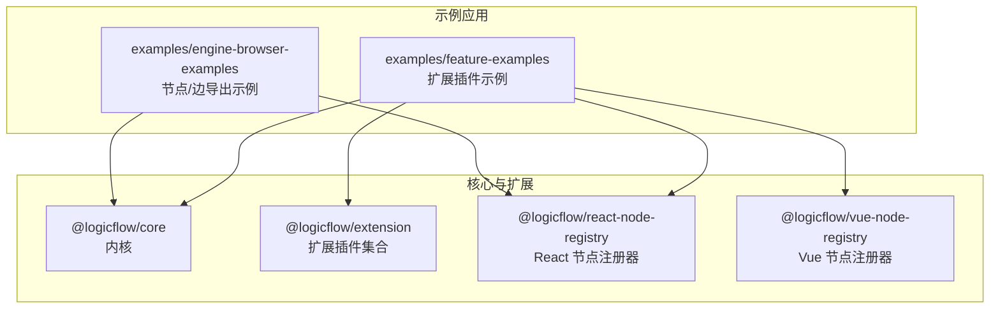
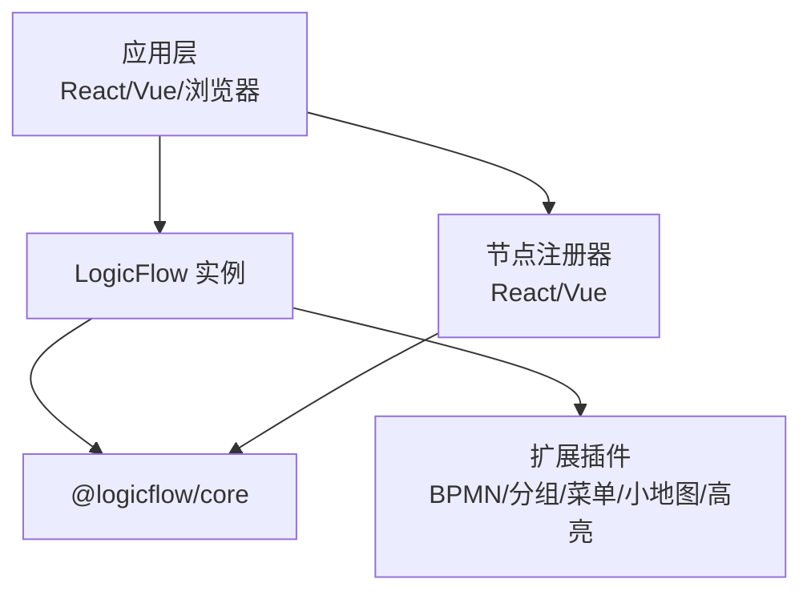
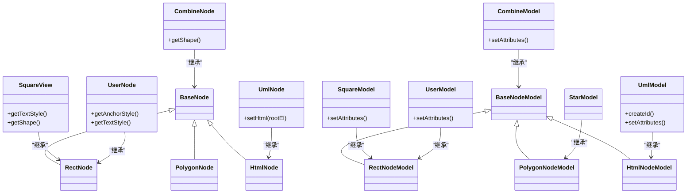
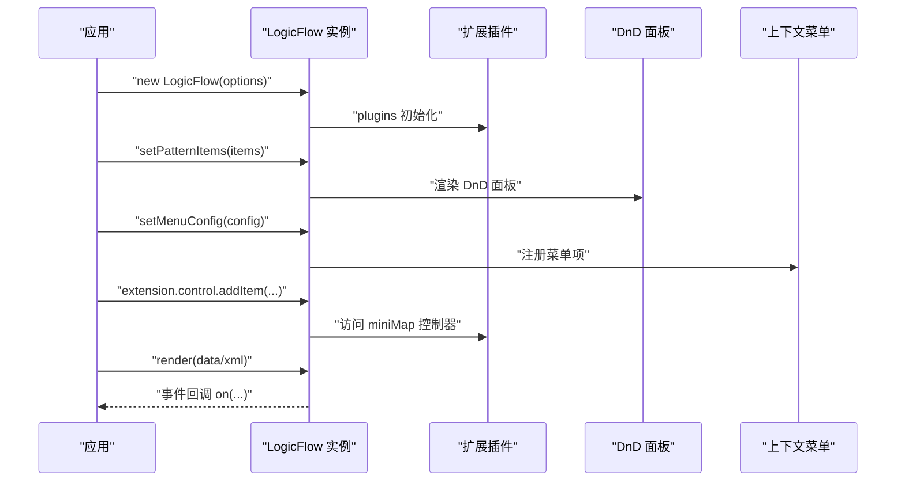
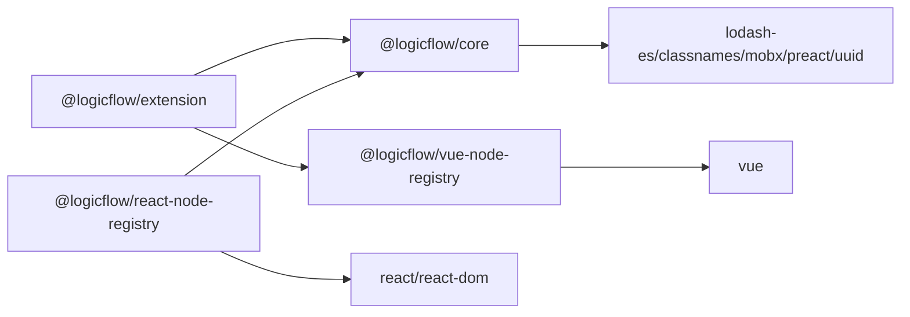

# 扩展开发

<cite>
**本文引用的文件**
- [packages/core/package.json](file://packages/core/package.json)
- [packages/extension/package.json](file://packages/extension/package.json)
- [packages/react-node-registry/package.json](file://packages/react-node-registry/package.json)
- [packages/vue-node-registry/package.json](file://packages/vue-node-registry/package.json)
- [examples/feature-examples/src/pages/extensions/bpmn/index.tsx](file://examples/feature-examples/src/pages/extensions/bpmn/index.tsx)
- [examples/feature-examples/src/pages/extensions/dynamic-group/index.tsx](file://examples/feature-examples/src/pages/extensions/dynamic-group/index.tsx)
- [examples/feature-examples/src/pages/extensions/group/index.tsx](file://examples/feature-examples/src/pages/extensions/group/index.tsx)
- [examples/feature-examples/src/pages/extensions/highlight/index.tsx](file://examples/feature-examples/src/pages/extensions/highlight/index.tsx)
- [examples/feature-examples/src/pages/extensions/menu/index.tsx](file://examples/feature-examples/src/pages/extensions/menu/index.tsx)
- [examples/feature-examples/src/pages/extensions/mini-map/index.tsx](file://examples/feature-examples/src/pages/extensions/mini-map/index.tsx)
- [examples/feature-examples/src/pages/graph/nodes/square.ts](file://examples/feature-examples/src/pages/graph/nodes/square.ts)
- [examples/feature-examples/src/pages/graph/nodes/star.ts](file://examples/feature-examples/src/pages/graph/nodes/star.ts)
- [examples/feature-examples/src/pages/graph/nodes/combine.ts](file://examples/feature-examples/src/pages/graph/nodes/combine.ts)
- [examples/feature-examples/src/pages/graph/nodes/uml.ts](file://examples/feature-examples/src/pages/graph/nodes/uml.ts)
- [examples/feature-examples/src/pages/graph/nodes/user.ts](file://examples/feature-examples/src/pages/graph/nodes/user.ts)
- [examples/engine-browser-examples/src/pages/graph/nodes/index.ts](file://examples/engine-browser-examples/src/pages/graph/nodes/index.ts)
- [examples/engine-browser-examples/src/pages/graph/edges/index.ts](file://examples/engine-browser-examples/src/pages/graph/edges/index.ts)
</cite>

## 目录
1. [简介](#简介)
2. [项目结构](#项目结构)
3. [核心组件](#核心组件)
4. [架构总览](#架构总览)
5. [详细组件分析](#详细组件分析)
6. [依赖分析](#依赖分析)
7. [性能考量](#性能考量)
8. [故障排查指南](#故障排查指南)
9. [结论](#结论)
10. [附录](#附录)

## 简介
本指南面向第三方开发者，系统讲解 LogicFlow 插件体系的架构与扩展机制，覆盖自定义节点（Vue 与 React 两种实现）、自定义边类型与交互逻辑、扩展包组织与发布策略、完整开发示例（节点注册、事件处理、样式定制）、性能优化与调试技巧，以及兼容性与稳定性建议。读者无需深入源码即可完成高质量扩展开发。

## 项目结构
该项目采用多包工作区结构，核心能力由 @logicflow/core 提供，扩展能力由 @logicflow/extension 提供，同时提供 @logicflow/react-node-registry 与 @logicflow/vue-node-registry 两个节点注册器，分别用于在 React 与 Vue 生态中快速注册自定义节点。

- 包级关系
  - @logicflow/core：内核，提供图形模型、渲染引擎、事件系统、编辑配置等基础能力
  - @logicflow/extension：扩展插件集合，提供 BPMN、分组、菜单、小地图、高亮、自动布局等插件
  - @logicflow/react-node-registry：React 节点注册器，便于在 React 应用中注册自定义节点
  - @logicflow/vue-node-registry：Vue 节点注册器，便于在 Vue 应用中注册自定义节点

- 示例工程
  - examples/feature-examples：展示各类扩展插件的使用方式与交互
  - examples/engine-browser-examples：浏览器端示例，演示节点与边的导出与聚合入口

图表来源
- [packages/core/package.json](file://packages/core/package.json#L1-L57)
- [packages/extension/package.json](file://packages/extension/package.json#L1-L61)
- [packages/react-node-registry/package.json](file://packages/react-node-registry/package.json#L1-L48)
- [packages/vue-node-registry/package.json](file://packages/vue-node-registry/package.json#L1-L56)
- [examples/feature-examples/src/pages/extensions/bpmn/index.tsx](file://examples/feature-examples/src/pages/extensions/bpmn/index.tsx#L1-L367)
- [examples/engine-browser-examples/src/pages/graph/nodes/index.ts](file://examples/engine-browser-examples/src/pages/graph/nodes/index.ts#L1-L16)

章节来源
- [packages/core/package.json](file://packages/core/package.json#L1-L57)
- [packages/extension/package.json](file://packages/extension/package.json#L1-L61)
- [packages/react-node-registry/package.json](file://packages/react-node-registry/package.json#L1-L48)
- [packages/vue-node-registry/package.json](file://packages/vue-node-registry/package.json#L1-L56)
- [examples/engine-browser-examples/src/pages/graph/nodes/index.ts](file://examples/engine-browser-examples/src/pages/graph/nodes/index.ts#L1-L16)
- [examples/engine-browser-examples/src/pages/graph/edges/index.ts](file://examples/engine-browser-examples/src/pages/graph/edges/index.ts#L1-L8)

## 核心组件
- 内核与插件
  - LogicFlow 实例负责初始化、渲染、事件绑定与插件管理
  - 扩展插件通过 plugins 数组启用，如 BPMN、分组、菜单、小地图、高亮、自动布局等
  - 插件可通过 extension.xxx 访问实例化后的插件对象，进行二次配置与调用

- 节点注册与渲染
  - 通过 register 注册自定义节点（model/view），或使用节点注册器在 React/Vue 中注册
  - 支持多种节点基类：RectNode、PolygonNode、HtmlNode、BaseNode 等，满足不同渲染需求

- 事件系统
  - 通过 on 绑定事件，如节点/边属性变更、分组折叠/展开、高亮模式切换等
  - 通过 setMenuConfig/setContextMenuItems 等接口配置上下文菜单

章节来源
- [examples/feature-examples/src/pages/extensions/bpmn/index.tsx](file://examples/feature-examples/src/pages/extensions/bpmn/index.tsx#L30-L60)
- [examples/feature-examples/src/pages/extensions/group/index.tsx](file://examples/feature-examples/src/pages/extensions/group/index.tsx#L91-L92)
- [examples/feature-examples/src/pages/extensions/highlight/index.tsx](file://examples/feature-examples/src/pages/extensions/highlight/index.tsx#L43-L57)
- [examples/feature-examples/src/pages/extensions/dynamic-group/index.tsx](file://examples/feature-examples/src/pages/extensions/dynamic-group/index.tsx#L294-L300)

## 架构总览
LogicFlow 的扩展架构围绕“内核 + 插件 + 节点注册器”的三层设计：
- 内核层：提供统一的图形模型、渲染管线、事件与编辑配置
- 插件层：以插件形式提供业务增强能力（如 BPMN、分组、菜单、小地图）
- 节点注册器层：在 React/Vue 生态中提供便捷的节点注册与渲染桥接

图表来源
- [examples/feature-examples/src/pages/extensions/bpmn/index.tsx](file://examples/feature-examples/src/pages/extensions/bpmn/index.tsx#L1-L30)
- [examples/feature-examples/src/pages/extensions/menu/index.tsx](file://examples/feature-examples/src/pages/extensions/menu/index.tsx#L14-L45)
- [examples/feature-examples/src/pages/extensions/mini-map/index.tsx](file://examples/feature-examples/src/pages/extensions/mini-map/index.tsx#L11-L26)
- [examples/feature-examples/src/pages/extensions/highlight/index.tsx](file://examples/feature-examples/src/pages/extensions/highlight/index.tsx#L12-L23)

## 详细组件分析

### 自定义节点开发（Vue 与 React 两种实现）
- 开发流程
  - 定义节点 Model：继承相应基类，设置尺寸、锚点、连接规则、默认样式与属性
  - 定义节点 View：根据渲染需求选择 SVG 或 HTML，返回对应的 h 元素或 DOM 片段
  - 注册节点：在应用中通过 register 注册，或使用节点注册器在 React/Vue 中注册
  - 在 DnD 面板中暴露节点图标与类型，支持拖拽创建

- 示例要点
  - 正方形节点：设置固定宽高、自定义锚点、连接规则与文本样式
  - 星形节点：基于多边形节点，预设顶点坐标
  - 组合节点：通过 h 创建复杂 SVG 图形
  - UML 节点：基于 HtmlNode，使用 setHtml 输出结构化 HTML
  - 用户节点：自定义文本样式与背景、半径、描边等

图表来源
- [examples/feature-examples/src/pages/graph/nodes/square.ts](file://examples/feature-examples/src/pages/graph/nodes/square.ts#L3-L76)
- [examples/feature-examples/src/pages/graph/nodes/star.ts](file://examples/feature-examples/src/pages/graph/nodes/star.ts#L3-L22)
- [examples/feature-examples/src/pages/graph/nodes/combine.ts](file://examples/feature-examples/src/pages/graph/nodes/combine.ts#L28-L48)
- [examples/feature-examples/src/pages/graph/nodes/uml.ts](file://examples/feature-examples/src/pages/graph/nodes/uml.ts#L3-L63)
- [examples/feature-examples/src/pages/graph/nodes/user.ts](file://examples/feature-examples/src/pages/graph/nodes/user.ts#L29-L47)

章节来源
- [examples/feature-examples/src/pages/graph/nodes/square.ts](file://examples/feature-examples/src/pages/graph/nodes/square.ts#L3-L76)
- [examples/feature-examples/src/pages/graph/nodes/star.ts](file://examples/feature-examples/src/pages/graph/nodes/star.ts#L3-L22)
- [examples/feature-examples/src/pages/graph/nodes/combine.ts](file://examples/feature-examples/src/pages/graph/nodes/combine.ts#L28-L48)
- [examples/feature-examples/src/pages/graph/nodes/uml.ts](file://examples/feature-examples/src/pages/graph/nodes/uml.ts#L3-L63)
- [examples/feature-examples/src/pages/graph/nodes/user.ts](file://examples/feature-examples/src/pages/graph/nodes/user.ts#L29-L47)

### 自定义边类型与交互逻辑
- 自定义边开发
  - 可参考现有边示例，结合业务场景定义边的样式、标签、动画与交互
  - 在 DnD 面板中配置边类型，支持拖拽创建
  - 通过事件系统监听边的创建、删除、文本编辑等行为

- 交互逻辑
  - 通过 setPatternItems 设置 DnD 面板中的节点/边项
  - 通过 setMenuConfig 配置节点/边/图的上下文菜单
  - 通过 on 绑定事件，实现高亮、路径计算、自动布局等功能

章节来源
- [examples/engine-browser-examples/src/pages/graph/edges/index.ts](file://examples/engine-browser-examples/src/pages/graph/edges/index.ts#L1-L8)
- [examples/feature-examples/src/pages/extensions/menu/index.tsx](file://examples/feature-examples/src/pages/extensions/menu/index.tsx#L136-L196)
- [examples/feature-examples/src/pages/extensions/highlight/index.tsx](file://examples/feature-examples/src/pages/extensions/highlight/index.tsx#L43-L57)

### 扩展包组织与发布策略
- 包结构
  - @logicflow/core：内核，提供基础能力
  - @logicflow/extension：扩展插件集合，作为插件生态的核心
  - @logicflow/react-node-registry：React 节点注册器
  - @logicflow/vue-node-registry：Vue 节点注册器

- 发布策略
  - 使用统一版本号，保持各包版本一致
  - peerDependencies 指向 @logicflow/core 与对应框架版本，避免重复打包
  - 通过构建脚本生成 ESM/CJS/Umd 多格式产物，满足不同运行时需求

章节来源
- [packages/core/package.json](file://packages/core/package.json#L1-L57)
- [packages/extension/package.json](file://packages/extension/package.json#L1-L61)
- [packages/react-node-registry/package.json](file://packages/react-node-registry/package.json#L1-L48)
- [packages/vue-node-registry/package.json](file://packages/vue-node-registry/package.json#L1-L56)

### 完整开发示例（节点注册、事件处理、样式定制）
- 节点注册
  - 在应用中通过 register 注册自定义节点
  - 或使用节点注册器在 React/Vue 中注册，减少样板代码

- 事件处理
  - 通过 on 绑定节点/边属性变更、分组折叠/展开、高亮模式切换等事件
  - 结合 extension.xxx 对插件进行二次配置与调用

- 样式定制
  - 在 Model 中设置尺寸、颜色、描边、圆角等
  - 在 View 中通过 getTextStyle/getAnchorStyle 返回样式对象
  - 通过 setHtml 输出结构化 HTML，实现复杂 UI

章节来源
- [examples/feature-examples/src/pages/extensions/group/index.tsx](file://examples/feature-examples/src/pages/extensions/group/index.tsx#L91-L92)
- [examples/feature-examples/src/pages/extensions/highlight/index.tsx](file://examples/feature-examples/src/pages/extensions/highlight/index.tsx#L43-L57)
- [examples/feature-examples/src/pages/graph/nodes/user.ts](file://examples/feature-examples/src/pages/graph/nodes/user.ts#L7-L40)

### BPMN 扩展与交互
- 功能概览
  - 启用 BpmnElement、MiniMap、FlowPath、AutoLayout、DndPanel、Menu、ContextMenu、Group、Control、BpmnXmlAdapter、Snapshot、SelectionSelect 等插件
  - 通过 setPatternItems 配置 DnD 面板，支持拖拽创建 BPMN 节点
  - 通过 setMenuConfig 与 setContextMenuItems 配置上下文菜单
  - 通过 extension.control 与 extension.miniMap 进行二次配置

图表来源
- [examples/feature-examples/src/pages/extensions/bpmn/index.tsx](file://examples/feature-examples/src/pages/extensions/bpmn/index.tsx#L30-L60)
- [examples/feature-examples/src/pages/extensions/bpmn/index.tsx](file://examples/feature-examples/src/pages/extensions/bpmn/index.tsx#L131-L180)
- [examples/feature-examples/src/pages/extensions/bpmn/index.tsx](file://examples/feature-examples/src/pages/extensions/bpmn/index.tsx#L183-L206)

章节来源
- [examples/feature-examples/src/pages/extensions/bpmn/index.tsx](file://examples/feature-examples/src/pages/extensions/bpmn/index.tsx#L1-L367)

### 分组与动态分组
- 分组能力
  - 通过 Group/DynamicGroup 插件启用分组与动态分组
  - 支持折叠/展开、父子节点联动、嵌套分组等
  - 通过 extension.control 注入自定义按钮，实现移动分组、添加子节点等操作

- 事件监听
  - 监听 node:properties-change 与 dynamicGroup:collapse 等事件，实现业务联动

章节来源
- [examples/feature-examples/src/pages/extensions/group/index.tsx](file://examples/feature-examples/src/pages/extensions/group/index.tsx#L1-L201)
- [examples/feature-examples/src/pages/extensions/dynamic-group/index.tsx](file://examples/feature-examples/src/pages/extensions/dynamic-group/index.tsx#L1-L393)

### 菜单与高亮
- 菜单插件
  - 通过 Menu 插件配置节点/边/图三级菜单，支持禁用/启用菜单项、切换静默模式等

- 高亮插件
  - 通过 Highlight 插件实现路径/单元素/相邻元素三种高亮模式
  - 通过 extension.highlight.setMode 切换高亮模式

章节来源
- [examples/feature-examples/src/pages/extensions/menu/index.tsx](file://examples/feature-examples/src/pages/extensions/menu/index.tsx#L1-L253)
- [examples/feature-examples/src/pages/extensions/highlight/index.tsx](file://examples/feature-examples/src/pages/extensions/highlight/index.tsx#L1-L85)

### 小地图
- 小地图插件
  - 通过 MiniMap 插件在画布角落显示小地图，支持显示/隐藏、更新位置、重置主画布等
  - 通过 extension.miniMap 访问控制器并进行二次配置

章节来源
- [examples/feature-examples/src/pages/extensions/mini-map/index.tsx](file://examples/feature-examples/src/pages/extensions/mini-map/index.tsx#L1-L201)

## 依赖分析
- 包间依赖
  - @logicflow/extension 依赖 @logicflow/core 与 @logicflow/vue-node-registry
  - @logicflow/react-node-registry 依赖 @logicflow/core 与 React 生态
  - @logicflow/vue-node-registry 依赖 @logicflow/core 与 Vue 生态

- 运行时依赖
  - lodash-es、classnames、mobx、preact、uuid 等用于通用工具、样式、状态与标识符

图表来源
- [packages/extension/package.json](file://packages/extension/package.json#L38-L53)
- [packages/react-node-registry/package.json](file://packages/react-node-registry/package.json#L34-L45)
- [packages/vue-node-registry/package.json](file://packages/vue-node-registry/package.json#L32-L45)
- [packages/core/package.json](file://packages/core/package.json#L42-L51)

章节来源
- [packages/extension/package.json](file://packages/extension/package.json#L38-L53)
- [packages/react-node-registry/package.json](file://packages/react-node-registry/package.json#L34-L45)
- [packages/vue-node-registry/package.json](file://packages/vue-node-registry/package.json#L32-L45)
- [packages/core/package.json](file://packages/core/package.json#L42-L51)

## 性能考量
- 渲染优化
  - 合理设置网格与对齐，减少不必要的重绘
  - 控制节点/边数量，必要时采用虚拟滚动或分页加载
  - 使用合适的锚点与连接规则，避免复杂路径计算

- 事件与插件
  - 仅启用必要的插件，避免过多事件监听
  - 对高频事件（如鼠标移动）进行节流/防抖处理

- 样式与资源
  - 复用样式变量，减少重复计算
  - 图标与图片资源按需加载，避免阻塞主线程

## 故障排查指南
- 常见问题
  - 插件未生效：检查 plugins 数组是否正确传入，插件是否已 use 或在 plugins 中启用
  - 节点无法拖拽：检查 DnD 面板是否配置，setPatternItems 是否调用
  - 上下文菜单不显示：检查 setMenuConfig/setContextMenuItems 是否正确设置
  - 样式异常：检查 getNodeStyle/getTextStyle 返回值是否正确，CSS 是否被覆盖

- 调试技巧
  - 使用 on 绑定关键事件，打印事件参数定位问题
  - 逐步注释插件与事件监听，缩小问题范围
  - 使用 extension.xxx 访问插件实例，调用其公开方法验证状态

章节来源
- [examples/feature-examples/src/pages/extensions/bpmn/index.tsx](file://examples/feature-examples/src/pages/extensions/bpmn/index.tsx#L158-L231)
- [examples/feature-examples/src/pages/extensions/menu/index.tsx](file://examples/feature-examples/src/pages/extensions/menu/index.tsx#L122-L201)
- [examples/feature-examples/src/pages/extensions/highlight/index.tsx](file://examples/feature-examples/src/pages/extensions/highlight/index.tsx#L43-L57)

## 结论
通过本指南，开发者可以基于 LogicFlow 的插件体系与节点注册器，快速实现自定义节点与边，并在 React/Vue 生态中高效集成。遵循本文的组织结构、开发流程、性能优化与调试方法，可显著提升扩展的稳定性与可维护性。

## 附录
- 关键 API 速查
  - LogicFlow 实例：plugins、pluginsOptions、render、on、extension.xxx、setMenuConfig、setContextMenuItems、setPatternItems
  - 节点注册：register、React/Vue 节点注册器
  - 插件：BpmnElement、Group、DynamicGroup、Menu、MiniMap、Highlight、Control、DndPanel、SelectionSelect、AutoLayout、Snapshot、FlowPath