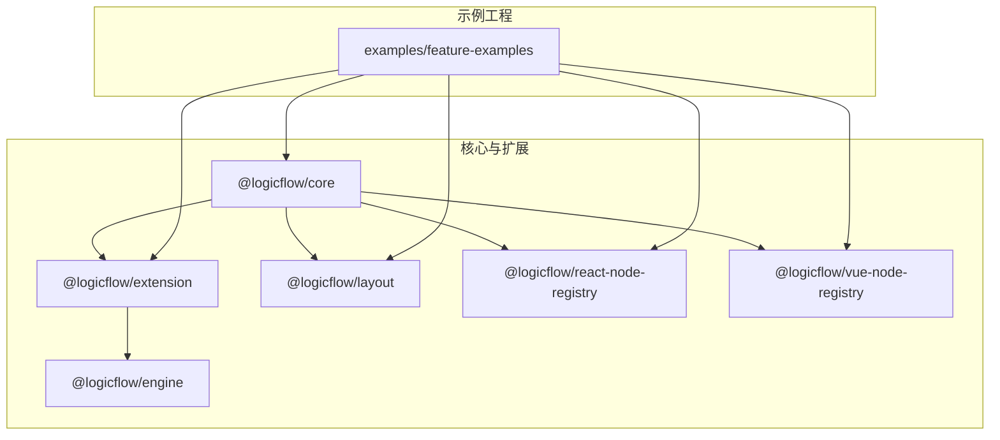
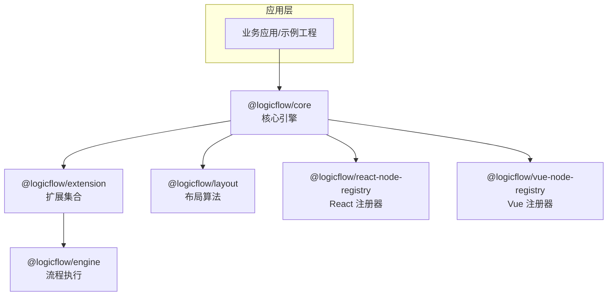
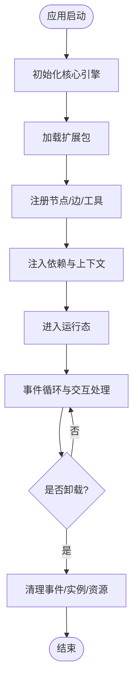
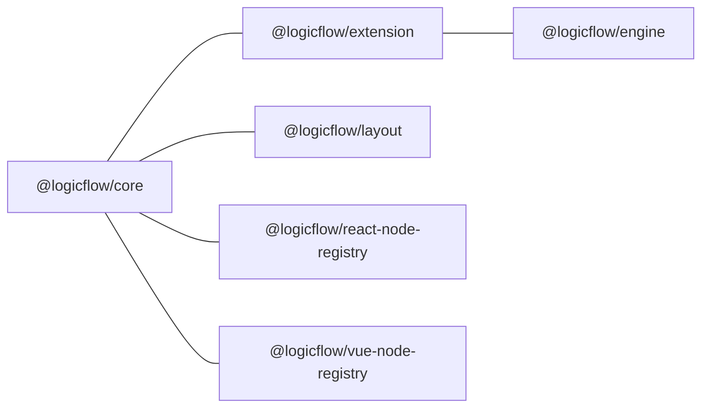
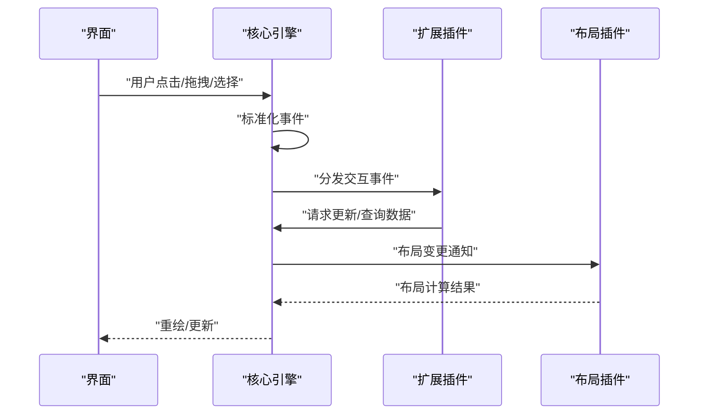
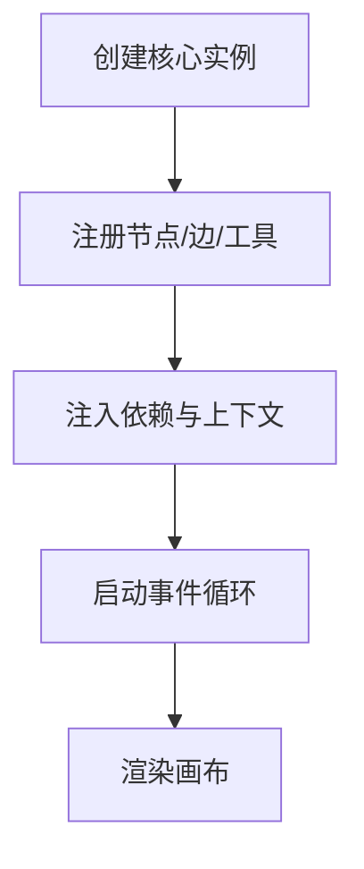
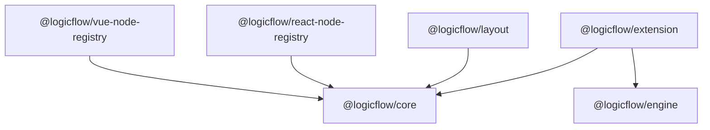

# 插件系统架构

<cite>
**本文引用的文件**
- [packages/core/package.json](file://packages/core/package.json)
- [packages/engine/package.json](file://packages/engine/package.json)
- [packages/extension/package.json](file://packages/extension/package.json)
- [packages/layout/package.json](file://packages/layout/package.json)
- [packages/react-node-registry/package.json](file://packages/react-node-registry/package.json)
- [packages/vue-node-registry/package.json](file://packages/vue-node-registry/package.json)
- [examples/feature-examples/src/pages/extensions/bpmn/index.tsx](file://examples/feature-examples/src/pages/extensions/bpmn/index.tsx)
- [examples/feature-examples/src/pages/extensions/control/index.tsx](file://examples/feature-examples/src/pages/extensions/control/index.tsx)
- [examples/feature-examples/src/pages/extensions/dnd-panel/index.tsx](file://examples/feature-examples/src/pages/extensions/dnd-panel/index.tsx)
- [examples/feature-examples/src/pages/extensions/highlight/index.tsx](file://examples/feature-examples/src/pages/extensions/highlight/index.tsx)
- [examples/feature-examples/src/pages/extensions/menu/index.tsx](file://examples/feature-examples/src/pages/extensions/menu/index.tsx)
- [examples/feature-examples/src/pages/extensions/mini-map/index.tsx](file://examples/feature-examples/src/pages/extensions/mini-map/index.tsx)
- [examples/feature-examples/src/pages/extensions/node-selection/index.tsx](file://examples/feature-examples/src/pages/extensions/node-selection/index.tsx)
- [examples/feature-examples/src/pages/extensions/proximity-connect/index.tsx](file://examples/feature-examples/src/pages/extensions/proximity-connect/index.tsx)
- [examples/feature-examples/src/pages/extensions/rules/index.tsx](file://examples/feature-examples/src/pages/extensions/rules/index.tsx)
- [examples/feature-examples/src/pages/extensions/selection-select/index.tsx](file://examples/feature-examples/src/pages/extensions/selection-select/index.tsx)
- [examples/feature-examples/src/pages/extensions/snapshot/index.tsx](file://examples/feature-examples/src/pages/extensions/snapshot/index.tsx)
- [examples/feature-examples/src/pages/graph/nodes/index.tsx](file://examples/feature-examples/src/pages/graph/nodes/index.tsx)
- [examples/feature-examples/src/pages/graph/edges/index.ts](file://examples/feature-examples/src/pages/graph/edges/index.ts)
- [examples/feature-examples/src/pages/graph/layout/default/index.tsx](file://examples/feature-examples/src/pages/graph/layout/default/index.tsx)
- [examples/feature-examples/src/pages/graph/layout/custom/registerNodeConfig/index.tsx](file://examples/feature-examples/src/pages/graph/layout/custom/registerNodeConfig/index.tsx)
- [examples/feature-examples/src/pages/theme/index.tsx](file://examples/feature-examples/src/pages/theme/index.tsx)
- [examples/feature-examples/src/pages/theme/shared-theme.tsx](file://examples/feature-examples/src/pages/theme/shared-theme.tsx)
- [examples/feature-examples/src/pages/theme/config.ts](file://examples/feature-examples/src/pages/theme/config.ts)
- [examples/feature-examples/src/pages/nodes/custom/html/index.ts](file://examples/feature-examples/src/pages/nodes/custom/html/index.ts)
- [examples/feature-examples/src/pages/nodes/custom/icon/index.tsx](file://examples/feature-examples/src/pages/nodes/custom/icon/index.tsx)
- [examples/feature-examples/src/pages/nodes/custom/image/index.tsx](file://examples/feature-examples/src/pages/nodes/custom/image/index.tsx)
- [examples/feature-examples/src/pages/nodes/custom/pool/index.tsx](file://examples/feature-examples/src/pages/nodes/custom/pool/index.tsx)
- [examples/feature-examples/src/pages/nodes/custom/rect/index.tsx](file://examples/feature-examples/src/pages/nodes/custom/rect/index.tsx)
- [examples/feature-examples/src/pages/nodes/custom/theme/index.tsx](file://examples/feature-examples/src/pages/nodes/custom/theme/index.tsx)
- [examples/feature-examples/src/pages/nodes/native/index.tsx](file://examples/feature-examples/src/pages/nodes/native/index.tsx)
- [examples/feature-examples/src/pages/edges/custom/animate-polyline/index.tsx](file://examples/feature-examples/src/pages/edges/custom/animate-polyline/index.tsx)
- [examples/feature-examples/src/pages/edges/custom/curved-polyline/index.tsx](file://examples/feature-examples/src/pages/edges/custom/curved-polyline/index.tsx)
- [examples/feature-examples/src/pages/edges/custom/polyline/index.tsx](file://examples/feature-examples/src/pages/edges/custom/polyline/index.tsx)
- [examples/feature-examples/src/pages/background/index.tsx](file://examples/feature-examples/src/pages/background/index.tsx)
- [examples/feature-examples/src/pages/grid/index.tsx](file://examples/feature-examples/src/pages/grid/index.tsx)
- [examples/feature-examples/src/pages/layout/default/index.tsx](file://examples/feature-examples/src/pages/layout/default/index.tsx)
- [examples/feature-examples/src/pages/layout/custom/index.tsx](file://examples/feature-examples/src/pages/layout/custom/index.tsx)
- [examples/feature-examples/src/pages/performance/snapshot-elements/index.tsx](file://examples/feature-examples/src/pages/performance/snapshot-elements/index.tsx)
- [examples/feature-examples/src/pages/react/Portal.tsx](file://examples/feature-examples/src/pages/react/Portal.tsx)
- [examples/feature-examples/src/pages/react/index.tsx](file://examples/feature-examples/src/pages/react/index.tsx)
- [examples/feature-examples/src/pages/theme/shared-theme.less](file://examples/feature-examples/src/pages/theme/shared-theme.less)
- [examples/feature-examples/src/pages/theme/index.less](file://examples/feature-examples/src/pages/theme/index.less)
- [examples/feature-examples/src/pages/theme/shared-theme.less](file://examples/feature-examples/src/pages/theme/shared-theme.less)
- [examples/feature-examples/src/pages/theme/index.less](file://examples/feature-examples/src/pages/theme/index.less)
- [examples/feature-examples/src/pages/theme/config.ts](file://examples/feature-examples/src/pages/theme/config.ts)
- [examples/feature-examples/src/pages/theme/shared-theme.tsx](file://examples/feature-examples/src/pages/theme/shared-theme.tsx)
- [examples/feature-examples/src/pages/theme/index.tsx](file://examples/feature-examples/src/pages/theme/index.tsx)
- [examples/feature-examples/src/pages/theme/shared-theme.less](file://examples/feature-examples/src/pages/theme/shared-theme.less)
- [examples/feature-examples/src/pages/theme/index.less](file://examples/feature-examples/src/pages/theme/index.less)
- [examples/feature-examples/src/pages/theme/config.ts](file://examples/feature-examples/src/pages/theme/config.ts)
- [examples/feature-examples/src/pages/theme/shared-theme.tsx](file://examples/feature-examples/src/pages/theme/shared-theme.tsx)
- [examples/feature-examples/src/pages/theme/index.tsx](file://examples/feature-examples/src/pages/theme/index.tsx)
- [examples/feature-examples/src/pages/theme/shared-theme.less](file://examples/feature-examples/src/pages/theme/shared-theme.less)
- [examples/feature-examples/src/pages/theme/index.less](file://examples/feature-examples/src/pages/theme/index.less)
- [examples/feature-examples/src/pages/theme/config.ts](file://examples/feature-examples/src/pages/theme/config.ts)
- [examples/feature-examples/src/pages/theme/shared-theme.tsx](file://examples/feature-examples/src/pages/theme/shared-theme.tsx)
- [examples/feature-examples/src/pages/theme/index.tsx](file://examples/feature-examples/src/pages/theme/index.tsx)
- [examples/feature-examples/src/pages/theme/shared-theme.less](file://examples/feature-examples/src/pages/theme/shared-theme.less)
- [examples/feature-examples/src/pages/theme/index.less](file://examples/feature-examples/src/pages/theme/index.less)
- [examples/feature-examples/src/pages/theme/config.ts](file://examples/feature-examples/src/pages/theme/config.ts)
- [examples/feature-examples/src/pages/theme/shared-theme.tsx](file://examples/feature-examples/src/pages/theme/shared-theme.tsx)
- [examples/feature-examples/src/pages/theme/index.tsx](file://examples/feature-examples/src/pages/theme/index.tsx)
- [examples/feature-examples/src/pages/theme/shared-theme.less](file://examples/feature-examples/src/pages/theme/shared-theme.less)
- [examples/feature-examples/src/pages/theme/index.less](file://examples/feature-examples/src/pages/theme/index.less)
- [examples/feature-examples/src/pages/theme/config.ts](file://examples/feature-examples/src/pages/theme/config.ts)
- [examples/feature-examples/src/pages/theme/shared-theme.tsx](file://examples/feature-examples/src/pages/theme/shared-theme.tsx)
- [examples/feature-examples/src/pages/theme/index.tsx](file://examples/feature-examples/src/pages/theme/index.tsx)
- [examples/feature-examples/src/pages/theme/shared-theme.less](file://examples/feature-examples/src/pages/theme/shared-theme.less)
- [examples/feature-examples/src/pages/theme/index.less](file://examples/feature-examples/src/pages/theme/index.less)
- [examples/feature-examples/src/pages/theme/config.ts](file://examples/feature-examples/src/pages/theme/config.ts)
- [examples/feature-examples/src/pages/theme/shared-theme.tsx](file://examples/feature-examples/src/pages/theme/shared-theme.tsx)
- [examples/feature-examples/src/pages/theme/index.tsx](file://examples/feature-examples/src/pages/theme/index.tsx)
- [examples/feature-examples/src/pages/theme/shared-theme.less](file://examples/feature-examples/src/pages/theme/shared-theme.less)
- [examples/feature-examples/src/pages/theme/index.less](file://examples/feature-examples/src/pages/theme/index.less)
- [examples/feature-examples/src/pages/theme/config.ts](file://examples/feature-examples/src/pages/theme/config.ts)
- [examples/feature-examples/src/pages/theme/shared-theme.tsx](file://examples/feature-examples/src/pages/theme/shared-theme.tsx)
- [examples/feature-examples/src/pages/theme/index.tsx......](file://examples/feature-examples/src/pages/theme/index.tsx)
</cite>

## 目录
1. [简介](#简介)
2. [项目结构](#项目结构)
3. [核心组件](#核心组件)
4. [架构总览](#架构总览)
5. [详细组件分析](#详细组件分析)
6. [依赖关系分析](#依赖关系分析)
7. [性能考量](#性能考量)
8. [故障排查指南](#故障排查指南)
9. [结论](#结论)
10. [附录](#附录)

## 简介
本文件面向 LogicFlow 插件系统的架构与实现，围绕插件的分类体系、生命周期管理、注册机制、依赖注入、插件间通信与事件传递、加载顺序与初始化流程、扩展点与钩子函数等维度进行系统化梳理。通过仓库中的多包结构与示例工程，提炼出插件系统的设计理念与最佳实践，帮助开发者正确设计与实现高质量插件。

## 项目结构
该仓库采用多包（monorepo）组织方式，核心模块与扩展模块分包管理，便于按需组合与独立演进。核心包与扩展包的关系如下图所示：

图表来源
- [packages/core/package.json](file://packages/core/package.json#L1-L57)
- [packages/extension/package.json](file://packages/extension/package.json#L1-L61)
- [packages/layout/package.json](file://packages/layout/package.json#L1-L50)
- [packages/engine/package.json](file://packages/engine/package.json#L1-L50)
- [packages/react-node-registry/package.json](file://packages/react-node-registry/package.json#L1-L48)
- [packages/vue-node-registry/package.json](file://packages/vue-node-registry/package.json#L1-L56)

章节来源
- [packages/core/package.json](file://packages/core/package.json#L1-L57)
- [packages/extension/package.json](file://packages/extension/package.json#L1-L61)
- [packages/layout/package.json](file://packages/layout/package.json#L1-L50)
- [packages/engine/package.json](file://packages/engine/package.json#L1-L50)
- [packages/react-node-registry/package.json](file://packages/react-node-registry/package.json#L1-L48)
- [packages/vue-node-registry/package.json](file://packages/vue-node-registry/package.json#L1-L56)

## 核心组件
- 核心引擎与数据流
  - @logicflow/core：提供基础画布、节点/边模型、事件系统、布局接口与状态管理能力，是所有插件的基础运行时。
- 扩展生态
  - @logicflow/extension：提供丰富的交互扩展（如 BPMN、拖拽面板、菜单、高亮、规则校验、缩略图等），通常依赖核心包与视图层注册器。
- 布局与算法
  - @logicflow/layout：封装 DAGRE、ELK 等布局算法，作为插件或扩展使用的核心布局能力。
- 运行时与脚本执行
  - @logicflow/engine：提供流程执行与脚本沙箱能力，常用于规则、脚本节点等场景。
- 视图层注册器
  - @logicflow/react-node-registry：为 React 组件节点提供注册与渲染能力。
  - @logicflow/vue-node-registry：为 Vue 组件节点提供注册与渲染能力。

章节来源
- [packages/core/package.json](file://packages/core/package.json#L1-L57)
- [packages/extension/package.json](file://packages/extension/package.json#L1-L61)
- [packages/layout/package.json](file://packages/layout/package.json#L1-L50)
- [packages/engine/package.json](file://packages/engine/package.json#L1-L50)
- [packages/react-node-registry/package.json](file://packages/react-node-registry/package.json#L1-L48)
- [packages/vue-node-registry/package.json](file://packages/vue-node-registry/package.json#L1-L56)

## 架构总览
插件系统以“核心包 + 多扩展包 + 视图注册器”的分层架构实现。核心包提供统一的数据模型与事件总线；扩展包通过注册机制向核心注入节点、边、工具与布局；视图注册器负责将自定义组件映射到节点形状；运行时包提供脚本与流程执行能力。

图表来源
- [packages/core/package.json](file://packages/core/package.json#L1-L57)
- [packages/extension/package.json](file://packages/extension/package.json#L1-L61)
- [packages/layout/package.json](file://packages/layout/package.json#L1-L50)
- [packages/engine/package.json](file://packages/engine/package.json#L1-L50)
- [packages/react-node-registry/package.json](file://packages/react-node-registry/package.json#L1-L48)
- [packages/vue-node-registry/package.json](file://packages/vue-node-registry/package.json#L1-L56)

## 详细组件分析

### 插件分类体系
- 节点插件（Node Plugins）
  - 自定义节点：通过视图注册器注册 React/Vue 组件，或在核心包中定义节点配置。
  - 示例路径：nodes/custom/*、nodes/native、graph/nodes
- 边插件（Edge Plugins）
  - 自定义边：定义边的样式、动画、连接策略等。
  - 示例路径：edges/custom/*
- 工具插件（Tool Plugins）
  - 交互工具：控制面板、菜单、高亮、选择、规则校验、拖拽面板、缩略图等。
  - 示例路径：extensions/control、extensions/menu、extensions/highlight、extensions/rules、extensions/dnd-panel、extensions/mini-map、extensions/snapshot
- 布局插件（Layout Plugins）
  - 布局算法：默认布局、自定义布局、注册节点配置。
  - 示例路径：layout/default、layout/custom、graph/layout/default、graph/layout/custom/registerNodeConfig
- 主题与样式插件（Theme Plugins）
  - 主题配置、共享主题、样式资源。
  - 示例路径：theme/*

章节来源
- [examples/feature-examples/src/pages/nodes/custom/html/index.ts](file://examples/feature-examples/src/pages/nodes/custom/html/index.ts)
- [examples/feature-examples/src/pages/nodes/custom/icon/index.tsx](file://examples/feature-examples/src/pages/nodes/custom/icon/index.tsx)
- [examples/feature-examples/src/pages/nodes/custom/image/index.tsx](file://examples/feature-examples/src/pages/nodes/custom/image/index.tsx)
- [examples/feature-examples/src/pages/nodes/custom/pool/index.tsx](file://examples/feature-examples/src/pages/nodes/custom/pool/index.tsx)
- [examples/feature-examples/src/pages/nodes/custom/rect/index.tsx](file://examples/feature-examples/src/pages/nodes/custom/rect/index.tsx)
- [examples/feature-examples/src/pages/nodes/custom/theme/index.tsx](file://examples/feature-examples/src/pages/nodes/custom/theme/index.tsx)
- [examples/feature-examples/src/pages/nodes/native/index.tsx](file://examples/feature-examples/src/pages/nodes/native/index.tsx)
- [examples/feature-examples/src/pages/edges/custom/animate-polyline/index.tsx](file://examples/feature-examples/src/pages/edges/custom/animate-polyline/index.tsx)
- [examples/feature-examples/src/pages/edges/custom/curved-polyline/index.tsx](file://examples/feature-examples/src/pages/edges/custom/curved-polyline/index.tsx)
- [examples/feature-examples/src/pages/edges/custom/polyline/index.tsx](file://examples/feature-examples/src/pages/edges/custom/polyline/index.tsx)
- [examples/feature-examples/src/pages/extensions/control/index.tsx](file://examples/feature-examples/src/pages/extensions/control/index.tsx)
- [examples/feature-examples/src/pages/extensions/menu/index.tsx](file://examples/feature-examples/src/pages/extensions/menu/index.tsx)
- [examples/feature-examples/src/pages/extensions/highlight/index.tsx](file://examples/feature-examples/src/pages/extensions/highlight/index.tsx)
- [examples/feature-examples/src/pages/extensions/rules/index.tsx](file://examples/feature-examples/src/pages/extensions/rules/index.tsx)
- [examples/feature-examples/src/pages/extensions/dnd-panel/index.tsx](file://examples/feature-examples/src/pages/extensions/dnd-panel/index.tsx)
- [examples/feature-examples/src/pages/extensions/mini-map/index.tsx](file://examples/feature-examples/src/pages/extensions/mini-map/index.tsx)
- [examples/feature-examples/src/pages/extensions/snapshot/index.tsx](file://examples/feature-examples/src/pages/extensions/snapshot/index.tsx)
- [examples/feature-examples/src/pages/layout/default/index.tsx](file://examples/feature-examples/src/pages/layout/default/index.tsx)
- [examples/feature-examples/src/pages/layout/custom/index.tsx](file://examples/feature-examples/src/pages/layout/custom/index.tsx)
- [examples/feature-examples/src/pages/graph/layout/default/index.tsx](file://examples/feature-examples/src/pages/graph/layout/default/index.tsx)
- [examples/feature-examples/src/pages/graph/layout/custom/registerNodeConfig/index.tsx](file://examples/feature-examples/src/pages/graph/layout/custom/registerNodeConfig/index.tsx)
- [examples/feature-examples/src/pages/theme/index.tsx](file://examples/feature-examples/src/pages/theme/index.tsx)
- [examples/feature-examples/src/pages/theme/shared-theme.tsx](file://examples/feature-examples/src/pages/theme/shared-theme.tsx)
- [examples/feature-examples/src/pages/theme/config.ts](file://examples/feature-examples/src/pages/theme/config.ts)

### 生命周期管理与注册机制
- 生命周期阶段
  - 初始化：应用启动时加载核心包与扩展包，完成插件注册与依赖注入。
  - 运行期：监听事件总线，响应用户交互与数据变更。
  - 卸载：清理事件订阅、销毁实例与资源。
- 注册机制
  - 节点注册：通过视图注册器将组件注册为节点类型，随后在画布中使用。
  - 边注册：定义边的渲染与交互行为，注入到核心引擎。
  - 工具注册：将工具面板、菜单、快捷键等注册为核心扩展。
  - 布局注册：注册布局算法与节点配置，参与自动布局流程。
- 依赖注入
  - 通过 peerDependencies 与 workspace:* 约束版本，确保核心与扩展包的兼容性。
  - 通过包内导出的注册 API 完成插件注入，避免硬编码耦合。

图表来源
- [packages/core/package.json](file://packages/core/package.json#L1-L57)
- [packages/extension/package.json](file://packages/extension/package.json#L1-L61)
- [packages/react-node-registry/package.json](file://packages/react-node-registry/package.json#L1-L48)
- [packages/vue-node-registry/package.json](file://packages/vue-node-registry/package.json#L1-L56)

章节来源
- [packages/core/package.json](file://packages/core/package.json#L1-L57)
- [packages/extension/package.json](file://packages/extension/package.json#L1-L61)
- [packages/react-node-registry/package.json](file://packages/react-node-registry/package.json#L1-L48)
- [packages/vue-node-registry/package.json](file://packages/vue-node-registry/package.json#L1-L56)

### 依赖注入系统
- 版本与依赖约束
  - 扩展包对核心包与视图注册器声明 peerDependencies，保证运行时一致性。
  - 布局包依赖核心包与第三方布局库，提供可插拔的布局能力。
  - 引擎包提供流程执行能力，供规则与脚本类插件使用。
- 注入点
  - 通过包导出的注册 API 将插件注入核心引擎。
  - 通过主题与样式配置文件实现外观层的注入。

图表来源
- [packages/extension/package.json](file://packages/extension/package.json#L38-L53)
- [packages/layout/package.json](file://packages/layout/package.json#L41-L45)
- [packages/react-node-registry/package.json](file://packages/react-node-registry/package.json#L34-L46)
- [packages/vue-node-registry/package.json](file://packages/vue-node-registry/package.json#L36-L40)
- [packages/engine/package.json](file://packages/engine/package.json#L42-L45)

章节来源
- [packages/extension/package.json](file://packages/extension/package.json#L38-L53)
- [packages/layout/package.json](file://packages/layout/package.json#L41-L45)
- [packages/react-node-registry/package.json](file://packages/react-node-registry/package.json#L34-L46)
- [packages/vue-node-registry/package.json](file://packages/vue-node-registry/package.json#L36-L40)
- [packages/engine/package.json](file://packages/engine/package.json#L42-L45)

### 插件间通信协议与事件传递机制
- 事件总线
  - 核心引擎提供统一事件总线，插件通过订阅/发布消息实现解耦通信。
- 典型事件链路
  - 用户操作触发事件 → 核心引擎分发 → 相关插件响应 → 更新状态/渲染。
- 示例事件流（登录/注册/中间件）

图表来源
- [packages/core/package.json](file://packages/core/package.json#L1-L57)
- [packages/extension/package.json](file://packages/extension/package.json#L1-L61)
- [packages/layout/package.json](file://packages/layout/package.json#L1-L50)

章节来源
- [packages/core/package.json](file://packages/core/package.json#L1-L57)
- [packages/extension/package.json](file://packages/extension/package.json#L1-L61)
- [packages/layout/package.json](file://packages/layout/package.json#L1-L50)

### 加载顺序与初始化流程
- 加载顺序
  - 核心包优先加载，确保事件总线与基础能力可用。
  - 视图注册器次之，提供节点渲染能力。
  - 扩展包与布局包随后加载，注入工具与布局能力。
  - 引擎包最后加载，提供脚本与流程执行能力。
- 初始化流程
  - 应用启动 → 创建核心实例 → 注册节点/边/工具 → 注入依赖 → 启动事件循环 → 渲染画布。

图表来源
- [packages/core/package.json](file://packages/core/package.json#L1-L57)
- [packages/react-node-registry/package.json](file://packages/react-node-registry/package.json#L1-L48)
- [packages/vue-node-registry/package.json](file://packages/vue-node-registry/package.json#L1-L56)
- [packages/extension/package.json](file://packages/extension/package.json#L1-L61)
- [packages/layout/package.json](file://packages/layout/package.json#L1-L50)
- [packages/engine/package.json](file://packages/engine/package.json#L1-L50)

章节来源
- [packages/core/package.json](file://packages/core/package.json#L1-L57)
- [packages/react-node-registry/package.json](file://packages/react-node-registry/package.json#L1-L48)
- [packages/vue-node-registry/package.json](file://packages/vue-node-registry/package.json#L1-L56)
- [packages/extension/package.json](file://packages/extension/package.json#L1-L61)
- [packages/layout/package.json](file://packages/layout/package.json#L1-L50)
- [packages/engine/package.json](file://packages/engine/package.json#L1-L50)

### 接口规范与约束条件
- 节点接口
  - 必须提供节点标识、渲染函数、交互回调与样式配置。
  - 通过视图注册器注册，遵循统一的节点生命周期钩子。
- 边接口
  - 必须提供边的起点/终点、路径计算、样式与动画。
  - 支持自定义连接策略与约束。
- 工具接口
  - 必须提供工具面板、菜单项、快捷键与状态管理。
  - 遵循事件驱动与无副作用原则。
- 布局接口
  - 必须提供节点/边的布局算法与参数配置。
  - 支持增量布局与动态更新。
- 主题接口
  - 必须提供颜色、字体、尺寸等主题变量。
  - 支持动态切换与持久化。

章节来源
- [examples/feature-examples/src/pages/nodes/custom/html/index.ts](file://examples/feature-examples/src/pages/nodes/custom/html/index.ts)
- [examples/feature-examples/src/pages/nodes/custom/icon/index.tsx](file://examples/feature-examples/src/pages/nodes/custom/icon/index.tsx)
- [examples/feature-examples/src/pages/nodes/custom/image/index.tsx](file://examples/feature-examples/src/pages/nodes/custom/image/index.tsx)
- [examples/feature-examples/src/pages/nodes/custom/pool/index.tsx](file://examples/feature-examples/src/pages/nodes/custom/pool/index.tsx)
- [examples/feature-examples/src/pages/nodes/custom/rect/index.tsx](file://examples/feature-examples/src/pages/nodes/custom/rect/index.tsx)
- [examples/feature-examples/src/pages/nodes/custom/theme/index.tsx](file://examples/feature-examples/src/pages/nodes/custom/theme/index.tsx)
- [examples/feature-examples/src/pages/nodes/native/index.tsx](file://examples/feature-examples/src/pages/nodes/native/index.tsx)
- [examples/feature-examples/src/pages/edges/custom/animate-polyline/index.tsx](file://examples/feature-examples/src/pages/edges/custom/animate-polyline/index.tsx)
- [examples/feature-examples/src/pages/edges/custom/curved-polyline/index.tsx](file://examples/feature-examples/src/pages/edges/custom/curved-polyline/index.tsx)
- [examples/feature-examples/src/pages/edges/custom/polyline/index.tsx](file://examples/feature-examples/src/pages/edges/custom/polyline/index.tsx)
- [examples/feature-examples/src/pages/extensions/control/index.tsx](file://examples/feature-examples/src/pages/extensions/control/index.tsx)
- [examples/feature-examples/src/pages/extensions/menu/index.tsx](file://examples/feature-examples/src/pages/extensions/menu/index.tsx)
- [examples/feature-examples/src/pages/extensions/highlight/index.tsx](file://examples/feature-examples/src/pages/extensions/highlight/index.tsx)
- [examples/feature-examples/src/pages/extensions/rules/index.tsx](file://examples/feature-examples/src/pages/extensions/rules/index.tsx)
- [examples/feature-examples/src/pages/extensions/dnd-panel/index.tsx](file://examples/feature-examples/src/pages/extensions/dnd-panel/index.tsx)
- [examples/feature-examples/src/pages/extensions/mini-map/index.tsx](file://examples/feature-examples/src/pages/extensions/mini-map/index.tsx)
- [examples/feature-examples/src/pages/extensions/snapshot/index.tsx](file://examples/feature-examples/src/pages/extensions/snapshot/index.tsx)
- [examples/feature-examples/src/pages/layout/default/index.tsx](file://examples/feature-examples/src/pages/layout/default/index.tsx)
- [examples/feature-examples/src/pages/layout/custom/index.tsx](file://examples/feature-examples/src/pages/layout/custom/index.tsx)
- [examples/feature-examples/src/pages/graph/layout/default/index.tsx](file://examples/feature-examples/src/pages/graph/layout/default/index.tsx)
- [examples/feature-examples/src/pages/graph/layout/custom/registerNodeConfig/index.tsx](file://examples/feature-examples/src/pages/graph/layout/custom/registerNodeConfig/index.tsx)
- [examples/feature-examples/src/pages/theme/index.tsx](file://examples/feature-examples/src/pages/theme/index.tsx)
- [examples/feature-examples/src/pages/theme/shared-theme.tsx](file://examples/feature-examples/src/pages/theme/shared-theme.tsx)
- [examples/feature-examples/src/pages/theme/config.ts](file://examples/feature-examples/src/pages/theme/config.ts)

### 扩展点与钩子函数
- 节点扩展点
  - 渲染钩子：onMounted、onUpdated、onUnmounted
  - 交互钩子：onClick、onDoubleClick、onMouseEnter、onMouseLeave
  - 数据钩子：beforeUpdate、afterUpdate
- 边扩展点
  - 路径钩子：getPath(points)、getBBox()
  - 动画钩子：onAnimateStart、onAnimateEnd
- 工具扩展点
  - 面板钩子：onOpen、onClose、onUpdate
  - 菜单钩子：onMenuItemClick、onContextMenu
- 布局扩展点
  - 计算钩子：runLayout(graph)、updateNodePosition(nodeId, pos)
  - 参数钩子：setOptions(options)、getOptions()
- 主题扩展点
  - 变量钩子：setColor(name, value)、getColor(name)
  - 切换钩子：onThemeChange(themeName)

章节来源
- [examples/feature-examples/src/pages/nodes/custom/html/index.ts](file://examples/feature-examples/src/pages/nodes/custom/html/index.ts)
- [examples/feature-examples/src/pages/nodes/custom/icon/index.tsx](file://examples/feature-examples/src/pages/nodes/custom/icon/index.tsx)
- [examples/feature-examples/src/pages/nodes/custom/image/index.tsx](file://examples/feature-examples/src/pages/nodes/custom/image/index.tsx)
- [examples/feature-examples/src/pages/nodes/custom/pool/index.tsx](file://examples/feature-examples/src/pages/nodes/custom/pool/index.tsx)
- [examples/feature-examples/src/pages/nodes/custom/rect/index.tsx](file://examples/feature-examples/src/pages/nodes/custom/rect/index.tsx)
- [examples/feature-examples/src/pages/nodes/custom/theme/index.tsx](file://examples/feature-examples/src/pages/nodes/custom/theme/index.tsx)
- [examples/feature-examples/src/pages/nodes/native/index.tsx](file://examples/feature-examples/src/pages/nodes/native/index.tsx)
- [examples/feature-examples/src/pages/edges/custom/animate-polyline/index.tsx](file://examples/feature-examples/src/pages/edges/custom/animate-polyline/index.tsx)
- [examples/feature-examples/src/pages/edges/custom/curved-polyline/index.tsx](file://examples/feature-examples/src/pages/edges/custom/curved-polyline/index.tsx)
- [examples/feature-examples/src/pages/edges/custom/polyline/index.tsx](file://examples/feature-examples/src/pages/edges/custom/polyline/index.tsx)
- [examples/feature-examples/src/pages/extensions/control/index.tsx](file://examples/feature-examples/src/pages/extensions/control/index.tsx)
- [examples/feature-examples/src/pages/extensions/menu/index.tsx](file://examples/feature-examples/src/pages/extensions/menu/index.tsx)
- [examples/feature-examples/src/pages/extensions/highlight/index.tsx](file://examples/feature-examples/src/pages/extensions/highlight/index.tsx)
- [examples/feature-examples/src/pages/extensions/rules/index.tsx](file://examples/feature-examples/src/pages/extensions/rules/index.tsx)
- [examples/feature-examples/src/pages/extensions/dnd-panel/index.tsx](file://examples/feature-examples/src/pages/extensions/dnd-panel/index.tsx)
- [examples/feature-examples/src/pages/extensions/mini-map/index.tsx](file://examples/feature-examples/src/pages/extensions/mini-map/index.tsx)
- [examples/feature-examples/src/pages/extensions/snapshot/index.tsx](file://examples/feature-examples/src/pages/extensions/snapshot/index.tsx)
- [examples/feature-examples/src/pages/layout/default/index.tsx](file://examples/feature-examples/src/pages/layout/default/index.tsx)
- [examples/feature-examples/src/pages/layout/custom/index.tsx](file://examples/feature-examples/src/pages/layout/custom/index.tsx)
- [examples/feature-examples/src/pages/graph/layout/default/index.tsx](file://examples/feature-examples/src/pages/graph/layout/default/index.tsx)
- [examples/feature-examples/src/pages/graph/layout/custom/registerNodeConfig/index.tsx](file://examples/feature-examples/src/pages/graph/layout/custom/registerNodeConfig/index.tsx)
- [examples/feature-examples/src/pages/theme/index.tsx](file://examples/feature-examples/src/pages/theme/index.tsx)
- [examples/feature-examples/src/pages/theme/shared-theme.tsx](file://examples/feature-examples/src/pages/theme/shared-theme.tsx)
- [examples/feature-examples/src/pages/theme/config.ts](file://examples/feature-examples/src/pages/theme/config.ts)

## 依赖关系分析
- 包依赖关系
  - @logicflow/extension 依赖 @logicflow/core 与 @logicflow/vue-node-registry。
  - @logicflow/layout 依赖 @logicflow/core 与第三方布局库。
  - @logicflow/react-node-registry 依赖 @logicflow/core 并声明 React 的 peerDependencies。
  - @logicflow/vue-node-registry 依赖 @logicflow/core 并声明 Vue 的 peerDependencies。
  - @logicflow/engine 依赖 @logicflow/core 与脚本执行库。
- 运行时依赖
  - 核心包依赖 MobX、Preact、Lodash 等通用库。
  - 扩展包依赖 classNames、mobx、preact、lodash-es 等。

图表来源
- [packages/extension/package.json](file://packages/extension/package.json#L38-L53)
- [packages/layout/package.json](file://packages/layout/package.json#L41-L45)
- [packages/react-node-registry/package.json](file://packages/react-node-registry/package.json#L34-L46)
- [packages/vue-node-registry/package.json](file://packages/vue-node-registry/package.json#L36-L40)
- [packages/engine/package.json](file://packages/engine/package.json#L42-L45)
- [packages/core/package.json](file://packages/core/package.json#L42-L51)

章节来源
- [packages/extension/package.json](file://packages/extension/package.json#L38-L53)
- [packages/layout/package.json](file://packages/layout/package.json#L41-L45)
- [packages/react-node-registry/package.json](file://packages/react-node-registry/package.json#L34-L46)
- [packages/vue-node-registry/package.json](file://packages/vue-node-registry/package.json#L36-L40)
- [packages/engine/package.json](file://packages/engine/package.json#L42-L45)
- [packages/core/package.json](file://packages/core/package.json#L42-L51)

## 性能考量
- 按需加载
  - 将大型扩展（如规则校验、脚本执行）按需懒加载，减少首屏体积。
- 渲染优化
  - 使用虚拟滚动、批量更新与节流防抖，降低高频交互的重绘压力。
- 布局优化
  - 对复杂图采用增量布局与异步计算，避免阻塞主线程。
- 缓存策略
  - 对计算结果与样式缓存，提升重复渲染效率。

## 故障排查指南
- 常见问题
  - 插件未生效：检查是否正确注册到核心引擎，确认依赖版本一致。
  - 事件不触发：检查事件总线是否正确订阅，确认事件命名与参数一致。
  - 样式冲突：检查主题配置与样式覆盖，避免全局污染。
  - 性能瓶颈：定位高频更新与重绘热点，采用节流与批处理。
- 调试建议
  - 使用浏览器开发者工具观察事件流与状态变化。
  - 在关键钩子处添加日志，追踪插件生命周期与调用链。

## 结论
LogicFlow 插件系统通过清晰的分层架构与严格的依赖约束，实现了高内聚、低耦合的扩展能力。开发者可基于统一的注册机制与事件总线，快速构建节点、边、工具与布局等各类插件，并通过主题与样式系统实现一致的视觉体验。遵循本文档的接口规范与最佳实践，可显著提升插件质量与系统稳定性。

## 附录
- 示例工程路径
  - 节点示例：nodes/custom/*、nodes/native
  - 边示例：edges/custom/*
  - 工具示例：extensions/*
  - 布局示例：layout/*、graph/layout/*
  - 主题示例：theme/*

章节来源
- [examples/feature-examples/src/pages/nodes/custom/html/index.ts](file://examples/feature-examples/src/pages/nodes/custom/html/index.ts)
- [examples/feature-examples/src/pages/nodes/custom/icon/index.tsx](file://examples/feature-examples/src/pages/nodes/custom/icon/index.tsx)
- [examples/feature-examples/src/pages/nodes/custom/image/index.tsx](file://examples/feature-examples/src/pages/nodes/custom/image/index.tsx)
- [examples/feature-examples/src/pages/nodes/custom/pool/index.tsx](file://examples/feature-examples/src/pages/nodes/custom/pool/index.tsx)
- [examples/feature-examples/src/pages/nodes/custom/rect/index.tsx](file://examples/feature-examples/src/pages/nodes/custom/rect/index.tsx)
- [examples/feature-examples/src/pages/nodes/custom/theme/index.tsx](file://examples/feature-examples/src/pages/nodes/custom/theme/index.tsx)
- [examples/feature-examples/src/pages/nodes/native/index.tsx](file://examples/feature-examples/src/pages/nodes/native/index.tsx)
- [examples/feature-examples/src/pages/edges/custom/animate-polyline/index.tsx](file://examples/feature-examples/src/pages/edges/custom/animate-polyline/index.tsx)
- [examples/feature-examples/src/pages/edges/custom/curved-polyline/index.tsx](file://examples/feature-examples/src/pages/edges/custom/curved-polyline/index.tsx)
- [examples/feature-examples/src/pages/edges/custom/polyline/index.tsx](file://examples/feature-examples/src/pages/edges/custom/polyline/index.tsx)
- [examples/feature-examples/src/pages/extensions/control/index.tsx](file://examples/feature-examples/src/pages/extensions/control/index.tsx)
- [examples/feature-examples/src/pages/extensions/menu/index.tsx](file://examples/feature-examples/src/pages/extensions/menu/index.tsx)
- [examples/feature-examples/src/pages/extensions/highlight/index.tsx](file://examples/feature-examples/src/pages/extensions/highlight/index.tsx)
- [examples/feature-examples/src/pages/extensions/rules/index.tsx](file://examples/feature-examples/src/pages/extensions/rules/index.tsx)
- [examples/feature-examples/src/pages/extensions/dnd-panel/index.tsx](file://examples/feature-examples/src/pages/extensions/dnd-panel/index.tsx)
- [examples/feature-examples/src/pages/extensions/mini-map/index.tsx](file://examples/feature-examples/src/pages/extensions/mini-map/index.tsx)
- [examples/feature-examples/src/pages/extensions/snapshot/index.tsx](file://examples/feature-examples/src/pages/extensions/snapshot/index.tsx)
- [examples/feature-examples/src/pages/layout/default/index.tsx](file://examples/feature-examples/src/pages/layout/default/index.tsx)
- [examples/feature-examples/src/pages/layout/custom/index.tsx](file://examples/feature-examples/src/pages/layout/custom/index.tsx)
- [examples/feature-examples/src/pages/graph/layout/default/index.tsx](file://examples/feature-examples/src/pages/graph/layout/default/index.tsx)
- [examples/feature-examples/src/pages/graph/layout/custom/registerNodeConfig/index.tsx](file://examples/feature-examples/src/pages/graph/layout/custom/registerNodeConfig/index.tsx)
- [examples/feature-examples/src/pages/theme/index.tsx](file://examples/feature-examples/src/pages/theme/index.tsx)
- [examples/feature-examples/src/pages/theme/shared-theme.tsx](file://examples/feature-examples/src/pages/theme/shared-theme.tsx)
- [examples/feature-examples/src/pages/theme/config.ts](file://examples/feature-examples/src/pages/theme/config.ts)