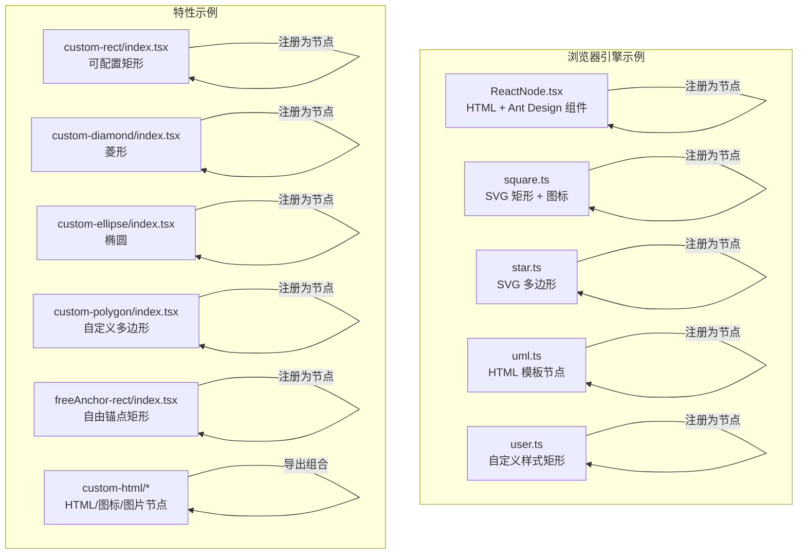
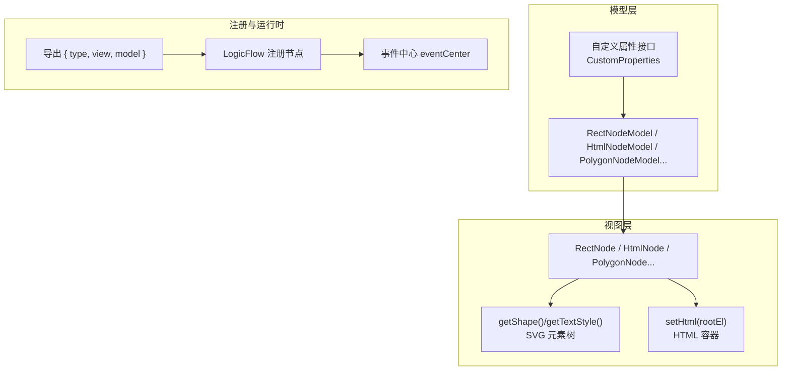
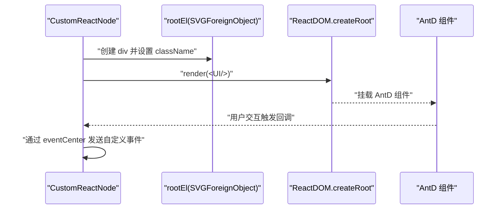
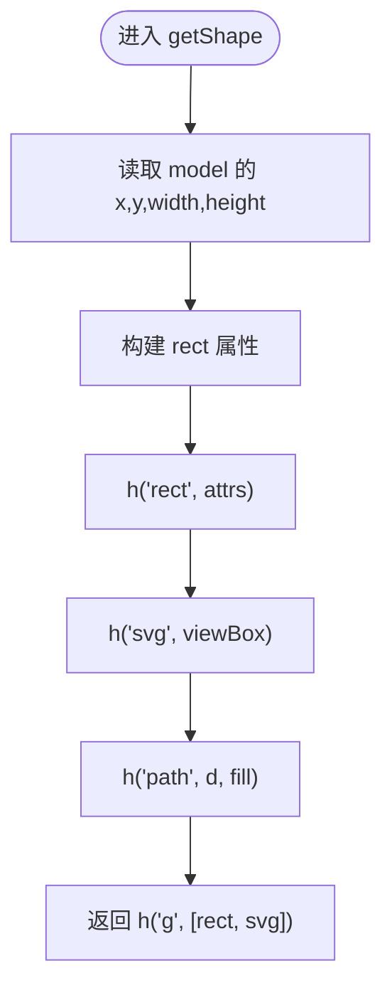
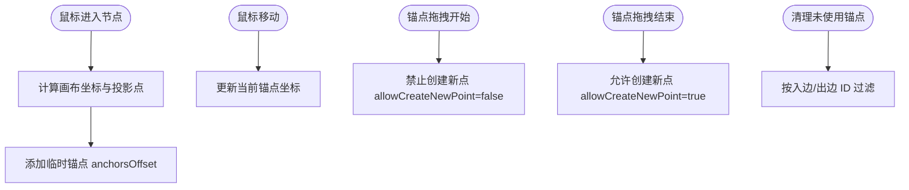
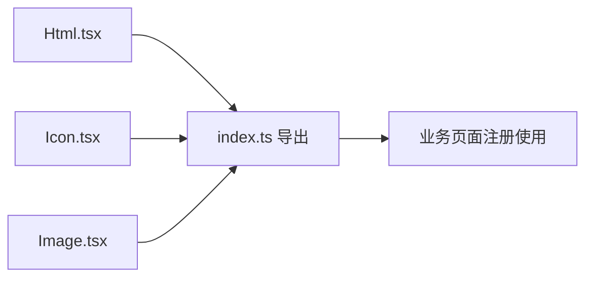
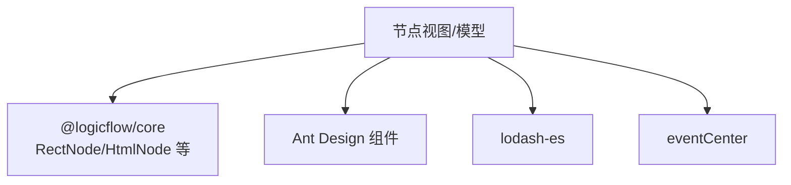

# React 节点开发

<cite>
**本文引用的文件**
- [examples/engine-browser-examples/src/pages/graph/nodes/ReactNode.tsx](file://examples/engine-browser-examples/src/pages/graph/nodes/ReactNode.tsx)
- [examples/engine-browser-examples/src/pages/graph/nodes/square.ts](file://examples/engine-browser-examples/src/pages/graph/nodes/square.ts)
- [examples/engine-browser-examples/src/pages/graph/nodes/star.ts](file://examples/engine-browser-examples/src/pages/graph/nodes/star.ts)
- [examples/engine-browser-examples/src/pages/graph/nodes/uml.ts](file://examples/engine-browser-examples/src/pages/graph/nodes/uml.ts)
- [examples/engine-browser-examples/src/pages/graph/nodes/user.ts](file://examples/engine-browser-examples/src/pages/graph/nodes/user.ts)
- [examples/feature-examples/src/components/nodes/custom-rect/index.tsx](file://examples/feature-examples/src/components/nodes/custom-rect/index.tsx)
- [examples/feature-examples/src/components/nodes/custom-diamond/index.tsx](file://examples/feature-examples/src/components/nodes/custom-diamond/index.tsx)
- [examples/feature-examples/src/components/nodes/custom-ellipse/index.tsx](file://examples/feature-examples/src/components/nodes/custom-ellipse/index.tsx)
- [examples/feature-examples/src/components/nodes/custom-polygon/index.tsx](file://examples/feature-examples/src/components/nodes/custom-polygon/index.tsx)
- [examples/feature-examples/src/components/nodes/freeAnchor-rect/index.tsx](file://examples/feature-examples/src/components/nodes/freeAnchor-rect/index.tsx)
- [examples/feature-examples/src/components/nodes/custom-html/Html.tsx](file://examples/feature-examples/src/components/nodes/custom-html/Html.tsx)
- [examples/feature-examples/src/components/nodes/custom-html/Icon.tsx](file://examples/feature-examples/src/components/nodes/custom-html/Icon.tsx)
- [examples/feature-examples/src/components/nodes/custom-html/Image.tsx](file://examples/feature-examples/src/components/nodes/custom-html/Image.tsx)
- [examples/feature-examples/src/components/nodes/custom-html/index.ts](file://examples/feature-examples/src/components/nodes/custom-html/index.ts)
</cite>

## 目录
1. [简介](#简介)
2. [项目结构](#项目结构)
3. [核心组件](#核心组件)
4. [架构总览](#架构总览)
5. [详细组件分析](#详细组件分析)
6. [依赖关系分析](#依赖关系分析)
7. [性能考虑](#性能考虑)
8. [故障排查指南](#故障排查指南)
9. [结论](#结论)
10. [附录](#附录)

## 简介
本指南面向在 React 环境中使用 LogicFlow 自定义节点的开发者，系统讲解两类实现方式：基于 HTML 的节点（适合富交互、复杂 UI）与基于 SVG 的节点（适合高性能矢量图形）。文档覆盖 Props 接口与类型约束、渲染逻辑（SVG 绘制、HTML 渲染）、事件处理（点击、悬停、拖拽）、状态同步与数据更新、性能优化策略以及节点组合与复用方法。

## 项目结构
本仓库提供了多样的节点示例，涵盖基础几何图形、复杂图标、HTML 内容节点与动态交互节点。以下图展示与本指南相关的节点目录与文件映射：

图表来源
- [examples/engine-browser-examples/src/pages/graph/nodes/ReactNode.tsx](file://examples/engine-browser-examples/src/pages/graph/nodes/ReactNode.tsx#L1-L64)
- [examples/engine-browser-examples/src/pages/graph/nodes/square.ts](file://examples/engine-browser-examples/src/pages/graph/nodes/square.ts#L1-L77)
- [examples/engine-browser-examples/src/pages/graph/nodes/star.ts](file://examples/engine-browser-examples/src/pages/graph/nodes/star.ts#L1-L22)
- [examples/engine-browser-examples/src/pages/graph/nodes/uml.ts](file://examples/engine-browser-examples/src/pages/graph/nodes/uml.ts#L1-L63)
- [examples/engine-browser-examples/src/pages/graph/nodes/user.ts](file://examples/engine-browser-examples/src/pages/graph/nodes/user.ts#L1-L47)
- [examples/feature-examples/src/components/nodes/custom-rect/index.tsx](file://examples/feature-examples/src/components/nodes/custom-rect/index.tsx#L1-L81)
- [examples/feature-examples/src/components/nodes/custom-diamond/index.tsx](file://examples/feature-examples/src/components/nodes/custom-diamond/index.tsx#L1-L28)
- [examples/feature-examples/src/components/nodes/custom-ellipse/index.tsx](file://examples/feature-examples/src/components/nodes/custom-ellipse/index.tsx#L1-L70)
- [examples/feature-examples/src/components/nodes/custom-polygon/index.tsx](file://examples/feature-examples/src/components/nodes/custom-polygon/index.tsx#L1-L30)
- [examples/feature-examples/src/components/nodes/freeAnchor-rect/index.tsx](file://examples/feature-examples/src/components/nodes/freeAnchor-rect/index.tsx#L1-L232)
- [examples/feature-examples/src/components/nodes/custom-html/Html.tsx](file://examples/feature-examples/src/components/nodes/custom-html/Html.tsx#L1-L62)
- [examples/feature-examples/src/components/nodes/custom-html/Icon.tsx](file://examples/feature-examples/src/components/nodes/custom-html/Icon.tsx#L1-L136)
- [examples/feature-examples/src/components/nodes/custom-html/Image.tsx](file://examples/feature-examples/src/components/nodes/custom-html/Image.tsx#L1-L66)

章节来源
- [examples/engine-browser-examples/src/pages/graph/nodes/ReactNode.tsx](file://examples/engine-browser-examples/src/pages/graph/nodes/ReactNode.tsx#L1-L64)
- [examples/engine-browser-examples/src/pages/graph/nodes/square.ts](file://examples/engine-browser-examples/src/pages/graph/nodes/square.ts#L1-L77)
- [examples/engine-browser-examples/src/pages/graph/nodes/star.ts](file://examples/engine-browser-examples/src/pages/graph/nodes/star.ts#L1-L22)
- [examples/engine-browser-examples/src/pages/graph/nodes/uml.ts](file://examples/engine-browser-examples/src/pages/graph/nodes/uml.ts#L1-L63)
- [examples/engine-browser-examples/src/pages/graph/nodes/user.ts](file://examples/engine-browser-examples/src/pages/graph/nodes/user.ts#L1-L47)
- [examples/feature-examples/src/components/nodes/custom-rect/index.tsx](file://examples/feature-examples/src/components/nodes/custom-rect/index.tsx#L1-L81)
- [examples/feature-examples/src/components/nodes/custom-diamond/index.tsx](file://examples/feature-examples/src/components/nodes/custom-diamond/index.tsx#L1-L28)
- [examples/feature-examples/src/components/nodes/custom-ellipse/index.tsx](file://examples/feature-examples/src/components/nodes/custom-ellipse/index.tsx#L1-L70)
- [examples/feature-examples/src/components/nodes/custom-polygon/index.tsx](file://examples/feature-examples/src/components/nodes/custom-polygon/index.tsx#L1-L30)
- [examples/feature-examples/src/components/nodes/freeAnchor-rect/index.tsx](file://examples/feature-examples/src/components/nodes/freeAnchor-rect/index.tsx#L1-L232)
- [examples/feature-examples/src/components/nodes/custom-html/Html.tsx](file://examples/feature-examples/src/components/nodes/custom-html/Html.tsx#L1-L62)
- [examples/feature-examples/src/components/nodes/custom-html/Icon.tsx](file://examples/feature-examples/src/components/nodes/custom-html/Icon.tsx#L1-L136)
- [examples/feature-examples/src/components/nodes/custom-html/Image.tsx](file://examples/feature-examples/src/components/nodes/custom-html/Image.tsx#L1-L66)

## 核心组件
- 节点模型（Model）：负责节点尺寸、样式、锚点、连接规则、文本样式等属性计算与状态管理。
- 节点视图（View）：负责节点的渲染逻辑，包括 SVG 元素或 HTML 容器的生成。
- 注册对象：导出 { type, view, model }，供 LogicFlow 注册使用。

常见基类与职责：
- HtmlNodeModel / HtmlNode：用于 HTML 容器渲染，适合富交互、第三方 UI 库（如 Ant Design）。
- RectNodeModel / RectNode、EllipseNodeModel / EllipseNode、PolygonNodeModel / PolygonNode、DiamondNodeModel / DiamondNode：用于 SVG 基础几何图形。
- 自定义属性接口：通过 PropertiesType 传递自定义属性，如 width、height、radius、refX/refY、style/textStyle 等。

章节来源
- [examples/engine-browser-examples/src/pages/graph/nodes/ReactNode.tsx](file://examples/engine-browser-examples/src/pages/graph/nodes/ReactNode.tsx#L6-L37)
- [examples/engine-browser-examples/src/pages/graph/nodes/square.ts](file://examples/engine-browser-examples/src/pages/graph/nodes/square.ts#L4-L22)
- [examples/engine-browser-examples/src/pages/graph/nodes/star.ts](file://examples/engine-browser-examples/src/pages/graph/nodes/star.ts#L3-L15)
- [examples/engine-browser-examples/src/pages/graph/nodes/uml.ts](file://examples/engine-browser-examples/src/pages/graph/nodes/uml.ts#L3-L33)
- [examples/engine-browser-examples/src/pages/graph/nodes/user.ts](file://examples/engine-browser-examples/src/pages/graph/nodes/user.ts#L3-L40)
- [examples/feature-examples/src/components/nodes/custom-rect/index.tsx](file://examples/feature-examples/src/components/nodes/custom-rect/index.tsx#L4-L74)
- [examples/feature-examples/src/components/nodes/custom-diamond/index.tsx](file://examples/feature-examples/src/components/nodes/custom-diamond/index.tsx#L4-L21)
- [examples/feature-examples/src/components/nodes/custom-ellipse/index.tsx](file://examples/feature-examples/src/components/nodes/custom-ellipse/index.tsx#L4-L63)
- [examples/feature-examples/src/components/nodes/custom-polygon/index.tsx](file://examples/feature-examples/src/components/nodes/custom-polygon/index.tsx#L4-L23)
- [examples/feature-examples/src/components/nodes/freeAnchor-rect/index.tsx](file://examples/feature-examples/src/components/nodes/freeAnchor-rect/index.tsx#L4-L156)
- [examples/feature-examples/src/components/nodes/custom-html/Html.tsx](file://examples/feature-examples/src/components/nodes/custom-html/Html.tsx#L14-L55)
- [examples/feature-examples/src/components/nodes/custom-html/Icon.tsx](file://examples/feature-examples/src/components/nodes/custom-html/Icon.tsx#L19-L129)
- [examples/feature-examples/src/components/nodes/custom-html/Image.tsx](file://examples/feature-examples/src/components/nodes/custom-html/Image.tsx#L16-L59)

## 架构总览
下图展示了节点开发的整体架构：模型层负责数据与规则，视图层负责渲染；HTML 节点通过 setHtml 将 React/HTML 内容挂载到 SVGForeignObject；SVG 节点通过 h 方法返回 SVG 元素树。

图表来源
- [examples/engine-browser-examples/src/pages/graph/nodes/ReactNode.tsx](file://examples/engine-browser-examples/src/pages/graph/nodes/ReactNode.tsx#L39-L56)
- [examples/engine-browser-examples/src/pages/graph/nodes/square.ts](file://examples/engine-browser-examples/src/pages/graph/nodes/square.ts#L24-L69)
- [examples/engine-browser-examples/src/pages/graph/nodes/star.ts](file://examples/engine-browser-examples/src/pages/graph/nodes/star.ts#L1-L22)
- [examples/engine-browser-examples/src/pages/graph/nodes/uml.ts](file://examples/engine-browser-examples/src/pages/graph/nodes/uml.ts#L34-L55)
- [examples/engine-browser-examples/src/pages/graph/nodes/user.ts](file://examples/engine-browser-examples/src/pages/graph/nodes/user.ts#L7-L40)
- [examples/feature-examples/src/components/nodes/custom-rect/index.tsx](file://examples/feature-examples/src/components/nodes/custom-rect/index.tsx#L21-L74)
- [examples/feature-examples/src/components/nodes/custom-diamond/index.tsx](file://examples/feature-examples/src/components/nodes/custom-diamond/index.tsx#L4-L21)
- [examples/feature-examples/src/components/nodes/custom-ellipse/index.tsx](file://examples/feature-examples/src/components/nodes/custom-ellipse/index.tsx#L20-L63)
- [examples/feature-examples/src/components/nodes/custom-polygon/index.tsx](file://examples/feature-examples/src/components/nodes/custom-polygon/index.tsx#L4-L23)
- [examples/feature-examples/src/components/nodes/freeAnchor-rect/index.tsx](file://examples/feature-examples/src/components/nodes/freeAnchor-rect/index.tsx#L4-L156)
- [examples/feature-examples/src/components/nodes/custom-html/Html.tsx](file://examples/feature-examples/src/components/nodes/custom-html/Html.tsx#L14-L55)
- [examples/feature-examples/src/components/nodes/custom-html/Icon.tsx](file://examples/feature-examples/src/components/nodes/custom-html/Icon.tsx#L19-L129)
- [examples/feature-examples/src/components/nodes/custom-html/Image.tsx](file://examples/feature-examples/src/components/nodes/custom-html/Image.tsx#L16-L59)

## 详细组件分析

### HTML 节点：React + Ant Design 组合
- 实现要点
  - 模型：继承 HtmlNodeModel，设置尺寸、文本区域与锚点偏移。
  - 视图：继承 HtmlNode，重写 setHtml，在 rootEl 中挂载 React 容器并渲染 Ant Design 组件。
  - 注册：导出 { type, view, model }。
- Props 与事件
  - props.model.properties 作为自定义属性入口，可在 setHtml 中读取并驱动 UI。
  - 通过 window 或事件中心向外部广播交互事件（如按钮点击）。

图表来源
- [examples/engine-browser-examples/src/pages/graph/nodes/ReactNode.tsx](file://examples/engine-browser-examples/src/pages/graph/nodes/ReactNode.tsx#L39-L56)

章节来源
- [examples/engine-browser-examples/src/pages/graph/nodes/ReactNode.tsx](file://examples/engine-browser-examples/src/pages/graph/nodes/ReactNode.tsx#L6-L37)
- [examples/engine-browser-examples/src/pages/graph/nodes/ReactNode.tsx](file://examples/engine-browser-examples/src/pages/graph/nodes/ReactNode.tsx#L39-L56)
- [examples/engine-browser-examples/src/pages/graph/nodes/ReactNode.tsx](file://examples/engine-browser-examples/src/pages/graph/nodes/ReactNode.tsx#L59-L63)

### SVG 几何节点：矩形 + 图标 + 文本样式
- 实现要点
  - 模型：继承 RectNodeModel，设置尺寸、锚点偏移、连接规则。
  - 视图：继承 RectNode，重写 getShape 返回 h('g', [...])，内部包含 rect 与 svg+path 图标；重写 getTextStyle 动态切换颜色。
- Props 与样式
  - 通过 model.getNodeStyle()/getTextStyle() 合并自定义样式与主题。

图表来源
- [examples/engine-browser-examples/src/pages/graph/nodes/square.ts](file://examples/engine-browser-examples/src/pages/graph/nodes/square.ts#L39-L69)

章节来源
- [examples/engine-browser-examples/src/pages/graph/nodes/square.ts](file://examples/engine-browser-examples/src/pages/graph/nodes/square.ts#L4-L22)
- [examples/engine-browser-examples/src/pages/graph/nodes/square.ts](file://examples/engine-browser-examples/src/pages/graph/nodes/square.ts#L24-L69)

### SVG 几何节点：多边形星形
- 实现要点
  - 模型：继承 PolygonNodeModel，直接在 setAttributes 中指定 points。
  - 视图：使用默认 PolygonNode，无需自定义 getShape。

章节来源
- [examples/engine-browser-examples/src/pages/graph/nodes/star.ts](file://examples/engine-browser-examples/src/pages/graph/nodes/star.ts#L3-L15)
- [examples/engine-browser-examples/src/pages/graph/nodes/star.ts](file://examples/engine-browser-examples/src/pages/graph/nodes/star.ts#L17-L22)

### HTML 模板节点：UML 类图风格
- 实现要点
  - 模型：继承 HtmlNodeModel，设置尺寸、文本区域与锚点。
  - 视图：继承 HtmlNode，setHtml 中拼接 HTML 字符串，插入 properties.name/body。
- 适用场景
  - 需要结构化文本与简单布局的节点。

章节来源
- [examples/engine-browser-examples/src/pages/graph/nodes/uml.ts](file://examples/engine-browser-examples/src/pages/graph/nodes/uml.ts#L3-L33)
- [examples/engine-browser-examples/src/pages/graph/nodes/uml.ts](file://examples/engine-browser-examples/src/pages/graph/nodes/uml.ts#L34-L55)

### 自定义样式矩形：UserNode
- 实现要点
  - 视图：重写 getAnchorStyle/getTextStyle，定制锚点与文本样式。
  - 模型：根据 properties.size 动态设置宽高、半径、文本内容。

章节来源
- [examples/engine-browser-examples/src/pages/graph/nodes/user.ts](file://examples/engine-browser-examples/src/pages/graph/nodes/user.ts#L7-L27)
- [examples/engine-browser-examples/src/pages/graph/nodes/user.ts](file://examples/engine-browser-examples/src/pages/graph/nodes/user.ts#L29-L40)

### 可配置矩形：CustomRect
- 实现要点
  - 模型：从 properties 读取 width/height/radius/style/textStyle，合并到默认样式。
  - 文本定位：通过 transform: matrix(...) 偏移 refX/refY。
- 适用场景
  - 需要灵活控制尺寸与样式的矩形节点。

章节来源
- [examples/feature-examples/src/components/nodes/custom-rect/index.tsx](file://examples/feature-examples/src/components/nodes/custom-rect/index.tsx#L4-L74)

### 菱形与椭圆：CustomDiamond / CustomEllipse
- 实现要点
  - 模型：initNodeData 中设置 rx/ry 或在 setAttributes 中设置。
  - 视图：使用默认 DiamondNode/EllipseNode。

章节来源
- [examples/feature-examples/src/components/nodes/custom-diamond/index.tsx](file://examples/feature-examples/src/components/nodes/custom-diamond/index.tsx#L4-L21)
- [examples/feature-examples/src/components/nodes/custom-ellipse/index.tsx](file://examples/feature-examples/src/components/nodes/custom-ellipse/index.tsx#L4-L63)

### 自定义多边形：CustomPolygon
- 实现要点
  - 模型：initNodeData 中设置 points，形成闪电等自定义形状。

章节来源
- [examples/feature-examples/src/components/nodes/custom-polygon/index.tsx](file://examples/feature-examples/src/components/nodes/custom-polygon/index.tsx#L4-L23)

### 自由锚点矩形：freeAnchorNode
- 实现要点
  - 事件驱动：在 mouseenter/mousemove/mouseover 时动态创建/更新锚点。
  - 锚点管理：通过 getTargetAnchor 与投影算法选择最近边框投影点，支持拖拽时暂停自动创建。
  - 清理策略：removeUnusedAnchors 基于入边/出边 ID 过滤未使用的临时锚点。
- 交互流程

图表来源
- [examples/feature-examples/src/components/nodes/freeAnchor-rect/index.tsx](file://examples/feature-examples/src/components/nodes/freeAnchor-rect/index.tsx#L15-L156)

章节来源
- [examples/feature-examples/src/components/nodes/freeAnchor-rect/index.tsx](file://examples/feature-examples/src/components/nodes/freeAnchor-rect/index.tsx#L4-L156)

### HTML/图标/图片节点组合
- 组合导出
  - Html.tsx：HTML 容器 + AntD 按钮 + 事件发射。
  - Icon.tsx：SVG 图标 + 透明背景矩形 + 可选文本。
  - Image.tsx：图片元素 + 缩放策略。
  - index.ts：统一导出多个子节点。

图表来源
- [examples/feature-examples/src/components/nodes/custom-html/Html.tsx](file://examples/feature-examples/src/components/nodes/custom-html/Html.tsx#L14-L55)
- [examples/feature-examples/src/components/nodes/custom-html/Icon.tsx](file://examples/feature-examples/src/components/nodes/custom-html/Icon.tsx#L19-L129)
- [examples/feature-examples/src/components/nodes/custom-html/Image.tsx](file://examples/feature-examples/src/components/nodes/custom-html/Image.tsx#L16-L59)
- [examples/feature-examples/src/components/nodes/custom-html/index.ts](file://examples/feature-examples/src/components/nodes/custom-html/index.ts#L1-L7)

章节来源
- [examples/feature-examples/src/components/nodes/custom-html/Html.tsx](file://examples/feature-examples/src/components/nodes/custom-html/Html.tsx#L14-L55)
- [examples/feature-examples/src/components/nodes/custom-html/Icon.tsx](file://examples/feature-examples/src/components/nodes/custom-html/Icon.tsx#L19-L129)
- [examples/feature-examples/src/components/nodes/custom-html/Image.tsx](file://examples/feature-examples/src/components/nodes/custom-html/Image.tsx#L16-L59)
- [examples/feature-examples/src/components/nodes/custom-html/index.ts](file://examples/feature-examples/src/components/nodes/custom-html/index.ts#L1-L7)

## 依赖关系分析
- 组件耦合
  - 视图与模型强关联：视图通过 props.model 读取数据与样式。
  - 事件中心：HTML 节点通过 eventCenter 向外部广播事件，便于上层处理。
- 外部依赖
  - Ant Design：用于 HTML 节点中的交互组件。
  - lodash-es：用于锚点索引查找与集合过滤。
- 可能的循环依赖
  - 示例中未见直接循环导入；注意避免在 setHtml 中引入与注册对象相互依赖的模块。

图表来源
- [examples/engine-browser-examples/src/pages/graph/nodes/ReactNode.tsx](file://examples/engine-browser-examples/src/pages/graph/nodes/ReactNode.tsx#L1-L4)
- [examples/feature-examples/src/components/nodes/freeAnchor-rect/index.tsx](file://examples/feature-examples/src/components/nodes/freeAnchor-rect/index.tsx#L1-L2)
- [examples/feature-examples/src/components/nodes/custom-html/Html.tsx](file://examples/feature-examples/src/components/nodes/custom-html/Html.tsx#L1-L1)

章节来源
- [examples/engine-browser-examples/src/pages/graph/nodes/ReactNode.tsx](file://examples/engine-browser-examples/src/pages/graph/nodes/ReactNode.tsx#L1-L4)
- [examples/feature-examples/src/components/nodes/freeAnchor-rect/index.tsx](file://examples/feature-examples/src/components/nodes/freeAnchor-rect/index.tsx#L1-L2)
- [examples/feature-examples/src/components/nodes/custom-html/Html.tsx](file://examples/feature-examples/src/components/nodes/custom-html/Html.tsx#L1-L1)

## 性能考虑
- SVG 优先：对于大量静态图形与高频重绘场景，优先使用 SVG 节点（RectNode/PolygonNode 等），减少 DOM 层级与重排开销。
- HTML 节点权衡：HTML 节点适合复杂交互与第三方 UI，但需注意频繁重渲染与事件绑定带来的性能影响。
- 事件中心解耦：通过 eventCenter 发送自定义事件，避免在节点内部直接持有全局状态。
- 锚点管理：自由锚点节点在移动/拖拽过程中应限制锚点数量与更新频率，必要时进行节流或批量更新。
- 样式合并：使用 cloneDeep 合并样式时注意只合并必要字段，避免深拷贝过大对象。

## 故障排查指南
- HTML 节点不显示
  - 检查 setHtml 是否正确清空 rootEl 并追加子元素。
  - 确认 props.model.properties 是否传入。
- 交互无效
  - 确认事件绑定是否在初始化阶段完成（如 freeAnchorNode 的 registerEvent）。
  - 检查事件中心监听与发射是否在同一作用域。
- 锚点异常
  - 自由锚点节点需确保 getProjectionPointFromCenter 投影逻辑正确，且在拖拽开始/结束时切换 allowCreateNewPoint。
  - 使用 removeUnusedAnchors 清理未使用锚点，避免内存泄漏。
- 文本定位不准
  - 检查 refX/refY 与 transform 的叠加关系，避免重复位移。

章节来源
- [examples/engine-browser-examples/src/pages/graph/nodes/ReactNode.tsx](file://examples/engine-browser-examples/src/pages/graph/nodes/ReactNode.tsx#L40-L56)
- [examples/feature-examples/src/components/nodes/freeAnchor-rect/index.tsx](file://examples/feature-examples/src/components/nodes/freeAnchor-rect/index.tsx#L15-L156)
- [examples/feature-examples/src/components/nodes/custom-html/Html.tsx](file://examples/feature-examples/src/components/nodes/custom-html/Html.tsx#L14-L55)

## 结论
本指南总结了在 React 环境中开发 LogicFlow 节点的关键路径：以模型/视图分离为核心，结合 SVG 与 HTML 的不同渲染策略，通过事件中心实现解耦交互，并以属性接口与样式合并实现高度可配置性。针对复杂交互场景（如自由锚点），建议采用事件驱动与投影算法相结合的方式，确保性能与体验的平衡。

## 附录
- Props 接口建议
  - 宽高与圆角：width/height/radius
  - 文本定位：refX/refY
  - 样式主题：style/textStyle
  - 特定节点属性：如 imageHref、points 等
- 常用基类
  - HtmlNode/HtmlNodeModel：HTML 容器
  - RectNode/RectNodeModel、EllipseNode/EllipseNodeModel、PolygonNode/PolygonNodeModel、DiamondNode/DiamondNodeModel：基础几何
- 组合与复用
  - 将通用样式与布局抽离为工具函数或基类，减少重复代码。
  - 通过统一的 index.ts 导出多个子节点，便于业务页面按需注册。