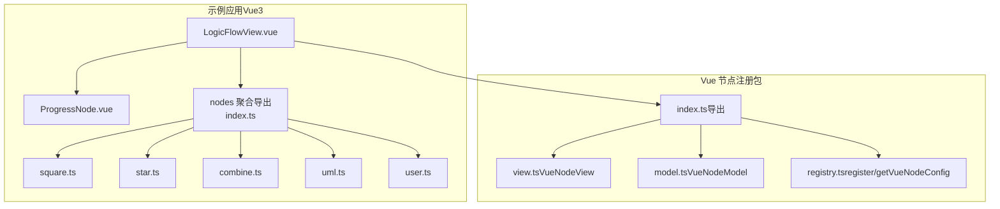
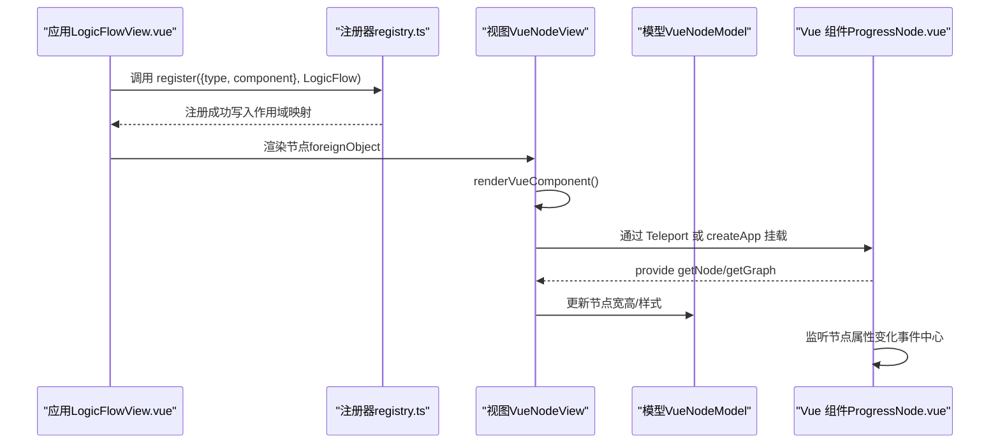
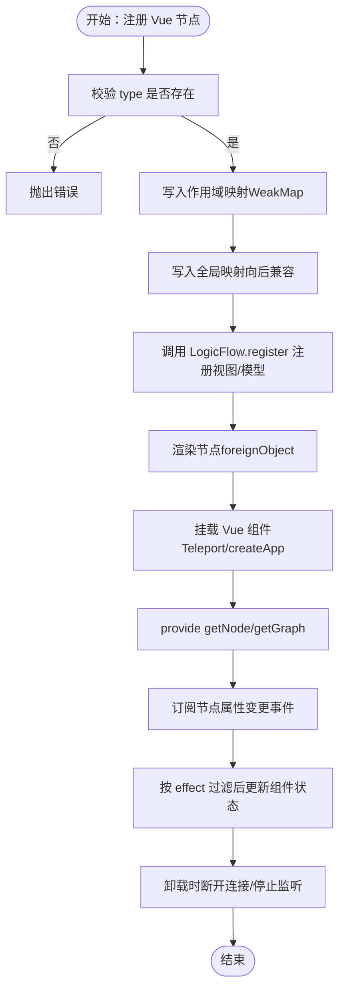
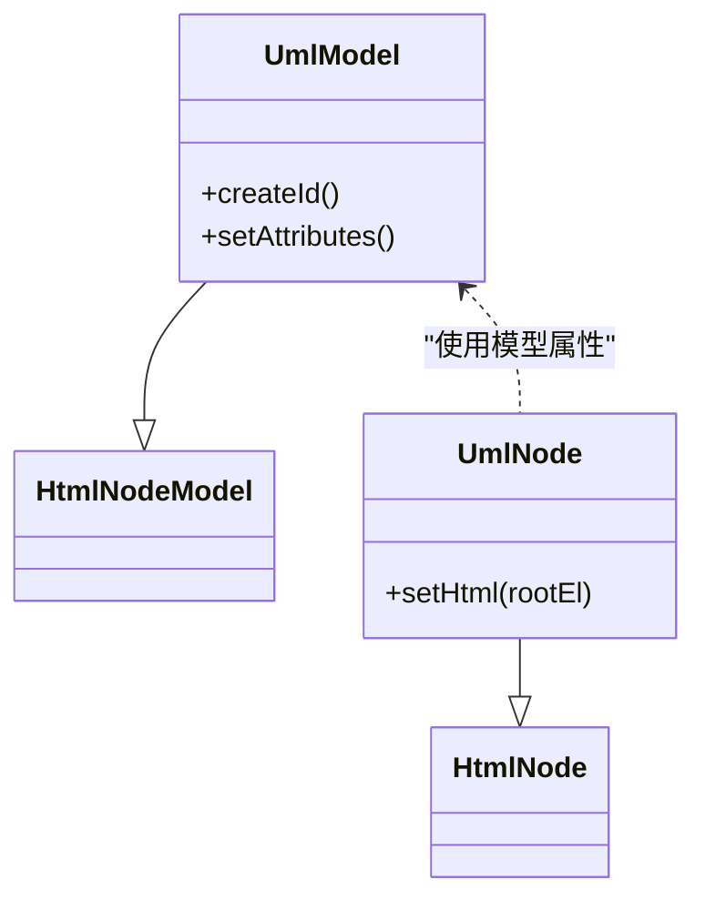
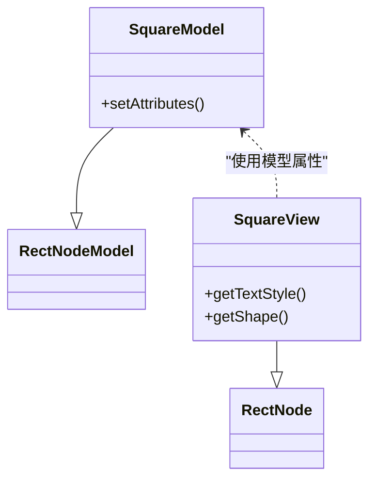
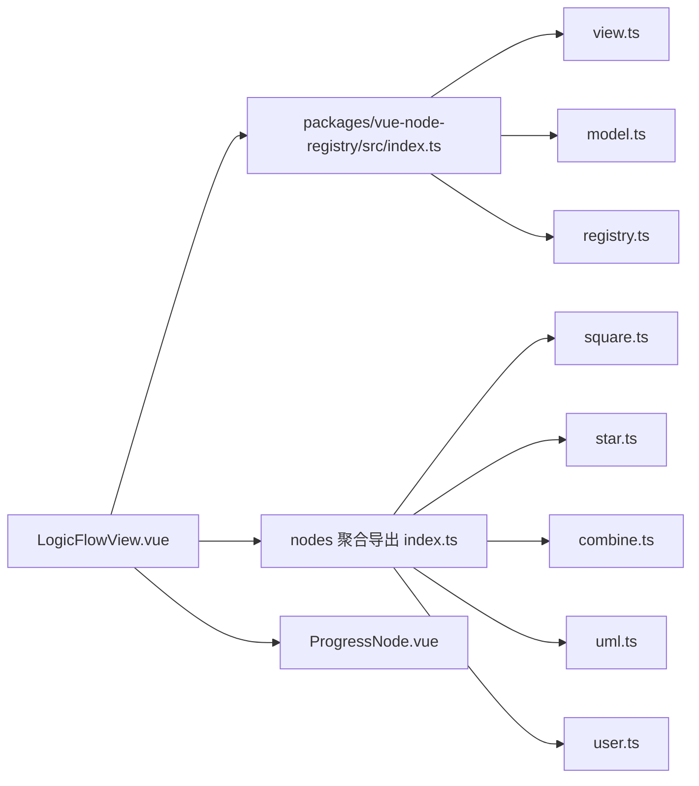

# Vue 节点开发

<cite>
**本文引用的文件**
- [LogicFlowView.vue](file://examples/vue3-app/src/views/LogicFlowView.vue)
- [ProgressNode.vue](file://examples/vue3-app/src/components/LFElements/ProgressNode.vue)
- [index.ts（节点聚合导出）](file://examples/vue3-app/src/components/LFElements/nodes/index.ts)
- [square.ts](file://examples/vue3-app/src/components/LFElements/nodes/square.ts)
- [star.ts](file://examples/vue3-app/src/components/LFElements/nodes/star.ts)
- [combine.ts](file://examples/vue3-app/src/components/LFElements/nodes/combine.ts)
- [uml.ts](file://examples/vue3-app/src/components/LFElements/nodes/uml.ts)
- [user.ts](file://examples/vue3-app/src/components/LFElements/nodes/user.ts)
- [index.ts（Vue 节点注册包入口）](file://packages/vue-node-registry/src/index.ts)
- [view.ts（Vue 节点视图实现）](file://packages/vue-node-registry/src/view.ts)
- [model.ts（Vue 节点模型实现）](file://packages/vue-node-registry/src/model.ts)
- [registry.ts（Vue 节点注册器）](file://packages/vue-node-registry/src/registry.ts)
</cite>

## 目录
1. [简介](#简介)
2. [项目结构](#项目结构)
3. [核心组件](#核心组件)
4. [架构总览](#架构总览)
5. [详细组件分析](#详细组件分析)
6. [依赖关系分析](#依赖关系分析)
7. [性能考量](#性能考量)
8. [故障排查指南](#故障排查指南)
9. [结论](#结论)
10. [附录](#附录)

## 简介
本指南面向在 Vue3 Composition API 下开发 LogicFlow 自定义节点的工程师，系统讲解节点的组件结构设计、Props 参数传递、事件处理机制、节点注册流程（全局与局部）、不同节点类型的实现差异（HTML 节点、矩形节点、多边形节点、组合节点），以及生命周期钩子、状态管理、数据绑定与响应式更新、事件监听与交互等。文中结合仓库中的真实实现，提供可直接参考的代码路径与可视化图示。

## 项目结构
本项目采用多示例工程组织，其中 examples/vue3-app 展示了 Vue3 应用中如何集成 LogicFlow 与 Vue 节点注册能力；packages/vue-node-registry 提供 Vue 节点的注册、视图与模型实现。

图表来源
- [LogicFlowView.vue](file://examples/vue3-app/src/views/LogicFlowView.vue#L1-L537)
- [index.ts（节点聚合导出）](file://examples/vue3-app/src/components/LFElements/nodes/index.ts#L1-L14)
- [square.ts](file://examples/vue3-app/src/components/LFElements/nodes/square.ts#L1-L76)
- [star.ts](file://examples/vue3-app/src/components/LFElements/nodes/star.ts#L1-L22)
- [combine.ts](file://examples/vue3-app/src/components/LFElements/nodes/combine.ts#L1-L43)
- [uml.ts](file://examples/vue3-app/src/components/LFElements/nodes/uml.ts#L1-L63)
- [user.ts](file://examples/vue3-app/src/components/LFElements/nodes/user.ts#L1-L47)
- [index.ts（Vue 节点注册包入口）](file://packages/vue-node-registry/src/index.ts#L1-L5)
- [view.ts](file://packages/vue-node-registry/src/view.ts#L1-L254)
- [model.ts](file://packages/vue-node-registry/src/model.ts#L1-L142)
- [registry.ts](file://packages/vue-node-registry/src/registry.ts#L1-L75)

章节来源
- [LogicFlowView.vue](file://examples/vue3-app/src/views/LogicFlowView.vue#L1-L537)
- [index.ts（Vue 节点注册包入口）](file://packages/vue-node-registry/src/index.ts#L1-L5)

## 核心组件
- Vue 节点注册器：负责将 Vue 组件注册为 LogicFlow 节点类型，支持作用域隔离与全局回退兼容。
- Vue 节点视图：基于 HtmlNode，负责在 foreignObject 中挂载/卸载 Vue 组件，处理尺寸监听与更新。
- Vue 节点模型：扩展 HtmlNodeModel，统一节点属性（宽高、半径、文字偏移、样式、标题等），并提供动作集合。
- 示例节点：包含矩形、五角星、组合图形、UML、用户矩形等，演示不同节点类型的实现差异。

章节来源
- [registry.ts](file://packages/vue-node-registry/src/registry.ts#L43-L75)
- [view.ts](file://packages/vue-node-registry/src/view.ts#L17-L254)
- [model.ts](file://packages/vue-node-registry/src/model.ts#L38-L142)
- [square.ts](file://examples/vue3-app/src/components/LFElements/nodes/square.ts#L3-L21)
- [star.ts](file://examples/vue3-app/src/components/LFElements/nodes/star.ts#L3-L15)
- [combine.ts](file://examples/vue3-app/src/components/LFElements/nodes/combine.ts#L23-L36)
- [uml.ts](file://examples/vue3-app/src/components/LFElements/nodes/uml.ts#L3-L33)
- [user.ts](file://examples/vue3-app/src/components/LFElements/nodes/user.ts#L29-L40)

## 架构总览
Vue 节点在 LogicFlow 中以“注册配置 + 视图类 + 模型类”的形式工作。应用层通过 register 将 Vue 组件映射为节点类型；渲染时由 VueNodeView 在 foreignObject 中挂载组件；组件通过 provide/inject 获取 node/graph 上下文，实现属性监听与交互。

图表来源
- [LogicFlowView.vue](file://examples/vue3-app/src/views/LogicFlowView.vue#L192-L198)
- [registry.ts](file://packages/vue-node-registry/src/registry.ts#L43-L75)
- [view.ts](file://packages/vue-node-registry/src/view.ts#L66-L153)
- [model.ts](file://packages/vue-node-registry/src/model.ts#L88-L106)
- [ProgressNode.vue](file://examples/vue3-app/src/components/LFElements/ProgressNode.vue#L16-L38)

## 详细组件分析

### Vue 节点注册与生命周期
- 注册流程
  - 应用层调用 register，传入 type、component、effect 等配置，内部写入作用域映射并调用 LogicFlow.register 注册视图/模型。
  - 支持 effect 字段，仅当属性变化落在 effect 列表内时才触发组件更新，减少不必要的重渲染。
- 生命周期
  - mounted：组件注入 node/graph 上下文，订阅节点属性变更事件，按需更新内部状态。
  - beforeUnmount：通过 VueNodeView 的 unmount 钩子，确保卸载组件与尺寸监听，避免内存泄漏。

图表来源
- [registry.ts](file://packages/vue-node-registry/src/registry.ts#L43-L75)
- [view.ts](file://packages/vue-node-registry/src/view.ts#L66-L153)
- [ProgressNode.vue](file://examples/vue3-app/src/components/LFElements/ProgressNode.vue#L16-L38)

章节来源
- [registry.ts](file://packages/vue-node-registry/src/registry.ts#L43-L75)
- [view.ts](file://packages/vue-node-registry/src/view.ts#L37-L64)
- [ProgressNode.vue](file://examples/vue3-app/src/components/LFElements/ProgressNode.vue#L22-L38)

### Props 参数传递与事件处理
- Props 结构
  - node：当前节点模型（BaseNodeModel 子类实例），包含 id、坐标、宽高、属性等。
  - graph：当前图模型（GraphModel），用于读取/修改图状态、触发操作。
- 事件处理
  - 组件通过 inject 获取 getNode/getGraph，订阅节点属性变更事件，按需更新内部状态。
  - 可结合 effect 控制更新范围，避免全量重绘。

章节来源
- [view.ts](file://packages/vue-node-registry/src/view.ts#L140-L146)
- [ProgressNode.vue](file://examples/vue3-app/src/components/LFElements/ProgressNode.vue#L16-L38)

### 节点注册方式：全局与局部
- 局部注册（推荐）
  - 在 LogicFlow 实例上注册：调用 register(config, lf)，将节点类型限定在当前实例作用域，避免跨图冲突。
- 全局注册（兼容）
  - 仍保留全局映射，但不隔离实例，不建议在多实例场景使用。

章节来源
- [registry.ts](file://packages/vue-node-registry/src/registry.ts#L58-L67)

### 不同类型节点的实现差异

#### HTML 节点（UML 示例）
- 特点：基于 HtmlNode，通过 setHtml 直接生成 DOM 内容，适合复杂富文本/结构化布局。
- 关键点：设置宽高、文本区域、锚点；在 foreignObject 中渲染 HTML。

图表来源
- [uml.ts](file://examples/vue3-app/src/components/LFElements/nodes/uml.ts#L3-L33)
- [uml.ts](file://examples/vue3-app/src/components/LFElements/nodes/uml.ts#L34-L56)

章节来源
- [uml.ts](file://examples/vue3-app/src/components/LFElements/nodes/uml.ts#L3-L33)
- [uml.ts](file://examples/vue3-app/src/components/LFElements/nodes/uml.ts#L34-L56)

#### 矩形节点（Square/User 示例）
- 特点：基于 RectNode/RectNodeModel，内置锚点与规则校验，适合流程图常用形状。
- 关键点：setAttributes 中设置宽高、圆角、锚点偏移、连接规则；可通过属性控制样式。

图表来源
- [square.ts](file://examples/vue3-app/src/components/LFElements/nodes/square.ts#L3-L21)
- [square.ts](file://examples/vue3-app/src/components/LFElements/nodes/square.ts#L23-L69)

章节来源
- [square.ts](file://examples/vue3-app/src/components/LFElements/nodes/square.ts#L3-L21)
- [square.ts](file://examples/vue3-app/src/components/LFElements/nodes/square.ts#L23-L69)
- [user.ts](file://examples/vue3-app/src/components/LFElements/nodes/user.ts#L29-L40)

#### 多边形节点（Star 示例）
- 特点：基于 PolygonNode/PolygonNodeModel，通过 points 定义多边形顶点，适合特殊形状标识。
- 关键点：points 数组定义顶点序列；可直接使用内置 PolygonNode 视图。

章节来源
- [star.ts](file://examples/vue3-app/src/components/LFElements/nodes/star.ts#L3-L15)

#### 组合节点（Combine 示例）
- 特点：基于 BaseNode，通过 h 创建自定义 SVG 图形，适合复杂图标或复合图形。
- 关键点：getShape 返回通过 h 组合的 SVG 元素；自定义 anchorsOffset。

章节来源
- [combine.ts](file://examples/vue3-app/src/components/LFElements/nodes/combine.ts#L3-L21)
- [combine.ts](file://examples/vue3-app/src/components/LFElements/nodes/combine.ts#L23-L36)

### 节点模板、样式定义与交互逻辑
- 模板与样式
  - Vue 组件模板中使用外部 UI 库（如 Element Plus）进行展示，样式通过组件内样式或主题配置统一管理。
  - 节点模型提供 getNodeStyle/getTextStyle，支持覆盖默认主题与文本样式。
- 交互逻辑
  - 通过 graph.eventCenter 订阅节点属性变更事件，按 effect 过滤后更新组件内部状态。
  - 可结合 LogicFlow 的键盘、拖拽、选择等工具实现交互。

章节来源
- [ProgressNode.vue](file://examples/vue3-app/src/components/LFElements/ProgressNode.vue#L1-L41)
- [model.ts](file://packages/vue-node-registry/src/model.ts#L108-L133)
- [LogicFlowView.vue](file://examples/vue3-app/src/views/LogicFlowView.vue#L112-L117)

### 节点生命周期钩子函数
- mounted：注入上下文、订阅事件、初始化状态。
- updated：由框架自动触发，VueNodeView 会在 foreignObject 更新时重新渲染。
- beforeUnmount：卸载组件、停止尺寸监听、断开 Teleport 连接。

章节来源
- [view.ts](file://packages/vue-node-registry/src/view.ts#L37-L64)
- [view.ts](file://packages/vue-node-registry/src/view.ts#L244-L250)
- [ProgressNode.vue](file://examples/vue3-app/src/components/LFElements/ProgressNode.vue#L22-L38)

### 节点状态管理、数据绑定与响应式更新
- 状态来源
  - 节点属性来自 model.properties，组件通过事件中心监听变化。
- 数据绑定
  - 通过 provide/inject 将 node/graph 注入子组件，实现双向绑定与状态同步。
- 响应式更新
  - 使用 effect 控制更新粒度；尺寸监听通过 ResizeObserver + requestAnimationFrame 节流，避免频繁更新。

章节来源
- [view.ts](file://packages/vue-node-registry/src/view.ts#L155-L180)
- [view.ts](file://packages/vue-node-registry/src/view.ts#L182-L207)
- [ProgressNode.vue](file://examples/vue3-app/src/components/LFElements/ProgressNode.vue#L25-L37)

### 节点事件监听、鼠标交互与键盘快捷键
- 事件监听
  - 通过 lf.on 订阅历史、渲染完成等事件；组件内部通过 eventCenter 订阅节点属性变更。
- 鼠标交互
  - 通过 LogicFlow 工具栏按钮触发定位、切换类型、修改配置、动画开关等。
- 键盘快捷键
  - 在配置中启用键盘模块，可扩展快捷键行为（示例中保留了注释占位）。

章节来源
- [LogicFlowView.vue](file://examples/vue3-app/src/views/LogicFlowView.vue#L112-L117)
- [LogicFlowView.vue](file://examples/vue3-app/src/views/LogicFlowView.vue#L143-L162)
- [LogicFlowView.vue](file://examples/vue3-app/src/views/LogicFlowView.vue#L357-L374)

## 依赖关系分析
Vue 节点注册包与示例应用之间的依赖关系如下：

图表来源
- [LogicFlowView.vue](file://examples/vue3-app/src/views/LogicFlowView.vue#L1-L537)
- [index.ts（Vue 节点注册包入口）](file://packages/vue-node-registry/src/index.ts#L1-L5)
- [view.ts](file://packages/vue-node-registry/src/view.ts#L1-L254)
- [model.ts](file://packages/vue-node-registry/src/model.ts#L1-L142)
- [registry.ts](file://packages/vue-node-registry/src/registry.ts#L1-L75)
- [index.ts（节点聚合导出）](file://examples/vue3-app/src/components/LFElements/nodes/index.ts#L1-L14)
- [square.ts](file://examples/vue3-app/src/components/LFElements/nodes/square.ts#L1-L76)
- [star.ts](file://examples/vue3-app/src/components/LFElements/nodes/star.ts#L1-L22)
- [combine.ts](file://examples/vue3-app/src/components/LFElements/nodes/combine.ts#L1-L43)
- [uml.ts](file://examples/vue3-app/src/components/LFElements/nodes/uml.ts#L1-L63)
- [user.ts](file://examples/vue3-app/src/components/LFElements/nodes/user.ts#L1-L47)
- [ProgressNode.vue](file://examples/vue3-app/src/components/LFElements/ProgressNode.vue#L1-L41)

章节来源
- [LogicFlowView.vue](file://examples/vue3-app/src/views/LogicFlowView.vue#L95-L111)
- [index.ts（节点聚合导出）](file://examples/vue3-app/src/components/LFElements/nodes/index.ts#L1-L14)

## 性能考量
- 尺寸监听优化：优先使用 ResizeObserver，降级到 window.resize；使用 requestAnimationFrame 对齐帧率，配合节流函数降低更新频率。
- 更新粒度控制：通过 effect 字段限制属性变更的响应范围，避免全量重绘。
- 卸载清理：在 unmount 钩子中断开 Teleport 连接、停止监听与取消动画帧，防止内存泄漏。

章节来源
- [view.ts](file://packages/vue-node-registry/src/view.ts#L182-L207)
- [view.ts](file://packages/vue-node-registry/src/view.ts#L209-L227)
- [view.ts](file://packages/vue-node-registry/src/view.ts#L244-L250)

## 故障排查指南
- 节点未显示
  - 检查是否正确调用 register 并传入 type 与 component。
  - 确认 LogicFlow 实例已渲染数据。
- 样式异常
  - 检查 getNodeStyle/getTextStyle 是否被覆盖；确认主题配置与节点属性一致。
- 尺寸不更新
  - 确认 ResizeObserver 可用；检查组件根元素是否可见且具有实际尺寸。
- 事件未触发
  - 确认组件已注入 getNode/getGraph；检查事件中心订阅是否在 mounted 中执行。

章节来源
- [registry.ts](file://packages/vue-node-registry/src/registry.ts#L52-L54)
- [view.ts](file://packages/vue-node-registry/src/view.ts#L182-L207)
- [ProgressNode.vue](file://examples/vue3-app/src/components/LFElements/ProgressNode.vue#L22-L38)

## 结论
本指南从注册流程、组件结构、事件与生命周期、不同节点类型实现差异、状态与交互等方面，系统阐述了在 Vue3 Composition API 下开发 LogicFlow 自定义节点的方法。通过作用域化的注册映射、尺寸监听与节流更新、事件驱动的状态管理，可在保证性能的同时实现灵活的节点定制与交互体验。

## 附录
- 快速上手步骤
  - 在应用中引入注册包与节点配置，调用 register 完成注册。
  - 在节点组件中注入 node/graph，订阅属性变更事件并按需更新。
  - 根据节点类型选择 HtmlNode、RectNode、PolygonNode 或自定义 BaseNode 实现。
- 推荐实践
  - 使用 effect 精准控制更新范围。
  - 在 unmount 钩子中清理资源，避免内存泄漏。
  - 通过主题与样式配置统一视觉风格。