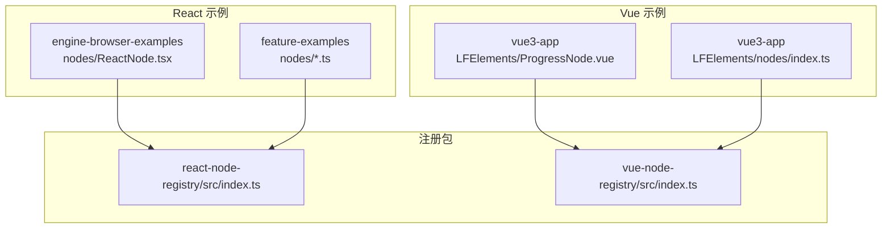
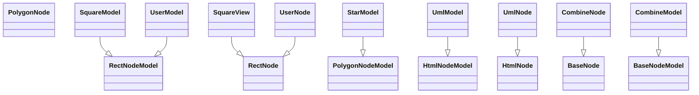
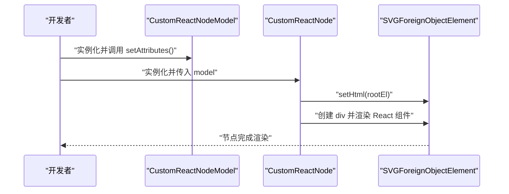
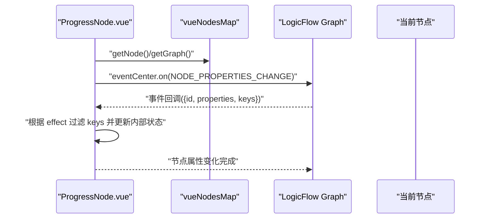
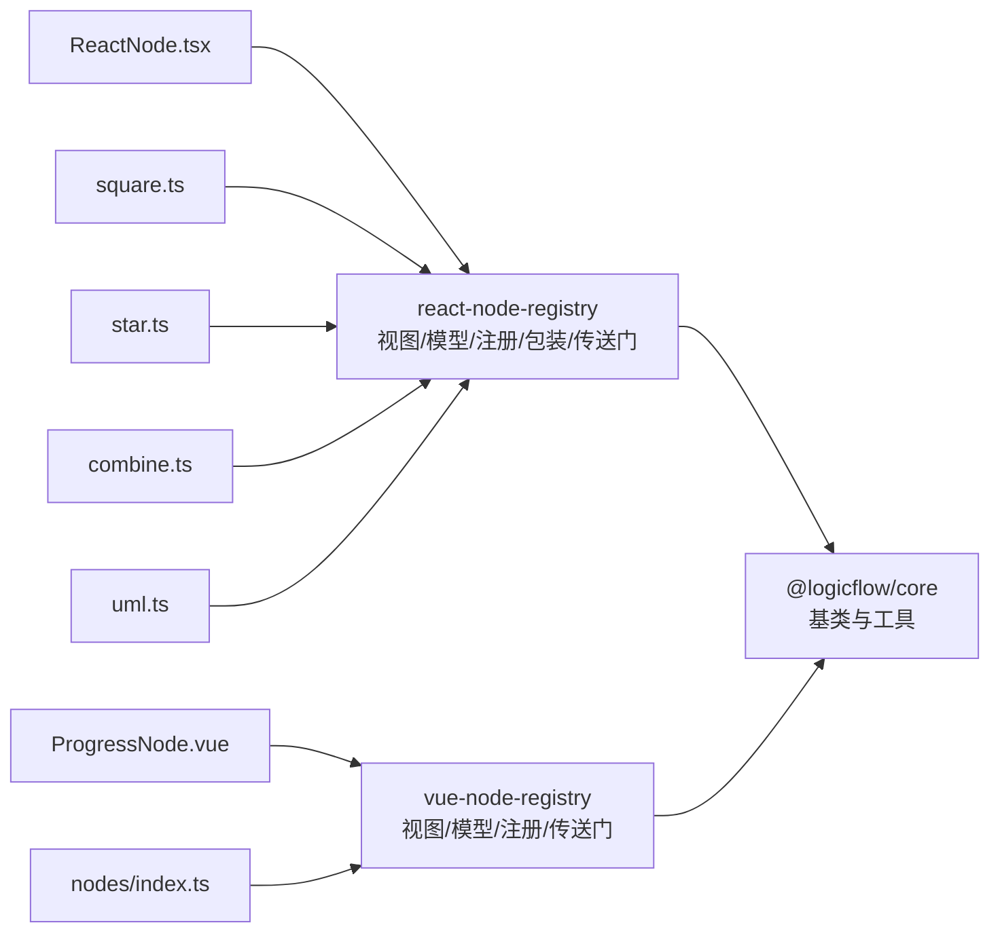

# 自定义节点开发

<cite>
**本文引用的文件**
- [packages/react-node-registry/src/index.ts](file://packages/react-node-registry/src/index.ts)
- [packages/vue-node-registry/src/index.ts](file://packages/vue-node-registry/src/index.ts)
- [examples/engine-browser-examples/src/pages/graph/nodes/index.ts](file://examples/engine-browser-examples/src/pages/graph/nodes/index.ts)
- [examples/feature-examples/src/pages/graph/nodes/index.ts](file://examples/feature-examples/src/pages/graph/nodes/index.ts)
- [examples/engine-browser-examples/src/pages/graph/nodes/ReactNode.tsx](file://examples/engine-browser-examples/src/pages/graph/nodes/ReactNode.tsx)
- [examples/feature-examples/src/pages/graph/nodes/square.ts](file://examples/feature-examples/src/pages/graph/nodes/square.ts)
- [examples/feature-examples/src/pages/graph/nodes/star.ts](file://examples/feature-examples/src/pages/graph/nodes/star.ts)
- [examples/feature-examples/src/pages/graph/nodes/combine.ts](file://examples/feature-examples/src/pages/graph/nodes/combine.ts)
- [examples/feature-examples/src/pages/graph/nodes/uml.ts](file://examples/feature-examples/src/pages/graph/nodes/uml.ts)
- [examples/feature-examples/src/pages/graph/nodes/user.ts](file://examples/feature-examples/src/pages/graph/nodes/user.ts)
- [examples/feature-examples/src/pages/graph/nodes/centerAnchorRect.ts](file://examples/feature-examples/src/pages/graph/nodes/centerAnchorRect.ts)
- [examples/vue3-app/src/components/LFElements/nodes/index.ts](file://examples/vue3-app/src/components/LFElements/nodes/index.ts)
- [examples/vue3-app/src/components/LFElements/ProgressNode.vue](file://examples/vue3-app/src/components/LFElements/ProgressNode.vue)
</cite>

## 目录
1. [引言](#引言)
2. [项目结构](#项目结构)
3. [核心组件](#核心组件)
4. [架构总览](#架构总览)
5. [详细组件分析](#详细组件分析)
6. [依赖关系分析](#依赖关系分析)
7. [性能考虑](#性能考虑)
8. [故障排查指南](#故障排查指南)
9. [结论](#结论)
10. [附录](#附录)

## 引言
本指南面向需要在 LogicFlow 中开发自定义节点的前端工程师，覆盖 Vue 与 React 两大生态下的实现差异与最佳实践。内容围绕节点生命周期（创建、渲染、更新、销毁）、数据模型与样式系统、交互与事件处理、节点注册与全局配置、以及性能优化与内存管理展开，并提供从基础节点到复合节点与动态节点的完整开发路径。

## 项目结构
该仓库提供了多套示例工程，其中与自定义节点直接相关的关键目录如下：
- React 生态：引擎浏览器示例与特性示例中的“nodes”目录，展示了基于 HtmlNode/RectNode/PolygonNode 等基类的自定义节点实现。
- Vue 生态：Vue3 示例应用中的“LFElements/nodes”目录，展示了基于 @logicflow/vue-node-registry 的节点注册与事件联动。
- 节点注册包：packages/react-node-registry 与 packages/vue-node-registry 暴露了统一的导出入口，便于在应用中集中注册与使用。

图表来源
- [examples/engine-browser-examples/src/pages/graph/nodes/ReactNode.tsx](file://examples/engine-browser-examples/src/pages/graph/nodes/ReactNode.tsx#L1-L64)
- [examples/feature-examples/src/pages/graph/nodes/square.ts](file://examples/feature-examples/src/pages/graph/nodes/square.ts#L1-L76)
- [examples/vue3-app/src/components/LFElements/ProgressNode.vue](file://examples/vue3-app/src/components/LFElements/ProgressNode.vue#L1-L41)
- [packages/react-node-registry/src/index.ts](file://packages/react-node-registry/src/index.ts#L1-L6)
- [packages/vue-node-registry/src/index.ts](file://packages/vue-node-registry/src/index.ts#L1-L5)

章节来源
- [examples/engine-browser-examples/src/pages/graph/nodes/index.ts](file://examples/engine-browser-examples/src/pages/graph/nodes/index.ts#L1-L16)
- [examples/feature-examples/src/pages/graph/nodes/index.ts](file://examples/feature-examples/src/pages/graph/nodes/index.ts#L1-L14)
- [examples/vue3-app/src/components/LFElements/nodes/index.ts](file://examples/vue3-app/src/components/LFElements/nodes/index.ts#L1-L14)

## 核心组件
- React 节点注册与包装
  - 导出入口集中于 react-node-registry，包含 view/model/registry/wrapper/portal 等模块，用于将 React 组件注入到 LogicFlow 的 HTML 节点体系。
- Vue 节点注册与 Teleport
  - 导出入口集中于 vue-node-registry，包含 view/model/registry/teleport 等模块，用于将 Vue 组件以 Teleport 形式挂载到节点区域。
- 基础节点类型
  - HtmlNode/HtmlNodeModel：适合嵌入任意 HTML 或 React/Vue 组件，支持自定义锚点与文本布局。
  - RectNode/RectNodeModel：矩形节点，常用于规则校验、样式定制与锚点扩展。
  - PolygonNode/PolygonNodeModel：多边形节点，适合星形等非矩形图形。
  - BaseNode/BaseNodeModel：底层通用节点，可完全自定义 SVG 图形与锚点集合。

章节来源
- [packages/react-node-registry/src/index.ts](file://packages/react-node-registry/src/index.ts#L1-L6)
- [packages/vue-node-registry/src/index.ts](file://packages/vue-node-registry/src/index.ts#L1-L5)
- [examples/feature-examples/src/pages/graph/nodes/square.ts](file://examples/feature-examples/src/pages/graph/nodes/square.ts#L1-L76)
- [examples/feature-examples/src/pages/graph/nodes/star.ts](file://examples/feature-examples/src/pages/graph/nodes/star.ts#L1-L22)
- [examples/feature-examples/src/pages/graph/nodes/combine.ts](file://examples/feature-examples/src/pages/graph/nodes/combine.ts#L1-L48)

## 架构总览
LogicFlow 在不同框架下的节点开发遵循统一的“视图-模型-注册”三层结构：
- 模型层（Model）：负责节点尺寸、锚点、样式、校验规则与属性持久化。
- 视图层（View）：负责节点的渲染逻辑，React 下通常通过 setHtml 或 ReactDOM 渲染，Vue 下通过 Teleport 注入。
- 注册层（Registry）：将 type、view、model 组合注册到 LogicFlow，供画布使用。

图表来源
- [examples/feature-examples/src/pages/graph/nodes/square.ts](file://examples/feature-examples/src/pages/graph/nodes/square.ts#L3-L21)
- [examples/feature-examples/src/pages/graph/nodes/star.ts](file://examples/feature-examples/src/pages/graph/nodes/star.ts#L3-L15)
- [examples/feature-examples/src/pages/graph/nodes/uml.ts](file://examples/feature-examples/src/pages/graph/nodes/uml.ts#L3-L33)
- [examples/feature-examples/src/pages/graph/nodes/user.ts](file://examples/feature-examples/src/pages/graph/nodes/user.ts#L29-L40)
- [examples/feature-examples/src/pages/graph/nodes/combine.ts](file://examples/feature-examples/src/pages/graph/nodes/combine.ts#L28-L41)

## 详细组件分析

### React 节点开发
- 基础节点（HtmlNode）
  - 通过 HtmlNodeModel 定义尺寸、文本高度与锚点偏移；通过 HtmlNode.setHtml 将 React 组件渲染到节点容器。
  - 示例参考：[React 自定义节点](file://examples/engine-browser-examples/src/pages/graph/nodes/ReactNode.tsx#L6-L63)
- 矩形节点（RectNode）
  - 通过 RectNodeModel 设置宽高与锚点；通过 RectNode.getShape 返回 h 创建的 SVG 元素，或通过 getTextStyle 动态调整文本样式。
  - 示例参考：[正方形节点](file://examples/feature-examples/src/pages/graph/nodes/square.ts#L3-L75)
- 多边形节点（PolygonNode）
  - 通过 PolygonNodeModel 指定多边形顶点坐标，快速生成不规则形状。
  - 示例参考：[星形节点](file://examples/feature-examples/src/pages/graph/nodes/star.ts#L3-L21)
- 底层组合节点（BaseNode）
  - 通过 BaseNodeModel 与 BaseNode.getShape 自定义复杂图形与锚点集合。
  - 示例参考：[组合节点](file://examples/feature-examples/src/pages/graph/nodes/combine.ts#L8-L47)

图表来源
- [examples/engine-browser-examples/src/pages/graph/nodes/ReactNode.tsx](file://examples/engine-browser-examples/src/pages/graph/nodes/ReactNode.tsx#L6-L63)

章节来源
- [examples/engine-browser-examples/src/pages/graph/nodes/ReactNode.tsx](file://examples/engine-browser-examples/src/pages/graph/nodes/ReactNode.tsx#L1-L64)
- [examples/feature-examples/src/pages/graph/nodes/square.ts](file://examples/feature-examples/src/pages/graph/nodes/square.ts#L1-L76)
- [examples/feature-examples/src/pages/graph/nodes/star.ts](file://examples/feature-examples/src/pages/graph/nodes/star.ts#L1-L22)
- [examples/feature-examples/src/pages/graph/nodes/combine.ts](file://examples/feature-examples/src/pages/graph/nodes/combine.ts#L1-L48)

### Vue 节点开发
- 节点注册与事件联动
  - 通过 @logicflow/vue-node-registry 的 vueNodesMap 与 inject 获取当前节点与画布实例；监听 NodeType.NODE_PROPERTIES_CHANGE 事件，按需更新节点内部状态。
  - 示例参考：[进度条节点](file://examples/vue3-app/src/components/LFElements/ProgressNode.vue#L14-L39)
- 节点导出与注册
  - 通过 nodes/index.ts 汇总导出各节点，配合注册包完成全局注册。
  - 示例参考：[Vue 节点导出](file://examples/vue3-app/src/components/LFElements/nodes/index.ts#L1-L14)

图表来源
- [examples/vue3-app/src/components/LFElements/ProgressNode.vue](file://examples/vue3-app/src/components/LFElements/ProgressNode.vue#L14-L39)

章节来源
- [examples/vue3-app/src/components/LFElements/ProgressNode.vue](file://examples/vue3-app/src/components/LFElements/ProgressNode.vue#L1-L41)
- [examples/vue3-app/src/components/LFElements/nodes/index.ts](file://examples/vue3-app/src/components/LFElements/nodes/index.ts#L1-L14)

### 节点生命周期管理
- 创建阶段
  - 模型：在构造函数或 setAttributes 中初始化尺寸、锚点、样式与校验规则。
  - 视图：在构造函数或 getShape/setHtml 中准备渲染上下文。
- 渲染阶段
  - React：setHtml 中创建容器并渲染组件。
  - Vue：通过 Teleport 将模板渲染到节点区域。
- 更新阶段
  - React：通过 props.model 取值，必要时重写 getShape 或 setHtml。
  - Vue：监听属性变更事件，按 effect 过滤后更新内部 data。
- 销毁阶段
  - React：在 setHtml 中清理 DOM 或在组件卸载时释放资源。
  - Vue：在 beforeUnmount 钩子中清理事件监听与定时器。

章节来源
- [examples/engine-browser-examples/src/pages/graph/nodes/ReactNode.tsx](file://examples/engine-browser-examples/src/pages/graph/nodes/ReactNode.tsx#L39-L56)
- [examples/vue3-app/src/components/LFElements/ProgressNode.vue](file://examples/vue3-app/src/components/LFElements/ProgressNode.vue#L22-L39)

### 数据模型、样式系统与交互
- 数据模型
  - properties：节点业务属性，可通过事件驱动更新。
  - getNodeStyle/getTextStyle：统一读取样式与文本样式，支持动态切换。
  - anchorsOffset：自定义锚点位置，影响连线与拖拽行为。
- 样式系统
  - fill/stroke/radius/text.background 等属性控制外观；RectNode 的文本样式支持自动换行与背景。
- 交互行为
  - 通过 sourceRules/targetRules 实现连接规则校验；通过 getAnchorStyle/getTextStyle 调整交互反馈。

章节来源
- [examples/feature-examples/src/pages/graph/nodes/user.ts](file://examples/feature-examples/src/pages/graph/nodes/user.ts#L7-L40)
- [examples/feature-examples/src/pages/graph/nodes/square.ts](file://examples/feature-examples/src/pages/graph/nodes/square.ts#L3-L21)
- [examples/feature-examples/src/pages/graph/nodes/centerAnchorRect.ts](file://examples/feature-examples/src/pages/graph/nodes/centerAnchorRect.ts#L4-L14)

### 节点注册机制与全局配置
- React 注册
  - 通过 react-node-registry 的导出入口集中引入与注册，确保视图与模型一一对应。
- Vue 注册
  - 通过 vue-node-registry 的导出入口与 Teleport，结合 nodes/index.ts 汇总导出。
- 全局配置
  - 在应用启动时统一注册所有节点类型，避免重复与遗漏。

章节来源
- [packages/react-node-registry/src/index.ts](file://packages/react-node-registry/src/index.ts#L1-L6)
- [packages/vue-node-registry/src/index.ts](file://packages/vue-node-registry/src/index.ts#L1-L5)
- [examples/engine-browser-examples/src/pages/graph/nodes/index.ts](file://examples/engine-browser-examples/src/pages/graph/nodes/index.ts#L1-L16)
- [examples/feature-examples/src/pages/graph/nodes/index.ts](file://examples/feature-examples/src/pages/graph/nodes/index.ts#L1-L14)
- [examples/vue3-app/src/components/LFElements/nodes/index.ts](file://examples/vue3-app/src/components/LFElements/nodes/index.ts#L1-L14)

### 开发示例路径
- 基础节点
  - HtmlNode：适合嵌入富文本或表单控件，参考 [UML 节点](file://examples/feature-examples/src/pages/graph/nodes/uml.ts#L3-L62)
  - RectNode：适合规则校验与样式定制，参考 [正方形节点](file://examples/feature-examples/src/pages/graph/nodes/square.ts#L3-L75)
  - PolygonNode：适合特殊形状，参考 [星形节点](file://examples/feature-examples/src/pages/graph/nodes/star.ts#L3-L21)
- 复合节点
  - BaseNode：自定义复杂图形与锚点，参考 [组合节点](file://examples/feature-examples/src/pages/graph/nodes/combine.ts#L8-L47)
- 动态节点
  - React：通过 setHtml 动态渲染，参考 [React 自定义节点](file://examples/engine-browser-examples/src/pages/graph/nodes/ReactNode.tsx#L39-L63)
  - Vue：通过事件联动更新内部状态，参考 [进度条节点](file://examples/vue3-app/src/components/LFElements/ProgressNode.vue#L22-L39)

章节来源
- [examples/feature-examples/src/pages/graph/nodes/uml.ts](file://examples/feature-examples/src/pages/graph/nodes/uml.ts#L1-L63)
- [examples/feature-examples/src/pages/graph/nodes/square.ts](file://examples/feature-examples/src/pages/graph/nodes/square.ts#L1-L76)
- [examples/feature-examples/src/pages/graph/nodes/star.ts](file://examples/feature-examples/src/pages/graph/nodes/star.ts#L1-L22)
- [examples/feature-examples/src/pages/graph/nodes/combine.ts](file://examples/feature-examples/src/pages/graph/nodes/combine.ts#L1-L48)
- [examples/engine-browser-examples/src/pages/graph/nodes/ReactNode.tsx](file://examples/engine-browser-examples/src/pages/graph/nodes/ReactNode.tsx#L1-L64)
- [examples/vue3-app/src/components/LFElements/ProgressNode.vue](file://examples/vue3-app/src/components/LFElements/ProgressNode.vue#L1-L41)

## 依赖关系分析
- React 侧
  - HtmlNode/RectNode/PolygonNode 均继承自 @logicflow/core 的基类，通过 react-node-registry 注入 React 组件。
- Vue 侧
  - 通过 vue-node-registry 的 Teleport 机制将 Vue 组件挂载到节点区域，并借助事件中心实现属性联动。
- 注册聚合
  - 各示例工程的 nodes/index.ts 聚合导出，统一注册到 LogicFlow。

图表来源
- [examples/engine-browser-examples/src/pages/graph/nodes/ReactNode.tsx](file://examples/engine-browser-examples/src/pages/graph/nodes/ReactNode.tsx#L1-L64)
- [examples/feature-examples/src/pages/graph/nodes/square.ts](file://examples/feature-examples/src/pages/graph/nodes/square.ts#L1-L76)
- [examples/feature-examples/src/pages/graph/nodes/star.ts](file://examples/feature-examples/src/pages/graph/nodes/star.ts#L1-L22)
- [examples/feature-examples/src/pages/graph/nodes/combine.ts](file://examples/feature-examples/src/pages/graph/nodes/combine.ts#L1-L48)
- [examples/feature-examples/src/pages/graph/nodes/uml.ts](file://examples/feature-examples/src/pages/graph/nodes/uml.ts#L1-L63)
- [examples/vue3-app/src/components/LFElements/ProgressNode.vue](file://examples/vue3-app/src/components/LFElements/ProgressNode.vue#L1-L41)
- [packages/react-node-registry/src/index.ts](file://packages/react-node-registry/src/index.ts#L1-L6)
- [packages/vue-node-registry/src/index.ts](file://packages/vue-node-registry/src/index.ts#L1-L5)

章节来源
- [examples/engine-browser-examples/src/pages/graph/nodes/index.ts](file://examples/engine-browser-examples/src/pages/graph/nodes/index.ts#L1-L16)
- [examples/feature-examples/src/pages/graph/nodes/index.ts](file://examples/feature-examples/src/pages/graph/nodes/index.ts#L1-L14)
- [examples/vue3-app/src/components/LFElements/nodes/index.ts](file://examples/vue3-app/src/components/LFElements/nodes/index.ts#L1-L14)

## 性能考虑
- 渲染优化
  - React：尽量减少 setHtml 中的 DOM 重建，优先复用容器；在组件层面使用浅比较与 memo 化。
  - Vue：利用 Teleport 的惰性渲染，仅在节点可见时渲染；避免不必要的响应式更新。
- 事件与订阅
  - Vue：通过 effect 字段精确过滤属性变更，避免全量重绘。
  - React：在 setHtml 中统一管理事件解绑，防止重复绑定导致的内存泄漏。
- 样式与锚点
  - 合理设置 anchorsOffset 与 getNodeStyle，减少不必要的重排与重绘。
- 大数据量场景
  - 使用虚拟滚动与懒加载；对频繁更新的节点采用节流/防抖策略。

## 故障排查指南
- 问题：节点不显示或渲染异常
  - 检查节点是否正确注册，type 是否与导出一致。
  - 检查 HtmlNode 的 setHtml 是否正确挂载到 rootEl。
- 问题：属性变更未生效
  - Vue：确认 eventCenter.on 的监听是否在 mounted 中注册；检查 effect 字段是否包含变更的 keys。
  - React：确认 props.model 是否更新，setHtml 是否重新执行。
- 问题：连接规则无效
  - 检查 sourceRules/targetRules 的 validate 函数返回值与目标节点 type 是否匹配。
- 问题：内存泄漏
  - Vue：在 beforeUnmount 中移除事件监听；避免闭包持有旧引用。
  - React：在 setHtml 中清理 DOM 与计时器；避免重复渲染导致的资源累积。

章节来源
- [examples/feature-examples/src/pages/graph/nodes/square.ts](file://examples/feature-examples/src/pages/graph/nodes/square.ts#L8-L19)
- [examples/vue3-app/src/components/LFElements/ProgressNode.vue](file://examples/vue3-app/src/components/LFElements/ProgressNode.vue#L22-L39)
- [examples/engine-browser-examples/src/pages/graph/nodes/ReactNode.tsx](file://examples/engine-browser-examples/src/pages/graph/nodes/ReactNode.tsx#L39-L56)

## 结论
通过统一的“视图-模型-注册”架构，LogicFlow 在 React 与 Vue 生态下均能高效实现自定义节点。开发者应优先选择合适的基类（HtmlNode/RectNode/PolygonNode/BaseNode），在模型层定义清晰的数据与规则，在视图层实现稳定的渲染与交互，并通过注册包与事件中心完成全局集成与动态更新。遵循本文的生命周期管理、性能优化与故障排查建议，可快速构建从基础到复杂的各类节点。

## 附录
- 关键实现路径参考
  - React 自定义节点：[React 自定义节点](file://examples/engine-browser-examples/src/pages/graph/nodes/ReactNode.tsx#L6-L63)
  - 正方形节点：[正方形节点](file://examples/feature-examples/src/pages/graph/nodes/square.ts#L3-L75)
  - 星形节点：[星形节点](file://examples/feature-examples/src/pages/graph/nodes/star.ts#L3-L21)
  - 组合节点：[组合节点](file://examples/feature-examples/src/pages/graph/nodes/combine.ts#L8-L47)
  - UML 节点：[UML 节点](file://examples/feature-examples/src/pages/graph/nodes/uml.ts#L3-L62)
  - 用户节点：[用户节点](file://examples/feature-examples/src/pages/graph/nodes/user.ts#L7-L46)
  - Vue 进度条节点：[进度条节点](file://examples/vue3-app/src/components/LFElements/ProgressNode.vue#L14-L39)
  - 注册包导出：[React 注册包](file://packages/react-node-registry/src/index.ts#L1-L6)、[Vue 注册包](file://packages/vue-node-registry/src/index.ts#L1-L5)