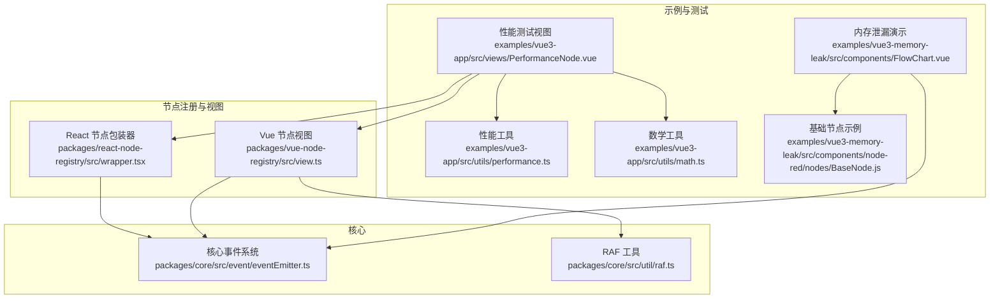
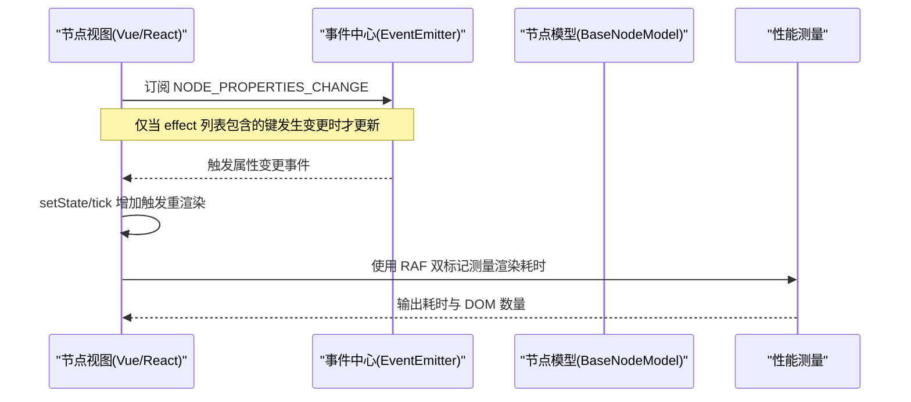
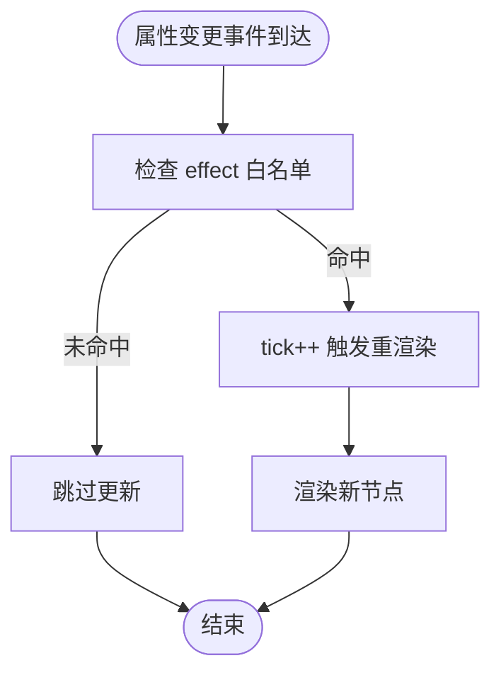
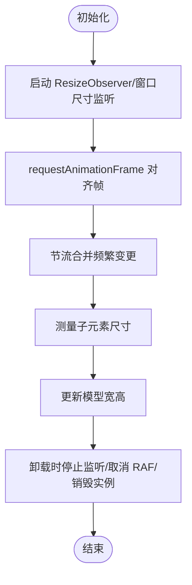
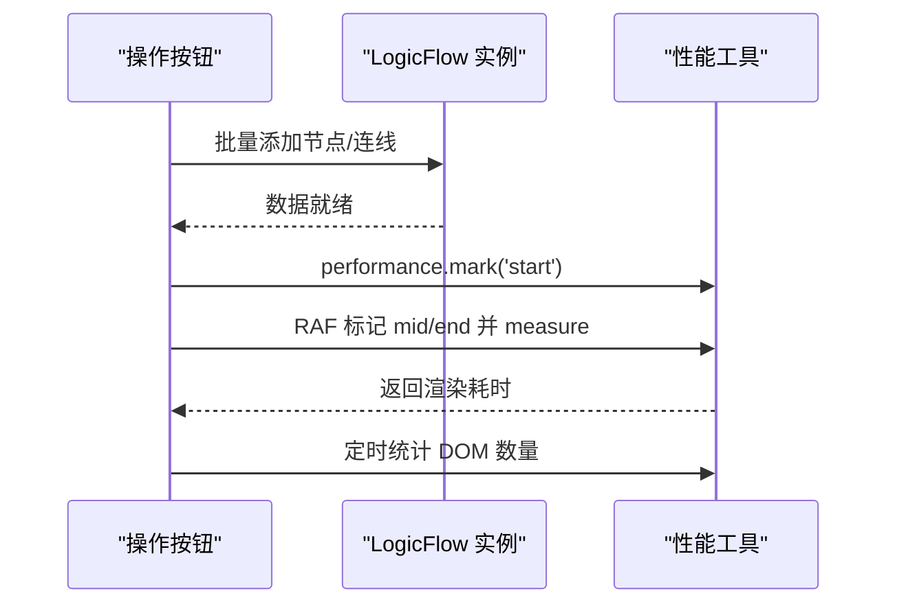
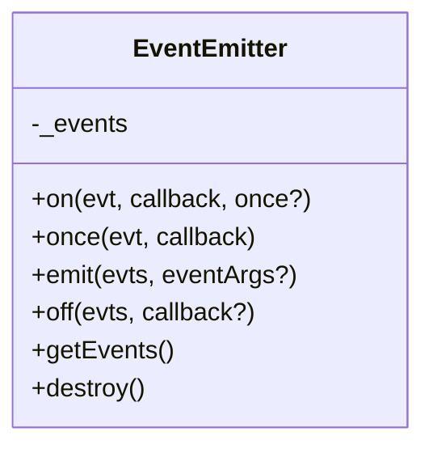
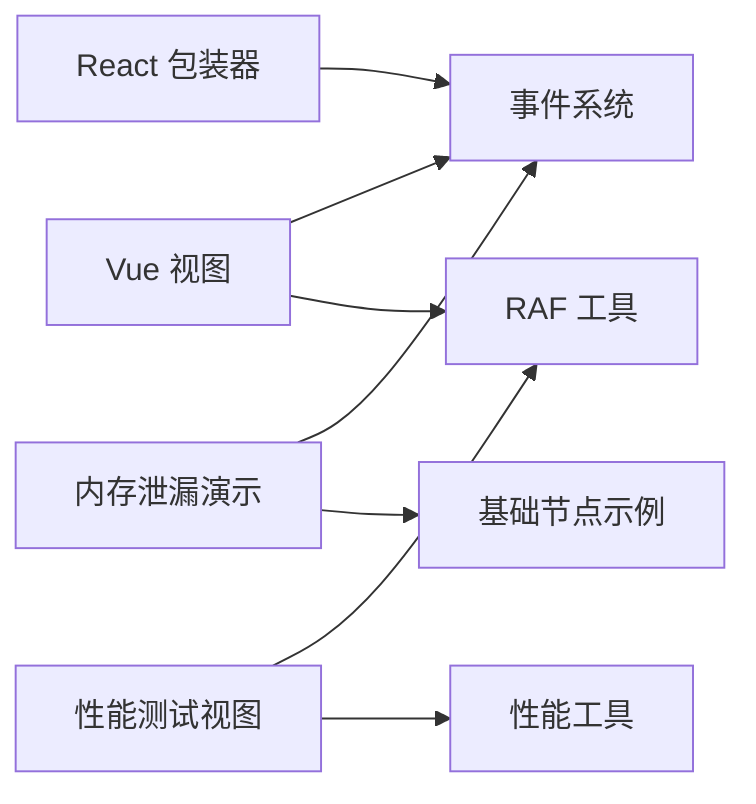

# 节点性能优化

<cite>
**本文引用的文件**
- [packages/react-node-registry/src/wrapper.tsx](file://packages/react-node-registry/src/wrapper.tsx)
- [packages/vue-node-registry/src/view.ts](file://packages/vue-node-registry/src/view.ts)
- [examples/vue3-app/src/views/PerformanceNode.vue](file://examples/vue3-app/src/views/PerformanceNode.vue)
- [examples/vue3-app/src/utils/performance.ts](file://examples/vue3-app/src/utils/performance.ts)
- [examples/vue3-app/src/utils/math.ts](file://examples/vue3-app/src/utils/math.ts)
- [packages/core/src/event/eventEmitter.ts](file://packages/core/src/event/eventEmitter.ts)
- [packages/core/src/util/raf.ts](file://packages/core/src/util/raf.ts)
- [examples/vue3-memory-leak/src/components/FlowChart.vue](file://examples/vue3-memory-leak/src/components/FlowChart.vue)
- [examples/vue3-memory-leak/src/components/node-red/nodes/BaseNode.js](file://examples/vue3-memory-leak/src/components/node-red/nodes/BaseNode.js)
</cite>

## 目录
1. [引言](#引言)
2. [项目结构](#项目结构)
3. [核心组件](#核心组件)
4. [架构总览](#架构总览)
5. [详细组件分析](#详细组件分析)
6. [依赖关系分析](#依赖关系分析)
7. [性能考量](#性能考量)
8. [故障排查指南](#故障排查指南)
9. [结论](#结论)
10. [附录](#附录)

## 引言
本指南聚焦于在大规模流程图中自定义节点的性能优化，围绕渲染性能、内存管理、重绘重排、数据缓存、动画性能、事件处理以及性能监控与调试展开。文档以仓库中的 React/Vue 节点注册与视图实现、事件系统、RAF 工具、性能监控示例与内存泄漏演示为依据，给出可落地的优化策略与最佳实践。

## 项目结构
本项目采用多包结构，核心能力集中在 core、react-node-registry、vue-node-registry 等包中，同时在 examples 下提供了丰富的示例应用，包括性能测试页、内存泄漏演示等。

**图表来源**
- [packages/core/src/event/eventEmitter.ts](file://packages/core/src/event/eventEmitter.ts#L25-L103)
- [packages/core/src/util/raf.ts](file://packages/core/src/util/raf.ts#L5-L28)
- [packages/react-node-registry/src/wrapper.tsx](file://packages/react-node-registry/src/wrapper.tsx#L21-L37)
- [packages/vue-node-registry/src/view.ts](file://packages/vue-node-registry/src/view.ts#L182-L227)
- [examples/vue3-app/src/views/PerformanceNode.vue](file://examples/vue3-app/src/views/PerformanceNode.vue#L101-L152)
- [examples/vue3-app/src/utils/performance.ts](file://examples/vue3-app/src/utils/performance.ts#L1-L27)
- [examples/vue3-memory-leak/src/components/FlowChart.vue](file://examples/vue3-memory-leak/src/components/FlowChart.vue#L18-L38)
- [examples/vue3-memory-leak/src/components/node-red/nodes/BaseNode.js](file://examples/vue3-memory-leak/src/components/node-red/nodes/BaseNode.js#L107-L150)

**章节来源**
- [packages/react-node-registry/src/wrapper.tsx](file://packages/react-node-registry/src/wrapper.tsx#L1-L77)
- [packages/vue-node-registry/src/view.ts](file://packages/vue-node-registry/src/view.ts#L1-L254)
- [examples/vue3-app/src/views/PerformanceNode.vue](file://examples/vue3-app/src/views/PerformanceNode.vue#L1-L270)
- [examples/vue3-app/src/utils/performance.ts](file://examples/vue3-app/src/utils/performance.ts#L1-L27)
- [packages/core/src/event/eventEmitter.ts](file://packages/core/src/event/eventEmitter.ts#L25-L154)
- [packages/core/src/util/raf.ts](file://packages/core/src/util/raf.ts#L1-L29)
- [examples/vue3-memory-leak/src/components/FlowChart.vue](file://examples/vue3-memory-leak/src/components/FlowChart.vue#L1-L225)
- [examples/vue3-memory-leak/src/components/node-red/nodes/BaseNode.js](file://examples/vue3-memory-leak/src/components/node-red/nodes/BaseNode.js#L107-L150)

## 核心组件
- React 节点包装器：基于事件中心按需更新，避免无关属性变更导致的全量重渲染。
- Vue 节点视图：集成 ResizeObserver + RAF + 节流，动态测量尺寸并安全卸载，防止内存泄漏。
- 性能测试视图：通过 requestAnimationFrame 双标记法测量渲染耗时，统计 DOM 数量。
- 事件系统：通用事件发射器，支持一次性监听、批量移除与销毁。
- RAF 工具：封装周期性动画帧调度，便于取消与资源回收。

**章节来源**
- [packages/react-node-registry/src/wrapper.tsx](file://packages/react-node-registry/src/wrapper.tsx#L21-L37)
- [packages/vue-node-registry/src/view.ts](file://packages/vue-node-registry/src/view.ts#L182-L227)
- [examples/vue3-app/src/views/PerformanceNode.vue](file://examples/vue3-app/src/views/PerformanceNode.vue#L101-L152)
- [packages/core/src/event/eventEmitter.ts](file://packages/core/src/event/eventEmitter.ts#L114-L154)
- [packages/core/src/util/raf.ts](file://packages/core/src/util/raf.ts#L5-L28)

## 架构总览
节点渲染路径从视图层到事件系统再到模型层，形成“事件驱动 + 条件更新”的渲染闭环；同时通过 RAF 和 ResizeObserver 控制渲染节奏与尺寸变更成本。

**图表来源**
- [packages/react-node-registry/src/wrapper.tsx](file://packages/react-node-registry/src/wrapper.tsx#L21-L37)
- [packages/core/src/event/eventEmitter.ts](file://packages/core/src/event/eventEmitter.ts#L75-L103)
- [examples/vue3-app/src/views/PerformanceNode.vue](file://examples/vue3-app/src/views/PerformanceNode.vue#L136-L151)

## 详细组件分析

### React 节点包装器（条件更新）
- 事件订阅：监听节点属性变更事件，仅在 effect 白名单命中时更新。
- 渲染策略：通过状态 tick 变化触发最小化重渲染，避免对未受影响属性的重绘。
- 扩展点：支持字符串标签与 React 元素克隆，便于包裹容器与传递上下文。

**图表来源**
- [packages/react-node-registry/src/wrapper.tsx](file://packages/react-node-registry/src/wrapper.tsx#L21-L37)

**章节来源**
- [packages/react-node-registry/src/wrapper.tsx](file://packages/react-node-registry/src/wrapper.tsx#L15-L77)

### Vue 节点视图（尺寸监听与安全卸载）
- 尺寸监听：优先使用 ResizeObserver，降级到 window.resize；使用 RAF 对齐帧并节流更新。
- 安全卸载：在组件卸载前停止观察器、取消 RAF、销毁实例，避免内存泄漏。
- 动态测量：读取子元素实际尺寸，修正模型宽高，确保内容与模型一致。

**图表来源**
- [packages/vue-node-registry/src/view.ts](file://packages/vue-node-registry/src/view.ts#L182-L227)
- [packages/vue-node-registry/src/view.ts](file://packages/vue-node-registry/src/view.ts#L229-L250)

**章节来源**
- [packages/vue-node-registry/src/view.ts](file://packages/vue-node-registry/src/view.ts#L17-L254)

### 性能测试视图（渲染耗时与 DOM 数量）
- 渲染耗时：使用双 requestAnimationFrame 标记 measure，输出渲染耗时。
- DOM 数量：定时统计页面元素总数，辅助评估节点体量对 DOM 的影响。
- 批量添加：支持批量添加节点与连线，配合 nextTick 与 RAF 测量。

**图表来源**
- [examples/vue3-app/src/views/PerformanceNode.vue](file://examples/vue3-app/src/views/PerformanceNode.vue#L101-L152)
- [examples/vue3-app/src/utils/performance.ts](file://examples/vue3-app/src/utils/performance.ts#L1-L27)

**章节来源**
- [examples/vue3-app/src/views/PerformanceNode.vue](file://examples/vue3-app/src/views/PerformanceNode.vue#L101-L152)
- [examples/vue3-app/src/utils/performance.ts](file://examples/vue3-app/src/utils/performance.ts#L1-L27)
- [examples/vue3-app/src/utils/math.ts](file://examples/vue3-app/src/utils/math.ts#L7-L20)

### 事件系统（一次性监听与销毁）
- 一次性监听：once 支持事件只触发一次后自动移除，降低长期持有成本。
- 批量移除：off 支持按事件名或回调精确移除，避免残留监听。
- 销毁：destroy 清空所有事件，用于组件或实例生命周期末尾。

**图表来源**
- [packages/core/src/event/eventEmitter.ts](file://packages/core/src/event/eventEmitter.ts#L25-L154)

**章节来源**
- [packages/core/src/event/eventEmitter.ts](file://packages/core/src/event/eventEmitter.ts#L25-L154)

### RAF 工具（周期性调度与取消）
- 周期调度：基于 requestAnimationFrame 的循环调度，返回唯一标识。
- 取消机制：通过标识取消对应调度，防止泄漏与多余执行。

**章节来源**
- [packages/core/src/util/raf.ts](file://packages/core/src/util/raf.ts#L5-L28)

## 依赖关系分析
- React 节点包装器依赖事件中心，通过白名单控制更新范围，降低渲染成本。
- Vue 节点视图依赖事件中心与 RAF 工具，结合 ResizeObserver 与节流，平衡尺寸测量与性能。
- 性能测试视图依赖 RAF 双标记法与 DOM 统计工具，形成可复用的性能观测模式。
- 内存泄漏演示强调在卸载阶段清理事件与实例，与事件系统的 off/destroy 形成呼应。

**图表来源**
- [packages/react-node-registry/src/wrapper.tsx](file://packages/react-node-registry/src/wrapper.tsx#L21-L37)
- [packages/vue-node-registry/src/view.ts](file://packages/vue-node-registry/src/view.ts#L182-L227)
- [packages/core/src/util/raf.ts](file://packages/core/src/util/raf.ts#L5-L28)
- [examples/vue3-app/src/views/PerformanceNode.vue](file://examples/vue3-app/src/views/PerformanceNode.vue#L101-L152)
- [examples/vue3-memory-leak/src/components/FlowChart.vue](file://examples/vue3-memory-leak/src/components/FlowChart.vue#L169-L172)
- [examples/vue3-memory-leak/src/components/node-red/nodes/BaseNode.js](file://examples/vue3-memory-leak/src/components/node-red/nodes/BaseNode.js#L107-L150)

**章节来源**
- [packages/react-node-registry/src/wrapper.tsx](file://packages/react-node-registry/src/wrapper.tsx#L21-L37)
- [packages/vue-node-registry/src/view.ts](file://packages/vue-node-registry/src/view.ts#L182-L227)
- [packages/core/src/util/raf.ts](file://packages/core/src/util/raf.ts#L5-L28)
- [examples/vue3-app/src/views/PerformanceNode.vue](file://examples/vue3-app/src/views/PerformanceNode.vue#L101-L152)
- [examples/vue3-memory-leak/src/components/FlowChart.vue](file://examples/vue3-memory-leak/src/components/FlowChart.vue#L169-L172)
- [examples/vue3-memory-leak/src/components/node-red/nodes/BaseNode.js](file://examples/vue3-memory-leak/src/components/node-red/nodes/BaseNode.js#L107-L150)

## 性能考量
- 渲染性能
  - 条件更新：React 包装器基于 effect 白名单触发更新，避免无关属性引发的重渲染。
  - 尺寸测量节流：Vue 视图使用 RAF + 节流合并频繁尺寸变更，降低布局抖动与重排成本。
  - 批量添加：性能测试视图通过 nextTick 与 RAF 测量，建议在业务侧也采用批量提交策略。
- 内存管理
  - 卸载清理：Vue 视图在卸载前停止 ResizeObserver、取消 RAF、销毁实例，防止泄漏。
  - 事件清理：使用 off 精确移除监听，或在销毁阶段调用 destroy 清空事件池。
- 重绘与重排
  - 尺寸测量：优先使用 ResizeObserver，避免 window.resize 带来的全局监听成本。
  - RAF 对齐：使用 requestAnimationFrame 对齐绘制帧，减少跨帧抖动。
- 数据缓存
  - 结果缓存：对昂贵计算结果进行缓存，仅在输入变化时失效。
  - 渲染缓存：对静态节点或稳定内容进行缓存，避免重复渲染。
- 动画性能
  - CSS 动画优先：尽量使用 CSS 过渡与变换，利用 GPU 加速。
  - 硬件加速：合理使用 transform/opacity 等可触发合成层的属性。
- 事件处理
  - 事件委托：在容器级别集中处理事件，减少绑定数量。
  - 防抖节流：对高频事件（如滚动、缩放、尺寸变更）使用节流/防抖。
  - 异步处理：将耗时逻辑放入微任务或空闲回调，避免阻塞主线程。

[本节为通用性能指导，无需特定文件来源]

## 故障排查指南
- 渲染卡顿
  - 使用性能测试视图的 RAF 双标记法定位渲染耗时峰值。
  - 检查是否存在大量一次性监听未清理，或未使用节流/防抖。
- 内存泄漏
  - 确认节点视图在卸载时停止 ResizeObserver、取消 RAF、销毁实例。
  - 使用事件系统的 off/destroy 清理监听，避免闭包持有。
  - 参考内存泄漏演示，在组件卸载阶段调用销毁流程。
- 尺寸异常
  - 检查尺寸监听是否正确初始化与清理，确认 RAF 与节流生效。
  - 核对容器内首个子元素是否可正确获取边界框。

**章节来源**
- [examples/vue3-app/src/views/PerformanceNode.vue](file://examples/vue3-app/src/views/PerformanceNode.vue#L136-L151)
- [packages/vue-node-registry/src/view.ts](file://packages/vue-node-registry/src/view.ts#L209-L227)
- [packages/core/src/event/eventEmitter.ts](file://packages/core/src/event/eventEmitter.ts#L114-L154)
- [examples/vue3-memory-leak/src/components/FlowChart.vue](file://examples/vue3-memory-leak/src/components/FlowChart.vue#L169-L172)

## 结论
通过“事件驱动 + 条件更新”、“RAF + 节流 + 尺寸监听”、“卸载清理 + 事件销毁”与“性能测量 + 批量提交”的组合，可在大规模流程图场景下显著提升节点渲染性能与稳定性。建议在自定义节点开发中遵循上述策略，并结合实际业务数据规模持续监控与迭代。

[本节为总结性内容，无需特定文件来源]

## 附录
- 关键实现参考路径
  - React 节点包装器：[packages/react-node-registry/src/wrapper.tsx](file://packages/react-node-registry/src/wrapper.tsx#L21-L37)
  - Vue 节点视图：[packages/vue-node-registry/src/view.ts](file://packages/vue-node-registry/src/view.ts#L182-L227)
  - 事件系统：[packages/core/src/event/eventEmitter.ts](file://packages/core/src/event/eventEmitter.ts#L75-L103)
  - RAF 工具：[packages/core/src/util/raf.ts](file://packages/core/src/util/raf.ts#L5-L28)
  - 性能测试视图：[examples/vue3-app/src/views/PerformanceNode.vue](file://examples/vue3-app/src/views/PerformanceNode.vue#L101-L152)
  - 性能工具：[examples/vue3-app/src/utils/performance.ts](file://examples/vue3-app/src/utils/performance.ts#L1-L27)
  - 内存泄漏演示：[examples/vue3-memory-leak/src/components/FlowChart.vue](file://examples/vue3-memory-leak/src/components/FlowChart.vue#L169-L172)
  - 基础节点示例：[examples/vue3-memory-leak/src/components/node-red/nodes/BaseNode.js](file://examples/vue3-memory-leak/src/components/node-red/nodes/BaseNode.js#L107-L150)

[本节为补充信息，无需特定文件来源]