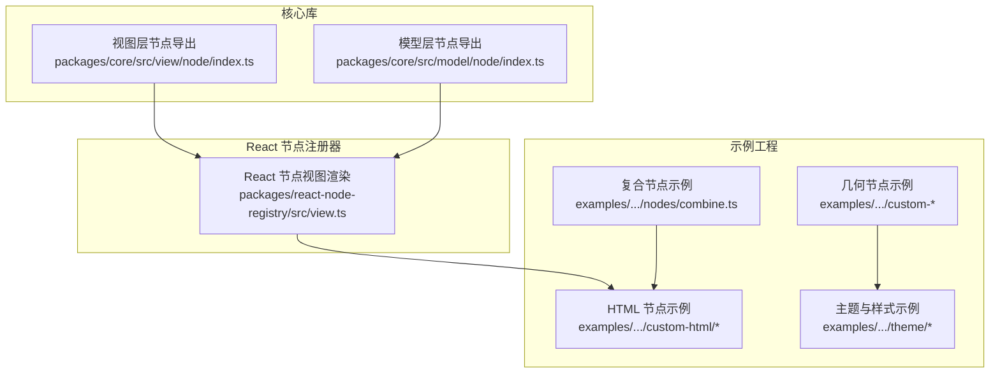
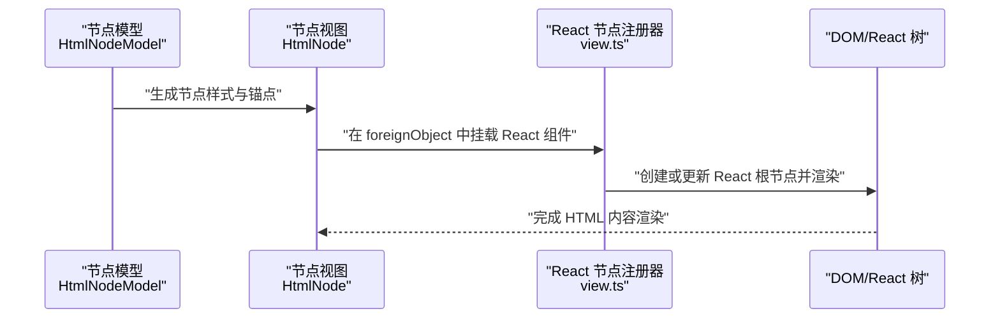
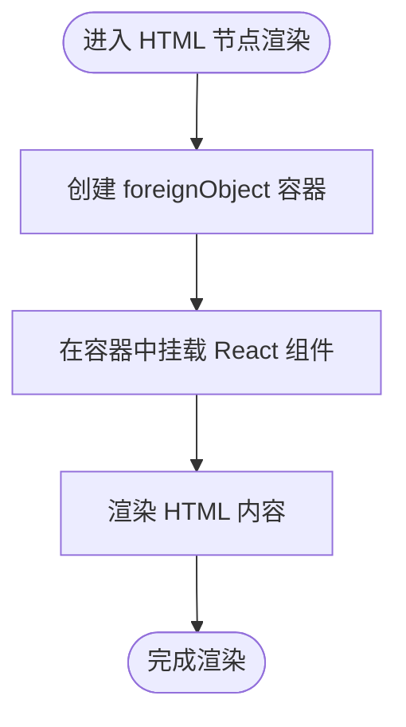
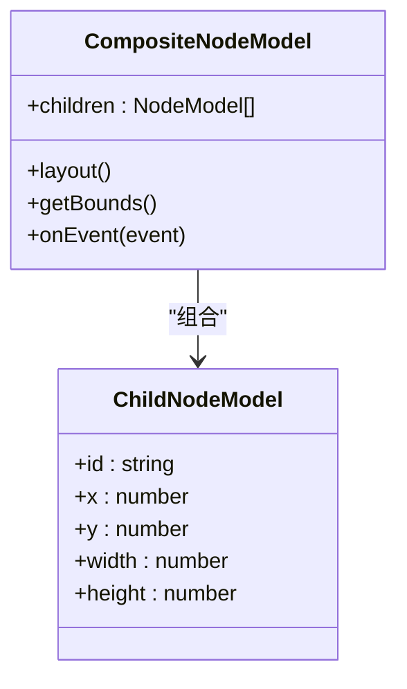
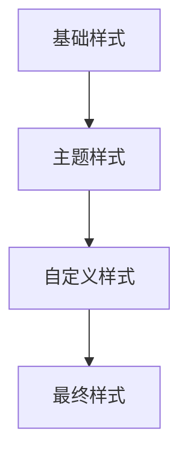
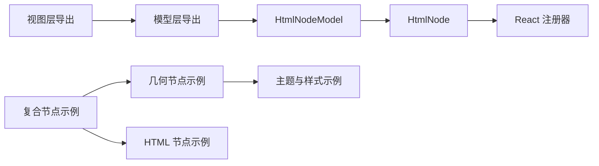

# 节点类型与实现

<cite>
**本文引用的文件**
- [packages/core/src/view/node/index.ts](file://packages/core/src/view/node/index.ts)
- [packages/core/src/view/node/HtmlNode.tsx](file://packages/core/src/view/node/HtmlNode.tsx)
- [packages/core/src/model/node/index.ts](file://packages/core/src/model/node/index.ts)
- [packages/core/src/model/node/HtmlNodeModel.ts](file://packages/core/src/model/node/HtmlNodeModel.ts)
- [packages/react-node-registry/src/view.ts](file://packages/react-node-registry/src/view.ts)
- [examples/engine-browser-examples/src/pages/graph/nodes/combine.ts](file://examples/engine-browser-examples/src/pages/graph/nodes/combine.ts)
- [examples/feature-examples/src/components/nodes/custom-html/Html.tsx](file://examples/feature-examples/src/components/nodes/custom-html/Html.tsx)
- [examples/feature-examples/src/components/nodes/custom-html/Icon.tsx](file://examples/feature-examples/src/components/nodes/custom-html/Icon.tsx)
- [examples/feature-examples/src/components/nodes/custom-html/Image.tsx](file://examples/feature-examples/src/components/nodes/custom-html/Image.tsx)
- [examples/feature-examples/src/components/nodes/custom-html/index.ts](file://examples/feature-examples/src/components/nodes/custom-html/index.ts)
- [examples/feature-examples/src/components/nodes/custom-rect/index.tsx](file://examples/feature-examples/src/components/nodes/custom-rect/index.tsx)
- [examples/feature-examples/src/components/nodes/custom-diamond/index.tsx](file://examples/feature-examples/src/components/nodes/custom-diamond/index.tsx)
- [examples/feature-examples/src/components/nodes/custom-ellipse/index.tsx](file://examples/feature-examples/src/components/nodes/custom-ellipse/index.tsx)
- [examples/feature-examples/src/components/nodes/custom-polygon/index.tsx](file://examples/feature-examples/src/components/nodes/custom-polygon/index.tsx)
- [examples/feature-examples/src/components/nodes/freeAnchor-rect/index.tsx](file://examples/feature-examples/src/components/nodes/freeAnchor-rect/index.tsx)
- [examples/feature-examples/src/components/nodes/freeAnchor-circle/index.tsx](file://examples/feature-examples/src/components/nodes/freeAnchor-circle/index.tsx)
- [examples/feature-examples/src/layouts/index.tsx](file://examples/feature-examples/src/layouts/index.tsx)
- [examples/feature-examples/src/theme/config.ts](file://examples/feature-examples/src/theme/config.ts)
- [examples/feature-examples/src/theme/shared-theme.tsx](file://examples/feature-examples/src/theme/shared-theme.tsx)
- [examples/feature-examples/src/theme/shared-theme.less](file://examples/feature-examples/src/theme/shared-theme.less)
</cite>

## 目录
1. [引言](#引言)
2. [项目结构](#项目结构)
3. [核心组件](#核心组件)
4. [架构总览](#架构总览)
5. [详细组件分析](#详细组件分析)
6. [依赖关系分析](#依赖关系分析)
7. [性能考量](#性能考量)
8. [故障排查指南](#故障排查指南)
9. [结论](#结论)
10. [附录](#附录)

## 引言
本文件系统性梳理 LogicFlow 在本仓库中的节点类型与实现，覆盖几何图形节点（矩形、圆形、多边形、菱形、椭圆）、HTML 节点、复合节点以及主题节点的实现原理与关键点。重点阐述节点数据结构（ID、位置坐标、尺寸属性、样式配置）、渲染机制（SVG、DOM、Canvas 的取舍与对比）、交互行为（选中、拖拽、连接、右键菜单）、复合节点设计模式、样式定制与动画实现及性能优化建议。

## 项目结构
围绕节点能力，本仓库主要由以下部分构成：
- 核心库导出：视图层节点与模型层节点的统一导出入口，便于扩展与复用。
- React 节点注册器：在 SVG 外部对象容器中挂载 React 组件，实现富交互 HTML 节点。
- 示例工程：涵盖几何图形节点、HTML 节点、复合节点、主题与样式等完整示例。

图表来源
- [packages/core/src/view/node/index.ts](file://packages/core/src/view/node/index.ts#L1-L8)
- [packages/core/src/model/node/index.ts](file://packages/core/src/model/node/index.ts#L1-L8)
- [packages/react-node-registry/src/view.ts](file://packages/react-node-registry/src/view.ts#L46-L93)
- [examples/engine-browser-examples/src/pages/graph/nodes/combine.ts](file://examples/engine-browser-examples/src/pages/graph/nodes/combine.ts)
- [examples/feature-examples/src/components/nodes/custom-html/Html.tsx](file://examples/feature-examples/src/components/nodes/custom-html/Html.tsx)
- [examples/feature-examples/src/theme/config.ts](file://examples/feature-examples/src/theme/config.ts)

章节来源
- [packages/core/src/view/node/index.ts](file://packages/core/src/view/node/index.ts#L1-L8)
- [packages/core/src/model/node/index.ts](file://packages/core/src/model/node/index.ts#L1-L8)

## 核心组件
- 视图层节点导出：集中导出基础节点与 HTML 节点等，便于上层按需引入与扩展。
- 模型层节点导出：提供节点数据模型的统一入口，支撑节点样式、锚点、尺寸等数据。
- React 节点视图：负责在 SVG 的 foreignObject 容器中挂载 React 组件，实现富交互 HTML 节点。
- 复合节点：将多个子节点组合为一个整体节点，支持统一交互与布局。
- 主题与样式：通过主题配置与共享样式，统一节点外观风格。

章节来源
- [packages/core/src/view/node/index.ts](file://packages/core/src/view/node/index.ts#L1-L8)
- [packages/core/src/model/node/index.ts](file://packages/core/src/model/node/index.ts#L1-L8)
- [packages/react-node-registry/src/view.ts](file://packages/react-node-registry/src/view.ts#L46-L93)

## 架构总览
下图展示节点从模型到视图再到渲染的整体流程，以及 HTML 节点通过 React 注册器进行 DOM 渲染的关键路径。

图表来源
- [packages/core/src/model/node/HtmlNodeModel.ts](file://packages/core/src/model/node/HtmlNodeModel.ts#L45-L64)
- [packages/core/src/view/node/HtmlNode.tsx](file://packages/core/src/view/node/HtmlNode.tsx#L81-L112)
- [packages/react-node-registry/src/view.ts](file://packages/react-node-registry/src/view.ts#L46-L93)

## 详细组件分析

### 几何图形节点
几何节点是 LogicFlow 的基础节点类型，包括矩形、圆形、多边形、菱形、椭圆等。它们通常使用 SVG 进行绘制，具备固定的锚点集合与可配置的样式。

- 数据结构要点
  - 节点 ID：唯一标识符，用于连接、选择与事件关联。
  - 位置坐标：节点中心点坐标（x, y），用于定位与布局。
  - 尺寸属性：宽度与高度，决定节点的视觉大小与交互区域。
  - 样式配置：颜色、边框、圆角、阴影等，来自主题与自定义属性合并。

- 实现原理
  - 视图层通过 SVG 元素绘制几何形状，并结合主题样式生成最终渲染结果。
  - 模型层提供节点样式计算与锚点生成，确保连接线与交互一致。

- 关键技术点
  - 锚点计算：基于节点尺寸与方向，生成稳定连接点。
  - 样式合并：优先级为主题默认样式 > 节点自定义样式 > 基础样式。

- 应用场景
  - 流程图、UML 类图、网络拓扑等需要标准化图形元素的场景。

章节来源
- [packages/core/src/view/node/index.ts](file://packages/core/src/view/node/index.ts#L1-L8)
- [packages/core/src/model/node/index.ts](file://packages/core/src/model/node/index.ts#L1-L8)

### HTML 节点
HTML 节点允许在 SVG 中嵌入任意 HTML 内容，适合富文本、表单、图片、图标等复杂内容的节点。

- 数据结构要点
  - 节点 ID：唯一标识符。
  - 位置坐标与尺寸：与几何节点一致，决定 HTML 区域大小。
  - 样式配置：通过主题与自定义属性合并，支持阴影、圆角等。

- 渲染机制
  - 视图层：在 SVG 中使用 foreignObject 容器承载 HTML 内容。
  - React 注册器：在 foreignObject 内挂载 React 组件，实现动态交互。
  - DOM 渲染：React 树在 foreignObject 内部独立渲染，可自由使用 DOM API。

- 关键技术点
  - foreignObject 容器：控制 HTML 区域的位置与尺寸。
  - React 挂载：支持 Portal 与普通根节点两种挂载方式。
  - 样式合并：模型层将主题与自定义样式合并，传递给视图层。

- 交互行为
  - 选中状态：通过主题高亮与边框变化体现。
  - 拖拽移动：节点模型更新位置，视图层同步重绘。
  - 连接处理：锚点计算与连接线渲染保持一致。
  - 右键菜单：可在 React 组件内实现上下文菜单。

- 应用场景
  - 表单节点、富文本节点、带按钮的节点、图标+文本组合节点。

图表来源
- [packages/core/src/view/node/HtmlNode.tsx](file://packages/core/src/view/node/HtmlNode.tsx#L81-L112)
- [packages/react-node-registry/src/view.ts](file://packages/react-node-registry/src/view.ts#L46-L93)

章节来源
- [packages/core/src/view/node/HtmlNode.tsx](file://packages/core/src/view/node/HtmlNode.tsx#L81-L112)
- [packages/core/src/model/node/HtmlNodeModel.ts](file://packages/core/src/model/node/HtmlNodeModel.ts#L45-L64)
- [packages/react-node-registry/src/view.ts](file://packages/react-node-registry/src/view.ts#L46-L93)
- [examples/feature-examples/src/components/nodes/custom-html/Html.tsx](file://examples/feature-examples/src/components/nodes/custom-html/Html.tsx)
- [examples/feature-examples/src/components/nodes/custom-html/Icon.tsx](file://examples/feature-examples/src/components/nodes/custom-html/Icon.tsx)
- [examples/feature-examples/src/components/nodes/custom-html/Image.tsx](file://examples/feature-examples/src/components/nodes/custom-html/Image.tsx)
- [examples/feature-examples/src/components/nodes/custom-html/index.ts](file://examples/feature-examples/src/components/nodes/custom-html/index.ts)

### 复合节点
复合节点将多个子节点组织为一个整体，支持统一的交互与布局，常用于复杂业务单元的封装。

- 设计模式
  - 组合模式：父节点管理子节点集合，统一处理事件与布局。
  - 边界盒：根据子节点自动计算整体尺寸与锚点。
  - 事件冒泡：子节点事件可向上冒泡至父节点，便于统一处理。

- 关键实现点
  - 子节点注册：在父节点模型中维护子节点列表。
  - 布局算法：根据子节点位置与尺寸计算父节点边界与中心点。
  - 交互代理：选中、拖拽、连接等操作委托给父节点统一处理。

- 应用场景
  - 用户组、泳道、子流程、模块化组件等。

图表来源
- [examples/engine-browser-examples/src/pages/graph/nodes/combine.ts](file://examples/engine-browser-examples/src/pages/graph/nodes/combine.ts)

章节来源
- [examples/engine-browser-examples/src/pages/graph/nodes/combine.ts](file://examples/engine-browser-examples/src/pages/graph/nodes/combine.ts)

### 主题节点与样式定制
主题系统通过统一的主题配置与共享样式，实现节点外观的一致性与可定制性。

- 主题配置
  - 默认主题：定义节点的基础样式（颜色、边框、阴影等）。
  - 自定义主题：覆盖默认主题，适配业务风格。
  - 属性优先级：自定义属性 > 主题属性 > 默认属性。

- 样式定制方法
  - 颜色：主色、填充色、边框色、阴影色。
  - 字体：字号、字重、字体族、对齐方式。
  - 边框：圆角半径、描边宽度、虚线样式。
  - 阴影：偏移、模糊半径、颜色。

- 共享样式
  - 通过共享样式文件与主题配置，保证多处节点样式一致。

图表来源
- [examples/feature-examples/src/theme/config.ts](file://examples/feature-examples/src/theme/config.ts)
- [examples/feature-examples/src/theme/shared-theme.tsx](file://examples/feature-examples/src/theme/shared-theme.tsx)
- [examples/feature-examples/src/theme/shared-theme.less](file://examples/feature-examples/src/theme/shared-theme.less)

章节来源
- [examples/feature-examples/src/theme/config.ts](file://examples/feature-examples/src/theme/config.ts)
- [examples/feature-examples/src/theme/shared-theme.tsx](file://examples/feature-examples/src/theme/shared-theme.tsx)
- [examples/feature-examples/src/theme/shared-theme.less](file://examples/feature-examples/src/theme/shared-theme.less)

### 渲染机制对比（SVG、Canvas、DOM）
- SVG 渲染
  - 优点：矢量清晰、可缩放、易于与连接线集成、浏览器兼容性好。
  - 缺点：复杂 HTML 内容渲染受限、DOM 交互能力弱。
- Canvas 渲染
  - 优点：高性能、适合大量节点与动画。
  - 缺点：不支持 DOM 交互、文本与 HTML 内容处理复杂。
- DOM 渲染（HTML 节点）
  - 优点：原生 DOM 能力、富交互、可使用第三方 UI 库。
  - 缺点：与 SVG 坐标系统耦合、性能开销较大。

章节来源
- [packages/core/src/view/node/HtmlNode.tsx](file://packages/core/src/view/node/HtmlNode.tsx#L81-L112)
- [packages/react-node-registry/src/view.ts](file://packages/react-node-registry/src/view.ts#L46-L93)

### 交互行为实现
- 选中状态
  - 通过主题高亮与边框变化体现，支持多选与取消。
- 拖拽移动
  - 鼠标按下时记录初始位置，移动时更新节点模型坐标，视图层重绘。
- 连接处理
  - 锚点计算与连接线渲染保持一致，支持起点/终点校验与样式定制。
- 右键菜单
  - 在 React 组件中实现上下文菜单，支持删除、复制、编辑等操作。

章节来源
- [packages/core/src/view/node/HtmlNode.tsx](file://packages/core/src/view/node/HtmlNode.tsx#L81-L112)
- [packages/react-node-registry/src/view.ts](file://packages/react-node-registry/src/view.ts#L46-L93)

### 动画效果与性能考虑
- 动画实现
  - CSS 动画：适用于节点入场、高亮、闪烁等轻量动画。
  - SVG 动画：适合连接线动画与路径动画。
  - React 动画：在 HTML 节点中使用第三方动画库实现复杂动效。
- 性能优化
  - 合理使用 foreignObject：避免过多 HTML 节点导致重排。
  - 批量更新：减少频繁的样式与尺寸变更。
  - 虚拟滚动与分页：在大数据场景下限制可视区域节点数量。
  - 合理的锚点数量：减少连接线计算与渲染压力。

章节来源
- [packages/react-node-registry/src/view.ts](file://packages/react-node-registry/src/view.ts#L46-L93)

## 依赖关系分析
- 节点类型依赖
  - 视图层节点导出依赖模型层节点导出，形成“视图-模型”双层结构。
  - HTML 节点依赖 React 注册器在 foreignObject 中挂载 React 组件。
- 示例依赖
  - 几何节点示例与 HTML 节点示例共同依赖主题配置与共享样式。
  - 复合节点示例依赖几何节点与 HTML 节点的组合能力。

图表来源
- [packages/core/src/view/node/index.ts](file://packages/core/src/view/node/index.ts#L1-L8)
- [packages/core/src/model/node/index.ts](file://packages/core/src/model/node/index.ts#L1-L8)
- [packages/core/src/model/node/HtmlNodeModel.ts](file://packages/core/src/model/node/HtmlNodeModel.ts#L45-L64)
- [packages/core/src/view/node/HtmlNode.tsx](file://packages/core/src/view/node/HtmlNode.tsx#L81-L112)
- [packages/react-node-registry/src/view.ts](file://packages/react-node-registry/src/view.ts#L46-L93)
- [examples/engine-browser-examples/src/pages/graph/nodes/combine.ts](file://examples/engine-browser-examples/src/pages/graph/nodes/combine.ts)
- [examples/feature-examples/src/components/nodes/custom-html/Html.tsx](file://examples/feature-examples/src/components/nodes/custom-html/Html.tsx)
- [examples/feature-examples/src/theme/config.ts](file://examples/feature-examples/src/theme/config.ts)

章节来源
- [packages/core/src/view/node/index.ts](file://packages/core/src/view/node/index.ts#L1-L8)
- [packages/core/src/model/node/index.ts](file://packages/core/src/model/node/index.ts#L1-L8)

## 性能考量
- 渲染性能
  - 控制 HTML 节点数量，避免过多 foreignObject 导致重排。
  - 使用 CSS 动画替代 JavaScript 动画，减少主线程压力。
- 交互性能
  - 拖拽时启用节流/防抖，降低频繁更新带来的开销。
  - 对连接线采用批量更新策略，减少重绘次数。
- 大数据场景
  - 分页加载与虚拟滚动，仅渲染可视区域内的节点与连接线。
  - 合理设置锚点密度，避免连接线计算复杂度过高。

## 故障排查指南
- HTML 节点不显示
  - 检查 foreignObject 的尺寸与位置是否正确。
  - 确认 React 组件已成功挂载到容器。
- React 组件无法交互
  - 检查 Portal 是否启用，确认容器存在且可写。
  - 确保 React 根节点已创建并渲染。
- 样式异常
  - 检查主题配置与自定义样式的优先级顺序。
  - 确认样式合并逻辑未被覆盖或遗漏。

章节来源
- [packages/react-node-registry/src/view.ts](file://packages/react-node-registry/src/view.ts#L46-L93)
- [packages/core/src/model/node/HtmlNodeModel.ts](file://packages/core/src/model/node/HtmlNodeModel.ts#L45-L64)

## 结论
本仓库提供了从基础几何节点到富交互 HTML 节点、从简单样式到主题定制、从单一节点到复合节点的完整节点体系。通过“视图-模型”分离与 React 注册器的配合，既保证了 SVG 渲染的高效与一致性，又实现了 HTML 节点的灵活与强大。在实际应用中，应根据场景选择合适的节点类型与渲染方式，并结合主题与动画策略，平衡性能与体验。

## 附录
- 几何节点示例参考
  - 矩形节点：[examples/feature-examples/src/components/nodes/custom-rect/index.tsx](file://examples/feature-examples/src/components/nodes/custom-rect/index.tsx)
  - 菱形节点：[examples/feature-examples/src/components/nodes/custom-diamond/index.tsx](file://examples/feature-examples/src/components/nodes/custom-diamond/index.tsx)
  - 椭圆节点：[examples/feature-examples/src/components/nodes/custom-ellipse/index.tsx](file://examples/feature-examples/src/components/nodes/custom-ellipse/index.tsx)
  - 多边形节点：[examples/feature-examples/src/components/nodes/custom-polygon/index.tsx](file://examples/feature-examples/src/components/nodes/custom-polygon/index.tsx)
- 自由锚点节点示例
  - 矩形锚点：[examples/feature-examples/src/components/nodes/freeAnchor-rect/index.tsx](file://examples/feature-examples/src/components/nodes/freeAnchor-rect/index.tsx)
  - 圆形锚点：[examples/feature-examples/src/components/nodes/freeAnchor-circle/index.tsx](file://examples/feature-examples/src/components/nodes/freeAnchor-circle/index.tsx)
- 布局与主题示例
  - 布局示例：[examples/feature-examples/src/layouts/index.tsx](file://examples/feature-examples/src/layouts/index.tsx)
  - 主题配置与共享样式：[examples/feature-examples/src/theme/config.ts](file://examples/feature-examples/src/theme/config.ts)、[examples/feature-examples/src/theme/shared-theme.tsx](file://examples/feature-examples/src/theme/shared-theme.tsx)、[examples/feature-examples/src/theme/shared-theme.less](file://examples/feature-examples/src/theme/shared-theme.less)