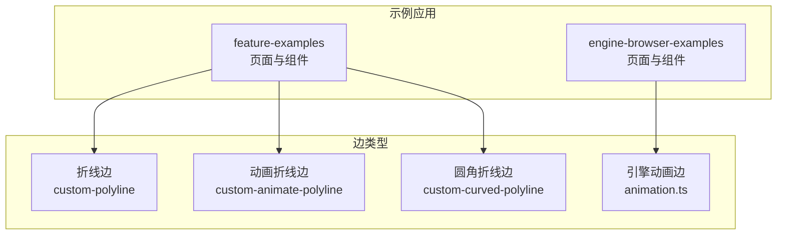
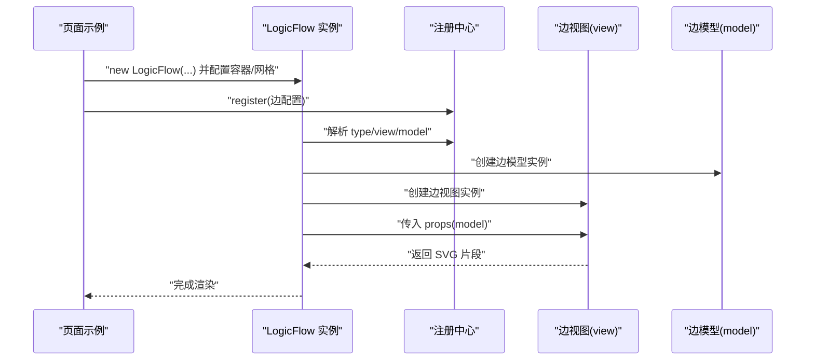
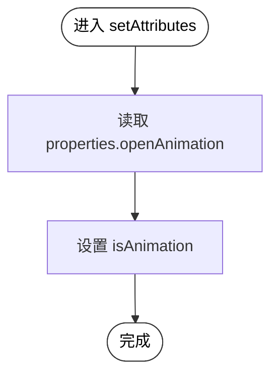
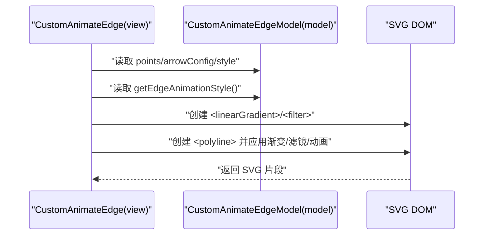
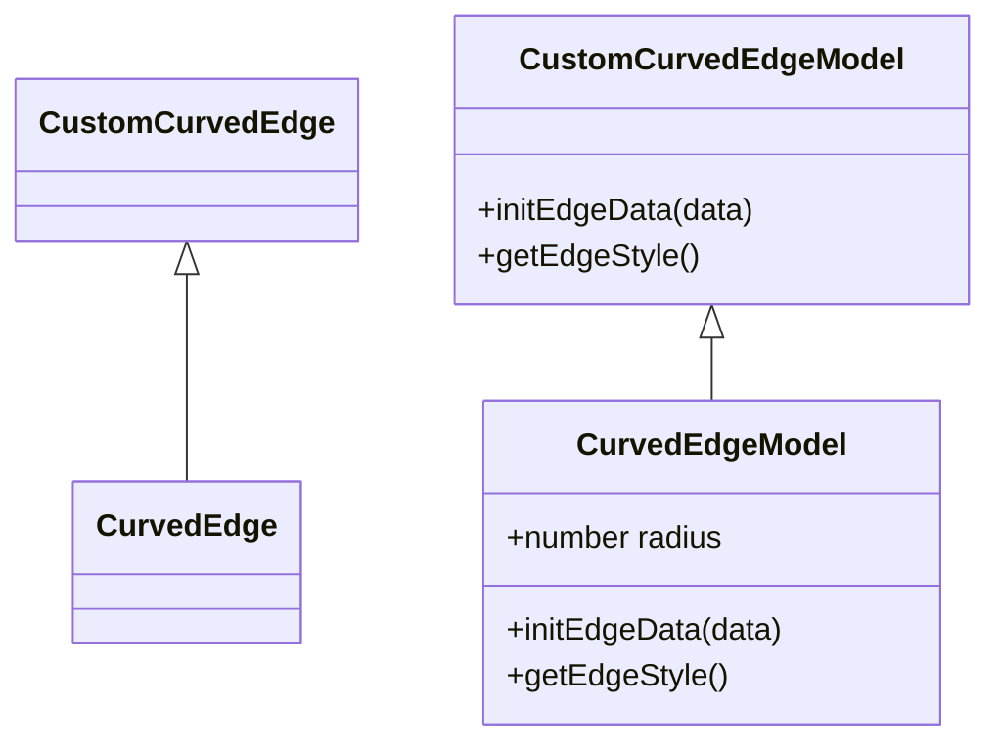
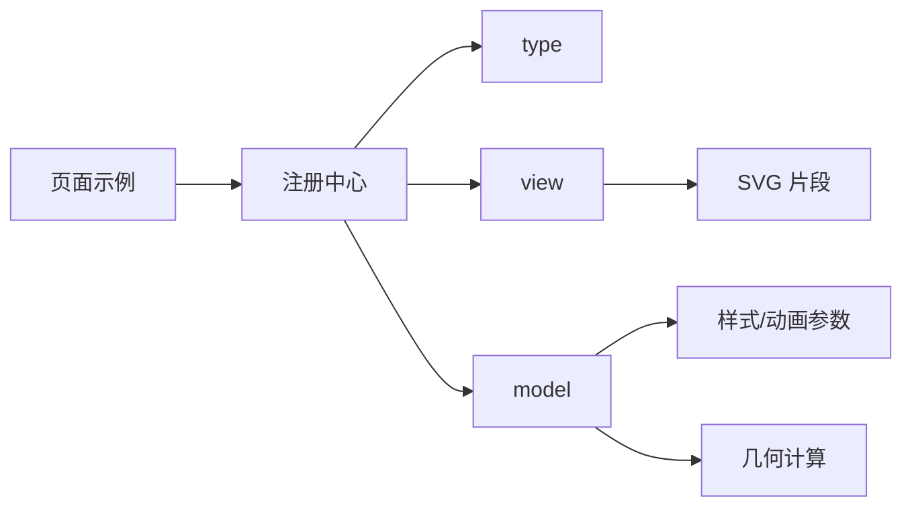

# 自定义边开发

<cite>
**本文引用的文件**
- [折线边示例（polyline）- index.tsx](file://examples/feature-examples/src/pages/edges/custom/polyline/index.tsx)
- [折线边组件（custom-polyline）- index.tsx](file://examples/feature-examples/src/components/edges/custom-polyline/index.tsx)
- [动画折线边示例（animate-polyline）- index.tsx](file://examples/feature-examples/src/pages/edges/custom/animate-polyline/index.tsx)
- [动画折线边组件（custom-animate-polyline）- index.tsx](file://examples/feature-examples/src/components/edges/custom-animate-polyline/index.tsx)
- [圆角折线边示例（curved-polyline）- index.tsx](file://examples/feature-examples/src/pages/edges/custom/curved-polyline/index.tsx)
- [圆角折线边组件（custom-curved-polyline）- index.tsx](file://examples/feature-examples/src/components/edges/custom-curved-polyline/index.tsx)
- [引擎浏览器示例：动画边（animation.ts）- animation.ts](file://examples/engine-browser-examples/src/pages/graph/edges/animation.ts)
- [折线边注册入口（graph edges index）- index.ts](file://examples/feature-examples/src/pages/graph/edges/index.ts)
- [引擎示例：动画边注册（graph edges index）- index.ts](file://examples/engine-browser-examples/src/pages/graph/edges/index.ts)
</cite>

## 目录
1. [简介](#简介)
2. [项目结构](#项目结构)
3. [核心组件](#核心组件)
4. [架构总览](#架构总览)
5. [详细组件分析](#详细组件分析)
6. [依赖关系分析](#依赖关系分析)
7. [性能考虑](#性能考虑)
8. [故障排查指南](#故障排查指南)
9. [结论](#结论)
10. [附录](#附录)

## 简介
本指南面向需要在 LogicFlow 中开发自定义边的工程师，系统讲解边的几何计算、路径生成、渲染机制、交互逻辑、样式与动画、数据模型与状态管理，并提供从基础边到动画边与自定义样式的完整开发示例。文档同时覆盖边与节点的关联机制、约束规则以及性能优化与渲染优化技巧，帮助你构建高质量、可维护的流程图编辑体验。

## 项目结构
围绕“自定义边”的示例主要集中在 feature-examples 与 engine-browser-examples 两个示例工程中：
- 折线边（polyline）：包含自定义箭头、文本位置、动画开关、右键菜单、悬停置顶等能力
- 动画折线边（animate-polyline）：基于自定义视图与 SVG 渐变、滤镜与 CSS 动画实现炫酷视觉效果
- 圆角折线边（curved-polyline）：基于 @logicflow/extension 的 CurvedEdge 实现圆角贝塞尔路径
- 引擎示例中的动画边：展示如何通过扩展模型定制动画样式

**图表来源**
- [折线边示例（polyline）- index.tsx](file://examples/feature-examples/src/pages/edges/custom/polyline/index.tsx#L1-L571)
- [动画折线边示例（animate-polyline）- index.tsx](file://examples/feature-examples/src/pages/edges/custom/animate-polyline/index.tsx#L1-L178)
- [圆角折线边示例（curved-polyline）- index.tsx](file://examples/feature-examples/src/pages/edges/custom/curved-polyline/index.tsx#L1-L234)
- [引擎浏览器示例：动画边（animation.ts）- animation.ts](file://examples/engine-browser-examples/src/pages/graph/edges/animation.ts#L1-L20)

**章节来源**
- [折线边示例（polyline）- index.tsx](file://examples/feature-examples/src/pages/edges/custom/polyline/index.tsx#L1-L571)
- [动画折线边示例（animate-polyline）- index.tsx](file://examples/feature-examples/src/pages/edges/custom/animate-polyline/index.tsx#L1-L178)
- [圆角折线边示例（curved-polyline）- index.tsx](file://examples/feature-examples/src/pages/edges/custom/curved-polyline/index.tsx#L1-L234)
- [引擎浏览器示例：动画边（animation.ts）- animation.ts](file://examples/engine-browser-examples/src/pages/graph/edges/animation.ts#L1-L20)

## 核心组件
- 折线边（PolylineEdge/PolylineEdgeModel）
  - 自定义箭头：根据 properties.arrowType 控制空心箭头、半箭头或默认实心箭头
  - 文本位置：支持 center/start/end 三种策略，动态计算文本坐标
  - 动画：通过 properties.openAnimation 控制是否启用动画
  - 样式：根据 properties.edgeWeight/highlight 动态设置线宽与颜色
  - 交互：右键菜单、悬停置顶、拖拽调整点（示例中演示了调整点的交互思路）
- 动画折线边（PolylineEdge 自定义视图）
  - 自定义渲染：重写 getEdge 返回包含渐变、滤镜与 CSS 动画的 SVG 组合
  - 文本位置：与折线边一致的文本位置策略
  - 动画：strokeDasharray 与 CSS 动画参数组合实现流动效果
- 圆角折线边（CurvedEdge/CurvedEdgeModel）
  - 基于 @logicflow/extension 的 CurvedEdge，设置半径 radius 实现圆角路径
  - 样式：统一设置线宽等基础样式
- 引擎动画边（BezierEdgeModel 扩展）
  - 通过 getEdgeAnimationStyle 定义动画方向、时长与颜色

**章节来源**
- [折线边组件（custom-polyline）- index.tsx](file://examples/feature-examples/src/components/edges/custom-polyline/index.tsx#L1-L134)
- [动画折线边组件（custom-animate-polyline）- index.tsx](file://examples/feature-examples/src/components/edges/custom-animate-polyline/index.tsx#L1-L174)
- [圆角折线边组件（custom-curved-polyline）- index.tsx](file://examples/feature-examples/src/components/edges/custom-curved-polyline/index.tsx#L1-L23)
- [引擎浏览器示例：动画边（animation.ts）- animation.ts](file://examples/engine-browser-examples/src/pages/graph/edges/animation.ts#L1-L20)

## 架构总览
下图展示了“页面 -> 注册边 -> 渲染”到“边视图/模型 -> 几何与样式 -> 交互与动画”的整体流程。

**图表来源**
- [折线边示例（polyline）- index.tsx](file://examples/feature-examples/src/pages/edges/custom/polyline/index.tsx#L156-L171)
- [动画折线边示例（animate-polyline）- index.tsx](file://examples/feature-examples/src/pages/edges/custom/animate-polyline/index.tsx#L15-L29)
- [圆角折线边示例（curved-polyline）- index.tsx](file://examples/feature-examples/src/pages/edges/custom/curved-polyline/index.tsx#L15-L29)
- [引擎浏览器示例：动画边（animation.ts）- animation.ts](file://examples/engine-browser-examples/src/pages/graph/edges/animation.ts#L15-L19)

## 详细组件分析

### 折线边（PolylineEdge）：自定义箭头、文本与动画
- 自定义箭头
  - 通过重写 getEndArrow/getStartArrow，依据 properties.arrowType 返回不同 SVG 图形
- 文本位置
  - 支持 center/start/end；当为 start/end 时，遍历 pointsList 计算首尾线段的方向与距离，再偏移得到文本坐标
- 动画与样式
  - 通过 properties.openAnimation 控制 isAnimation；getEdgeAnimationStyle 可叠加源样式
  - getEdgeStyle 根据 properties.edgeWeight/highlight 动态设置线宽与颜色
- 交互
  - 右键菜单：触发自定义事件，支持删除边
  - 悬停置顶：silentMode 下 hover 将置顶并高亮选中态
  - 调整点：示例中演示了通过事件标记调整状态并在鼠标抬起时结束调整

**图表来源**
- [折线边组件（custom-polyline）- index.tsx](file://examples/feature-examples/src/components/edges/custom-polyline/index.tsx#L107-L110)

**章节来源**
- [折线边组件（custom-polyline）- index.tsx](file://examples/feature-examples/src/components/edges/custom-polyline/index.tsx#L1-L134)
- [折线边示例（polyline）- index.tsx](file://examples/feature-examples/src/pages/edges/custom/polyline/index.tsx#L9-L37)
- [折线边示例（polyline）- index.tsx](file://examples/feature-examples/src/pages/edges/custom/polyline/index.tsx#L39-L139)

### 动画折线边（PolylineEdge 自定义视图）：渐变、滤镜与 CSS 动画
- 自定义渲染
  - 重写 getEdge：返回包含 linearGradient、filter 与 polyline 的 SVG 组合
  - 使用 strokeDasharray 与 strokeDashoffset 配合 CSS 动画实现流动感
- 文本位置
  - 与折线边一致的文本位置策略
- 动画
  - getEdgeAnimationStyle 设置 strokeDasharray 与 animationDuration

**图表来源**
- [动画折线边组件（custom-animate-polyline）- index.tsx](file://examples/feature-examples/src/components/edges/custom-animate-polyline/index.tsx#L3-L91)

**章节来源**
- [动画折线边组件（custom-animate-polyline）- index.tsx](file://examples/feature-examples/src/components/edges/custom-animate-polyline/index.tsx#L1-L174)
- [动画折线边示例（animate-polyline）- index.tsx](file://examples/feature-examples/src/pages/edges/custom/animate-polyline/index.tsx#L1-L178)

### 圆角折线边（CurvedEdge）：半径与样式
- 基于 @logicflow/extension 的 CurvedEdge
- 通过 initEdgeData 设置 radius 实现圆角路径
- getEdgeStyle 统一设置线宽等基础样式

**图表来源**
- [圆角折线边组件（custom-curved-polyline）- index.tsx](file://examples/feature-examples/src/components/edges/custom-curved-polyline/index.tsx#L1-L23)

**章节来源**
- [圆角折线边组件（custom-curved-polyline）- index.tsx](file://examples/feature-examples/src/components/edges/custom-curved-polyline/index.tsx#L1-L23)
- [圆角折线边示例（curved-polyline）- index.tsx](file://examples/feature-examples/src/pages/edges/custom/curved-polyline/index.tsx#L1-L234)

### 引擎动画边（BezierEdgeModel 扩展）：动画样式定制
- 通过扩展 BezierEdgeModel 的 getEdgeAnimationStyle
- 设置动画颜色、时长与方向

**章节来源**
- [引擎浏览器示例：动画边（animation.ts）- animation.ts](file://examples/engine-browser-examples/src/pages/graph/edges/animation.ts#L1-L20)

## 依赖关系分析
- 页面层负责创建 LogicFlow 实例、注册边配置并渲染初始数据
- 注册中心解析 type/view/model，创建对应实例
- 视图层负责将模型数据转换为 SVG 片段
- 模型层负责几何计算、样式与动画参数、交互状态

**图表来源**
- [折线边示例（polyline）- index.tsx](file://examples/feature-examples/src/pages/edges/custom/polyline/index.tsx#L156-L171)
- [动画折线边示例（animate-polyline）- index.tsx](file://examples/feature-examples/src/pages/edges/custom/animate-polyline/index.tsx#L15-L29)
- [圆角折线边示例（curved-polyline）- index.tsx](file://examples/feature-examples/src/pages/edges/custom/curved-polyline/index.tsx#L15-L29)

**章节来源**
- [折线边注册入口（graph edges index）- index.ts](file://examples/feature-examples/src/pages/graph/edges/index.ts#L1-L8)
- [引擎示例：动画边注册（graph edges index）- index.ts](file://examples/engine-browser-examples/src/pages/graph/edges/index.ts#L1-L8)

## 性能考虑
- 合理使用动画
  - 对大量边启用动画会显著增加重绘成本，建议仅对关键路径或交互态启用
  - 动画参数（如 strokeDasharray、animationDuration）应适度，避免过长或过短导致卡顿
- 复用与懒渲染
  - 将复杂 SVG（如渐变、滤镜）尽量复用，减少重复创建
  - 对不参与交互的边，避免频繁更新样式与文本位置
- 文本与标签
  - 文本位置计算基于 pointsList，建议缓存中间结果，避免每次渲染都重新解析字符串
- 事件与状态
  - 拖拽/悬停等高频事件中，尽量只更新必要字段，避免全量重绘
- 网格与缩放
  - 合理设置网格大小与缩放限制，减少不必要的重排与重绘

## 故障排查指南
- 边不显示或样式异常
  - 检查注册的 type 是否与渲染时使用的 type 一致
  - 确认 getEdgeStyle/getEdgeAnimationStyle 返回的样式对象字段正确
- 文本位置不生效
  - 确认 properties.textPosition 设置为 center/start/end
  - 检查 pointsList 是否为空或格式错误
- 动画无效
  - 确认 isAnimation 已被设置为 true（由 properties.openAnimation 控制）
  - 检查 CSS 动画参数是否被覆盖
- 交互无响应
  - 检查事件绑定与状态切换逻辑（如 isAdjusting）
  - 确认 silentMode 下的 hover 行为符合预期

## 结论
通过本指南，你可以基于 LogicFlow 快速实现多种类型的自定义边：折线、圆角折线与带动画的折线。掌握几何计算、路径生成、渲染机制、样式与动画、交互逻辑与数据模型后，即可按需扩展出满足业务场景的边组件。建议在实际项目中结合性能优化策略，确保在大规模图数据下的流畅体验。

## 附录
- 开发步骤建议
  - 明确边类型与需求：直线、折线、曲线、带箭头、带动画
  - 设计数据模型：properties 字段（如 arrowType、edgeWeight、highlight、openAnimation、textPosition）
  - 编写视图：重写 getEdge 或 getEndArrow/getStartArrow，必要时引入渐变、滤镜
  - 编写模型：实现几何计算、文本位置、样式与动画参数
  - 注册与渲染：在页面中注册边配置并渲染初始数据
- 最佳实践
  - 将通用逻辑抽象为基类或工具函数，提升复用性
  - 对高频更新的样式与文本进行缓存
  - 严格区分交互态与静止态，避免不必要的重绘
  - 为复杂边提供可配置的样式与动画参数，便于主题化与扩展