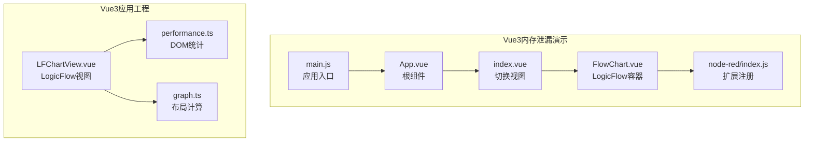
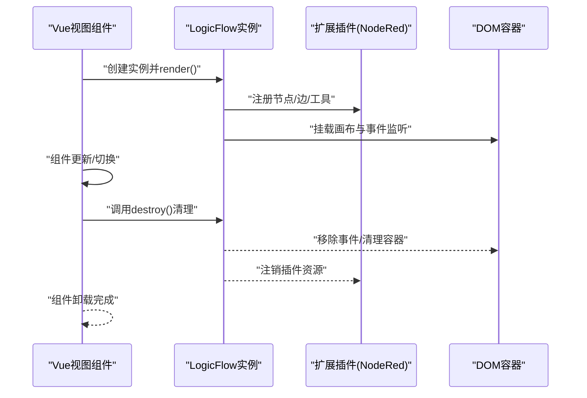
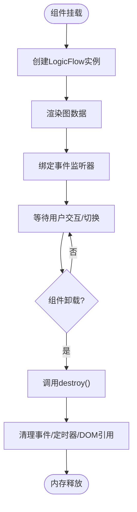
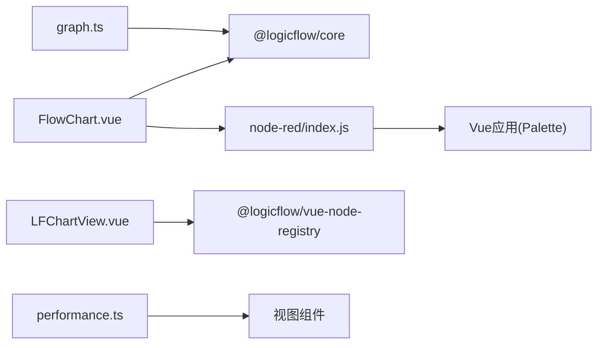

# 内存泄漏排查

<cite>
**本文引用的文件**
- [examples/vue3-memory-leak/src/App.vue](file://examples/vue3-memory-leak/src/App.vue)
- [examples/vue3-memory-leak/src/main.js](file://examples/vue3-memory-leak/src/main.js)
- [examples/vue3-memory-leak/src/components/FlowChart.vue](file://examples/vue3-memory-leak/src/components/FlowChart.vue)
- [examples/vue3-memory-leak/src/components/index.vue](file://examples/vue3-memory-leak/src/components/index.vue)
- [examples/vue3-memory-leak/package.json](file://examples/vue3-memory-leak/package.json)
- [examples/vue3-memory-leak/src/components/node-red/index.js](file://examples/vue3-memory-leak/src/components/node-red/index.js)
- [examples/vue3-app/src/views/LFChartView.vue](file://examples/vue3-app/src/views/LFChartView.vue)
- [examples/vue3-app/src/views/PerformanceNode.vue](file://examples/vue3-app/src/views/PerformanceNode.vue)
- [examples/vue3-app/src/utils/performance.ts](file://examples/vue3-app/src/utils/performance.ts)
- [examples/vue3-app/src/components/chart/graph.ts](file://examples/vue3-app/src/components/chart/graph.ts)
</cite>

## 目录
1. [引言](#引言)
2. [项目结构](#项目结构)
3. [核心组件](#核心组件)
4. [架构总览](#架构总览)
5. [详细组件分析](#详细组件分析)
6. [依赖关系分析](#依赖关系分析)
7. [性能考量](#性能考量)
8. [故障排查指南](#故障排查指南)
9. [结论](#结论)
10. [附录](#附录)

## 引言
本文件面向Vue3应用中的内存泄漏系统性排查与治理，结合仓库内提供的示例工程，总结常见泄漏场景（事件监听器未清理、定时器未清除、DOM引用未释放、LogicFlow实例未销毁等），并给出检测工具、修复策略、最佳实践与案例复盘。文档同时覆盖从开发到上线的全流程建议，帮助团队建立可执行的内存健康保障机制。

## 项目结构
本仓库包含多个示例工程，其中与内存泄漏直接相关的关键路径如下：
- Vue3内存泄漏演示工程：examples/vue3-memory-leak
- Vue3应用工程（含LogicFlow集成）：examples/vue3-app
- 关键文件分布：
  - 应用入口与根组件：examples/vue3-memory-leak/src/main.js、examples/vue3-memory-leak/src/App.vue
  - 流程图组件与切换逻辑：examples/vue3-memory-leak/src/components/FlowChart.vue、examples/vue3-memory-leak/src/components/index.vue
  - LogicFlow扩展注册与挂载：examples/vue3-memory-leak/src/components/node-red/index.js
  - Vue3应用中LogicFlow视图与清理：examples/vue3-app/src/views/LFChartView.vue
  - 性能观测与DOM统计：examples/vue3-app/src/utils/performance.ts
  - 图布局与数据处理：examples/vue3-app/src/components/chart/graph.ts

**图表来源**
- [examples/vue3-memory-leak/src/main.js](file://examples/vue3-memory-leak/src/main.js#L1-L11)
- [examples/vue3-memory-leak/src/App.vue](file://examples/vue3-memory-leak/src/App.vue#L1-L10)
- [examples/vue3-memory-leak/src/components/index.vue](file://examples/vue3-memory-leak/src/components/index.vue#L1-L21)
- [examples/vue3-memory-leak/src/components/FlowChart.vue](file://examples/vue3-memory-leak/src/components/FlowChart.vue#L1-L225)
- [examples/vue3-memory-leak/src/components/node-red/index.js](file://examples/vue3-memory-leak/src/components/node-red/index.js#L1-L35)
- [examples/vue3-app/src/views/LFChartView.vue](file://examples/vue3-app/src/views/LFChartView.vue#L1-L259)
- [examples/vue3-app/src/utils/performance.ts](file://examples/vue3-app/src/utils/performance.ts#L1-L28)
- [examples/vue3-app/src/components/chart/graph.ts](file://examples/vue3-app/src/components/chart/graph.ts#L1-L130)

**章节来源**
- [examples/vue3-memory-leak/src/main.js](file://examples/vue3-memory-leak/src/main.js#L1-L11)
- [examples/vue3-memory-leak/src/App.vue](file://examples/vue3-memory-leak/src/App.vue#L1-L10)
- [examples/vue3-memory-leak/src/components/index.vue](file://examples/vue3-memory-leak/src/components/index.vue#L1-L21)
- [examples/vue3-memory-leak/src/components/FlowChart.vue](file://examples/vue3-memory-leak/src/components/FlowChart.vue#L1-L225)
- [examples/vue3-memory-leak/src/components/node-red/index.js](file://examples/vue3-memory-leak/src/components/node-red/index.js#L1-L35)
- [examples/vue3-app/src/views/LFChartView.vue](file://examples/vue3-app/src/views/LFChartView.vue#L1-L259)
- [examples/vue3-app/src/utils/performance.ts](file://examples/vue3-app/src/utils/performance.ts#L1-L28)
- [examples/vue3-app/src/components/chart/graph.ts](file://examples/vue3-app/src/components/chart/graph.ts#L1-L130)

## 核心组件
- FlowChart.vue：负责创建LogicFlow实例、渲染流程图、绑定事件监听、并在组件卸载时调用destroy进行资源回收。
- index.vue：通过flag控制在空白容器与LogicFlow容器之间切换，用于模拟组件生命周期变化对内存的影响。
- node-red/index.js：LogicFlow扩展插件，注册节点类型、边类型以及挂载Palette工具面板。
- LFChartView.vue：在Vue3中集成LogicFlow的视图组件，包含destroy清理逻辑与onUnmounted钩子。
- performance.ts：提供DOM元素计数工具，辅助观察内存泄漏引发的DOM堆积。
- graph.ts：图布局与数据处理类，演示复杂数据结构在内存中的组织方式。

**章节来源**
- [examples/vue3-memory-leak/src/components/FlowChart.vue](file://examples/vue3-memory-leak/src/components/FlowChart.vue#L1-L225)
- [examples/vue3-memory-leak/src/components/index.vue](file://examples/vue3-memory-leak/src/components/index.vue#L1-L21)
- [examples/vue3-memory-leak/src/components/node-red/index.js](file://examples/vue3-memory-leak/src/components/node-red/index.js#L1-L35)
- [examples/vue3-app/src/views/LFChartView.vue](file://examples/vue3-app/src/views/LFChartView.vue#L1-L259)
- [examples/vue3-app/src/utils/performance.ts](file://examples/vue3-app/src/utils/performance.ts#L1-L28)
- [examples/vue3-app/src/components/chart/graph.ts](file://examples/vue3-app/src/components/chart/graph.ts#L1-L130)

## 架构总览
下图展示了Vue3应用中LogicFlow的典型生命周期与内存回收路径，强调在组件卸载阶段必须显式调用destroy，避免事件监听器、定时器、DOM引用等残留导致内存泄漏。

**图表来源**
- [examples/vue3-memory-leak/src/components/FlowChart.vue](file://examples/vue3-memory-leak/src/components/FlowChart.vue#L18-L172)
- [examples/vue3-memory-leak/src/components/node-red/index.js](file://examples/vue3-memory-leak/src/components/node-red/index.js#L11-L32)
- [examples/vue3-app/src/views/LFChartView.vue](file://examples/vue3-app/src/views/LFChartView.vue#L239-L245)

## 详细组件分析

### FlowChart.vue：LogicFlow实例与生命周期
- 创建与渲染：在mounted中初始化LogicFlow实例并render，注册事件监听器（如节点点击、空白点击等）。
- 生命周期清理：在unmounted中调用destroy，确保事件监听器、定时器、DOM引用被释放。
- 事件监听器：存在多处lf.on绑定，若未在destroy中解除，将导致内存泄漏。
- DOM引用：容器ref在组件卸载后应确保不再被外部持有。

**图表来源**
- [examples/vue3-memory-leak/src/components/FlowChart.vue](file://examples/vue3-memory-leak/src/components/FlowChart.vue#L18-L172)

**章节来源**
- [examples/vue3-memory-leak/src/components/FlowChart.vue](file://examples/vue3-memory-leak/src/components/FlowChart.vue#L1-L225)

### index.vue：视图切换与内存压力
- 通过flag在空白容器与FlowChart之间切换，验证组件卸载是否触发destroy。
- 若切换过程中未正确销毁LogicFlow实例，将导致重复创建与累积的监听器、DOM节点。

**章节来源**
- [examples/vue3-memory-leak/src/components/index.vue](file://examples/vue3-memory-leak/src/components/index.vue#L1-L21)

### node-red/index.js：扩展插件与资源管理
- 插件在构造函数中注册节点类型、默认边类型，并通过createApp挂载Palette工具。
- render阶段将Vue应用挂载到DOM Overlay上，需确保在LogicFlow销毁时同步卸载该Vue应用，避免残留组件树。

**章节来源**
- [examples/vue3-memory-leak/src/components/node-red/index.js](file://examples/vue3-memory-leak/src/components/node-red/index.js#L1-L35)

### LFChartView.vue：Vue3集成与清理
- 在onMounted中创建LinkChart实例并render，在onUnmounted中调用destroy，确保非KeepAlive模式下的资源回收。
- clearFlow按钮直接调用destroy，便于手动测试清理效果。

**章节来源**
- [examples/vue3-app/src/views/LFChartView.vue](file://examples/vue3-app/src/views/LFChartView.vue#L1-L259)

### performance.ts：DOM计数与性能观测
- 提供全局DOM元素计数工具，可用于监控组件切换、节点增删引起的DOM堆积。
- 可结合setInterval定期采样，观察是否存在持续增长趋势。

**章节来源**
- [examples/vue3-app/src/utils/performance.ts](file://examples/vue3-app/src/utils/performance.ts#L1-L28)

### graph.ts：复杂数据结构与内存占用
- 图布局算法中维护多组映射表与中间结果，注意避免重复创建大对象与循环引用。
- 建议在数据变更时及时释放中间缓存，防止长期驻留内存。

**章节来源**
- [examples/vue3-app/src/components/chart/graph.ts](file://examples/vue3-app/src/components/chart/graph.ts#L1-L130)

## 依赖关系分析
- FlowChart依赖LogicFlow核心与扩展插件，扩展插件再依赖Vue应用挂载工具。
- LFChartView依赖@logicflow/vue-node-registry提供的Teleport容器，实现Vue节点的渲染与通信。
- 性能工具performance.ts为视图层提供DOM统计能力，辅助定位泄漏源。

**图表来源**
- [examples/vue3-memory-leak/src/components/FlowChart.vue](file://examples/vue3-memory-leak/src/components/FlowChart.vue#L1-L225)
- [examples/vue3-memory-leak/src/components/node-red/index.js](file://examples/vue3-memory-leak/src/components/node-red/index.js#L1-L35)
- [examples/vue3-app/src/views/LFChartView.vue](file://examples/vue3-app/src/views/LFChartView.vue#L1-L259)
- [examples/vue3-app/src/utils/performance.ts](file://examples/vue3-app/src/utils/performance.ts#L1-L28)
- [examples/vue3-app/src/components/chart/graph.ts](file://examples/vue3-app/src/components/chart/graph.ts#L1-L130)

**章节来源**
- [examples/vue3-memory-leak/src/components/FlowChart.vue](file://examples/vue3-memory-leak/src/components/FlowChart.vue#L1-L225)
- [examples/vue3-memory-leak/src/components/node-red/index.js](file://examples/vue3-memory-leak/src/components/node-red/index.js#L1-L35)
- [examples/vue3-app/src/views/LFChartView.vue](file://examples/vue3-app/src/views/LFChartView.vue#L1-L259)
- [examples/vue3-app/src/utils/performance.ts](file://examples/vue3-app/src/utils/performance.ts#L1-L28)
- [examples/vue3-app/src/components/chart/graph.ts](file://examples/vue3-app/src/components/chart/graph.ts#L1-L130)

## 性能考量
- DOM数量监控：使用performance.ts中的DOM计数工具，定期采样观察是否存在持续增长。
- 渲染性能：在大量节点/边场景下，优先采用虚拟化、懒加载与增量更新策略。
- 事件监听器：避免在组件外持有事件回调引用；在destroy中统一解绑。
- 定时器：确保所有setInterval/setTimeout在组件卸载时被清理。
- Vue应用挂载：扩展插件中通过createApp创建的Vue应用，应在LogicFlow销毁时同步卸载，避免残留组件树。

[本节为通用指导，不直接分析具体文件，故无“章节来源”]

## 故障排查指南
- 现象识别
  - 页面长时间运行后内存持续上涨，DevTools Memory面板中堆栈快照显示对象数量不断增长。
  - DOM节点数量异常增多，尤其是与LogicFlow相关的容器与Overlay节点。
- 快速定位
  - 使用Chrome DevTools Memory面板：
    - Heap Snapshot：对比不同时间点的堆栈快照，筛选出“Retainers”链路，定位未释放的对象。
    - Allocation instrumentation on timeline：记录对象分配轨迹，配合用户操作重现泄漏路径。
  - 结合performance.ts进行实时观测，确认DOM数量是否随操作增长。
- 常见原因与修复
  - 事件监听器未解绑：在FlowChart.unmounted中确保destroy调用；检查所有lf.on绑定是否对应解除。
  - 定时器未清理：检查setInterval/setTimeout，确保在组件卸载时清理。
  - DOM引用未释放：确认容器ref在组件卸载后不再被外部持有；扩展插件挂载的Vue应用需同步卸载。
  - LogicFlow实例未销毁：确保每次组件切换或路由离开时调用destroy。
- 修复验证
  - 手动触发切换与销毁，观察Memory面板中对象数量是否回落。
  - 使用LFChartView.clearFlow或index.vue切换逻辑，验证destroy调用路径。

**章节来源**
- [examples/vue3-memory-leak/src/components/FlowChart.vue](file://examples/vue3-memory-leak/src/components/FlowChart.vue#L166-L172)
- [examples/vue3-memory-leak/src/components/index.vue](file://examples/vue3-memory-leak/src/components/index.vue#L1-L21)
- [examples/vue3-app/src/views/LFChartView.vue](file://examples/vue3-app/src/views/LFChartView.vue#L239-L245)
- [examples/vue3-app/src/utils/performance.ts](file://examples/vue3-app/src/utils/performance.ts#L1-L28)

## 结论
内存泄漏在Vue3+LogicFlow场景中主要由未清理的事件监听器、定时器、DOM引用与LogicFlow实例未销毁引起。通过规范的生命周期管理（mounted/render、unmounted/destroy）、完善的事件解绑与定时器清理、以及扩展插件的Vue应用同步卸载，可显著降低泄漏风险。结合DevTools Memory面板与DOM计数工具，形成“观测—定位—修复—验证”的闭环，确保应用长期稳定运行。

[本节为总结性内容，不直接分析具体文件，故无“章节来源”]

## 附录

### 附录A：内存泄漏检测工具与方法
- Chrome DevTools Memory面板
  - Heap Snapshot：捕获堆栈快照，比较不同时间点的对象分布，查找未释放对象。
  - Allocation instrumentation on timeline：记录对象分配轨迹，辅助复现泄漏路径。
- DOM统计工具
  - 使用performance.ts中的DOM计数方法，定期采样观察DOM数量变化。
- Vue3应用入口与根组件
  - 确认应用入口正确挂载根组件，避免重复挂载导致的实例叠加。

**章节来源**
- [examples/vue3-memory-leak/src/main.js](file://examples/vue3-memory-leak/src/main.js#L1-L11)
- [examples/vue3-memory-leak/src/App.vue](file://examples/vue3-memory-leak/src/App.vue#L1-L10)
- [examples/vue3-app/src/utils/performance.ts](file://examples/vue3-app/src/utils/performance.ts#L1-L28)

### 附录B：LogicFlow实例导致的内存泄漏识别与修复
- 识别特征
  - 组件切换频繁但内存不降：可能因未调用destroy导致实例与事件残留。
  - 扩展插件挂载的Vue应用未卸载：Palette等工具面板对应的Vue实例未被销毁。
- 修复步骤
  - 在FlowChart.unmounted中调用destroy。
  - 在扩展插件中，LogicFlow销毁时同步卸载Palette等Vue应用。
  - 在LFChartView中确保onUnmounted与按钮clearFlow均调用destroy。

**章节来源**
- [examples/vue3-memory-leak/src/components/FlowChart.vue](file://examples/vue3-memory-leak/src/components/FlowChart.vue#L166-L172)
- [examples/vue3-memory-leak/src/components/node-red/index.js](file://examples/vue3-memory-leak/src/components/node-red/index.js#L22-L32)
- [examples/vue3-app/src/views/LFChartView.vue](file://examples/vue3-app/src/views/LFChartView.vue#L239-L245)

### 附录C：预防最佳实践与代码审查要点
- 生命周期管理
  - 每次创建LogicFlow实例后，务必在组件卸载时调用destroy。
  - 在扩展插件中，确保在LogicFlow销毁时同步卸载所有挂载的Vue应用。
- 事件与定时器
  - 统一在组件卸载时解绑所有事件监听器与清理定时器。
- DOM引用
  - 避免将容器ref或事件回调保存到组件外作用域；确保组件卸载后不再持有引用。
- 代码审查清单
  - 是否在unmounted/beforeUnmount中调用destroy？
  - 是否存在未解绑的window.addEventListener？
  - 是否存在未清理的setInterval/setTimeout？
  - 扩展插件是否在LogicFlow销毁时卸载Vue应用？

[本节为通用指导，不直接分析具体文件，故无“章节来源”]