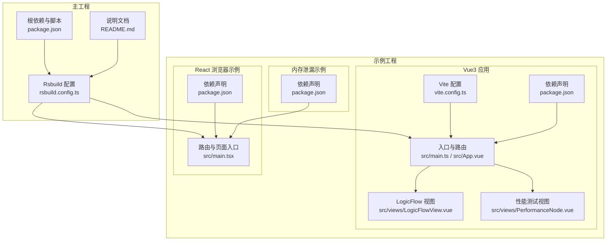
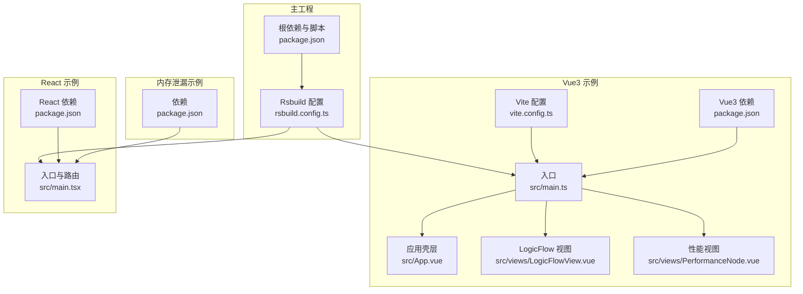
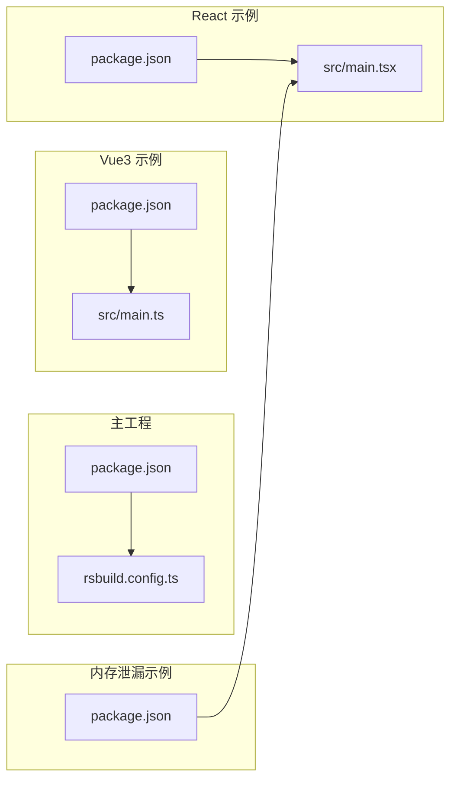

# 常见问题解答

<cite>
**本文引用的文件**
- [package.json](file://package.json)
- [README.md](file://README.md)
- [rsbuild.config.ts](file://rsbuild.config.ts)
- [examples/vue3-app/package.json](file://examples/vue3-app/package.json)
- [examples/engine-browser-examples/package.json](file://examples/engine-browser-examples/package.json)
- [examples/vue3-app/src/main.ts](file://examples/vue3-app/src/main.ts)
- [examples/vue3-app/src/App.vue](file://examples/vue3-app/src/App.vue)
- [examples/vue3-app/vite.config.ts](file://examples/vue3-app/vite.config.ts)
- [examples/vue3-app/src/views/LogicFlowView.vue](file://examples/vue3-app/src/views/LogicFlowView.vue)
- [examples/vue3-app/src/views/PerformanceNode.vue](file://examples/vue3-app/src/views/PerformanceNode.vue)
- [examples/engine-browser-examples/src/main.tsx](file://examples/engine-browser-examples/src/main.tsx)
- [examples/vue3-memory-leak/package.json](file://examples/vue3-memory-leak/package.json)
</cite>

## 目录
1. [简介](#简介)
2. [项目结构](#项目结构)
3. [核心组件](#核心组件)
4. [架构总览](#架构总览)
5. [详细组件分析](#详细组件分析)
6. [依赖关系分析](#依赖关系分析)
7. [性能注意事项](#性能注意事项)
8. [故障排查指南](#故障排查指南)
9. [结论](#结论)
10. [附录](#附录)

## 简介
本FAQ面向使用 Rsbuild + LogicFlow 的开发者，聚焦安装依赖失败、构建配置错误、运行时异常等高频问题，并结合 Vue3 组件开发、LogicFlow 引擎使用与 BPMN 标准兼容性场景，提供可操作的排障步骤与最佳实践，帮助快速定位与解决问题。

## 项目结构
该仓库包含一个基于 Rsbuild 的主工程与多个示例工程，涵盖 Vue3 应用、React 浏览器示例以及内存泄漏演示。关键目录与职责如下：
- 主工程与脚手架：Rsbuild 配置、依赖管理、开发/预览命令
- 示例工程
  - Vue3 应用：LogicFlow 在 Vue3 中的集成、主题与节点注册、性能测试视图
  - React 浏览器示例：LogicFlow 在浏览器环境下的扩展能力演示
  - 内存泄漏示例：用于验证特定插件或配置导致的内存问题

**图表来源**
- [rsbuild.config.ts](file://rsbuild.config.ts#L1-L30)
- [package.json](file://package.json#L1-L45)
- [README.md](file://README.md#L1-L37)
- [examples/vue3-app/src/main.ts](file://examples/vue3-app/src/main.ts#L1-L16)
- [examples/vue3-app/src/App.vue](file://examples/vue3-app/src/App.vue#L1-L121)
- [examples/vue3-app/vite.config.ts](file://examples/vue3-app/vite.config.ts#L1-L15)
- [examples/vue3-app/src/views/LogicFlowView.vue](file://examples/vue3-app/src/views/LogicFlowView.vue#L1-L537)
- [examples/vue3-app/src/views/PerformanceNode.vue](file://examples/vue3-app/src/views/PerformanceNode.vue#L1-L270)
- [examples/engine-browser-examples/src/main.tsx](file://examples/engine-browser-examples/src/main.tsx#L1-L78)
- [examples/engine-browser-examples/package.json](file://examples/engine-browser-examples/package.json#L1-L39)
- [examples/vue3-memory-leak/package.json](file://examples/vue3-memory-leak/package.json#L1-L24)

**章节来源**
- [rsbuild.config.ts](file://rsbuild.config.ts#L1-L30)
- [package.json](file://package.json#L1-L45)
- [README.md](file://README.md#L1-L37)

## 核心组件
- 构建工具链
  - Rsbuild：主工程使用 Rsbuild 进行开发、构建与预览
  - Vite：Vue3 示例工程使用 Vite 作为构建与开发服务器
- LogicFlow 引擎与扩展
  - @logicflow/core：核心引擎
  - @logicflow/extension：扩展能力（如菜单、选择、迷你地图、动态分组等）
  - @logicflow/vue-node-registry：Vue 节点注册与 Teleport 容器
  - @logicflow/layout：布局算法（可选）
- UI 与工具
  - Element Plus：Vue3 生态 UI 组件库
  - Lodash-es：常用工具函数
  - Axios、Dayjs、Pinia 等：通用工具与状态管理

**章节来源**
- [package.json](file://package.json#L14-L27)
- [examples/vue3-app/package.json](file://examples/vue3-app/package.json#L16-L29)
- [examples/engine-browser-examples/package.json](file://examples/engine-browser-examples/package.json#L12-L24)

## 架构总览
下图展示了主工程与示例工程之间的关系，以及关键依赖与入口文件的映射。

**图表来源**
- [rsbuild.config.ts](file://rsbuild.config.ts#L1-L30)
- [package.json](file://package.json#L1-L45)
- [examples/vue3-app/src/main.ts](file://examples/vue3-app/src/main.ts#L1-L16)
- [examples/vue3-app/src/App.vue](file://examples/vue3-app/src/App.vue#L1-L121)
- [examples/vue3-app/src/views/LogicFlowView.vue](file://examples/vue3-app/src/views/LogicFlowView.vue#L1-L537)
- [examples/vue3-app/src/views/PerformanceNode.vue](file://examples/vue3-app/src/views/PerformanceNode.vue#L1-L270)
- [examples/vue3-app/vite.config.ts](file://examples/vue3-app/vite.config.ts#L1-L15)
- [examples/engine-browser-examples/src/main.tsx](file://examples/engine-browser-examples/src/main.tsx#L1-L78)
- [examples/engine-browser-examples/package.json](file://examples/engine-browser-examples/package.json#L1-L39)
- [examples/vue3-memory-leak/package.json](file://examples/vue3-memory-leak/package.json#L1-L24)

## 详细组件分析

### Vue3 组件开发问题
- 问题：LogicFlow 节点无法渲染或样式缺失
  - 排查要点
    - 确认已引入 LogicFlow 样式与 UI 组件库样式
    - 确认容器尺寸与可见性
    - 确认在 onMounted 后初始化 LogicFlow 并调用 render
  - 解决步骤
    - 在入口处引入样式：参考示例入口
    - 在视图组件中确保容器存在且有高度
    - 使用 register 注册自定义节点/边后，再 render
  - 参考路径
    - [示例入口与样式引入](file://examples/vue3-app/src/main.ts#L1-L16)
    - [LogicFlow 视图初始化与注册](file://examples/vue3-app/src/views/LogicFlowView.vue#L119-L254)

- 问题：Vue Teleport 容器未显示或报错
  - 排查要点
    - 确认通过 getTeleport 获取 Teleport 容器并在模板中使用
    - 确认 flowId 正确传递给 Teleport 容器
  - 解决步骤
    - 在视图中获取 Teleport 容器并绑定到模板
    - 确保 LogicFlow 实例在 graph:rendered 事件后拿到 flowId
  - 参考路径
    - [Teleport 容器使用](file://examples/vue3-app/src/views/LogicFlowView.vue#L93-L94)
    - [graph:rendered 事件设置 flowId](file://examples/vue3-app/src/views/LogicFlowView.vue#L200-L202)

- 问题：自定义节点组件不更新或属性无效
  - 排查要点
    - 确认 properties 传入正确
    - 确认节点组件内部读取与响应式更新逻辑
  - 解决步骤
    - 在 addNode 时传入 properties
    - 如需运行时修改，使用 setProperties 或 setNodeType
  - 参考路径
    - [添加自定义节点与属性](file://examples/vue3-app/src/views/LogicFlowView.vue#L208-L241)
    - [运行时修改节点属性](file://examples/vue3-app/src/views/LogicFlowView.vue#L286-L333)

- 问题：键盘快捷键冲突或未生效
  - 排查要点
    - 确认 keyboard.enabled 为 true
    - 确认未被其他交互覆盖（如输入框聚焦）
  - 解决步骤
    - 在初始化 LogicFlow 时开启 keyboard.enabled
    - 将快捷键绑定在合适的上下文（如全局或焦点元素）
  - 参考路径
    - [键盘快捷键配置](file://examples/vue3-app/src/views/LogicFlowView.vue#L143-L162)

**章节来源**
- [examples/vue3-app/src/main.ts](file://examples/vue3-app/src/main.ts#L1-L16)
- [examples/vue3-app/src/views/LogicFlowView.vue](file://examples/vue3-app/src/views/LogicFlowView.vue#L93-L333)

### LogicFlow 引擎使用问题
- 问题：初始化失败或容器为空
  - 排查要点
    - 确认 container 存在且非空
    - 确认在 DOM 准备好后再初始化
  - 解决步骤
    - 使用 onMounted 或 nextTick 确保 DOM 已挂载
    - 传入正确的容器引用
  - 参考路径
    - [Vue 初始化容器](file://examples/vue3-app/src/views/LogicFlowView.vue#L119-L126)

- 问题：主题与样式不生效
  - 排查要点
    - 确认 setTheme 调用顺序与样式文件加载顺序
    - 确认未被后续样式覆盖
  - 解决步骤
    - 在注册元素前调用 setTheme
    - 检查样式优先级与作用域
  - 参考路径
    - [主题设置](file://examples/vue3-app/src/views/LogicFlowView.vue#L186-L188)

- 问题：边动画无法开启或关闭
  - 排查要点
    - 确认边存在且有 id
    - 确认边类型支持动画
  - 解决步骤
    - 遍历 getGraphData().edges 并对每个边调用 open/closeEdgeAnimation
  - 参考路径
    - [边动画控制](file://examples/vue3-app/src/views/LogicFlowView.vue#L334-L355)

**章节来源**
- [examples/vue3-app/src/views/LogicFlowView.vue](file://examples/vue3-app/src/views/LogicFlowView.vue#L119-L188)
- [examples/vue3-app/src/views/LogicFlowView.vue](file://examples/vue3-app/src/views/LogicFlowView.vue#L334-L355)

### BPMN 标准兼容性问题
- 问题：导入 BPMN XML 后节点/连线不匹配
  - 排查要点
    - 确认使用的扩展包版本与示例一致
    - 确认 XML 结构符合扩展期望
  - 解决步骤
    - 使用扩展提供的解析器与适配器
    - 对缺失的节点类型进行映射或回退
  - 参考路径
    - [React 示例中的 BPMN 页面入口](file://examples/engine-browser-examples/src/main.tsx#L10-L13)

- 问题：BPMN 图标或样式不显示
  - 排查要点
    - 确认图标资源路径正确
    - 确认样式文件已引入
  - 解决步骤
    - 检查资源打包与别名配置
    - 确保样式在入口处引入
  - 参考路径
    - [React 示例入口样式引入](file://examples/engine-browser-examples/src/main.tsx#L18-L18)

**章节来源**
- [examples/engine-browser-examples/src/main.tsx](file://examples/engine-browser-examples/src/main.tsx#L10-L18)

### 性能与内存问题
- 问题：页面卡顿或内存持续增长
  - 排查要点
    - 观察 DOM 元素数量与渲染时间
    - 检查是否存在频繁重绘或未释放的监听器
  - 解决步骤
    - 使用性能标记测量渲染耗时
    - 控制一次性渲染节点数量，采用分批渲染
    - 清理事件监听与定时器
  - 参考路径
    - [性能视图与 DOM 计数](file://examples/vue3-app/src/views/PerformanceNode.vue#L38-L98)
    - [渲染时间测量与通知](file://examples/vue3-app/src/views/PerformanceNode.vue#L136-L151)

- 问题：vite-plugin-vue-devtools 导致内存溢出
  - 排查要点
    - 确认是否启用了相关插件
    - 确认全局缓冲区是否异常增长
  - 解决步骤
    - 在开发配置中禁用或移除可能导致问题的插件
  - 参考路径
    - [Vite 配置注释说明](file://examples/vue3-app/vite.config.ts#L5-L6)

**章节来源**
- [examples/vue3-app/src/views/PerformanceNode.vue](file://examples/vue3-app/src/views/PerformanceNode.vue#L38-L151)
- [examples/vue3-app/vite.config.ts](file://examples/vue3-app/vite.config.ts#L5-L6)

## 依赖关系分析
- 主工程依赖
  - Rsbuild 核心与插件：babel、vue、vue-jsx、less
  - LogicFlow 生态：core、extension、layout、vue-node-registry
  - UI 与工具：Element Plus、Axios、Dayjs、Lodash-es、Pinia、Vue Router
- 示例工程依赖
  - Vue3 示例：Vite、Vue、Element Plus、@logicflow/*、TailwindCSS、ECharts
  - React 示例：React、React Router、Ant Design、@logicflow/*
  - 内存泄漏示例：简化版依赖，便于复现问题

**图表来源**
- [package.json](file://package.json#L1-L45)
- [rsbuild.config.ts](file://rsbuild.config.ts#L1-L30)
- [examples/vue3-app/package.json](file://examples/vue3-app/package.json#L1-L52)
- [examples/engine-browser-examples/package.json](file://examples/engine-browser-examples/package.json#L1-L39)
- [examples/vue3-memory-leak/package.json](file://examples/vue3-memory-leak/package.json#L1-L24)

**章节来源**
- [package.json](file://package.json#L14-L27)
- [examples/vue3-app/package.json](file://examples/vue3-app/package.json#L16-L29)
- [examples/engine-browser-examples/package.json](file://examples/engine-browser-examples/package.json#L12-L24)

## 性能注意事项
- 控制渲染规模
  - 分批添加节点与边，避免一次性大量 DOM 操作
  - 使用 fitView/translateCenter 等方法优化初始可视范围
- 监控与度量
  - 使用 performance.mark/performance.measure 记录渲染耗时
  - 实时统计 DOM 元素数量，及时发现异常增长
- 交互优化
  - 合理使用 grid、background、theme 等配置降低重绘成本
  - 避免在事件回调中执行高开销操作

[本节为通用建议，无需具体文件引用]

## 故障排查指南

### 安装依赖失败
- 症状
  - pnpm install 报错或部分依赖安装失败
- 常见原因
  - 网络不稳定或镜像源不可用
  - Node 版本与依赖不兼容
  - 缓存损坏
- 解决步骤
  - 切换稳定镜像源并重试安装
  - 升级/降级 Node 版本至兼容范围
  - 清理缓存后重试安装
- 参考路径
  - [根脚本与依赖声明](file://package.json#L6-L12)
  - [Vue3 示例脚本](file://examples/vue3-app/package.json#L6-L15)
  - [React 示例脚本](file://examples/engine-browser-examples/package.json#L6-L11)

**章节来源**
- [package.json](file://package.json#L6-L12)
- [examples/vue3-app/package.json](file://examples/vue3-app/package.json#L6-L15)
- [examples/engine-browser-examples/package.json](file://examples/engine-browser-examples/package.json#L6-L11)

### 构建配置错误
- 症状
  - Rsbuild dev/build 报错或产物异常
- 常见原因
  - 插件顺序或参数不正确
  - 路径别名未正确配置
  - Less/Vue/JSX 插件缺失
- 解决步骤
  - 按默认配置启用 babel、vue、vue-jsx、less 插件
  - 检查路径别名为 @ 指向 src
  - 确认开发服务器 open=false 符合预期
- 参考路径
  - [Rsbuild 插件与别名配置](file://rsbuild.config.ts#L10-L29)

**章节来源**
- [rsbuild.config.ts](file://rsbuild.config.ts#L10-L29)

### 运行时异常
- 症状
  - 页面空白、LogicFlow 不显示、控制台报错
- 常见原因
  - 样式未引入或加载顺序错误
  - 容器不存在或未设置高度
  - 未在 onMounted 后初始化
- 解决步骤
  - 在入口引入 LogicFlow 与 UI 组件样式
  - 确保容器有明确尺寸
  - 在组件生命周期内初始化并调用 render
- 参考路径
  - [Vue3 样式引入](file://examples/vue3-app/src/main.ts#L1-L4)
  - [Vue3 容器初始化](file://examples/vue3-app/src/views/LogicFlowView.vue#L119-L126)

**章节来源**
- [examples/vue3-app/src/main.ts](file://examples/vue3-app/src/main.ts#L1-L4)
- [examples/vue3-app/src/views/LogicFlowView.vue](file://examples/vue3-app/src/views/LogicFlowView.vue#L119-L126)

### Vue3 组件开发问题
- 症状
  - Teleport 容器未显示、节点属性不更新
- 常见原因
  - 未正确获取 Teleport 容器或未传递 flowId
  - 未在注册后立即 render
- 解决步骤
  - 使用 getTeleport 获取容器并在模板中渲染
  - 在 graph:rendered 事件后设置 flowId
  - 使用 setProperties/setNodeType 更新节点
- 参考路径
  - [Teleport 容器与 flowId](file://examples/vue3-app/src/views/LogicFlowView.vue#L93-L94)
  - [graph:rendered 事件](file://examples/vue3-app/src/views/LogicFlowView.vue#L200-L202)
  - [运行时属性更新](file://examples/vue3-app/src/views/LogicFlowView.vue#L286-L333)

**章节来源**
- [examples/vue3-app/src/views/LogicFlowView.vue](file://examples/vue3-app/src/views/LogicFlowView.vue#L93-L94)
- [examples/vue3-app/src/views/LogicFlowView.vue](file://examples/vue3-app/src/views/LogicFlowView.vue#L200-L202)
- [examples/vue3-app/src/views/LogicFlowView.vue](file://examples/vue3-app/src/views/LogicFlowView.vue#L286-L333)

### LogicFlow 引擎使用问题
- 症状
  - 主题不生效、边动画异常
- 常见原因
  - setTheme 调用时机不当
  - 未正确获取边 id 或类型不支持动画
- 解决步骤
  - 在注册元素前调用 setTheme
  - 遍历边集合并对每条边开启/关闭动画
- 参考路径
  - [主题设置](file://examples/vue3-app/src/views/LogicFlowView.vue#L186-L188)
  - [边动画控制](file://examples/vue3-app/src/views/LogicFlowView.vue#L334-L355)

**章节来源**
- [examples/vue3-app/src/views/LogicFlowView.vue](file://examples/vue3-app/src/views/LogicFlowView.vue#L186-L188)
- [examples/vue3-app/src/views/LogicFlowView.vue](file://examples/vue3-app/src/views/LogicFlowView.vue#L334-L355)

### BPMN 标准兼容性问题
- 症状
  - BPMN 导入后节点/连线不匹配、图标不显示
- 常见原因
  - 扩展包版本不一致或 XML 结构不符合
  - 样式或资源路径未正确引入
- 解决步骤
  - 使用扩展提供的解析器与适配器
  - 检查资源路径与样式引入顺序
- 参考路径
  - [BPMN 页面入口](file://examples/engine-browser-examples/src/main.tsx#L10-L13)
  - [入口样式引入](file://examples/engine-browser-examples/src/main.tsx#L18-L18)

**章节来源**
- [examples/engine-browser-examples/src/main.tsx](file://examples/engine-browser-examples/src/main.tsx#L10-L13)
- [examples/engine-browser-examples/src/main.tsx](file://examples/engine-browser-examples/src/main.tsx#L18-L18)

### 性能与内存问题
- 症状
  - 页面卡顿、内存持续增长、长时间渲染
- 常见原因
  - 大量 DOM 元素、频繁重绘、未清理监听器
  - 开发插件导致的全局缓冲区增长
- 解决步骤
  - 使用性能标记测量渲染耗时
  - 控制一次性渲染规模，分批处理
  - 清理事件监听与定时器
  - 禁用可能引发内存问题的开发插件
- 参考路径
  - [性能视图与 DOM 计数](file://examples/vue3-app/src/views/PerformanceNode.vue#L38-L98)
  - [渲染时间测量](file://examples/vue3-app/src/views/PerformanceNode.vue#L136-L151)
  - [Vite 配置注释说明](file://examples/vue3-app/vite.config.ts#L5-L6)

**章节来源**
- [examples/vue3-app/src/views/PerformanceNode.vue](file://examples/vue3-app/src/views/PerformanceNode.vue#L38-L151)
- [examples/vue3-app/vite.config.ts](file://examples/vue3-app/vite.config.ts#L5-L6)

## 结论
通过本 FAQ，开发者可以系统地定位与解决安装、构建、运行时及业务层面的常见问题。建议在日常开发中：
- 严格遵循示例工程的样式引入与初始化流程
- 使用性能监控工具持续观察渲染与内存表现
- 在团队内统一构建与依赖策略，减少环境差异带来的问题

[本节为总结性内容，无需具体文件引用]

## 附录
- 快速检查清单
  - 依赖安装：使用稳定镜像源，必要时清理缓存
  - 构建配置：确认 Rsbuild 插件与别名配置正确
  - 运行时：确保样式引入顺序与容器尺寸
  - Vue3：在 onMounted 后初始化，正确使用 Teleport 容器
  - LogicFlow：先 setTheme 再注册元素，再 render
  - BPMN：使用扩展解析器，检查资源与样式路径
  - 性能：分批渲染、监控渲染耗时、清理监听器

[本节为通用建议，无需具体文件引用]