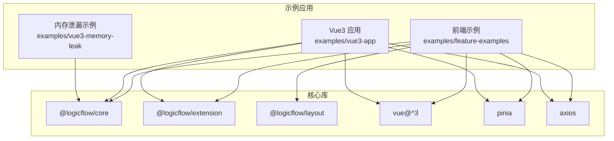
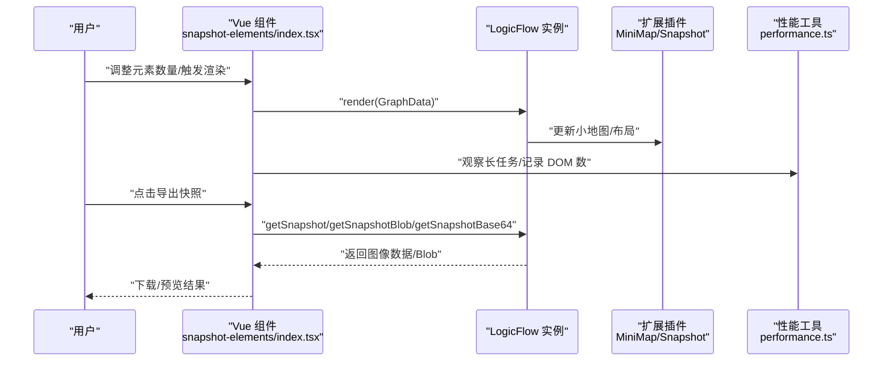
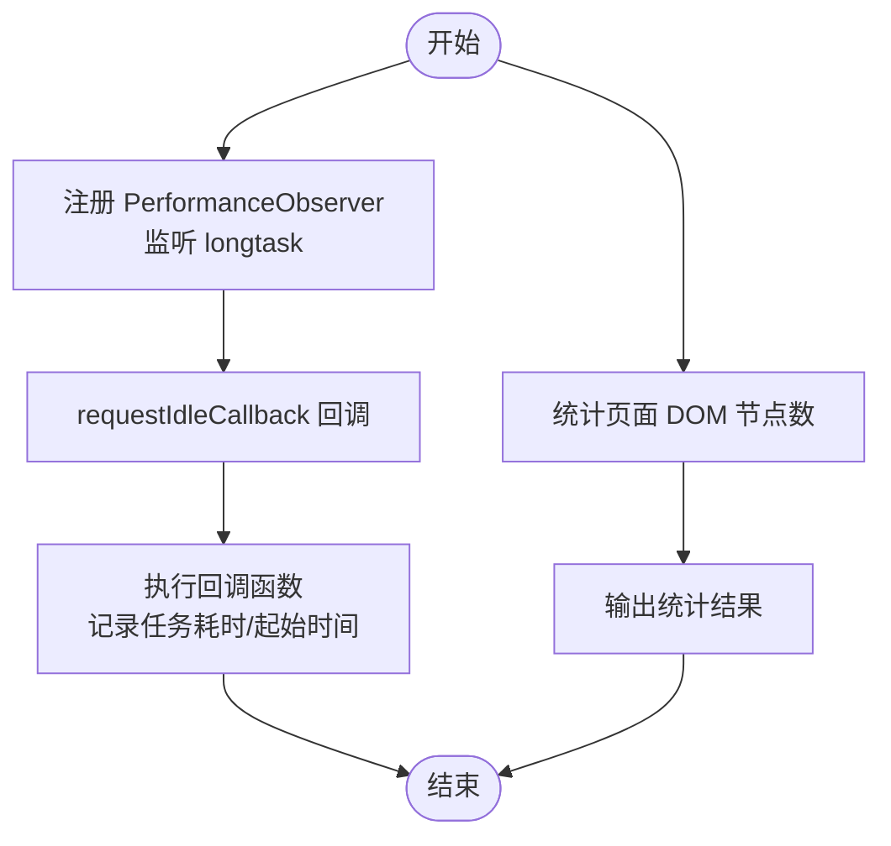
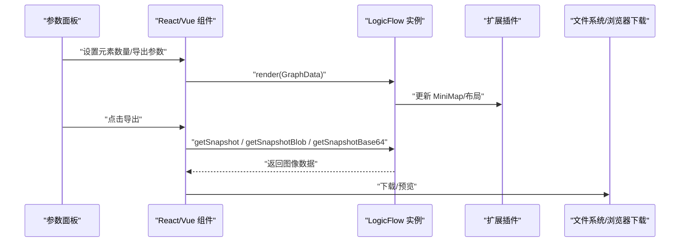
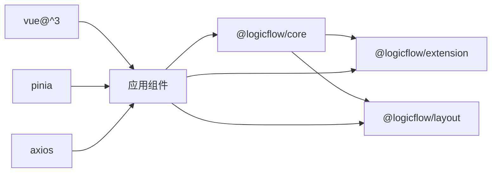

# 性能问题诊断

<cite>
**本文引用的文件**
- [package.json](file://package.json)
- [README.md](file://README.md)
- [performance.ts](file://examples/vue3-app/src/utils/performance.ts)
- [snapshot-elements/index.tsx](file://examples/feature-examples/src/pages/performance/snapshot-elements/index.tsx)
- [vue3-memory-leak 示例](file://examples/vue3-memory-leak/)
</cite>

## 目录
1. [引言](#引言)
2. [项目结构](#项目结构)
3. [核心组件](#核心组件)
4. [架构总览](#架构总览)
5. [详细组件分析](#详细组件分析)
6. [依赖关系分析](#依赖关系分析)
7. [性能考量](#性能考量)
8. [故障排查指南](#故障排查指南)
9. [结论](#结论)
10. [附录](#附录)

## 引言
本文件面向流程图应用（基于 LogicFlow）的性能问题诊断与优化，系统性梳理渲染性能、内存使用、网络请求等维度的识别与分析方法，并结合仓库内现有示例给出可操作的监控手段、优化策略与测试实践。文档同时提供可视化流程图与序列图，帮助非专业读者快速理解关键路径与瓶颈定位思路。

## 项目结构
该项目采用多示例工程组织方式，核心依赖集中在 Vue 生态与 LogicFlow 生态。与性能诊断直接相关的关键位置包括：
- 通用性能工具：examples/vue3-app/src/utils/performance.ts
- 性能测试页面：examples/feature-examples/src/pages/performance/snapshot-elements/index.tsx
- 内存泄漏示例：examples/vue3-memory-leak/

图表来源
- [package.json](file://package.json#L14-L27)
- [README.md](file://README.md#L1-L37)

章节来源
- [package.json](file://package.json#L14-L27)
- [README.md](file://README.md#L1-L37)

## 核心组件
- 渲染与交互层：LogicFlow 核心与扩展（MiniMap、Snapshot 等）
- 视图层：Vue 组件封装与状态管理（Pinia）
- 工具与监控：自定义性能观测工具（长任务、DOM 数量）
- 示例与测试：性能测试页面（元素数量与快照导出）、内存泄漏示例

章节来源
- [package.json](file://package.json#L14-L27)
- [performance.ts](file://examples/vue3-app/src/utils/performance.ts#L1-L28)
- [snapshot-elements/index.tsx](file://examples/feature-examples/src/pages/performance/snapshot-elements/index.tsx#L1-L445)

## 架构总览
下图展示从用户操作到渲染与导出的关键调用链路，以及性能观测点：

图表来源
- [snapshot-elements/index.tsx](file://examples/feature-examples/src/pages/performance/snapshot-elements/index.tsx#L70-L98)
- [snapshot-elements/index.tsx](file://examples/feature-examples/src/pages/performance/snapshot-elements/index.tsx#L210-L278)
- [performance.ts](file://examples/vue3-app/src/utils/performance.ts#L17-L27)

## 详细组件分析

### 性能观测工具（长任务与 DOM 数）
- 长任务观测：通过 PerformanceObserver 监听 longtask，结合 requestIdleCallback 在空闲时回调，便于在主线程阻塞时进行告警与日志采集。
- DOM 数统计：通过遍历 document.querySelectorAll('*') 统计页面节点数，辅助判断渲染体量与潜在冗余节点。

图表来源
- [performance.ts](file://examples/vue3-app/src/utils/performance.ts#L17-L27)
- [performance.ts](file://examples/vue3-app/src/utils/performance.ts#L5-L5)

章节来源
- [performance.ts](file://examples/vue3-app/src/utils/performance.ts#L1-L28)

### 快照导出与渲染压力测试页面
- 页面职责：通过滑块控制元素数量，动态生成大量节点与边；支持切换小地图显示、导出为不同格式（PNG/JPEG/WebP/GIF/SVG），并可指定宽高、背景色、padding、质量与局部渲染。
- 关键路径：render -> 小地图更新 -> 导出快照（getSnapshot/getSnapshotBlob/getSnapshotBase64）。
- 性能指标建议：记录渲染耗时、导出耗时、内存峰值、长任务占比、DOM 数变化。

图表来源
- [snapshot-elements/index.tsx](file://examples/feature-examples/src/pages/performance/snapshot-elements/index.tsx#L103-L160)
- [snapshot-elements/index.tsx](file://examples/feature-examples/src/pages/performance/snapshot-elements/index.tsx#L210-L278)

章节来源
- [snapshot-elements/index.tsx](file://examples/feature-examples/src/pages/performance/snapshot-elements/index.tsx#L1-L445)

### 内存泄漏示例（参考）
- 该示例展示了复杂流程图场景下的内存管理注意事项，可用于验证组件卸载、事件解绑、定时器清理等是否正确实现，避免内存泄漏导致的性能退化。
- 建议在大型流程图中对节点/边的生命周期进行严格管理，确保在切换视图或销毁实例时释放资源。

章节来源
- [vue3-memory-leak 示例](file://examples/vue3-memory-leak/)

## 依赖关系分析
- 逻辑图核心：@logicflow/core 提供渲染与交互能力；@logicflow/extension 提供 MiniMap、Snapshot 等扩展；@logicflow/layout 提供布局算法。
- 前端框架：Vue 3 作为视图层，配合 Pinia 进行状态管理；Axios 用于网络请求。
- 开发与构建：Rsbuild 作为构建工具链，配合 Vue/JSX/Less 插件。

图表来源
- [package.json](file://package.json#L14-L27)

章节来源
- [package.json](file://package.json#L14-L27)

## 性能考量
以下为针对流程图应用的通用优化策略与实践建议，结合仓库现有组件与示例可落地实施：

- 渲染性能
  - 虚拟滚动/可视区域裁剪：仅渲染可视区域内的节点与边，减少 DOM 数与重绘范围。
  - 批处理更新：合并多次 render 调用，使用 requestAnimationFrame 或微任务队列降低主线程压力。
  - 分层渲染：将静态背景与动态节点分离，利用 Canvas/WebGL 或分层 SVG 降低重排重绘成本。
  - 小地图与局部渲染：结合 MiniMap 与 Snapshot.partial，按需渲染与导出，缩短渲染时间。

- 内存使用
  - 生命周期管理：确保组件卸载时移除事件监听、取消定时器、释放大对象引用。
  - 对象池与复用：对节点/边模板与样式进行缓存与复用，避免频繁创建销毁。
  - 数据结构优化：使用紧凑的数据模型与索引结构，减少嵌套层级与循环引用风险。

- 网络请求
  - 请求合并与去抖：对批量数据请求进行合并与节流，减少网络往返。
  - 缓存策略：对静态资源与历史数据设置合理的缓存头与本地缓存。
  - 懒加载：按需加载节点/边资源与扩展模块，降低首屏负载。

- 监控与指标
  - 主线程阻塞：通过 PerformanceObserver(longtask) 与 requestIdleCallback 记录长任务分布。
  - 渲染指标：FPS、帧耗时、首次内容绘制（FCP）、最大内容绘制（LCP）。
  - 内存指标：堆快照、堆增长速率、垃圾回收频率与停顿时间。
  - DOM 指标：页面节点数、样式计算次数、布局数量。

- 基准测试与回归
  - 建立自动化测试：以“元素数量”为变量，测量渲染耗时、导出耗时、内存峰值，形成性能基线。
  - A/B 对比：引入优化前后版本，对比关键指标变化，评估收益与回归风险。
  - 压力测试：逐步扩大元素规模，观察性能拐点，指导容量规划与阈值设定。

- 大数据量流程图优化策略（结合现有组件）
  - 使用 MiniMap 与 Snapshot.partial 控制渲染范围与导出范围，降低一次性渲染压力。
  - 在导出前进行数据压缩与格式选择（如 WebP 相比 PNG 更小体积），平衡质量与体积。
  - 结合长任务观测，在用户交互间隙执行重任务，提升交互流畅度。

章节来源
- [snapshot-elements/index.tsx](file://examples/feature-examples/src/pages/performance/snapshot-elements/index.tsx#L44-L53)
- [snapshot-elements/index.tsx](file://examples/feature-examples/src/pages/performance/snapshot-elements/index.tsx#L210-L278)
- [performance.ts](file://examples/vue3-app/src/utils/performance.ts#L17-L27)

## 故障排查指南
- 渲染卡顿
  - 使用长任务观测定位主线程阻塞点，优先优化同步密集型逻辑。
  - 通过 DOM 数统计判断是否存在异常膨胀，检查是否有重复渲染或未清理的节点。
- 导出失败或缓慢
  - 检查导出参数（尺寸、质量、局部渲染）是否合理，过大参数会显著增加 CPU 与内存消耗。
  - 在导出前进行数据校验与简化，避免超大规模边/节点参与导出。
- 内存增长
  - 复核组件卸载逻辑，确保事件解绑、定时器清理、大数组/对象释放。
  - 参考内存泄漏示例，建立内存快照对比，定位持续增长的对象引用链。

章节来源
- [performance.ts](file://examples/vue3-app/src/utils/performance.ts#L17-L27)
- [snapshot-elements/index.tsx](file://examples/feature-examples/src/pages/performance/snapshot-elements/index.tsx#L210-L278)
- [vue3-memory-leak 示例](file://examples/vue3-memory-leak/)

## 结论
通过对仓库内性能观测工具与性能测试页面的分析，可以将性能诊断工作前置到开发阶段：以长任务与 DOM 数为入口，结合渲染与导出流程的关键节点，建立覆盖渲染、内存、网络的指标体系，并通过自动化基准测试与 A/B 对比持续优化。对于大数据量流程图，应优先采用虚拟滚动、局部渲染与批处理等策略，确保在复杂场景下仍具备良好的交互体验与稳定性。

## 附录
- 实施清单
  - 集成长任务观测与空闲回调，记录主线程阻塞事件。
  - 在渲染与导出路径埋点，采集耗时与内存峰值。
  - 建立性能基线与回归测试，定期评估优化效果。
  - 对照 MiniMap 与 Snapshot.partial 的使用，控制渲染与导出范围。
  - 在组件生命周期中落实资源清理，避免内存泄漏。