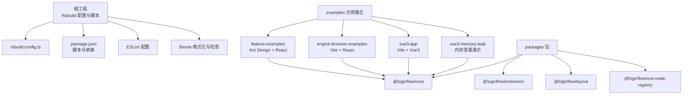
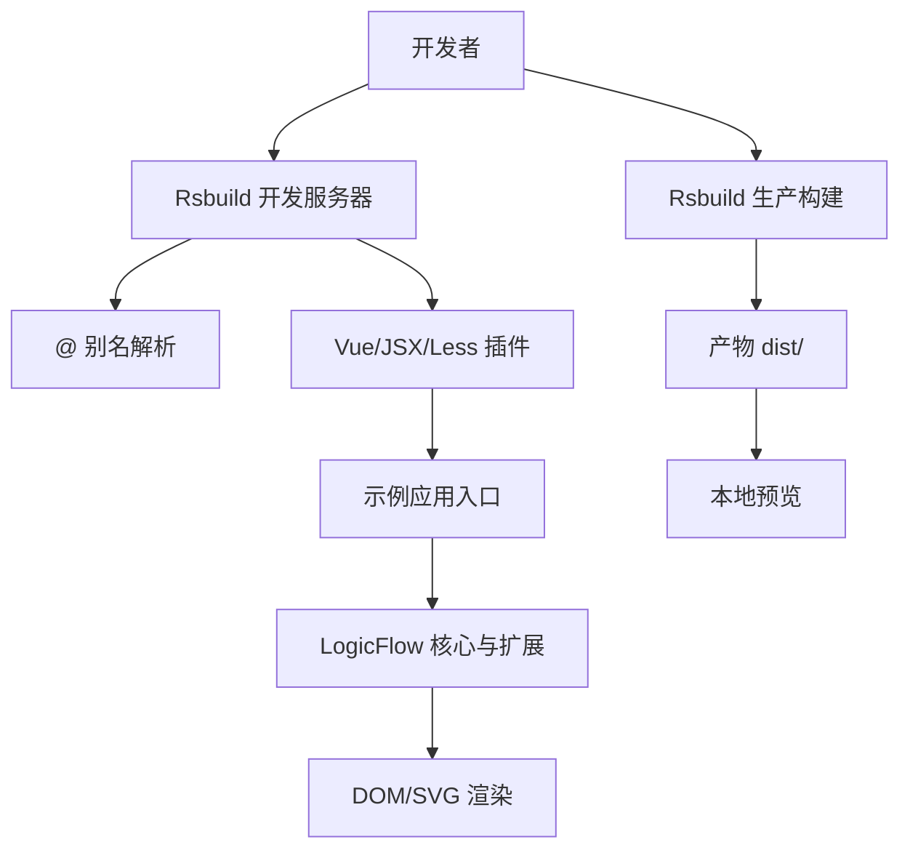
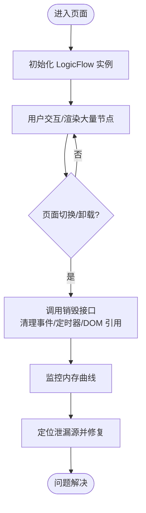
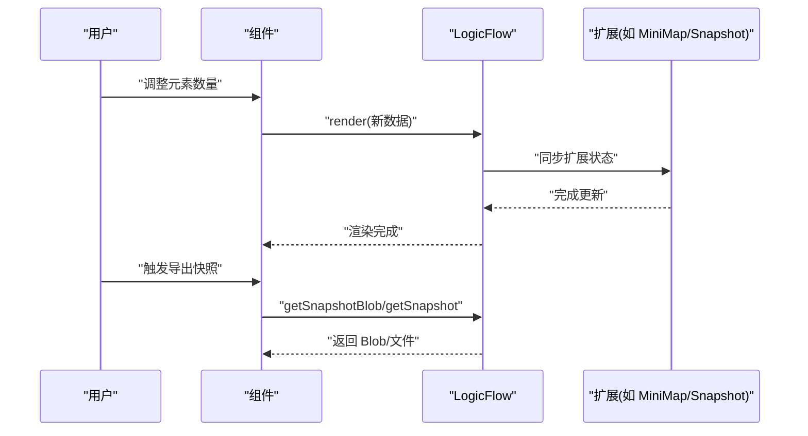
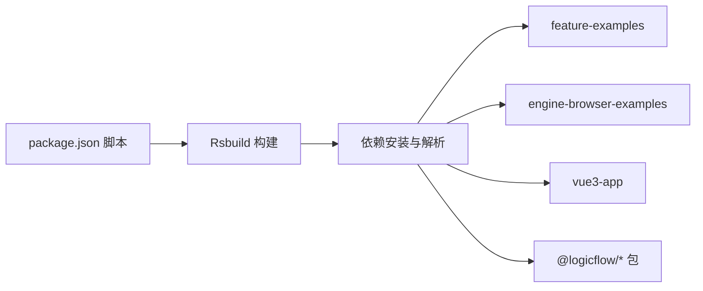

# 故障排除

<cite>
**本文引用的文件**
- [package.json](file://package.json)
- [rsbuild.config.ts](file://rsbuild.config.ts)
- [README.md](file://README.md)
- [eslint.config.mjs](file://eslint.config.mjs)
- [biome.json](file://biome.json)
- [examples/feature-examples/package.json](file://examples/feature-examples/package.json)
- [examples/engine-browser-examples/package.json](file://examples/engine-browser-examples/package.json)
- [examples/vue3-app/package.json](file://examples/vue3-app/package.json)
- [examples/vue3-memory-leak/src/components/FlowChart.vue](file://examples/vue3-memory-leak/src/components/FlowChart.vue)
- [examples/vue3-memory-leak/vite.config.js](file://examples/vue3-memory-leak/vite.config.js)
- [examples/feature-examples/src/pages/performance/snapshot-elements/index.tsx](file://examples/feature-examples/src/pages/performance/snapshot-elements/index.tsx)
</cite>

## 目录
1. [简介](#简介)
2. [项目结构](#项目结构)
3. [核心组件](#核心组件)
4. [架构总览](#架构总览)
5. [详细组件分析](#详细组件分析)
6. [依赖关系分析](#依赖关系分析)
7. [性能注意事项](#性能注意事项)
8. [故障排除指南](#故障排除指南)
9. [结论](#结论)
10. [附录](#附录)

## 简介
本指南面向技术支持与开发者，聚焦于本仓库在开发与使用过程中常见的问题与系统化排解方法。内容覆盖构建配置排查、内存泄漏诊断与修复、性能定位与优化、浏览器兼容性处理、日志与错误追踪等，帮助快速定位并解决问题。

## 项目结构
本仓库采用多包/多示例结构：
- 根工程通过 Rsbuild 构建，提供统一的 alias、插件与开发服务器配置。
- examples 目录包含多个示例应用，涵盖 Vue3、React、Next.js、Node 等不同运行环境与场景，便于对比与复现问题。
- packages 目录包含 LogicFlow 的核心与扩展包，可作为工作区依赖被示例引用。

图表来源
- [rsbuild.config.ts](file://rsbuild.config.ts#L1-L30)
- [package.json](file://package.json#L1-L45)
- [examples/feature-examples/package.json](file://examples/feature-examples/package.json#L1-L29)
- [examples/engine-browser-examples/package.json](file://examples/engine-browser-examples/package.json#L1-L39)
- [examples/vue3-app/package.json](file://examples/vue3-app/package.json#L1-L52)

章节来源
- [README.md](file://README.md#L1-L37)
- [rsbuild.config.ts](file://rsbuild.config.ts#L1-L30)
- [package.json](file://package.json#L1-L45)

## 核心组件
- 构建与开发工具链
  - Rsbuild：统一的构建与开发服务器配置，启用 Vue、JSX、Less 插件，并配置别名与开发服务器行为。
  - ESLint：基于 @vue/eslint-config-typescript 的扁平化配置，支持 TS/TSX/Vue 文件。
  - Biome：格式化、导入排序与 Lint 规则，结合 VCS 忽略文件。
- 示例应用
  - feature-examples：React + Ant Design，用于功能与性能验证。
  - engine-browser-examples：Vite + React，用于浏览器端引擎示例。
  - vue3-app：Vite + Vue3 + TailwindCSS + PostCSS，用于 Vue3 场景。
  - vue3-memory-leak：专门演示内存泄漏的最小可复现场景。
- 性能与可视化
  - feature-examples 中的“快照元素数量性能测试”页面，可用于大规模节点/边渲染与导出的性能压测。

章节来源
- [rsbuild.config.ts](file://rsbuild.config.ts#L1-L30)
- [eslint.config.mjs](file://eslint.config.mjs#L1-L24)
- [biome.json](file://biome.json#L1-L35)
- [examples/feature-examples/package.json](file://examples/feature-examples/package.json#L1-L29)
- [examples/engine-browser-examples/package.json](file://examples/engine-browser-examples/package.json#L1-L39)
- [examples/vue3-app/package.json](file://examples/vue3-app/package.json#L1-L52)

## 架构总览
下图展示从开发到生产的典型路径，以及与 LogicFlow 相关的关键集成点。

图表来源
- [rsbuild.config.ts](file://rsbuild.config.ts#L10-L29)
- [examples/feature-examples/src/pages/performance/snapshot-elements/index.tsx](file://examples/feature-examples/src/pages/performance/snapshot-elements/index.tsx#L76-L97)

## 详细组件分析

### 内存泄漏诊断与修复（Vue3 + LogicFlow）
- 现象特征
  - 页面切换或组件卸载后内存不降反升；长列表/复杂流程图尤为明显。
- 关键排查点
  - 组件销毁钩子是否调用销毁逻辑；事件监听器是否清理；定时器/订阅是否释放。
- 参考实现与建议
  - 在组件卸载阶段调用销毁接口，避免残留 DOM/SVG 与事件。
  - 对外暴露的事件监听应在销毁前解除绑定。
  - 大型流程图建议分批渲染、延迟初始化与按需加载扩展。
- 诊断步骤
  - 使用浏览器性能面板录制内存曲线，观察卸载后是否回落。
  - 检查组件生命周期钩子与 LogicFlow 实例的生命周期匹配情况。
  - 逐步禁用扩展与交互以缩小范围。

图表来源
- [examples/vue3-memory-leak/src/components/FlowChart.vue](file://examples/vue3-memory-leak/src/components/FlowChart.vue#L166-L172)

章节来源
- [examples/vue3-memory-leak/src/components/FlowChart.vue](file://examples/vue3-memory-leak/src/components/FlowChart.vue#L1-L225)
- [examples/vue3-memory-leak/vite.config.js](file://examples/vue3-memory-leak/vite.config.js#L1-L26)

### 性能定位与优化（大规模流程图）
- 压测场景
  - 通过“快照元素数量性能测试”页面动态增减节点/边数量，观察渲染与导出耗时。
- 优化策略
  - 分层渲染与虚拟滚动：仅渲染可视区域内的节点/边。
  - 批量更新：合并多次 render 调用，减少重绘。
  - 合理使用扩展：MiniMap、Snapshot 等在大数据量时应谨慎开启或限制尺寸。
  - 导出优化：控制导出尺寸、质量与局部渲染参数，避免超大图像生成。
- 可观测指标
  - 渲染耗时、帧率、内存峰值、导出耗时与体积。

图表来源
- [examples/feature-examples/src/pages/performance/snapshot-elements/index.tsx](file://examples/feature-examples/src/pages/performance/snapshot-elements/index.tsx#L153-L160)
- [examples/feature-examples/src/pages/performance/snapshot-elements/index.tsx](file://examples/feature-examples/src/pages/performance/snapshot-elements/index.tsx#L235-L278)

章节来源
- [examples/feature-examples/src/pages/performance/snapshot-elements/index.tsx](file://examples/feature-examples/src/pages/performance/snapshot-elements/index.tsx#L1-L445)

### 构建配置问题排查与修复
- 常见症状
  - 开发服务器无法启动、热更新异常、样式不生效、别名解析失败。
- 排查清单
  - 确认 Rsbuild 插件启用顺序与版本兼容性。
  - 检查别名配置是否正确映射至 src 目录。
  - 校验开发服务器 open 选项与端口占用情况。
  - 对比示例应用的构建配置，确认差异点。
- 修复建议
  - 保持 Vue/JSX/Less 插件启用顺序一致。
  - 如需自定义 base，请确保与部署路径一致。
  - 若出现样式模块解析问题，检查 CSS Modules 相关配置。

章节来源
- [rsbuild.config.ts](file://rsbuild.config.ts#L10-L29)
- [examples/vue3-memory-leak/vite.config.js](file://examples/vue3-memory-leak/vite.config.js#L15-L25)

### 浏览器兼容性问题
- 症状
  - 某些浏览器中样式错乱、交互失效、导出失败。
- 排查与修复
  - 使用 PostCSS/TailwindCSS 时，确认目标浏览器列表与 polyfill。
  - 导出快照时优先选择通用格式（PNG/JPEG），避免 SVG 导出在旧版浏览器中的兼容性问题。
  - 在示例中优先使用受支持的 API（如 URL.createObjectURL）。

章节来源
- [examples/vue3-app/package.json](file://examples/vue3-app/package.json#L22-L28)
- [examples/feature-examples/src/pages/performance/snapshot-elements/index.tsx](file://examples/feature-examples/src/pages/performance/snapshot-elements/index.tsx#L235-L278)

### 日志分析与错误追踪
- 日志来源
  - 控制台输出：组件生命周期钩子、事件回调、导出过程中的日志。
  - 浏览器开发者工具：Network、Performance、Memory 面板。
- 追踪方法
  - 在关键流程（初始化、渲染、销毁、导出）添加日志标记。
  - 使用 Performance 面板录制交互，定位卡顿与重绘热点。
  - 使用 Memory 面板观察内存泄漏趋势，结合断点与快照进行对比。

章节来源
- [examples/vue3-memory-leak/src/components/FlowChart.vue](file://examples/vue3-memory-leak/src/components/FlowChart.vue#L16-L172)
- [examples/feature-examples/src/pages/performance/snapshot-elements/index.tsx](file://examples/feature-examples/src/pages/performance/snapshot-elements/index.tsx#L211-L232)

## 依赖关系分析
- 根工程依赖与脚本
  - 通过 Rsbuild 管理构建与开发流程，依赖 @logicflow/core/extension/layout 与 Vue/路由/Pinia 等生态库。
- 示例应用依赖
  - feature-examples：Umi + Ant Design，依赖 LogicFlow 工作区包。
  - engine-browser-examples：Vite + React，依赖 LogicFlow 引擎与扩展。
  - vue3-app：Vite + Vue3 + TailwindCSS + PostCSS，依赖 LogicFlow Vue 节点注册表。
- 包管理与格式化
  - Biome 与 ESLint 协同，确保代码风格与静态检查一致性。

图表来源
- [package.json](file://package.json#L6-L12)
- [examples/feature-examples/package.json](file://examples/feature-examples/package.json#L12-L22)
- [examples/engine-browser-examples/package.json](file://examples/engine-browser-examples/package.json#L12-L24)
- [examples/vue3-app/package.json](file://examples/vue3-app/package.json#L16-L29)

章节来源
- [package.json](file://package.json#L1-L45)
- [examples/feature-examples/package.json](file://examples/feature-examples/package.json#L1-L29)
- [examples/engine-browser-examples/package.json](file://examples/engine-browser-examples/package.json#L1-L39)
- [examples/vue3-app/package.json](file://examples/vue3-app/package.json#L1-L52)

## 性能注意事项
- 渲染优化
  - 减少不必要的全量 render，采用增量更新策略。
  - 合理设置 grid、hoverOutline、edgeSelectedOutline 等视觉开销较大的选项。
- 导出优化
  - 控制导出尺寸与质量，避免生成超大图像。
  - 局部导出时指定裁剪区域，降低计算与内存压力。
- 扩展使用
  - MiniMap/Snapshot 在大数据量时建议按需启用与限制尺寸。
- 监控与压测
  - 使用示例页面的“元素数量”滑杆进行压测，记录渲染与导出耗时。

章节来源
- [examples/feature-examples/src/pages/performance/snapshot-elements/index.tsx](file://examples/feature-examples/src/pages/performance/snapshot-elements/index.tsx#L29-L45)
- [examples/feature-examples/src/pages/performance/snapshot-elements/index.tsx](file://examples/feature-examples/src/pages/performance/snapshot-elements/index.tsx#L211-L232)

## 故障排除指南

### 一、构建与开发问题
- 症状：开发服务器启动失败或端口占用
  - 检查开发服务器配置与端口占用情况。
  - 参考：[rsbuild.config.ts](file://rsbuild.config.ts#L19-L23)
- 症状：样式不生效或 CSS Modules 解析异常
  - 确认 Less 插件已启用，检查 CSS Modules 配置。
  - 参考：[rsbuild.config.ts](file://rsbuild.config.ts#L17-L17)
- 症状：别名解析失败
  - 确认 @ 别名指向 src 目录。
  - 参考：[rsbuild.config.ts](file://rsbuild.config.ts#L24-L28)

章节来源
- [rsbuild.config.ts](file://rsbuild.config.ts#L19-L29)

### 二、内存泄漏问题
- 症状：页面切换后内存不降
  - 确保在组件卸载阶段调用销毁接口。
  - 参考：[FlowChart.vue](file://examples/vue3-memory-leak/src/components/FlowChart.vue#L166-L172)
- 症状：复杂流程图交互卡顿
  - 分批渲染、延迟初始化、限制扩展使用。
  - 参考：[FlowChart.vue](file://examples/vue3-memory-leak/src/components/FlowChart.vue#L18-L38)

章节来源
- [examples/vue3-memory-leak/src/components/FlowChart.vue](file://examples/vue3-memory-leak/src/components/FlowChart.vue#L166-L172)

### 三、性能问题
- 症状：渲染缓慢或导出失败
  - 使用“快照元素数量性能测试”页面压测，逐步增加节点/边数量。
  - 调整导出参数（尺寸、质量、局部渲染）。
  - 参考：[性能测试页面](file://examples/feature-examples/src/pages/performance/snapshot-elements/index.tsx#L103-L160)

章节来源
- [examples/feature-examples/src/pages/performance/snapshot-elements/index.tsx](file://examples/feature-examples/src/pages/performance/snapshot-elements/index.tsx#L103-L160)

### 四、浏览器兼容性
- 症状：样式错乱或导出失败
  - 使用通用导出格式（PNG/JPEG），避免 SVG 导出兼容性问题。
  - 参考：[性能测试页面导出](file://examples/feature-examples/src/pages/performance/snapshot-elements/index.tsx#L235-L278)

章节来源
- [examples/feature-examples/src/pages/performance/snapshot-elements/index.tsx](file://examples/feature-examples/src/pages/performance/snapshot-elements/index.tsx#L235-L278)

### 五、日志与错误追踪
- 步骤
  - 在关键流程添加日志标记（初始化、渲染、销毁、导出）。
  - 使用浏览器 Performance/Memory 面板录制与分析。
  - 结合组件生命周期钩子定位问题发生阶段。
- 参考
  - [FlowChart.vue 生命周期日志](file://examples/vue3-memory-leak/src/components/FlowChart.vue#L16-L172)
  - [性能测试页面导出日志](file://examples/feature-examples/src/pages/performance/snapshot-elements/index.tsx#L211-L232)

章节来源
- [examples/vue3-memory-leak/src/components/FlowChart.vue](file://examples/vue3-memory-leak/src/components/FlowChart.vue#L16-L172)
- [examples/feature-examples/src/pages/performance/snapshot-elements/index.tsx](file://examples/feature-examples/src/pages/performance/snapshot-elements/index.tsx#L211-L232)

## 结论
本指南提供了从构建配置、内存泄漏、性能优化到浏览器兼容与日志追踪的系统化排解方法。建议在开发与运维流程中结合示例应用进行对照测试，利用内置的性能测试页面进行量化评估，并通过浏览器开发者工具与日志进行精准定位，从而高效解决问题。

## 附录
- 快速命令
  - 启动开发：[README.md](file://README.md#L13-L17)
  - 构建生产：[README.md](file://README.md#L19-L23)
  - 预览生产：[README.md](file://README.md#L25-L29)
- 工具与配置
  - Rsbuild：[rsbuild.config.ts](file://rsbuild.config.ts#L1-L30)
  - ESLint：[eslint.config.mjs](file://eslint.config.mjs#L1-L24)
  - Biome：[biome.json](file://biome.json#L1-L35)