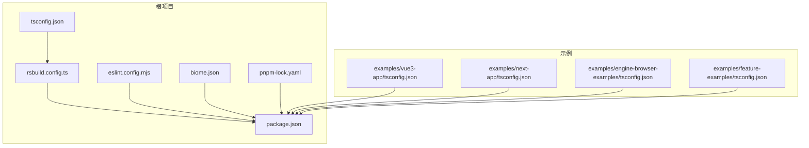
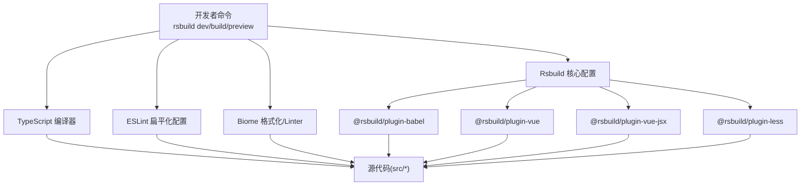
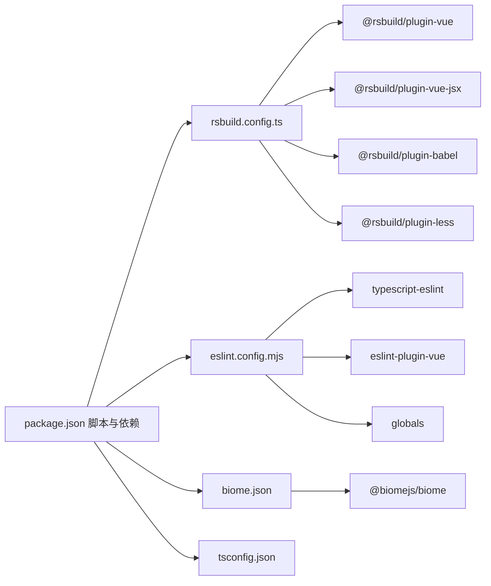

# 构建问题解决

<cite>
**本文引用的文件**
- [rsbuild.config.ts](file://rsbuild.config.ts)
- [package.json](file://package.json)
- [tsconfig.json](file://tsconfig.json)
- [eslint.config.mjs](file://eslint.config.mjs)
- [biome.json](file://biome.json)
- [pnpm-lock.yaml](file://pnpm-lock.yaml)
- [examples/engine-browser-examples/tsconfig.json](file://examples/engine-browser-examples/tsconfig.json)
- [examples/feature-examples/tsconfig.json](file://examples/feature-examples/tsconfig.json)
- [examples/vue3-app/tsconfig.json](file://examples/vue3-app/tsconfig.json)
- [examples/next-app/tsconfig.json](file://examples/next-app/tsconfig.json)
</cite>

## 目录
1. [简介](#简介)
2. [项目结构](#项目结构)
3. [核心组件](#核心组件)
4. [架构总览](#架构总览)
5. [详细组件分析](#详细组件分析)
6. [依赖关系分析](#依赖关系分析)
7. [性能考虑](#性能考虑)
8. [故障排除指南](#故障排除指南)
9. [结论](#结论)
10. [附录](#附录)

## 简介
本文件面向使用 Rsbuild 的前端项目，提供构建系统问题的系统化解决方案。内容覆盖 Rsbuild 配置错误、TypeScript 编译问题、ESLint 与 Biome 代码检查冲突、依赖版本不兼容排查与修复、开发与生产构建差异、构建缓存清理与依赖重装、跨平台构建注意事项以及环境变量配置要点。目标是帮助开发者快速定位并解决问题，提升构建稳定性与效率。

## 项目结构
该仓库采用多包/多示例并存的组织方式：根目录为 Rsbuild 主应用，examples 下包含多个子示例（如 Vue3、Next.js、浏览器引擎示例等），packages 下为可复用的内部包。Rsbuild 主配置位于根目录，TypeScript、ESLint、Biome 等工具配置分别独立管理，便于在不同示例间共享或差异化配置。

**图表来源**
- [rsbuild.config.ts](file://rsbuild.config.ts#L1-L30)
- [package.json](file://package.json#L1-L45)
- [tsconfig.json](file://tsconfig.json#L1-L33)
- [eslint.config.mjs](file://eslint.config.mjs#L1-L24)
- [biome.json](file://biome.json#L1-L35)
- [pnpm-lock.yaml](file://pnpm-lock.yaml#L1-L200)
- [examples/vue3-app/tsconfig.json](file://examples/vue3-app/tsconfig.json#L1-L19)
- [examples/next-app/tsconfig.json](file://examples/next-app/tsconfig.json#L1-L27)
- [examples/engine-browser-examples/tsconfig.json](file://examples/engine-browser-examples/tsconfig.json#L1-L29)
- [examples/feature-examples/tsconfig.json](file://examples/feature-examples/tsconfig.json#L1-L4)

**章节来源**
- [rsbuild.config.ts](file://rsbuild.config.ts#L1-L30)
- [package.json](file://package.json#L1-L45)
- [tsconfig.json](file://tsconfig.json#L1-L33)
- [eslint.config.mjs](file://eslint.config.mjs#L1-L24)
- [biome.json](file://biome.json#L1-L35)
- [pnpm-lock.yaml](file://pnpm-lock.yaml#L1-L200)
- [examples/vue3-app/tsconfig.json](file://examples/vue3-app/tsconfig.json#L1-L19)
- [examples/next-app/tsconfig.json](file://examples/next-app/tsconfig.json#L1-L27)
- [examples/engine-browser-examples/tsconfig.json](file://examples/engine-browser-examples/tsconfig.json#L1-L29)
- [examples/feature-examples/tsconfig.json](file://examples/feature-examples/tsconfig.json#L1-L4)

## 核心组件
- Rsbuild 核心配置：定义插件、解析别名、开发服务器参数等。
- TypeScript 编译配置：统一模块解析、路径映射、严格类型检查策略。
- ESLint 配置：基于 @vue/eslint-config-typescript 的扁平化配置，支持 Vue/TS/TSX 文件。
- Biome 配置：格式化、导入排序、Linter 规则启用等。
- 依赖锁定：pnpm-lock.yaml 记录所有依赖版本，用于排查版本不兼容。

**章节来源**
- [rsbuild.config.ts](file://rsbuild.config.ts#L10-L29)
- [tsconfig.json](file://tsconfig.json#L2-L32)
- [eslint.config.mjs](file://eslint.config.mjs#L14-L23)
- [biome.json](file://biome.json#L1-L35)
- [pnpm-lock.yaml](file://pnpm-lock.yaml#L1-L200)

## 架构总览
Rsbuild 在本项目中的作用是作为打包与开发服务器入口，结合 Vue 插件、Babel 插件、Less 插件完成源码转换与资源处理；TypeScript 负责类型检查与编译；ESLint 与 Biome 并行进行代码质量控制，二者规则需保持一致以避免冲突。

**图表来源**
- [rsbuild.config.ts](file://rsbuild.config.ts#L10-L29)
- [eslint.config.mjs](file://eslint.config.mjs#L14-L23)
- [biome.json](file://biome.json#L1-L35)
- [tsconfig.json](file://tsconfig.json#L2-L32)

## 详细组件分析

### Rsbuild 配置问题排查
- 常见问题
  - 插件未正确加载：确认插件版本与 @rsbuild/core 兼容。
  - 别名无效：确保 resolve.alias 正确映射到实际路径。
  - 开发服务器参数：dev/server 参数需与团队协作需求匹配。
- 排查步骤
  - 检查 plugins 数组中各插件是否安装且版本兼容。
  - 使用最小化配置验证基础功能，逐步添加插件定位问题。
  - 对比示例工程的 Rsbuild 配置，确保与当前项目场景一致。
- 解决建议
  - 固定插件版本范围，避免自动升级引入破坏性变更。
  - 将 alias 统一为绝对路径，减少相对路径导致的解析偏差。
  - 如需热更新或自动打开浏览器，按需调整 dev/server 配置项。

**章节来源**
- [rsbuild.config.ts](file://rsbuild.config.ts#L10-L29)

### TypeScript 编译问题
- 常见问题
  - 模块解析失败：moduleResolution 或 bundler 不匹配。
  - JSX 处理异常：jsx 与 jsxImportSource 设置不一致。
  - 路径映射失效：baseUrl 与 paths 不匹配。
  - 严格模式报错：strict/noUnusedLocals 等规则导致编译失败。
- 排查步骤
  - 对照示例工程的 tsconfig，核对 module/moduleResolution/target 等关键字段。
  - 检查 src 内部文件是否被 include 包含。
  - 验证路径映射 @/* 是否与实际目录一致。
- 解决建议
  - 保持与示例一致的 ESNext + bundler 解析策略。
  - 统一 jsx/preserve 或 vue 的 jsxImportSource，避免混用。
  - 逐步关闭严格规则定位具体文件问题，再针对性修复。

**章节来源**
- [tsconfig.json](file://tsconfig.json#L2-L32)
- [examples/engine-browser-examples/tsconfig.json](file://examples/engine-browser-examples/tsconfig.json#L2-L28)
- [examples/feature-examples/tsconfig.json](file://examples/feature-examples/tsconfig.json#L1-L4)
- [examples/vue3-app/tsconfig.json](file://examples/vue3-app/tsconfig.json#L1-L19)
- [examples/next-app/tsconfig.json](file://examples/next-app/tsconfig.json#L1-L27)

### ESLint 与 Biome 冲突
- 冲突表现
  - 同时运行 ESLint 和 Biome 时出现重复规则或相互覆盖。
  - 格式化结果不一致，导致 CI/本地差异。
- 排查步骤
  - 检查 ESLint 是否启用了推荐规则集，Biome 是否开启 linter/recommended。
  - 对比两者的规则配置，识别重复或矛盾项。
- 解决策略
  - 方案 A：仅保留 Biome，禁用 ESLint 的 JS/TS 检查，保留其 Lint 能力。
  - 方案 B：仅保留 ESLint，禁用 Biome 的 linter，统一由 ESLint 管理。
  - 方案 C：双轨并行但通过 ignorePatterns 或规则白名单避免冲突。
- 参考配置
  - ESLint 使用 @vue/eslint-config-typescript 的扁平化配置。
  - Biome 启用 linter/recommended 并开启格式化。

**章节来源**
- [eslint.config.mjs](file://eslint.config.mjs#L14-L23)
- [biome.json](file://biome.json#L28-L33)

### 依赖版本不兼容排查
- 现象
  - 安装后构建失败、运行时报错、插件无法加载。
- 排查步骤
  - 使用 pnpm 锁定文件核对关键依赖版本，如 @rsbuild/core、@rsbuild/plugin-vue、@rsbuild/plugin-vue-jsx、@biomejs/biome、eslint、typescript 等。
  - 比较各插件与 @rsbuild/core 的版本范围，确保满足最低要求。
  - 检查 Vue 生态相关依赖（如 @vue/compiler-sfc）与 vue 版本是否匹配。
- 解决策略
  - 使用 pnpm 安装时遵循 lockfile，避免使用 --fixable 导致版本漂移。
  - 若必须升级某依赖，先在隔离分支验证兼容性，再合并主干。
  - 对于 alpha/beta 版本的插件，优先回退到稳定版本。

**章节来源**
- [pnpm-lock.yaml](file://pnpm-lock.yaml#L47-L90)
- [package.json](file://package.json#L28-L43)

### 开发与生产构建差异
- 差异点
  - 开发模式强调热更新与调试信息；生产模式强调压缩、Tree-shaking 与产物体积优化。
  - 插件行为可能因环境而异（如某些插件在生产模式下启用更严格的校验）。
- 建议
  - 明确区分 dev/build/preview 三类脚本用途，避免混淆。
  - 在生产构建前执行 lint/format，确保产物质量。
  - 如需自定义生产构建行为，通过 Rsbuild 的 defineConfig 环境分支进行差异化配置。

**章节来源**
- [package.json](file://package.json#L6-L13)
- [rsbuild.config.ts](file://rsbuild.config.ts#L19-L29)

### 构建缓存清理与依赖重装
- 清理缓存
  - Rsbuild 缓存：删除构建输出目录（默认 dist）与 Rsbuild 缓存目录。
  - Node/包管理器缓存：清空 node_modules 并重建锁文件。
- 重装依赖
  - 使用 pnpm 重装，确保 lockfile 一致性。
  - 如存在版本冲突，先降级到已知稳定版本，再逐步升级。
- 验证
  - 清理后重新执行 dev/build，观察是否恢复。

**章节来源**
- [package.json](file://package.json#L6-L13)

### 跨平台构建问题
- 常见问题
  - 路径分隔符不一致导致模块解析失败。
  - 文件大小写敏感差异引发的导入错误。
  - 权限问题导致的构建失败或文件写入失败。
- 建议
  - 统一使用正斜杠路径，避免硬编码反斜杠。
  - 在导入语句中保持与文件系统一致的大小写。
  - 在 CI 中设置合适的权限与工作空间权限。

**章节来源**
- [rsbuild.config.ts](file://rsbuild.config.ts#L24-L28)

### 环境变量配置指南
- 建议
  - 将环境变量集中管理，避免散落在各处。
  - 在开发与生产环境分别设置不同的变量集，避免泄露敏感信息。
  - 使用 .env 文件并在 Rsbuild 中注入，确保构建时可见。
- 注意
  - 确保变量在运行时可用，避免构建期常量替换导致的空值。

**章节来源**
- [rsbuild.config.ts](file://rsbuild.config.ts#L19-L29)

## 依赖关系分析
Rsbuild 与各工具之间的耦合关系如下：

**图表来源**
- [package.json](file://package.json#L6-L43)
- [rsbuild.config.ts](file://rsbuild.config.ts#L10-L29)
- [eslint.config.mjs](file://eslint.config.mjs#L1-L24)
- [biome.json](file://biome.json#L1-L35)
- [tsconfig.json](file://tsconfig.json#L2-L32)

**章节来源**
- [package.json](file://package.json#L6-L43)
- [rsbuild.config.ts](file://rsbuild.config.ts#L10-L29)
- [eslint.config.mjs](file://eslint.config.mjs#L1-L24)
- [biome.json](file://biome.json#L1-L35)
- [tsconfig.json](file://tsconfig.json#L2-L32)

## 性能考虑
- 合理拆分构建任务，避免单次构建体量过大。
- 使用插件的并发能力与增量编译特性，缩短开发等待时间。
- 在生产构建中启用压缩与 Tree-shaking，降低产物体积。
- 保持依赖版本稳定，减少不必要的重编译。

## 故障排除指南
- Rsbuild 启动失败
  - 检查插件安装与版本，确认与 @rsbuild/core 兼容。
  - 核对别名与路径映射，确保 resolve.alias 正确。
- TypeScript 报错
  - 对照示例 tsconfig，统一 moduleResolution/jsxImportSource。
  - 逐步放宽严格规则定位具体文件问题。
- ESLint/Biome 冲突
  - 二选一或通过 ignorePatterns/规则白名单规避冲突。
- 依赖不兼容
  - 使用 pnpm 锁定文件核对版本，必要时回退到稳定版本。
- 构建缓存问题
  - 清理 dist 与缓存目录，重新安装依赖后重试。
- 跨平台差异
  - 统一路径与大小写，避免大小写不一致导致的导入失败。

**章节来源**
- [rsbuild.config.ts](file://rsbuild.config.ts#L10-L29)
- [tsconfig.json](file://tsconfig.json#L2-L32)
- [eslint.config.mjs](file://eslint.config.mjs#L14-L23)
- [biome.json](file://biome.json#L28-L33)
- [pnpm-lock.yaml](file://pnpm-lock.yaml#L47-L90)
- [package.json](file://package.json#L6-L13)

## 结论
通过规范 Rsbuild 配置、统一 TypeScript/ESLint/Biome 行为、严格管理依赖版本与缓存清理流程，可以显著降低构建问题的发生率。建议在团队内形成标准化的配置模板与发布流程，持续监控版本升级风险，确保开发与生产的稳定性与一致性。

## 附录
- 快速检查清单
  - Rsbuild 插件版本与 @rsbuild/core 兼容
  - TypeScript moduleResolution 与 bundler 一致
  - ESLint 与 Biome 规则无冲突
  - pnpm 锁定文件与实际环境一致
  - 路径映射与别名配置正确
  - 跨平台路径与大小写一致
  - 清理缓存与重装依赖后验证