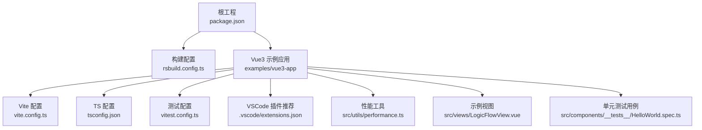
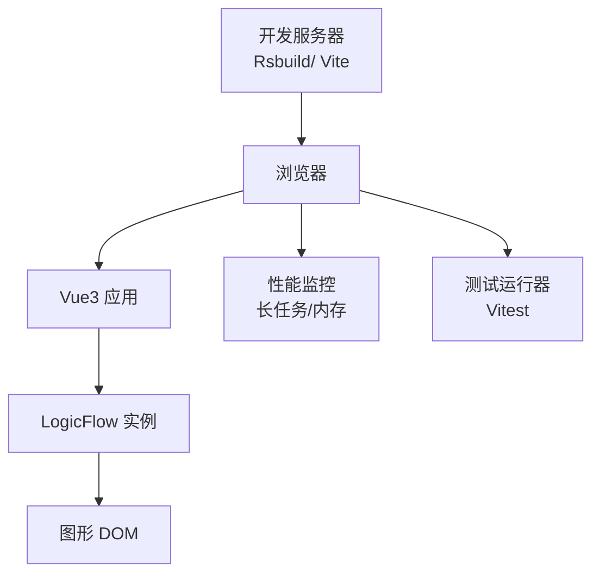
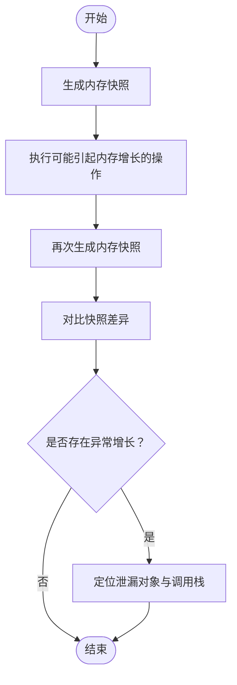
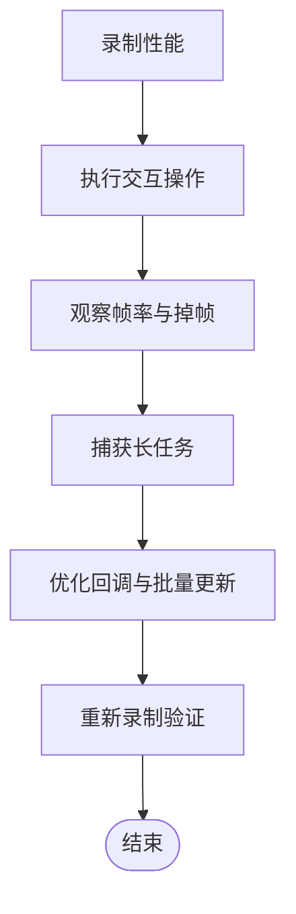
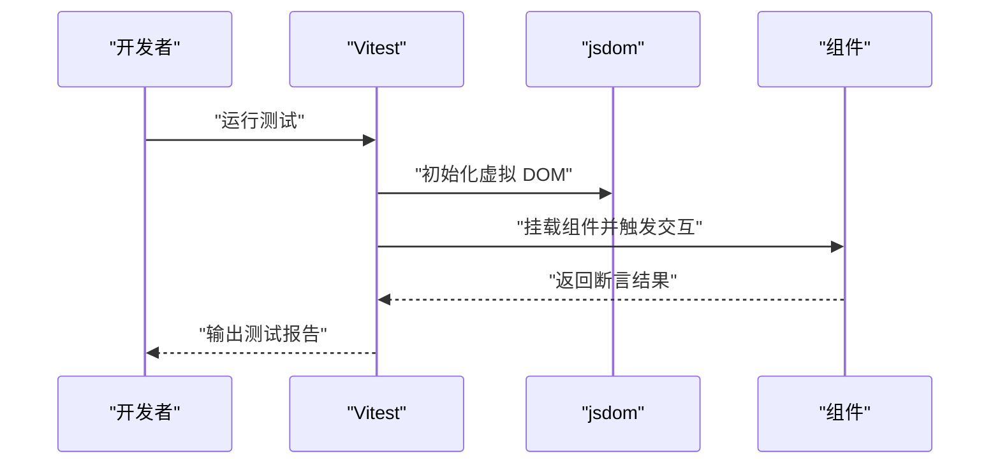
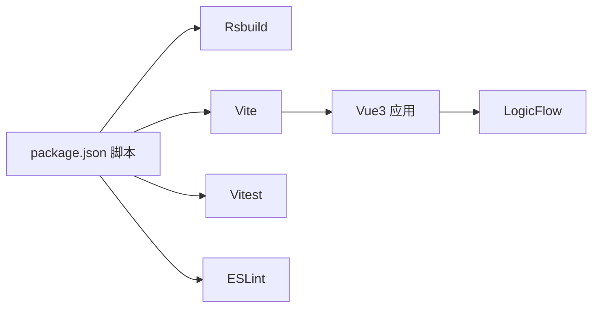

# 调试工具使用

<cite>
**本文引用的文件**
- [package.json](file://package.json)
- [rsbuild.config.ts](file://rsbuild.config.ts)
- [examples/vue3-app/vite.config.ts](file://examples/vue3-app/vite.config.ts)
- [examples/vue3-app/tsconfig.json](file://examples/vue3-app/tsconfig.json)
- [examples/vue3-app/vitest.config.ts](file://examples/vue3-app/vitest.config.ts)
- [examples/vue3-app/.vscode/extensions.json](file://examples/vue3-app/.vscode/extensions.json)
- [examples/vue3-app/src/utils/performance.ts](file://examples/vue3-app/src/utils/performance.ts)
- [examples/vue3-app/src/components/__tests__/HelloWorld.spec.ts](file://examples/vue3-app/src/components/__tests__/HelloWorld.spec.ts)
- [examples/vue3-app/src/views/LogicFlowView.vue](file://examples/vue3-app/src/views/LogicFlowView.vue)
</cite>

## 目录
1. [简介](#简介)
2. [项目结构](#项目结构)
3. [核心组件](#核心组件)
4. [架构总览](#架构总览)
5. [详细组件分析](#详细组件分析)
6. [依赖分析](#依赖分析)
7. [性能考虑](#性能考虑)
8. [故障排查指南](#故障排查指南)
9. [结论](#结论)
10. [附录](#附录)

## 简介
本章节面向使用 LogicFlow 的前端开发者，系统性介绍项目中的调试工具与方法，覆盖以下方面：
- 浏览器开发者工具对 Vue 组件与 LogicFlow 图形元素的调试实践
- 性能分析工具的使用（内存监控、长任务与渲染性能）
- 单元测试与集成测试的调试技巧
- 断点调试、日志输出、错误追踪的操作步骤
- VSCode 调试配置与 Chrome 扩展工具的使用指南

## 项目结构
该仓库采用多包/多示例组织方式，与调试相关的关键位置如下：
- 根工程脚本与构建配置：用于启动开发服务器、预览与打包
- Vue3 示例应用：包含 Vite 配置、TS 配置、测试配置、VSCode 推荐插件、性能工具与示例视图
- LogicFlow 图形交互示例：在 Vue 视图中初始化 LogicFlow 并注册节点/边，便于图形元素调试

图表来源
- [package.json](file://package.json#L1-L45)
- [rsbuild.config.ts](file://rsbuild.config.ts)
- [examples/vue3-app/vite.config.ts](file://examples/vue3-app/vite.config.ts#L1-L15)
- [examples/vue3-app/tsconfig.json](file://examples/vue3-app/tsconfig.json#L1-L19)
- [examples/vue3-app/vitest.config.ts](file://examples/vue3-app/vitest.config.ts#L1-L15)
- [examples/vue3-app/.vscode/extensions.json](file://examples/vue3-app/.vscode/extensions.json#L1-L4)
- [examples/vue3-app/src/utils/performance.ts](file://examples/vue3-app/src/utils/performance.ts#L1-L28)
- [examples/vue3-app/src/views/LogicFlowView.vue](file://examples/vue3-app/src/views/LogicFlowView.vue#L1-L537)
- [examples/vue3-app/src/components/__tests__/HelloWorld.spec.ts](file://examples/vue3-app/src/components/__tests__/HelloWorld.spec.ts#L1-L12)

章节来源
- [package.json](file://package.json#L1-L45)
- [examples/vue3-app/vite.config.ts](file://examples/vue3-app/vite.config.ts#L1-L15)
- [examples/vue3-app/tsconfig.json](file://examples/vue3-app/tsconfig.json#L1-L19)
- [examples/vue3-app/vitest.config.ts](file://examples/vue3-app/vitest.config.ts#L1-L15)
- [examples/vue3-app/.vscode/extensions.json](file://examples/vue3-app/.vscode/extensions.json#L1-L4)
- [examples/vue3-app/src/utils/performance.ts](file://examples/vue3-app/src/utils/performance.ts#L1-L28)
- [examples/vue3-app/src/views/LogicFlowView.vue](file://examples/vue3-app/src/views/LogicFlowView.vue#L1-L537)
- [examples/vue3-app/src/components/__tests__/HelloWorld.spec.ts](file://examples/vue3-app/src/components/__tests__/HelloWorld.spec.ts#L1-L12)

## 核心组件
- 构建与开发服务器
  - 使用 Rsbuild 启动开发服务器、构建与预览，便于快速迭代与调试
- Vue3 应用与 Vite 集成
  - Vite 配置启用 Vue 插件；注释提示了特定开发工具可能导致的内存问题，需谨慎引入
- TypeScript 与测试配置
  - TS 多配置引用；Vitest 配置指定测试环境与根路径；示例测试用例演示基本断言
- 性能工具
  - 提供 DOM 数量统计与长任务观察接口，辅助定位主线程阻塞与渲染卡顿
- LogicFlow 图形视图
  - 在 Vue 视图中初始化 LogicFlow，注册节点/边与主题，绑定事件与交互操作，便于图形元素调试

章节来源
- [package.json](file://package.json#L6-L12)
- [examples/vue3-app/vite.config.ts](file://examples/vue3-app/vite.config.ts#L1-L15)
- [examples/vue3-app/tsconfig.json](file://examples/vue3-app/tsconfig.json#L1-L19)
- [examples/vue3-app/vitest.config.ts](file://examples/vue3-app/vitest.config.ts#L1-L15)
- [examples/vue3-app/src/utils/performance.ts](file://examples/vue3-app/src/utils/performance.ts#L1-L28)
- [examples/vue3-app/src/views/LogicFlowView.vue](file://examples/vue3-app/src/views/LogicFlowView.vue#L1-L537)

## 架构总览
下图展示了从开发服务器到浏览器调试、再到 LogicFlow 图形交互的端到端调试链路。

图表来源
- [package.json](file://package.json#L6-L12)
- [examples/vue3-app/vite.config.ts](file://examples/vue3-app/vite.config.ts#L1-L15)
- [examples/vue3-app/src/utils/performance.ts](file://examples/vue3-app/src/utils/performance.ts#L1-L28)
- [examples/vue3-app/src/views/LogicFlowView.vue](file://examples/vue3-app/src/views/LogicFlowView.vue#L1-L537)

## 详细组件分析

### 浏览器开发者工具：Vue 组件调试
- 打开“组件”面板，查看组件树、状态与 Props
- 使用“事件”与“监听器”标签，定位组件生命周期钩子与事件绑定
- 在“控制台”执行逻辑流命令，如切换节点类型、修改边属性等
- 结合示例视图中的交互按钮，验证状态变化与副作用

章节来源
- [examples/vue3-app/src/views/LogicFlowView.vue](file://examples/vue3-app/src/views/LogicFlowView.vue#L377-L454)

### 浏览器开发者工具：LogicFlow 图形元素调试
- 在“Elements”面板中定位图形容器与节点/边元素，检查样式与层级
- 使用“性能”面板录制交互过程，观察布局与绘制耗时
- 在“网络”面板检查资源加载情况，避免额外资源拖慢渲染
- 在“应用”面板查看本地存储与缓存，确认图形数据持久化

章节来源
- [examples/vue3-app/src/views/LogicFlowView.vue](file://examples/vue3-app/src/views/LogicFlowView.vue#L1-L537)

### 性能分析工具：内存使用监控
- 使用“性能”面板的“内存”快照对比，识别异常增长
- 使用“长任务”观察器定位主线程阻塞
- 使用提供的性能工具函数统计 DOM 数量，辅助判断重绘范围

图表来源
- [examples/vue3-app/src/utils/performance.ts](file://examples/vue3-app/src/utils/performance.ts#L1-L28)

章节来源
- [examples/vue3-app/src/utils/performance.ts](file://examples/vue3-app/src/utils/performance.ts#L1-L28)

### 性能分析工具：渲染性能分析
- 使用“性能”面板录制交互（缩放、平移、动画），观察帧率与掉帧
- 使用“长任务”观察器捕获主线程阻塞，结合回调处理优化
- 对频繁更新的节点/边，减少不必要的重绘与重排

图表来源
- [examples/vue3-app/src/utils/performance.ts](file://examples/vue3-app/src/utils/performance.ts#L17-L27)

章节来源
- [examples/vue3-app/src/utils/performance.ts](file://examples/vue3-app/src/utils/performance.ts#L1-L28)

### 单元测试与集成测试：调试技巧
- 基础断言
  - 使用 Vitest 的断言 API 验证组件渲染结果
- 测试环境
  - 使用 jsdom 环境模拟浏览器 DOM API
- 运行与调试
  - 通过根工程脚本启动测试或在 IDE 中直接调试测试文件

图表来源
- [examples/vue3-app/vitest.config.ts](file://examples/vue3-app/vitest.config.ts#L8-L12)
- [examples/vue3-app/src/components/__tests__/HelloWorld.spec.ts](file://examples/vue3-app/src/components/__tests__/HelloWorld.spec.ts#L1-L12)

章节来源
- [examples/vue3-app/vitest.config.ts](file://examples/vue3-app/vitest.config.ts#L1-L15)
- [examples/vue3-app/src/components/__tests__/HelloWorld.spec.ts](file://examples/vue3-app/src/components/__tests__/HelloWorld.spec.ts#L1-L12)

### 断点调试、日志输出、错误追踪
- 断点调试
  - 在浏览器 Sources 面板设置断点，或在 IDE 中设置断点后通过浏览器调试
- 日志输出
  - 在示例视图中使用控制台输出关键状态与数据
- 错误追踪
  - 使用浏览器 Console 查看错误堆栈；在组件中增加 try/catch 包裹异步逻辑

章节来源
- [examples/vue3-app/src/views/LogicFlowView.vue](file://examples/vue3-app/src/views/LogicFlowView.vue#L113-L116)
- [examples/vue3-app/src/views/LogicFlowView.vue](file://examples/vue3-app/src/views/LogicFlowView.vue#L209-L219)
- [examples/vue3-app/src/views/LogicFlowView.vue](file://examples/vue3-app/src/views/LogicFlowView.vue#L310-L315)

### VSCode 调试配置与 Chrome 扩展工具
- VSCode 插件推荐
  - Volar、ESLint、Prettier，提升 Vue 与 TS 调试体验
- Chrome 扩展
  - 注意：示例配置中明确提示某开发工具会引发内存问题，应避免引入以防止内存溢出

章节来源
- [examples/vue3-app/.vscode/extensions.json](file://examples/vue3-app/.vscode/extensions.json#L1-L4)
- [examples/vue3-app/vite.config.ts](file://examples/vue3-app/vite.config.ts#L5-L6)

## 依赖分析
- 开发与构建
  - Rsbuild 提供开发服务器与构建能力
  - Vite 作为 Vue 应用的构建与热更新工具
- 测试与质量
  - Vitest 提供单元测试能力；ESLint 保障代码风格与静态检查
- 性能与调试
  - 浏览器性能面板与长任务观察器用于性能分析

图表来源
- [package.json](file://package.json#L6-L12)
- [examples/vue3-app/vite.config.ts](file://examples/vue3-app/vite.config.ts#L1-L15)

章节来源
- [package.json](file://package.json#L1-L45)
- [examples/vue3-app/vite.config.ts](file://examples/vue3-app/vite.config.ts#L1-L15)

## 性能考虑
- 避免在主线程执行重型计算；必要时使用 Web Workers 或 requestIdleCallback
- 控制图形元素数量与复杂度，合理使用动画与高阶效果
- 使用长任务观察器与性能面板持续监控，及时发现回归

## 故障排查指南
- 内存泄漏
  - 使用内存快照对比定位异常增长对象；检查事件监听器与定时器是否正确清理
- 渲染卡顿
  - 录制性能并观察长任务；减少不必要的重绘与重排
- 测试失败
  - 在 Vitest 中逐步缩小问题范围，使用断点与日志定位

章节来源
- [examples/vue3-app/src/utils/performance.ts](file://examples/vue3-app/src/utils/performance.ts#L1-L28)
- [examples/vue3-app/src/components/__tests__/HelloWorld.spec.ts](file://examples/vue3-app/src/components/__tests__/HelloWorld.spec.ts#L1-L12)

## 结论
通过结合浏览器开发者工具、性能监控、单元测试与 VSCode/Chrome 工具链，可以高效完成 LogicFlow 图形应用的调试与优化。建议在开发过程中持续关注长任务与内存占用，并利用测试确保关键交互的稳定性。

## 附录
- 快速入口
  - 启动开发服务器：参考根工程脚本
  - 运行测试：参考 Vitest 配置与脚本
  - 打开示例视图：在浏览器中访问 Vue3 示例应用

章节来源
- [package.json](file://package.json#L6-L12)
- [examples/vue3-app/vitest.config.ts](file://examples/vue3-app/vitest.config.ts#L1-L15)
- [examples/vue3-app/src/views/LogicFlowView.vue](file://examples/vue3-app/src/views/LogicFlowView.vue#L1-L537)