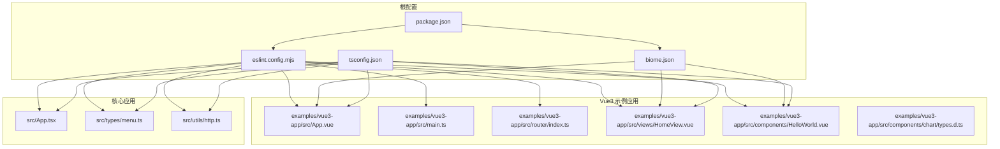
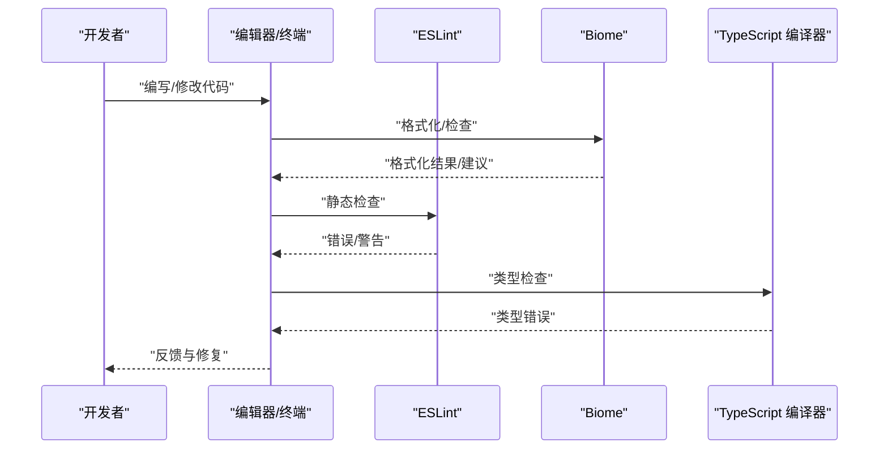
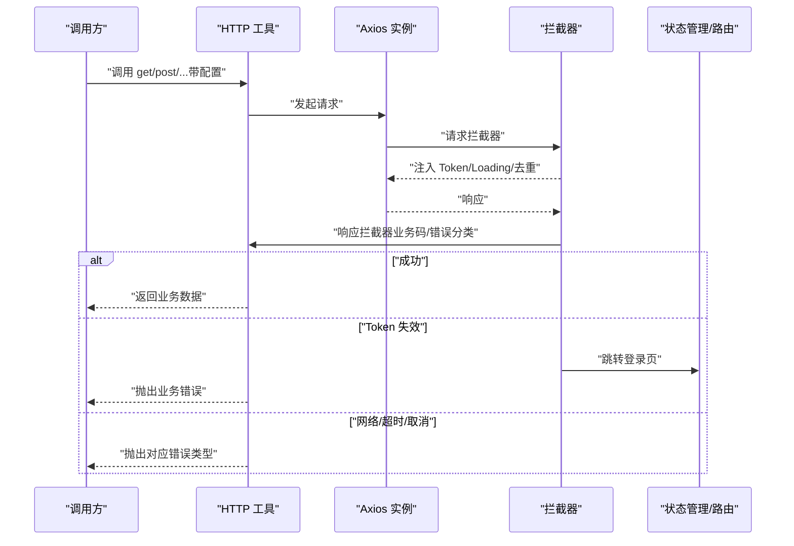
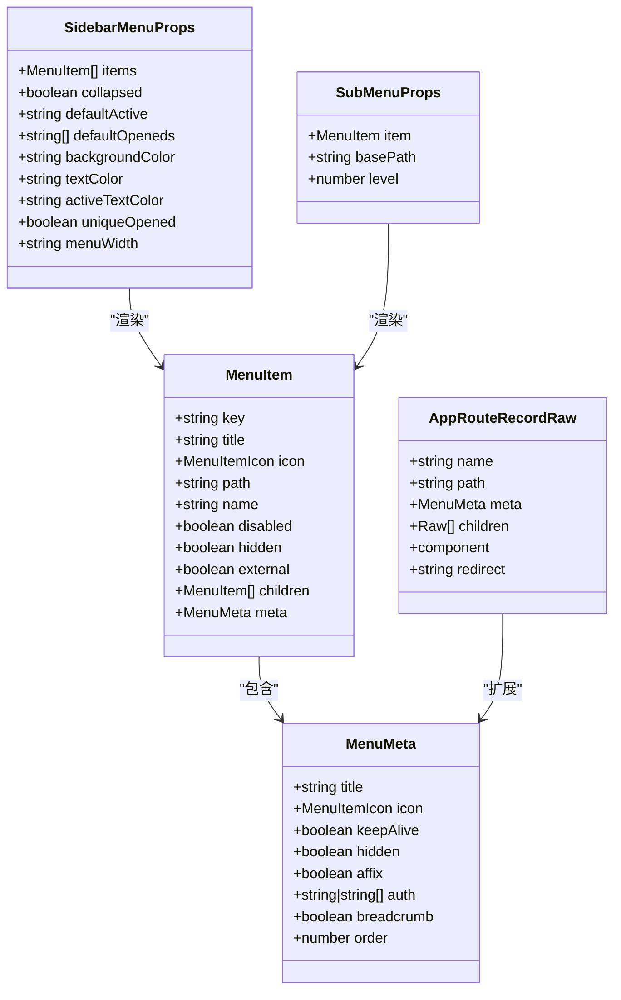
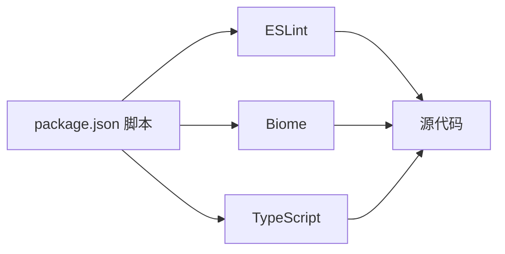

# 代码规范与风格

<cite>
**本文引用的文件**
- [eslint.config.mjs](file://eslint.config.mjs)
- [biome.json](file://biome.json)
- [package.json](file://package.json)
- [tsconfig.json](file://tsconfig.json)
- [examples/vue3-app/src/App.vue](file://examples/vue3-app/src/App.vue)
- [examples/vue3-app/src/main.ts](file://examples/vue3-app/src/main.ts)
- [examples/vue3-app/src/views/HomeView.vue](file://examples/vue3-app/src/views/HomeView.vue)
- [examples/vue3-app/src/components/HelloWorld.vue](file://examples/vue3-app/src/components/HelloWorld.vue)
- [examples/vue3-app/src/router/index.ts](file://examples/vue3-app/src/router/index.ts)
- [examples/vue3-app/src/components/chart/types.d.ts](file://examples/vue3-app/src/components/chart/types.d.ts)
- [src/App.tsx](file://src/App.tsx)
- [src/types/menu.ts](file://src/types/menu.ts)
- [src/utils/http.ts](file://src/utils/http.ts)
</cite>

## 目录
1. 引言
2. 项目结构
3. 核心组件
4. 架构总览
5. 详细组件分析
6. 依赖关系分析
7. 性能考量
8. 故障排查指南
9. 结论
10. 附录

## 引言
本指南面向团队协作与代码质量，基于项目中使用的 ESLint 与 Biome 工具，制定统一的 TypeScript 与 Vue3 开发规范。内容涵盖接口与类型声明、函数签名、组件命名与文件组织、格式化与最佳实践、注释规范、变量命名与函数设计等方面，并通过仓库中的真实文件示例给出正确写法的参考路径，帮助团队保持一致性与可维护性。

## 项目结构
本项目采用多示例工程与核心包并行的组织方式，其中与本规范直接相关的关键位置如下：
- 根目录配置：ESLint 平面化配置、Biome 规则、脚本命令、TypeScript 编译选项
- Vue3 示例应用：包含路由、视图、组件、样式与类型定义
- 核心应用：TSX 应用入口与类型、HTTP 封装工具

图表来源
- [eslint.config.mjs](file://eslint.config.mjs#L14-L23)
- [biome.json](file://biome.json#L1-L35)
- [package.json](file://package.json#L6-L12)
- [tsconfig.json](file://tsconfig.json#L1-L33)
- [examples/vue3-app/src/App.vue](file://examples/vue3-app/src/App.vue#L1-L121)
- [examples/vue3-app/src/main.ts](file://examples/vue3-app/src/main.ts#L1-L16)
- [examples/vue3-app/src/router/index.ts](file://examples/vue3-app/src/router/index.ts#L1-L41)
- [examples/vue3-app/src/views/HomeView.vue](file://examples/vue3-app/src/views/HomeView.vue#L1-L10)
- [examples/vue3-app/src/components/HelloWorld.vue](file://examples/vue3-app/src/components/HelloWorld.vue#L1-L44)
- [examples/vue3-app/src/components/chart/types.d.ts](file://examples/vue3-app/src/components/chart/types.d.ts#L1-L48)
- [src/App.tsx](file://src/App.tsx#L1-L20)
- [src/types/menu.ts](file://src/types/menu.ts#L1-L122)
- [src/utils/http.ts](file://src/utils/http.ts#L1-L534)

章节来源
- [eslint.config.mjs](file://eslint.config.mjs#L1-L24)
- [biome.json](file://biome.json#L1-L35)
- [package.json](file://package.json#L1-L45)
- [tsconfig.json](file://tsconfig.json#L1-L33)

## 核心组件
- ESLint 配置：使用 @vue/eslint-config-typescript 的平面化配置，启用 Vue3 TS 支持，覆盖 ts、tsx、vue 文件，忽略 dist/coverage 等目录，启用浏览器全局变量。
- Biome 配置：启用格式化、导入排序、VCS 集成；JavaScript 使用单引号；CSS Modules 解析；开启推荐规则集。
- TypeScript 编译：严格模式、未使用局部变量/参数检查、路径别名 @/* 指向 src、JSX 保留策略、ESNext 模块解析。
- 包脚本：提供 dev/build/preview/lint/format/check 等常用命令，便于本地与 CI 流水线执行。

章节来源
- [eslint.config.mjs](file://eslint.config.mjs#L14-L23)
- [biome.json](file://biome.json#L1-L35)
- [package.json](file://package.json#L6-L12)
- [tsconfig.json](file://tsconfig.json#L26-L29)

## 架构总览
下图展示了“编辑器/终端 → 工具链 → 代码”的整体流程，强调 ESLint 与 Biome 在开发阶段对代码质量与风格的约束作用。

图表来源
- [eslint.config.mjs](file://eslint.config.mjs#L14-L23)
- [biome.json](file://biome.json#L1-L35)
- [package.json](file://package.json#L6-L12)
- [tsconfig.json](file://tsconfig.json#L26-L29)

## 详细组件分析

### TypeScript 编码规范
- 类型系统
  - 使用明确的接口与类型别名表达契约，避免 any/unknown 的滥用。
  - 对外暴露的公共类型建议集中导出，便于复用与维护。
- 函数签名与返回值
  - 明确参数与返回值类型，必要时使用泛型约束。
  - 对异步函数，优先使用 Promise 返回值类型，避免隐式 any。
- 命名约定
  - 接口以大写字母 I 开头的 PascalCase（如 INode），或直接使用语义化的名词（如 MenuItem）。
  - 类型别名使用语义化名称，避免缩写。
- 注释规范
  - 为复杂类型与公共接口添加简要说明，解释字段含义与取值范围。
  - 对业务相关的类型，补充用途与约束条件。
- 示例参考
  - 菜单与路由类型定义：[src/types/menu.ts](file://src/types/menu.ts#L12-L122)
  - 图表类型定义：[examples/vue3-app/src/components/chart/types.d.ts](file://examples/vue3-app/src/components/chart/types.d.ts#L1-L48)
  - HTTP 工具类型与实现：[src/utils/http.ts](file://src/utils/http.ts#L1-L534)

章节来源
- [src/types/menu.ts](file://src/types/menu.ts#L12-L122)
- [examples/vue3-app/src/components/chart/types.d.ts](file://examples/vue3-app/src/components/chart/types.d.ts#L1-L48)
- [src/utils/http.ts](file://src/utils/http.ts#L1-L534)

### Vue3 组件开发规范
- 单文件组件组织
  - 结构顺序：script setup（含语言与类型声明）→ template → style（scoped）。
  - 样式作用域：组件样式使用 scoped，避免全局污染。
- Props 与事件
  - 使用 defineProps 定义属性，配合类型声明，避免运行时校验。
  - 事件命名使用 kebab-case，回调参数尽量简洁。
- 组合式 API
  - 使用 <script setup> 语法，减少样板代码；在需要时再使用普通 <script>。
- 文件命名与路径
  - 组件文件使用 PascalCase（如 HelloWorld.vue），视图文件使用名词短语（如 HomeView.vue）。
  - 路由懒加载组件使用动态导入，提升首屏性能。
- 示例参考
  - 应用主入口与布局：[examples/vue3-app/src/App.vue](file://examples/vue3-app/src/App.vue#L1-L121)
  - 应用挂载与插件注册：[examples/vue3-app/src/main.ts](file://examples/vue3-app/src/main.ts#L1-L16)
  - 视图组件示例：[examples/vue3-app/src/views/HomeView.vue](file://examples/vue3-app/src/views/HomeView.vue#L1-L10)
  - 组件示例与 Props 类型：[examples/vue3-app/src/components/HelloWorld.vue](file://examples/vue3-app/src/components/HelloWorld.vue#L1-L44)
  - 路由配置与懒加载：[examples/vue3-app/src/router/index.ts](file://examples/vue3-app/src/router/index.ts#L1-L41)

章节来源
- [examples/vue3-app/src/App.vue](file://examples/vue3-app/src/App.vue#L1-L121)
- [examples/vue3-app/src/main.ts](file://examples/vue3-app/src/main.ts#L1-L16)
- [examples/vue3-app/src/views/HomeView.vue](file://examples/vue3-app/src/views/HomeView.vue#L1-L10)
- [examples/vue3-app/src/components/HelloWorld.vue](file://examples/vue3-app/src/components/HelloWorld.vue#L1-L44)
- [examples/vue3-app/src/router/index.ts](file://examples/vue3-app/src/router/index.ts#L1-L41)

### 代码格式化与最佳实践
- ESLint
  - 平面化配置启用 Vue3 TS 推荐规则，覆盖 ts/tsx/vue 文件，忽略构建产物与覆盖率目录。
  - 建议在提交前执行 lint 与 check，保证风格一致。
- Biome
  - 启用自动导入排序与 VCS 集成，格式化使用空格缩进、单引号。
  - 建议在保存时触发格式化，或在 CI 中执行格式化检查。
- TypeScript
  - 严格模式开启，未使用变量/参数报错，确保类型安全。
  - 路径别名 @/* 指向 src，便于模块引用。
- 示例参考
  - ESLint 配置：[eslint.config.mjs](file://eslint.config.mjs#L14-L23)
  - Biome 配置：[biome.json](file://biome.json#L1-L35)
  - TypeScript 编译选项：[tsconfig.json](file://tsconfig.json#L2-L32)

章节来源
- [eslint.config.mjs](file://eslint.config.mjs#L14-L23)
- [biome.json](file://biome.json#L1-L35)
- [tsconfig.json](file://tsconfig.json#L2-L32)

### 注释规范、变量命名与函数设计
- 注释
  - 为公共接口与复杂逻辑添加注释，说明用途、输入输出与边界条件。
  - 对枚举、常量与配置项补充说明。
- 变量命名
  - 使用语义化名称，避免缩写；布尔变量使用 is/has/can 前缀。
  - 常量使用全大写下划线分隔。
- 函数设计
  - 单一职责，短小精悍；必要时拆分为多个小函数。
  - 对外部可见的函数，提供清晰的类型签名与注释。
- 示例参考
  - HTTP 工具函数与错误处理：[src/utils/http.ts](file://src/utils/http.ts#L366-L458)
  - 菜单与路由类型定义：[src/types/menu.ts](file://src/types/menu.ts#L12-L122)

章节来源
- [src/utils/http.ts](file://src/utils/http.ts#L366-L458)
- [src/types/menu.ts](file://src/types/menu.ts#L12-L122)

### HTTP 工具与类型设计流程
以下序列图展示了 HTTP 请求从调用到响应处理的完整流程，体现类型约束与错误处理的设计要点。

图表来源
- [src/utils/http.ts](file://src/utils/http.ts#L179-L361)
- [src/utils/http.ts](file://src/utils/http.ts#L366-L458)

章节来源
- [src/utils/http.ts](file://src/utils/http.ts#L179-L361)
- [src/utils/http.ts](file://src/utils/http.ts#L366-L458)

### 菜单与路由类型设计
下图展示了菜单项、路由扩展与相关 Props 的类型关系，体现接口之间的组合与继承。

图表来源
- [src/types/menu.ts](file://src/types/menu.ts#L12-L122)

章节来源
- [src/types/menu.ts](file://src/types/menu.ts#L12-L122)

### Vue3 组件命名与文件组织
- 命名约定
  - 组件文件：PascalCase（如 HelloWorld.vue）
  - 视图文件：名词短语（如 HomeView.vue）
  - 路由懒加载：动态导入，按需加载
- 文件组织
  - 组件与视图分层存放，路由集中管理
  - 样式使用 scoped，避免全局污染
- 示例参考
  - 主入口与布局：[examples/vue3-app/src/App.vue](file://examples/vue3-app/src/App.vue#L1-L121)
  - 视图组件：[examples/vue3-app/src/views/HomeView.vue](file://examples/vue3-app/src/views/HomeView.vue#L1-L10)
  - 组件与 Props：[examples/vue3-app/src/components/HelloWorld.vue](file://examples/vue3-app/src/components/HelloWorld.vue#L1-L44)
  - 路由配置：[examples/vue3-app/src/router/index.ts](file://examples/vue3-app/src/router/index.ts#L1-L41)

章节来源
- [examples/vue3-app/src/App.vue](file://examples/vue3-app/src/App.vue#L1-L121)
- [examples/vue3-app/src/views/HomeView.vue](file://examples/vue3-app/src/views/HomeView.vue#L1-L10)
- [examples/vue3-app/src/components/HelloWorld.vue](file://examples/vue3-app/src/components/HelloWorld.vue#L1-L44)
- [examples/vue3-app/src/router/index.ts](file://examples/vue3-app/src/router/index.ts#L1-L41)

## 依赖关系分析
- 工具链耦合
  - ESLint 与 Biome 分别负责静态检查与格式化，二者相互补充。
  - TypeScript 编译器与两工具共同保障类型安全与风格一致性。
- 项目内依赖
  - Vue3 应用依赖 Element Plus、LogicFlow、Pinia、Vue Router 等生态库。
  - 核心应用与示例应用共享类型与工具，降低重复成本。
- 脚本与工作流
  - package.json 中的 scripts 提供统一入口，便于本地与 CI 执行。

图表来源
- [package.json](file://package.json#L6-L12)
- [eslint.config.mjs](file://eslint.config.mjs#L14-L23)
- [biome.json](file://biome.json#L1-L35)
- [tsconfig.json](file://tsconfig.json#L1-L33)

章节来源
- [package.json](file://package.json#L6-L12)
- [eslint.config.mjs](file://eslint.config.mjs#L14-L23)
- [biome.json](file://biome.json#L1-L35)
- [tsconfig.json](file://tsconfig.json#L1-L33)

## 性能考量
- 路由懒加载：通过动态导入减少首屏体积，提升加载速度。
- 组件作用域样式：使用 scoped 避免全局样式冲突，同时利于 Tree Shaking。
- 请求去重与缓存：在 HTTP 工具中支持重复请求取消与缓存，减少无效请求。
- 类型严格：开启严格模式与未使用变量检查，提前发现潜在问题。

章节来源
- [examples/vue3-app/src/router/index.ts](file://examples/vue3-app/src/router/index.ts#L13-L35)
- [examples/vue3-app/src/App.vue](file://examples/vue3-app/src/App.vue#L48-L120)
- [src/utils/http.ts](file://src/utils/http.ts#L23-L32)
- [src/utils/http.ts](file://src/utils/http.ts#L47-L75)
- [tsconfig.json](file://tsconfig.json#L26-L29)

## 故障排查指南
- ESLint 报错
  - 检查文件是否匹配 eslint.config.mjs 中的 files 正则。
  - 确认忽略目录是否正确，避免误排除目标文件。
- Biome 格式化异常
  - 确认 biome.json 中 formatter 与 javascript.formatter 配置。
  - 使用 npm run format 或 npm run check 修复问题。
- TypeScript 错误
  - 关注严格模式与未使用变量/参数的报错，及时修正。
  - 检查路径别名 @/* 的映射是否正确。
- HTTP 请求失败
  - 查看响应拦截器中的错误分支，区分业务错误、网络错误与超时。
  - 检查 Token 是否有效，必要时触发登录页跳转。

章节来源
- [eslint.config.mjs](file://eslint.config.mjs#L14-L23)
- [biome.json](file://biome.json#L15-L22)
- [tsconfig.json](file://tsconfig.json#L26-L29)
- [src/utils/http.ts](file://src/utils/http.ts#L222-L361)

## 结论
通过统一的 ESLint 与 Biome 配置、严格的 TypeScript 编译选项以及规范化的 Vue3 组件与类型设计，本项目在团队协作与长期演进中具备良好的一致性与可维护性。建议在日常开发中坚持“先格式化、后检查、再提交”的流程，并持续完善类型与注释，以进一步提升代码质量。

## 附录
- 常用命令
  - 开发：npm run dev
  - 构建：npm run build
  - 预览：npm run preview
  - Lint：npm run lint
  - 格式化：npm run format
  - 检查：npm run check
- 配置文件参考
  - ESLint：[eslint.config.mjs](file://eslint.config.mjs#L14-L23)
  - Biome：[biome.json](file://biome.json#L1-L35)
  - TypeScript：[tsconfig.json](file://tsconfig.json#L1-L33)
  - 包脚本：[package.json](file://package.json#L6-L12)