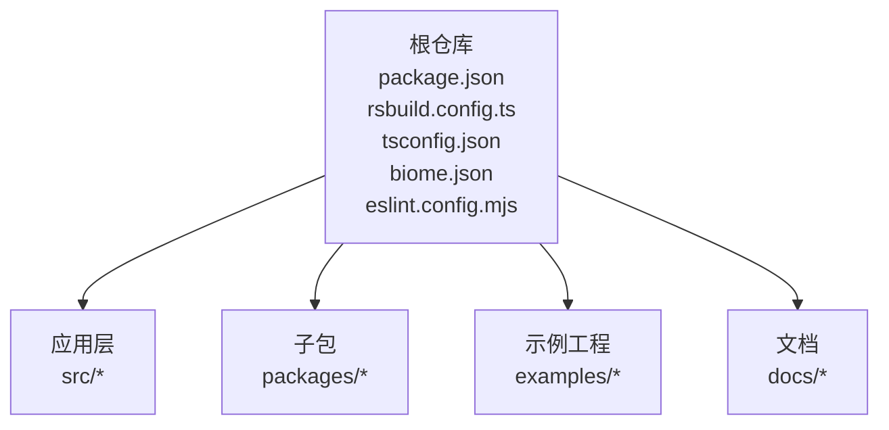
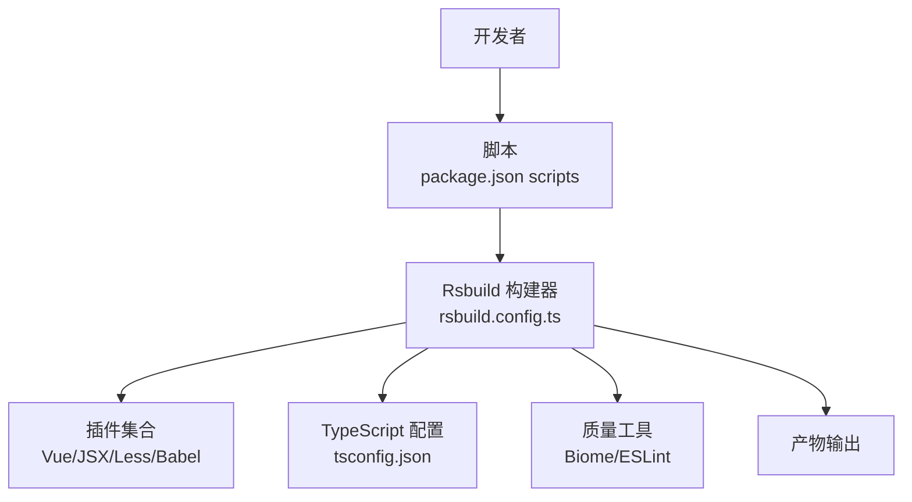
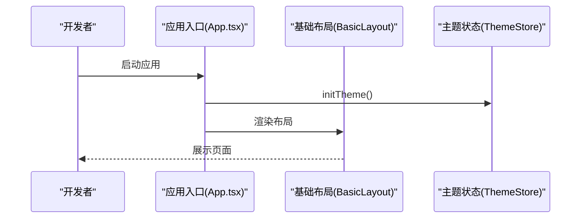
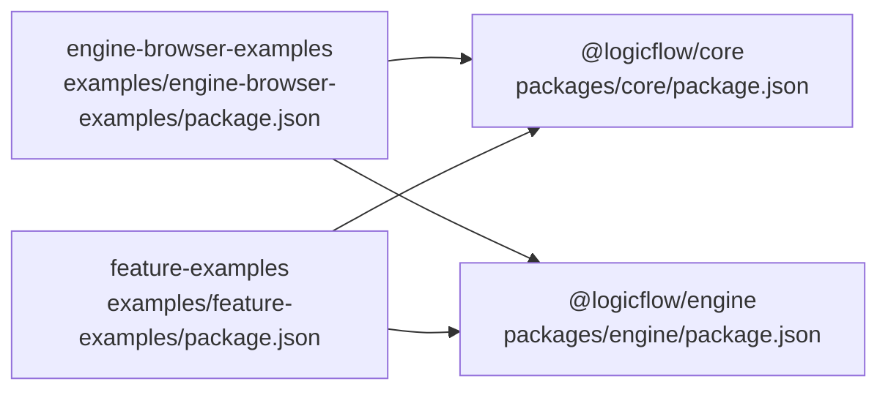
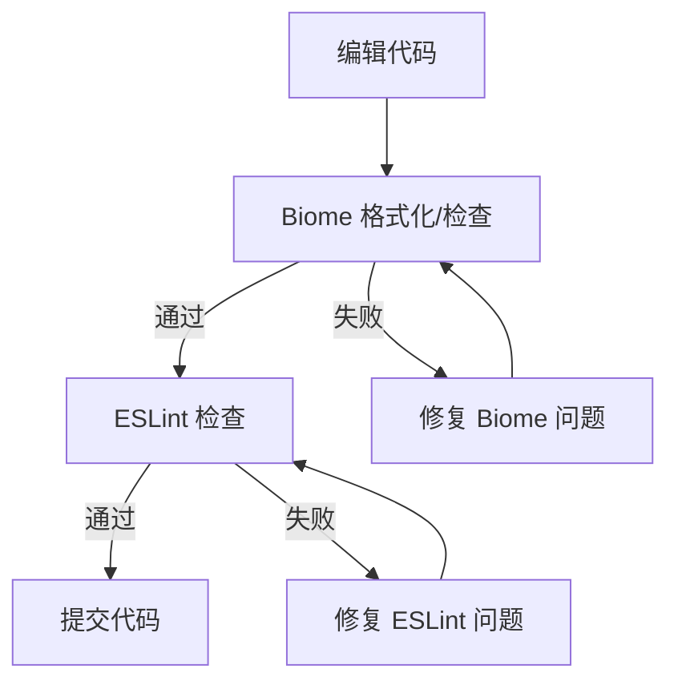
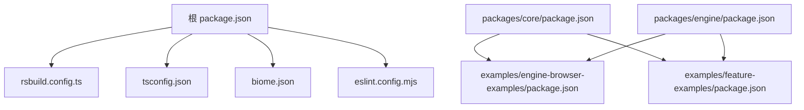

# 团队协作模式

<cite>
**本文引用的文件**
- [package.json](file://package.json)
- [README.md](file://README.md)
- [AGENTS.md](file://AGENTS.md)
- [biome.json](file://biome.json)
- [eslint.config.mjs](file://eslint.config.mjs)
- [rsbuild.config.ts](file://rsbuild.config.ts)
- [tsconfig.json](file://tsconfig.json)
- [src/router/routes.ts](file://src/router/routes.ts)
- [src/App.tsx](file://src/App.tsx)
- [packages/core/package.json](file://packages/core/package.json)
- [packages/engine/package.json](file://packages/engine/package.json)
- [examples/engine-browser-examples/package.json](file://examples/engine-browser-examples/package.json)
- [examples/feature-examples/package.json](file://examples/feature-examples/package.json)
- [docs/提示词.md](file://docs/提示词.md)
</cite>

## 目录
1. [引言](#引言)
2. [项目结构](#项目结构)
3. [核心组件](#核心组件)
4. [架构总览](#架构总览)
5. [详细组件分析](#详细组件分析)
6. [依赖关系分析](#依赖关系分析)
7. [性能考虑](#性能考虑)
8. [故障排查指南](#故障排查指南)
9. [结论](#结论)
10. [附录](#附录)

## 引言
本指南面向采用 Monorepo 架构的团队，围绕多包管理与版本控制、Git 工作流与分支管理、代码审查与质量保障、任务分配与进度跟踪、文档维护与知识传承、跨团队沟通与冲突解决、以及新成员入职与培训等维度，提供可落地的协作模式与最佳实践。项目以 Rsbuild 为构建工具，结合 Biome、ESLint 等工具链，形成统一的开发体验与质量基线。

## 项目结构
该项目采用 Monorepo 结构，根目录包含应用层与多个子包（packages），同时提供多类示例工程（examples）。整体组织遵循“根仓库 + 多包 + 示例”的模式，便于统一版本、共享工具链与复用能力。

- 根应用与基础设施
  - 应用入口与路由：src 目录下的应用入口、布局、路由与视图组件
  - 构建与类型配置：rsbuild.config.ts、tsconfig.json
  - 质量工具：biome.json、eslint.config.mjs
  - 启动与脚本：package.json 中的 scripts 定义
- 子包（packages）
  - @logicflow/core、@logicflow/engine 等逻辑流相关包
  - 示例工程（examples）：浏览器端示例、Umi 示例等
- 文档与提示
  - docs/ 提示词.md 用于指导前端组件开发规范与目录规划



**章节来源**
- file://package.json#L1-L45
- file://rsbuild.config.ts#L1-L30
- file://tsconfig.json#L1-L33
- file://biome.json#L1-L35
- file://eslint.config.mjs#L1-L24

## 核心组件
- 应用入口与布局
  - 应用入口负责初始化主题并挂载基础布局组件
  - 布局组件承载侧边栏、菜单与内容区域
- 路由体系
  - 常驻路由与动态路由分离，支持权限与懒加载
  - 菜单项与路由元信息解耦，便于统一管理
- 构建与开发环境
  - Rsbuild 配置启用 Vue、JSX、Less 插件，设置路径别名与开发服务器行为
  - TypeScript 严格模式与路径映射，提升类型安全与开发体验
- 质量工具
  - Biome：格式化、导入排序、VCS 集成
  - ESLint：Vue/TS 规则集，覆盖 .vue、ts、tsx 文件

**章节来源**
- file://src/App.tsx#L1-L20
- file://src/router/routes.ts#L1-L215
- file://rsbuild.config.ts#L1-L30
- file://tsconfig.json#L1-L33
- file://biome.json#L1-L35
- file://eslint.config.mjs#L1-L24

## 架构总览
下图展示从开发者到构建产物的协作路径：开发者通过脚本启动开发服务器，Rsbuild 加载插件与配置，Biome/ESLint 在编辑器或提交阶段执行质量检查；最终产物由 Rsbuild 打包输出。



**图表来源**
- [package.json](file://package.json#L6-L12)
- [rsbuild.config.ts](file://rsbuild.config.ts#L10-L29)
- [tsconfig.json](file://tsconfig.json#L1-L33)
- [biome.json](file://biome.json#L1-L35)
- [eslint.config.mjs](file://eslint.config.mjs#L1-L24)

## 详细组件分析

### 路由与菜单组件
- 路由设计
  - 常驻路由：登录、404 等无需鉴权页面
  - 动态路由：仪表盘、流程设计、系统管理、组件示例、嵌套菜单等
  - 权限字段与图标、排序等元信息内聚于路由配置
- 菜单渲染
  - 建议在侧边栏组件中读取路由元信息生成菜单树
  - 支持多级菜单与重定向，保持与路由结构一致

```mermaid
flowchart TD
start(["进入应用"]) --> load_routes["加载路由配置"]
load_routes --> classify{"是否为常驻路由"}
classify --> |是| render_static["渲染静态菜单项"]
classify --> |否| check_auth{"是否满足权限"}
check_auth --> |是| render_dynamic["渲染动态菜单项"]
check_auth --> |否| skip["跳过该菜单项"]
render_static --> end(["完成"])
render_dynamic --> end
skip --> end
```

**章节来源**
- file://src/router/routes.ts#L1-L215

### 应用入口与主题初始化
- 入口职责
  - 初始化主题状态，确保全局样式与主题变量生效
  - 渲染基础布局，承载页面主体内容
- 建议
  - 将主题初始化逻辑集中于入口组件，避免分散初始化导致的样式闪烁



**章节来源**
- file://src/App.tsx#L1-L20

### 多包与工作区依赖
- 子包
  - @logicflow/core、@logicflow/engine 等作为独立包发布与消费
- 示例工程
  - engine-browser-examples、feature-examples 通过 workspace:* 指向本地子包，实现联调与快速迭代
- 版本与发布
  - 建议采用统一版本策略（如语义化版本），在变更子包时同步更新依赖范围与示例工程中的 workspace:* 映射



**图表来源**
- [packages/core/package.json](file://packages/core/package.json#L1-L57)
- [packages/engine/package.json](file://packages/engine/package.json#L1-L50)
- [examples/engine-browser-examples/package.json](file://examples/engine-browser-examples/package.json#L1-L39)
- [examples/feature-examples/package.json](file://examples/feature-examples/package.json#L1-L29)

**章节来源**
- file://packages/core/package.json#L1-L57
- file://packages/engine/package.json#L1-L50
- file://examples/engine-browser-examples/package.json#L1-L39
- file://examples/feature-examples/package.json#L1-L29

### 质量工具链（Biome 与 ESLint）
- Biome
  - 自动格式化、导入排序、VCS 集成，减少风格分歧
  - 推荐在提交前运行格式化与检查，避免 CI 失败
- ESLint
  - 基于 Vue/TS 规则集，覆盖 .vue、ts、tsx 文件
  - 建议在 IDE 中启用 ESLint 实时检查，配合 Biome 统一风格



**章节来源**
- file://biome.json#L1-L35
- file://eslint.config.mjs#L1-L24

## 依赖关系分析
- 根依赖与开发依赖
  - 根 package.json 定义了构建、预览、格式化、检查等脚本
  - 开发依赖包括 Rsbuild 插件、Vue/TS 类型、ESLint、Biome 等
- 子包依赖
  - 子包各自声明内部依赖与导出规范（main/module/types/unpkg/jsdelivr）
- 示例工程依赖
  - 通过 workspace:* 与子包建立本地联调关系，降低集成成本



**图表来源**
- [package.json](file://package.json#L1-L45)
- [rsbuild.config.ts](file://rsbuild.config.ts#L1-L30)
- [tsconfig.json](file://tsconfig.json#L1-L33)
- [biome.json](file://biome.json#L1-L35)
- [eslint.config.mjs](file://eslint.config.mjs#L1-L24)
- [packages/core/package.json](file://packages/core/package.json#L1-L57)
- [packages/engine/package.json](file://packages/engine/package.json#L1-L50)
- [examples/engine-browser-examples/package.json](file://examples/engine-browser-examples/package.json#L1-L39)
- [examples/feature-examples/package.json](file://examples/feature-examples/package.json#L1-L29)

**章节来源**
- file://package.json#L1-L45
- file://packages/core/package.json#L1-L57
- file://packages/engine/package.json#L1-L50
- file://examples/engine-browser-examples/package.json#L1-L39
- file://examples/feature-examples/package.json#L1-L29

## 性能考虑
- 构建性能
  - 使用 Rsbuild 的插件化配置，按需启用 Vue/JSX/Less/Babel，避免不必要的转换
  - 合理拆分路由与组件，利用懒加载减少首屏体积
- 运行性能
  - TypeScript 严格模式与 noEmit/noUncheckedSideEffectImports 等选项有助于早期发现潜在问题
  - Biome/ESLint 在本地即时反馈，减少调试成本
- 可观测性
  - 建议在示例工程中加入性能监控与错误上报，便于回归与问题定位

## 故障排查指南
- 启动失败
  - 检查 Node 版本与包管理器版本，确保与项目要求一致
  - 清理缓存后重新安装依赖，确认 Rsbuild 插件与配置正确加载
- 路由不生效
  - 核对路由配置与菜单元信息是否匹配，确认重定向与懒加载路径正确
- 质量检查失败
  - 先运行 Biome 格式化与检查，再运行 ESLint，逐条修复问题
- 子包联调异常
  - 确认示例工程依赖指向 workspace:*，并在子包与示例工程之间保持版本范围一致

**章节来源**
- file://README.md#L1-L37
- file://AGENTS.md#L1-L26
- file://biome.json#L1-L35
- file://eslint.config.mjs#L1-L24
- file://examples/engine-browser-examples/package.json#L1-L39
- file://examples/feature-examples/package.json#L1-L29

## 结论
本项目以 Rsbuild 为核心，结合 Biome 与 ESLint 形成了统一的质量基线与开发体验。通过 Monorepo 的多包与示例工程协同，团队可以在保证一致性的同时提升协作效率。建议在现有基础上完善 Git 工作流、代码审查与任务管理流程，持续沉淀文档与知识，确保团队长期稳定发展。

## 附录
- 快速开始
  - 安装依赖与启动开发服务器
  - 访问本地服务进行功能验证
- 质量基线
  - 提交前务必运行格式化与检查
  - 遵循 ESLint/Vue/TS 规范，保持代码风格一致
- 文档与提示
  - 参考 docs/ 提示词.md 的组件开发规范与目录规划建议

**章节来源**
- file://README.md#L1-L37
- file://docs/提示词.md#L1-L11