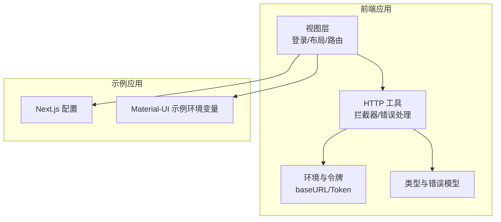
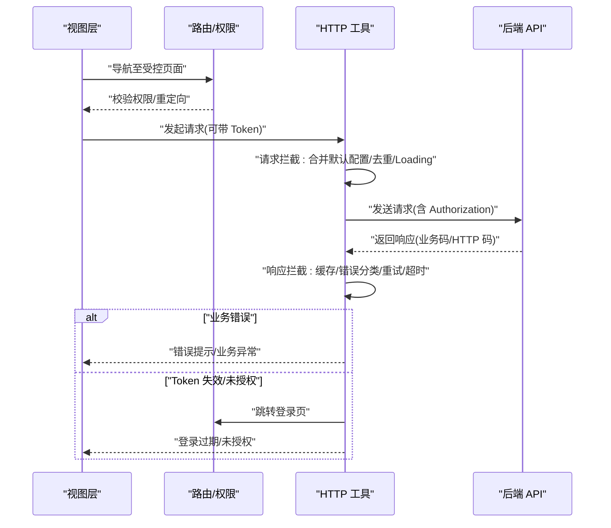
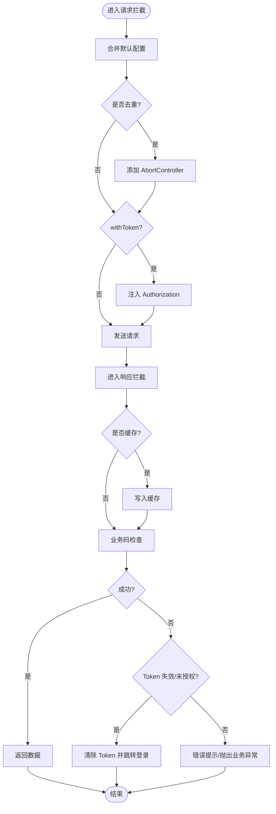
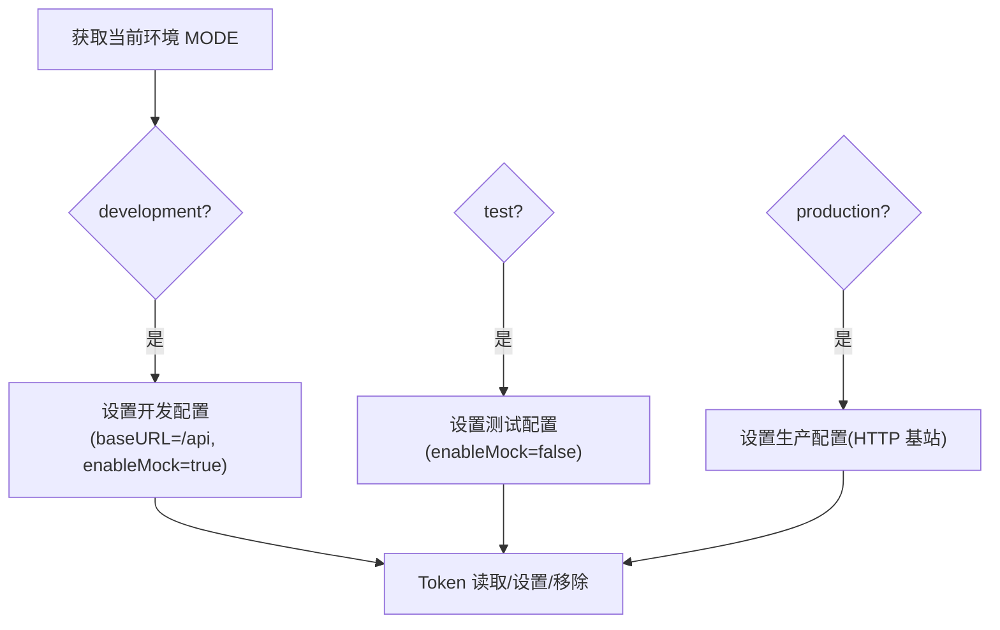
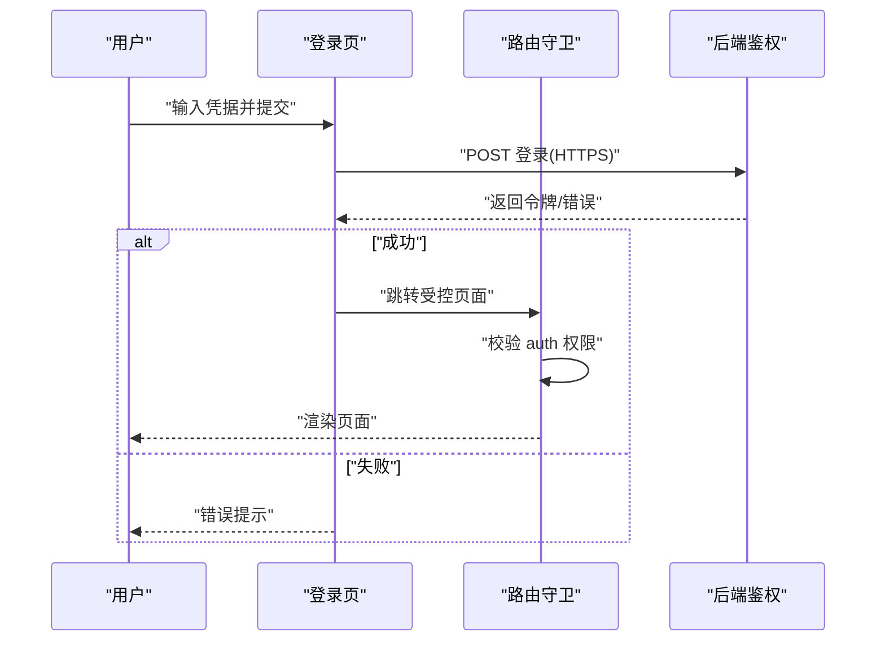
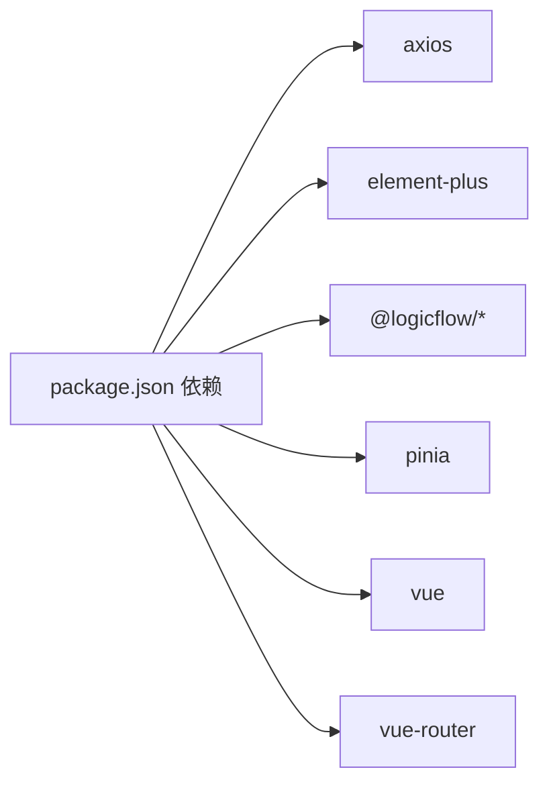
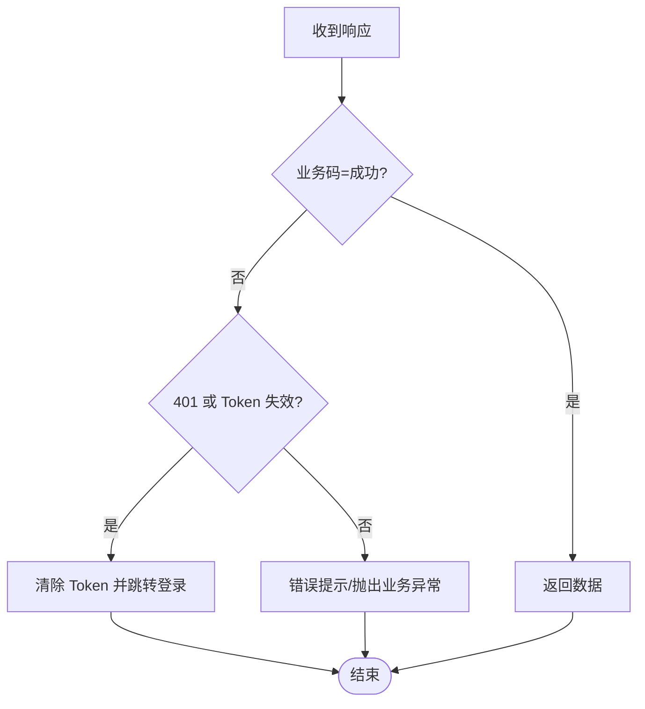

# 安全性考虑

<cite>
**本文引用的文件**
- [package.json](file://package.json)
- [http.ts](file://src/utils/http.ts)
- [env.ts](file://src/config/env.ts)
- [http 类型定义](file://src/types/http.ts)
- [登录页面](file://src/views/login/index.tsx)
- [路由与权限配置](file://src/router/routes.ts)
- [主题存储与应用](file://src/stores/theme.ts)
- [基础布局](file://src/layouts/BasicLayout.tsx)
- [API 统一导出](file://src/api/index.ts)
- [Next.js 配置](file://examples/next-app/next.config.mjs)
- [Material-UI 示例环境变量](file://examples/material-ui-demo/.env)
</cite>

## 目录
1. [引言](#引言)
2. [项目结构](#项目结构)
3. [核心组件](#核心组件)
4. [架构总览](#架构总览)
5. [详细组件分析](#详细组件分析)
6. [依赖分析](#依赖分析)
7. [性能考虑](#性能考虑)
8. [故障排查指南](#故障排查指南)
9. [结论](#结论)
10. [附录](#附录)

## 引言
本指南围绕项目在前端与示例应用中的安全实践展开，重点覆盖输入验证与输出编码、身份认证与授权、数据传输与存储保护、常见威胁（XSS、CSRF、注入）的防护策略、敏感信息处理与隐私保护、第三方依赖的安全审计与漏洞管理、安全配置与环境隔离，以及安全测试与渗透测试的实施建议。文档以代码为依据，结合可视化图示帮助读者快速理解与落地。

## 项目结构
该项目采用 Vue 3 + TypeScript + Rsbuild 构建，核心安全相关模块集中在以下位置：
- HTTP 通信与拦截：src/utils/http.ts
- 环境与令牌管理：src/config/env.ts
- 类型与错误模型：src/types/http.ts
- 登录与路由权限：src/views/login/index.tsx、src/router/routes.ts
- 主题与本地存储：src/stores/theme.ts、src/layouts/BasicLayout.tsx
- API 统一导出：src/api/index.ts
- 示例应用与环境变量：examples/next-app/next.config.mjs、examples/material-ui-demo/.env

**图表来源**
- [http.ts](file://src/utils/http.ts#L1-L534)
- [env.ts](file://src/config/env.ts#L1-L120)
- [http 类型定义](file://src/types/http.ts#L1-L139)
- [登录页面](file://src/views/login/index.tsx#L1-L50)
- [路由与权限配置](file://src/router/routes.ts#L1-L215)
- [Next.js 配置](file://examples/next-app/next.config.mjs#L1-L5)
- [Material-UI 示例环境变量](file://examples/material-ui-demo/.env#L1-L3)

**章节来源**
- [package.json](file://package.json#L1-L45)
- [http.ts](file://src/utils/http.ts#L1-L534)
- [env.ts](file://src/config/env.ts#L1-L120)
- [http 类型定义](file://src/types/http.ts#L1-L139)
- [登录页面](file://src/views/login/index.tsx#L1-L50)
- [路由与权限配置](file://src/router/routes.ts#L1-L215)
- [Next.js 配置](file://examples/next-app/next.config.mjs#L1-L5)
- [Material-UI 示例环境变量](file://examples/material-ui-demo/.env#L1-L3)

## 核心组件
- HTTP 工具与拦截器：统一请求/响应处理、Token 注入、错误分类与提示、重复请求取消、缓存控制、重试与超时处理。
- 环境与令牌：按环境切换 baseURL、超时、Mock 开关；Token 读取/写入/移除；业务与 HTTP 状态码映射。
- 类型与错误模型：统一响应结构、请求配置扩展、错误类型枚举与工厂函数。
- 登录与路由：登录页占位、路由元信息中的权限标记（auth）、404 与兜底路由。
- 主题与本地存储：主题模式持久化与 DOM 应用，注意避免敏感信息写入本地存储。
- API 统一导出：集中导出类型与 HTTP 工具，便于全局使用。

**章节来源**
- [http.ts](file://src/utils/http.ts#L1-L534)
- [env.ts](file://src/config/env.ts#L1-L120)
- [http 类型定义](file://src/types/http.ts#L1-L139)
- [登录页面](file://src/views/login/index.tsx#L1-L50)
- [路由与权限配置](file://src/router/routes.ts#L1-L215)
- [主题存储与应用](file://src/stores/theme.ts#L1-L111)
- [API 统一导出](file://src/api/index.ts#L1-L17)

## 架构总览
下图展示从前端到后端的典型请求路径与安全控制点，包括 Token 注入、错误分类、权限跳转与资源访问控制。

**图表来源**
- [http.ts](file://src/utils/http.ts#L188-L361)
- [env.ts](file://src/config/env.ts#L62-L90)
- [路由与权限配置](file://src/router/routes.ts#L26-L113)
- [登录页面](file://src/views/login/index.tsx#L1-L50)

## 详细组件分析

### HTTP 工具与安全拦截
- 请求拦截：合并默认配置、去重请求、显示/隐藏 Loading、注入 Token。
- 响应拦截：缓存 GET 响应、业务码判定、Token 失效处理（跳转登录）、错误提示与分类、网络/超时/取消/HTTP 状态码处理、服务端 5xx 自动重试。
- 文件上传/下载：构造 multipart/form-data、进度回调、Blob 下载与 URL revoke。
- 并发与重复请求：通过请求键值与 AbortController 避免重复提交。
- 错误模型：统一 HttpError 结构，区分网络、HTTP、业务、超时、取消等类型。

**图表来源**
- [http.ts](file://src/utils/http.ts#L188-L361)
- [http 类型定义](file://src/types/http.ts#L70-L96)

**章节来源**
- [http.ts](file://src/utils/http.ts#L1-L534)
- [http 类型定义](file://src/types/http.ts#L1-L139)

### 环境与令牌管理
- 环境配置：根据 MODE 自动选择 development/test/production，分别设置 baseURL、超时、Mock 开关。
- 令牌管理：localStorage 中存储 access_token 与 refresh_token，提供读取/设置/移除；业务状态码与 HTTP 状态码映射。
- 安全建议：生产环境 baseURL 必须为 HTTPS；避免在客户端存储敏感信息；定期轮换 refresh_token。

**图表来源**
- [env.ts](file://src/config/env.ts#L9-L59)
- [env.ts](file://src/config/env.ts#L62-L90)

**章节来源**
- [env.ts](file://src/config/env.ts#L1-L120)

### 登录与路由权限
- 登录页：提供用户名/密码输入与登录按钮（当前为占位逻辑，实际需对接鉴权接口）。
- 路由权限：部分路由元信息包含 auth 数组，用于标识所需权限或角色；404 路由兜底。
- 安全建议：登录接口必须使用 HTTPS；登录成功后仅存储短期访问令牌；对受控页面进行守卫校验。

**图表来源**
- [登录页面](file://src/views/login/index.tsx#L15-L18)
- [路由与权限配置](file://src/router/routes.ts#L26-L113)

**章节来源**
- [登录页面](file://src/views/login/index.tsx#L1-L50)
- [路由与权限配置](file://src/router/routes.ts#L1-L215)

### 主题与本地存储
- 主题持久化：将主题模式写入 localStorage，并应用到 HTML class，支持跟随系统。
- 安全建议：避免在 localStorage 中存储任何敏感信息；如需持久化用户偏好，确保不包含令牌或密钥。

**章节来源**
- [主题存储与应用](file://src/stores/theme.ts#L1-L111)
- [基础布局](file://src/layouts/BasicLayout.tsx#L1-L146)

### API 统一导出
- 将类型与 HTTP 工具集中导出，便于全局复用，减少分散风险。

**章节来源**
- [API 统一导出](file://src/api/index.ts#L1-L17)

## 依赖分析
- 第三方依赖：axios、element-plus、@logicflow/*、pinia、vue、vue-router 等。
- 安全关注点：确保依赖版本更新至安全基线；定期扫描漏洞；对 UI 组件库与逻辑流库进行供应链审计。

**图表来源**
- [package.json](file://package.json#L14-L26)

**章节来源**
- [package.json](file://package.json#L1-L45)

## 性能考虑
- 请求去重：通过请求键值与 AbortController 避免重复请求，降低带宽与服务器压力。
- 缓存策略：GET 请求可启用内存缓存，提升用户体验，但需注意缓存过期与一致性。
- Loading 控制：统一 Loading 计数，避免重复打开/关闭导致的 UI 卡顿。
- 重试与超时：对 5xx 与网络错误进行有限次重试，防止雪崩效应。

**章节来源**
- [http.ts](file://src/utils/http.ts#L44-L101)
- [http.ts](file://src/utils/http.ts#L236-L240)
- [http.ts](file://src/utils/http.ts#L299-L308)
- [http.ts](file://src/utils/http.ts#L347-L352)

## 故障排查指南
- 登录过期/未授权：响应拦截器检测业务码与 HTTP 状态码 401，触发清除 Token 并跳转登录。
- 业务错误：统一错误提示与 HttpError 包装，便于前端统一处理。
- 网络/超时/取消：区分错误类型，提供重试与用户提示。
- 文件上传/下载：确认 Content-Type 与 Blob 下载 URL 回收，避免内存泄漏。

**图表来源**
- [http.ts](file://src/utils/http.ts#L242-L273)
- [env.ts](file://src/config/env.ts#L91-L100)

**章节来源**
- [http.ts](file://src/utils/http.ts#L242-L273)
- [env.ts](file://src/config/env.ts#L91-L100)

## 结论
本项目在前端层面已具备较为完善的 HTTP 通信与错误处理框架，并通过环境与令牌管理、路由权限标记与登录页占位，为后续接入真实鉴权体系打下基础。建议在后续迭代中补充：
- 登录接口与路由守卫的完整实现；
- 输入验证与输出编码策略；
- CSRF 与 XSS 防护；
- 数据传输与存储加密；
- 第三方依赖的安全审计与漏洞管理；
- 安全配置与环境隔离；
- 安全测试与渗透测试实施。

## 附录

### 常见威胁与防护策略
- XSS（跨站脚本）
  - 输入验证：对用户输入进行白名单过滤与长度限制。
  - 输出编码：在模板渲染与 DOM 插入前进行 HTML/JS 编码。
  - 内容安全策略（CSP）：严格限制脚本来源与执行上下文。
- CSRF（跨站请求伪造）
  - 同源策略与 CORS：确保仅允许可信域名调用。
  - Token 校验：服务端校验请求头或自定义字段，避免浏览器自动携带 Cookie。
  - SameSite Cookie：限制第三方上下文中的 Cookie 发送。
- 注入攻击（SQL/命令/模板）
  - 参数化查询与白名单：禁止拼接用户输入到 SQL/命令。
  - 最小权限原则：数据库与系统账户仅授予必要权限。
  - 日志脱敏：避免记录敏感参数与明文令牌。
- 传输与存储安全
  - 传输：强制 HTTPS，禁用 HTTP；HSTS 启用；TLS 版本与套件升级。
  - 存储：敏感信息加密存储；最小化本地存储使用；定期轮换密钥。
- 敏感信息与隐私
  - 令牌与密钥：不在前端持久化；使用短期令牌与刷新令牌轮换。
  - 隐私数据：遵循最小化原则；提供用户删除与导出功能。
- 第三方依赖与漏洞管理
  - 依赖清单与版本锁定；定期扫描与升级；供应链审计。
- 安全配置与环境隔离
  - 不同环境使用独立配置；生产环境禁用 Mock；严格区分开发/测试/生产。
- 安全测试与渗透测试
  - 自动化扫描：SAST/DAST/Secrets 扫描；CI 集成。
  - 手工测试：边界输入、越权访问、会话劫持等场景验证。

### 示例应用与环境变量
- Next.js 配置：保持默认，确保构建产物安全。
- Material-UI 示例环境变量：避免泄露敏感信息；生产环境关闭 SourceMap。

**章节来源**
- [Next.js 配置](file://examples/next-app/next.config.mjs#L1-L5)
- [Material-UI 示例环境变量](file://examples/material-ui-demo/.env#L1-L3)