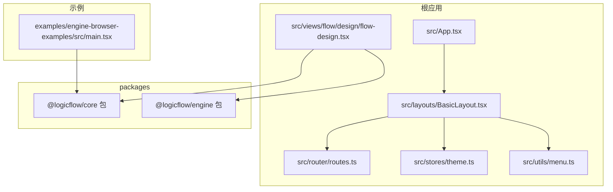
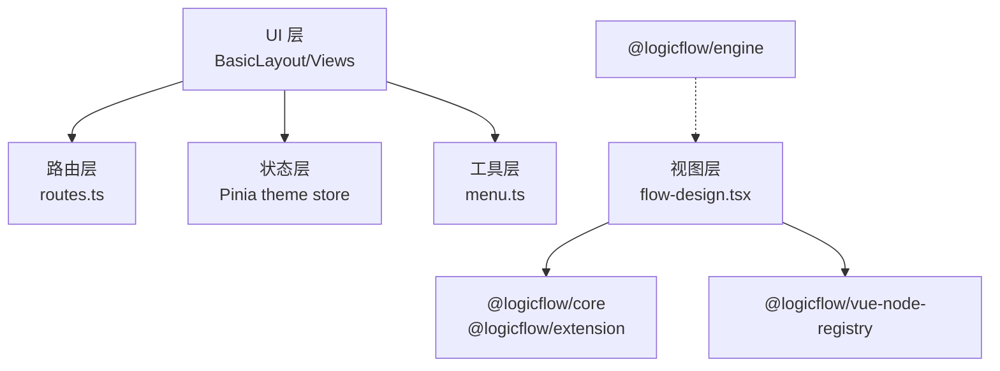
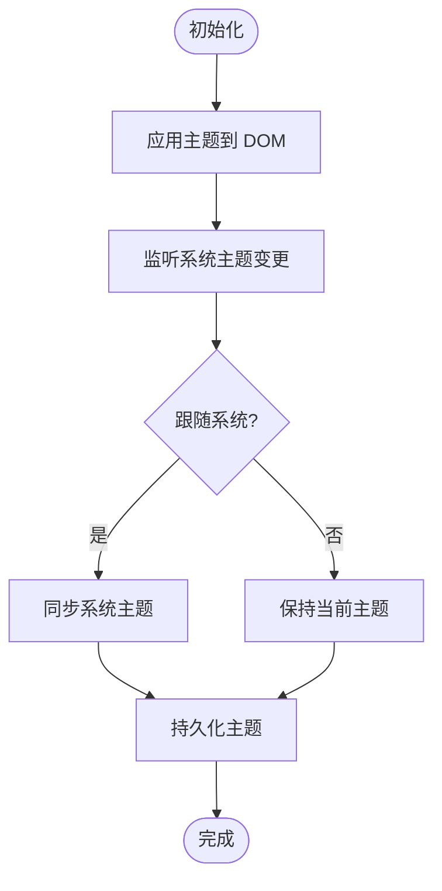
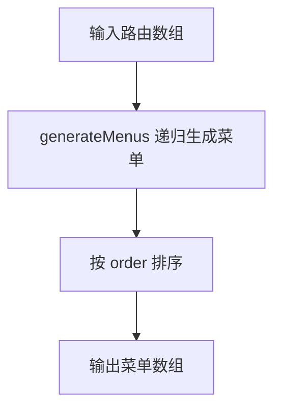
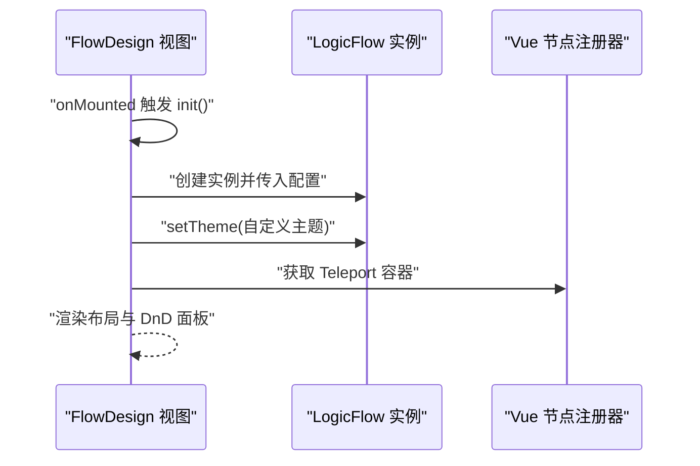
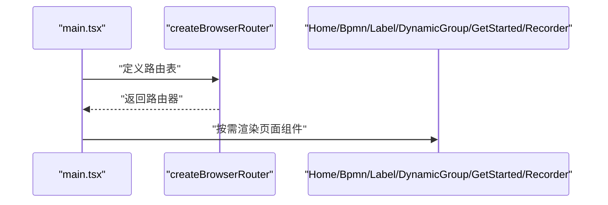
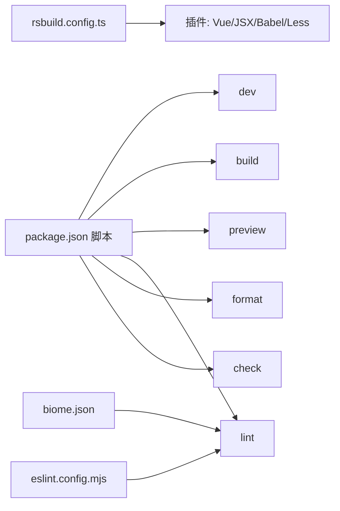

# 最佳实践

<cite>
**本文引用的文件**
- [package.json](file://package.json)
- [README.md](file://README.md)
- [eslint.config.mjs](file://eslint.config.mjs)
- [biome.json](file://biome.json)
- [rsbuild.config.ts](file://rsbuild.config.ts)
- [src/App.tsx](file://src/App.tsx)
- [src/router/routes.ts](file://src/router/routes.ts)
- [src/stores/theme.ts](file://src/stores/theme.ts)
- [src/layouts/BasicLayout.tsx](file://src/layouts/BasicLayout.tsx)
- [src/utils/menu.ts](file://src/utils/menu.ts)
- [src/views/flow/design/flow-design.tsx](file://src/views/flow/design/flow-design.tsx)
- [examples/engine-browser-examples/src/main.tsx](file://examples/engine-browser-examples/src/main.tsx)
- [packages/core/package.json](file://packages/core/package.json)
- [packages/engine/package.json](file://packages/engine/package.json)
</cite>

## 目录
1. [引言](#引言)
2. [项目结构](#项目结构)
3. [核心组件](#核心组件)
4. [架构总览](#架构总览)
5. [详细组件分析](#详细组件分析)
6. [依赖关系分析](#依赖关系分析)
7. [性能考量](#性能考量)
8. [故障排查指南](#故障排查指南)
9. [结论](#结论)
10. [附录](#附录)

## 引言
本指南面向技术负责人与高级开发者，系统总结本项目在开发、构建、测试、部署与维护过程中的经验与教训，提炼可复用的开发模式与设计原则，覆盖代码规范、命名约定、架构设计、重构策略、团队协作与版本控制、安全与可扩展性、以及长期可维护性与可升级性的指导原则。

## 项目结构
本项目采用多包工作区与示例工程并存的组织方式：
- 根目录应用：基于 Vue3 + Rsbuild 的中后台前端应用，集成 LogicFlow 流程图能力。
- packages 子包：LogicFlow 核心与引擎等子包，作为可复用模块发布。
- examples 示例：包含 React/Vue3/Next 等多框架示例，用于演示与验证能力边界。
- 工程配置：Rsbuild 构建、Biome 格式化与 Lint、ESLint 规则统一。

图表来源
- [src/App.tsx](file://src/App.tsx#L1-L20)
- [src/layouts/BasicLayout.tsx](file://src/layouts/BasicLayout.tsx#L1-L146)
- [src/router/routes.ts](file://src/router/routes.ts#L1-L215)
- [src/stores/theme.ts](file://src/stores/theme.ts#L1-L111)
- [src/utils/menu.ts](file://src/utils/menu.ts#L1-L172)
- [src/views/flow/design/flow-design.tsx](file://src/views/flow/design/flow-design.tsx#L1-L129)
- [packages/core/package.json](file://packages/core/package.json#L1-L57)
- [packages/engine/package.json](file://packages/engine/package.json#L1-L50)
- [examples/engine-browser-examples/src/main.tsx](file://examples/engine-browser-examples/src/main.tsx#L1-L78)

章节来源
- [package.json](file://package.json#L1-L45)
- [rsbuild.config.ts](file://rsbuild.config.ts#L1-L30)
- [README.md](file://README.md#L1-L37)

## 核心组件
- 应用入口与主题初始化：应用入口负责初始化主题状态，布局组件承载面包屑、侧边栏与内容区，主题状态通过 Pinia 管理并在 DOM 上应用。
- 路由与菜单：路由配置采用分层结构，动态路由与权限元数据结合，菜单生成器负责从路由树生成菜单树，并支持扁平化、路径解析、权限过滤等。
- 流程设计器：集成 LogicFlow 核心与扩展，提供拖拽面板、画布初始化、键盘快捷键、网格背景、贝塞尔/折线边等能力，并通过 Vue 节点注册器桥接组件。

章节来源
- [src/App.tsx](file://src/App.tsx#L1-L20)
- [src/stores/theme.ts](file://src/stores/theme.ts#L1-L111)
- [src/layouts/BasicLayout.tsx](file://src/layouts/BasicLayout.tsx#L1-L146)
- [src/router/routes.ts](file://src/router/routes.ts#L1-L215)
- [src/utils/menu.ts](file://src/utils/menu.ts#L1-L172)
- [src/views/flow/design/flow-design.tsx](file://src/views/flow/design/flow-design.tsx#L1-L129)

## 架构总览
整体采用“应用层 + 业务视图层 + 通用工具层 + 外部库/扩展”的分层架构。应用层负责启动与主题；业务视图层承载具体页面与交互；工具层提供菜单生成、HTTP、路由等通用能力；外部库通过 LogicFlow 生态提供可视化与流程引擎能力。

图表来源
- [src/layouts/BasicLayout.tsx](file://src/layouts/BasicLayout.tsx#L1-L146)
- [src/router/routes.ts](file://src/router/routes.ts#L1-L215)
- [src/stores/theme.ts](file://src/stores/theme.ts#L1-L111)
- [src/utils/menu.ts](file://src/utils/menu.ts#L1-L172)
- [src/views/flow/design/flow-design.tsx](file://src/views/flow/design/flow-design.tsx#L1-L129)
- [packages/core/package.json](file://packages/core/package.json#L1-L57)
- [packages/engine/package.json](file://packages/engine/package.json#L1-L50)

## 详细组件分析

### 主题与状态管理（Pinia）
- 设计要点：集中式主题状态，支持跟随系统、持久化、DOM 类名切换与响应式更新。
- 关键行为：初始化时应用当前主题；监听系统主题变化；提供切换与设置接口；默认深色模式并回退安全值。

图表来源
- [src/stores/theme.ts](file://src/stores/theme.ts#L82-L94)

章节来源
- [src/stores/theme.ts](file://src/stores/theme.ts#L1-L111)
- [src/App.tsx](file://src/App.tsx#L1-L20)
- [src/layouts/BasicLayout.tsx](file://src/layouts/BasicLayout.tsx#L68-L71)

### 菜单生成与权限过滤
- 设计要点：从路由配置生成菜单树，支持排序、扁平化、路径解析、外部链接识别与权限过滤。
- 关键行为：递归遍历路由树；按 meta.order 排序；支持 auth 数组匹配；过滤空父级菜单。

图表来源
- [src/utils/menu.ts](file://src/utils/menu.ts#L7-L35)

章节来源
- [src/utils/menu.ts](file://src/utils/menu.ts#L1-L172)
- [src/router/routes.ts](file://src/router/routes.ts#L1-L215)

### 流程设计器（LogicFlow 集成）
- 设计要点：在视图组件中初始化 LogicFlow 实例，设置主题、网格、背景、边类型、键盘等参数；通过 Vue 节点注册器桥接组件。
- 关键行为：容器挂载后初始化；避免重复初始化；暴露方法对象统一管理初始化逻辑；通过 Teleport 容器渲染自定义节点。

图表来源
- [src/views/flow/design/flow-design.tsx](file://src/views/flow/design/flow-design.tsx#L27-L115)

章节来源
- [src/views/flow/design/flow-design.tsx](file://src/views/flow/design/flow-design.tsx#L1-L129)

### 示例应用（React 路由）
- 设计要点：示例应用使用 React Router v6 的 createBrowserRouter，组织页面路由与错误页。
- 关键行为：根路由与多级子路由；按需加载页面组件；错误页兜底。

图表来源
- [examples/engine-browser-examples/src/main.tsx](file://examples/engine-browser-examples/src/main.tsx#L20-L77)

章节来源
- [examples/engine-browser-examples/src/main.tsx](file://examples/engine-browser-examples/src/main.tsx#L1-L78)

## 依赖关系分析
- 构建与打包：Rsbuild 配置启用 Vue、JSX、Babel、Less 插件，并设置别名 @ 指向 src。
- 规范与质量：Biome 启用格式化、导入整理、推荐规则与 VCS 集成；ESLint 使用 Vue TypeScript 推荐配置。
- 运行与脚本：提供 dev/build/preview/lint/format/check 等常用脚本。

图表来源
- [rsbuild.config.ts](file://rsbuild.config.ts#L1-L30)
- [package.json](file://package.json#L6-L12)
- [biome.json](file://biome.json#L1-L35)
- [eslint.config.mjs](file://eslint.config.mjs#L1-L24)

章节来源
- [rsbuild.config.ts](file://rsbuild.config.ts#L1-L30)
- [package.json](file://package.json#L1-L45)
- [biome.json](file://biome.json#L1-L35)
- [eslint.config.mjs](file://eslint.config.mjs#L1-L24)

## 性能考量
- 构建优化：启用 Rsbuild 插件链，合理拆分与懒加载页面，减少首屏体积。
- 运行时优化：流程图场景建议按需渲染、限制节点数量、关闭不必要的高开销特性（如过多动画），在视图组件中避免重复初始化。
- 主题与样式：主题切换通过类名切换，避免频繁重排；CSS Modules 与 Less 结合提升样式隔离与编译效率。
- 开发体验：Biome 与 ESLint 并行，保证格式化与规则执行一致性，减少 CI/本地差异。

## 故障排查指南
- 主题不生效或闪烁：检查主题初始化调用顺序与 DOM 类名切换逻辑；确认本地存储键名一致。
- 菜单不显示或权限异常：核对路由 meta.auth 与权限列表匹配；检查 generateMenus 的权限过滤逻辑。
- 流程图空白或初始化失败：确认容器存在且仅初始化一次；检查 LogicFlow 配置与主题注入顺序。
- 构建报错或样式异常：检查 Rsbuild 插件启用情况与别名配置；确认 Biome/ESLint 规则未相互冲突。

章节来源
- [src/stores/theme.ts](file://src/stores/theme.ts#L44-L70)
- [src/utils/menu.ts](file://src/utils/menu.ts#L146-L171)
- [src/views/flow/design/flow-design.tsx](file://src/views/flow/design/flow-design.tsx#L27-L115)
- [rsbuild.config.ts](file://rsbuild.config.ts#L10-L29)

## 结论
本项目在工程化、可维护性与可扩展性方面具备良好基础：清晰的分层架构、完善的工具链、可复用的 UI 与流程能力。建议持续强化以下方面：完善单元/集成测试、细化安全扫描与依赖审计、建立规范化的发布与回滚流程、沉淀组件与模式库以降低重复成本。

## 附录

### 代码规范与命名约定
- 文件与目录
  - 页面与视图：小写目录 + PascalCase 文件名（如 views/flow/design/flow-design.tsx）。
  - 组件：PascalCase（如 BasicLayout、ThemeSwitch）。
  - 工具函数：动宾结构（如 generateMenus、resolvePath）。
- 变量与常量
  - 常量：SCREAMING_SNAKE_CASE（如 THEME_STORAGE_KEY）。
  - 变量：camelCase（如 containerRef、lfRef）。
- 路由与菜单
  - 路由 name 使用 PascalCase；meta.title 用于菜单标题；meta.icon 用于图标；meta.order 控制排序；meta.auth 用于权限标识。
- 类型与接口
  - 类型导出统一在 types/index.ts 中聚合；接口字段明确可选/必选。
- 命名空间与别名
  - 构建别名 @ 指向 src，统一导入路径，避免相对层级过深。

章节来源
- [src/router/routes.ts](file://src/router/routes.ts#L1-L215)
- [src/utils/menu.ts](file://src/utils/menu.ts#L1-L172)
- [rsbuild.config.ts](file://rsbuild.config.ts#L24-L28)

### 架构设计最佳实践
- 分层解耦：UI/状态/路由/工具/业务视图分离，职责单一。
- 可插拔扩展：通过 LogicFlow 插件与注册器机制扩展节点与边。
- 配置驱动：路由与菜单通过 meta 字段驱动 UI 行为，便于统一治理。
- 渐进增强：先实现基础功能，再引入复杂特性（如键盘快捷键、自定义主题）。

### 重构策略
- 从路由到菜单：先调整 routes.ts 的 meta 字段，再验证 generateMenus 输出与 UI 表现。
- 从视图到引擎：先在示例工程验证 LogicFlow 能力，再迁移至主应用视图组件。
- 从样式到主题：先统一主题变量与样式命名，再批量替换组件样式。

### 团队协作与版本控制最佳实践
- 分支策略：主分支保护，特性分支开发，PR 必须通过 Lint/格式化检查。
- 提交规范：遵循约定式提交，配合变更集描述。
- 代码评审：关注可读性、可维护性与性能影响。
- 版本发布：语义化版本，变更日志自动化，依赖升级最小化。

### 安全性考虑与防护措施
- 输入校验：对用户输入与外部数据进行严格校验与白名单过滤。
- 权限控制：基于 meta.auth 的菜单与路由权限双层校验。
- 依赖安全：定期扫描依赖漏洞，及时升级关键依赖。
- CSP 与 HTTPS：生产环境启用严格 CSP 与 HTTPS 强制跳转。

### 可扩展性设计指导
- 组件化：将可复用 UI 抽象为独立组件，提供稳定 API。
- 插件化：通过注册器与扩展机制接入新节点/边/布局。
- 数据模型：统一数据模型与序列化协议，便于跨端共享。
- 监控与可观测：埋点与日志分级，关键路径性能监控。

### 维护与升级指导
- 构建工具：Rsbuild 升级前先在示例工程验证，确保插件兼容。
- 依赖升级：优先升级安全相关与核心依赖，逐步推进生态依赖。
- 规范演进：Biome/ESLint 规则随团队成熟度迭代，避免过度约束。
- 文档与知识沉淀：将常见问题与最佳实践沉淀为内部文档与示例。