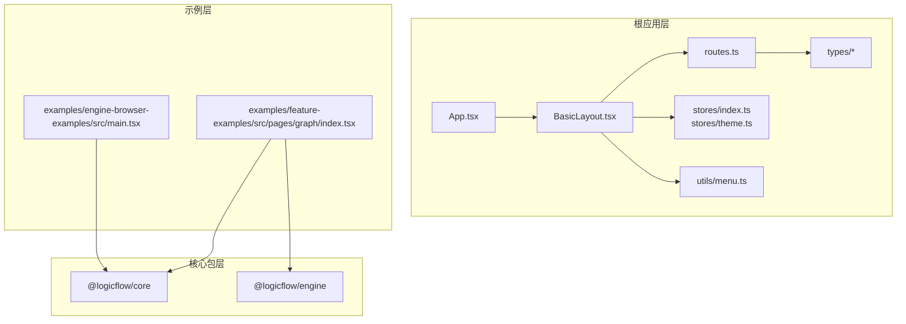
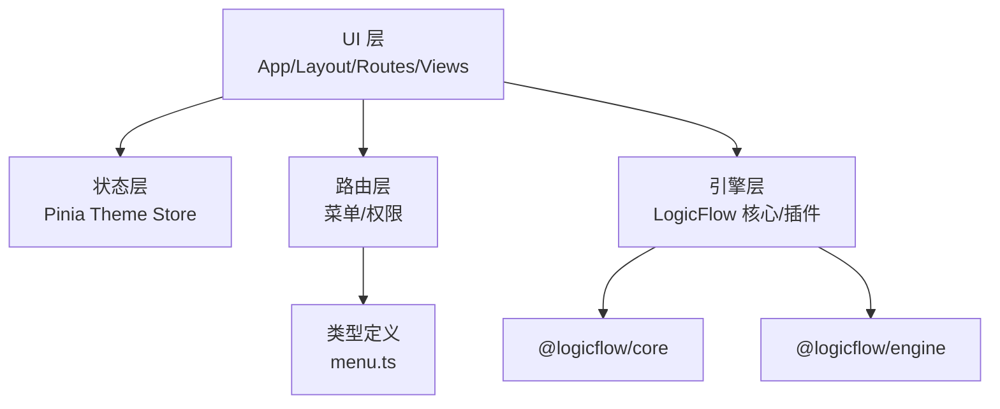
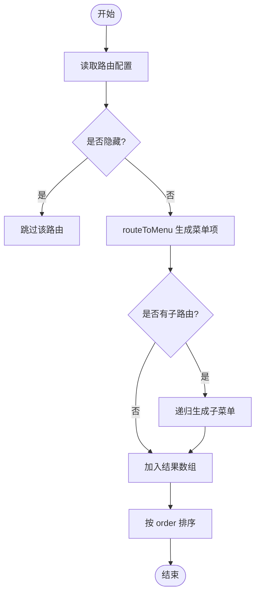
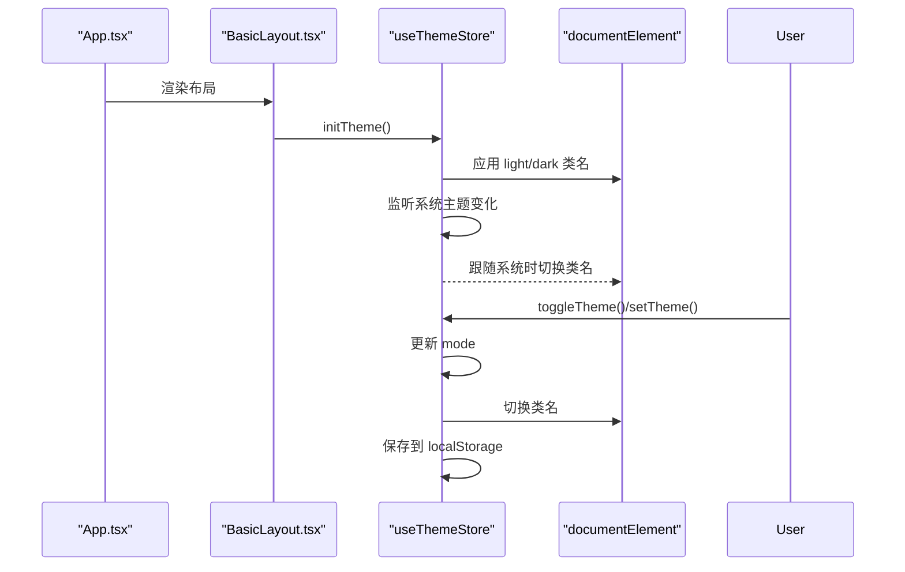
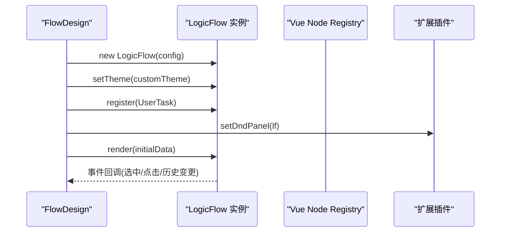
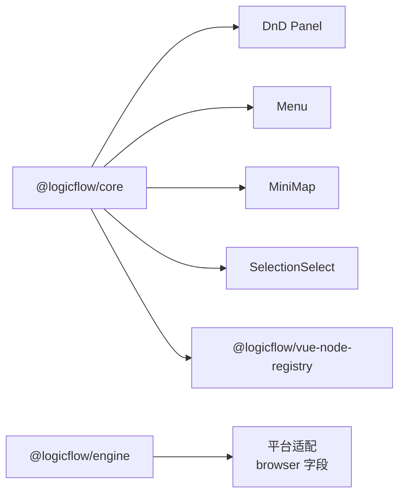
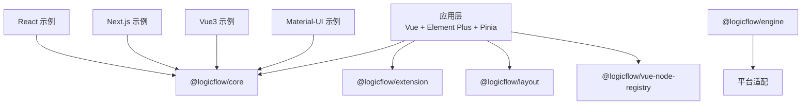

# 架构设计原则

<cite>
**本文引用的文件**
- [package.json](file://package.json)
- [README.md](file://README.md)
- [src/App.tsx](file://src/App.tsx)
- [src/layouts/BasicLayout.tsx](file://src/layouts/BasicLayout.tsx)
- [src/router/routes.ts](file://src/router/routes.ts)
- [src/stores/index.ts](file://src/stores/index.ts)
- [src/stores/theme.ts](file://src/stores/theme.ts)
- [src/types/index.ts](file://src/types/index.ts)
- [src/types/menu.ts](file://src/types/menu.ts)
- [src/utils/menu.ts](file://src/utils/menu.ts)
- [src/views/flow/design/flow-design.tsx](file://src/views/flow/design/flow-design.tsx)
- [examples/engine-browser-examples/src/main.tsx](file://examples/engine-browser-examples/src/main.tsx)
- [examples/feature-examples/src/pages/graph/index.tsx](file://examples/feature-examples/src/pages/graph/index.tsx)
- [packages/core/package.json](file://packages/core/package.json)
- [packages/engine/package.json](file://packages/engine/package.json)
</cite>

## 目录
1. [引言](#引言)
2. [项目结构](#项目结构)
3. [核心组件](#核心组件)
4. [架构总览](#架构总览)
5. [组件与模块详解](#组件与模块详解)
6. [依赖关系分析](#依赖关系分析)
7. [性能与内存考量](#性能与内存考量)
8. [故障排查指南](#故障排查指南)
9. [结论](#结论)
10. [附录：演进与规划](#附录演进与规划)

## 引言
本指南面向架构师与高级开发者，系统阐述该项目的整体架构理念、设计模式与工程实践，重点覆盖以下方面：
- 组件化设计原则：单一职责、开闭原则、依赖倒置等
- 状态管理与数据流：Pinia Store、主题状态、路由与菜单联动
- 插件化架构：LogicFlow 的扩展体系与可插拔能力
- 响应式设计与组件通信：Vue 组合式 API、事件总线与状态驱动
- 性能优化与内存管理：懒加载、按需注册、事件解绑与资源释放
- 演进历史与未来规划：从单页应用到可视化引擎扩展的演进路径

## 项目结构
项目采用“多示例 + 核心包”的组织方式：
- 根应用层：基于 Vue 3 + Ts 的中后台管理界面，负责布局、路由、菜单与主题状态
- 示例层：包含 React、Vue3、Next.js、Material-UI 等多种前端框架的示例，演示 LogicFlow 在不同生态中的集成
- 核心包层：LogicFlow 的核心与引擎包，作为可复用的可视化建模与流程执行能力

图表来源
- [src/App.tsx](file://src/App.tsx#L1-L20)
- [src/layouts/BasicLayout.tsx](file://src/layouts/BasicLayout.tsx#L1-L146)
- [src/router/routes.ts](file://src/router/routes.ts#L1-L215)
- [src/stores/index.ts](file://src/stores/index.ts#L1-L6)
- [src/stores/theme.ts](file://src/stores/theme.ts#L1-L111)
- [src/types/index.ts](file://src/types/index.ts#L1-L3)
- [src/utils/menu.ts](file://src/utils/menu.ts#L1-L172)
- [examples/feature-examples/src/pages/graph/index.tsx](file://examples/feature-examples/src/pages/graph/index.tsx#L1-L800)
- [examples/engine-browser-examples/src/main.tsx](file://examples/engine-browser-examples/src/main.tsx#L1-L78)
- [packages/core/package.json](file://packages/core/package.json#L1-L57)
- [packages/engine/package.json](file://packages/engine/package.json#L1-L50)

章节来源
- [package.json](file://package.json#L1-L45)
- [README.md](file://README.md#L1-L37)

## 核心组件
- 应用入口与布局
  - App.tsx：初始化主题状态，挂载基础布局
  - BasicLayout.tsx：容器布局、侧边栏、面包屑、头部工具栏、路由视图
- 路由与菜单
  - routes.ts：常量路由与异步路由，支持多级菜单与权限元信息
  - utils/menu.ts：从路由生成菜单树、扁平化、路径解析、权限过滤
  - types/menu.ts：菜单与路由的类型定义
- 状态管理
  - stores/index.ts：创建 Pinia 实例
  - stores/theme.ts：主题模式、跟随系统、DOM 应用与持久化
- 流程设计器
  - views/flow/design/flow-design.tsx：集成 LogicFlow，注册节点与 DnD 面板，渲染初始图数据

章节来源
- [src/App.tsx](file://src/App.tsx#L1-L20)
- [src/layouts/BasicLayout.tsx](file://src/layouts/BasicLayout.tsx#L1-L146)
- [src/router/routes.ts](file://src/router/routes.ts#L1-L215)
- [src/utils/menu.ts](file://src/utils/menu.ts#L1-L172)
- [src/types/menu.ts](file://src/types/menu.ts#L1-L122)
- [src/stores/index.ts](file://src/stores/index.ts#L1-L6)
- [src/stores/theme.ts](file://src/stores/theme.ts#L1-L111)
- [src/views/flow/design/flow-design.tsx](file://src/views/flow/design/flow-design.tsx#L1-L146)

## 架构总览
整体采用“应用层 + 示例层 + 核心包层”的分层架构，强调：
- 分层清晰：UI 层（布局/视图）、状态层（Pinia）、路由层（菜单/权限）、引擎层（LogicFlow）
- 可插拔：通过 @logicflow/core 的注册机制与插件扩展，实现节点/边/工具的可插拔
- 响应式：Vue 组合式 API 驱动状态与 UI 更新，Pinia 提供集中式状态管理
- 可演进：示例层验证不同框架下的集成方案，核心包层沉淀通用能力

图表来源
- [src/layouts/BasicLayout.tsx](file://src/layouts/BasicLayout.tsx#L1-L146)
- [src/stores/theme.ts](file://src/stores/theme.ts#L1-L111)
- [src/router/routes.ts](file://src/router/routes.ts#L1-L215)
- [src/types/menu.ts](file://src/types/menu.ts#L1-L122)
- [examples/feature-examples/src/pages/graph/index.tsx](file://examples/feature-examples/src/pages/graph/index.tsx#L1-L800)
- [packages/core/package.json](file://packages/core/package.json#L1-L57)
- [packages/engine/package.json](file://packages/engine/package.json#L1-L50)

## 组件与模块详解

### 布局与导航（Layout & Menu）
- 设计要点
  - 单一职责：BasicLayout 负责容器布局与头部/侧边栏组合；菜单生成与权限过滤由工具函数完成
  - 开闭原则：通过 generateMenus/filterMenusByAuth 对菜单进行扩展而不修改既有路由配置
  - 依赖倒置：菜单生成依赖 AppRouteRecordRaw 类型，不依赖具体实现细节
- 数据流
  - 路由配置 -> 菜单生成 -> 计算属性 -> 渲染
  - 权限过滤 -> 菜单树 -> 侧边栏渲染
- 关键流程（菜单生成）

图表来源
- [src/utils/menu.ts](file://src/utils/menu.ts#L7-L35)
- [src/router/routes.ts](file://src/router/routes.ts#L1-L215)

章节来源
- [src/layouts/BasicLayout.tsx](file://src/layouts/BasicLayout.tsx#L1-L146)
- [src/utils/menu.ts](file://src/utils/menu.ts#L1-L172)
- [src/router/routes.ts](file://src/router/routes.ts#L1-L215)
- [src/types/menu.ts](file://src/types/menu.ts#L1-L122)

### 主题状态管理（Pinia Store）
- 设计要点
  - 单一职责：useThemeStore 专注主题模式、跟随系统、DOM 应用与持久化
  - 开闭原则：新增主题模式可通过扩展枚举与应用逻辑实现，无需改动现有调用方
  - 响应式：通过 ref/watch 驱动 DOM 类名切换与状态同步
- 数据流
  - 初始化 -> 应用主题 -> 监听系统主题变化 -> 用户切换 -> 持久化

图表来源
- [src/App.tsx](file://src/App.tsx#L1-L20)
- [src/layouts/BasicLayout.tsx](file://src/layouts/BasicLayout.tsx#L1-L146)
- [src/stores/theme.ts](file://src/stores/theme.ts#L1-L111)

章节来源
- [src/stores/index.ts](file://src/stores/index.ts#L1-L6)
- [src/stores/theme.ts](file://src/stores/theme.ts#L1-L111)

### 流程设计器（LogicFlow 集成）
- 设计要点
  - 单一职责：FlowDesign 负责初始化 LogicFlow、注册节点与 DnD 面板、渲染初始数据
  - 开闭原则：通过 register 机制扩展节点/边，避免修改核心引擎
  - 插件化：使用 @logicflow/vue-node-registry 与扩展插件（如 DnD、MiniMap 等）
- 数据流
  - 配置与主题 -> 创建实例 -> 注册元素 -> 渲染图数据 -> 交互事件

图表来源
- [src/views/flow/design/flow-design.tsx](file://src/views/flow/design/flow-design.tsx#L1-L146)
- [examples/feature-examples/src/pages/graph/index.tsx](file://examples/feature-examples/src/pages/graph/index.tsx#L1-L800)

章节来源
- [src/views/flow/design/flow-design.tsx](file://src/views/flow/design/flow-design.tsx#L1-L146)
- [examples/feature-examples/src/pages/graph/index.tsx](file://examples/feature-examples/src/pages/graph/index.tsx#L1-L800)

### 插件化架构与扩展策略
- 核心包依赖
  - @logicflow/core：核心引擎与模型
  - @logicflow/engine：流程执行引擎（浏览器/Node 平台适配）
- 扩展策略
  - 节点/边注册：通过 register 或扩展插件（DnD、Menu、MiniMap 等）
  - 主题与样式：setTheme 与全局样式控制
  - 平台适配：通过 browser 字段替换平台实现

图表来源
- [packages/core/package.json](file://packages/core/package.json#L1-L57)
- [packages/engine/package.json](file://packages/engine/package.json#L1-L50)
- [examples/feature-examples/src/pages/graph/index.tsx](file://examples/feature-examples/src/pages/graph/index.tsx#L1-L800)

章节来源
- [packages/core/package.json](file://packages/core/package.json#L1-L57)
- [packages/engine/package.json](file://packages/engine/package.json#L1-L50)
- [examples/engine-browser-examples/src/main.tsx](file://examples/engine-browser-examples/src/main.tsx#L1-L78)

### 响应式设计与组件通信
- 响应式
  - Vue 组合式 API：ref/computed/watch 驱动布局折叠、面包屑、主题切换
  - Pinia：集中式状态，跨组件共享主题与路由元信息
- 组件通信
  - 布局与菜单：通过 generateMenus 与菜单类型定义传递数据
  - 视图与引擎：通过事件回调与状态更新实现双向通信

章节来源
- [src/layouts/BasicLayout.tsx](file://src/layouts/BasicLayout.tsx#L1-L146)
- [src/stores/theme.ts](file://src/stores/theme.ts#L1-L111)
- [src/utils/menu.ts](file://src/utils/menu.ts#L1-L172)

## 依赖关系分析
- 应用层依赖
  - Vue 3、Element Plus、Vue Router、Pinia、Axios、Lodash-es
- 引擎层依赖
  - @logicflow/core、@logicflow/extension、@logicflow/layout、@logicflow/vue-node-registry
  - @logicflow/engine（流程执行引擎）
- 示例层依赖
  - React 生态（React Router、Ant Design）与 LogicFlow React 集成
  - Next.js、Vue3、Material-UI 等多框架示例

图表来源
- [package.json](file://package.json#L14-L26)
- [packages/core/package.json](file://packages/core/package.json#L42-L50)
- [packages/engine/package.json](file://packages/engine/package.json#L8-L11)
- [examples/engine-browser-examples/src/main.tsx](file://examples/engine-browser-examples/src/main.tsx#L1-L78)

章节来源
- [package.json](file://package.json#L1-L45)
- [packages/core/package.json](file://packages/core/package.json#L1-L57)
- [packages/engine/package.json](file://packages/engine/package.json#L1-L50)

## 性能与内存考量
- 懒加载与按需渲染
  - 路由组件采用动态导入，减少首屏体积
  - LogicFlow 图形渲染按需初始化，避免不必要的计算
- 事件与生命周期
  - 主题监听使用媒体查询事件，注意在组件卸载时清理监听器（建议在布局组件的卸载钩子中移除）
  - LogicFlow 实例应在组件卸载时销毁，防止内存泄漏
- 资源管理
  - 使用 localStorage 缓存主题偏好，避免每次刷新重复计算
  - 合理使用 CSS Modules 与样式隔离，避免全局污染

章节来源
- [src/router/routes.ts](file://src/router/routes.ts#L1-L215)
- [src/stores/theme.ts](file://src/stores/theme.ts#L82-L94)
- [src/views/flow/design/flow-design.tsx](file://src/views/flow/design/flow-design.tsx#L1-L146)

## 故障排查指南
- 菜单不显示或权限异常
  - 检查路由 meta.auth 配置与用户权限列表匹配
  - 使用 filterMenusByAuth 进行权限过滤，确认父子菜单联动
- 主题切换无效
  - 确认 DOM 上的 light/dark 类名切换逻辑
  - 检查 localStorage 中的主题键值是否存在
- LogicFlow 无法渲染或事件无响应
  - 确认容器元素存在且尺寸有效
  - 检查注册的节点/边是否正确，事件绑定时机是否在 render 之后

章节来源
- [src/utils/menu.ts](file://src/utils/menu.ts#L146-L172)
- [src/stores/theme.ts](file://src/stores/theme.ts#L44-L70)
- [src/views/flow/design/flow-design.tsx](file://src/views/flow/design/flow-design.tsx#L26-L128)

## 结论
本项目以清晰的分层与可插拔架构为核心，结合 Vue 组合式 API 与 Pinia 状态管理，实现了从布局导航到流程可视化的完整闭环。通过 LogicFlow 的扩展机制，项目具备良好的可演进性与跨框架兼容性。建议在后续迭代中进一步完善事件监听的生命周期管理与内存回收策略，并持续沉淀多框架集成的最佳实践。

## 附录：演进与规划
- 历史演进
  - 从基础中后台布局到集成 LogicFlow 流程设计器
  - 从单一 Vue 应用扩展至多框架示例（React/Vue3/Next/Material-UI）
  - 核心包逐步沉淀为可独立发布的引擎与扩展能力
- 未来规划
  - 增强插件生态：抽象更多可复用的扩展插件（规则引擎、高亮、选择集等）
  - 性能优化：引入虚拟滚动、增量渲染与更细粒度的懒加载
  - 平台适配：完善 @logicflow/engine 在 Node/Browser 的统一抽象
  - 可观测性：增加事件埋点与性能指标采集，支撑大规模流程场景