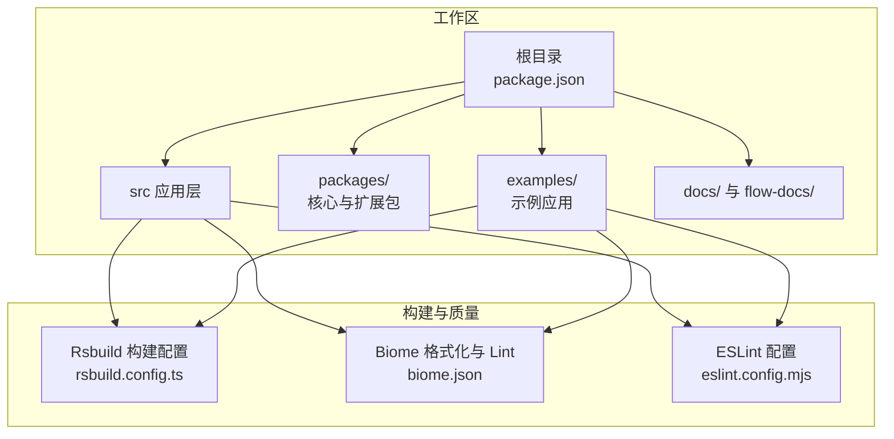
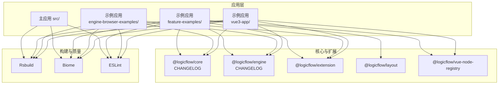
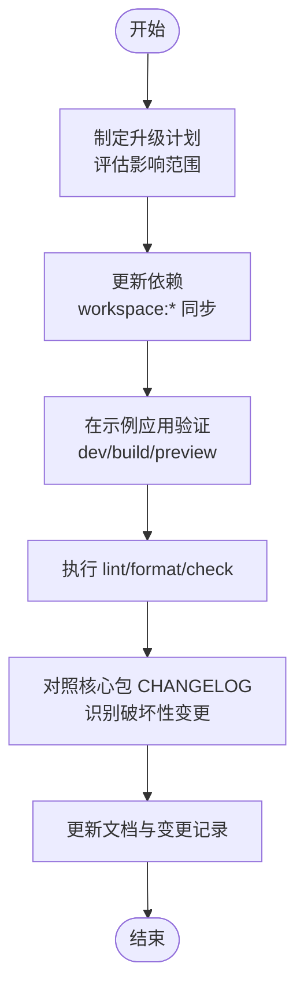
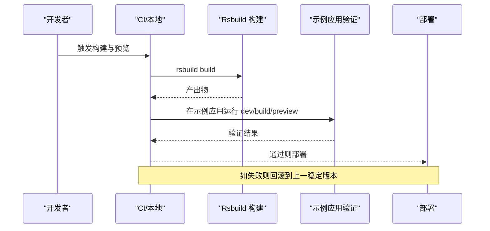
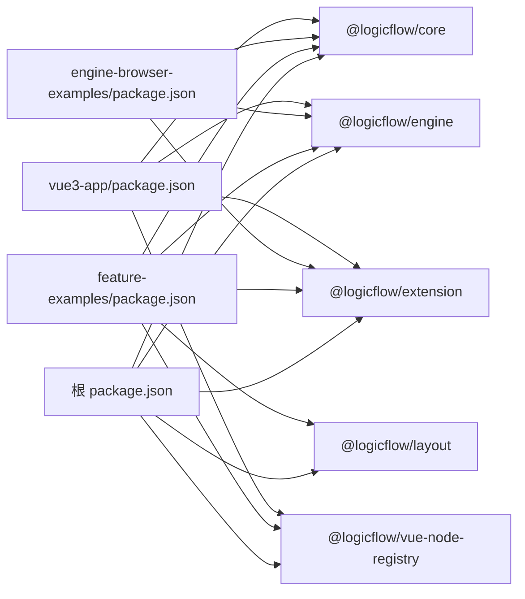

# 项目维护策略

<cite>
**本文引用的文件**
- [package.json](file://package.json)
- [README.md](file://README.md)
- [AGENTS.md](file://AGENTS.md)
- [biome.json](file://biome.json)
- [eslint.config.mjs](file://eslint.config.mjs)
- [rsbuild.config.ts](file://rsbuild.config.ts)
- [docs/提示词.md](file://docs/提示词.md)
- [flow-docs/logicflow-workflow-projects.md](file://flow-docs/logicflow-workflow-projects.md)
- [packages/core/CHANGELOG.md](file://packages/core/CHANGELOG.md)
- [packages/engine/CHANGELOG.md](file://packages/engine/CHANGELOG.md)
- [examples/feature-examples/package.json](file://examples/feature-examples/package.json)
- [examples/engine-browser-examples/package.json](file://examples/engine-browser-examples/package.json)
- [examples/vue3-app/package.json](file://examples/vue3-app/package.json)
</cite>

## 目录
1. [引言](#引言)
2. [项目结构](#项目结构)
3. [核心组件](#核心组件)
4. [架构总览](#架构总览)
5. [详细组件分析](#详细组件分析)
6. [依赖分析](#依赖分析)
7. [性能考量](#性能考量)
8. [故障排查指南](#故障排查指南)
9. [结论](#结论)
10. [附录](#附录)

## 引言
本指南面向“基于 Rsbuild 的 LogicFlow 流程图项目”的长期维护与演进，围绕依赖更新与版本管理、文档与知识库管理、性能监控与问题追踪、安全漏洞扫描与修复、备份与灾难恢复、发布与回滚、向后兼容性维护、技术债务管理等方面，提供可操作的策略与流程，确保项目的可持续发展与稳定运行。

## 项目结构
本仓库采用多包工作区组织，包含主应用与多个示例应用，以及 LogicFlow 生态相关包。Rsbuild 作为构建工具，配合 Biome、ESLint 等质量工具形成统一的开发与发布基线。

图表来源
- [package.json](file://package.json#L1-L45)
- [rsbuild.config.ts](file://rsbuild.config.ts#L1-L30)
- [biome.json](file://biome.json#L1-L35)
- [eslint.config.mjs](file://eslint.config.mjs#L1-L24)

章节来源
- [package.json](file://package.json#L1-L45)
- [README.md](file://README.md#L1-L37)
- [rsbuild.config.ts](file://rsbuild.config.ts#L1-L30)

## 核心组件
- 构建与打包：Rsbuild 提供 Vue、JSX、Less 插件链，统一开发与生产构建体验。
- 质量工具：Biome 负责格式化与自动修复；ESLint 保障 TS/Vue 代码风格与规则。
- 依赖与脚本：根脚本统一 dev/build/preview/format/lint/check，示例应用复用工作区依赖。
- 文档与知识库：docs 与 flow-docs 提供使用与集成指南，便于知识沉淀与检索。

章节来源
- [package.json](file://package.json#L6-L12)
- [biome.json](file://biome.json#L1-L35)
- [eslint.config.mjs](file://eslint.config.mjs#L1-L24)
- [rsbuild.config.ts](file://rsbuild.config.ts#L10-L29)
- [docs/提示词.md](file://docs/提示词.md#L1-L11)
- [flow-docs/logicflow-workflow-projects.md](file://flow-docs/logicflow-workflow-projects.md#L1-L316)

## 架构总览
项目采用“工作区 + 多示例 + 核心包”的架构，核心包通过 CHANGELOG 记录变更，示例应用验证集成与回归。

图表来源
- [examples/feature-examples/package.json](file://examples/feature-examples/package.json#L12-L22)
- [examples/engine-browser-examples/package.json](file://examples/engine-browser-examples/package.json#L12-L24)
- [examples/vue3-app/package.json](file://examples/vue3-app/package.json#L16-L29)
- [packages/core/CHANGELOG.md](file://packages/core/CHANGELOG.md#L1-L10)
- [packages/engine/CHANGELOG.md](file://packages/engine/CHANGELOG.md#L1-L17)
- [rsbuild.config.ts](file://rsbuild.config.ts#L10-L29)
- [biome.json](file://biome.json#L1-L35)
- [eslint.config.mjs](file://eslint.config.mjs#L1-L24)

## 详细组件分析

### 依赖更新与版本管理最佳实践
- 版本策略
  - 使用语义化版本，结合核心包 CHANGELOG 的“Major/Minor/Patch”记录，识别破坏性变更与功能迭代。
  - 示例应用通过 workspace:* 引用核心包，确保与主干同步，降低集成漂移。
- 更新流程
  - 依赖升级前：在示例应用中验证兼容性；执行 lint/format/check；构建与预览。
  - 依赖升级后：核对 CHANGELOG，确认破坏性变更与迁移要点；更新示例与文档。
- 工具协同
  - Biome 自动格式化与导入排序；ESLint 严格规则；Rsbuild 统一构建入口。
- 回归与验证
  - 在多示例应用中运行 dev/build/preview，覆盖不同框架组合（Vue/React/Umi/Vite）。

图表来源
- [package.json](file://package.json#L6-L12)
- [examples/feature-examples/package.json](file://examples/feature-examples/package.json#L12-L22)
- [examples/engine-browser-examples/package.json](file://examples/engine-browser-examples/package.json#L12-L24)
- [examples/vue3-app/package.json](file://examples/vue3-app/package.json#L16-L29)
- [packages/core/CHANGELOG.md](file://packages/core/CHANGELOG.md#L1-L10)
- [packages/engine/CHANGELOG.md](file://packages/engine/CHANGELOG.md#L1-L17)

章节来源
- [package.json](file://package.json#L14-L43)
- [examples/feature-examples/package.json](file://examples/feature-examples/package.json#L12-L22)
- [examples/engine-browser-examples/package.json](file://examples/engine-browser-examples/package.json#L12-L24)
- [examples/vue3-app/package.json](file://examples/vue3-app/package.json#L16-L29)
- [packages/core/CHANGELOG.md](file://packages/core/CHANGELOG.md#L1-L10)
- [packages/engine/CHANGELOG.md](file://packages/engine/CHANGELOG.md#L1-L17)

### 文档维护与知识库管理策略
- 文档分类
  - 快速指引：README 与各示例 README，提供安装与运行说明。
  - 使用指南：flow-docs 与 docs 下的提示词文档，沉淀集成与最佳实践。
- 维护流程
  - 新增功能或变更需同步更新对应文档；示例应用作为“活文档”，验证文档准确性。
  - 使用统一的标题与结构，便于检索与知识沉淀。
- 知识库建设
  - 将常见问题与解决方案沉淀为 FAQ 或 Troubleshooting 条目，结合 CHANGELOG 与示例应用定位问题。

章节来源
- [README.md](file://README.md#L1-L37)
- [AGENTS.md](file://AGENTS.md#L1-L26)
- [docs/提示词.md](file://docs/提示词.md#L1-L11)
- [flow-docs/logicflow-workflow-projects.md](file://flow-docs/logicflow-workflow-projects.md#L1-L316)

### 性能监控与问题追踪机制
- 性能基线
  - 使用 Rsbuild 构建产物进行体积与加载时间监控；在示例应用中对比不同配置的影响。
- 问题追踪
  - 以 CHANGELOG 为问题线索，结合示例应用最小复现；利用 ESLint/Biome 提前发现潜在性能隐患。
- 可观测性
  - 在应用层埋点关键指标（首屏、交互延迟、内存占用），结合示例应用验证优化效果。

章节来源
- [rsbuild.config.ts](file://rsbuild.config.ts#L10-L29)
- [eslint.config.mjs](file://eslint.config.mjs#L1-L24)
- [biome.json](file://biome.json#L1-L35)
- [packages/core/CHANGELOG.md](file://packages/core/CHANGELOG.md#L1-L10)

### 安全漏洞扫描与修复流程
- 扫描与评估
  - 定期运行依赖审计，关注核心包与示例应用的第三方依赖；结合 CHANGELOG 关注已知漏洞修复。
- 修复与验证
  - 优先升级到包含修复的版本；在示例应用中验证修复效果；更新文档与回归测试。
- 预防措施
  - 通过 ESLint/Biome 强制规则，减少引入高风险代码的可能性。

章节来源
- [package.json](file://package.json#L14-L43)
- [examples/feature-examples/package.json](file://examples/feature-examples/package.json#L12-L22)
- [examples/engine-browser-examples/package.json](file://examples/engine-browser-examples/package.json#L12-L24)
- [examples/vue3-app/package.json](file://examples/vue3-app/package.json#L16-L29)
- [packages/core/CHANGELOG.md](file://packages/core/CHANGELOG.md#L1-L10)
- [packages/engine/CHANGELOG.md](file://packages/engine/CHANGELOG.md#L1-L17)

### 备份策略与灾难恢复计划
- 数据备份
  - 代码与配置：Git 仓库即版本化备份；示例应用与文档定期同步。
  - 构建缓存：Rsbuild 缓存与包管理器缓存定期清理与校验。
- 灾难恢复
  - 通过工作区快速重建环境；示例应用作为“可恢复镜像”验证恢复结果。
  - CHANGELOG 作为“变更历史”辅助回溯与定位问题。

章节来源
- [README.md](file://README.md#L1-L37)
- [rsbuild.config.ts](file://rsbuild.config.ts#L10-L29)

### 发布流程与回滚机制
- 发布基线
  - 使用 Rsbuild 构建生产包；在本地预览验证；通过示例应用交叉验证。
- 回滚策略
  - 依据 CHANGELOG 识别破坏性变更；回滚到上一个稳定版本；必要时降级核心包版本。
- 变更记录
  - 以 CHANGELOG 为准，明确版本间差异与迁移步骤。

图表来源
- [package.json](file://package.json#L6-L12)
- [rsbuild.config.ts](file://rsbuild.config.ts#L10-L29)
- [examples/feature-examples/package.json](file://examples/feature-examples/package.json#L5-L11)
- [examples/engine-browser-examples/package.json](file://examples/engine-browser-examples/package.json#L6-L11)
- [examples/vue3-app/package.json](file://examples/vue3-app/package.json#L6-L15)

章节来源
- [package.json](file://package.json#L6-L12)
- [rsbuild.config.ts](file://rsbuild.config.ts#L10-L29)
- [packages/core/CHANGELOG.md](file://packages/core/CHANGELOG.md#L1-L10)
- [packages/engine/CHANGELOG.md](file://packages/engine/CHANGELOG.md#L1-L17)

### 向后兼容性维护原则
- 以 CHANGELOG 为依据，识别破坏性变更（Major）与兼容修复（Patch）。
- 在示例应用中验证兼容性矩阵，确保主流框架组合（Vue/React/Umi/Vite）稳定。
- 对外暴露 API 的变更需提供迁移指南与过渡方案。

章节来源
- [packages/core/CHANGELOG.md](file://packages/core/CHANGELOG.md#L1-L10)
- [packages/engine/CHANGELOG.md](file://packages/engine/CHANGELOG.md#L1-L17)
- [examples/feature-examples/package.json](file://examples/feature-examples/package.json#L12-L22)
- [examples/engine-browser-examples/package.json](file://examples/engine-browser-examples/package.json#L12-L24)
- [examples/vue3-app/package.json](file://examples/vue3-app/package.json#L16-L29)

### 长期维护的技术债务管理策略
- 规范先行：ESLint/Biome 统一风格与质量门槛，减少技术债产生。
- 可观测性：在应用层与示例应用中建立性能与稳定性指标，持续监控。
- 文档驱动：将决策与变更记录在文档与 CHANGELOG 中，形成知识资产。
- 迭代改进：定期回顾与重构，优先处理影响面广、修复成本低的债务。

章节来源
- [eslint.config.mjs](file://eslint.config.mjs#L1-L24)
- [biome.json](file://biome.json#L1-L35)
- [flow-docs/logicflow-workflow-projects.md](file://flow-docs/logicflow-workflow-projects.md#L1-L316)

## 依赖分析
- 核心依赖
  - @logicflow/core、@logicflow/engine、@logicflow/extension、@logicflow/layout、@logicflow/vue-node-registry 等为核心生态包，版本需与示例应用保持一致。
- 示例应用依赖
  - feature-examples 使用 Umi；engine-browser-examples 使用 Vite；vue3-app 使用 Vite 与 Vue3；均通过 workspace:* 引用核心包。
- 质量工具
  - Biome 与 ESLint 配置集中管理，确保跨包一致性。

图表来源
- [package.json](file://package.json#L14-L43)
- [examples/feature-examples/package.json](file://examples/feature-examples/package.json#L12-L22)
- [examples/engine-browser-examples/package.json](file://examples/engine-browser-examples/package.json#L12-L24)
- [examples/vue3-app/package.json](file://examples/vue3-app/package.json#L16-L29)

章节来源
- [package.json](file://package.json#L14-L43)
- [examples/feature-examples/package.json](file://examples/feature-examples/package.json#L12-L22)
- [examples/engine-browser-examples/package.json](file://examples/engine-browser-examples/package.json#L12-L24)
- [examples/vue3-app/package.json](file://examples/vue3-app/package.json#L16-L29)

## 性能考量
- 构建优化：Rsbuild 插件链（Vue、JSX、Less）统一入口，减少重复配置与构建差异。
- 代码质量：Biome 自动格式化与导入排序，ESLint 严格规则，降低潜在性能隐患。
- 示例验证：在多示例应用中对比不同配置的性能表现，形成基线。

章节来源
- [rsbuild.config.ts](file://rsbuild.config.ts#L10-L29)
- [biome.json](file://biome.json#L1-L35)
- [eslint.config.mjs](file://eslint.config.mjs#L1-L24)

## 故障排查指南
- 常见问题定位
  - 通过 CHANGELOG 快速定位破坏性变更与修复；在示例应用中最小化复现。
- 质量工具辅助
  - 使用 Biome 格式化与自动修复；使用 ESLint 检查规则违规。
- 预览与验证
  - 使用 Rsbuild 预览生产构建，确认运行与交互无异常。

章节来源
- [AGENTS.md](file://AGENTS.md#L18-L26)
- [biome.json](file://biome.json#L1-L35)
- [eslint.config.mjs](file://eslint.config.mjs#L1-L24)
- [package.json](file://package.json#L6-L12)

## 结论
通过统一的构建与质量工具、严格的版本与变更记录、完善的示例验证与文档体系，本项目形成了可维护、可演进、可持续的工程基线。遵循本文策略，可在保证稳定性的同时，持续提升开发效率与交付质量。

## 附录
- 快速命令参考
  - 开发：pnpm run dev
  - 构建：pnpm run build
  - 预览：pnpm run preview
  - 格式化：pnpm run format
  - Lint：pnpm run lint
  - 自检：pnpm run check
- 参考资源
  - Rsbuild 文档与仓库
  - LogicFlow 官方文档与示例

章节来源
- [README.md](file://README.md#L1-L37)
- [AGENTS.md](file://AGENTS.md#L1-L26)