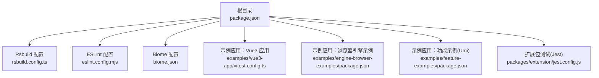
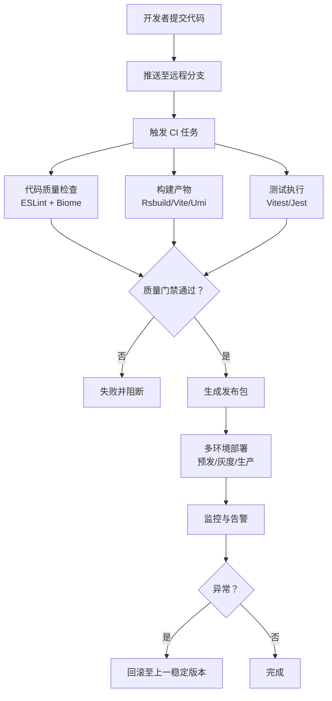
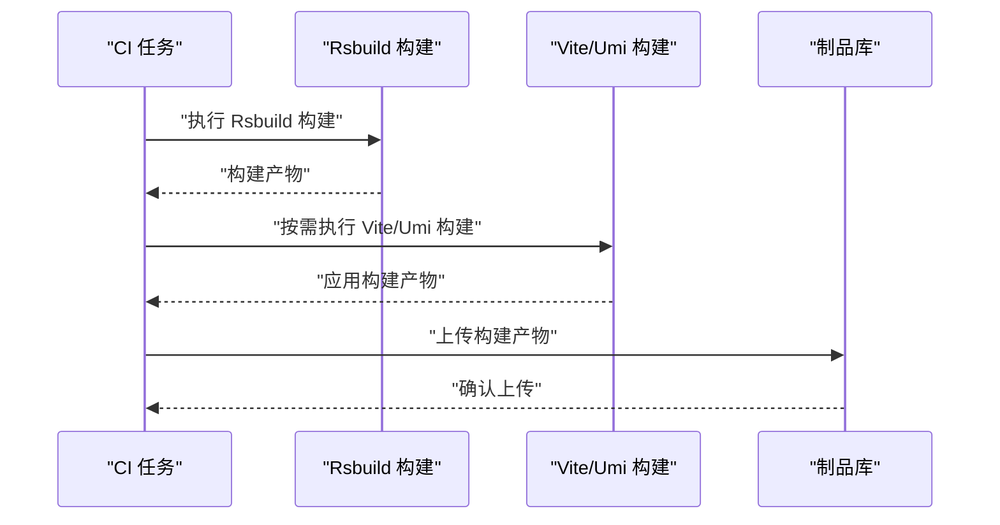
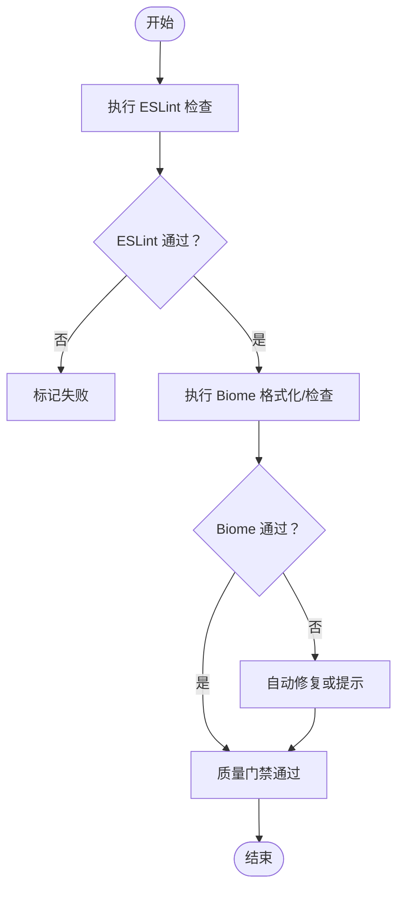
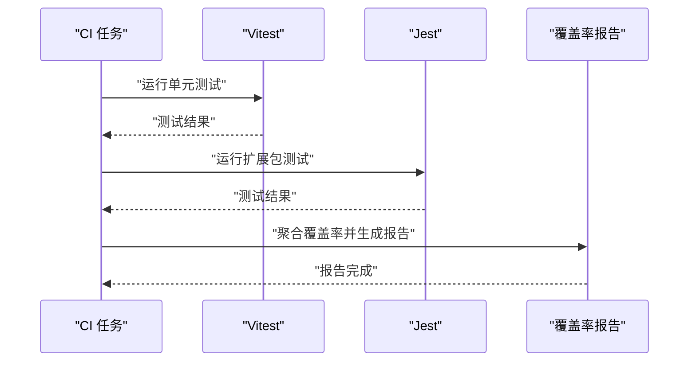
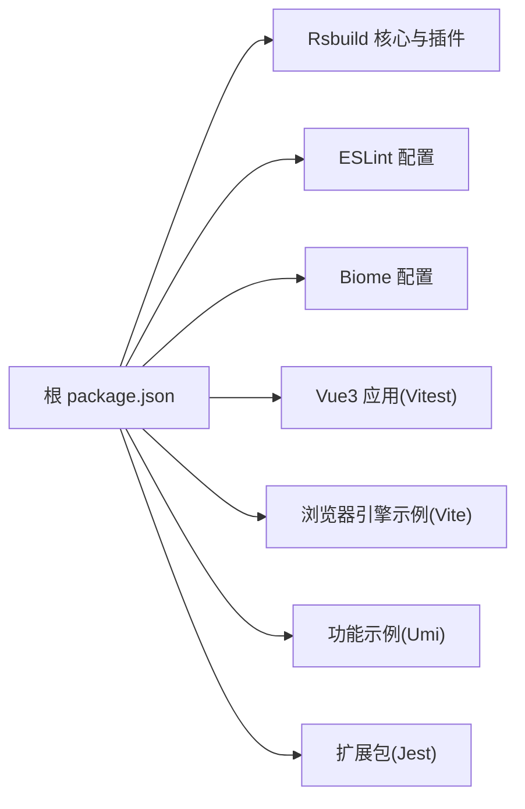

# CI/CD 流水线

<cite>
**本文引用的文件**
- [package.json](file://package.json)
- [rsbuild.config.ts](file://rsbuild.config.ts)
- [eslint.config.mjs](file://eslint.config.mjs)
- [biome.json](file://biome.json)
- [examples/vue3-app/vitest.config.ts](file://examples/vue3-app/vitest.config.ts)
- [packages/extension/jest.config.js](file://packages/extension/jest.config.js)
- [examples/engine-browser-examples/package.json](file://examples/engine-browser-examples/package.json)
- [examples/feature-examples/package.json](file://examples/feature-examples/package.json)
</cite>

## 目录
1. [简介](#简介)
2. [项目结构](#项目结构)
3. [核心组件](#核心组件)
4. [架构总览](#架构总览)
5. [详细组件分析](#详细组件分析)
6. [依赖分析](#依赖分析)
7. [性能考虑](#性能考虑)
8. [故障排查指南](#故障排查指南)
9. [结论](#结论)
10. [附录](#附录)

## 简介
本指南面向开发团队，提供基于当前仓库的 CI/CD 流水线完整配置方案。项目采用 Rsbuild 构建工具与多框架示例（Vue、React、Umi），并集成了 ESLint、Biome、Jest、Vitest 等质量与测试工具。本文将从自动化构建、测试、部署、多环境与分支管理、代码质量与安全扫描、性能回归测试、蓝绿/灰度发布与回滚、持续交付最佳实践与监控告警等方面，给出可落地的流水线设计与实施建议。

## 项目结构
该仓库为多包结构，包含核心库与多个示例应用。Rsbuild 作为统一构建入口，配合各示例应用的独立脚本与测试配置，形成“统一构建 + 多应用发布”的流水线基础。

图表来源
- [package.json](file://package.json#L1-L45)
- [rsbuild.config.ts](file://rsbuild.config.ts#L1-L30)
- [eslint.config.mjs](file://eslint.config.mjs#L1-L24)
- [biome.json](file://biome.json#L1-L35)
- [examples/vue3-app/vitest.config.ts](file://examples/vue3-app/vitest.config.ts#L1-L15)
- [examples/engine-browser-examples/package.json](file://examples/engine-browser-examples/package.json#L1-L39)
- [examples/feature-examples/package.json](file://examples/feature-examples/package.json#L1-L29)
- [packages/extension/jest.config.js](file://packages/extension/jest.config.js#L1-L199)

章节来源
- [package.json](file://package.json#L1-L45)
- [rsbuild.config.ts](file://rsbuild.config.ts#L1-L30)
- [eslint.config.mjs](file://eslint.config.mjs#L1-L24)
- [biome.json](file://biome.json#L1-L35)
- [examples/vue3-app/vitest.config.ts](file://examples/vue3-app/vitest.config.ts#L1-L15)
- [examples/engine-browser-examples/package.json](file://examples/engine-browser-examples/package.json#L1-L39)
- [examples/feature-examples/package.json](file://examples/feature-examples/package.json#L1-L29)
- [packages/extension/jest.config.js](file://packages/extension/jest.config.js#L1-L199)

## 核心组件
- 构建与打包
  - 使用 Rsbuild 作为统一构建工具，支持 Vue、JSX、Babel、Less 插件组合，提供 alias 路径别名与开发服务器配置。
  - 示例应用各自维护独立构建脚本（如 Vite、Umi），可在流水线中按需选择执行。
- 质量与规范
  - ESLint：通过 flat 配置启用 Vue/TS 规则与忽略路径。
  - Biome：启用格式化、导入排序、VCS 集成与推荐规则。
- 测试
  - Vitest：用于 Vue3 示例应用的单元测试配置，指定 jsdom 环境与排除 e2e 目录。
  - Jest：扩展包的测试配置，设置覆盖率输出目录、模块映射与 jsdom 环境。
- 版本与脚本
  - 根 package.json 定义了 build、lint、check、format、dev、preview 等常用脚本，便于流水线统一调用。

章节来源
- [rsbuild.config.ts](file://rsbuild.config.ts#L1-L30)
- [eslint.config.mjs](file://eslint.config.mjs#L1-L24)
- [biome.json](file://biome.json#L1-L35)
- [examples/vue3-app/vitest.config.ts](file://examples/vue3-app/vitest.config.ts#L1-L15)
- [packages/extension/jest.config.js](file://packages/extension/jest.config.js#L1-L199)
- [package.json](file://package.json#L6-L12)

## 架构总览
下图展示一次典型的 CI/CD 流水线在不同阶段的职责与交互关系。流水线以“质量门禁 + 构建 + 测试 + 打包 + 发布”为主线，结合多环境与分支策略，确保变更在进入生产前经过充分验证。

## 详细组件分析

### 构建与打包流水线
- Rsbuild 统一构建
  - 在根目录使用 Rsbuild 进行构建，配置插件包括 Babel、Vue、JSX、Less，并设置路径别名与开发服务器参数。
  - 建议在流水线中固定 Node 与 pnpm 版本，确保构建一致性。
- 示例应用构建
  - Vue3 应用使用 Vitest 配置，可通过 npm scripts 或直接调用 Vite 进行构建。
  - 浏览器引擎示例与功能示例分别使用 Vite 与 Umi 的构建脚本，流水线可按需选择执行。
- 多包发布
  - 若存在独立包（如扩展包），可在流水线中单独构建并发布到包管理器或制品库。

图表来源
- [rsbuild.config.ts](file://rsbuild.config.ts#L1-L30)
- [examples/vue3-app/vitest.config.ts](file://examples/vue3-app/vitest.config.ts#L1-L15)
- [examples/engine-browser-examples/package.json](file://examples/engine-browser-examples/package.json#L6-L11)
- [examples/feature-examples/package.json](file://examples/feature-examples/package.json#L5-L11)

章节来源
- [rsbuild.config.ts](file://rsbuild.config.ts#L1-L30)
- [examples/vue3-app/vitest.config.ts](file://examples/vue3-app/vitest.config.ts#L1-L15)
- [examples/engine-browser-examples/package.json](file://examples/engine-browser-examples/package.json#L6-L11)
- [examples/feature-examples/package.json](file://examples/feature-examples/package.json#L5-L11)

### 质量门禁与代码规范
- ESLint
  - 使用 @vue/eslint-config-typescript 的 flat 配置，覆盖 TS/TSX/Vue 文件，忽略 dist/coverage 等目录。
  - 建议在流水线中执行 lint 并将结果作为门禁条件之一。
- Biome
  - 启用格式化、导入排序、VCS 集成与推荐规则；可结合写入模式自动修复部分问题。
  - 建议在 PR 中强制执行 check/format，避免引入格式化差异。

图表来源
- [eslint.config.mjs](file://eslint.config.mjs#L14-L23)
- [biome.json](file://biome.json#L28-L34)
- [package.json](file://package.json#L8-L12)

章节来源
- [eslint.config.mjs](file://eslint.config.mjs#L1-L24)
- [biome.json](file://biome.json#L1-L35)
- [package.json](file://package.json#L8-L12)

### 测试与覆盖率
- 单元测试
  - Vitest：针对 Vue3 示例应用，使用 jsdom 环境，排除 e2e 目录，适合在 CI 中快速执行。
  - Jest：扩展包测试，配置覆盖率输出目录与模块映射，适合作为独立包的测试基线。
- 建议
  - 在流水线中分别执行 Vitest 与 Jest，并生成覆盖率报告，作为质量门禁的一部分。
  - 对于前端应用，可增加端到端测试（如 Playwright/Cypress）以补充覆盖。

图表来源
- [examples/vue3-app/vitest.config.ts](file://examples/vue3-app/vitest.config.ts#L8-L12)
- [packages/extension/jest.config.js](file://packages/extension/jest.config.js#L27-L35)

章节来源
- [examples/vue3-app/vitest.config.ts](file://examples/vue3-app/vitest.config.ts#L1-L15)
- [packages/extension/jest.config.js](file://packages/extension/jest.config.js#L1-L199)

### 多环境部署与分支管理
- 分支策略
  - 主干保护：master/main 仅允许通过合并请求（含评审与流水线通过）进入。
  - 预发布：feature/* -> develop -> release/* -> master，release 分支用于预发与灰度验证。
  - 热修复：hotfix/* 直接合并至 master 并打标签，随后回流 develop。
- 多环境
  - 开发/预发/生产三环境，镜像/容器/静态资源按环境区分，制品库按环境隔离。
- 自动化发布
  - 通过标签触发流水线，自动识别版本号并发布到对应环境。
  - 对于静态站点，可直接发布到 CDN 或对象存储；对于容器应用，推送镜像并触发编排系统。

章节来源
- [package.json](file://package.json#L6-L12)

### 蓝绿部署、灰度发布与回滚
- 蓝绿部署
  - 两套环境并行运行，流量在两者间切换；通过配置中心或负载均衡器进行切换。
- 灰度发布
  - 以百分比或用户维度逐步放量，结合监控指标（成功率、延迟、错误率）动态调整。
- 回滚
  - 记录每次发布版本与镜像/制品信息；异常时一键回滚至上一稳定版本。
- 建议
  - 将发布记录与制品库关联，确保可追溯性；结合健康检查与自动告警，降低风险。

章节来源
- [rsbuild.config.ts](file://rsbuild.config.ts#L19-L28)

### 性能回归测试
- 前端性能指标
  - 关注构建体积、首屏时间、交互延迟等指标；可在流水线中集成 Lighthouse 或 Web Vitals 报告。
- 建议
  - 将性能阈值纳入质量门禁，超过阈值则阻断发布。

章节来源
- [rsbuild.config.ts](file://rsbuild.config.ts#L1-L30)

### 持续交付最佳实践与监控告警
- 最佳实践
  - 小步快跑、自动化测试与门禁、可回滚、可观测性优先。
  - 将配置与代码同管，使用基础设施即代码（IaC）管理环境。
- 监控与告警
  - 指标：成功率、错误率、P95/P99 延迟、资源使用率。
  - 日志：结构化日志、关键链路追踪。
  - 告警：分级告警、静默窗口、收敛策略。

章节来源
- [package.json](file://package.json#L6-L12)

## 依赖分析
- 工具链依赖
  - Rsbuild 及其插件负责构建；ESLint 与 Biome 负责质量；Vitest/Jest 负责测试。
- 示例应用依赖
  - Vue3 应用依赖 Vitest；浏览器引擎示例与功能示例分别依赖 Vite 与 Umi。
- 锁定文件
  - 使用 pnpm lockfile 管理依赖版本，保证流水线与本地一致。

图表来源
- [package.json](file://package.json#L14-L43)
- [rsbuild.config.ts](file://rsbuild.config.ts#L1-L30)
- [eslint.config.mjs](file://eslint.config.mjs#L1-L24)
- [biome.json](file://biome.json#L1-L35)
- [examples/vue3-app/vitest.config.ts](file://examples/vue3-app/vitest.config.ts#L1-L15)
- [examples/engine-browser-examples/package.json](file://examples/engine-browser-examples/package.json#L12-L37)
- [examples/feature-examples/package.json](file://examples/feature-examples/package.json#L12-L27)
- [packages/extension/jest.config.js](file://packages/extension/jest.config.js#L1-L199)

章节来源
- [package.json](file://package.json#L14-L43)
- [pnpm-lock.yaml](file://pnpm-lock.yaml#L1-L200)

## 性能考虑
- 构建优化
  - 合理拆分包、启用压缩与 Tree-shaking；缓存依赖与构建产物。
- 测试效率
  - 并行执行测试、按文件粒度增量测试；将 e2e 与单元测试分离。
- 部署效率
  - 使用多阶段构建与镜像层缓存；CDN 加速静态资源。

## 故障排查指南
- 质量门禁失败
  - 检查 ESLint 与 Biome 输出，修复规则冲突与格式问题。
- 构建失败
  - 核对 Rsbuild 插件配置与别名设置；确认 Node/pnpm 版本与依赖安装。
- 测试失败
  - 查看 Vitest/Jest 输出与覆盖率报告；定位单测用例与模拟配置。
- 回滚操作
  - 检查发布记录与制品库版本；确认回滚目标版本可用。

章节来源
- [eslint.config.mjs](file://eslint.config.mjs#L14-L23)
- [biome.json](file://biome.json#L28-L34)
- [rsbuild.config.ts](file://rsbuild.config.ts#L1-L30)
- [examples/vue3-app/vitest.config.ts](file://examples/vue3-app/vitest.config.ts#L8-L12)
- [packages/extension/jest.config.js](file://packages/extension/jest.config.js#L27-L35)

## 结论
通过统一的 Rsbuild 构建入口、完善的 ESLint/Biome 质量体系、覆盖单元与覆盖率的测试流程，以及清晰的多环境与分支策略，本项目具备高效可靠的 CI/CD 基础。结合蓝绿/灰度发布与回滚机制、性能回归测试与监控告警，可进一步提升交付质量与稳定性。建议在团队内固化流水线模板与最佳实践，持续迭代优化。

## 附录
- GitHub Actions/GitLab CI 集成要点
  - 使用矩阵构建（多 Node 版本/多示例应用），并行加速。
  - 将构建产物与覆盖率报告上传制品库，便于审计与回溯。
  - 以标签/分支为触发条件，结合质量门禁与环境变量控制发布范围。
- 安全扫描
  - 依赖漏洞扫描（如 npm audit/pnpm audit）、许可证合规检查与 SAST（Source Code Security）集成。