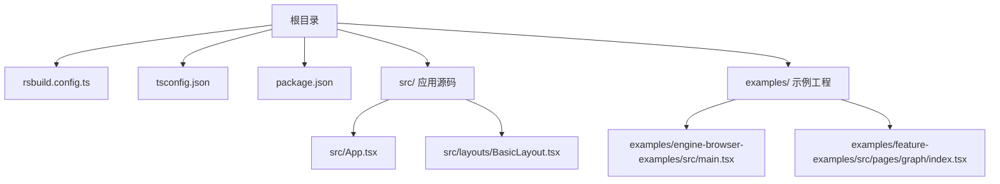
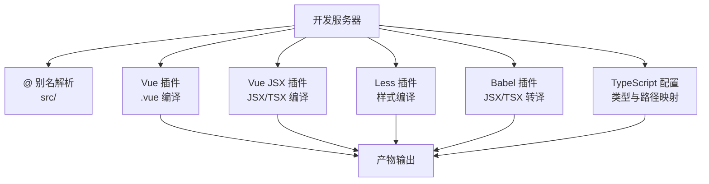
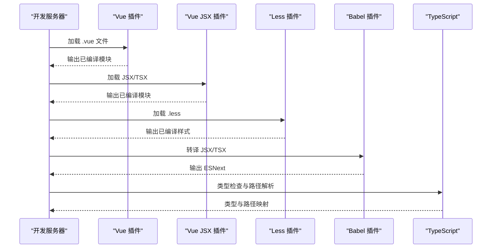
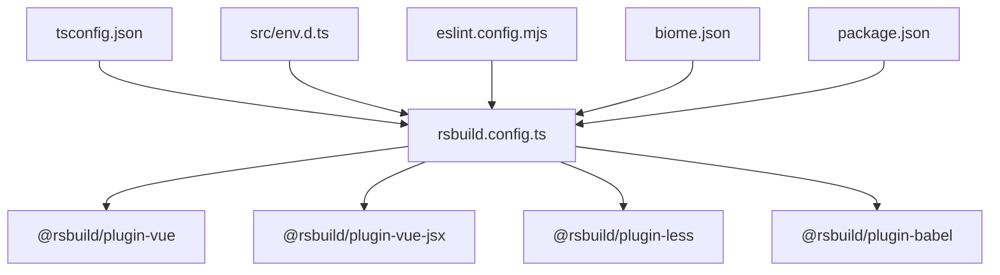

# Rsbuild 构建配置

<cite>
**本文引用的文件**
- [rsbuild.config.ts](file://rsbuild.config.ts)
- [package.json](file://package.json)
- [tsconfig.json](file://tsconfig.json)
- [eslint.config.mjs](file://eslint.config.mjs)
- [biome.json](file://biome.json)
- [src/App.tsx](file://src/App.tsx)
- [src/layouts/BasicLayout.tsx](file://src/layouts/BasicLayout.tsx)
- [src/env.d.ts](file://src/env.d.ts)
- [examples/engine-browser-examples/src/main.tsx](file://examples/engine-browser-examples/src/main.tsx)
- [examples/feature-examples/src/pages/graph/index.tsx](file://examples/feature-examples/src/pages/graph/index.tsx)
</cite>

## 目录
1. [简介](#简介)
2. [项目结构](#项目结构)
3. [核心组件](#核心组件)
4. [架构总览](#架构总览)
5. [详细组件分析](#详细组件分析)
6. [依赖关系分析](#依赖关系分析)
7. [性能考虑](#性能考虑)
8. [故障排查指南](#故障排查指南)
9. [结论](#结论)
10. [附录](#附录)

## 简介
本文件面向前端工程师，提供 Rsbuild 构建配置的完整参考手册。围绕 rsbuild.config.ts 的配置项进行逐项解析，涵盖插件系统（Vue、Vue JSX、Less、Babel）、开发服务器与别名路径、构建优化、TypeScript 集成、不同环境差异与最佳实践、性能优化与代码分割策略、资源处理规则等。文档同时结合项目中的实际使用场景（如 Vue 3 应用、React 示例工程），帮助读者快速落地并优化构建流程。

## 项目结构
该仓库采用多工程组织：根目录包含 Rsbuild 配置、TypeScript 配置、脚手架与示例工程；src 目录为应用主入口；examples 目录包含多个示例工程（如 React、Vue3、Next 等），便于对比不同框架在 Rsbuild 下的配置与运行方式。

图表来源
- [rsbuild.config.ts](file://rsbuild.config.ts#L1-L30)
- [tsconfig.json](file://tsconfig.json#L1-L33)
- [package.json](file://package.json#L1-L45)
- [src/App.tsx](file://src/App.tsx#L1-L20)
- [src/layouts/BasicLayout.tsx](file://src/layouts/BasicLayout.tsx#L1-L146)
- [examples/engine-browser-examples/src/main.tsx](file://examples/engine-browser-examples/src/main.tsx#L1-L78)
- [examples/feature-examples/src/pages/graph/index.tsx](file://examples/feature-examples/src/pages/graph/index.tsx#L1-L800)

章节来源
- [rsbuild.config.ts](file://rsbuild.config.ts#L1-L30)
- [package.json](file://package.json#L1-L45)

## 核心组件
- Rsbuild 核心配置：通过 defineConfig 统一导出配置对象，包含 plugins、dev、server、resolve 等关键字段。
- 插件体系：启用 @rsbuild/plugin-vue、@rsbuild/plugin-vue-jsx、@rsbuild/plugin-less、@rsbuild/plugin-babel，分别负责 Vue 单文件组件、JSX/TSX 编译、Less 样式编译与 Babel 转译。
- 开发服务器与别名：dev 与 server 字段用于开发体验与预览；resolve.alias 将 @ 指向 src，提升导入便捷性。
- TypeScript 集成：tsconfig.json 配置了目标语言、模块系统、路径映射与严格模式；src/env.d.ts 声明 Vue 模块类型，确保 IDE 与构建正确识别 .vue 文件。

章节来源
- [rsbuild.config.ts](file://rsbuild.config.ts#L10-L29)
- [tsconfig.json](file://tsconfig.json#L1-L33)
- [src/env.d.ts](file://src/env.d.ts#L1-L10)

## 架构总览
Rsbuild 在本项目中的工作流如下：启动开发服务器后，根据 resolve.alias 解析模块路径；Vue/JSX/TSX 文件由对应插件处理；Less 样式被编译注入；Babel 插件对 JSX/TSX 进行转译；TypeScript 类型检查与 ESLint/Biome 在开发与提交阶段协同保障质量。

图表来源
- [rsbuild.config.ts](file://rsbuild.config.ts#L10-L29)
- [tsconfig.json](file://tsconfig.json#L20-L24)

## 详细组件分析

### Rsbuild 配置项详解
- plugins
  - pluginVue：启用 Vue SFC 编译，支持模板、脚本与样式的统一处理。
  - pluginVueJsx：启用 Vue JSX/TSX 支持，配合 tsconfig.json 的 jsxImportSource 与 preserve。
  - pluginLess：启用 Less 编译，支持变量、嵌套与混合等特性。
  - pluginBabel：对 JSX/TSX 进行转译，include 指定匹配范围，避免不必要的处理。
- dev
  - 当前为空对象，可扩展热更新、端口、代理等开发体验相关配置。
- server
  - open: false，关闭自动打开浏览器，便于在多页面或多项目环境下集中管理。
- resolve.alias
  - 将 @ 映射到 src，简化相对路径导入，提升可读性与维护性。

章节来源
- [rsbuild.config.ts](file://rsbuild.config.ts#L10-L29)

### 插件系统与作用
- Vue 插件
  - 处理 .vue 文件的模板、脚本与样式，生成可在浏览器运行的代码。
  - 与 Vue JSX 插件配合，满足既有 SFC 与新式 JSX/TSX 的混合开发需求。
- Vue JSX 插件
  - 配合 tsconfig.json 的 jsxImportSource 与 preserve，确保在 Vue 生态中使用 JSX/TSX。
- Less 插件
  - 将 Less 编译为 CSS，支持变量与嵌套，便于主题化与模块化样式管理。
- Babel 插件
  - 对 JSX/TSX 进行转译，保证兼容性；include 限定处理范围，减少构建开销。

图表来源
- [rsbuild.config.ts](file://rsbuild.config.ts#L11-L18)
- [tsconfig.json](file://tsconfig.json#L8-L8)

章节来源
- [rsbuild.config.ts](file://rsbuild.config.ts#L11-L18)
- [tsconfig.json](file://tsconfig.json#L8-L8)

### 开发服务器与别名路径
- 开发服务器
  - server.open: false，避免在多终端或 CI 环境中自动弹窗。
  - 可扩展 devServer 选项（如端口、代理、HTTPS 等）以适配复杂网络环境。
- 别名路径
  - resolve.alias 将 @ 指向 src，统一导入路径，降低层级过深带来的维护成本。
  - tsconfig.json 的 baseUrl 与 paths 保持一致，确保编辑器与构建工具行为一致。

章节来源
- [rsbuild.config.ts](file://rsbuild.config.ts#L19-L28)
- [tsconfig.json](file://tsconfig.json#L20-L24)

### TypeScript 集成
- 目标与模块系统
  - target: ES2020，module: ESNext，moduleResolution: bundler，确保现代打包器的兼容性。
- JSX 与路径映射
  - jsx: preserve，jsxImportSource: vue，使 JSX/TSX 在 Vue 生态中保持原样交由插件处理。
  - baseUrl 与 paths 配合 Rsbuild 的 alias，实现一致的路径解析。
- 类型声明
  - src/env.d.ts 声明 .vue 模块类型，避免 IDE 与构建报错。

章节来源
- [tsconfig.json](file://tsconfig.json#L3-L18)
- [src/env.d.ts](file://src/env.d.ts#L1-L9)

### 不同环境下的配置差异与最佳实践
- 开发环境
  - 使用 devServer 的热更新与模块联邦（如需）提升迭代效率。
  - 保留 less/sass 等预处理器插件，提高样式开发效率。
- 生产环境
  - 启用压缩与 Tree Shaking（由打包器默认提供），结合 include 排除非必要文件，减少体积。
  - 使用稳定的 target 与 moduleResolution，确保产物在多运行时稳定。
- 跨框架项目
  - 通过插件组合（Vue + Vue JSX + Less + Babel）支持多技术栈共存。
  - 保持 tsconfig.json 与 Rsbuild alias 一致，避免路径解析不一致导致的错误。

章节来源
- [rsbuild.config.ts](file://rsbuild.config.ts#L11-L18)
- [tsconfig.json](file://tsconfig.json#L3-L18)

### 性能优化与代码分割
- 代码分割策略
  - 按路由拆分页面级模块，结合动态导入实现懒加载。
  - 将第三方库与业务代码分离，利用缓存提升二次加载速度。
- 资源处理
  - 图片、字体等静态资源建议使用 Rsbuild 的资源模块规则，自动进行 Base64 或文件输出。
  - CSS 提取与压缩（由打包器默认提供），减少首屏阻塞。
- 构建体积控制
  - include 仅处理必要的文件类型，避免对 node_modules 与测试文件进行无谓处理。
  - 合理使用别名与路径映射，减少重复解析与冗余路径。

章节来源
- [rsbuild.config.ts](file://rsbuild.config.ts#L12-L14)

### 资源处理规则与示例
- Vue 单文件组件
  - 通过 pluginVue 处理模板、脚本与样式，支持 scoped 与 CSS Modules。
- JSX/TSX
  - 通过 pluginVueJsx 与 Babel 插件共同处理，确保在 Vue 生态中使用现代语法。
- Less 样式
  - 通过 pluginLess 编译，结合全局样式与局部样式，实现主题化与模块化。
- 路由与页面
  - 示例工程展示了基于路由的页面组织方式，便于按需加载与缓存复用。

章节来源
- [rsbuild.config.ts](file://rsbuild.config.ts#L15-L17)
- [src/App.tsx](file://src/App.tsx#L1-L20)
- [src/layouts/BasicLayout.tsx](file://src/layouts/BasicLayout.tsx#L1-L146)
- [examples/engine-browser-examples/src/main.tsx](file://examples/engine-browser-examples/src/main.tsx#L1-L78)
- [examples/feature-examples/src/pages/graph/index.tsx](file://examples/feature-examples/src/pages/graph/index.tsx#L1-L800)

## 依赖关系分析
Rsbuild 配置与项目依赖的关系如下：Rsbuild 通过插件体系处理不同类型的源文件；TypeScript 配置与 env.d.ts 提供类型支持；ESLint 与 Biome 负责代码质量与格式化；package.json 定义脚本与依赖版本。

图表来源
- [rsbuild.config.ts](file://rsbuild.config.ts#L1-L6)
- [package.json](file://package.json#L28-L42)
- [tsconfig.json](file://tsconfig.json#L1-L33)
- [src/env.d.ts](file://src/env.d.ts#L1-L10)
- [eslint.config.mjs](file://eslint.config.mjs#L1-L24)
- [biome.json](file://biome.json#L1-L35)

章节来源
- [rsbuild.config.ts](file://rsbuild.config.ts#L1-L6)
- [package.json](file://package.json#L28-L42)

## 性能考虑
- 插件选择与 include 规则
  - 仅对 JSX/TSX 使用 Babel 插件，避免对 Vue/JSX/TSX 之外的文件进行转译。
- 路径解析优化
  - 使用 @ 别名与 baseUrl + paths，减少层级解析与拼写错误。
- 样式与资源
  - 合理拆分样式，避免单文件样式过大；静态资源按需引入，减少首屏体积。
- 类型与校验
  - TypeScript 严格模式与 ESLint/Biome 规则在开发阶段尽早发现问题，降低构建失败概率。

章节来源
- [rsbuild.config.ts](file://rsbuild.config.ts#L12-L14)
- [tsconfig.json](file://tsconfig.json#L20-L24)

## 故障排查指南
- Vue 模块类型报错
  - 确认 src/env.d.ts 已声明 .vue 模块类型，且 Rsbuild 与编辑器均能识别。
- 路径解析异常
  - 检查 tsconfig.json 的 baseUrl 与 paths 与 Rsbuild 的 alias 是否一致。
- JSX/TSX 编译问题
  - 确认 tsconfig.json 的 jsx 与 jsxImportSource 设置正确，并启用 pluginVueJsx 与 pluginBabel。
- 开发服务器无法打开浏览器
  - server.open 默认为 false，如需自动打开请显式设置为 true。
- ESLint/Biome 冲突
  - 若出现规则冲突，优先遵循 ESLint 的 flat 配置；Biome 作为格式化工具，避免与 ESLint 规则重复。

章节来源
- [src/env.d.ts](file://src/env.d.ts#L1-L9)
- [tsconfig.json](file://tsconfig.json#L8-L8)
- [rsbuild.config.ts](file://rsbuild.config.ts#L21-L23)
- [eslint.config.mjs](file://eslint.config.mjs#L14-L23)
- [biome.json](file://biome.json#L28-L33)

## 结论
本项目通过 Rsbuild 的插件化架构与 TypeScript 的强类型支持，实现了 Vue 与 JSX/TSX 的混合开发、Less 样式编译与 Babel 转译的高效组合。配合合理的别名路径与开发服务器配置，能够在多框架场景下获得一致的开发体验与良好的构建性能。建议在生产环境中进一步结合代码分割、资源优化与缓存策略，持续提升首屏性能与用户体验。

## 附录
- 常用脚本
  - dev：启动开发服务器
  - build：构建生产产物
  - preview：预览生产构建
  - lint/format/check：代码质量与格式化
- 推荐实践
  - 保持 Rsbuild 与 TypeScript 的路径配置一致
  - 仅对必要文件启用 Babel 转译
  - 使用别名统一导入路径，减少层级与拼写错误
  - 在多框架项目中，通过插件组合实现渐进式迁移

章节来源
- [package.json](file://package.json#L6-L12)